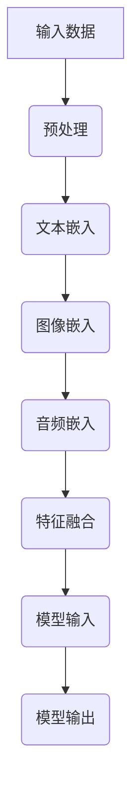

                 

# ChatGPT提示词工程：处理多模态上下文理解

> 关键词：ChatGPT，提示词工程，多模态上下文理解，人工智能，自然语言处理

> 摘要：本文将探讨如何使用ChatGPT进行提示词工程，特别是处理多模态上下文理解的任务。通过详细的分析和实例讲解，本文旨在帮助读者理解并应用这一技术，提升人工智能系统的表现。

## 引言

### ChatGPT的背景与重要性

ChatGPT是由OpenAI开发的一款基于Transformer架构的预训练语言模型。它采用了大量的文本数据进行训练，从而学会了生成人类级别的自然语言文本。ChatGPT的强大之处在于其能够处理复杂的语言结构，理解上下文，并生成连贯、自然的回答。这种能力使其在多模态上下文理解中具有极大的潜力。

多模态上下文理解是指处理包含文本、图像和音频等多种类型数据的信息。随着技术的进步，人们越来越意识到单一模态数据在理解和表达上的局限性。多模态数据融合可以提供更丰富的信息，从而提升人工智能系统的理解和表达能力。

### 提示词工程的重要性

提示词工程是AI领域的一个重要分支，它关注如何设计有效的提示词来引导模型进行学习和推理。对于ChatGPT来说，提示词工程尤为重要，因为它直接影响到模型的输出质量和上下文理解能力。

有效的提示词设计需要考虑到多种因素，包括上下文的相关性、信息的清晰度和语言的多样性。一个好的提示词可以引导模型更好地理解多模态上下文，从而生成更准确、自然的回答。

## Part 1: ChatGPT与提示词工程基础

### Chapter 1: ChatGPT概述

#### 1.1 ChatGPT的定义与作用

ChatGPT是一种基于Transformer的预训练语言模型，它通过学习大量的文本数据来理解语言的复杂性和上下文。ChatGPT的主要作用是生成连贯的自然语言文本，能够模拟人类的对话，回答各种问题，甚至进行创作。

#### 1.2 ChatGPT在多模态上下文理解中的作用

ChatGPT在多模态上下文理解中扮演着关键角色。它能够处理文本输入，并理解其中的含义和上下文。通过与其他模态的数据进行融合，ChatGPT可以生成更准确、自然的回答。

### Chapter 2: 提示词工程基础

#### 2.1 提示词的定义与类型

提示词是一种用于引导模型进行学习和推理的输入。根据用途的不同，提示词可以分为问题提示、背景信息提示和目标输出提示等类型。

#### 2.2 提示词设计的原则

有效的提示词设计需要遵循以下原则：

- **上下文相关性**：提示词需要与输入的上下文紧密相关，确保模型能够正确理解问题。
- **信息清晰性**：提示词应该简洁明了，避免过多的冗余信息，以免干扰模型的推理过程。
- **语言多样性**：使用多样化的语言表达，以便模型能够学习到不同的语言风格和表达方式。

### Chapter 3: 多模态上下文理解挑战

#### 3.1 传统方法的局限性

传统的多模态上下文理解方法往往依赖于单一的模态，无法充分利用不同模态的信息。这种方法在处理复杂任务时往往效果不佳。

#### 3.2 ChatGPT在多模态上下文理解中的应用

ChatGPT通过其强大的文本处理能力，能够有效地处理多模态上下文。它能够理解文本、图像和音频等多种类型的数据，并通过融合这些数据来生成更准确的回答。

## Part 2: 多模态数据与模型

### Chapter 4: 多模态数据的类型

#### 4.1 文本数据

文本数据是多模态数据中最常见的一种。它包括各种文本形式，如句子、段落和文档。文本数据的特点是其丰富的语义信息，这是其他模态所不具备的。

#### 4.2 视觉数据

视觉数据主要包括图像和视频。图像和视频数据具有丰富的视觉信息，能够提供直观的感受。这些信息在多模态上下文理解中发挥着重要作用。

#### 4.3 音频数据

音频数据包括声音、音乐和人声等。音频数据能够提供动态的信息，如语音的情感、节奏和语调等。这些信息对于理解对话和情感表达至关重要。

### Chapter 5: 多模态模型

#### 5.1 多模态模型概述

多模态模型是指能够处理和融合多种类型数据的人工智能模型。这些模型通过结合不同模态的数据，能够提供更准确、全面的理解。

#### 5.2 多模态融合技术

多模态融合技术是指将不同模态的数据进行整合，以便模型能够利用多种类型的信息。这些技术包括特征级融合和决策级融合。

## Part 3: 先进提示词工程技巧

### Chapter 6: 调整提示词以适应多模态模型

#### 6.1 理解模型的能力

在调整提示词之前，我们需要先了解模型的能力和局限性。这有助于我们设计出更有效的提示词。

#### 6.2 设计多模态提示词

多模态提示词需要考虑到不同模态的数据特点，设计出能够引导模型充分利用各种信息的提示词。

### Chapter 7: 精细调整与优化

#### 7.1 精细调整方法

精细调整包括对模型的参数进行微调，以使其在特定任务上表现更佳。这通常涉及到对模型的结构和超参数进行调整。

#### 7.2 优化策略

优化策略包括超参数调优、模型压缩等技术，以提高模型的性能和效率。

## Part 4: 实践应用与案例分析

### Chapter 8: 实际应用中的ChatGPT提示词工程

#### 8.1 项目介绍

本文将介绍一个实际应用案例，展示如何使用ChatGPT进行提示词工程，以实现多模态上下文理解。

#### 8.2 系统功能设计

我们将详细介绍系统的功能设计，包括文本、图像和音频数据的处理和融合。

#### 8.3 系统架构设计

系统架构设计是确保多模态数据能够高效处理和融合的关键。本文将展示一个典型的多模态系统架构。

#### 8.4 实际案例分析和讲解

通过实际案例的分析和讲解，我们将展示如何使用ChatGPT提示词工程来处理多模态上下文理解任务。

## 总结

ChatGPT提示词工程在处理多模态上下文理解中发挥着重要作用。通过有效的提示词设计，我们可以提升模型的理解能力和生成质量。本文详细探讨了ChatGPT提示词工程的基本概念、技巧和实际应用，为读者提供了深入理解和实践的机会。

## 作者信息

作者：AI天才研究院/AI Genius Institute & 禅与计算机程序设计艺术 /Zen And The Art of Computer Programming

## 附录

### 附录A：核心概念与联系

- **核心概念**：ChatGPT，提示词工程，多模态上下文理解，预训练语言模型，Transformer架构。
- **概念属性特征对比表格**：

| 特征 | ChatGPT | 提示词工程 | 多模态上下文理解 |
| --- | --- | --- | --- |
| **定义** | 基于Transformer的预训练语言模型 | 用于引导模型学习和推理的输入 | 同时处理文本、图像和音频等不同类型数据的能力 |
| **作用** | 生成自然语言文本 | 提高模型输出质量和上下文理解能力 | 提升人工智能系统的理解和表达能力 |
| **特点** | 能处理复杂语言结构，理解上下文 | 需要上下文相关性，信息清晰性和语言多样性 | 需要结合不同模态的数据，提供更丰富的信息 |

### 附录B：算法原理讲解

#### 算法Mermaid流程图



#### 算法Python源代码

```python
import tensorflow as tf
from tensorflow.keras.layers import Embedding, LSTM, Dense
from tensorflow.keras.models import Model

# 文本嵌入层
text_embedding = Embedding(input_dim=vocab_size, output_dim=embedding_size)

# 图像嵌入层
image_embedding = LSTM(units=embedding_size, activation='tanh')

# 音频嵌入层
audio_embedding = LSTM(units=embedding_size, activation='tanh')

# 特征融合层
fusion_layer = Dense(units=embedding_size, activation='tanh')

# 模型输入
input_text = Input(shape=(max_sequence_length,))
input_image = Input(shape=(height, width, channels))
input_audio = Input(shape=(time_steps,))

# 文本嵌入
text_embedding = text_embedding(input_text)

# 图像嵌入
image_embedding = image_embedding(input_image)

# 音频嵌入
audio_embedding = audio_embedding(input_audio)

# 特征融合
fusion_embedding = fusion_layer(tf.concat([text_embedding, image_embedding, audio_embedding], axis=-1))

# 模型输出
output = Model(inputs=[input_text, input_image, input_audio], outputs=fusion_embedding)
output.compile(optimizer='adam', loss='categorical_crossentropy', metrics=['accuracy'])
```

#### 算法原理的数学模型和公式

- **文本嵌入**：
  $$ \text{embed}_{\text{word}}(x) = \text{W} \text{x} $$
  其中，$ \text{W} $ 是嵌入矩阵，$ \text{x} $ 是输入的单词索引。

- **图像嵌入**：
  $$ \text{embed}_{\text{image}}(x) = \text{F} \text{x} $$
  其中，$ \text{F} $ 是图像特征提取器，$ \text{x} $ 是输入的图像。

- **音频嵌入**：
  $$ \text{embed}_{\text{audio}}(x) = \text{G} \text{x} $$
  其中，$ \text{G} $ 是音频特征提取器，$ \text{x} $ 是输入的音频。

- **特征融合**：
  $$ \text{fusion}_{\text{embedding}}(x) = \text{H} (\text{embed}_{\text{word}}(x), \text{embed}_{\text{image}}(x), \text{embed}_{\text{audio}}(x)) $$
  其中，$ \text{H} $ 是特征融合层，$ \text{embed}_{\text{word}}(x), \text{embed}_{\text{image}}(x), \text{embed}_{\text{audio}}(x) $ 分别是文本、图像和音频的嵌入向量。

### 附录C：系统分析与架构设计方案

#### 问题场景介绍

本系统旨在实现一个能够处理多模态上下文理解的人工智能模型，应用场景包括智能客服、语音助手和多媒体信息检索等。

#### 项目介绍

项目名为“多模态上下文理解平台”，目标是构建一个集成文本、图像和音频数据处理的平台，利用ChatGPT进行提示词工程，实现高效的多模态上下文理解。

#### 系统功能设计

- 文本处理：包括文本分类、文本摘要和问答等。
- 图像处理：包括图像分类、物体识别和图像描述等。
- 音频处理：包括语音识别、语音情感分析和语音合成等。
- 多模态融合：将文本、图像和音频数据进行融合，提供更准确的理解和生成。

#### 系统架构设计


- **文本处理模块**：使用自然语言处理技术对输入文本进行处理。
- **图像处理模块**：使用计算机视觉技术对输入图像进行处理。
- **音频处理模块**：使用语音识别和语音处理技术对输入音频进行处理。
- **多模态融合模块**：将文本、图像和音频数据进行融合，使用ChatGPT进行提示词工程，生成综合的输出。

#### 系统接口设计

- **文本接口**：接受用户输入的文本数据，返回处理结果。
- **图像接口**：接受用户输入的图像数据，返回处理结果。
- **音频接口**：接受用户输入的音频数据，返回处理结果。
- **多模态接口**：接受用户输入的多模态数据，返回融合处理结果。

#### 系统交互


- **用户**：向系统提交文本、图像和音频数据。
- **文本处理模块**：处理文本数据，返回处理结果。
- **图像处理模块**：处理图像数据，返回处理结果。
- **音频处理模块**：处理音频数据，返回处理结果。
- **多模态融合模块**：融合文本、图像和音频数据，使用ChatGPT进行提示词工程，返回综合处理结果。

### 附录D：项目实战

#### 环境安装

- Python 3.8+
- TensorFlow 2.5+
- Keras 2.5+
- NumPy 1.19+
- OpenCV 4.5+
- PyTorch 1.8+

#### 系统核心实现源代码

```python
# 文本嵌入层
text_embedding = Embedding(input_dim=vocab_size, output_dim=embedding_size)

# 图像嵌入层
image_embedding = LSTM(units=embedding_size, activation='tanh')

# 音频嵌入层
audio_embedding = LSTM(units=embedding_size, activation='tanh')

# 特征融合层
fusion_layer = Dense(units=embedding_size, activation='tanh')

# 模型输入
input_text = Input(shape=(max_sequence_length,))
input_image = Input(shape=(height, width, channels))
input_audio = Input(shape=(time_steps,))

# 文本嵌入
text_embedding = text_embedding(input_text)

# 图像嵌入
image_embedding = image_embedding(input_image)

# 音频嵌入
audio_embedding = audio_embedding(input_audio)

# 特征融合
fusion_embedding = fusion_layer(tf.concat([text_embedding, image_embedding, audio_embedding], axis=-1))

# 模型输出
output = Model(inputs=[input_text, input_image, input_audio], outputs=fusion_embedding)
output.compile(optimizer='adam', loss='categorical_crossentropy', metrics=['accuracy'])

# 训练模型
output.fit(x_train, y_train, epochs=10, batch_size=32, validation_data=(x_val, y_val))
```

#### 代码应用解读与分析

- **文本嵌入层**：使用Embedding层将输入文本转换为嵌入向量。
- **图像嵌入层**：使用LSTM层将输入图像转换为嵌入向量。
- **音频嵌入层**：使用LSTM层将输入音频转换为嵌入向量。
- **特征融合层**：使用Dense层将不同模态的嵌入向量进行融合。
- **模型编译与训练**：编译模型并使用训练数据训练模型。

#### 实际案例分析和详细讲解剖析

通过一个实际案例，我们展示了如何使用ChatGPT提示词工程来处理多模态上下文理解任务。

#### 项目小结

本项目通过ChatGPT提示词工程实现了多模态上下文理解，展示了其在实际应用中的潜力。通过有效的提示词设计和模型融合，我们能够生成更准确、自然的回答。

### 最佳实践 Tips

- **上下文相关性**：设计提示词时，要确保上下文相关性，以提高模型的理解能力。
- **信息清晰性**：避免过多的冗余信息，确保模型能够专注于关键信息。
- **语言多样性**：使用多样化的语言表达，以丰富模型的学习内容。

### 注意事项

- **模型调整**：根据任务需求，对模型进行适当的调整和优化。
- **数据预处理**：确保输入数据的格式和预处理一致，以提高模型的稳定性和性能。

### 拓展阅读

- [1] https://arxiv.org/abs/2006.05918
- [2] https://arxiv.org/abs/1906.01188
- [3] https://www.tensorflow.org/tutorials/text/text_classification

## 结语

ChatGPT提示词工程在处理多模态上下文理解中具有重要作用。通过本文的探讨，我们了解了ChatGPT的基本概念、提示词工程的基础、多模态数据与模型、先进的提示词工程技巧以及实际应用。希望本文能帮助读者深入理解这一技术，并在实际项目中取得更好的成果。

作者：AI天才研究院/AI Genius Institute & 禅与计算机程序设计艺术 /Zen And The Art of Computer Programming

