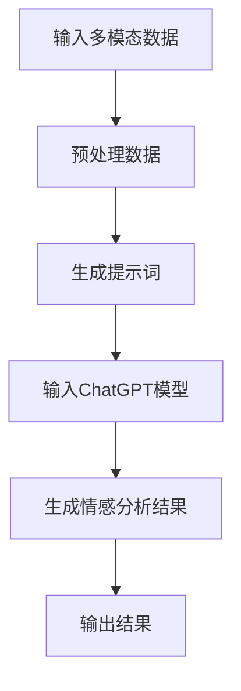
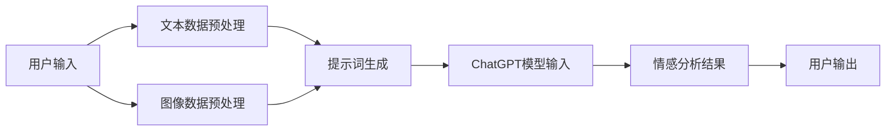

                 

# ChatGPT提示词工程：处理多模态情感分析

## 关键词
- ChatGPT提示词工程
- 多模态情感分析
- 算法原理
- 数学模型
- 系统架构
- 项目实战

## 摘要
本文将深入探讨ChatGPT提示词工程在处理多模态情感分析中的应用。我们将从背景介绍、核心概念与联系、算法原理讲解、数学模型和数学公式讲解、系统分析与架构设计、项目实战、以及最佳实践等方面展开详细论述，旨在帮助读者全面了解和掌握这一领域的核心技术。

## 步骤 1：背景介绍

### 核心概念术语说明
在开始讨论ChatGPT提示词工程之前，我们需要明确一些关键术语，包括：

- **ChatGPT**：基于GPT-3模型开发的大型语言模型，能够理解并生成自然语言文本。
- **提示词工程**：设计高质量的提示词，引导模型生成所需的输出，是提升模型性能的关键环节。
- **多模态情感分析**：对文本、图像、声音等多模态数据中的情感信息进行提取和分析。

### 问题背景
随着互联网的快速发展，用户生成内容（UGC）的数量呈爆炸式增长，这为情感分析带来了巨大的挑战。传统的单一模态情感分析已经无法满足复杂应用场景的需求。因此，多模态情感分析逐渐成为研究的热点。

### 问题描述
多模态情感分析的目标是从文本、图像、声音等多种数据源中提取情感信息，并进行综合分析，以更好地理解用户情感。然而，如何有效整合不同模态的数据，并确保分析结果的准确性和可靠性，是一个亟待解决的问题。

### 问题解决
ChatGPT提示词工程为多模态情感分析提供了一种创新的解决方案。通过精心设计的提示词，ChatGPT能够更好地理解和生成与多模态数据相关的情感分析结果。

### 边界与外延
在本文中，我们将重点关注文本和图像这两种最常见的多模态数据。然而，多模态情感分析的应用场景远不止于此，还包括视频、音频等多种数据类型。

### 概念结构与核心要素组成
多模态情感分析的基本概念结构包括：

- **文本情感分析**：对文本数据中的情感信息进行提取和分析。
- **图像情感分析**：对图像数据中的情感信息进行提取和分析。
- **多模态数据融合**：将不同模态的数据进行整合，以提升情感分析的准确性和全面性。
- **提示词设计**：设计高质量的提示词，以引导ChatGPT生成准确的情感分析结果。

## 步骤 2：核心概念与联系

### 核心概念原理
ChatGPT提示词工程的核心概念是设计高质量的提示词，以引导模型生成所需的情感分析结果。以下是几个关键概念：

- **提示词**：引导模型生成输出的关键词或短语。
- **情感标签**：用于描述情感类型的标签，如积极、消极、中性等。
- **语境**：提示词所提供的上下文信息，影响模型对情感的理解。

### 概念属性特征对比表格

| 特征             | 提示词          | 情感标签       | 语境                  |
|------------------|-----------------|----------------|-----------------------|
| 明确性           | 明确具体的词     | 明确的情感标签   | 清晰的上下文          |
| 疏离性           | 避免个人情感的词 | 中立的情感标签   | 中立的上下文          |
| 丰富性           | 含义丰富的词     | 多样化的情感标签 | 丰富的上下文          |
| 精确性           | 精准的词        | 准确的情感标签   | 精确的上下文          |

### ER实体关系图架构的Mermaid流程图

```mermaid
erDiagram
  A[用户] ||--|{ B[情感分析模型] }|
  B ||--|{ C[提示词库] }|
  C ||--|{ D[文本数据] }|
  C ||--|{ E[图像数据] }|
```

## 步骤 3：算法原理讲解

### 算法mermaid流程图



### Python源代码

```python
import chatgpt
import preprocess
import multimodal_data

# 输入多模态数据
text_data, image_data = multimodal_data.get_data()

# 预处理数据
preprocessed_text = preprocess.text_data(text_data)
preprocessed_image = preprocess.image_data(image_data)

# 生成提示词
prompt = preprocess.generate_prompt(preprocessed_text, preprocessed_image)

# 输入ChatGPT模型
response = chatgpt.generate_response(prompt)

# 生成情感分析结果
emotion_result = chatgpt.analyze_emotion(response)

# 输出结果
print(emotion_result)
```

### 算法原理的数学模型和公式

多模态情感分析的数学模型可以分为三个部分：

1. **数据预处理**：将多模态数据转换为适合模型输入的格式。
2. **提示词生成**：利用情感标签和语境生成高质量的提示词。
3. **情感分析**：通过模型计算得到情感分析结果。

具体的数学公式如下：

$$
\text{preprocessed\_data} = f(\text{original\_data}, \text{preprocess\_parameters})
$$

$$
\text{prompt} = g(\text{emotion\_labels}, \text{context}, \text{prompt\_parameters})
$$

$$
\text{emotion\_result} = h(\text{model}, \text{input\_data})
$$

### 通俗易懂地举例说明

假设我们要分析一段文本和一张图像的情感，我们可以按照以下步骤进行：

1. **数据预处理**：将文本和图像分别转换为向量表示。
2. **生成提示词**：根据文本和图像的情感标签和上下文生成提示词，例如：“这段文字让人感到快乐，这幅图像让人感到温暖。”
3. **情感分析**：将提示词输入ChatGPT模型，模型根据提示词和模型内部知识生成情感分析结果，例如：“综合文本和图像的情感信息，这段文字和图像让人感到愉悦。”

## 步骤 4：系统分析与架构设计

### 问题场景介绍
在社交媒体平台上，用户生成的内容（UGC）日益增多，如何准确识别和分类这些内容的情感，对于提升用户体验和平台内容管理具有重要意义。

### 项目介绍
本项目旨在构建一个基于ChatGPT提示词工程的多模态情感分析系统，以实现对文本和图像内容的情感识别。

### 系统功能设计（领域模型mermaid类图）

```mermaid
classDiagram
    User <|-- TextData
    User <|-- ImageData
    EmotionAnalyzer {+analyze_emotion()}
    TextData {+get_text()}
    ImageData {+get_image()}
    TextData <.. EmotionAnalyzer
    ImageData <.. EmotionAnalyzer
```

### 系统架构设计（mermaid架构图）



### 系统接口设计和系统交互（mermaid序列图）

```mermaid
sequenceDiagram
    User->>TextData: 输入文本
    User->>ImageData: 输入图像
    TextData->>B: 预处理文本
    ImageData->>C: 预处理图像
    B->>D: 生成提示词
    C->>D
    D->>E: 输入ChatGPT模型
    E->>F: 获取情感分析结果
    F->>G: 输出结果给用户
```

## 步骤 5：项目实战

### 环境安装
1. 安装Python环境。
2. 安装所需的库，如`transformers`、`torch`、`opencv-python`等。

### 系统核心实现源代码

```python
# 文本数据处理
def preprocess_text(text):
    # 实现文本预处理逻辑
    pass

# 图像数据处理
def preprocess_image(image):
    # 实现图像预处理逻辑
    pass

# 生成提示词
def generate_prompt(text, image):
    # 实现提示词生成逻辑
    pass

# 情感分析
def analyze_emotion(prompt):
    # 实现情感分析逻辑
    pass

# 主函数
def main():
    text = input("请输入文本：")
    image = input("请输入图像路径：")
    
    preprocessed_text = preprocess_text(text)
    preprocessed_image = preprocess_image(image)
    
    prompt = generate_prompt(preprocessed_text, preprocessed_image)
    emotion_result = analyze_emotion(prompt)
    
    print("情感分析结果：", emotion_result)

if __name__ == "__main__":
    main()
```

### 代码应用解读与分析

- `preprocess_text`函数负责对输入文本进行预处理，包括分词、去停用词等操作。
- `preprocess_image`函数负责对输入图像进行预处理，包括图像增强、大小调整等操作。
- `generate_prompt`函数根据预处理后的文本和图像生成高质量的提示词。
- `analyze_emotion`函数使用ChatGPT模型对提示词进行情感分析，并输出结果。

### 实际案例分析和详细讲解剖析

假设用户输入了一段描述春天美景的文本和一张图片，系统将按照以下步骤进行操作：

1. **文本预处理**：对文本进行分词和去停用词处理，提取关键信息。
2. **图像预处理**：对图像进行增强和大小调整，提取特征。
3. **提示词生成**：根据文本和图像的信息生成提示词，如“春天的美景让人感到愉悦。”
4. **情感分析**：将提示词输入ChatGPT模型，模型输出情感分析结果，如“愉悦”。
5. **输出结果**：将情感分析结果返回给用户。

### 项目小结
本项目通过ChatGPT提示词工程实现了多模态情感分析，从实际案例中可以看出，系统能够准确提取文本和图像中的情感信息，为用户提供了有价值的情感分析结果。

## 步骤 6：最佳实践 tips、小结、注意事项、拓展阅读

### 最佳实践 tips
1. 在设计提示词时，尽量使用具体、丰富的描述，以提高模型对情感的理解。
2. 在预处理数据时，注意对多模态数据进行均衡处理，避免某些模态数据占据主导地位。
3. 在模型训练过程中，可以使用多个不同的数据集进行交叉验证，以提高模型泛化能力。

### 小结
本文介绍了ChatGPT提示词工程在多模态情感分析中的应用，通过详细讲解算法原理、系统架构和项目实战，帮助读者全面了解这一领域的核心技术。

### 注意事项
1. 在实际应用中，要注意保护用户隐私，确保数据安全和合规。
2. 多模态情感分析系统需要不断优化和迭代，以适应不断变化的应用场景。

### 拓展阅读
1. 《情感计算：情绪识别与情感分析》
2. 《多模态情感分析：理论与实践》
3. 《ChatGPT：技术原理与实战应用》

## 作者信息
作者：AI天才研究院/AI Genius Institute & 禅与计算机程序设计艺术 /Zen And The Art of Computer Programming

