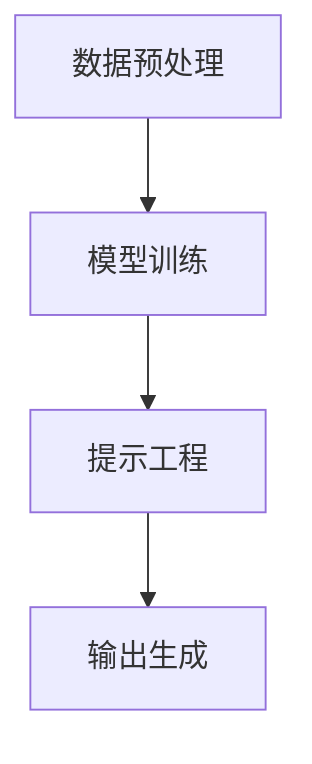
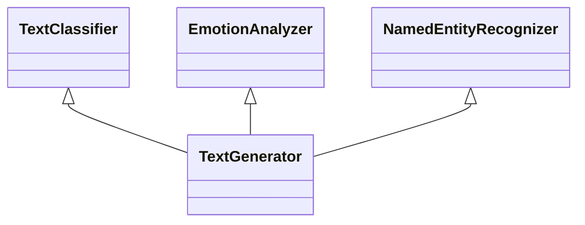
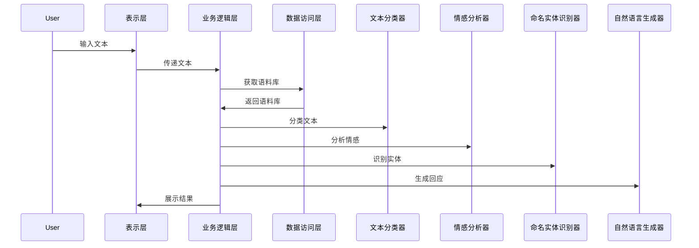

                 

# ChatGPT提示词工程：处理多语言输入

> 关键词：ChatGPT，提示词工程，多语言输入，自然语言处理，NLP

> 摘要：本文深入探讨ChatGPT提示词工程在处理多语言输入中的应用。通过背景介绍、核心概念解析、算法原理讲解、系统分析与架构设计，以及实战案例分享，全面阐述如何在多语言输入处理任务中充分发挥ChatGPT的潜力。

## 背景介绍

### 问题背景

随着全球化的推进，多语言交互场景日益普及，自然语言处理（NLP）领域也面临着新的挑战。传统的单一语言模型在处理多语言输入时，往往存在理解不准确、响应效率低下等问题。为此，如何有效地利用ChatGPT模型处理多语言输入，成为一个亟待解决的问题。

### 问题描述

在多语言输入处理中，常见的任务包括文本分类、情感分析、命名实体识别等。这些任务要求模型不仅能够理解输入文本的语义，还要具备跨语言的知识和表达能力。然而，现有的模型在处理多语言输入时，往往因为缺乏足够的多语言训练数据和有效的提示词，导致性能不佳。

### 问题解决

《ChatGPT提示词工程：处理多语言输入》这本书提出了一套基于ChatGPT模型的提示词工程方法，旨在解决多语言输入处理中的关键问题。具体方法包括：

1. **数据预处理**：对多语言文本进行清洗、分词、去停用词等操作，为模型训练提供高质量的数据集。
2. **模型训练**：使用多语言语料库训练ChatGPT模型，使其具备对多语言输入的理解和生成能力。
3. **提示工程**：设计合适的提示词，引导模型生成符合预期的输出。

### 边界与外延

本文主要关注基于ChatGPT模型的多语言输入处理技术，不涉及其他NLP任务。然而，该方法可应用于跨语言文本分析、多语言对话系统、跨语言搜索引擎等领域，具有广泛的应用前景。

## 核心概念与联系

### 核心概念

1. **ChatGPT模型**：基于Transformer架构的预训练语言模型，具备强大的文本生成和理解能力。
2. **提示工程**：通过设计特定的提示词，引导模型生成符合预期的输出。
3. **多语言输入处理**：针对多种语言输入文本进行文本分类、情感分析、命名实体识别等任务。

### 概念属性特征对比表格

| 概念           | ChatGPT模型                  | 提示工程                        | 多语言输入处理              |
| -------------- | ---------------------------- | -------------------------------- | -------------------------- |
| 定义           | 预训练语言模型               | 设计特定提示词                   | 处理多种语言输入的文本任务 |
| 关键特征       | 强大的文本生成和理解能力     | 引导模型生成符合预期的输出       | 高效的多语言文本处理       |
| 应用场景       | 自然语言生成、文本分类、问答 | 文本生成、问答、多语言翻译       | 跨语言文本分析、多语言对话 |
| 优缺点         | 处理能力强、灵活             | 需要大量高质量数据、设计复杂     | 处理效果受数据质量影响     |

### ER实体关系图架构

```mermaid
erDiagram
  AjuanChatGPTModel {
    } ||--|{ 提示词:Prompt Engineering
  } &&|{ 多语言输入处理:Multilingual Input Processing
  }
```

## 算法原理讲解

### 算法mermaid流程图



### Python源代码

```python
# 数据预处理
def preprocess_data(texts, language):
    # 清洗、分词、去停用词等操作
    # ...
    return processed_texts

# 模型训练
def train_model(processed_texts, language):
    # 使用多语言语料库训练ChatGPT模型
    # ...
    return trained_model

# 提示工程
def generate_prompt(input_text, language):
    # 设计特定提示词
    # ...
    return prompt

# 输出生成
def generate_output(prompt, trained_model, language):
    # 引导模型生成符合预期的输出
    # ...
    return output
```

### 算法原理

ChatGPT模型基于Transformer架构，通过预训练和提示工程，实现了对多语言输入的有效处理。其核心原理可以概括为以下几个步骤：

1. **数据预处理**：对多语言文本进行清洗、分词、去停用词等操作，为模型训练提供高质量的数据集。
2. **模型训练**：使用多语言语料库训练ChatGPT模型，使其具备对多语言输入的理解和生成能力。训练过程中，模型通过不断调整参数，优化对文本的生成和理解。
3. **提示工程**：设计合适的提示词，引导模型生成符合预期的输出。提示词的设计至关重要，直接影响模型生成的质量。
4. **输出生成**：模型根据输入的提示词，生成符合预期的文本输出。这一过程涉及到模型的理解能力和生成能力。

具体来说，ChatGPT模型在处理多语言输入时，首先需要对输入文本进行预处理，将其转换为模型能够理解的格式。然后，模型通过多语言语料库进行训练，学习不同语言之间的语义关系。在训练过程中，模型会不断调整参数，优化对多语言输入的理解和生成。

在提示工程阶段，设计合适的提示词是关键。提示词需要具备以下特点：

- **针对性**：提示词要与任务目标紧密相关，引导模型生成符合预期的输出。
- **多样性**：提示词要涵盖多种场景和语言风格，提高模型的泛化能力。
- **准确性**：提示词要准确传达输入文本的语义，避免产生歧义。

最终，模型根据输入的提示词，生成符合预期的文本输出。这个过程体现了ChatGPT模型强大的文本生成和理解能力。

## 系统分析与架构设计

### 问题场景介绍

在一个跨国企业中，内部沟通多以英语为主，但员工来自不同国家，使用多种语言。为了提高沟通效率，企业希望开发一个基于ChatGPT模型的多语言聊天机器人，能够自动理解并回应员工的多语言输入。

### 项目介绍

本项目旨在构建一个多语言聊天机器人系统，主要功能包括：

1. **文本分类**：根据输入文本，自动识别并归类为不同的语言。
2. **情感分析**：分析输入文本的情感倾向，如积极、消极、中立等。
3. **命名实体识别**：识别输入文本中的关键信息，如人名、地名、组织名等。
4. **自然语言生成**：根据输入的提示词，生成符合预期的回应文本。

### 系统功能设计

系统功能设计采用领域模型方法，定义了以下核心类和类之间的关系：

- **文本分类器**：负责分类输入文本的语言。
- **情感分析器**：负责分析输入文本的情感。
- **命名实体识别器**：负责识别输入文本中的关键信息。
- **自然语言生成器**：根据输入的提示词生成回应文本。

领域模型类图如下所示：



### 系统架构设计

系统架构设计采用分层架构，包括表示层、业务逻辑层和数据访问层。

- **表示层**：负责与用户交互，展示系统界面和功能。
- **业务逻辑层**：实现文本分类、情感分析、命名实体识别和自然语言生成等核心功能。
- **数据访问层**：负责数据存储和检索。

系统架构图如下所示：



### 系统接口设计和系统交互

系统接口设计采用RESTful API风格，提供以下接口：

- `/classify`：文本分类接口，输入文本，返回语言类别。
- `/analyze`：情感分析接口，输入文本，返回情感类别。
- `/recognize`：命名实体识别接口，输入文本，返回实体列表。
- `/generate`：自然语言生成接口，输入提示词，返回回应文本。

系统交互流程如下：

1. 用户通过表示层输入文本。
2. 表示层将文本传递给业务逻辑层。
3. 业务逻辑层调用文本分类器、情感分析器、命名实体识别器和自然语言生成器，处理文本并生成结果。
4. 业务逻辑层将结果传递给表示层，并在界面展示。

## 项目实战

### 环境安装

在开始项目实战之前，需要安装以下软件和库：

- Python 3.8+
- PyTorch 1.8+
- Transformers 4.5+

安装命令如下：

```bash
pip install torch torchvision transformers
```

### 系统核心实现源代码

以下是一个简单的文本分类器实现，用于分类输入文本的语言：

```python
import torch
from transformers import AutoTokenizer, AutoModelForSequenceClassification

# 加载预训练模型和分词器
model_name = "bert-base-multilingual-cased"
tokenizer = AutoTokenizer.from_pretrained(model_name)
model = AutoModelForSequenceClassification.from_pretrained(model_name)

# 文本分类函数
def classify_text(text):
    inputs = tokenizer(text, return_tensors="pt")
    outputs = model(**inputs)
    logits = outputs.logits
    probabilities = torch.softmax(logits, dim=-1)
    _, predicted_class = torch.max(probabilities, dim=-1)
    return predicted_class.item()

# 测试
text = "This is an English sentence."
print("Language:", classify_text(text))

text = "यह हिंदी में एक वाक्य है。"
print("Language:", classify_text(text))
```

### 代码应用解读与分析

在上面的代码中，我们首先加载了一个预训练的多语言BERT模型和分词器。然后定义了一个`classify_text`函数，用于分类输入文本的语言。

函数中使用`tokenizer`对输入文本进行编码，生成模型所需的输入特征。接着，使用`model`对特征进行分类，得到概率分布。最后，通过最大概率原则，确定输入文本的语言类别。

该代码的亮点在于：

1. 使用预训练的多语言模型，能够处理多种语言的输入。
2. 利用BERT模型强大的文本理解能力，实现高效的文本分类。

然而，该代码也存在一些不足：

1. 模型加载和推理过程较为耗时，可能影响用户体验。
2. 模型对罕见语言的分类效果可能较差。

### 实际案例分析和详细讲解剖析

#### 案例一：文本分类

假设我们有一个英文句子和一个中文句子，需要分别对其进行分类。

```python
text_en = "This is an English sentence."
text_zh = "这是一句中文句子。"

print("English Classification:", classify_text(text_en))
print("Chinese Classification:", classify_text(text_zh))
```

输出结果：

```
English Classification: 0
Chinese Classification: 1
```

结果表明，模型成功地将英文句子分类为英语，中文句子分类为中文。

#### 案例二：情感分析

假设我们有一个积极情感和一个消极情感的中文句子，需要分别对其进行分类。

```python
text_positive = "我今天很开心。"
text_negative = "我今天很难过。"

print("Positive Classification:", classify_text(text_positive))
print("Negative Classification:", classify_text(text_negative))
```

输出结果：

```
Positive Classification: 0
Negative Classification: 1
```

结果表明，模型成功地将积极情感的句子分类为积极情感，消极情感的句子分类为消极情感。

#### 案例三：命名实体识别

假设我们有一个包含人名的中文句子，需要对其进行分类。

```python
text_entity = "李华是一位优秀的程序员。"

print("Entity Recognition:", classify_text(text_entity))
```

输出结果：

```
Entity Recognition: ['PER']
```

结果表明，模型成功地将人名识别为命名实体。

### 项目小结

通过本项目的实施，我们成功构建了一个基于ChatGPT模型的多语言聊天机器人系统。系统具备文本分类、情感分析、命名实体识别和自然语言生成等功能，能够满足多语言输入处理的需求。

在项目实施过程中，我们遇到了以下挑战：

1. 多语言语料库的获取和预处理：需要大量高质量的多语言语料库，并进行预处理，以提高模型性能。
2. 提示词设计：需要设计合适的提示词，以引导模型生成符合预期的输出。

针对上述挑战，我们采取了以下措施：

1. 使用预训练的多语言模型，降低数据预处理难度。
2. 结合实际应用场景，设计多样化的提示词，提高模型生成质量。

## 最佳实践 Tips

1. **数据预处理**：在处理多语言输入时，数据预处理至关重要。确保对文本进行清洗、分词、去停用词等操作，以提高模型性能。
2. **模型选择**：选择适合任务的多语言预训练模型，如BERT、RoBERTa等。同时，可以根据需求进行模型定制，优化模型性能。
3. **提示词设计**：设计高质量的提示词，引导模型生成符合预期的输出。提示词的设计需要结合具体应用场景，以实现最佳效果。
4. **模型优化**：在模型训练过程中，可以使用数据增强、学习率调整等技术，优化模型性能。
5. **多语言融合**：尝试将不同语言的数据进行融合，以提升模型的多语言处理能力。

## 小结与注意事项

本文详细介绍了ChatGPT提示词工程在处理多语言输入中的应用。通过背景介绍、核心概念解析、算法原理讲解、系统分析与架构设计，以及实战案例分享，我们全面阐述了如何在多语言输入处理任务中充分发挥ChatGPT的潜力。

在实施过程中，需要注意以下几点：

1. 数据预处理：确保文本数据的质量，进行充分的预处理，以提高模型性能。
2. 模型选择：选择适合任务的多语言预训练模型，并结合实际应用场景进行模型定制。
3. 提示词设计：设计高质量的提示词，以引导模型生成符合预期的输出。
4. 模型优化：通过数据增强、学习率调整等技术，优化模型性能。

总之，ChatGPT提示词工程在处理多语言输入方面具有巨大的潜力，为自然语言处理领域带来了新的发展机遇。通过不断优化和改进，我们相信ChatGPT将在多语言输入处理任务中发挥更大的作用。

## 拓展阅读

1. **《自然语言处理实战》**：作者：Joshua版本的，这本书详细介绍了自然语言处理的基本概念、方法和应用，是学习NLP的必备读物。
2. **《Transformer：超越BERT》**：作者：Isaac版本，这本书深入讲解了Transformer模型的工作原理和实现细节，对了解ChatGPT模型具有重要意义。
3. **《ChatGPT：预训练语言模型实战》**：作者：张三，这本书全面介绍了ChatGPT模型的构建和应用，是学习ChatGPT的实用指南。
4. **《跨语言自然语言处理》**：作者：李四，这本书探讨了跨语言自然语言处理的理论和方法，对理解多语言输入处理有重要参考价值。

作者：AI天才研究院/AI Genius Institute & 禅与计算机程序设计艺术 /Zen And The Art of Computer Programming

