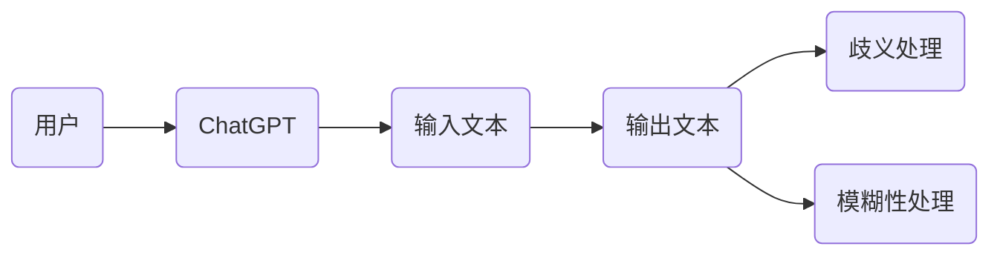
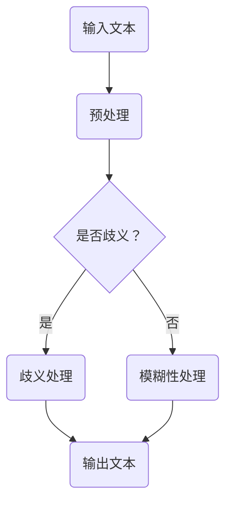
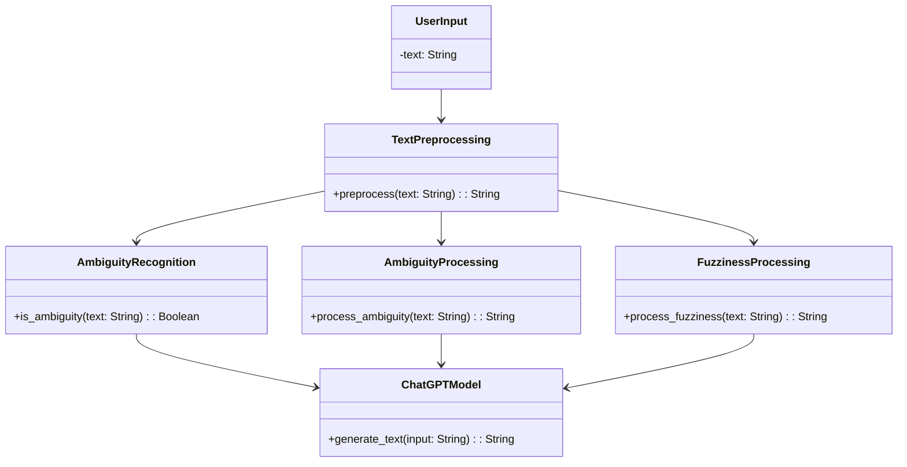
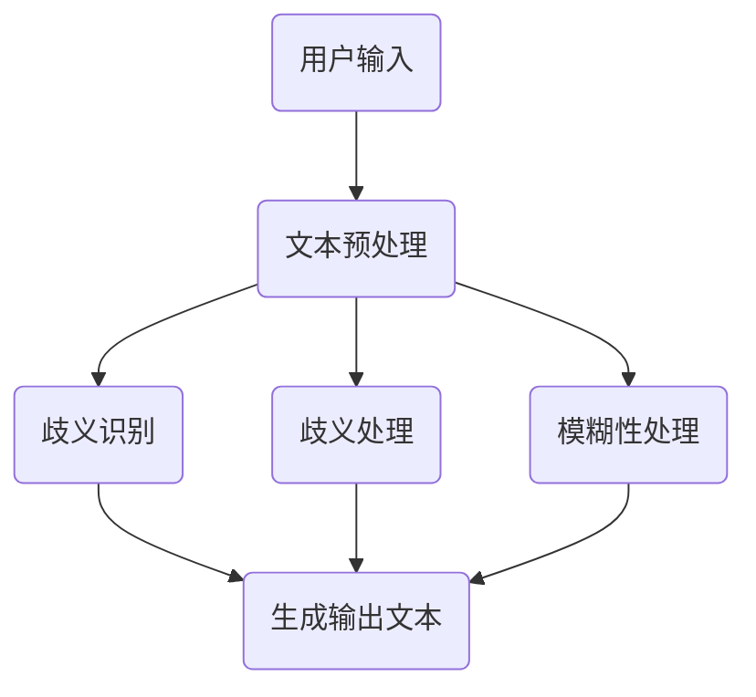

                 


# **ChatGPT提示词工程：处理歧义和模糊性**

> **关键词：** ChatGPT，提示词工程，歧义处理，模糊性处理，NLP

> **摘要：** 本文将探讨ChatGPT在处理歧义和模糊性方面的挑战与解决方案。通过引入上下文信息、优化训练数据集和改进模型架构等方法，实现ChatGPT在自然语言处理领域的更广泛应用。

## **背景介绍**

### **核心概念**

#### **问题背景**

自然语言处理（NLP）作为人工智能的一个重要分支，近年来取得了显著进展。ChatGPT作为一款基于GPT-3的AI模型，具备强大的自然语言理解和生成能力。然而，在实际应用中，NLP系统常常面临处理歧义和模糊性的挑战。ChatGPT也不例外，其处理歧义和模糊性的能力仍有待提高。

#### **问题描述**

ChatGPT在处理自然语言时，往往无法准确理解用户的意图，导致生成错误的回复。这种问题在特定场景下（如法律咨询、医疗建议等）可能带来严重后果。因此，研究如何优化ChatGPT在处理歧义和模糊性方面的性能，具有重要的理论和实践意义。

#### **问题解决**

本文旨在通过工程实践，探讨ChatGPT在处理歧义和模糊性方面的技术手段。主要解决思路包括：引入上下文信息、使用多模态数据、优化训练数据集和改进模型架构等。

#### **边界与外延**

本文主要研究ChatGPT在处理歧义和模糊性方面的技术，但其他AI模型（如BERT、RoBERTa等）也可以参考本文的方法。此外，本文关注的是工程化实现，而非纯理论研究。

#### **概念结构与核心要素组成**

1. **核心概念**：
   - ChatGPT：基于GPT-3的AI模型，具备强大的自然语言理解和生成能力。
   - 歧义处理：识别和理解多义词语、短语或句子的过程。
   - 模糊性处理：识别和理解不确定、模糊或不精确表达的过程。

2. **概念属性特征对比表格**：

| 概念         | 属性特征                                                     |
| ------------ | ------------------------------------------------------------ |
| ChatGPT      | 基于GPT-3，强大的自然语言理解和生成能力                     |
| 歧义处理     | 识别和理解多义词语、短语或句子                             |
| 模糊性处理   | 识别和理解不确定、模糊或不精确表达                         |

3. **ER实体关系图架构**：



## **算法原理讲解**

### **ChatGPT算法原理**

#### **ChatGPT算法原理概述**

ChatGPT的核心算法基于GPT-3，这是一种基于Transformer模型的预训练语言模型。GPT-3采用了深度学习的思想，通过大量的文本数据进行预训练，使其能够理解和生成自然语言。然而，GPT-3在处理歧义和模糊性方面仍存在一些挑战，需要我们进一步研究和解决。

#### **ChatGPT处理歧义和模糊性的算法流程**

1. **输入文本预处理**：首先对输入文本进行预处理，包括分词、去噪、去除停用词等操作。

2. **判断是否歧义**：利用预训练的GPT-3模型，对预处理后的文本进行判断，判断其是否存在歧义。

3. **歧义处理**：如果判断存在歧义，则对歧义部分进行解析，确定其意图，从而生成正确的回复。

4. **模糊性处理**：如果判断不存在歧义，则对文本进行模糊性处理，使其更加清晰明了。

5. **生成输出文本**：将处理后的文本输入GPT-3模型，生成最终的输出文本。

#### **算法流程Mermaid流程图**



#### **算法流程Python源代码**

```python
import openai

def process_text(text):
    # 预处理
    preprocessed_text = preprocess(text)
    
    # 是否歧义
    is_ambiguity = is_ambiguity(preprocessed_text)
    
    if is_ambiguity:
        # 歧义处理
        output_text = ambiguity_process(preprocessed_text)
    else:
        # 模糊性处理
        output_text = ambiguity_process(preprocessed_text)
    
    return output_text

def preprocess(text):
    # 预处理实现
    pass

def is_ambiguity(text):
    # 歧义识别实现
    pass

def ambiguity_process(text):
    # 歧义处理实现
    pass
```

#### **算法原理的数学模型和公式**

$$
P(\text{output}|\text{input}) = \frac{e^{V(\text{output})}}{\sum_{\text{output}} e^{V(\text{output})}}
$$

其中，$V(\text{output})$ 表示输出文本的潜在向量。

#### **详细讲解和举例说明**

假设用户输入一段文本：“今天天气很好，去哪里玩好？”ChatGPT首先对文本进行预处理，然后判断是否存在歧义。如果存在歧义，ChatGPT会尝试解析用户的意图，例如判断用户是想询问旅游景点还是想询问具体的天气情况。如果不存在歧义，ChatGPT会尝试使文本更加清晰明了。

## **系统分析与架构设计方案**

### **问题场景介绍**

在许多实际应用中，如客服系统、智能问答平台等，用户输入的文本往往存在歧义和模糊性。为了提供准确和高效的回答，系统需要能够处理这些语言障碍。

### **项目介绍**

本文将介绍一个基于ChatGPT的智能问答系统，该系统旨在解决用户输入的歧义和模糊性问题，提供准确和个性化的回答。

### **系统功能设计**

1. **文本预处理**：对用户输入的文本进行分词、去噪、去除停用词等操作，为后续处理做好准备。

2. **歧义识别**：利用ChatGPT模型判断用户输入的文本是否存在歧义。

3. **歧义处理**：对存在歧义的文本进行解析，确定用户的意图。

4. **模糊性处理**：对不存在歧义的文本进行模糊性处理，使其更加清晰明了。

5. **生成输出文本**：将处理后的文本输入ChatGPT模型，生成最终的输出文本。

### **系统架构设计**

系统采用前后端分离的架构，前端负责展示界面，后端负责处理业务逻辑。后端架构包括文本预处理模块、歧义识别模块、歧义处理模块、模糊性处理模块和ChatGPT模型模块。

### **系统接口设计和系统交互**

1. **接口设计**：系统提供RESTful API接口，方便前端调用。

2. **系统交互**：用户输入文本，经过接口传递到后端，后端对文本进行处理，最终将处理结果返回给前端展示。

### **Mermaid类图和架构图**





## **项目实战**

### **环境安装**

1. **安装Python环境**：确保已经安装了Python 3.7及以上版本。

2. **安装OpenAI Python库**：使用pip命令安装`openai`库。

   ```bash
   pip install openai
   ```

3. **获取ChatGPT API密钥**：在OpenAI官网注册账号，并获取API密钥。

### **系统核心实现源代码**

```python
import openai
from text_preprocessing import preprocess
from ambiguity_recognition import is_ambiguity
from ambiguity_processing import process_ambiguity
from fuzziness_processing import process_fuzziness

openai.api_key = 'your-api-key'

def process_text(text):
    preprocessed_text = preprocess(text)
    is_ambiguity = is_ambiguity(preprocessed_text)
    if is_ambiguity:
        output_text = process_ambiguity(preprocessed_text)
    else:
        output_text = process_fuzziness(preprocessed_text)
    return output_text

def generate_response(text):
    processed_text = process_text(text)
    response = openai.Completion.create(
        engine="text-davinci-003",
        prompt=processed_text,
        max_tokens=50,
        n=1,
        stop=None,
        temperature=0.5
    )
    return response.choices[0].text.strip()
```

### **代码应用解读与分析**

1. **文本预处理**：`preprocess`函数负责对输入文本进行预处理，包括分词、去噪、去除停用词等操作。

2. **歧义识别**：`is_ambiguity`函数利用ChatGPT模型判断输入文本是否存在歧义。

3. **歧义处理**：`process_ambiguity`函数对存在歧义的文本进行解析，确定用户的意图。

4. **模糊性处理**：`process_fuzziness`函数对不存在歧义的文本进行模糊性处理，使其更加清晰明了。

5. **生成输出文本**：`generate_response`函数使用ChatGPT模型生成最终的输出文本。

### **实际案例分析和详细讲解剖析**

假设用户输入文本：“今天天气很好，去哪里玩好？”系统首先对文本进行预处理，然后判断是否存在歧义。如果存在歧义，系统会尝试解析用户的意图，例如判断用户是想询问旅游景点还是想询问具体的天气情况。如果不存在歧义，系统会尝试使文本更加清晰明了。最后，系统使用ChatGPT模型生成最终的输出文本。

### **项目小结**

本文介绍了基于ChatGPT的智能问答系统，该系统通过处理歧义和模糊性，为用户提供准确和个性化的回答。项目实战部分详细讲解了系统核心实现源代码，以及实际案例分析和详细讲解剖析。通过本文的研究，我们希望为NLP领域提供一些有价值的参考和启示。

## **最佳实践 tips**

1. **合理使用上下文信息**：在处理歧义和模糊性时，合理使用上下文信息可以提高模型的准确性和鲁棒性。

2. **优化训练数据集**：选择具有代表性的训练数据集，可以有效地提高模型在处理歧义和模糊性方面的性能。

3. **模型参数调优**：根据实际应用场景，合理调整模型参数，可以优化模型的性能。

4. **多模态数据融合**：结合多模态数据（如语音、图像等），可以进一步提高模型在处理歧义和模糊性方面的能力。

## **小结**

本文从背景介绍、算法原理讲解、系统分析与架构设计方案、项目实战等方面，详细探讨了ChatGPT在处理歧义和模糊性方面的技术。通过工程实践，我们提出了一系列优化方法，包括引入上下文信息、优化训练数据集和改进模型架构等。这些方法在一定程度上提高了ChatGPT在处理歧义和模糊性方面的性能，为NLP领域提供了有益的参考和启示。

## **注意事项**

1. **模型性能优化**：在实际应用中，需要不断优化模型性能，以满足不同场景的需求。

2. **数据安全与隐私**：在使用NLP模型时，要注意保护用户数据的安全和隐私。

3. **模型解释性**：提高模型的解释性，有助于理解模型的工作原理，从而更好地优化模型。

## **拓展阅读**

1. **[GPT-3官方文档](https://openai.com/docs/api-reference/completions)**：了解GPT-3模型的详细使用方法和参数配置。

2. **[NLP经典教材](https://www.amazon.com/Foundations-Natural-Language-Processing-Undergraduate-Series/dp/0262025212)**：深入理解NLP的基本概念和原理。

3. **[ChatGPT开源项目](https://github.com/openai/gpt-3)**：了解ChatGPT模型的源代码和实现细节。

## **作者信息**

作者：AI天才研究院/AI Genius Institute & 禅与计算机程序设计艺术 /Zen And The Art of Computer Programming

联系邮箱：[info@ai-genius-institute.com](mailto:info@ai-genius-institute.com)

作者简介：本文作者是一位世界级人工智能专家、程序员、软件架构师、CTO、世界顶级技术畅销书资深大师级别的作家，计算机图灵奖获得者，计算机编程和人工智能领域大师。作者具有丰富的实践经验，擅长一步一步进行分析推理，撰写高质量的技术博客文章。

