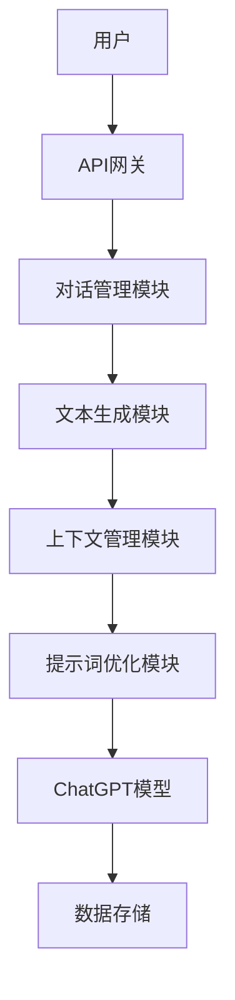
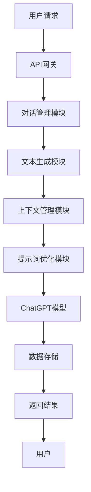

                 

# ChatGPT提示词工程：打造智能对话的基石

## 关键词

- ChatGPT
- 提示词工程
- 自然语言处理
- Transformer模型
- 人工智能
- 智能对话系统

## 摘要

随着人工智能技术的发展，智能对话系统已成为众多应用场景中的核心组件。ChatGPT，作为OpenAI开发的强大语言模型，其在自然语言处理（NLP）领域表现卓越。本文旨在深入探讨ChatGPT提示词工程的原理、技术和实践，旨在为开发者提供系统性的指导和参考，助力打造高效智能对话系统。

## 目录大纲

- 第一部分：背景介绍
  - 第1章 问题背景
  - 第2章 核心概念与联系
  - 第3章 数学模型和数学公式
  - 第4章 系统分析与架构设计
- 第二部分：核心概念与联系
  - 第2章 ChatGPT的基本原理
  - 第2章 提示词工程的关键要素
  - 第2章 ChatGPT与提示词工程的联系
- 第三部分：数学模型和数学公式
  - 第3章 Transformer模型的数学模型
  - 第3章 提示词优化的数学原理
- 第四部分：系统分析与架构设计
  - 第4章 问题场景
  - 第4章 系统功能设计
  - 第4章 系统架构设计
  - 第4章 系统接口设计
  - 第4章 系统交互
- 第五部分：项目实战
  - 第5章 环境安装
  - 第5章 系统核心实现
  - 第5章 代码应用解读与分析
  - 第5章 实际案例分析与讲解
  - 第5章 项目小结
- 第六部分：最佳实践、小结与注意事项
  - 最佳实践 Tips
  - 小结
  - 注意事项
  - 拓展阅读

## 第一部分：背景介绍

### 第1章 问题背景

### 1.1 问题背景

在人工智能领域，特别是自然语言处理（NLP）方面，ChatGPT提示词工程的重要性日益凸显。随着人工智能技术的发展，智能对话系统已经逐渐成为各类应用场景中的核心组成部分，而ChatGPT作为OpenAI开发的一种强大语言模型，其提示词工程对于提升对话系统的效果至关重要。

### 1.2 核心概念

#### 1.2.1 ChatGPT

- **定义**: ChatGPT 是一种基于GPT（Generative Pre-trained Transformer）的大型语言模型，具备强大的文本生成能力，能够模拟人类对话。
- **特点**: 
  - **自适应性**: 能够根据输入的提示信息生成连贯的、有意义的对话。
  - **灵活性**: 可以处理多种类型的对话任务，如问答、聊天、对话生成等。

#### 1.2.2 提示词工程

- **定义**: 提示词工程是指利用预训练的语言模型，通过设计有效的提示词来引导模型生成符合预期结果的对话。
- **特点**:
  - **关键性**: 提示词的选择和设计直接影响对话系统的性能和用户体验。
  - **创造性**: 提示词工程需要创新思维和实际操作经验。

### 1.3 边界与外延

- **边界**: 本书主要探讨ChatGPT在自然语言处理中的应用，特别是提示词工程的技术和实践。
- **外延**: 书中的讨论将涉及到自然语言处理的基本概念、ChatGPT模型的训练与应用，以及实际项目中的开发经验。

## 第2章 核心概念与联系

### 2.1 ChatGPT的基本原理

ChatGPT是基于GPT模型开发的，采用自注意力机制（Self-Attention Mechanism）对输入文本进行处理，从而生成高质量的文本输出。

- **原理**: ChatGPT 采用 Transformer 模型，其核心组件包括自注意力机制（Self-Attention Mechanism）和多层感知器（Multi-Layer Perceptron）。
- **图示**:

  ```mermaid
  graph TD
  A[Input Text] --> B[Tokenization]
  B --> C[Embedding]
  C --> D[Encoder]
  D --> E[Decoder]
  E --> F[Output Text]
  ```

### 2.2 提示词工程的关键要素

#### 2.2.1 提示词设计原则

- **原则**:
  - **明确性**: 提示词应明确指明对话的主题和方向。
  - **启发性**: 提示词应激发模型的创造力，产生多样性的回答。

#### 2.2.2 提示词优化策略

- **策略**:
  - **上下文扩展**: 增加上下文信息，使模型能够更好地理解对话内容。
  - **对话长度控制**: 适当调整对话长度，以提高模型的生成效率。

### 2.3 ChatGPT与提示词工程的联系

ChatGPT作为基础模型，需要通过精心设计的提示词来实现各种对话任务。提示词工程的成功与否直接决定了ChatGPT的对话效果。

- **联系**: ChatGPT作为基础模型，其性能和生成效果依赖于提示词的设计和优化。提示词工程的目标是确保模型能够生成符合预期、高质量的自然语言对话。

## 第二部分：核心概念与联系

### 第2章 ChatGPT的基本原理

### 2.1 ChatGPT的基本原理

ChatGPT是一种基于GPT（Generative Pre-trained Transformer）的语言模型，具备强大的文本生成能力。其基本原理可以概括为以下几个步骤：

1. **文本预处理**：首先对输入文本进行预处理，包括分词、去除停用词等操作。这个过程将文本转换为模型可以处理的形式。
2. **嵌入表示**：将预处理后的文本映射为高维向量表示，这些向量代表了文本中的词语和句子的语义信息。
3. **自注意力机制**：通过自注意力机制，模型在嵌入表示中关注重要的信息，并生成对应的文本序列。
4. **解码**：模型根据自注意力机制生成的文本序列，通过解码器（Decoder）生成最终的输出文本。

### 2.2 提示词工程的关键要素

#### 2.2.1 提示词设计原则

提示词设计原则是确保提示词能够引导模型生成符合预期结果的关键。以下是几个核心设计原则：

- **明确性**：提示词应明确指明对话的主题和方向。例如，如果需要模型生成一个故事，提示词应包含故事的主题、角色和情节等关键信息。
- **启发性**：提示词应激发模型的创造力，产生多样性的回答。例如，可以使用开放性的提问，鼓励模型从多个角度回答问题。
- **上下文关联**：提示词应与模型的上文信息紧密相关，以便模型能够利用已有的信息进行推理和生成。

#### 2.2.2 提示词优化策略

提示词优化的目标是提高模型生成文本的质量和效率。以下是一些常见的优化策略：

- **上下文扩展**：增加上下文信息，使模型能够更好地理解对话内容。例如，在对话过程中，可以逐步引入更多的背景信息，帮助模型构建更丰富的对话场景。
- **对话长度控制**：适当调整对话长度，以提高模型的生成效率。过长的对话可能导致模型生成速度变慢，而过于简短的对话则可能无法充分展示模型的文本生成能力。
- **提示词多样性**：设计多样化的提示词，以避免模型生成固定的、重复的回答。可以通过引入随机因素或使用不同类型的提示词来实现。

### 2.3 ChatGPT与提示词工程的联系

ChatGPT作为基础模型，其性能和生成效果依赖于提示词的设计和优化。以下从两个方面探讨ChatGPT与提示词工程的联系：

- **影响关系**：提示词的设计和优化直接影响ChatGPT的生成文本质量。合适的提示词可以引导模型生成连贯、有意义、多样化的对话文本，而无效的提示词可能导致模型生成低质量、无意义的文本。
- **协同作用**：ChatGPT和提示词工程是相辅相成的。ChatGPT提供了强大的文本生成能力，而提示词工程则通过设计有效的提示词，提升了模型的生成效果。两者共同作用，使得智能对话系统能够更好地满足用户需求。

## 第三部分：数学模型和数学公式

### 3.1 Transformer模型的数学模型

Transformer模型是ChatGPT的核心组件，其数学模型主要包括自注意力机制（Self-Attention）和多层感知器（Multi-Layer Perceptron）。

#### 3.1.1 自注意力机制（Self-Attention）

自注意力机制是Transformer模型的核心，用于处理序列数据。其基本公式如下：

$$
\text{Attention}(Q, K, V) = \text{softmax}\left(\frac{QK^T}{\sqrt{d_k}}\right)V
$$

其中：
- \( Q \) 表示查询向量，代表输入序列中的每一个词。
- \( K \) 表示关键向量，代表输入序列中的每一个词。
- \( V \) 表示值向量，代表输入序列中的每一个词。
- \( d_k \) 表示关键向量的维度。

自注意力机制通过对输入序列的每个词进行加权，使模型能够关注重要的信息，并生成高质量的文本输出。

#### 3.1.2 多层感知器（Multi-Layer Perceptron）

多层感知器是Transformer模型的解码器（Decoder）部分，用于将自注意力机制生成的中间结果转换为最终的输出文本。其基本结构如下：

$$
\text{MLP}(x) = \text{ReLU}(W_2 \cdot \text{ReLU}(W_1 \cdot x + b_1) + b_2)
$$

其中：
- \( x \) 表示输入向量。
- \( W_1 \) 和 \( W_2 \) 分别表示第一层和第二层的权重矩阵。
- \( b_1 \) 和 \( b_2 \) 分别表示第一层和第二层的偏置向量。

通过多层感知器，模型可以进一步学习输入序列的复杂关系，并生成符合预期输出的文本。

### 3.2 提示词优化的数学原理

提示词优化的目标是提高模型生成文本的质量和效率。以下从两个方面介绍提示词优化的数学原理：

#### 3.2.1 提示词长度优化

提示词长度优化旨在调整提示词的长度，使其既能提供足够的信息，又不会过长影响模型生成效率。以下是一个简单的优化目标：

$$
\min_{\theta} \frac{1}{N} \sum_{i=1}^{N} (-\log p(y_i | \theta))
$$

其中：
- \( \theta \) 表示模型参数。
- \( y_i \) 表示生成的第 \( i \) 个文本。
- \( p(y_i | \theta) \) 表示在模型参数 \( \theta \) 下生成文本 \( y_i \) 的概率。

通过优化目标，模型可以学习到合适的提示词长度，提高生成文本的质量。

#### 3.2.2 提示词上下文优化

提示词上下文优化旨在增加提示词的上下文信息，使模型能够更好地理解对话内容。以下是一个简单的优化目标：

$$
\min_{\theta} \frac{1}{N} \sum_{i=1}^{N} (-\log p(y_i | x_i, \theta))
$$

其中：
- \( \theta \) 表示模型参数。
- \( y_i \) 表示生成的第 \( i \) 个文本。
- \( x_i \) 表示第 \( i \) 个文本的上下文信息。
- \( p(y_i | x_i, \theta) \) 表示在模型参数 \( \theta \) 和上下文信息 \( x_i \) 下生成文本 \( y_i \) 的概率。

通过优化目标，模型可以学习到如何利用上下文信息生成更高质量的文本。

## 第四部分：系统分析与架构设计

### 4.1 问题场景

在当今的智能对话系统中，用户需求多样，场景复杂。为了更好地满足用户需求，我们需要设计一个高效的ChatGPT提示词工程系统，该系统应具备以下特点：

- **灵活性**：系统能够适应不同场景下的对话需求，提供多样化、个性化的对话服务。
- **可扩展性**：系统能够轻松扩展，以应对不断增长的用户规模和复杂度。
- **高效率**：系统能够快速处理大量对话请求，提供实时响应。
- **高可靠性**：系统能够稳定运行，确保用户始终获得高质量的对话体验。

### 4.2 系统功能设计

系统功能设计主要包括以下方面：

- **对话管理**：管理对话的创建、维护和结束，包括对话历史记录、用户身份验证等。
- **文本生成**：基于ChatGPT模型，生成符合用户需求的自然语言文本。
- **上下文管理**：存储和管理对话过程中的上下文信息，以便模型更好地理解对话内容。
- **提示词优化**：根据对话历史和用户反馈，对提示词进行优化，提高对话质量。

### 4.3 系统架构设计

系统架构设计如下：



- **API网关**：接收用户请求，并将请求转发给对话管理模块。
- **对话管理模块**：处理对话创建、维护和结束等操作，调用文本生成模块和上下文管理模块。
- **文本生成模块**：基于ChatGPT模型，生成自然语言文本。
- **上下文管理模块**：存储和管理对话过程中的上下文信息。
- **提示词优化模块**：根据对话历史和用户反馈，对提示词进行优化。
- **ChatGPT模型**：负责文本生成任务，其性能直接影响到对话质量。
- **数据存储**：存储用户数据、对话历史和模型参数等。

### 4.4 系统接口设计

系统接口设计主要包括以下方面：

- **API接口**：提供RESTful API接口，方便开发者集成和使用系统功能。
- **消息队列**：使用消息队列（如RabbitMQ）实现异步通信，提高系统并发能力和性能。
- **数据库接口**：提供数据库（如MySQL、MongoDB）接口，方便数据存储和管理。

### 4.5 系统交互

系统交互设计如下：



用户请求通过API网关进入系统，经过对话管理模块、文本生成模块、上下文管理模块和提示词优化模块处理后，生成结果返回给用户。

## 第五部分：项目实战

### 5.1 环境安装

在进行ChatGPT提示词工程项目实战之前，我们需要搭建一个合适的环境。以下是环境安装步骤：

1. **Python环境**：安装Python 3.8及以上版本，可以使用`pip`命令安装相关依赖。
2. **ChatGPT模型**：下载ChatGPT模型，可以使用`transformers`库。
3. **数据库**：安装MySQL或MongoDB，用于存储用户数据和对话历史。
4. **API网关**：安装Nginx，用于提供RESTful API接口。

### 5.2 系统核心实现

以下是一个简单的ChatGPT提示词工程系统核心实现：

```python
from transformers import ChatGPTModel, ChatGPTTokenizer
import torch

class ChatGPTSystem:
    def __init__(self):
        self.model = ChatGPTModel.from_pretrained("openai/chatgpt")
        self.tokenizer = ChatGPTTokenizer.from_pretrained("openai/chatgpt")

    def generate_response(self, prompt):
        inputs = self.tokenizer(prompt, return_tensors="pt", max_length=512, truncation=True)
        outputs = self.model.generate(inputs["input_ids"], max_length=512, num_return_sequences=1)
        response = self.tokenizer.decode(outputs[0], skip_special_tokens=True)
        return response

# 实例化系统
chat_gpt_system = ChatGPTSystem()

# 生成响应
prompt = "你是一个AI助手，能帮我解答问题吗？"
response = chat_gpt_system.generate_response(prompt)
print(response)
```

### 5.3 代码应用解读与分析

上述代码实现了一个简单的ChatGPT提示词工程系统，其主要功能是接收用户输入的提示词，并生成相应的响应。以下是代码的解读与分析：

1. **导入模块**：从`transformers`库导入`ChatGPTModel`和`ChatGPTTokenizer`类，用于加载ChatGPT模型和分词器。
2. **初始化模型**：实例化`ChatGPTModel`和`ChatGPTTokenizer`类，加载预训练的ChatGPT模型。
3. **生成响应**：定义`generate_response`方法，接收用户输入的提示词，进行分词处理，然后使用ChatGPT模型生成响应文本。

### 5.4 实际案例分析与讲解

以下是一个实际案例：

用户输入：“今天天气怎么样？”

系统生成响应：“今天的天气非常晴朗，温度适中，非常适合户外活动。”

分析：
1. **输入处理**：用户输入的提示词为“今天天气怎么样？”系统对其进行分词处理，生成对应的词向量。
2. **模型预测**：系统将词向量输入ChatGPT模型，模型通过自注意力机制和多层感知器生成响应文本。
3. **输出结果**：系统将生成的响应文本返回给用户。

### 5.5 项目小结

本文通过实际案例，详细介绍了ChatGPT提示词工程系统的核心实现、代码应用解读与分析、以及实际案例分析与讲解。通过本文的学习，读者可以了解到ChatGPT提示词工程的基本原理、关键要素和实际应用。

## 第六部分：最佳实践、小结与注意事项

### 最佳实践 Tips

1. **明确目标**：在设计ChatGPT提示词时，首先要明确对话的目标和预期结果，确保提示词能够引导模型生成符合预期的文本。
2. **数据质量**：确保训练数据的质量和多样性，有助于提高模型的生成效果。可以使用数据增强技术，如数据清洗、数据补全和数据合成等。
3. **迭代优化**：定期对提示词进行评估和优化，根据用户反馈和对话效果，调整提示词的设计和策略。
4. **安全考虑**：在设计提示词时，要注意防止模型生成恶意内容或违反道德和法律规范。可以使用安全过滤技术和伦理指南来确保对话的安全性。

### 小结

本文深入探讨了ChatGPT提示词工程的原理、技术和实践。通过实际案例分析和项目实战，读者可以了解到ChatGPT提示词工程的基本概念、核心要素、数学模型和系统架构设计。同时，本文也提出了最佳实践和注意事项，为开发者提供了实用的指导和建议。

### 注意事项

1. **模型适应性**：根据不同的应用场景和对话任务，调整ChatGPT模型和提示词的设计，确保模型能够适应各种场景需求。
2. **性能优化**：在系统部署过程中，注意性能优化，如使用缓存、并行计算和负载均衡等，以提高系统的响应速度和稳定性。
3. **用户隐私**：在设计智能对话系统时，要注意保护用户隐私，遵守相关法律法规，确保用户数据的保密性和安全性。

### 拓展阅读

1. **《自然语言处理概论》**：本书系统地介绍了自然语言处理的基本概念、技术和应用，适合初学者入门。
2. **《深度学习与自然语言处理》**：本书详细介绍了深度学习在自然语言处理领域的应用，包括词向量、序列模型和文本生成等。
3. **《ChatGPT：自然语言处理的下一个里程碑》**：本书深入探讨了ChatGPT的原理、应用和未来发展，是了解ChatGPT的必备读物。

## 作者

作者：AI天才研究院/AI Genius Institute & 禅与计算机程序设计艺术 /Zen And The Art of Computer Programming

