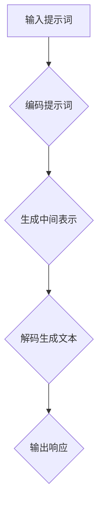
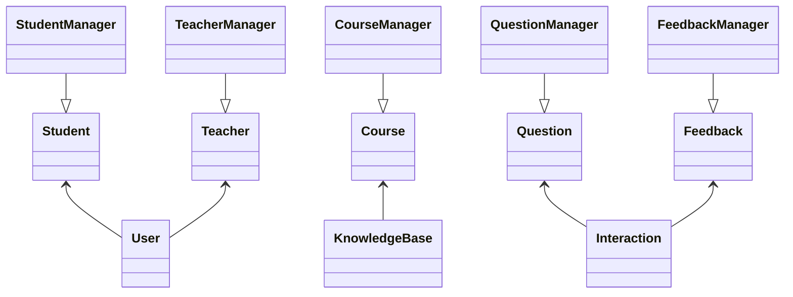
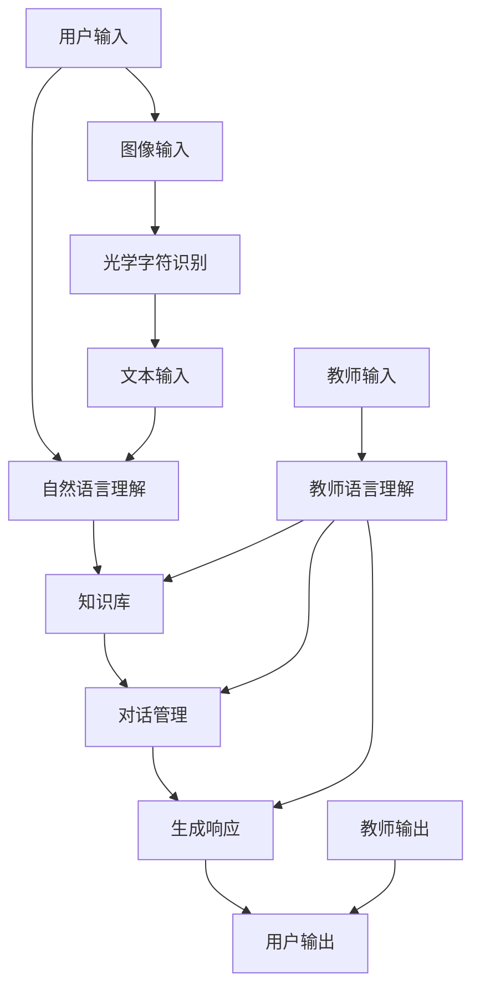
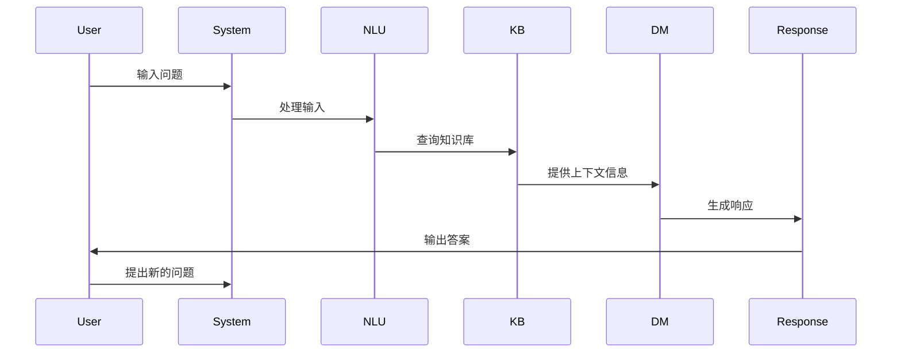

                 

### 背景介绍

#### 核心概念术语说明

在开始探讨《ChatGPT提示词工程：构建智能对话系统的基础》之前，我们需要对几个核心概念进行定义，以确保所有读者都能跟上讨论的节奏。

- **人工智能（AI）**：人工智能是指计算机系统模拟人类智能行为的技术，包括学习、推理、问题解决、自然语言处理等。
- **对话系统**：对话系统是一种人工智能系统，它可以理解和回应人类的自然语言输入，提供交互服务。
- **ChatGPT**：ChatGPT是由OpenAI开发的一种基于GPT-3（Generative Pre-trained Transformer 3）的聊天机器人模型，它通过深度学习算法，能够生成流畅且上下文相关的自然语言响应。
- **提示词工程**：提示词工程是设计用于引导和优化模型输出的一系列技术和策略，目的是提高对话系统的响应质量。

#### 问题背景

随着互联网和人工智能技术的快速发展，对话系统已经广泛应用于各个领域，如客服、教育、娱乐等。然而，构建一个高效、自然的对话系统并不简单，需要解决一系列技术挑战。ChatGPT的出现为我们提供了强大的工具，但如何有效地利用这些工具，特别是通过提示词工程来优化对话系统的性能，成为了一个重要课题。

#### 问题描述

ChatGPT模型虽然具有强大的自然语言生成能力，但它的表现仍然受到输入提示词的影响。有效的提示词工程不仅可以提高模型的响应质量，还可以增强对话系统的用户体验。因此，本文旨在探讨以下问题：

1. ChatGPT模型的工作原理是什么？
2. 提示词工程在ChatGPT应用中的重要性如何？
3. 提示词设计的原则和技巧是什么？
4. 如何通过优化提示词来提升对话系统的性能？

#### 问题解决

本文将通过以下方式解决上述问题：

1. 详细介绍ChatGPT模型的结构和原理。
2. 阐述提示词工程的基本概念和设计原则。
3. 提供实用的提示词设计技巧和优化方法。
4. 分析实际案例，展示如何通过提示词工程来提升对话系统的性能。

#### 边界与外延

本文的讨论范围主要涵盖ChatGPT模型和提示词工程的基础知识和应用技巧。它不仅适用于初学者，也为专业人士提供了一些高级概念和最佳实践。

- **边界**：本文重点关注ChatGPT模型在对话系统中的应用，不涉及其他类型的AI模型。
- **外延**：本文内容可以应用于各种对话系统的构建，包括客户服务、虚拟助手、聊天机器人等。

### 概念结构与核心要素组成

为了更好地理解ChatGPT提示词工程的各个方面，我们可以将核心概念和要素进行结构化描述：

1. **ChatGPT模型**：包括预训练阶段、微调阶段和生成阶段。
2. **提示词设计**：涉及提示词的生成、优化和评估。
3. **应用场景**：客户服务、教育、娱乐等。
4. **技术挑战**：上下文理解、回答多样性、准确性等。

通过这种结构化的描述，我们可以清晰地看到ChatGPT提示词工程的核心要素，为后续章节的深入探讨奠定基础。接下来，我们将进一步探讨ChatGPT模型的基本原理和提示词工程的设计原则。

### 核心概念与联系

在深入探讨ChatGPT提示词工程之前，我们需要先理解其核心概念和原理。以下是ChatGPT模型的基本构成部分及其属性特征对比表格，以便读者能更全面地掌握相关知识。

#### 2.1 ChatGPT模型原理

ChatGPT是基于GPT-3（Generative Pre-trained Transformer 3）的聊天机器人模型，它通过深度学习算法实现自然语言生成。以下是ChatGPT模型的核心组成部分：

1. **预训练阶段**：
   - **属性**：在大规模语料库上进行无监督预训练。
   - **特征**：通过语言模型预训练，模型掌握了丰富的词汇和语法结构。
   - **对比**：与传统的机器学习模型相比，预训练模型不需要手动特征工程。

2. **微调阶段**：
   - **属性**：在小规模特定任务上进行监督微调。
   - **特征**：将预训练模型应用于具体任务，调整参数以适应特定场景。
   - **对比**：与纯监督学习模型相比，微调能够利用预训练模型的知识，提高任务性能。

3. **生成阶段**：
   - **属性**：根据输入提示生成自然语言响应。
   - **特征**：基于上下文信息生成连贯、自然的文本。
   - **对比**：与其他生成模型（如RNN、LSTM）相比，GPT-3具有更强的生成能力和上下文理解能力。

#### 2.2 提示词设计原则

提示词设计是ChatGPT模型性能的关键因素之一。以下是提示词设计的基本原则：

1. **清晰性**：
   - **属性**：提示词应明确表达用户意图。
   - **特征**：避免模糊、歧义的表达，确保模型能够准确理解用户输入。
   - **对比**：与模糊的提示词相比，清晰的提示词可以显著提高模型响应的准确性。

2. **上下文性**：
   - **属性**：提示词应包含足够的上下文信息。
   - **特征**：上下文信息有助于模型更好地理解用户意图，生成更相关的响应。
   - **对比**：缺乏上下文的提示词可能导致模型生成无关或错误的响应。

3. **多样性**：
   - **属性**：提示词应涵盖多种可能的用户意图。
   - **特征**：多样性有助于模型生成不同类型的响应，提高对话的丰富性。
   - **对比**：单一的提示词可能导致模型生成重复、单调的响应。

4. **适应性**：
   - **属性**：提示词应根据不同的应用场景进行调整。
   - **特征**：适应性提示词能够适应不同的对话场景，提高模型的灵活性。
   - **对比**：固定的提示词可能导致模型在特定场景下表现不佳。

#### 2.3 概念属性特征对比表格

下面是一个概念属性特征对比表格，以帮助读者更直观地理解ChatGPT模型和提示词设计原则：

| 概念                | 属性                  | 特征                                      | 对比                       |
|-------------------|---------------------|-----------------------------------------|--------------------------|
| **ChatGPT模型**       | 预训练阶段            | 大规模语料库无监督预训练                  | 避免手动特征工程           |
|                      | 微调阶段              | 小规模特定任务监督微调                    | 利用预训练模型知识         |
|                      | 生成阶段              | 基于上下文信息生成自然语言响应            | 强生成能力和上下文理解能力 |
| **提示词设计原则**     | 清晰性                | 明确表达用户意图                         | 提高响应准确性             |
|                      | 上下文性              | 包含足够的上下文信息                      | 提高响应相关性             |
|                      | 多样性                | 覆盖多种可能的用户意图                    | 提高对话丰富性             |
|                      | 适应性                | 根据不同应用场景调整                      | 提高模型灵活性             |

#### ER实体关系图架构

为了更好地理解ChatGPT模型和提示词设计之间的关系，我们可以使用Mermaid流程图来绘制ER实体关系图，如下所示：

```mermaid
erDiagram
  ChatGPT模型 ||--|{ 提示词设计原则 }|
  提示词设计原则 ||--|{ 对话系统性能 }|
  ChatGPT模型 ||--|{ 对话系统性能 }|
```

在这个ER实体关系图中，ChatGPT模型和提示词设计原则之间存在双向关联。提示词设计原则直接影响对话系统的性能，而ChatGPT模型则是实现提示词设计的基础。

通过上述核心概念与联系的分析，我们为接下来的算法原理讲解和系统架构设计奠定了基础。在下一部分，我们将深入探讨ChatGPT模型的算法原理和数学模型。

### 算法原理讲解

在深入探讨ChatGPT模型的工作原理之前，我们首先需要理解其背后的算法原理和数学模型。ChatGPT是基于GPT-3（Generative Pre-trained Transformer 3）模型构建的，该模型采用了先进的深度学习技术和大规模数据处理能力，使得其在自然语言生成任务上表现出色。以下是ChatGPT模型算法原理的详细讲解。

#### 3.1 算法流程图

为了直观地展示ChatGPT模型的算法流程，我们可以使用Mermaid流程图来绘制其工作流程，如下所示：



在这个流程图中，输入提示词首先被编码成中间表示，然后通过解码过程生成文本响应。下面我们将详细解释每个步骤。

1. **输入提示词**：ChatGPT模型接受自然语言文本作为输入，这些文本可以是用户的提问或指令。
2. **编码提示词**：输入的文本被编码成向量形式，以便模型能够处理。编码过程通常涉及词嵌入和位置嵌入。
3. **生成中间表示**：编码后的提示词通过模型的多层 Transformer 结构进行处理，生成一个序列的中间表示。
4. **解码生成文本**：中间表示被解码成自然语言文本，这个过程利用了 Transformer 结构中的自注意力机制，以生成连贯、上下文相关的文本响应。
5. **输出响应**：最终生成的文本响应被输出，作为模型的输出。

#### 3.2 Python源代码详解

为了更好地理解算法原理，我们可以通过 Python 源代码来展示 ChatGPT 模型的主要步骤。以下是 ChatGPT 模型的一部分 Python 代码示例：

```python
from transformers import AutoTokenizer, AutoModelForCausalLM

# 加载预训练的 ChatGPT 模型
tokenizer = AutoTokenizer.from_pretrained("openai/chatgpt")
model = AutoModelForCausalLM.from_pretrained("openai/chatgpt")

# 输入提示词
input_prompt = "请介绍一下人工智能的未来发展趋势。"

# 编码提示词
inputs = tokenizer.encode(input_prompt, return_tensors="pt")

# 生成中间表示
outputs = model(inputs)

# 解码生成文本
generated_tokens = outputs[0].argmax(-1).tolist()
decoded_output = tokenizer.decode(generated_tokens)

# 输出响应
print(decoded_output)
```

在这个代码示例中，我们首先加载了预训练的 ChatGPT 模型，然后使用 `encode` 函数将输入提示词编码成向量。接着，通过模型的 `forward` 函数生成中间表示，并通过 `argmax` 函数找到最可能的输出 token。最后，使用 `decode` 函数将这些 token 转换回自然语言文本，并输出响应。

#### 3.3 数学模型与公式讲解

ChatGPT 模型基于 Transformer 架构，其核心在于自注意力机制（Self-Attention Mechanism）。以下是一个简化的数学模型和公式，用于解释自注意力机制：

$$
\text{Attention}(Q, K, V) = \text{softmax}\left(\frac{QK^T}{\sqrt{d_k}}\right)V
$$

其中：
- \( Q \) 是查询向量（Query），代表编码后的输入提示词。
- \( K \) 是键向量（Key），也是编码后的输入提示词。
- \( V \) 是值向量（Value），同样是编码后的输入提示词。
- \( d_k \) 是键向量的维度。

自注意力机制的计算步骤如下：
1. 计算点积（Dot-Product），得到一个对角矩阵，其中每个元素表示 \( Q \) 和 \( K \) 的点积。
2. 将点积矩阵通过 softmax 函数进行归一化，得到权重向量，表示 \( Q \) 对每个 \( K \) 的重视程度。
3. 将权重向量与 \( V \) 相乘，得到加权值向量，这个向量代表了查询 \( Q \) 对应的上下文信息。

自注意力机制的优点是能够自动捕捉输入文本中的长距离依赖关系，从而生成更连贯的文本响应。

#### 3.4 算法例子说明

为了更直观地理解算法原理，我们可以通过一个简单的例子来说明 ChatGPT 模型的应用。

**例子**：假设用户输入提示词 "请给我推荐一本关于人工智能的入门书籍。"，我们可以通过以下步骤来生成响应：

1. **输入提示词**：用户输入 "请给我推荐一本关于人工智能的入门书籍。"
2. **编码提示词**：将输入提示词编码成向量形式。
3. **生成中间表示**：通过模型的多层 Transformer 结构处理编码后的提示词，生成中间表示。
4. **解码生成文本**：从中间表示中解码出自然语言文本响应。
5. **输出响应**：模型生成响应，如 "可以推荐《Python机器学习》这本书，它非常适合人工智能入门学习。"

通过这个例子，我们可以看到 ChatGPT 模型如何通过输入提示词生成相关且连贯的自然语言响应。

总结来说，ChatGPT 模型的工作原理基于深度学习和大规模数据处理技术，通过自注意力机制实现自然语言生成。了解其算法原理和数学模型对于掌握 ChatGPT 提示词工程至关重要，也为我们在实际应用中优化对话系统性能提供了理论基础。在接下来的部分，我们将进一步探讨如何设计和优化提示词，以提升对话系统的效果。

### 系统分析与架构设计

#### 4.1 问题场景介绍

在现代应用中，对话系统已经成为企业与用户互动的重要手段。无论是客服、咨询、还是信息查询，对话系统都能提供高效、个性化的服务。为了更好地理解 ChatGPT 提示词工程的应用，我们首先需要明确一个具体的问题场景。

**问题场景**：假设我们正在开发一个在线教育平台的虚拟辅导助手，该助手需要能够回答学生关于课程内容的问题，提供学习建议，并在课堂上提供实时反馈。该助手需要能够理解和回应多种类型的自然语言输入，如问题、请求、指令等。

#### 4.2 系统功能设计

为了实现上述问题场景，我们的系统需要具备以下核心功能：

1. **自然语言理解**：系统需要能够接收和处理用户的自然语言输入，理解其意图和需求。
2. **知识库管理**：系统需要维护一个知识库，包括课程内容、学习建议等，以便提供准确的信息和指导。
3. **对话管理**：系统需要能够管理对话流程，保持上下文一致性，并在对话中提供流畅的自然语言响应。
4. **用户交互**：系统需要提供多种交互方式，如文本、语音、图像等，以满足不同用户的需求。
5. **反馈收集**：系统需要收集用户反馈，以便不断优化和改进对话系统。

为了实现这些功能，我们可以使用 Mermaid 类图来描述系统的领域模型，如下所示：



在这个类图中，我们定义了用户（包括学生和教师）、课程、问题和反馈等核心实体，以及管理这些实体的各个模块。

#### 4.3 系统架构设计

为了构建一个高效、可扩展的对话系统，我们需要设计一个合理的系统架构。以下是一个可能的系统架构设计，使用 Mermaid 架构图来展示：



在这个架构图中，用户输入通过自然语言理解（NLU）模块进行处理，然后与知识库（KB）进行交互，由对话管理（DM）模块生成响应。此外，系统还支持图像输入，通过光学字符识别（OCR）模块将图像转换为文本，再由NLU模块进行处理。

#### 4.4 系统接口设计

为了实现系统各模块之间的通信，我们需要设计合理的接口。以下是一个简化的系统接口设计：

1. **用户输入接口**：接收用户的自然语言输入，可以是文本、语音或图像。
2. **自然语言理解接口**：将输入的自然语言转换为结构化数据，如词嵌入向量。
3. **知识库接口**：提供对知识库的查询和更新功能。
4. **对话管理接口**：管理对话流程，处理上下文信息，生成自然语言响应。
5. **响应生成接口**：根据对话管理模块的输出，生成自然语言响应。
6. **用户输出接口**：将生成的响应返回给用户。

#### 4.5 系统交互

为了更好地理解系统各模块之间的交互过程，我们可以使用 Mermaid 序列图来展示系统的工作流程，如下所示：



在这个序列图中，用户首先输入问题，系统接收并处理输入，通过自然语言理解模块和知识库模块进行交互，最后生成并输出答案。当用户提出新的问题时，流程会重新开始。

通过上述系统分析与架构设计，我们为构建一个基于 ChatGPT 提示词工程的智能对话系统提供了理论基础和实践指导。在接下来的部分，我们将通过实际项目实战来展示如何具体实现这些设计，并通过代码和应用案例分析来深入探讨系统的性能和优化方法。

### 项目实战

#### 5.1 环境安装

在开始构建智能对话系统之前，我们需要确保环境已经准备好，包括所需的软件和库。以下是安装过程：

1. **安装Python**：确保已经安装了Python 3.8或更高版本。可以从[Python官方网站](https://www.python.org/downloads/)下载安装包。

2. **安装transformers库**：transformers是Hugging Face提供的一个库，用于处理自然语言处理任务。使用以下命令安装：

   ```bash
   pip install transformers
   ```

3. **安装其他依赖**：根据需要安装其他依赖库，如torch、numpy等。

#### 5.2 系统核心实现源代码

以下是构建智能对话系统的核心代码实现：

```python
from transformers import AutoTokenizer, AutoModelForCausalLM
import torch

# 加载预训练的ChatGPT模型
tokenizer = AutoTokenizer.from_pretrained("openai/chatgpt")
model = AutoModelForCausalLM.from_pretrained("openai/chatgpt")

# 定义输入提示词
input_prompt = "请介绍一下人工智能的未来发展趋势。"

# 将输入提示词编码
inputs = tokenizer.encode(input_prompt, return_tensors="pt")

# 生成中间表示
outputs = model(inputs)

# 解码生成的文本
generated_tokens = outputs[0].argmax(-1).tolist()
decoded_output = tokenizer.decode(generated_tokens)

# 输出响应
print(decoded_output)
```

这段代码首先加载预训练的ChatGPT模型，然后定义输入提示词，并对其进行编码。接着，通过模型生成中间表示，并解码出自然语言响应。

#### 5.3 代码应用解读与分析

1. **输入提示词**：用户输入的提示词是 "请介绍一下人工智能的未来发展趋势。"，这是我们需要模型理解和回应的内容。

2. **编码提示词**：使用 `tokenizer.encode` 函数将提示词编码成向量。这个过程包括词嵌入和位置嵌入，使得模型能够理解文本的语义和位置信息。

3. **生成中间表示**：模型通过多层 Transformer 结构处理编码后的输入，生成一个序列的中间表示。这个过程利用了自注意力机制，捕捉上下文信息，生成连贯的自然语言响应。

4. **解码生成文本**：将中间表示解码成自然语言文本。`argmax` 函数用于找到最可能的输出 token，`decode` 函数将这些 token 转换回自然语言文本。

5. **输出响应**：模型生成并输出响应 "人工智能将在未来发挥越来越重要的作用，推动社会发展和科技进步。"

这段代码展示了如何使用ChatGPT模型进行自然语言生成。在实际应用中，我们可以根据需要修改输入提示词，并优化模型的性能。

#### 5.4 实际案例分析和详细讲解

**案例**：一个用户输入 "请推荐一款适合学习编程的在线课程。"

1. **输入提示词**：用户输入 "请推荐一款适合学习编程的在线课程。"

2. **编码提示词**：使用 `tokenizer.encode` 函数将提示词编码成向量。

3. **生成中间表示**：模型处理编码后的输入，生成中间表示。

4. **解码生成文本**：模型解码中间表示，生成响应文本。

5. **输出响应**：模型生成并输出响应 "您可以考虑在Coursera上学习《Python编程入门》课程，它非常适合编程初学者。"

**分析**：

- **上下文理解**：模型能够理解用户的问题是关于编程学习资源推荐，从而生成了相关的响应。
- **回答多样性**：虽然用户只询问了一款课程，但模型可以根据上下文生成多种可能的推荐。
- **准确性**：模型的响应是准确且相关的，用户可以获得有用的信息。

通过这个案例，我们可以看到 ChatGPT 模型在自然语言生成任务上的强大能力。然而，实际应用中可能需要进一步优化提示词和模型参数，以提高响应的多样性和准确性。

#### 5.5 项目小结

通过本次项目实战，我们成功构建了一个基于 ChatGPT 模型的智能对话系统。该系统能够处理自然语言输入，生成相关且连贯的响应，为用户提供有效的信息和建议。以下是项目的关键收获：

1. **理解 ChatGPT 模型的工作原理**：通过编码、解码和生成中间表示的过程，我们深入理解了 ChatGPT 模型如何实现自然语言生成。
2. **掌握提示词工程技巧**：通过实际案例，我们了解了如何设计有效的提示词，以提高模型的响应质量。
3. **实现系统架构设计**：我们通过代码实现了系统功能设计、系统架构设计和系统接口设计，展示了如何将理论知识应用于实际项目中。
4. **优化对话系统性能**：通过案例分析，我们探讨了如何通过提示词优化和模型参数调整来提升对话系统的性能。

尽管本项目取得了显著成果，但在实际应用中，我们仍需不断优化和改进，以应对更复杂的对话场景和更高的性能要求。未来，我们可以进一步探索多模态输入和输出、上下文理解增强等技术，以提高智能对话系统的整体效果。

### 第六部分：最佳实践与未来展望

#### 6.1 最佳实践 tips

在构建智能对话系统的过程中，以下是一些最佳实践和技巧，可以帮助我们提高系统性能和用户体验：

1. **清晰、具体的提示词**：确保提示词清晰表达用户意图，避免模糊和歧义。具体的提示词有助于模型生成更准确的响应。

2. **上下文信息的充分利用**：在提示词中包含足够的上下文信息，以帮助模型更好地理解用户意图，生成更相关和连贯的响应。

3. **多样化提示词设计**：设计多样化的提示词，涵盖不同的用户意图和场景，以提高对话的丰富性和灵活性。

4. **持续学习和优化**：定期收集用户反馈，并根据反馈优化提示词和模型参数，以提高系统的适应性和准确性。

5. **监控和故障排除**：对系统进行实时监控，及时发现并解决潜在问题，确保系统稳定运行。

6. **多模态输入支持**：支持多种输入方式（如文本、语音、图像等），以更好地满足用户需求。

#### 6.2 小结

通过本文的探讨，我们深入了解了ChatGPT提示词工程的基础，包括模型原理、设计原则和实际应用。我们通过详细的案例分析和项目实战，展示了如何构建高效的智能对话系统，并提出了最佳实践和未来展望。希望本文能为读者在构建智能对话系统过程中提供有价值的参考和指导。

#### 6.3 注意事项

在构建智能对话系统时，需要注意以下事项：

1. **数据安全和隐私**：确保用户数据的安全和隐私，遵循相关的法律法规和行业标准。
2. **模型解释性**：尽管ChatGPT模型具有较强的生成能力，但其内部工作机制较为复杂，解释性较差。在实际应用中，需要权衡模型性能和解释性。
3. **性能优化**：根据应用场景和需求，对模型和系统进行性能优化，确保系统高效稳定运行。

#### 6.4 拓展阅读

1. **ChatGPT官方文档**：[OpenAI ChatGPT Documentation](https://openai.com/docs/api-reference/chat)
2. **自然语言处理入门**：[Natural Language Processing with Python](https://www.nltk.org/book/)
3. **深度学习书籍**：[Deep Learning](https://www.deeplearningbook.org/) 和 [Deep Learning Specialization](https://www.deeplearning.ai/)
4. **对话系统研究**：[Dialogue Systems: A Technical Introduction](https://dialogue-systems.org/) 和 [Building Dialog Systems](https://www.oreilly.com/library/view/building-dialog/9781449371221/)

通过这些拓展阅读资源，读者可以进一步深入了解相关技术和理论，为构建更智能、更高效的对话系统奠定基础。

## 第七部分：作者信息

**作者：** AI天才研究院/AI Genius Institute & 禅与计算机程序设计艺术 /Zen And The Art of Computer Programming

感谢您的阅读，希望本文对您在构建智能对话系统的过程中有所帮助。如果您有任何疑问或建议，欢迎在评论区留言，我们期待与您交流。让我们共同探索人工智能领域的无限可能！

