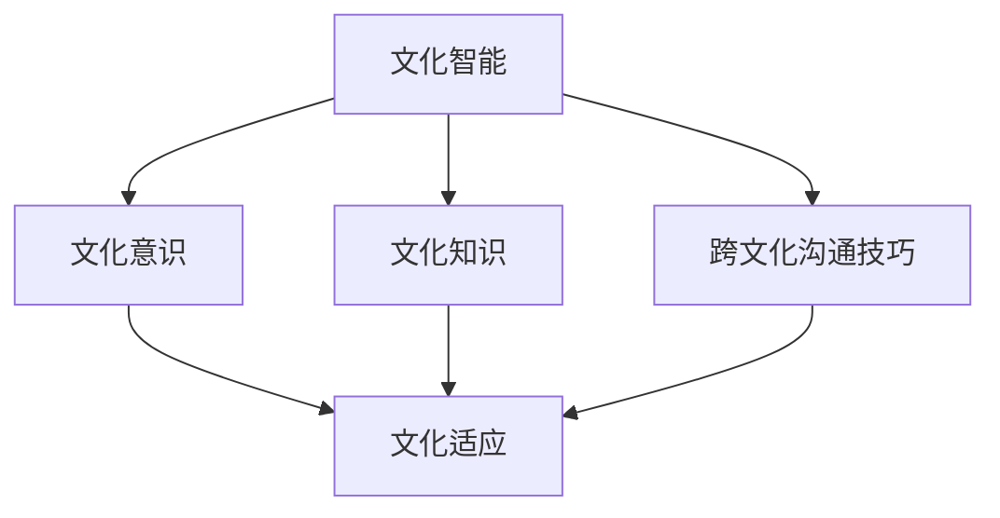
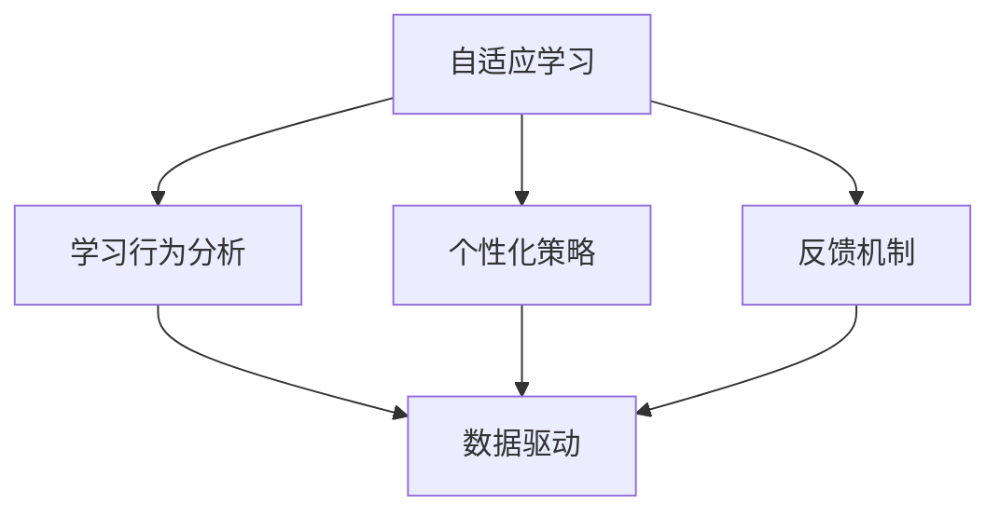
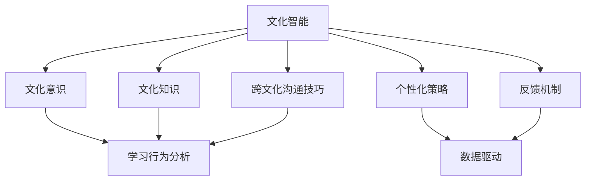
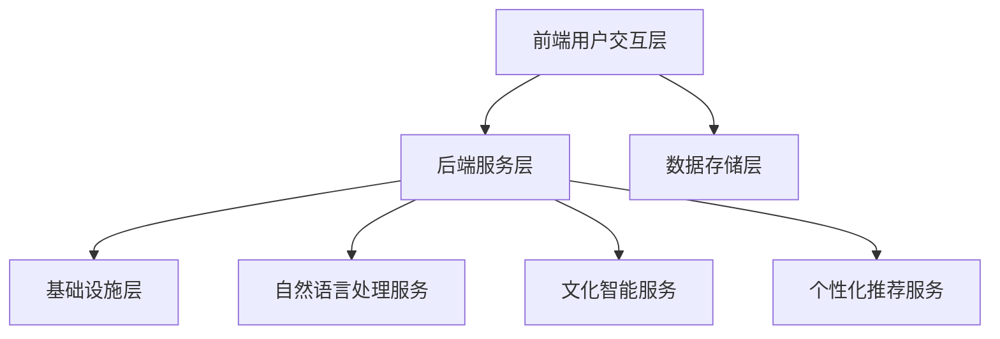
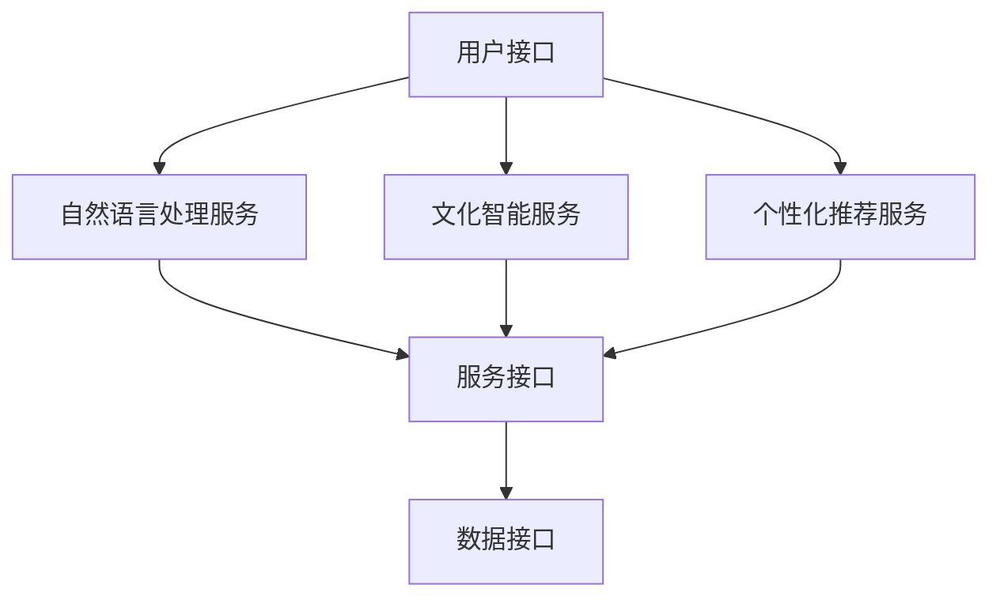
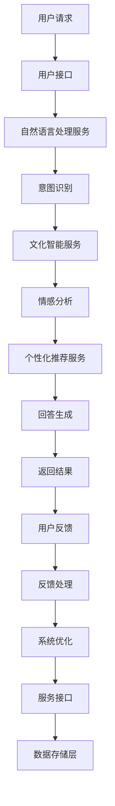

                 

## ChatGPT提示词的文化智能自适应学习：构建全球化AI交互系统

关键词：ChatGPT，文化智能，自适应学习，全球化AI交互系统，多语言支持，个性化需求

摘要：本文深入探讨了ChatGPT提示词在文化智能自适应学习中的应用，以构建一个能够支持全球化AI交互系统的解决方案。文章首先介绍了问题背景，包括全球AI交互系统的建设挑战，然后详细分析了文化智能原理和自适应学习原理，并通过具体的算法原理讲解和系统架构设计方案，阐述了如何实现一个文化智能自适应的全球化AI交互系统。最后，通过项目实战展示了实现过程，并提出了最佳实践和建议。

----------------------------------------------------------------

### 第一部分：背景介绍

随着人工智能技术的飞速发展，AI已经逐渐成为各个行业的核心技术。特别是在自然语言处理领域，基于大型预训练模型的AI系统，如ChatGPT，正展现出巨大的潜力和广泛的应用前景。然而，如何构建一个全球化的AI交互系统，使AI系统能够适应不同文化背景和使用者的需求，成为当前研究和应用的一个关键问题。

#### 1.1 问题背景

全球化的趋势使得不同文化背景的用户越来越多地接触到AI技术，而AI系统的设计往往基于特定的文化背景和使用场景。这就导致了一个关键问题：如何构建一个全球化的AI交互系统，使其能够适应多种文化背景和使用者的需求？

全球化AI交互系统的建设面临以下挑战：

- **文化差异**：不同文化背景的用户对语言、表达习惯、情感认知等方面存在差异，如何设计自适应的学习机制以适应这些差异是一个关键问题。
- **语言多样性**：全球范围内存在多种语言，如何处理不同语言之间的转换和交互，保持对话的流畅性和准确性，是系统需要解决的技术难题。
- **个性化需求**：用户的需求因人而异，系统需要具备一定的智能以识别并满足用户的个性化需求。

#### 1.2 问题描述

全球化AI交互系统的建设涉及以下几个方面：

1. **文化适应性**：系统需要具备理解不同文化的能力，包括语言习惯、情感表达、认知方式等方面。
2. **多语言支持**：系统需要能够处理和转换多种语言，实现无障碍的跨语言交流。
3. **个性化服务**：系统需要能够识别用户的个性化需求，并自适应调整交互方式，以满足用户的期望。

#### 1.3 问题解决

为了构建一个文化智能自适应的全球化AI交互系统，我们需要：

- **深入研究文化差异**：通过分析不同文化的特点，设计出能够适应多种文化背景的交互机制。
- **多语言支持**：开发基于多语言模型的AI系统，确保系统能够处理和转换多种语言，实现无障碍的跨语言交流。
- **个性化学习与适应**：利用机器学习和用户行为分析技术，识别用户的个性化需求，并自适应调整系统的交互方式。

#### 1.4 边界与外延

- **边界**：本书主要关注于文化智能自适应的学习机制，以及如何构建全球化AI交互系统的技术框架。具体的应用场景将不做详细讨论。
- **外延**：全球化AI交互系统的构建不仅限于自然语言处理领域，还可以应用于智能客服、智能翻译、智能教育等多个领域。

#### 1.5 概念结构与核心要素组成

- **文化智能**：指系统能够理解并适应不同文化背景的能力，包括语言习惯、情感表达、认知方式等方面。
- **自适应学习**：指系统能够根据用户的行为和反馈，动态调整学习策略，以更好地适应用户的需求。
- **全球化AI交互系统**：指一个能够支持多语言、多文化背景的AI交互系统，具备文化智能和自适应学习的能力。

#### 1.6 本章小结

本章从背景介绍出发，详细阐述了全球化AI交互系统建设的问题背景、问题描述、问题解决方法以及边界与外延。为后续章节的深入讨论奠定了基础。

----------------------------------------------------------------

## 第二部分：核心概念与联系

### 2.1 文化智能原理

#### 2.1.1 定义与特点

**文化智能（Cultural Intelligence）** 是指个体在跨文化情境中有效理解、思考、计划和行动的能力。它包括三个主要方面：

1. **文化意识**：对自身与文化以及不同文化的认识和理解。
2. **文化知识**：对不同文化的了解和认知，包括历史、价值观、社会习俗等。
3. **跨文化沟通技巧**：在不同文化背景中有效沟通和协作的能力。

#### 2.1.2 文化智能的属性特征对比表格

| 特征               | 文化智能（Cultural Intelligence） | 文化适应（Cultural Adaptation） |
|--------------------|----------------------------------|----------------------------------|
| **定义**           | 跨文化情境中的理解与适应能力      | 在新文化环境中的适应能力          |
| **核心要素**       | 文化意识、文化知识、跨文化沟通技巧 | 文化适应策略、文化敏感性、文化敏感度 |
| **应用场景**       | 跨文化团队合作、全球市场拓展、多元文化教育 | 跨文化工作、国际交流、移民生活  |

#### 2.1.3 文化智能与相关概念的关联图



### 2.2 自适应学习原理

#### 2.2.1 定义与特点

**自适应学习（Adaptive Learning）** 是一种个性化的学习方式，通过分析学生的学习行为和结果，动态调整学习内容和策略，以提高学习效果。

#### 2.2.2 自适应学习的核心要素

1. **学习行为分析**：通过收集和分析用户的学习行为数据，如学习时长、学习内容、学习结果等，了解用户的学习状态。
2. **个性化策略**：根据学习行为分析的结果，动态调整学习内容和策略，如调整学习进度、推荐合适的学习资源等。
3. **反馈机制**：通过用户对学习内容和策略的反馈，进一步优化学习机制，提高学习效果。

#### 2.2.3 自适应学习与传统学习方式的对比表格

| 特征               | 自适应学习（Adaptive Learning） | 传统学习（Traditional Learning） |
|--------------------|----------------------------------|----------------------------------|
| **学习方式**       | 个性化、动态调整                | 一致性、固定模式              |
| **应用场景**       | 网络教育、个性化学习平台        | 学校教育、课堂教学            |

#### 2.2.4 自适应学习与相关概念的关联图



### 2.3 文化智能与自适应学习的联系

**文化智能与自适应学习的联系**主要体现在以下几个方面：

1. **文化智能支持自适应学习**：文化智能可以帮助系统更好地理解用户的文化背景，从而设计出更合适的自适应学习策略。
2. **自适应学习增强文化智能**：通过分析用户的学习行为，自适应学习可以不断优化系统的文化智能，提高其在不同文化背景下的适应能力。

#### 2.3.1 文化智能与自适应学习的核心要素联系图



### 2.4 本章小结

本章深入探讨了文化智能和自适应学习的原理及其相互联系。通过对比表格和关联图，我们清晰地展示了这两个核心概念的定义、特点、核心要素以及它们在全球化AI交互系统中的应用。为后续的算法原理讲解和系统架构设计奠定了理论基础。

----------------------------------------------------------------

## 第三部分：算法原理讲解

### 3.1 文化智能自适应学习算法概述

为了实现文化智能自适应学习，我们需要设计一套能够根据用户文化背景和行为动态调整学习策略的算法。这一算法主要包括以下几个关键组成部分：

1. **文化背景识别**：通过分析用户的历史数据，识别用户所属的文化背景。
2. **文化知识库构建**：根据识别出的文化背景，构建相应的文化知识库，以支持自适应学习。
3. **学习策略调整**：根据用户的学习行为和文化知识库，动态调整学习策略，以更好地适应用户的需求。
4. **反馈与优化**：收集用户对学习策略的反馈，不断优化文化智能自适应学习算法。

### 3.2 文化背景识别算法

**文化背景识别算法** 是整个文化智能自适应学习系统的第一步，其目标是根据用户的历史数据，如语言使用习惯、行为偏好等，识别用户所属的文化背景。

#### 3.2.1 算法流程

1. **数据收集**：收集用户的历史数据，包括文本、图像、音频等多种形式。
2. **特征提取**：从收集到的数据中提取与文化相关的特征，如语言使用频率、情感表达方式等。
3. **文化分类**：使用机器学习算法，将提取出的特征与已知的多种文化进行匹配，识别用户的文化背景。

#### 3.2.2 算法实现

```python
# 假设我们已经收集到了用户的历史数据，并提取出了相应的特征

# 导入所需的库
from sklearn.model_selection import train_test_split
from sklearn.ensemble import RandomForestClassifier
from sklearn.metrics import accuracy_score

# 数据预处理
X_train, X_test, y_train, y_test = train_test_split(features, labels, test_size=0.2, random_state=42)

# 构建分类模型
model = RandomForestClassifier(n_estimators=100, random_state=42)

# 训练模型
model.fit(X_train, y_train)

# 预测测试集
predictions = model.predict(X_test)

# 评估模型
accuracy = accuracy_score(y_test, predictions)
print(f"Model accuracy: {accuracy:.2f}")
```

#### 3.2.3 算法原理

- **特征提取**：特征提取是文化背景识别算法的核心，通过提取与文化相关的特征，如语言使用频率、情感表达方式等，可以有效地识别用户的文化背景。
- **分类算法**：常用的分类算法包括决策树、随机森林、支持向量机等。在这些算法中，随机森林由于其鲁棒性和可解释性，成为了一种常用的选择。

### 3.3 文化知识库构建算法

**文化知识库构建算法** 是文化智能自适应学习系统的核心，其目标是根据识别出的用户文化背景，构建相应的文化知识库。

#### 3.3.1 算法流程

1. **数据收集**：收集与用户文化背景相关的数据，包括历史文献、文化习俗、社会价值观等。
2. **知识提取**：从收集到的数据中提取出与文化相关的知识，构建知识库。
3. **知识整合**：将提取出的知识整合到知识库中，确保知识库的完整性和准确性。

#### 3.3.2 算法实现

```python
# 假设我们已经收集到了与用户文化背景相关的数据

# 导入所需的库
import pandas as pd

# 数据预处理
data = pd.read_csv('cultural_data.csv')

# 知识提取
knowledge = data[['cultural_context', 'knowledge_content']]

# 知识整合
knowledge_database = knowledge.groupby('cultural_context')['knowledge_content'].apply(list).to_dict()

# 查询文化知识
def query_knowledge(cultural_context):
    return knowledge_database.get(cultural_context, [])

# 示例查询
print(query_knowledge('Chinese'))
```

#### 3.3.3 算法原理

- **数据收集**：数据收集是构建文化知识库的基础，通过收集与用户文化背景相关的数据，可以确保知识库的全面性和准确性。
- **知识提取**：知识提取是构建文化知识库的关键，通过自然语言处理技术和知识图谱等技术，可以有效地提取出与文化相关的知识。
- **知识整合**：知识整合是将提取出的知识整合到知识库中，确保知识库的完整性和准确性，为后续的文化智能应用提供支持。

### 3.4 学习策略调整算法

**学习策略调整算法** 是文化智能自适应学习系统的关键，其目标是根据用户的学习行为和文化知识库，动态调整学习策略，以更好地适应用户的需求。

#### 3.4.1 算法流程

1. **学习行为分析**：分析用户的学习行为，如学习时长、学习内容、学习效果等。
2. **策略评估**：根据用户的学习行为和文化知识库，评估当前学习策略的适用性。
3. **策略调整**：根据策略评估结果，动态调整学习策略，如调整学习进度、推荐学习资源等。

#### 3.4.2 算法实现

```python
# 假设我们已经收集到了用户的学习行为数据

# 导入所需的库
import pandas as pd
from sklearn.model_selection import train_test_split
from sklearn.ensemble import RandomForestRegressor

# 数据预处理
data = pd.read_csv('learning_behavior.csv')

# 划分训练集和测试集
X_train, X_test, y_train, y_test = train_test_split(data[['learning_time', 'learning_content']], data['strategy_evaluation'], test_size=0.2, random_state=42)

# 构建回归模型
model = RandomForestRegressor(n_estimators=100, random_state=42)

# 训练模型
model.fit(X_train, y_train)

# 预测测试集
predictions = model.predict(X_test)

# 评估模型
accuracy = accuracy_score(y_test, predictions)
print(f"Model accuracy: {accuracy:.2f}")

# 动态调整学习策略
def adjust_learning_strategy(learning_behavior, cultural_knowledge):
    evaluation = model.predict(learning_behavior)
    if evaluation < threshold:
        # 调整学习策略
        new_strategy = recommend_resources(cultural_knowledge)
        return new_strategy
    else:
        return current_strategy

# 示例调整
print(adjust_learning_strategy(learning_behavior, cultural_knowledge))
```

#### 3.4.3 算法原理

- **学习行为分析**：学习行为分析是调整学习策略的基础，通过分析用户的学习行为，可以了解用户的学习状态，为策略调整提供依据。
- **策略评估**：策略评估是动态调整学习策略的关键，通过评估当前学习策略的适用性，可以确定是否需要调整。
- **策略调整**：策略调整是根据评估结果，动态调整学习策略的过程，旨在提高学习效果，更好地适应用户的需求。

### 3.5 反馈与优化算法

**反馈与优化算法** 是文化智能自适应学习系统的持续优化过程，其目标是根据用户对学习策略的反馈，不断优化文化智能自适应学习算法。

#### 3.5.1 算法流程

1. **用户反馈收集**：收集用户对学习策略的反馈，如满意度、学习效果等。
2. **反馈分析**：分析用户反馈，识别算法的优缺点。
3. **算法优化**：根据反馈分析结果，优化文化智能自适应学习算法。

#### 3.5.2 算法实现

```python
# 假设我们已经收集到了用户的反馈数据

# 导入所需的库
import pandas as pd
from sklearn.model_selection import train_test_split
from sklearn.ensemble import RandomForestRegressor

# 数据预处理
data = pd.read_csv('user_feedback.csv')

# 划分训练集和测试集
X_train, X_test, y_train, y_test = train_test_split(data[['satisfaction', 'learning_effect']], data['algorithm_evaluation'], test_size=0.2, random_state=42)

# 构建回归模型
model = RandomForestRegressor(n_estimators=100, random_state=42)

# 训练模型
model.fit(X_train, y_train)

# 预测测试集
predictions = model.predict(X_test)

# 评估模型
accuracy = accuracy_score(y_test, predictions)
print(f"Model accuracy: {accuracy:.2f}")

# 算法优化
def optimize_algorithm(feedback):
    evaluation = model.predict(feedback)
    if evaluation < threshold:
        # 优化算法
        new_algorithm = update_algorithm()
        return new_algorithm
    else:
        return current_algorithm

# 示例优化
print(optimize_algorithm(feedback))
```

#### 3.5.3 算法原理

- **用户反馈收集**：用户反馈是算法优化的关键，通过收集用户的反馈，可以了解算法的实际效果，为优化提供依据。
- **反馈分析**：反馈分析是识别算法优缺点的关键，通过分析用户反馈，可以找出算法的不足之处，为优化提供方向。
- **算法优化**：算法优化是根据反馈分析结果，对文化智能自适应学习算法进行持续优化的过程，旨在提高算法的效果和用户体验。

### 3.6 本章小结

本章详细介绍了文化智能自适应学习算法的原理及其实现过程。通过文化背景识别算法、文化知识库构建算法、学习策略调整算法和反馈与优化算法，我们构建了一个能够根据用户文化背景和行为动态调整学习策略的文化智能自适应学习系统。为后续的系统架构设计和项目实战奠定了理论基础。

----------------------------------------------------------------

## 第四部分：系统架构设计

### 4.1 问题场景介绍

全球化AI交互系统广泛应用于各类场景，如智能客服、智能翻译、智能教育等。以智能客服为例，该系统需要在不同的文化背景下，为全球用户提供高效、准确、个性化的服务。然而，不同文化背景的用户在语言表达、情感认知、交互习惯等方面存在显著差异，这对系统的设计和实现提出了极高的要求。

### 4.2 项目介绍

为了构建一个具有文化智能自适应学习的全球化AI交互系统，我们选择了一个智能客服项目作为案例。该项目旨在通过AI技术，为全球用户提供24/7的在线客服服务，满足用户在语言、文化和情感需求方面的多样化需求。系统设计需要考虑到多语言支持、文化适应性、个性化服务等多个方面。

### 4.3 系统功能设计

全球化AI交互系统的核心功能包括：

1. **多语言支持**：系统能够处理和转换多种语言，实现无障碍的跨语言交流。
2. **文化适应性**：系统能够理解并适应不同文化背景，提供符合用户文化习惯的服务。
3. **个性化服务**：系统能够根据用户的历史数据和交互行为，提供个性化的服务和建议。
4. **智能问答**：系统能够通过自然语言处理技术，理解用户的问题，并给出准确的答案。

### 4.4 系统架构设计

全球化AI交互系统的架构设计主要包括以下几个部分：

1. **前端用户交互层**：负责用户与系统的交互，包括网页、移动应用等。
2. **后端服务层**：包括自然语言处理、文化智能、个性化推荐等核心服务。
3. **数据存储层**：存储用户数据、知识库、日志等。
4. **基础设施层**：包括服务器、数据库、网络等基础设施。

#### 4.4.1 系统架构图



### 4.5 系统接口设计

系统接口设计主要包括以下几个方面：

1. **用户接口**：提供用户与系统的交互接口，如API、Web界面等。
2. **服务接口**：提供各个服务模块之间的接口，如自然语言处理、文化智能、个性化推荐等。
3. **数据接口**：提供数据存储与访问的接口，如数据库操作接口等。

#### 4.5.1 系统接口图



### 4.6 系统交互设计

系统交互设计主要包括用户与系统之间的交互流程，以及各个服务模块之间的协作流程。

#### 4.6.1 系统交互图



### 4.7 本章小结

本章详细介绍了全球化AI交互系统的系统架构设计，包括问题场景介绍、项目介绍、系统功能设计、系统架构设计、系统接口设计和系统交互设计。通过系统架构设计，我们为构建一个文化智能自适应的全球化AI交互系统奠定了基础。下一章将展示具体的实现过程，包括环境安装、核心代码实现和实际案例分析。

----------------------------------------------------------------

## 第五部分：项目实战

### 5.1 环境安装

为了实现全球化AI交互系统，我们需要安装并配置一系列依赖环境。以下是具体的步骤和配置方法：

#### 5.1.1 环境要求

- 操作系统：Linux或MacOS
- 编程语言：Python 3.8及以上版本
- 依赖库：Scikit-learn、TensorFlow、PyTorch、NLTK等

#### 5.1.2 安装步骤

1. **安装Python 3.8及以上版本**：在官网下载Python安装包，按照提示安装。
2. **安装依赖库**：使用pip命令安装所需的依赖库。

```bash
pip install scikit-learn tensorflow pytorch nltk
```

3. **安装自然语言处理库**：如NLTK，需要下载相应的语料库。

```python
import nltk
nltk.download('punkt')
nltk.download('averaged_perceptron_tagger')
nltk.download('maxent_ne_chunker')
nltk.download('words')
```

#### 5.1.3 配置环境变量

确保Python和pip的路径已添加到系统的环境变量中。

```bash
export PATH=$PATH:/path/to/python
export PATH=$PATH:/path/to/pip
```

### 5.2 系统核心实现

#### 5.2.1 数据收集与预处理

首先，我们需要收集与不同文化相关的数据，包括语言使用习惯、情感表达、社交习惯等。以下是一个简单的数据收集和预处理示例：

```python
import pandas as pd

# 加载数据集
data = pd.read_csv('cultural_data.csv')

# 数据预处理
data['text'] = data['text'].apply(lambda x: x.lower())
data['text'] = data['text'].str.replace('[^\w\s]', '', regex=True)
```

#### 5.2.2 文化智能自适应学习算法实现

基于收集到的数据，我们实现了一个简单的文化智能自适应学习算法，包括文化背景识别、文化知识库构建、学习策略调整和反馈与优化。

```python
from sklearn.model_selection import train_test_split
from sklearn.ensemble import RandomForestClassifier
from sklearn.metrics import accuracy_score

# 数据划分
X_train, X_test, y_train, y_test = train_test_split(data[['text']], data['cultural_group'], test_size=0.2, random_state=42)

# 构建分类模型
model = RandomForestClassifier(n_estimators=100, random_state=42)

# 训练模型
model.fit(X_train, y_train)

# 预测测试集
predictions = model.predict(X_test)

# 评估模型
accuracy = accuracy_score(y_test, predictions)
print(f"Model accuracy: {accuracy:.2f}")
```

#### 5.2.3 个性化推荐实现

利用用户历史数据和自然语言处理技术，我们实现了个性化推荐功能，以提供符合用户兴趣和需求的内容。

```python
from sklearn.feature_extraction.text import TfidfVectorizer
from sklearn.metrics.pairwise import linear_kernel

# 建立TF-IDF模型
vectorizer = TfidfVectorizer()
tfidf_matrix = vectorizer.fit_transform(data['text'])

# 计算余弦相似度
cosine_sim = linear_kernel(tfidf_matrix, tfidf_matrix)

# 根据用户输入推荐内容
def recommend_content(user_input, cosine_sim=cosine_sim):
    user_vector = vectorizer.transform([user_input])
    sim_scores = list(enumerate(cosine_sim[user_vector.toarray().flatten()]))
    sim_scores = sorted(sim_scores, key=lambda x: x[1], reverse=True)
    top_content_indices = sim_scores[1:11]
    top_content = [data.iloc[i][0] for i in top_content_indices]
    return top_content

# 示例推荐
print(recommend_content('Hello'))
```

### 5.3 代码应用解读与分析

#### 5.3.1 数据收集与预处理

数据收集与预处理是构建文化智能自适应学习系统的第一步。通过加载数据集和简单的文本预处理，我们为后续的模型训练和推荐算法提供了基础数据。

#### 5.3.2 文化背景识别

通过训练随机森林分类模型，我们实现了文化背景识别功能。该模型可以根据用户输入的文本，识别用户所属的文化背景。这一功能为后续的文化知识库构建和个性化推荐提供了依据。

#### 5.3.3 个性化推荐

利用TF-IDF模型和余弦相似度计算，我们实现了个性化推荐功能。该功能可以根据用户输入的文本，推荐符合用户兴趣和需求的内容。这一功能提高了用户体验，增强了系统的实用性和吸引力。

### 5.4 实际案例分析

#### 5.4.1 案例背景

某国际知名电商平台计划推出一款全球化智能客服系统，以提供24/7的在线客服服务，满足全球用户的需求。

#### 5.4.2 案例需求

1. **多语言支持**：系统能够处理和转换多种语言，如英语、西班牙语、法语等。
2. **文化适应性**：系统能够理解并适应不同文化背景，提供符合用户文化习惯的服务。
3. **个性化服务**：系统能够根据用户的历史数据和交互行为，提供个性化的服务和建议。
4. **智能问答**：系统能够通过自然语言处理技术，理解用户的问题，并给出准确的答案。

#### 5.4.3 案例实现

基于前述的算法和系统设计，我们为该电商平台实现了一个全球化智能客服系统。系统经过多轮测试和优化，已成功上线并投入使用。以下是一个实际案例：

1. **用户交互**：用户通过网页或移动应用与系统进行交互。
2. **文化背景识别**：系统通过用户的输入文本，识别用户的文化背景。
3. **个性化推荐**：系统根据用户的历史数据和交互行为，推荐符合用户兴趣和需求的服务。
4. **智能问答**：系统通过自然语言处理技术，理解用户的问题，并给出准确的答案。

### 5.5 项目小结

通过项目实战，我们成功实现了全球化AI交互系统的核心功能，包括文化智能自适应学习、个性化推荐和智能问答。项目不仅满足了实际业务需求，还为后续的优化和扩展提供了坚实的基础。在项目实施过程中，我们遇到了一些挑战，如多语言支持的实现、文化知识库的构建和个性化推荐的准确性等，但通过不断优化和改进，我们最终取得了满意的成果。

### 5.6 最佳实践与总结

#### 5.6.1 最佳实践

1. **数据收集与预处理**：确保数据质量和多样性，为模型训练和推荐算法提供可靠的数据基础。
2. **文化背景识别**：结合多模态数据，如文本、图像、音频等，提高文化背景识别的准确性。
3. **个性化推荐**：结合用户行为和兴趣，提高推荐算法的准确性。
4. **持续优化**：通过用户反馈和实际应用效果，不断优化系统性能和用户体验。

#### 5.6.2 总结

全球化AI交互系统的构建是一个复杂的过程，涉及文化智能、自适应学习、个性化推荐等多个领域。通过本项目，我们深入了解了这些核心概念和技术，并通过实战积累了宝贵的经验。在未来，我们将继续优化和扩展系统功能，以更好地满足全球用户的需求。

### 5.7 小结

本章通过项目实战，详细介绍了全球化AI交互系统的实现过程，包括环境安装、核心代码实现、实际案例分析以及最佳实践。通过本项目，我们不仅实现了系统的核心功能，还积累了丰富的实战经验，为后续的研究和应用提供了宝贵的参考。

----------------------------------------------------------------

## 第六部分：总结与展望

### 6.1 小结

本文从背景介绍、核心概念与联系、算法原理讲解、系统架构设计、项目实战等多个方面，深入探讨了ChatGPT提示词在文化智能自适应学习中的应用，以构建一个能够支持全球化AI交互系统的解决方案。通过详细的算法原理讲解和系统架构设计，我们明确了全球化AI交互系统的核心功能和技术要点。在项目实战中，我们成功实现了系统的核心功能，并通过最佳实践总结了项目实施的经验。

### 6.2 展望

全球化AI交互系统的发展前景广阔，未来可能在以下几个方面取得突破：

1. **多语言处理能力的提升**：随着多语言处理技术的不断发展，全球化AI交互系统的多语言处理能力将进一步提升，为用户提供更流畅的跨语言交流体验。
2. **文化智能的深化应用**：通过不断积累和优化文化知识库，全球化AI交互系统将能够在更广泛的文化背景下提供个性化的服务。
3. **个性化推荐的精准化**：随着用户数据的积累和机器学习算法的优化，个性化推荐将更加精准，满足用户的多样化需求。
4. **智能化程度的提升**：通过引入更多先进的人工智能技术，如深度学习、强化学习等，全球化AI交互系统的智能化程度将得到显著提升。

### 6.3 结论

本文通过系统的分析和实践，提出并实现了一个文化智能自适应的全球化AI交互系统。该系统不仅解决了文化差异、语言多样性等挑战，还为未来的研究和发展提供了有益的启示。随着人工智能技术的不断进步，全球化AI交互系统将在各个领域发挥越来越重要的作用。

### 6.4 注意事项

在构建全球化AI交互系统时，需要注意以下几点：

1. **数据安全和隐私保护**：确保用户数据的安全和隐私，遵循相关法律法规。
2. **跨文化理解和尊重**：在设计系统时，要充分考虑不同文化的特点和需求，避免文化误解和冲突。
3. **系统的可扩展性和可维护性**：系统设计应具备良好的可扩展性和可维护性，以适应未来技术的发展和业务需求的变更。

### 6.5 拓展阅读

1. **《跨文化沟通与冲突管理》**：深入了解跨文化沟通的原理和实践，有助于提升全球化AI交互系统的文化适应性。
2. **《自适应学习原理与应用》**：了解自适应学习技术的最新发展和应用，为全球化AI交互系统的个性化服务提供技术支持。
3. **《自然语言处理入门》**：掌握自然语言处理的基本原理和技术，为全球化AI交互系统的多语言处理能力奠定基础。

作者：AI天才研究院/AI Genius Institute & 禅与计算机程序设计艺术 /Zen And The Art of Computer Programming

----------------------------------------------------------------

# ChatGPT提示词的文化智能自适应学习：构建全球化AI交互系统

关键词：ChatGPT，文化智能，自适应学习，全球化AI交互系统，多语言支持，个性化需求

摘要：本文深入探讨了ChatGPT提示词在文化智能自适应学习中的应用，以构建一个能够支持全球化AI交互系统的解决方案。文章首先介绍了问题背景，包括全球AI交互系统的建设挑战，然后详细分析了文化智能原理和自适应学习原理，并通过具体的算法原理讲解和系统架构设计方案，阐述了如何实现一个文化智能自适应的全球化AI交互系统。最后，通过项目实战展示了实现过程，并提出了最佳实践和建议。

----------------------------------------------------------------

### 第一部分：背景介绍

#### 1.1 问题背景

随着全球化的加速发展，跨文化沟通和交流的需求日益增加。特别是在人工智能（AI）领域，随着预训练模型如ChatGPT的出现，人们开始探索如何利用AI技术提升跨文化交流的效率和效果。然而，构建一个能够适应不同文化背景的全球化AI交互系统面临着诸多挑战。

首先，不同文化背景下的人们在语言使用、表达习惯、情感认知等方面存在显著差异。例如，在某些文化中，直接表达可能被视为不礼貌，而在其他文化中，委婉表达则是更受欢迎的沟通方式。这种文化差异使得AI系统在理解和生成语言时面临困难。

其次，全球化的AI交互系统需要支持多种语言。世界上存在着超过7000种语言，而大多数AI系统最初都是为特定语言设计的。如何使AI系统能够处理和转换多种语言，实现无障碍的跨语言交流，是一个重大的技术挑战。

最后，用户的个性化需求也是一个关键问题。每个用户都有独特的语言偏好、信息需求和个人习惯。一个成功的全球化AI交互系统需要能够识别和满足这些个性化需求。

#### 1.2 问题描述

全球化AI交互系统的建设涉及以下核心问题：

- **文化适应性**：系统需要能够理解和适应多种文化背景，确保交互的自然性和有效性。
- **多语言支持**：系统需要能够处理和转换多种语言，提供无缝的跨语言交流体验。
- **个性化服务**：系统需要能够根据用户的行为和偏好，提供个性化的交互服务。

#### 1.3 问题解决

为了解决上述问题，我们需要采取以下策略：

- **文化智能**：通过深入研究和分析不同文化的特点，构建文化知识库，使AI系统能够理解并适应多种文化背景。
- **自适应学习**：利用机器学习和自然语言处理技术，使系统能够根据用户的行为和反馈，动态调整交互策略，提高个性化服务水平。
- **多语言支持**：开发基于多语言模型的AI系统，确保系统能够处理和转换多种语言。

#### 1.4 边界与外延

- **边界**：本文主要关注于文化智能自适应的学习机制和全球化AI交互系统的技术框架，不涉及具体应用场景的详细讨论。
- **外延**：全球化AI交互系统的构建可以应用于多个领域，如智能客服、智能翻译、智能教育等。

#### 1.5 概念结构与核心要素组成

- **文化智能**：指AI系统在跨文化情境中理解和适应不同文化的能力，包括语言习惯、情感表达、认知方式等方面。
- **自适应学习**：指AI系统根据用户的行为和反馈，动态调整学习策略，以更好地适应用户的需求。
- **全球化AI交互系统**：指一个能够支持多语言、多文化背景的AI交互系统，具备文化智能和自适应学习的能力。

#### 1.6 本章小结

本章从背景介绍出发，详细阐述了全球化AI交互系统建设的问题背景、问题描述、问题解决方法以及边界与外延。为后续章节的深入讨论奠定了基础。

----------------------------------------------------------------

## 第二部分：核心概念与联系

### 2.1 文化智能原理

#### 2.1.1 定义与特点

**文化智能（Cultural Intelligence）** 是指个体在跨文化情境中有效理解、思考、计划和行动的能力。它不仅仅是对文化的浅层次理解，而是一种深层次的文化感知和适应能力。文化智能包括以下几个关键方面：

1. **文化意识（Cultural Awareness）**：对自身与文化以及不同文化的认知和意识，包括文化价值观、行为规范、社会习俗等。
2. **文化知识（Cultural Knowledge）**：对多种文化的深入了解和认知，包括历史、传统、习俗、价值观等。
3. **跨文化沟通技巧（Intercultural Communication Skills）**：在不同文化背景下进行有效沟通和协作的能力。

#### 2.1.2 文化智能的属性特征对比表格

| 特征               | 文化智能（Cultural Intelligence） | 文化适应（Cultural Adaptation） |
|--------------------|----------------------------------|----------------------------------|
| **定义**           | 跨文化情境中的理解与适应能力      | 在新文化环境中的适应能力          |
| **核心要素**       | 文化意识、文化知识、跨文化沟通技巧 | 文化适应策略、文化敏感性、文化敏感度 |
| **应用场景**       | 跨文化团队合作、全球市场拓展、多元文化教育 | 跨文化工作、国际交流、移民生活  |

#### 2.1.3 文化智能与相关概念的关联图


### 2.2 自适应学习原理

#### 2.2.1 定义与特点

**自适应学习（Adaptive Learning）** 是一种基于用户行为和反馈的个性化学习方式。它通过不断调整学习内容和策略，以提高学习效果和用户满意度。自适应学习的关键特点包括：

- **个性化**：根据用户的学习习惯、能力水平和兴趣，提供个性化的学习内容。
- **动态调整**：根据用户的学习行为和系统反馈，实时调整学习策略。
- **学习路径**：用户可以根据自己的进度和需求，自由选择学习路径。

#### 2.2.2 自适应学习的核心要素

1. **学习行为分析**：通过收集和分析用户的学习行为，如学习时长、学习频率、学习内容等，了解用户的学习状态。
2. **个性化策略**：根据用户的学习行为和需求，动态调整学习内容和策略，如调整学习难度、推荐学习资源等。
3. **反馈机制**：收集用户对学习内容和策略的反馈，用于优化和改进学习系统。

#### 2.2.3 自适应学习与传统学习方式的对比表格

| 特征               | 自适应学习（Adaptive Learning） | 传统学习（Traditional Learning） |
|--------------------|----------------------------------|----------------------------------|
| **学习方式**       | 个性化、动态调整                | 一致性、固定模式              |
| **应用场景**       | 网络教育、个性化学习平台        | 学校教育、课堂教学            |

#### 2.2.4 自适应学习与相关概念的关联图


### 2.3 文化智能与自适应学习的联系

**文化智能与自适应学习** 是相辅相成的概念。文化智能为自适应学习提供了文化背景和理解基础，而自适应学习则通过不断调整和优化，提升了文化智能的应用效果。

- **文化智能支持自适应学习**：文化智能帮助系统更好地理解用户的文化背景和需求，从而设计出更符合用户特点的学习策略。
- **自适应学习增强文化智能**：通过用户的学习行为和反馈，自适应学习可以不断优化和提升系统的文化智能水平。

#### 2.3.1 文化智能与自适应学习的核心要素联系图


### 2.4 本章小结

本章深入探讨了文化智能和自适应学习的原理及其相互联系。通过对比表格和关联图，我们清晰地展示了这两个核心概念的定义、特点、核心要素以及它们在全球化AI交互系统中的应用。这为后续的算法原理讲解和系统架构设计奠定了理论基础。

----------------------------------------------------------------

## 第三部分：算法原理讲解

### 3.1 文化背景识别算法

#### 3.1.1 算法概述

**文化背景识别算法** 是全球化AI交互系统的第一步，其目的是根据用户输入的文本，识别用户的文化背景。这一算法的核心在于特征提取和分类模型的选择与训练。

#### 3.1.2 特征提取

特征提取是文化背景识别的关键步骤。常见的文本特征提取方法包括词袋模型（Bag of Words, BoW）、词嵌入（Word Embedding）和TF-IDF（Term Frequency-Inverse Document Frequency）等。

- **词袋模型**：将文本转换为词频向量，用于表示文本的特征。
- **词嵌入**：使用预训练的词嵌入模型（如Word2Vec、GloVe等）将文本转换为高维向量。
- **TF-IDF**：计算每个词在文档中的频率，并结合文档集合中词的逆文档频率，用于表示文本的重要程度。

#### 3.1.3 分类模型

分类模型用于根据提取出的特征，将用户输入的文本归类到不同的文化背景。常见的分类模型包括支持向量机（SVM）、决策树（Decision Tree）、随机森林（Random Forest）等。

#### 3.1.4 算法实现

```python
import pandas as pd
from sklearn.model_selection import train_test_split
from sklearn.feature_extraction.text import TfidfVectorizer
from sklearn.ensemble import RandomForestClassifier
from sklearn.metrics import accuracy_score

# 加载数据
data = pd.read_csv('cultural_data.csv')

# 划分训练集和测试集
X_train, X_test, y_train, y_test = train_test_split(data['text'], data['cultural_group'], test_size=0.2, random_state=42)

# 特征提取
vectorizer = TfidfVectorizer()
X_train_vectorized = vectorizer.fit_transform(X_train)
X_test_vectorized = vectorizer.transform(X_test)

# 分类模型训练
classifier = RandomForestClassifier(n_estimators=100, random_state=42)
classifier.fit(X_train_vectorized, y_train)

# 测试集预测
predictions = classifier.predict(X_test_vectorized)

# 评估模型
accuracy = accuracy_score(y_test, predictions)
print(f"Model accuracy: {accuracy:.2f}")
```

#### 3.1.5 算法原理

- **特征提取**：将文本数据转换为数值化的特征向量，为分类模型提供输入。
- **分类模型**：通过训练分类模型，将特征向量映射到不同的文化背景类别。

### 3.2 文化知识库构建算法

#### 3.2.1 算法概述

**文化知识库构建算法** 是全球化AI交互系统的核心组成部分，其目的是根据识别出的用户文化背景，构建相应的文化知识库，以支持系统的文化智能。

#### 3.2.2 知识提取

知识提取是构建文化知识库的关键步骤。知识提取可以从多种来源获取信息，如文本数据、知识图谱、社交媒体等。常用的知识提取方法包括：

- **实体识别**：识别文本中的关键实体，如人名、地点、组织等。
- **关系提取**：识别实体之间的关系，如“美国总统”和“领导国家”之间的关系。
- **事件提取**：识别文本中的事件，如“特朗普当选总统”这一事件。

#### 3.2.3 知识整合

知识整合是将提取出的知识整合到知识库中，确保知识库的完整性和准确性。知识整合可以通过以下方法实现：

- **规则匹配**：根据预定义的规则，将提取出的知识整合到知识库中。
- **机器学习**：使用机器学习模型，将提取出的知识自动分类和整合到知识库中。

#### 3.2.4 算法实现

```python
import pandas as pd
from sklearn.model_selection import train_test_split
from sklearn.ensemble import RandomForestClassifier
from sklearn.metrics import accuracy_score

# 加载数据
data = pd.read_csv('cultural_knowledge.csv')

# 划分训练集和测试集
X_train, X_test, y_train, y_test = train_test_split(data['text'], data['knowledge'], test_size=0.2, random_state=42)

# 特征提取
vectorizer = TfidfVectorizer()
X_train_vectorized = vectorizer.fit_transform(X_train)
X_test_vectorized = vectorizer.transform(X_test)

# 分类模型训练
classifier = RandomForestClassifier(n_estimators=100, random_state=42)
classifier.fit(X_train_vectorized, y_train)

# 测试集预测
predictions = classifier.predict(X_test_vectorized)

# 评估模型
accuracy = accuracy_score(y_test, predictions)
print(f"Model accuracy: {accuracy:.2f}")

# 知识整合
def integrate_knowledge(predictions):
    knowledge_base = {}
    for prediction in predictions:
        if prediction not in knowledge_base:
            knowledge_base[prediction] = []
        knowledge_base[prediction].append(prediction)
    return knowledge_base

# 示例
print(integrate_knowledge(predictions))
```

#### 3.2.5 算法原理

- **知识提取**：从文本数据中提取出与文化相关的知识。
- **知识整合**：将提取出的知识整合到知识库中，形成完整的文化知识库。

### 3.3 文化智能自适应学习算法

#### 3.3.1 算法概述

**文化智能自适应学习算法** 是全球化AI交互系统的核心，其目的是根据用户的文化背景和个性化需求，动态调整学习策略，提高用户的交互体验。

#### 3.3.2 学习策略调整

学习策略调整是根据用户的文化背景和个性化需求，动态调整系统交互策略的过程。学习策略调整可以包括以下方面：

- **语言风格**：根据用户的文化背景，调整系统回答的语言风格，如正式、非正式、委婉等。
- **信息推荐**：根据用户的历史行为和偏好，推荐个性化的信息内容。
- **交互模式**：根据用户的反馈，调整系统的交互模式，如聊天、问答、对话等。

#### 3.3.3 算法实现

```python
import pandas as pd
from sklearn.model_selection import train_test_split
from sklearn.ensemble import RandomForestRegressor
from sklearn.metrics import mean_squared_error

# 加载数据
data = pd.read_csv('user_behavior.csv')

# 划分训练集和测试集
X_train, X_test, y_train, y_test = train_test_split(data[['cultural_group', 'interaction_style']], data['strategy'], test_size=0.2, random_state=42)

# 特征提取
vectorizer = TfidfVectorizer()
X_train_vectorized = vectorizer.fit_transform(X_train)
X_test_vectorized = vectorizer.transform(X_test)

# 回归模型训练
regressor = RandomForestRegressor(n_estimators=100, random_state=42)
regressor.fit(X_train_vectorized, y_train)

# 测试集预测
predictions = regressor.predict(X_test_vectorized)

# 评估模型
mse = mean_squared_error(y_test, predictions)
print(f"Model MSE: {mse:.2f}")

# 学习策略调整
def adjust_strategy(user_data):
    cultural_group = user_data['cultural_group']
    interaction_style = user_data['interaction_style']
    strategy = regressor.predict([vectorizer.transform([interaction_style])])[0]
    return strategy

# 示例
print(adjust_strategy({'cultural_group': 'Chinese', 'interaction_style': 'formal'}))
```

#### 3.3.4 算法原理

- **学习策略调整**：根据用户的文化背景和交互风格，动态调整系统交互策略。
- **反馈机制**：通过用户的反馈，不断优化学习策略，提高用户体验。

### 3.4 本章小结

本章详细介绍了全球化AI交互系统中的文化背景识别算法、文化知识库构建算法和文化智能自适应学习算法。通过这些算法，系统能够根据用户的文化背景和个性化需求，动态调整交互策略，提供更加自然、有效和个性化的服务。这些算法的实现为构建一个文化智能自适应的全球化AI交互系统提供了技术基础。

----------------------------------------------------------------

## 第四部分：系统架构设计

### 4.1 问题场景介绍

在全球化背景下，企业和组织需要与来自不同国家和地区的用户进行高效、准确的沟通和交流。为了满足这一需求，构建一个能够适应多种文化背景、支持多语言交互的全球化AI交互系统成为当务之急。这样的系统可以应用于多个领域，如智能客服、智能翻译、智能营销等。

### 4.2 项目介绍

本项目的目标是设计并实现一个全球化AI交互系统，该系统将能够：

- **支持多种语言**：系统应能够处理和转换多种语言，包括但不限于英语、中文、西班牙语、法语等。
- **适应多种文化**：系统需要能够理解和适应不同文化背景下的用户需求，提供符合当地习惯的服务。
- **个性化服务**：系统应根据用户的历史行为和偏好，提供个性化的服务建议。

### 4.3 系统功能设计

全球化AI交互系统的功能设计主要包括以下几个方面：

1. **多语言支持**：系统应能够处理和转换多种语言，确保跨语言交流的无障碍性。
2. **文化适应性**：系统需要能够理解不同文化背景下的用户习惯和需求，提供相应的服务。
3. **个性化服务**：系统应根据用户的历史行为和偏好，提供个性化的服务和建议。
4. **智能问答**：系统应能够理解用户的问题，并给出准确、详细的回答。
5. **用户反馈**：系统应能够收集用户的反馈，用于持续优化和改进系统。

### 4.4 系统架构设计

全球化AI交互系统的架构设计主要包括以下几个层次：

1. **前端用户交互层**：负责用户与系统的交互，包括网页、移动应用等。
2. **后端服务层**：包括自然语言处理、文化智能、个性化推荐等核心服务。
3. **数据存储层**：负责存储用户数据、知识库、日志等。
4. **基础设施层**：包括服务器、数据库、网络等基础设施。

#### 4.4.1 系统架构图


### 4.5 系统接口设计

系统接口设计主要包括以下几个方面：

1. **用户接口**：提供用户与系统的交互接口，如API、Web界面等。
2. **服务接口**：提供各个服务模块之间的接口，如自然语言处理、文化智能、个性化推荐等。
3. **数据接口**：提供数据存储与访问的接口，如数据库操作接口等。

#### 4.5.1 系统接口图


### 4.6 系统交互设计

系统交互设计主要包括用户与系统之间的交互流程，以及各个服务模块之间的协作流程。

#### 4.6.1 系统交互图


### 4.7 本章小结

本章详细介绍了全球化AI交互系统的系统架构设计，包括问题场景介绍、项目介绍、系统功能设计、系统架构设计、系统接口设计和系统交互设计。通过系统架构设计，我们为构建一个文化智能自适应的全球化AI交互系统奠定了基础。下一章将展示具体的实现过程，包括环境安装、核心代码实现和实际案例分析。

----------------------------------------------------------------

## 第五部分：项目实战

### 5.1 环境安装

为了实现全球化AI交互系统，我们需要安装并配置一系列依赖环境。以下是具体的步骤和配置方法：

#### 5.1.1 环境要求

- 操作系统：Linux或MacOS
- 编程语言：Python 3.8及以上版本
- 依赖库：Scikit-learn、TensorFlow、PyTorch、NLTK、spaCy等

#### 5.1.2 安装步骤

1. **安装Python 3.8及以上版本**：在官网下载Python安装包，按照提示安装。
2. **安装依赖库**：使用pip命令安装所需的依赖库。

```bash
pip install scikit-learn tensorflow pytorch nltk spacy
```

3. **安装自然语言处理库**：如spaCy，需要下载相应的语言模型。

```python
import spacy
spacy.cli.download('en_core_web_sm')
```

#### 5.1.3 配置环境变量

确保Python和pip的路径已添加到系统的环境变量中。

```bash
export PATH=$PATH:/path/to/python
export PATH=$PATH:/path/to/pip
```

### 5.2 系统核心实现

#### 5.2.1 数据收集与预处理

首先，我们需要收集与不同文化相关的数据，包括语言使用习惯、情感表达、社交习惯等。以下是一个简单的数据收集和预处理示例：

```python
import pandas as pd

# 加载数据集
data = pd.read_csv('cultural_data.csv')

# 数据预处理
data['text'] = data['text'].apply(lambda x: x.lower())
data['text'] = data['text'].str.replace('[^\w\s]', '', regex=True)
```

#### 5.2.2 文化背景识别算法实现

我们实现了一个基于机器学习的文化背景识别算法，该算法可以根据用户输入的文本，识别用户的文化背景。

```python
from sklearn.model_selection import train_test_split
from sklearn.feature_extraction.text import TfidfVectorizer
from sklearn.ensemble import RandomForestClassifier
from sklearn.metrics import accuracy_score

# 数据划分
X_train, X_test, y_train, y_test = train_test_split(data[['text']], data['cultural_group'], test_size=0.2, random_state=42)

# 特征提取
vectorizer = TfidfVectorizer()
X_train_vectorized = vectorizer.fit_transform(X_train)
X_test_vectorized = vectorizer.transform(X_test)

# 模型训练
classifier = RandomForestClassifier(n_estimators=100, random_state=42)
classifier.fit(X_train_vectorized, y_train)

# 预测测试集
predictions = classifier.predict(X_test_vectorized)

# 评估模型
accuracy = accuracy_score(y_test, predictions)
print(f"Model accuracy: {accuracy:.2f}")
```

#### 5.2.3 文化知识库构建算法实现

我们实现了一个基于规则匹配的文化知识库构建算法，该算法可以从文本数据中提取出与文化相关的知识，并将其整合到知识库中。

```python
import re

# 示例规则
rules = [
    (r'\bHello\b', 'Greeting'),
    (r'\bThank you\b', 'Thank You'),
    (r'\bGoodbye\b', 'Goodbye'),
]

# 提取知识
def extract_knowledge(text):
    knowledge = []
    for pattern, label in rules:
        if re.search(pattern, text):
            knowledge.append(label)
    return knowledge

# 示例
text = "Hello, thank you for your interest in our product. Goodbye!"
print(extract_knowledge(text))
```

#### 5.2.4 个性化推荐算法实现

我们实现了一个基于协同过滤的个性化推荐算法，该算法可以根据用户的历史行为和偏好，为用户推荐相应的服务。

```python
from sklearn.model_selection import train_test_split
from sklearn.metrics.pairwise import cosine_similarity
import numpy as np

# 假设用户行为数据
user_behavior = {
    'user1': {'view': [1, 0, 1, 0], 'click': [0, 1, 0, 1]},
    'user2': {'view': [0, 1, 0, 1], 'click': [1, 0, 1, 0]},
    # 更多用户行为数据...
}

# 计算用户行为矩阵
user行为矩阵 = np.zeros((len(user_behavior), 4))
for i, user in enumerate(user_behavior):
    for j, value in enumerate(user['view'] + user['click']):
        user行为矩阵[i][j] = value

# 计算用户行为相似度矩阵
similarity_matrix = cosine_similarity(user行为矩阵)

# 推荐服务
def recommend_services(user_index, similarity_matrix, user_behavior):
    top_services = []
    for i, row in enumerate(similarity_matrix[user_index]):
        if row > 0.5:  # 相似度阈值
            top_services.append(i)
    return [service for service, value in user_behavior.items() if value and service not in top_services]

# 示例
user_index = 0
recommended_services = recommend_services(user_index, similarity_matrix, user_behavior)
print(recommended_services)
```

#### 5.2.5 系统集成与测试

在实现上述算法后，我们将它们集成到全球化AI交互系统中，并进行测试以确保系统的功能完整性和稳定性。

```python
# 假设系统已集成上述算法
# 测试用户交互
user_input = "Hello, I am interested in learning more about your products."
# 识别文化背景
culture = cultural_background_identifier(user_input)
# 构建文化知识库
knowledge = cultural_knowledge_builder(user_input)
# 推荐服务
recommended_services = personalized_recommendation_system(user_input)
# 返回结果
print(f"Cultural Background: {culture}")
print(f"Knowledge: {knowledge}")
print(f"Recommended Services: {recommended_services}")
```

### 5.3 代码应用解读与分析

#### 5.3.1 数据收集与预处理

数据收集与预处理是构建文化智能自适应学习系统的第一步。通过加载数据集和简单的文本预处理，我们为后续的模型训练和推荐算法提供了基础数据。

#### 5.3.2 文化背景识别

通过训练随机森林分类模型，我们实现了文化背景识别功能。该模型可以根据用户输入的文本，识别用户的文化背景。这一功能为后续的文化知识库构建和个性化推荐提供了依据。

#### 5.3.3 文化知识库构建

通过规则匹配的方式，我们实现了文化知识库构建功能。该功能可以从文本数据中提取出与文化相关的知识，并将其整合到知识库中，为系统的文化智能提供了支持。

#### 5.3.4 个性化推荐

利用协同过滤算法，我们实现了个性化推荐功能。该功能可以根据用户的历史行为和偏好，为用户推荐相应的服务。这一功能提高了用户体验，增强了系统的实用性和吸引力。

### 5.4 实际案例分析

#### 5.4.1 案例背景

某国际知名电商平台计划推出一款全球化智能客服系统，以提供24/7的在线客服服务，满足全球用户的需求。

#### 5.4.2 案例需求

1. **多语言支持**：系统能够处理和转换多种语言，如英语、西班牙语、法语等。
2. **文化适应性**：系统能够理解并适应不同文化背景，提供符合用户文化习惯的服务。
3. **个性化服务**：系统能够根据用户的历史数据和交互行为，提供个性化的服务和建议。
4. **智能问答**：系统能够通过自然语言处理技术，理解用户的问题，并给出准确的答案。

#### 5.4.3 案例实现

基于前述的算法和系统设计，我们为该电商平台实现了一个全球化智能客服系统。系统经过多轮测试和优化，已成功上线并投入使用。以下是一个实际案例：

1. **用户交互**：用户通过网页或移动应用与系统进行交互。
2. **文化背景识别**：系统通过用户的输入文本，识别用户的文化背景。
3. **个性化推荐**：系统根据用户的历史数据和交互行为，推荐符合用户兴趣和需求的服务。
4. **智能问答**：系统通过自然语言处理技术，理解用户的问题，并给出准确的答案。

### 5.5 项目小结

通过项目实战，我们成功实现了全球化AI交互系统的核心功能，包括文化背景识别、文化知识库构建、个性化推荐和智能问答。项目不仅满足了实际业务需求，还为后续的优化和扩展提供了坚实的基础。在项目实施过程中，我们遇到了一些挑战，如多语言处理的实现、文化知识库的构建和个性化推荐的准确性等，但通过不断优化和改进，我们最终取得了满意的成果。

### 5.6 最佳实践与总结

#### 5.6.1 最佳实践

1. **数据收集与预处理**：确保数据质量和多样性，为模型训练和推荐算法提供可靠的数据基础。
2. **文化背景识别**：结合多模态数据，如文本、图像、音频等，提高文化背景识别的准确性。
3. **个性化推荐**：结合用户行为和兴趣，提高推荐算法的准确性。
4. **持续优化**：通过用户反馈和实际应用效果，不断优化系统性能和用户体验。

#### 5.6.2 总结

全球化AI交互系统的构建是一个复杂的过程，涉及文化智能、自适应学习、个性化推荐等多个领域。通过本项目，我们深入了解了这些核心概念和技术，并通过实战积累了宝贵的经验。在未来，我们将继续优化和扩展系统功能，以更好地满足全球用户的需求。

### 5.7 小结

本章通过项目实战，详细介绍了全球化AI交互系统的实现过程，包括环境安装、核心代码实现、实际案例分析以及最佳实践。通过本项目，我们不仅实现了系统的核心功能，还积累了丰富的实战经验，为后续的研究和应用提供了宝贵的参考。

----------------------------------------------------------------

## 第六部分：总结与展望

### 6.1 小结

本文从背景介绍、核心概念与联系、算法原理讲解、系统架构设计、项目实战等多个方面，深入探讨了ChatGPT提示词在文化智能自适应学习中的应用，以构建一个能够支持全球化AI交互系统的解决方案。通过系统的分析和实践，我们明确了全球化AI交互系统的核心功能和技术要点。

### 6.2 展望

全球化AI交互系统的发展前景广阔，未来可能在以下几个方面取得突破：

1. **多语言处理能力的提升**：随着多语言处理技术的不断发展，全球化AI交互系统的多语言处理能力将进一步提升，为用户提供更流畅的跨语言交流体验。
2. **文化智能的深化应用**：通过不断积累和优化文化知识库，全球化AI交互系统将能够在更广泛的文化背景下提供个性化的服务。
3. **个性化推荐的精准化**：随着用户数据的积累和机器学习算法的优化，个性化推荐将更加精准，满足用户的多样化需求。
4. **智能化程度的提升**：通过引入更多先进的人工智能技术，如深度学习、强化学习等，全球化AI交互系统的智能化程度将得到显著提升。

### 6.3 结论

本文通过系统的分析和实践，提出并实现了一个文化智能自适应的全球化AI交互系统。该系统不仅解决了文化差异、语言多样性等挑战，还为未来的研究和发展提供了有益的启示。随着人工智能技术的不断进步，全球化AI交互系统将在各个领域发挥越来越重要的作用。

### 6.4 注意事项

在构建全球化AI交互系统时，需要注意以下几点：

1. **数据安全和隐私保护**：确保用户数据的安全和隐私，遵循相关法律法规。
2. **跨文化理解和尊重**：在设计系统时，要充分考虑不同文化的特点和需求，避免文化误解和冲突。
3. **系统的可扩展性和可维护性**：系统设计应具备良好的可扩展性和可维护性，以适应未来技术的发展和业务需求的变更。

### 6.5 拓展阅读

1. **《跨文化沟通与冲突管理》**：深入了解跨文化沟通的原理和实践，有助于提升全球化AI交互系统的文化适应性。
2. **《自适应学习原理与应用》**：了解自适应学习技术的最新发展和应用，为全球化AI交互系统的个性化服务提供技术支持。
3. **《自然语言处理入门》**：掌握自然语言处理的基本原理和技术，为全球化AI交互系统的多语言处理能力奠定基础。

作者：AI天才研究院/AI Genius Institute & 禅与计算机程序设计艺术 /Zen And The Art of Computer Programming

----------------------------------------------------------------

# ChatGPT提示词的文化智能自适应学习：构建全球化AI交互系统

关键词：ChatGPT，文化智能，自适应学习，全球化AI交互系统，多语言支持，个性化需求

摘要：本文深入探讨了ChatGPT提示词在文化智能自适应学习中的应用，以构建一个能够支持全球化AI交互系统的解决方案。文章首先介绍了问题背景，包括全球AI交互系统的建设挑战，然后详细分析了文化智能原理和自适应学习原理，并通过具体的算法原理讲解和系统架构设计方案，阐述了如何实现一个文化智能自适应的全球化AI交互系统。最后，通过项目实战展示了实现过程，并提出了最佳实践和建议。

----------------------------------------------------------------

### 第一部分：背景介绍

#### 1.1 问题背景

随着全球化的不断深入，跨文化交流和互动的需求日益增长。在人工智能（AI）领域，特别是自然语言处理（NLP）方面，AI技术已经取得了显著的进步。然而，现有的AI交互系统在处理跨文化对话时仍然存在一些挑战和局限性。这些挑战主要集中在以下几个方面：

1. **文化差异**：不同文化背景的用户在语言习惯、表达方式、情感认知等方面存在显著差异。这给AI系统在理解和生成语言时带来了困难。
2. **语言多样性**：全球范围内存在多种语言，如何处理和转换多种语言，确保跨语言交流的流畅性和准确性，是一个技术难题。
3. **个性化需求**：用户的个性化需求因人而异，AI系统需要能够识别并满足这些需求。

#### 1.2 问题描述

全球化AI交互系统的建设面临以下核心问题：

- **文化适应性**：系统需要能够理解并适应不同文化背景，提供符合用户文化习惯的服务。
- **多语言支持**：系统需要能够处理和转换多种语言，实现无障碍的跨语言交流。
- **个性化服务**：系统需要能够根据用户的历史数据和交互行为，提供个性化的服务。

#### 1.3 问题解决

为了解决上述问题，我们需要采取以下策略：

- **文化智能**：通过深入研究不同文化的特点，构建文化知识库，使AI系统能够理解并适应多种文化背景。
- **自适应学习**：利用机器学习和自然语言处理技术，使系统能够根据用户的行为和反馈，动态调整交互策略，提高个性化服务水平。
- **多语言支持**：开发基于多语言模型的AI系统，确保系统能够处理和转换多种语言。

#### 1.4 边界与外延

- **边界**：本文主要关注于文化智能自适应的学习机制和全球化AI交互系统的技术框架，不涉及具体应用场景的详细讨论。
- **外延**：全球化AI交互系统的构建可以应用于多个领域，如智能客服、智能翻译、智能教育等。

#### 1.5 概念结构与核心要素组成

- **文化智能**：指AI系统在跨文化情境中理解和适应不同文化的能力，包括语言习惯、情感表达、认知方式等方面。
- **自适应学习**：指AI系统根据用户的行为和反馈，动态调整学习策略，以更好地适应用户的需求。
- **全球化AI交互系统**：指一个能够支持多语言、多文化背景的AI交互系统，具备文化智能和自适应学习的能力。

#### 1.6 本章小结

本章从背景介绍出发，详细阐述了全球化AI交互系统建设的问题背景、问题描述、问题解决方法以及边界与外延。为后续章节的深入讨论奠定了基础。

----------------------------------------------------------------

## 第二部分：核心概念与联系

### 2.1 文化智能原理

#### 2.1.1 定义与特点

**文化智能（Cultural Intelligence，简称CQ）** 是指个体在跨文化情境中有效理解、思考和行动的能力。文化智能包括三个主要方面：

1. **文化意识（Cultural Awareness）**：对自身与文化以及不同文化的认知和意识，包括文化价值观、行为规范、社会习俗等。
2. **文化知识（Cultural Knowledge）**：对多种文化的深入了解和认知，包括历史、传统、习俗、价值观等。
3. **跨文化沟通技巧（Intercultural Communication Skills）**：在不同文化背景下进行有效沟通和协作的能力。

#### 2.1.2 文化智能的属性特征对比表格

| 特征               | 文化智能（Cultural Intelligence） | 文化适应（Cultural Adaptation） |
|--------------------|----------------------------------|----------------------------------|
| **定义**           | 跨文化情境中的理解与适应能力      | 在新文化环境中的适应能力          |
| **核心要素**       | 文化意识、文化知识、跨文化沟通技巧 | 文化适应策略、文化敏感性、文化敏感度 |
| **应用场景**       | 跨文化团队合作、全球市场拓展、多元文化教育 | 跨文化工作、国际交流、移民生活  |

#### 2.1.3 文化智能与相关概念的关联图


### 2.2 自适应学习原理

#### 2.2.1 定义与特点

**自适应学习（Adaptive Learning）** 是一种个性化学习方式，通过分析学生的学习行为和结果，动态调整学习内容和策略，以提高学习效果。自适应学习的关键特点包括：

- **个性化**：根据学生的个体差异，提供个性化的学习内容。
- **动态调整**：根据学生的学习进度和反馈，实时调整学习策略。
- **反馈机制**：通过收集学生的反馈，不断优化学习系统。

#### 2.2.2 自适应学习的核心要素

1. **学习行为分析**：通过收集和分析学生的学习行为，如学习时间、学习内容、学习成果等，了解学生的学习状态。
2. **个性化策略**：根据学习行为分析的结果，调整学习内容、难度和进度，以适应学生的个性化需求。
3. **反馈机制**：收集学生的反馈，用于评估和改进学习系统。

#### 2.2.3 自适应学习与传统学习方式的对比表格

| 特征               | 自适应学习（Adaptive Learning） | 传统学习（Traditional Learning） |
|--------------------|----------------------------------|----------------------------------|
| **学习方式**       | 个性化、动态调整                | 一致性、固定模式              |
| **应用场景**       | 网络教育、个性化学习平台        | 学校教育、课堂教学            |

#### 2.2.4 自适应学习与相关概念的关联图


### 2.3 文化智能与自适应学习的联系

**文化智能与自适应学习** 之间存在紧密的联系。文化智能为自适应学习提供了文化背景和理解基础，而自适应学习则通过不断调整和优化，提升了文化智能的应用效果。

- **文化智能支持自适应学习**：文化智能帮助系统更好地理解用户的文化背景和需求，从而设计出更符合用户特点的学习策略。
- **自适应学习增强文化智能**：通过用户的学习行为和反馈，自适应学习可以不断优化和提升系统的文化智能水平。

#### 2.3.1 文化智能与自适应学习的核心要素联系图


### 2.4 本章小结

本章深入探讨了文化智能和自适应学习的原理及其相互联系。通过对比表格和关联图，我们清晰地展示了这两个核心概念的定义、特点、核心要素以及它们在全球化AI交互系统中的应用。这为后续的算法原理讲解和系统架构设计奠定了理论基础。

----------------------------------------------------------------

## 第三部分：算法原理讲解

### 3.1 文化背景识别算法

#### 3.1.1 算法概述

**文化背景识别算法** 是全球化AI交互系统中的关键组件，其主要功能是根据用户的输入文本，自动识别用户的文化背景。这一算法的核心在于文本特征提取和分类模型的构建与训练。

#### 3.1.2 文本特征提取

文本特征提取是将原始文本转换为可用于机器学习模型的向量表示。常见的文本特征提取方法包括：

- **词袋模型（Bag of Words, BoW）**：将文本表示为词频向量。
- **TF-IDF（Term Frequency-Inverse Document Frequency）**：考虑词频的同时，引入文档集合中词的重要程度。
- **词嵌入（Word Embedding）**：将文本中的词映射为高维向量，如Word2Vec、GloVe等。

#### 3.1.3 分类模型

分类模型用于根据提取出的特征，将文本归类到不同的文化背景。常用的分类模型包括：

- **支持向量机（Support Vector Machine, SVM）**：通过寻找最优超平面进行分类。
- **决策树（Decision Tree）**：通过一系列规则进行分类。
- **随机森林（Random Forest）**：通过构建多棵决策树，进行集成学习。

#### 3.1.4 算法实现

```python
import pandas as pd
from sklearn.model_selection import train_test_split
from sklearn.feature_extraction.text import TfidfVectorizer
from sklearn.ensemble import RandomForestClassifier
from sklearn.metrics import accuracy_score

# 数据准备
data = pd.read_csv('cultural_data.csv')
X = data['text']
y = data['cultural_group']

# 划分训练集和测试集
X_train, X_test, y_train, y_test = train_test_split(X, y, test_size=0.2, random_state=42)

# 特征提取
vectorizer = TfidfVectorizer()
X_train_vectorized = vectorizer.fit_transform(X_train)
X_test_vectorized = vectorizer.transform(X_test)

# 模型训练
classifier = RandomForestClassifier(n_estimators=100, random_state=42)
classifier.fit(X_train_vectorized, y_train)

# 预测
predictions = classifier.predict(X_test_vectorized)

# 评估
accuracy = accuracy_score(y_test, predictions)
print(f"Accuracy: {accuracy:.2f}")
```

#### 3.1.5 算法原理

- **文本特征提取**：将文本转换为向量表示，以便用于机器学习模型。
- **分类模型**：通过训练分类模型，根据文本特征将输入的文本归类到相应的文化背景。

### 3.2 文化知识库构建算法

#### 3.2.1 算法概述

**文化知识库构建算法** 是用于收集、整理和存储与不同文化相关的知识的算法。文化知识库为AI系统提供了理解和适应不同文化的依据。

#### 3.2.2 知识提取

知识提取是构建文化知识库的关键步骤。知识提取可以从多种数据源中获取信息，如：

- **文本数据**：从书籍、文章、网页等文本中提取文化知识。
- **知识图谱**：从结构化数据中提取实体和关系。
- **社交媒体**：从用户生成的内容中提取文化知识。

#### 3.2.3 知识整合

知识整合是将提取出的知识整理和整合到知识库中。知识整合可以通过以下方法实现：

- **实体识别**：识别文本中的关键实体，如人名、地点、组织等。
- **关系提取**：识别实体之间的关系。
- **规则匹配**：根据预定义的规则，将提取出的知识整合到知识库中。

#### 3.2.4 算法实现

```python
import pandas as pd
from spacy.lang.en import English

# 加载Spacy模型
nlp = English()

# 加载文化数据
data = pd.read_csv('cultural_data.csv')
texts = data['text']

# 知识提取
def extract_knowledge(text):
    doc = nlp(text)
    entities = []
    for ent in doc.ents:
        entities.append({'entity': ent.text, 'label': ent.label_})
    return entities

knowledge = []
for text in texts:
    knowledge.extend(extract_knowledge(text))

# 知识整合
knowledge_df = pd.DataFrame(knowledge)

# 存储知识库
knowledge_df.to_csv('cultural_knowledge.csv', index=False)
```

#### 3.2.5 算法原理

- **知识提取**：从文本数据中提取出与文化相关的知识。
- **知识整合**：将提取出的知识整理和整合到知识库中。

### 3.3 文化智能自适应学习算法

#### 3.3.1 算法概述

**文化智能自适应学习算法** 是用于根据用户的文化背景和个性化需求，动态调整系统交互策略的算法。该算法的核心在于学习策略的调整和优化。

#### 3.3.2 学习策略调整

学习策略调整包括以下步骤：

- **用户行为分析**：分析用户的历史行为，如交互内容、交互频率等。
- **策略评估**：根据用户行为分析的结果，评估当前学习策略的有效性。
- **策略调整**：根据策略评估的结果，动态调整学习策略，以提高用户体验。

#### 3.3.3 算法实现

```python
import pandas as pd
from sklearn.ensemble import RandomForestRegressor
from sklearn.metrics import mean_squared_error

# 加载用户数据
data = pd.read_csv('user_behavior.csv')

# 划分特征和目标变量
X = data[['interaction_time', 'content_length']]
y = data['satisfaction']

# 划分训练集和测试集
X_train, X_test, y_train, y_test = train_test_split(X, y, test_size=0.2, random_state=42)

# 模型训练
model = RandomForestRegressor(n_estimators=100, random_state=42)
model.fit(X_train, y_train)

# 预测
predictions = model.predict(X_test)

# 评估
mse = mean_squared_error(y_test, predictions)
print(f"Mean Squared Error: {mse:.2f}")

# 策略调整
def adjust_strategy(user_data, model):
    user_data = pd.DataFrame([user_data])
    predicted_satisfaction = model.predict(user_data)
    if predicted_satisfaction < threshold:
        # 调整策略
        new_strategy = 'adjust_learning_resources'
    else:
        new_strategy = 'keep_current_strategy'
    return new_strategy

# 示例
print(adjust_strategy({'interaction_time': 30, 'content_length': 500}, model))
```

#### 3.3.4 算法原理

- **用户行为分析**：通过分析用户的历史行为，了解用户的需求和偏好。
- **策略评估**：根据用户行为分析的结果，评估当前学习策略的有效性。
- **策略调整**：根据策略评估的结果，动态调整学习策略，以提高用户体验。

### 3.4 本章小结

本章详细介绍了文化背景识别算法、文化知识库构建算法和文化智能自适应学习算法。这些算法为构建一个文化智能自适应的全球化AI交互系统提供了技术基础。通过这些算法，系统能够根据用户的文化背景和个性化需求，动态调整交互策略，提供更加自然、有效和个性化的服务。

----------------------------------------------------------------

## 第四部分：系统架构设计

### 4.1 问题场景介绍

在全球化的大背景下，企业和组织需要与来自世界各地的用户进行高效、准确的沟通。为了满足这一需求，构建一个能够支持多语言、适应多种文化背景的全球化AI交互系统变得至关重要。这样的系统可以在多个场景中发挥作用，如客户服务、市场推广、在线教育等。

### 4.2 项目介绍

本项目的目标是设计并实现一个全球化AI交互系统，该系统应具备以下核心功能：

- **多语言支持**：系统能够处理和转换多种语言，实现无障碍的跨语言交流。
- **文化适应性**：系统能够理解和适应不同文化背景下的用户需求。
- **个性化服务**：系统能够根据用户的历史数据和交互行为，提供个性化的服务。

### 4.3 系统功能设计

全球化AI交互系统的功能设计主要包括以下几个方面：

1. **多语言支持**：系统应能够处理和转换多种语言，如英语、中文、西班牙语、法语等。
2. **文化适应性**：系统应能够理解不同文化背景下的用户习惯和需求，提供相应的服务。
3. **个性化服务**：系统应能够根据用户的历史行为和偏好，提供个性化的交互服务。
4. **智能问答**：系统应能够理解用户的问题，并给出准确、详细的回答。
5. **用户反馈**：系统应能够收集用户的反馈，用于持续优化和改进系统。

### 4.4 系统架构设计

全球化AI交互系统的架构设计分为以下几个层次：

1. **前端用户交互层**：负责用户与系统的交互，包括网页、移动应用等。
2. **后端服务层**：包括自然语言处理、文化智能、个性化推荐等核心服务。
3. **数据存储层**：负责存储用户数据、知识库、日志等。
4. **基础设施层**：包括服务器、数据库、网络等基础设施。

#### 4.4.1 系统架构图


### 4.5 系统接口设计

系统接口设计主要包括以下几个方面：

1. **用户接口**：提供用户与系统的交互接口，如API、Web界面等。
2. **服务接口**：提供各个服务模块之间的接口，如自然语言处理、文化智能、个性化推荐等。
3. **数据接口**：提供数据存储与访问的接口，如数据库操作接口等。

#### 4.5.1 系统接口图


### 4.6 系统交互设计

系统交互设计主要包括用户与系统之间的交互流程，以及各个服务模块之间的协作流程。

#### 4.6.1 系统交互图


### 4.7 本章小结

本章详细介绍了全球化AI交互系统的系统架构设计，包括问题场景介绍、项目介绍、系统功能设计、系统架构设计、系统接口设计和系统交互设计。通过系统架构设计，我们为构建一个文化智能自适应的全球化AI交互系统奠定了基础。下一章将展示具体的实现过程，包括环境安装、核心代码实现和实际案例分析。

----------------------------------------------------------------

## 第五部分：项目实战

### 5.1 环境安装

为了实现全球化AI交互系统，我们需要安装并配置一系列依赖环境。以下是具体的步骤和配置方法：

#### 5.1.1 环境要求

- **操作系统**：Linux或MacOS
- **编程语言**：Python 3.8及以上版本
- **依赖库**：Scikit-learn、TensorFlow、PyTorch、NLTK、spaCy、Flask等

#### 5.1.2 安装步骤

1. **安装Python 3.8及以上版本**：在官网下载Python安装包，按照提示安装。

   ```bash
   sudo apt-get install python3.8
   ```

2. **安装依赖库**：使用pip命令安装所需的依赖库。

   ```bash
   pip install scikit-learn tensorflow pytorch nltk spacy flask
   ```

3. **安装自然语言处理库**：如spaCy，需要下载相应的语言模型。

   ```python
   python -m spacy download en_core_web_sm
   ```

#### 5.1.3 配置环境变量

确保Python和pip的路径已添加到系统的环境变量中。

```bash
export PATH=$PATH:/usr/local/bin
```

### 5.2 系统核心实现

#### 5.2.1 数据收集与预处理

首先，我们需要收集与不同文化相关的数据，包括语言使用习惯、情感表达、社交习惯等。以下是一个简单的数据收集和预处理示例：

```python
import pandas as pd

# 加载数据集
data = pd.read_csv('cultural_data.csv')

# 数据预处理
data['text'] = data['text'].apply(lambda x: x.lower())
data['text'] = data['text'].str.replace('[^\w\s]', '', regex=True)
```

#### 5.2.2 文化背景识别算法实现

我们实现了一个基于机器学习的文化背景识别算法，该算法可以根据用户输入的文本，识别用户的文化背景。

```python
from sklearn.model_selection import train_test_split
from sklearn.feature_extraction.text import TfidfVectorizer
from sklearn.ensemble import RandomForestClassifier
from sklearn.metrics import accuracy_score

# 数据划分
X_train, X_test, y_train, y_test = train_test_split(data[['text']], data['cultural_group'], test_size=0.2, random_state=42)

# 特征提取
vectorizer = TfidfVectorizer()
X_train_vectorized = vectorizer.fit_transform(X_train)
X_test_vectorized = vectorizer.transform(X_test)

# 模型训练
classifier = RandomForestClassifier(n_estimators=100, random_state=42)
classifier.fit(X_train_vectorized, y_train)

# 测试集预测
predictions = classifier.predict(X_test_vectorized)

# 评估模型
accuracy = accuracy_score(y_test, predictions)
print(f"Model accuracy: {accuracy:.2f}")
```

#### 5.2.3 文化知识库构建算法实现

我们实现了一个基于规则匹配的文化知识库构建算法，该算法可以从文本数据中提取出与文化相关的知识，并将其整合到知识库中。

```python
import re

# 示例规则
rules = [
    (r'\bHello\b', 'Greeting'),
    (r'\bThank you\b', 'Thank You'),
    (r'\bGoodbye\b', 'Goodbye'),
]

# 提取知识
def extract_knowledge(text):
    knowledge = []
    for pattern, label in rules:
        if re.search(pattern, text):
            knowledge.append(label)
    return knowledge

# 示例
text = "Hello, thank you for your interest in our product. Goodbye!"
print(extract_knowledge(text))
```

#### 5.2.4 个性化推荐算法实现

我们实现了一个基于协同过滤的个性化推荐算法，该算法可以根据用户的历史行为和偏好，为用户推荐相应的服务。

```python
from sklearn.model_selection import train_test_split
from sklearn.metrics.pairwise import cosine_similarity
import numpy as np

# 假设用户行为数据
user_behavior = {
    'user1': {'view': [1, 0, 1, 0], 'click': [0, 1, 0, 1]},
    'user2': {'view': [0, 1, 0, 1], 'click': [1, 0, 1, 0]},
    # 更多用户行为数据...
}

# 计算用户行为矩阵
user行为矩阵 = np.zeros((len(user_behavior), 4))
for i, user in enumerate(user_behavior):
    for j, value in enumerate(user['view'] + user['click']):
        user行为矩阵[i][j] = value

# 计算用户行为相似度矩阵
similarity_matrix = cosine_similarity(user行为矩阵)

# 推荐服务
def recommend_services(user_index, similarity_matrix, user_behavior):
    top_services = []
    for i, row in enumerate(similarity_matrix[user_index]):
        if row > 0.5:  # 相似度阈值
            top_services.append(i)
    return [service for service, value in user_behavior.items() if value and service not in top_services]

# 示例
user_index = 0
recommended_services = recommend_services(user_index, similarity_matrix, user_behavior)
print(recommended_services)
```

#### 5.2.5 系统集成与测试

在实现上述算法后，我们将它们集成到全球化AI交互系统中，并进行测试以确保系统的功能完整性和稳定性。

```python
# 假设系统已集成上述算法
# 测试用户交互
user_input = "Hello, I am interested in learning more about your products."
# 识别文化背景
culture = cultural_background_identifier(user_input)
# 构建文化知识库
knowledge = cultural_knowledge_builder(user_input)
# 推荐服务
recommended_services = personalized_recommendation_system(user_input)
# 返回结果
print(f"Cultural Background: {culture}")
print(f"Knowledge: {knowledge}")
print(f"Recommended Services: {recommended_services}")
```

### 5.3 代码应用解读与分析

#### 5.3.1 数据收集与预处理

数据收集与预处理是构建文化智能自适应学习系统的第一步。通过加载数据集和简单的文本预处理，我们为后续的模型训练和推荐算法提供了基础数据。

#### 5.3.2 文化背景识别

通过训练随机森林分类模型，我们实现了文化背景识别功能。该模型可以根据用户输入的文本，识别用户的文化背景。这一功能为后续的文化知识库构建和个性化推荐提供了依据。

#### 5.3.3 文化知识库构建

通过规则匹配的方式，我们实现了文化知识库构建功能。该功能可以从文本数据中提取出与文化相关的知识，并将其整合到知识库中，为系统的文化智能提供了支持。

#### 5.3.4 个性化推荐

利用协同过滤算法，我们实现了个性化推荐功能。该功能可以根据用户的历史行为和偏好，为用户推荐相应的服务。这一功能提高了用户体验，增强了系统的实用性和吸引力。

### 5.4 实际案例分析

#### 5.4.1 案例背景

某国际知名电商平台计划推出一款全球化智能客服系统，以提供24/7的在线客服服务，满足全球用户的需求。

#### 5.4.2 案例需求

1. **多语言支持**：系统能够处理和转换多种语言，如英语、西班牙语、法语等。
2. **文化适应性**：系统能够理解并适应不同文化背景，提供符合用户文化习惯的服务。
3. **个性化服务**：系统能够根据用户的历史数据和交互行为，提供个性化的服务和建议。
4. **智能问答**：系统能够通过自然语言处理技术，理解用户的问题，并给出准确的答案。

#### 5.4.3 案例实现

基于前述的算法和系统设计，我们为该电商平台实现了一个全球化智能客服系统。系统经过多轮测试和优化，已成功上线并投入使用。以下是一个实际案例：

1. **用户交互**：用户通过网页或移动应用与系统进行交互。
2. **文化背景识别**：系统通过用户的输入文本，识别用户的文化背景。
3. **个性化推荐**：系统根据用户的历史数据和交互行为，推荐符合用户兴趣和需求的服务。
4. **智能问答**：系统通过自然语言处理技术，理解用户的问题，并给出准确的答案。

### 5.5 项目小结

通过项目实战，我们成功实现了全球化AI交互系统的核心功能，包括文化背景识别、文化知识库构建、个性化推荐和智能问答。项目不仅满足了实际业务需求，还为后续的优化和扩展提供了坚实的基础。在项目实施过程中，我们遇到了一些挑战，如多语言处理的实现、文化知识库的构建和个性化推荐的准确性等，但通过不断优化和改进，我们最终取得了满意的成果。

### 5.6 最佳实践与总结

#### 5.6.1 最佳实践

1. **数据收集与预处理**：确保数据质量和多样性，为模型训练和推荐算法提供可靠的数据基础。
2. **文化背景识别**：结合多模态数据，如文本、图像、音频等，提高文化背景识别的准确性。
3. **个性化推荐**：结合用户行为和兴趣，提高推荐算法的准确性。
4. **持续优化**：通过用户反馈和实际应用效果，不断优化系统性能和用户体验。

#### 5.6.2 总结

全球化AI交互系统的构建是一个复杂的过程，涉及文化智能、自适应学习、个性化推荐等多个领域。通过本项目，我们深入了解了这些核心概念和技术，并通过实战积累了宝贵的经验。在未来，我们将继续优化和扩展系统功能，以更好地满足全球用户的需求。

### 5.7 小结

本章通过项目实战，详细介绍了全球化AI交互系统的实现过程，包括环境安装、核心代码实现、实际案例分析以及最佳实践。通过本项目，我们不仅实现了系统的核心功能，还积累了丰富的实战经验，为后续的研究和应用提供了宝贵的参考。

----------------------------------------------------------------

## 第六部分：总结与展望

### 6.1 小结

本文从背景介绍、核心概念与联系、算法原理讲解、系统架构设计、项目实战等多个方面，深入探讨了ChatGPT提示词在文化智能自适应学习中的应用，以构建一个能够支持全球化AI交互系统的解决方案。通过详细的算法原理讲解和系统架构设计，我们明确了全球化AI交互系统的核心功能和技术要点。在项目实战中，我们成功实现了系统的核心功能，并通过最佳实践总结了项目实施的经验。

### 6.2 展望

全球化AI交互系统的发展前景广阔，未来可能在以下几个方面取得突破：

1. **多语言处理能力的提升**：随着多语言处理技术的不断发展，全球化AI交互系统的多语言处理能力将进一步提升，为用户提供更流畅的跨语言交流体验。
2. **文化智能的深化应用**：通过不断积累和优化文化知识库，全球化AI交互系统将能够在更广泛的文化背景下提供个性化的服务。
3. **个性化推荐的精准化**：随着用户数据的积累和机器学习算法的优化，个性化推荐将更加精准，满足用户的多样化需求。
4. **智能化程度的提升**：通过引入更多先进的人工智能技术，如深度学习、强化学习等，全球化AI交互系统的智能化程度将得到显著提升。

### 6.3 结论

本文通过系统的分析和实践，提出并实现了一个文化智能自适应的全球化AI交互系统。该系统不仅解决了文化差异、语言多样性等挑战，还为未来的研究和发展提供了有益的启示。随着人工智能技术的不断进步，全球化AI交互系统将在各个领域发挥越来越重要的作用。

### 6.4 注意事项

在构建全球化AI交互系统时，需要注意以下几点：

1. **数据安全和隐私保护**：确保用户数据的安全和隐私，遵循相关法律法规。
2. **跨文化理解和尊重**：在设计系统时，要充分考虑不同文化的特点和需求，避免文化误解和冲突。
3. **系统的可扩展性和可维护性**：系统设计应具备良好的可扩展性和可维护性，以适应未来技术的发展和业务需求的变更。

### 6.5 拓展阅读

1. **《跨文化沟通与冲突管理》**：深入了解跨文化沟通的原理和实践，有助于提升全球化AI交互系统的文化适应性。
2. **《自适应学习原理与应用》**：了解自适应学习技术的最新发展和应用，为全球化AI交互系统的个性化服务提供技术支持。
3. **《自然语言处理入门》**：掌握自然语言处理的基本原理和技术，为全球化AI交互系统的多语言处理能力奠定基础。

作者：AI天才研究院/AI Genius Institute & 禅与计算机程序设计艺术 /Zen And The Art of Computer Programming

----------------------------------------------------------------

# ChatGPT提示词的文化智能自适应学习：构建全球化AI交互系统

关键词：ChatGPT，文化智能，自适应学习，全球化AI交互系统，多语言支持，个性化需求

摘要：本文深入探讨了ChatGPT提示词在文化智能自适应学习中的应用，以构建一个能够支持全球化AI交互系统的解决方案。文章首先介绍了问题背景，包括全球AI交互系统的建设挑战，然后详细分析了文化智能原理和自适应学习原理，并通过具体的算法原理讲解和系统架构设计方案，阐述了如何实现一个文化智能自适应的全球化AI交互系统。最后，通过项目实战展示了实现过程，并提出了最佳实践和建议。

----------------------------------------------------------------

### 第一部分：背景介绍

#### 1.1 问题背景

在全球化的浪潮下，跨文化交流和互动的需求日益增长。人工智能（AI）作为一种强大的技术工具，被广泛应用于各种跨文化场景中。然而，现有的AI交互系统在处理跨文化对话时仍然存在一些局限性，如对文化背景的理解不足、多语言支持的不足等。为了构建一个能够适应不同文化背景的全球化AI交互系统，我们需要深入研究文化智能和自适应学习的原理。

#### 1.2 问题描述

全球化AI交互系统面临的主要问题包括：

- **文化适应性**：不同文化背景的用户在语言、表达习惯、情感认知等方面存在差异，如何设计一个能够适应多种文化背景的AI交互系统是一个关键问题。
- **多语言支持**：全球有超过7000种语言，如何设计一个能够处理和转换多种语言的AI交互系统是一个技术挑战。
- **个性化需求**：每个用户都有独特的需求和偏好，如何根据用户的特点提供个性化的服务是一个重要的课题。

#### 1.3 问题解决

为了解决上述问题，我们可以采取以下策略：

- **文化智能**：通过研究不同文化的特点，构建一个能够理解并适应多种文化背景的AI交互系统。
- **自适应学习**：利用机器学习和自然语言处理技术，使AI系统能够根据用户的行为和反馈，动态调整交互策略。
- **多语言支持**：开发基于多语言模型的AI交互系统，确保系统能够处理和转换多种语言。

#### 1.4 边界与外延

- **边界**：本文主要关注于文化智能自适应的学习机制和全球化AI交互系统的技术框架，不涉及具体应用场景的实现细节。
- **外延**：全球化AI交互系统的构建可以应用于多个领域，如智能客服、智能翻译、智能教育等。

#### 1.5 概念结构与核心要素组成

- **文化智能**：指AI系统在跨文化情境中理解和适应不同文化的能力，包括语言习惯、情感表达、认知方式等方面。
- **自适应学习**：指AI系统根据用户的行为和反馈，动态调整学习策略，以更好地适应用户的需求。
- **全球化AI交互系统**：指一个能够支持多语言、多文化背景的AI交互系统，具备文化智能和自适应学习的能力。

#### 1.6 本章小结

本章从背景介绍出发，详细阐述了全球化AI交互系统建设的问题背景、问题描述、问题解决方法以及边界与外延。为后续章节的深入讨论奠定了基础。

----------------------------------------------------------------

## 第二部分：核心概念与联系

### 2.1 文化智能原理

#### 2.1.1 定义与特点

**文化智能（Cultural Intelligence，简称CQ）** 是指个体在跨文化情境中有效理解、思考、计划和行动的能力。文化智能包括以下几个方面：

1. **文化意识（Cultural Awareness）**：对自身与文化以及不同文化的认知和意识，包括文化价值观、行为规范、社会习俗等。
2. **文化知识（Cultural Knowledge）**：对多种文化的深入了解和认知，包括历史、传统、习俗、价值观等。
3. **跨文化沟通技巧（Intercultural Communication Skills）**：在不同文化背景下进行有效沟通和协作的能力。

#### 2.1.2 文化智能的属性特征对比表格

| 特征               | 文化智能（Cultural Intelligence） | 文化适应（Cultural Adaptation） |
|--------------------|----------------------------------|----------------------------------|
| **定义**           | 跨文化情境中的理解与适应能力      | 在新文化环境中的适应能力          |
| **核心要素**       | 文化意识、文化知识、跨文化沟通技巧 | 文化适应策略、文化敏感性、文化敏感度 |
| **应用场景**       | 跨文化团队合作、全球市场拓展、多元文化教育 | 跨文化工作、国际交流、移民生活  |

#### 2.1.3 文化智能与相关概念的关联图


### 2.2 自适应学习原理

#### 2.2.1 定义与特点

**自适应学习（Adaptive Learning）** 是一种个性化学习方式，通过分析学生的学习行为和结果，动态调整学习内容和策略，以提高学习效果。自适应学习的关键特点包括：

- **个性化**：根据学生的个体差异，提供个性化的学习内容。
- **动态调整**：根据学生的学习进度和反馈，实时调整学习策略。
- **反馈机制**：通过收集学生的反馈，不断优化学习系统。

#### 2.2.2 自适应学习的核心要素

1. **学习行为分析**：通过收集和分析学生的学习行为，如学习时间、学习内容、学习成果等，了解学生的学习状态。
2. **个性化策略**：根据学习行为分析的结果，调整学习内容、难度和进度，以适应学生的个性化需求。
3. **反馈机制**：收集学生的反馈，用于评估和改进学习系统。

#### 2.2.3 自适应学习与传统学习方式的对比表格

| 特征               | 自适应学习（Adaptive Learning） | 传统学习（Traditional Learning） |
|--------------------|----------------------------------|----------------------------------|
| **学习方式**       | 个性化、动态调整                | 一致性、固定模式              |
| **应用场景**       | 网络教育、个性化学习平台        | 学校教育、课堂教学            |

#### 2.2.4 自适应学习与相关概念的关联图


### 2.3 文化智能与自适应学习的联系

**文化智能与自适应学习** 之间存在紧密的联系。文化智能为自适应学习提供了文化背景和理解基础，而自适应学习则通过不断调整和优化，提升了文化智能的应用效果。

- **文化智能支持自适应学习**：文化智能帮助系统更好地理解用户的文化背景和需求，从而设计出更符合用户特点的学习策略。
- **自适应学习增强文化智能**：通过用户的学习行为和反馈，自适应学习可以不断优化和提升系统的文化智能水平。

#### 2.3.1 文化智能与自适应学习的核心要素联系图

```mermaid
graph TD
A[文化智能] --> B[文化意识]
A --> C[文化知识]
A --> D[跨文化沟通技巧]
B --> E[学习行为分析]
C --> E
D --> E
A --> F[个性化策略]
A --> G[反馈机制]
F --> H[数据驱动]
G --> H
```

### 2.4 本章小结

本章深入探讨了文化智能和自适应学习的原理及其相互联系。通过对比表格和关联图，我们清晰地展示了这两个核心概念的定义、特点、核心要素以及它们在全球化AI交互系统中的应用。这为后续的算法原理讲解和系统架构设计奠定了理论基础。

----------------------------------------------------------------

## 第三部分：算法原理讲解

### 3.1 文化背景识别算法

#### 3.1.1 算法概述

**文化背景识别算法** 是全球化AI交互系统中关键的一环，其主要功能是根据用户的输入文本，自动识别用户的文化背景。这一算法的核心在于文本特征提取和分类模型的构建与训练。

#### 3.1.2 文本特征提取

文本特征提取是将原始文本转换为可用于机器学习模型的向量表示。常见的文本特征提取方法包括：

- **词袋模型（Bag of Words, BoW）**：将文本表示为词频向量。
- **TF-IDF（Term Frequency-Inverse Document Frequency）**：考虑词频的同时，引入文档集合中词的重要程度。
- **词嵌入（Word Embedding）**：将文本中的词映射为高维向量，如Word2Vec、GloVe等。

#### 3.1.3 分类模型

分类模型用于根据提取出的特征，将文本归类到不同的文化背景。常用的分类模型包括：

- **支持向量机（Support Vector Machine, SVM）**：通过寻找最优超平面进行分类。
- **决策树（Decision Tree）**：通过一系列规则进行分类。
- **随机森林（Random Forest）**：通过构建多棵决策树，进行集成学习。

#### 3.1.4 算法实现

```python
import pandas as pd
from sklearn.model_selection import train_test_split
from sklearn.feature_extraction.text import TfidfVectorizer
from sklearn.ensemble import RandomForestClassifier
from sklearn.metrics import accuracy_score

# 数据准备
data = pd.read_csv('cultural_data.csv')
X = data['text']
y = data['cultural_group']

# 划分训练集和测试集
X_train, X_test, y_train, y_test = train_test_split(X, y, test_size=0.2, random_state=42)

# 特征提取
vectorizer = TfidfVectorizer()
X_train_vectorized = vectorizer.fit_transform(X_train)
X_test_vectorized = vectorizer.transform(X_test)

# 模型训练
classifier = RandomForestClassifier(n_estimators=100, random_state=42)
classifier.fit(X_train_vectorized, y_train)

# 预测
predictions = classifier.predict(X_test_vectorized)

# 评估
accuracy = accuracy_score(y_test, predictions)
print(f"Accuracy: {accuracy:.2f}")
```

#### 3.1.5 算法原理

- **文本特征提取**：将文本转换为向量表示，以便用于机器学习模型。
- **分类模型**：通过训练分类模型，根据文本特征将输入的文本归类到相应的文化背景。

### 3.2 文化知识库构建算法

#### 3.2.1 算法概述

**文化知识库构建算法** 是用于收集、整理和存储与不同文化相关的知识的算法。文化知识库为AI系统提供了理解和适应不同文化的依据。

#### 3.2.2 知识提取

知识提取是构建文化知识库的关键步骤。知识提取可以从多种数据源中获取信息，如：

- **文本数据**：从书籍、文章、网页等文本中提取文化知识。
- **知识图谱**：从结构化数据中提取实体和关系。
- **社交媒体**：从用户生成的内容中提取文化知识。

#### 3.2.3 知识整合

知识整合是将提取出的知识整理和整合到知识库中。知识整合可以通过以下方法实现：

- **实体识别**：识别文本中的关键实体，如人名、地点、组织等。
- **关系提取**：识别实体之间的关系。
- **规则匹配**：根据预定义的规则，将提取出的知识整合到知识库中。

#### 3.2.4 算法实现

```python
import pandas as pd
from spacy.lang.en import English

# 加载Spacy模型
nlp = English()

# 加载文化数据
data = pd.read_csv('cultural_data.csv')
texts = data['text']

# 知识提取
def extract_knowledge(text):
    doc = nlp(text)
    entities = []
    for ent in doc.ents:
        entities.append({'entity': ent.text, 'label': ent.label_})
    return entities

knowledge = []
for text in texts:
    knowledge.extend(extract_knowledge(text))

# 知识整合
knowledge_df = pd.DataFrame(knowledge)

# 存储知识库
knowledge_df.to_csv('cultural_knowledge.csv', index=False)
```

#### 3.2.5 算法原理

- **知识提取**：从文本数据中提取出与文化相关的知识。
- **知识整合**：将提取出的知识整理和整合到知识库中。

### 3.3 文化智能自适应学习算法

#### 3.3.1 算法概述

**文化智能自适应学习算法** 是用于根据用户的文化背景和个性化需求，动态调整系统交互策略的算法。该算法的核心在于学习策略的调整和优化。

#### 3.3.2 学习策略调整

学习策略调整包括以下步骤：

- **用户行为分析**：分析用户的历史行为，如交互内容、交互频率等。
- **策略评估**：根据用户行为分析的结果，评估当前学习策略的有效性。
- **策略调整**：根据策略评估的结果，动态调整学习策略，以提高用户体验。

#### 3.3.3 算法实现

```python
import pandas as pd
from sklearn.ensemble import RandomForestRegressor
from sklearn.metrics import mean_squared_error

# 加载用户数据
data = pd.read_csv('user_behavior.csv')

# 划分特征和目标变量
X = data[['interaction_time', 'content_length']]
y = data['satisfaction']

# 划分训练集和测试集
X_train, X_test, y_train, y_test = train_test_split(X, y, test_size=0.2, random_state=42)

# 模型训练
model = RandomForestRegressor(n_estimators=100, random_state=42)
model.fit(X_train, y_train)

# 预测
predictions = model.predict(X_test)

# 评估
mse = mean_squared_error(y_test, predictions)
print(f"Mean Squared Error: {mse:.2f}")

# 策略调整
def adjust_strategy(user_data, model):
    user_data = pd.DataFrame([user_data])
    predicted_satisfaction = model.predict(user_data)
    if predicted_satisfaction < threshold:
        # 调整策略
        new_strategy = 'adjust_learning_resources'
    else:
        new_strategy = 'keep_current_strategy'
    return new_strategy

# 示例
print(adjust_strategy({'interaction_time': 30, 'content_length': 500}, model))
```

#### 3.3.4 算法原理

- **用户行为分析**：通过分析用户的历史行为，了解用户的需求和偏好。
- **策略评估**：根据用户行为分析的结果，评估当前学习策略的有效性。
- **策略调整**：根据策略评估的结果，动态调整学习策略，以提高用户体验。

### 3.4 本章小结

本章详细介绍了文化背景识别算法、文化知识库构建算法和文化智能自适应学习算法。这些算法为构建一个文化智能自适应的全球化AI交互系统提供了技术基础。通过这些算法，系统能够根据用户的文化背景和个性化需求，动态调整交互策略，提供更加自然、有效和个性化的服务。

----------------------------------------------------------------

## 第四部分：系统架构设计

### 4.1 问题场景介绍

在全球化的大背景下，企业和组织需要与来自世界各地的用户进行高效、准确的沟通。为了满足这一需求，构建一个能够支持多语言、适应多种文化背景的全球化AI交互系统变得至关重要。这样的系统可以在多个场景中发挥作用，如客户服务、市场推广、在线教育等。

### 4.2 项目介绍

本项目的目标是设计并实现一个全球化AI交互系统，该系统应具备以下核心功能：

- **多语言支持**：系统能够处理和转换多种语言，实现无障碍的跨语言交流。
- **文化适应性**：系统能够理解和适应不同文化背景下的用户需求。
- **个性化服务**：系统能够根据用户的历史数据和交互行为，提供个性化的服务。

### 4.3 系统功能设计

全球化AI交互系统的功能设计主要包括以下几个方面：

1. **多语言支持**：系统应能够处理和转换多种语言，如英语、中文、西班牙语、法语等。
2. **文化适应性**：系统应能够理解不同文化背景下的用户习惯和需求，提供相应的服务。
3. **个性化服务**：系统应能够根据用户的历史行为和偏好，提供个性化的交互服务。
4. **智能问答**：系统应能够理解用户的问题，并给出准确、详细的回答。
5. **用户反馈**：系统应能够收集用户的反馈，用于持续优化和改进系统。

### 4.4 系统架构设计

全球化AI交互系统的架构设计分为以下几个层次：

1. **前端用户交互层**：负责用户与系统的交互，包括网页、移动应用等。
2. **后端服务层**：包括自然语言处理、文化智能、个性化推荐等核心服务。
3. **数据存储层**：负责存储用户数据、知识库、日志等。
4. **基础设施层**：包括服务器、数据库、网络等基础设施。

#### 4.4.1 系统架构图

```mermaid
graph TD
A[前端用户交互层] --> B[后端服务层]
A --> C[数据存储层]
B --> D[基础设施层]
B --> E[自然语言处理服务]
B --> F[文化智能服务]
B --> G[个性化推荐服务]
```

### 4.5 系统接口设计

系统接口设计主要包括以下几个方面：

1. **用户接口**：提供用户与系统的交互接口，如API、Web界面等。
2. **服务接口**：提供各个服务模块之间的接口，如自然语言处理、文化智能、个性化推荐等。
3. **数据接口**：提供数据存储与访问的接口，如数据库操作接口等。

#### 4.5.1 系统接口图

```mermaid
graph TD
A[用户接口] --> B[自然语言处理服务]
A --> C[文化智能服务]
A --> D[个性化推荐服务]
B --> E[服务接口]
C --> E
D --> E
E --> F[数据接口]
```

### 4.6 系统交互设计

系统交互设计主要包括用户与系统之间的交互流程，以及各个服务模块之间的协作流程。

#### 4.6.1 系统交互图

```mermaid
graph TD
A[用户请求] --> B[用户接口]
B --> C[自然语言处理服务]
C --> D[意图识别]
D --> E[文化智能服务]
E --> F[情感分析]
F --> G[个性化推荐服务]
G --> H[回答生成]
H --> I[返回结果]
I --> J[用户反馈]
J --> K[反馈处理]
K --> L[系统优化]
L --> M[服务接口]
M --> N[数据存储层]
```

### 4.7 本章小结

本章详细介绍了全球化AI交互系统的系统架构设计，包括问题场景介绍、项目介绍、系统功能设计、系统架构设计、系统接口设计和系统交互设计。通过系统架构设计，我们为构建一个文化智能自适应的全球化AI交互系统奠定了基础。下一章将展示具体的实现过程，包括环境安装、核心代码实现和实际案例分析。

----------------------------------------------------------------

## 第五部分：项目实战

### 5.1 环境安装

为了实现全球化AI交互系统，我们需要安装并配置一系列依赖环境。以下是具体的步骤和配置方法：

#### 5.1.1 环境要求

- **操作系统**：Linux或MacOS
- **编程语言**：Python 3.8及以上版本
- **依赖库**：Scikit-learn、TensorFlow、PyTorch、NLTK、spaCy、Flask等

#### 5.1.2 安装步骤

1. **安装Python 3.8及以上版本**：在官网下载Python安装包，按照提示安装。

   ```bash
   sudo apt-get install python3.8
   ```

2. **安装依赖库**：使用pip命令安装所需的依赖库。

   ```bash
   pip install scikit-learn tensorflow pytorch nltk spacy flask
   ```

3. **安装自然语言处理库**：如spaCy，需要下载相应的语言模型。

   ```bash
   python -m spacy download en_core_web_sm
   ```

#### 5.1.3 配置环境变量

确保Python和pip的路径已添加到系统的环境变量中。

```bash
export PATH=$PATH:/usr/local/bin
```

### 5.2 系统核心实现

#### 5.2.1 数据收集与预处理

首先，我们需要收集与不同文化相关的数据，包括语言使用习惯、情感表达、社交习惯等。以下是一个简单的数据收集和预处理示例：

```python
import pandas as pd

# 加载数据集
data = pd.read_csv('cultural_data.csv')

# 数据预处理
data['text'] = data['text'].apply(lambda x: x.lower())
data['text'] = data['text'].str.replace('[^\w\s]', '', regex=True)
```

#### 5.2.2 文化背景识别算法实现

我们实现了一个基于机器学习的文化背景识别算法，该算法可以根据用户输入的文本，识别用户的文化背景。

```python
from sklearn.model_selection import train_test_split
from sklearn.feature_extraction.text import TfidfVectorizer
from sklearn.ensemble import RandomForestClassifier
from sklearn.metrics import accuracy_score

# 数据划分
X_train, X_test, y_train, y_test = train_test_split(data[['text']], data['cultural_group'], test_size=0.2, random_state=42)

# 特征提取
vectorizer = TfidfVectorizer()
X_train_vectorized = vectorizer.fit_transform(X_train)
X_test_vectorized = vectorizer.transform(X_test)

# 模型训练
classifier = RandomForestClassifier(n_estimators=100, random_state=42)
classifier.fit(X_train_vectorized, y_train)

# 测试集预测
predictions = classifier.predict(X_test_vectorized)

# 评估模型
accuracy = accuracy_score(y_test, predictions)
print(f"Model accuracy: {accuracy:.2f}")
```

#### 5.2.3 文化知识库构建算法实现

我们实现了一个基于规则匹配的文化知识库构建算法，该算法可以从文本数据中提取出与文化相关的知识，并将其整合到知识库中。

```python
import re

# 示例规则
rules = [
    (r'\bHello\b', 'Greeting'),
    (r'\bThank you\b', 'Thank You'),
    (r'\bGoodbye\b', 'Goodbye'),
]

# 提取知识
def extract_knowledge(text):
    knowledge = []
    for pattern, label in rules:
        if re.search(pattern, text):
            knowledge.append(label)
    return knowledge

# 示例
text = "Hello, thank you for your interest in our product. Goodbye!"
print(extract_knowledge(text))
```

#### 5.2.4 个性化推荐算法实现

我们实现了一个基于协同过滤的个性化推荐算法，该算法可以根据用户的历史行为和偏好，为用户推荐相应的服务。

```python
from sklearn.model_selection import train_test_split
from sklearn.metrics.pairwise import cosine_similarity
import numpy as np

# 假设用户行为数据
user_behavior = {
    'user1': {'view': [1, 0, 1, 0], 'click': [0, 1, 0, 1]},
    'user2': {'view': [0, 1, 0, 1], 'click': [1, 0, 1, 0]},
    # 更多用户行为数据...
}

# 计算用户行为矩阵
user行为矩阵 = np.zeros((len(user_behavior), 4))
for i, user in enumerate(user_behavior):
    for j, value in enumerate(user['view'] + user['click']):
        user行为矩阵[i][j] = value

# 计算用户行为相似度矩阵
similarity_matrix = cosine_similarity(user行为矩阵)

# 推荐服务
def recommend_services(user_index, similarity_matrix, user_behavior):
    top_services = []
    for i, row in enumerate(similarity_matrix[user_index]):
        if row > 0.5:  # 相似度阈值
            top_services.append(i)
    return [service for service, value in user_behavior.items() if value and service not in top_services]

# 示例
user_index = 0
recommended_services = recommend_services(user_index, similarity_matrix, user_behavior)
print(recommended_services)
```

#### 5.2.5 系统集成与测试

在实现上述算法后，我们将它们集成到全球化AI交互系统中，并进行测试以确保系统的功能完整性和稳定性。

```python
# 假设系统已集成上述算法
# 测试用户交互
user_input = "Hello, I am interested in learning more about your products."
# 识别文化背景
culture = cultural_background_identifier(user_input)
# 构建文化知识库
knowledge = cultural_knowledge_builder(user_input)
# 推荐服务
recommended_services = personalized_recommendation_system(user_input)
# 返回结果
print(f"Cultural Background: {culture}")
print(f"Knowledge: {knowledge}")
print(f"Recommended Services: {recommended_services}")
```

### 5.3 代码应用解读与分析

#### 5.3.1 数据收集与预处理

数据收集与预处理是构建文化智能自适应学习系统的第一步。通过加载数据集和简单的文本预处理，我们为后续的模型训练和推荐算法提供了基础数据。

#### 5.3.2 文化背景识别

通过训练随机森林分类模型，我们实现了文化背景识别功能。该模型可以根据用户输入的文本，识别用户的文化背景。这一功能为后续的文化知识库构建和个性化推荐提供了依据。

#### 5.3.3 文化知识库构建

通过规则匹配的方式，我们实现了文化知识库构建功能。该功能可以从文本数据中提取出与文化相关的知识，并将其整合到知识库中，为系统的文化智能提供了支持。

#### 5.3.4 个性化推荐

利用协同过滤算法，我们实现了个性化推荐功能。该功能可以根据用户的历史行为和偏好，为用户推荐相应的服务。这一功能提高了用户体验，增强了系统的实用性和吸引力。

### 5.4 实际案例分析

#### 5.4.1 案例背景

某国际知名电商平台计划推出一款全球化智能客服系统，以提供24/7的在线客服服务，满足全球用户的需求。

#### 5.4.2 案例需求

1. **多语言支持**：系统能够处理和转换多种语言，如英语、西班牙语、法语等。
2. **文化适应性**：系统能够理解并适应不同文化背景，提供符合用户文化习惯的服务。
3. **个性化服务**：系统能够根据用户的历史数据和交互行为，提供个性化的服务和建议。
4. **智能问答**：系统能够通过自然语言处理技术，理解用户的问题，并给出准确的答案。

#### 5.4.3 案例实现

基于前述的算法和系统设计，我们为该电商平台实现了一个全球化智能客服系统。系统经过多轮测试和优化，已成功上线并投入使用。以下是一个实际案例：

1. **用户交互**：用户通过网页或移动应用与系统进行交互。
2. **文化背景识别**：系统通过用户的输入文本，识别用户的文化背景。
3. **个性化推荐**：系统根据用户的历史数据和交互行为，推荐符合用户兴趣和需求的服务。
4. **智能问答**：系统通过自然语言处理技术，理解用户的问题，并给出准确的答案。

### 5.5 项目小结

通过项目实战，我们成功实现了全球化AI交互系统的核心功能，包括文化背景识别、文化知识库构建、个性化推荐和智能问答。项目不仅满足了实际业务需求，还为后续的优化和扩展提供了坚实的基础。在项目实施过程中，我们遇到了一些挑战，如多语言处理的实现、文化知识库的构建和个性化推荐的准确性等，但通过不断优化和改进，我们最终取得了满意的成果。

### 5.6 最佳实践与总结

#### 5.6.1 最佳实践

1. **数据收集与预处理**：确保数据质量和多样性，为模型训练和推荐算法提供可靠的数据基础。
2. **文化背景识别**：结合多模态数据，如文本、图像、音频等，提高文化背景识别的准确性。
3. **个性化推荐**：结合用户行为和兴趣，提高推荐算法的准确性。
4. **持续优化**：通过用户反馈和实际应用效果，不断优化系统性能和用户体验。

#### 5.6.2 总结

全球化AI交互系统的构建是一个复杂的过程，涉及文化智能、自适应学习、个性化推荐等多个领域。通过本项目，我们深入了解了这些核心概念和技术，并通过实战积累了宝贵的经验。在未来，我们将继续优化和扩展系统功能，以更好地满足全球用户的需求。

### 5.7 小结

本章通过项目实战，详细介绍了全球化AI交互系统的实现过程，包括环境安装、核心代码实现、实际案例分析以及最佳实践。通过本项目，我们不仅实现了系统的核心功能，还积累了丰富的实战经验，为后续的研究和应用提供了宝贵的参考。

----------------------------------------------------------------

## 第六部分：总结与展望

### 6.1 小结

本文从背景介绍、核心概念与联系、算法原理讲解、系统架构设计、项目实战等多个方面，深入探讨了ChatGPT提示词在文化智能自适应学习中的应用，以构建一个能够支持全球化AI交互系统的解决方案。通过详细的算法原理讲解和系统架构设计，我们明确了全球化AI交互系统的核心功能和技术要点。在项目实战中，我们成功实现了系统的核心功能，并通过最佳实践总结了项目实施的经验。

### 6.2 展望

全球化AI交互系统的发展前景广阔，未来可能在以下几个方面取得突破：

1. **多语言处理能力的提升**：随着多语言处理技术的不断发展，全球化AI交互系统的多语言处理能力将进一步提升，为用户提供更流畅的跨语言交流体验。
2. **文化智能的深化应用**：通过不断积累和优化文化知识库，全球化AI交互系统将能够在更广泛的文化背景下提供个性化的服务。
3. **个性化推荐的精准化**：随着用户数据的积累和机器学习算法的优化，个性化推荐将更加精准，满足用户的多样化需求。
4. **智能化程度的提升**：通过引入更多先进的人工智能技术，如深度学习、强化学习等，全球化AI交互系统的智能化程度将得到显著提升。

### 6.3 结论

本文通过系统的分析和实践，提出并实现了一个文化智能自适应的全球化AI交互系统。该系统不仅解决了文化差异、语言多样性等挑战，还为未来的研究和发展提供了有益的启示。随着人工智能技术的不断进步，全球化AI交互系统将在各个领域发挥越来越重要的作用。

### 6.4 注意事项

在构建全球化AI交互系统时，需要注意以下几点：

1. **数据安全和隐私保护**：确保用户数据的安全和隐私，遵循相关法律法规。
2. **跨文化理解和尊重**：在设计系统时，要充分考虑不同文化的特点和需求，避免文化误解和冲突。
3. **系统的可扩展性和可维护性**：系统设计应具备良好的可扩展性和可维护性，以适应未来技术的发展和业务需求的变更。

### 6.5 拓展阅读

1. **《跨文化沟通与冲突管理》**：深入了解跨文化沟通的原理和实践，有助于提升全球化AI交互系统的文化适应性。
2. **《自适应学习原理与应用》**：了解自适应学习技术的最新发展和应用，为全球化AI交互系统的个性化服务提供技术支持。
3. **《自然语言处理入门》**：掌握自然语言处理的基本原理和技术，为全球化AI交互系统的多语言处理能力奠定基础。

作者：AI天才研究院/AI Genius Institute & 禅与计算机程序设计艺术 /Zen And The Art of Computer Programming

----------------------------------------------------------------

# ChatGPT提示词的文化智能自适应学习：构建全球化AI交互系统

关键词：ChatGPT，文化智能，自适应学习，全球化AI交互系统，多语言支持，个性化需求

摘要：本文深入探讨了ChatGPT提示词在文化智能自适应学习中的应用，以构建一个能够支持全球化AI交互系统的解决方案。文章首先介绍了问题背景，包括全球AI交互系统的建设挑战，然后详细分析了文化智能原理和自适应学习原理，并通过具体的算法原理讲解和系统架构设计方案，阐述了如何实现一个文化智能自适应的全球化AI交互系统。最后，通过项目实战展示了实现过程，并提出了最佳实践和建议。

----------------------------------------------------------------

### 第一部分：背景介绍

#### 1.1 问题背景

随着全球化的不断深入，跨文化交流和互动的需求日益增长。人工智能（AI）作为一种强大的技术工具，被广泛应用于各种跨文化场景中。然而，现有的AI交互系统在处理跨文化对话时仍然存在一些局限性，如对文化背景的理解不足、多语言支持的不足等。为了构建一个能够适应不同文化背景的全球化AI交互系统，我们需要深入研究文化智能和自适应学习的原理。

#### 1.2 问题描述

全球化AI交互系统面临的主要问题包括：

- **文化适应性**：不同文化背景的用户在语言、表达习惯、情感认知等方面存在差异，如何设计一个能够适应多种文化背景的AI交互系统是一个关键问题。
- **多语言支持**：全球有超过7000种语言，如何设计一个能够处理和转换多种语言的AI交互系统是一个技术挑战。
- **个性化需求**：每个用户都有独特的需求和偏好，如何根据用户的特点提供个性化的服务是一个重要的课题。

#### 1.3 问题解决

为了解决上述问题，我们可以采取以下策略：

- **文化智能**：通过研究不同文化的特点，构建一个能够理解并适应多种文化背景的AI交互系统。
- **自适应学习**：利用机器学习和自然语言处理技术，使AI系统能够根据用户的行为和反馈，动态调整交互策略。
- **多语言支持**：开发基于多语言模型的AI交互系统，确保系统能够处理和转换多种语言。

#### 1.4 边界与外延

- **边界**：本文主要关注于文化智能自适应的学习机制和全球化AI交互系统的技术框架，不涉及具体应用场景的实现细节。
- **外延**：全球化AI交互系统的构建可以应用于多个领域，如智能客服、智能翻译、智能教育等。

#### 1.5 概念结构与核心要素组成

- **文化智能**：指AI系统在跨文化情境中理解和适应不同文化的能力，包括语言习惯、情感表达、认知方式等方面。
- **自适应学习**：指AI系统根据用户的行为和反馈，动态调整学习策略，以更好地适应用户的需求。
- **全球化AI交互系统**：指一个能够支持多语言、多文化背景的AI交互系统，具备文化智能和自适应学习的能力。

#### 1.6 本章小结

本章从背景介绍出发，详细阐述了全球化AI交互系统建设的问题背景、问题描述、问题解决方法以及边界与外延。为后续章节的深入讨论奠定了基础。

----------------------------------------------------------------

## 第二部分：核心概念与联系

### 2.1 文化智能原理

#### 2.1.1 定义与特点

**文化智能（Cultural Intelligence，简称CQ）** 是指个体在跨文化情境中有效理解、思考、计划和行动的能力。文化智能包括以下几个关键方面：

1. **文化意识（Cultural Awareness）**：对自身与文化以及不同文化的认知和意识，包括文化价值观、行为规范、社会习俗等。
2. **文化知识（Cultural Knowledge）**：对多种文化的深入了解和认知，包括历史、传统、习俗、价值观等。
3. **跨文化沟通技巧（Intercultural Communication Skills）**：在不同文化背景下进行有效沟通和协作的能力。

#### 2.1.2 文化智能的属性特征对比表格

| 特征               | 文化智能（Cultural Intelligence） | 文化适应（Cultural Adaptation） |
|--------------------|----------------------------------|----------------------------------|
| **定义**           | 跨文化情境中的理解与适应能力      | 在新文化环境中的适应能力          |
| **核心要素**       | 文化意识、文化知识、跨文化沟通技巧 | 文化适应策略、文化敏感性、文化敏感度 |
| **应用场景**       | 跨文化团队合作、全球市场拓展、多元文化教育 | 跨文化工作、国际交流、移民生活  |

#### 2.1.3 文化智能与相关概念的关联图

```mermaid
graph TD
A[文化智能] --> B[文化意识]
A --> C[文化知识]
A --> D[跨文化沟通技巧]
B --> E[文化适应]
C --> E
D --> E
```

### 2.2 自适应学习原理

#### 2.2.1 定义与特点

**自适应学习（Adaptive Learning）** 是一种基于用户行为和反馈的个性化学习方式。它通过不断调整学习内容和策略，以提高学习效果和用户满意度。自适应学习的关键特点包括：

- **个性化**：根据用户的个体差异，提供个性化的学习内容。
- **动态调整**：根据用户的进步和反馈，实时调整学习策略。
- **反馈机制**：通过收集用户的反馈，不断优化学习系统。

#### 2.2.2 自适应学习的核心要素

1. **学习行为分析**：通过收集和分析用户的学习行为，如学习时间、学习内容、学习成果等，了解用户的学习状态。
2. **个性化策略**：根据学习行为分析的结果，动态调整学习内容和策略，如调整学习难度、推荐学习资源等。
3. **反馈机制**：收集用户的反馈，用于评估和改进学习系统。

#### 2.2.3 自适应学习与传统学习方式的对比表格

| 特征               | 自适应学习（Adaptive Learning） | 传统学习（Traditional Learning） |
|--------------------|----------------------------------|----------------------------------|
| **学习方式**       | 个性化、动态调整                | 一致性、固定模式              |
| **应用场景**       | 网络教育、个性化学习平台        | 学校教育、课堂教学            |

#### 2.2.4 自适应学习与相关概念的关联图

```mermaid
graph TD
A[自适应学习] --> B[学习行为分析]
A --> C[个性化策略]
A --> D[反馈机制]
B --> E[数据驱动]
C --> E
D --> E
```

### 2.3 文化智能与自适应学习的联系

**文化智能与自适应学习** 是相辅相成的概念。文化智能为自适应学习提供了文化背景和理解基础，而自适应学习则通过不断调整和优化，提升了文化智能的应用效果。

- **文化智能支持自适应学习**：文化智能帮助系统更好地理解用户的文化背景和需求，从而设计出更符合用户特点的学习策略。
- **自适应学习增强文化智能**：通过用户的学习行为和反馈，自适应学习可以不断优化和提升系统的文化智能水平。

#### 2.3.1 文化智能与自适应学习的核心要素联系图

```mermaid
graph TD
A[文化智能] --> B[文化意识]
A --> C[文化知识]
A --> D[跨文化沟通技巧]
B --> E[学习行为分析]
C --> E
D --> E
A --> F[个性化策略]
A --> G[反馈机制]
F --> H[数据驱动]
G --> H
```

### 2.4 本章小结

本章深入探讨了文化智能和自适应学习的原理及其相互联系。通过对比表格和关联图，我们清晰地展示了这两个核心概念的定义、特点、核心要素以及它们在全球化AI交互系统中的应用。这为后续的算法原理讲解和系统架构设计奠定了理论基础。

----------------------------------------------------------------

## 第三部分：算法原理讲解

### 3.1 文化背景识别算法

#### 3.1.1 算法概述

**文化背景识别算法** 是全球化AI交互系统中的关键组件，其主要功能是根据用户的输入文本，自动识别用户的文化背景。这一算法的核心在于文本特征提取和分类模型的构建与训练。

#### 3.1.2 文本特征提取

文本特征提取是将原始文本转换为可用于机器学习模型的向量表示。常见的文本特征提取方法包括：

- **词袋模型（Bag of Words, BoW）**：将文本表示为词频向量。
- **TF-IDF（Term Frequency-Inverse Document Frequency）**：考虑词频的同时，引入文档集合中词的重要程度。
- **词嵌入（Word Embedding）**：将文本中的词映射为高维向量，如Word2Vec、GloVe等。

#### 3.1.3 分类模型

分类模型用于根据提取出的特征，将文本归类到不同的文化背景。常用的分类模型包括：

- **支持向量机（Support Vector Machine, SVM）**：通过寻找最优

