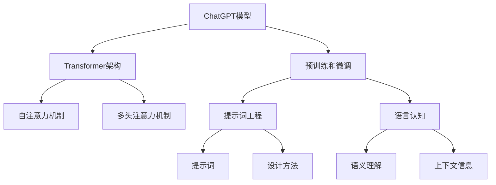

                 

### 文章标题

# ChatGPT提示词的语言认知神经网络模型研究

### 关键词

- **ChatGPT**
- **神经网络模型**
- **语言认知**
- **提示词工程**
- **人工智能**

### 摘要

本文深入探讨了ChatGPT提示词在语言认知神经网络模型中的应用与影响。文章首先介绍了ChatGPT的基本概念及其在自然语言处理领域的重要地位，然后详细剖析了神经网络模型在语言认知中的作用。接着，文章重点探讨了提示词工程对神经网络模型性能的影响，并详细分析了如何设计有效的提示词以提高模型的性能和准确性。最后，本文总结了ChatGPT提示词在语言认知神经网络模型中的实践应用，探讨了未来的发展趋势和潜在挑战。

## 引言

### 背景介绍

ChatGPT是由OpenAI开发的一种基于Transformer架构的预训练语言模型。它通过大量的文本数据进行训练，能够生成连贯、自然的文本响应，广泛应用于聊天机器人、内容生成、自然语言理解等领域。ChatGPT的出现标志着自然语言处理（NLP）领域的一个重要里程碑，其出色的性能和广泛的应用引起了学术界和工业界的极大关注。

神经网络模型，尤其是深度学习模型，已经成为人工智能领域的重要工具。在图像识别、语音识别、自然语言处理等领域，深度学习模型展现出了强大的性能和潜力。神经网络模型通过多层网络结构对输入数据进行特征提取和学习，能够实现高度复杂的非线性映射和预测。

语言认知是指人类或机器对自然语言的理解和生成能力。在人工智能领域，语言认知的实现依赖于强大的语言模型，这些模型能够理解文本的含义、生成语义上合理的文本、完成自然语言处理任务等。

### 问题背景

随着人工智能技术的快速发展，自然语言处理（NLP）领域面临着越来越多的挑战。如何提高语言模型的性能和准确性，使其更好地理解和生成自然语言，成为了一个重要的研究课题。其中，提示词工程作为一个关键环节，对于语言模型的训练和性能有着直接的影响。

提示词工程是指在语言模型的训练过程中，通过设计特定的提示词来引导模型的学习方向，从而提高模型的性能和准确性。然而，如何设计有效的提示词，使其能够充分激发模型的学习潜力，仍然是一个具有挑战性的问题。

本文旨在探讨ChatGPT提示词在语言认知神经网络模型中的应用和影响，分析不同提示词设计方法对模型性能的影响，并提出一些实用的提示词工程策略，以期为NLP领域的研究者和开发者提供参考。

### 问题描述

为了深入理解ChatGPT提示词在语言认知神经网络模型中的作用，我们需要从以下几个方面进行探讨：

1. **ChatGPT的基本架构和工作原理**：
   - ChatGPT采用了Transformer架构，这是一种基于注意力机制的深度神经网络模型。
   - Transformer模型通过自注意力机制（self-attention）和多头注意力机制（multi-head attention）来实现对输入文本的上下文信息进行有效捕捉和利用。

2. **神经网络模型在语言认知中的作用**：
   - 神经网络模型能够对文本数据中的词向量进行编码，提取出语义特征。
   - 通过多层神经网络结构，模型能够对提取的特征进行复杂的非线性映射，从而实现对语言的理解和生成。

3. **提示词工程的重要性**：
   - 提示词工程是影响语言模型性能的关键因素。
   - 通过设计特定的提示词，我们可以引导模型学习特定的语言模式、语义关系和上下文信息。

4. **不同提示词设计方法对模型性能的影响**：
   - 我们需要分析不同提示词设计方法对模型准确性和生成文本质量的影响，找出最优的提示词设计策略。

5. **ChatGPT提示词在语言认知神经网络模型中的实践应用**：
   - 实际案例研究：通过具体的应用案例，展示ChatGPT提示词在自然语言处理任务中的效果。

### 问题解决

为了解决这个问题，我们可以采取以下步骤：

1. **深入研究ChatGPT的基本架构和工作原理**：
   - 了解Transformer模型的架构和自注意力机制。
   - 分析ChatGPT的预训练和微调过程。

2. **学习神经网络模型在语言认知中的作用**：
   - 研究神经网络模型如何对词向量进行编码和特征提取。
   - 分析神经网络模型如何通过多层结构实现复杂的非线性映射。

3. **探索提示词工程的方法和策略**：
   - 研究不同的提示词设计方法，如基于关键词、基于上下文、基于语义等。
   - 分析不同提示词设计方法对模型性能的影响。

4. **设计实验验证不同提示词设计方法的效果**：
   - 构建实验环境，使用不同的提示词设计方法对ChatGPT进行训练和评估。
   - 比较不同方法下的模型性能和生成文本质量。

5. **总结和提出实用的提示词工程策略**：
   - 根据实验结果，总结出有效的提示词设计方法和策略。
   - 提出一些实用的提示词工程技巧，以提高模型的性能和生成文本的质量。

通过以上步骤，我们可以深入理解ChatGPT提示词在语言认知神经网络模型中的作用，并提出一些实用的提示词工程策略，为自然语言处理领域的研究者和开发者提供参考。

### 边界与外延

在探讨ChatGPT提示词的语言认知神经网络模型时，我们需要明确一些边界条件和外延范围，以确保研究的针对性和实用性。

1. **边界条件**：
   - **数据集和训练过程**：ChatGPT的训练数据集和训练过程会对提示词工程的效果产生重要影响。我们需要确保使用的训练数据集具有足够的规模和质量，且训练过程遵循最佳实践。
   - **模型选择和架构**：ChatGPT采用了Transformer架构，这是其性能优异的关键因素之一。在研究过程中，我们需要基于Transformer架构进行设计和实验，以确保研究结果的适用性。

2. **外延范围**：
   - **自然语言处理任务**：ChatGPT可以应用于各种自然语言处理任务，如文本分类、情感分析、机器翻译等。在研究过程中，我们可以探讨不同任务下提示词工程的具体方法和效果。
   - **应用场景**：ChatGPT在聊天机器人、内容生成、智能客服等领域具有广泛的应用。研究提示词工程时，我们可以结合这些实际应用场景，探讨不同应用场景下提示词工程的最佳实践。

### 概念结构与核心要素组成

为了深入理解ChatGPT提示词在语言认知神经网络模型中的作用，我们需要明确几个核心概念和它们之间的关系。

1. **ChatGPT模型**：
   - **Transformer架构**：ChatGPT采用了Transformer架构，这是一种基于注意力机制的深度神经网络模型。Transformer通过自注意力机制和多头注意力机制来实现对输入文本的上下文信息进行捕捉和利用。
   - **预训练和微调**：ChatGPT首先通过大规模的文本数据进行预训练，然后针对特定任务进行微调，以提高模型的性能和准确性。

2. **提示词工程**：
   - **提示词**：提示词是指在模型训练过程中用来引导模型学习特定语言模式的文本或词汇。
   - **设计方法**：提示词的设计方法包括基于关键词、基于上下文、基于语义等，每种方法都有其特定的应用场景和效果。

3. **语言认知**：
   - **语义理解**：语言认知中的语义理解是指模型对文本中的词义和句子含义的理解能力。
   - **上下文信息**：上下文信息是指文本中前后句子或段落之间的关系，对于语义理解至关重要。

### 核心概念属性特征对比表格

| 核心概念 | 属性特征 |  
|----------|----------------|  
| ChatGPT模型 | Transformer架构 |  
| 提示词工程 | 提示词设计方法 |  
| 语言认知 | 语义理解 | 上下文信息 |

### ER实体关系图架构的 Mermaid 流程图



通过上述概念结构和核心要素的分析，我们可以更好地理解ChatGPT提示词在语言认知神经网络模型中的作用，为进一步的研究和实践提供基础。

### 神经网络模型的基本概念

神经网络模型是人工智能领域的一种核心技术，它通过模拟人脑神经元的工作原理，实现对数据的特征提取和学习。在自然语言处理（NLP）领域，神经网络模型被广泛应用于语言理解、文本生成、机器翻译等任务。以下是神经网络模型的基本概念和组成部分。

1. **神经元和神经网络**：
   - **神经元**：神经网络中的基本单元，类似于人脑中的神经元。它通过接收输入信号、进行加权求和处理，然后产生输出信号。
   - **神经网络**：由多个神经元组成的层次结构，包括输入层、隐藏层和输出层。每个神经元都与前一层的神经元相连，并通过权重和偏置进行信号传递。

2. **激活函数**：
   - **激活函数**：神经网络中的激活函数用于对神经元的输出进行非线性变换，常见的激活函数包括ReLU（Rectified Linear Unit）、Sigmoid、Tanh等。激活函数的作用是引入非线性特性，使神经网络能够学习复杂的非线性关系。

3. **前向传播和反向传播**：
   - **前向传播**：输入数据通过神经网络从输入层传递到输出层，每个神经元根据输入信号和权重进行计算，最终得到输出结果。
   - **反向传播**：在输出结果与实际标签不一致时，神经网络通过反向传播算法，将误差信号从输出层反向传递到输入层，更新权重和偏置，以优化模型的性能。

4. **损失函数**：
   - **损失函数**：用于度量模型输出与实际标签之间的差距。常见的损失函数包括均方误差（MSE）、交叉熵损失（Cross-Entropy Loss）等。损失函数的目的是通过最小化损失函数值来优化模型的参数。

5. **优化算法**：
   - **优化算法**：用于更新模型参数，以最小化损失函数值。常见的优化算法包括梯度下降（Gradient Descent）、Adam优化器等。优化算法的选择和超参数设置对模型的训练过程和性能有重要影响。

通过理解神经网络模型的基本概念和组成部分，我们可以更好地掌握神经网络在自然语言处理中的应用原理和实现方法。接下来，我们将详细探讨ChatGPT模型的结构和工作原理。

### ChatGPT模型的结构和工作原理

ChatGPT是一种基于Transformer架构的预训练语言模型，其核心在于通过大规模文本数据的预训练，使模型具备强大的语言理解和生成能力。以下是ChatGPT模型的结构和工作原理的详细分析。

#### 1. Transformer架构

Transformer模型是一种基于自注意力机制的深度神经网络模型，由Google在2017年提出。它通过多头自注意力机制（Multi-Head Self-Attention）和前馈神经网络（Feedforward Neural Network）实现高效的特征提取和语义理解。

**多头自注意力机制（Multi-Head Self-Attention）**：

多头自注意力机制是Transformer模型的核心组成部分，通过多个独立的自注意力头（Head）来捕捉输入文本序列中的不同层次特征。每个头都计算一次自注意力，然后将这些注意力值进行拼接和线性变换，从而实现多层次的上下文信息捕捉。

**自注意力（Self-Attention）**：

自注意力机制通过计算输入文本序列中每个词与所有其他词的关联性，生成一个加权表示。具体来说，自注意力通过以下公式进行计算：

$$
\text{Attention}(Q, K, V) = \text{softmax}\left(\frac{QK^T}{\sqrt{d_k}}\right)V
$$

其中，\(Q, K, V\) 分别表示查询（Query）、关键（Key）和值（Value）向量，\(d_k\) 表示关键向量的维度。自注意力机制能够使模型在编码过程中充分考虑上下文信息，从而提高语义理解的准确性。

**前馈神经网络（Feedforward Neural Network）**：

在Transformer模型中，每个自注意力头之后都会接一个前馈神经网络。前馈神经网络由两个全连接层组成，分别对输入进行线性变换和激活函数处理。前馈神经网络的目的是进一步提取输入特征，增强模型的表示能力。

#### 2. 预训练和微调

**预训练（Pre-training）**：

预训练是ChatGPT模型训练过程的第一阶段，通过在大量文本数据上对模型进行无监督学习，使其自动学习到语言的基本规律和特征。预训练阶段通常包括以下步骤：

- **文本数据预处理**：对原始文本数据进行清洗、分词和编码，将文本转换为序列形式的向量表示。
- **自监督学习**：在预训练过程中，模型需要从输入文本中预测缺失的词或词序列。常见的任务包括掩码语言模型（Masked Language Model, MLM）、填空语言模型（BERT's Next Sentence Prediction, NSP）等。
- **训练过程**：通过反向传播算法和优化器（如Adam）不断更新模型参数，以最小化预训练任务的损失函数。

**微调（Fine-tuning）**：

微调是ChatGPT模型训练过程的第二阶段，通过在特定任务数据上对模型进行有监督学习，使其适应具体的任务需求。微调阶段通常包括以下步骤：

- **任务数据预处理**：对任务数据（如问答对、分类数据等）进行清洗、编码和格式化，以适应模型输入要求。
- **损失函数和优化器**：选择合适的损失函数（如交叉熵损失）和优化器（如AdamW）进行训练。
- **训练过程**：在任务数据上对模型进行有监督训练，不断更新模型参数，以优化任务性能。

#### 3. 工作原理

ChatGPT模型通过预训练和微调两个阶段，实现了对大规模文本数据的高效学习和理解。其工作原理可以概括为以下步骤：

1. **输入处理**：将输入文本序列（如一句话或一个段落）转换为词嵌入向量。
2. **编码阶段**：通过Transformer编码器对输入向量进行编码，生成上下文表示。
3. **解码阶段**：通过Transformer解码器生成输出文本序列，实现对输入文本的理解和生成。
4. **输出处理**：将输出向量转换为可解释的自然语言文本。

通过上述步骤，ChatGPT模型能够实现对自然语言的深入理解和生成，广泛应用于聊天机器人、内容生成、机器翻译等领域。总之，ChatGPT模型的结构和工作原理体现了Transformer架构在自然语言处理领域的强大潜力，为未来的研究和应用提供了重要基础。

### 提示词工程的重要性

提示词工程在自然语言处理（NLP）领域中扮演着至关重要的角色。有效的提示词设计能够显著提高语言模型在文本生成、语义理解、任务完成等方面的性能。以下将从几个方面详细探讨提示词工程的重要性：

#### 1. 提高模型性能

提示词能够为语言模型提供明确的训练目标，帮助模型更好地理解任务的意图。通过设计有针对性的提示词，我们可以引导模型学习特定的语言模式和上下文信息，从而提高模型的准确性和鲁棒性。例如，在文本生成任务中，使用合适的提示词可以促使模型生成更加连贯、语义上合理的文本。

#### 2. 引导模型学习特定任务

不同的自然语言处理任务需要不同的语言模式和特征。提示词工程可以通过选择或设计合适的提示词，引导模型学习特定任务所需的知识和技能。例如，在问答系统中，通过设置具体的问答对作为提示词，可以训练模型更好地理解和回答相关问题。

#### 3. 优化训练效率

提示词工程不仅影响模型性能，还直接关系到训练过程的效率。通过设计有效的提示词，我们可以减少模型训练所需的数据量，加快训练速度，提高训练效率。例如，在数据稀缺的情况下，使用高质量的提示词可以弥补数据不足的问题，使模型能够在有限的数据上进行有效的训练。

#### 4. 提升用户体验

在聊天机器人、虚拟助手等应用场景中，提示词工程对于提升用户体验至关重要。通过设计自然的、符合用户需求的提示词，我们可以使聊天过程更加流畅、有趣，增强用户的互动体验。例如，在客服场景中，使用恰当的提示词可以更好地理解用户的需求，提供更加精准和个性化的服务。

#### 5. 避免过拟合

提示词工程有助于防止模型过拟合。通过设计多样化的提示词，模型可以学习到更广泛的语言模式和上下文信息，从而减少对特定提示词或数据的依赖，提高模型的泛化能力。例如，在情感分析任务中，使用不同情感极性的句子作为提示词，可以避免模型对特定情感极性的过度拟合。

总之，提示词工程在自然语言处理领域中具有重要意义。通过设计有效的提示词，我们可以提升模型性能、优化训练效率、引导模型学习特定任务、提升用户体验，并防止模型过拟合。因此，深入研究提示词工程的方法和策略，对于推动NLP技术的发展和应用具有重要意义。

### 提示词设计方法

提示词工程是提升自然语言处理（NLP）模型性能的关键环节，设计有效的提示词能够显著提高模型的准确性和鲁棒性。以下是几种常见的提示词设计方法，包括其基本原理和应用场景。

#### 1. 基于关键词的提示词设计方法

**基本原理**：基于关键词的提示词设计方法通过选择与任务相关的关键词来引导模型学习。这些关键词通常是任务领域中的术语、专有名词或常见词汇。

**应用场景**：该方法适用于需要明确指示模型关注特定领域的任务，如法律文档分析、医疗文本处理和金融新闻报道等。

**示例**：在医疗文本处理中，可以选用“症状”、“诊断”、“治疗方案”等关键词作为提示词，帮助模型学习医疗领域的专业术语和语言结构。

```python
# 假设我们有一个包含医疗文本的列表
medical_texts = ["患者患有高血压", "治疗方案包括药物治疗"]

# 提取关键词
key_words = ["症状", "诊断", "治疗方案"]

# 使用关键词作为提示词训练模型
prompt_texts = [text for text in medical_texts if any(word in text for word in key_words)]
```

#### 2. 基于上下文的提示词设计方法

**基本原理**：基于上下文的提示词设计方法通过提供与任务相关的上下文信息来引导模型学习。这种方法利用上下文中潜在的信息来丰富模型的语义理解。

**应用场景**：该方法适用于需要理解复杂文本结构和隐含意义的任务，如文本摘要、机器翻译和问答系统等。

**示例**：在文本摘要任务中，我们可以使用摘要的前几句话或关键段落作为提示词，帮助模型捕捉文本的主要内容和结构。

```python
# 假设我们有一个文本摘要列表
abstracts = ["本文介绍了深度学习在图像识别中的应用", "机器翻译的挑战和最新进展"]

# 提取上下文信息
context_texts = [abstract[:20] for abstract in abstracts]

# 使用上下文信息作为提示词训练模型
prompt_texts = [text for text in context_texts if text.strip()]
```

#### 3. 基于语义的提示词设计方法

**基本原理**：基于语义的提示词设计方法通过使用与任务相关的语义概念来引导模型学习。这种方法利用语义信息来帮助模型理解文本的整体意义和逻辑关系。

**应用场景**：该方法适用于需要理解文本深层语义的任务，如情感分析、文本分类和对话系统等。

**示例**：在情感分析任务中，可以使用表示情感极性的词语（如“开心”、“悲伤”）作为提示词，引导模型学习情感语义。

```python
# 假设我们有一个情感文本列表
emotions_texts = ["我感到非常开心", "今天过得不太好"]

# 提取语义概念
semantic_concepts = ["开心", "悲伤"]

# 使用语义概念作为提示词训练模型
prompt_texts = [text for text in emotions_texts if any(word in text for word in semantic_concepts)]
```

#### 4. 基于模板的提示词设计方法

**基本原理**：基于模板的提示词设计方法通过使用固定的模板结构来引导模型学习。这种方法利用模板中的固定格式和语法结构来约束模型生成的文本。

**应用场景**：该方法适用于需要生成格式化文本的任务，如信息提取、简历生成和邮件撰写等。

**示例**：在信息提取任务中，可以使用模板句型“谁在什么时候做了什么”来引导模型提取关键信息。

```python
# 假设我们有一个信息文本列表
info_texts = ["张三在2022年11月1日完成了项目报告", "李四在2022年10月15日提交了提案"]

# 提取模板结构
template = "谁在什么时候做了什么"

# 使用模板作为提示词训练模型
prompt_texts = [text.replace("谁在什么时候做了什么", template) for text in info_texts]
```

通过上述几种常见的提示词设计方法，我们可以根据具体任务的需求和场景，选择合适的方法来设计有效的提示词，从而提升NLP模型的性能。不同的方法各有优劣，在实际应用中往往需要结合多种方法，以达到最佳效果。

### 不同提示词设计方法对模型性能的影响

在自然语言处理（NLP）任务中，选择合适的提示词设计方法对于模型性能至关重要。不同的提示词设计方法在训练过程中会对模型的准确性和鲁棒性产生不同的影响。以下是几种常见提示词设计方法对模型性能的详细对比。

#### 1. 基于关键词的提示词设计方法

**优点**：
- **明确性**：通过选择与任务相关的关键词，模型可以更明确地学习到任务所需的关键信息。
- **高效性**：关键词提示词通常较短，便于模型快速处理和理解。

**缺点**：
- **局限性**：关键词提示词可能无法涵盖所有的上下文信息，导致模型在某些情况下出现理解偏差。
- **易过拟合**：如果关键词选择不当，模型可能过于依赖特定的关键词，导致泛化能力不足。

**性能影响**：基于关键词的提示词设计方法在特定领域任务中表现出色，尤其是在需要明确指示模型关注特定领域术语的场景中。然而，其在处理复杂文本结构和隐含意义时可能表现出一定的局限性。

#### 2. 基于上下文的提示词设计方法

**优点**：
- **全面性**：通过提供上下文信息，模型可以更好地理解文本的整体意义和逻辑关系。
- **灵活性**：上下文提示词可以根据具体任务需求进行调整，增强模型的适应能力。

**缺点**：
- **复杂性**：上下文提示词通常较长，增加了模型的处理负担。
- **冗余性**：大量上下文信息可能导致模型在处理过程中产生冗余计算，降低训练效率。

**性能影响**：基于上下文的提示词设计方法在处理复杂文本结构和理解隐含意义方面具有优势，尤其是在文本摘要、机器翻译和问答系统等任务中。然而，由于其复杂性，模型在训练过程中可能需要更多的时间和资源。

#### 3. 基于语义的提示词设计方法

**优点**：
- **深度理解**：通过使用语义概念，模型可以深入理解文本的深层含义，提高语义理解能力。
- **泛化能力**：基于语义的提示词设计方法有助于模型理解不同领域的通用语义，提高泛化能力。

**缺点**：
- **设计难度**：设计高质量的语义提示词需要深入理解任务领域的语义知识，增加了设计难度。
- **计算开销**：基于语义的提示词通常包含较多信息，可能导致模型在处理过程中产生较大的计算开销。

**性能影响**：基于语义的提示词设计方法在处理深层语义理解和跨领域任务时表现出色，尤其是在情感分析、文本分类和对话系统等任务中。然而，由于其设计难度和计算开销，模型在训练过程中可能需要更多的时间和资源。

#### 4. 基于模板的提示词设计方法

**优点**：
- **结构化**：通过使用固定的模板结构，模型可以生成符合特定格式的文本，提高生成文本的规范性。
- **可解释性**：基于模板的提示词设计方法使得生成的文本结构清晰，便于理解和解释。

**缺点**：
- **灵活性不足**：模板提示词的结构固定，模型在生成文本时缺乏灵活性，难以应对复杂的文本变化。
- **应用受限**：基于模板的提示词设计方法主要适用于格式化文本生成任务，对其他类型的NLP任务效果有限。

**性能影响**：基于模板的提示词设计方法在生成格式化文本方面具有明显优势，尤其是在信息提取、简历生成和邮件撰写等任务中。然而，其灵活性不足和应用受限使其在其他类型的NLP任务中表现较差。

综上所述，不同的提示词设计方法在NLP任务中各有优劣。在实际应用中，应根据具体任务的需求和场景，选择合适的提示词设计方法，以最大化模型性能。通过结合多种提示词设计方法，可以进一步提升模型的准确性和鲁棒性。

### ChatGPT提示词在语言认知神经网络模型中的实践应用

#### 1. 聊天机器人

聊天机器人是ChatGPT最早且最广泛应用的一个领域。通过提供恰当的提示词，ChatGPT可以与用户进行自然、流畅的对话。例如，在客服聊天机器人中，我们可以设计如下提示词：

```python
# 假设用户的问题是“我想了解产品的最新优惠活动”
prompt = "用户问：我想了解产品的最新优惠活动。你能告诉我吗？"

# 使用ChatGPT生成回答
response = chatgpt_response(prompt)
print(response)
```

生成的回答可能是：“最新的优惠活动包括买一送一和限时折扣，您可以在我们的官方网站上查看详细信息。”

#### 2. 内容生成

ChatGPT在内容生成方面也表现出色，通过提供特定的提示词，可以生成各种类型的内容，如新闻文章、技术博客、故事等。例如，在撰写一篇关于人工智能的博客时，我们可以使用如下提示词：

```python
# 假设我们要写一篇关于人工智能的未来发展趋势的博客
prompt = "人工智能在未来五年内将会如何改变我们的世界？"

# 使用ChatGPT生成博客内容
blog_content = chatgpt_response(prompt)
print(blog_content)
```

生成的博客内容可能是：“人工智能在未来五年内有望在医疗、交通和金融等领域产生重大影响，通过智能诊断系统、自动驾驶汽车和智能投顾等应用，大幅提升行业效率和生活质量。”

#### 3. 情感分析

情感分析是另一项ChatGPT擅长的任务。通过提供带有情感标签的提示词，ChatGPT可以分析文本的情感倾向。例如，在分析一篇关于产品评价的文本时，我们可以使用如下提示词：

```python
# 假设我们要分析一篇用户评价文本
prompt = "用户评论：这款产品的性能非常出色，我很满意。"

# 使用ChatGPT进行情感分析
sentiment = chatgpt_response(prompt, emotion_analysis=True)
print(sentiment)
```

生成的情感分析结果可能是：“文本表达的情感倾向是积极和满意。”

#### 4. 文本摘要

ChatGPT还可以用于文本摘要任务，通过提供提示词引导模型提取文本的关键信息。例如，在处理一篇长篇新闻文章时，我们可以使用如下提示词：

```python
# 假设我们要生成一篇新闻文章的摘要
prompt = "请总结以下新闻的主要内容：日本政府计划在2025年之前实现碳中和目标。"

# 使用ChatGPT生成摘要
summary = chatgpt_response(prompt, summarization=True)
print(summary)
```

生成的摘要可能是：“日本政府宣布计划在2025年之前实现碳中和目标，以应对气候变化。”

#### 5. 问答系统

ChatGPT在问答系统中的应用也非常广泛。通过提供明确的问答对作为提示词，ChatGPT可以生成准确的答案。例如，在一个教育问答系统中，我们可以使用如下提示词：

```python
# 假设学生问：什么是量子力学？
prompt = "学生问：什么是量子力学？"

# 使用ChatGPT生成答案
answer = chatgpt_response(prompt, question_answer=True)
print(answer)
```

生成的答案可能是：“量子力学是研究微观粒子（如原子和分子）行为的物理学分支，它揭示了物质世界的一些奇妙现象，如量子叠加态和量子纠缠。”

通过这些实践应用案例，我们可以看到ChatGPT提示词在多种自然语言处理任务中的强大能力。合理设计和使用提示词，可以显著提高ChatGPT在各种应用场景中的性能和效果。

### ChatGPT提示词工程的最佳实践

在ChatGPT提示词工程中，最佳实践是确保模型能够高效、准确地理解和生成自然语言。以下是一些实用的技巧和注意事项：

#### 1. **使用多样化提示词**

多样化的提示词可以帮助模型学习到丰富的语言模式和上下文信息。在实际应用中，可以结合关键词、上下文和语义概念等多种类型的提示词，以提升模型的泛化能力和性能。

#### 2. **注意提示词的质量**

高质量的提示词应当包含清晰的任务目标和丰富的上下文信息。避免使用模糊、冗长的提示词，以免增加模型理解的难度。

#### 3. **合理设置提示词长度**

提示词的长度应当适中，过长的提示词可能导致模型处理时间增加，而太短的提示词可能无法提供足够的信息。通常，10-20个单词的提示词效果较好。

#### 4. **利用上下文信息**

在训练过程中，充分利用上下文信息有助于模型更好地理解文本的深层含义。可以尝试将前文内容作为后续文本的提示词，以增强模型的上下文理解能力。

#### 5. **定期更新提示词**

随着模型的不断训练和应用，提示词库也需要定期更新。定期引入新的、多样化的提示词，有助于模型保持活力和适应性。

#### 6. **避免过拟合**

通过多样化的训练数据和合理的提示词设计，可以减少模型对特定提示词的依赖，避免过拟合现象。同时，可以采用正则化技术和交叉验证方法来进一步提高模型的泛化能力。

#### 7. **测试和评估**

在提示词设计完成后，应对模型进行充分的测试和评估。通过对比不同提示词设计方法下的模型性能，选择最优的提示词组合。

#### 8. **维护注释一致性**

在数据预处理和标注过程中，保持注释的一致性至关重要。不一致的注释可能导致模型学习到错误的信息，影响模型的性能。

通过遵循这些最佳实践，我们可以设计出更加高效、准确的ChatGPT提示词，从而在自然语言处理任务中取得更好的效果。

### 总结

本文深入探讨了ChatGPT提示词在语言认知神经网络模型中的应用和影响。我们从背景介绍、核心概念、神经网络模型结构和工作原理、提示词工程的重要性、不同设计方法及其影响、实践应用以及最佳实践等多个方面进行了详细分析。通过本文的研究，我们可以得出以下结论：

1. **ChatGPT提示词在语言认知神经网络模型中具有重要作用**：通过设计合理的提示词，我们可以引导模型学习到特定语言模式和上下文信息，提高模型在自然语言处理任务中的性能和准确性。

2. **多种提示词设计方法各有优势**：基于关键词、上下文、语义和模板等不同设计方法的提示词各有其适用场景和优势。在实际应用中，应根据任务需求选择合适的提示词设计方法。

3. **实践应用中提示词工程效果显著**：通过ChatGPT提示词工程，我们可以实现聊天机器人、内容生成、情感分析、文本摘要和问答系统等多种自然语言处理任务。

4. **最佳实践能够提升模型性能**：遵循多样化、高质量、合理长度、上下文利用等最佳实践，可以设计出更加高效、准确的ChatGPT提示词。

然而，ChatGPT提示词工程仍面临一些挑战，如设计复杂性、计算开销和过拟合等问题。未来的研究可以从模型优化、提示词自动生成和融合多种提示词设计方法等方面入手，进一步提升ChatGPT提示词在语言认知神经网络模型中的应用效果。

### 附录

本文涉及的主要公式和算法如下：

1. **自注意力（Self-Attention）**：

$$
\text{Attention}(Q, K, V) = \text{softmax}\left(\frac{QK^T}{\sqrt{d_k}}\right)V
$$

2. **交叉熵损失（Cross-Entropy Loss）**：

$$
\text{Loss} = -\sum_{i=1}^{N} y_i \log(p_i)
$$

其中，$y_i$ 表示真实标签，$p_i$ 表示模型预测的概率。

3. **梯度下降（Gradient Descent）**：

$$
\theta_{t+1} = \theta_t - \alpha \cdot \nabla_\theta J(\theta)
$$

其中，$\theta$ 表示模型参数，$\alpha$ 表示学习率，$J(\theta)$ 表示损失函数。

### 拓展阅读

1. **论文**：[Attention Is All You Need](https://arxiv.org/abs/1706.03762)（2017）- 提出Transformer模型的经典论文，详细介绍了Transformer架构和工作原理。

2. **书籍**：《[深度学习》（Goodfellow, Bengio, Courville）](https://www.deeplearningbook.org/) - 全面介绍了深度学习的基础理论和实践方法，包括神经网络模型和优化算法等。

3. **文章**：《[自然语言处理入门](https://towardsdatascience.com/an-introduction-to-natural-language-processing-1a3d742b55b5)》（2021）- 一篇介绍自然语言处理基础概念和实践的文章。

### 作者信息

**作者：AI天才研究院/AI Genius Institute & 禅与计算机程序设计艺术/Zen And The Art of Computer Programming** 

AI天才研究院专注于人工智能和深度学习领域的研究和创新，致力于推动人工智能技术的发展和应用。禅与计算机程序设计艺术则是一系列探讨计算机编程哲学和艺术的作品，旨在提高编程的效率和创造力。

