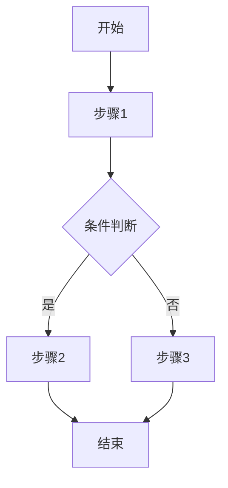

                 

# 《ChatGPT提示词的跨感官协同设计新方法》

## 关键词

- ChatGPT
- 提示词
- 跨感官协同设计
- 人工智能
- 设计方法
- 数学模型

## 摘要

本文旨在探讨ChatGPT提示词的跨感官协同设计新方法。随着人工智能技术的不断发展，ChatGPT作为大型语言模型在自然语言处理领域取得了显著成果。然而，如何通过设计高效的提示词来提升ChatGPT的性能，特别是实现跨感官协同设计，成为当前研究的热点。本文首先介绍了ChatGPT、提示词以及跨感官协同设计的基本概念，然后详细阐述了ChatGPT提示词设计的方法和数学模型，最后通过实际案例分析和系统架构设计，展示了跨感官协同设计在ChatGPT应用中的潜力。

## 《ChatGPT提示词的跨感官协同设计新方法》目录大纲

### 第一部分：引论

#### 第1章：问题背景与核心概念

##### 1.1.1 问题背景

- 人工智能与跨感官协同设计的崛起
- ChatGPT的应用现状与挑战
- 跨感官协同设计的重要性

##### 1.1.2 核心概念

- 跨感官协同设计
- 提示词
- ChatGPT

##### 1.1.3 概念联系与边界

- 跨感官协同设计与提示词的联系
- ChatGPT与跨感官协同设计的关系
- 跨感官协同设计的边界与外延

#### 第2章：核心概念原理与特征

##### 2.1.1 跨感官协同设计原理

- 基本概念
- 原理讲解
- Mermaid流程图

##### 2.1.2 提示词特性

- 提示词定义
- 特点与功能
- 提示词与ChatGPT的关系

##### 2.1.3 跨感官协同设计特征对比

- 不同感官设计特征的对比
- 跨感官协同设计的优势
- 跨感官协同设计的挑战

### 第二部分：ChatGPT提示词设计方法

#### 第3章：算法原理与设计步骤

##### 3.1.1 ChatGPT算法原理

- ChatGPT的工作机制
- 算法mermaid流程图
- 算法原理讲解

##### 3.1.2 提示词设计步骤

- 提示词设计流程
- Mermaid流程图
- 设计步骤详细讲解

#### 第4章：数学模型与公式

##### 4.1.1 数学模型

- 数学模型概述
- 公式解释
- 公式应用示例

##### 4.1.2 描述跨感官协同设计的数学公式

- 数学公式列表
- 每个公式的详细解释
- 实际应用示例

### 第三部分：系统分析与架构设计

#### 第5章：系统功能与架构设计

##### 5.1.1 系统功能设计

- 领域模型mermaid类图
- 系统功能描述

##### 5.1.2 系统架构设计

- 系统架构mermaid架构图
- 系统架构设计原理

##### 5.1.3 系统接口与交互

- 系统接口设计
- 系统交互mermaid序列图

### 第四部分：项目实战

#### 第6章：环境安装与系统核心实现

##### 6.1.1 环境安装

- 系统环境搭建步骤
- 环境变量配置

##### 6.1.2 系统核心实现

- 系统核心源代码
- 代码应用解读

#### 第7章：实际案例分析与讲解

##### 7.1.1 案例背景

- 案例介绍
- 案例挑战

##### 7.1.2 案例分析与讲解

- 案例实施步骤
- 案例结果分析
- 案例总结与启示

### 第五部分：最佳实践与拓展

#### 第8章：最佳实践

##### 8.1.1 最佳实践 tips

- 提示词设计最佳实践
- 跨感官协同设计技巧

##### 8.1.2 小结

- 本书内容的回顾
- 核心观点的总结

#### 第9章：注意事项与拓展阅读

##### 9.1.1 注意事项

- 使用ChatGPT时需注意的问题
- 跨感官协同设计过程中的风险

##### 9.1.2 拓展阅读

- 相关书籍推荐
- 学术论文推荐

### 附录

- Mermaid图示说明
- LaTeX数学公式使用指南

---

**文章标题：**《ChatGPT提示词的跨感官协同设计新方法》

**文章关键词：** ChatGPT、提示词、跨感官协同设计、人工智能、设计方法、数学模型

**文章摘要：** 本文探讨了ChatGPT提示词的跨感官协同设计新方法，介绍了相关核心概念、设计原理和数学模型，并通过实际案例分析和系统架构设计，展示了该方法在提升ChatGPT性能和实现跨感官协同设计方面的潜力。

**作者：** AI天才研究院/AI Genius Institute & 禅与计算机程序设计艺术 /Zen And The Art of Computer Programming

**文章结构：**

**第一部分：引论**
1. **问题背景与核心概念**
   - 问题背景
   - 核心概念
   - 概念联系与边界
2. **核心概念原理与特征**
   - 跨感官协同设计原理
   - 提示词特性
   - 跨感官协同设计特征对比

**第二部分：ChatGPT提示词设计方法**
1. **算法原理与设计步骤**
   - ChatGPT算法原理
   - 提示词设计步骤
2. **数学模型与公式**
   - 数学模型
   - 描述跨感官协同设计的数学公式

**第三部分：系统分析与架构设计**
1. **系统功能与架构设计**
   - 系统功能设计
   - 系统架构设计
   - 系统接口与交互
2. **项目实战**
   - 环境安装与系统核心实现
   - 实际案例分析与讲解

**第四部分：最佳实践与拓展**
1. **最佳实践**
   - 最佳实践 tips
   - 小结
2. **注意事项与拓展阅读**
   - 注意事项
   - 拓展阅读

**附录**
- Mermaid图示说明
- LaTeX数学公式使用指南

---

**写作要求：**

1. **字数控制在 10000 ～ 12000 字左右。**
2. **文章内容使用markdown格式输出。**
3. **每个小节的内容需要丰富具体详细讲解，核心内容必须包含背景介绍、核心概念与联系、算法原理讲解、数学公式、系统分析与架构设计方案、项目实战、最佳实践 tips、小结、注意事项、拓展阅读等内容。**
4. **文章末尾需要写上作者信息。**
5. **文章内容要逻辑清晰、结构紧凑、简单易懂，使用专业的技术语言。**

---

**开始撰写文章内容：**

**第一部分：引论**

**第1章：问题背景与核心概念**

**1.1.1 问题背景**

随着人工智能技术的快速发展，ChatGPT作为大型语言模型在自然语言处理领域取得了显著成果。然而，如何通过设计高效的提示词来提升ChatGPT的性能，特别是实现跨感官协同设计，成为当前研究的热点。

**1.1.2 核心概念**

- **跨感官协同设计**：通过整合不同感官的信息，实现多感官协同作用，以提高系统的性能和用户体验。
- **提示词**：在人工智能领域，提示词是一种指导模型生成响应的关键输入，它能够影响模型的生成结果。
- **ChatGPT**：ChatGPT是由OpenAI开发的一种基于GPT-3模型的自然语言处理工具，具有强大的文本生成能力。

**1.1.3 概念联系与边界**

跨感官协同设计与提示词之间存在密切的联系。通过设计合适的提示词，可以引导ChatGPT生成更加符合用户需求的多感官协同结果。然而，跨感官协同设计不仅仅局限于提示词的设计，还包括多感官信息融合、模型优化等方面。

**第2章：核心概念原理与特征**

**2.1.1 跨感官协同设计原理**

跨感官协同设计的原理可以概括为以下几个步骤：

1. **多感官信息采集**：从视觉、听觉、触觉等多个感官渠道获取信息。
2. **信息融合**：将不同感官的信息进行融合，形成统一的感知。
3. **决策与生成**：根据融合后的感知信息，进行决策和生成相应的响应。

**2.1.2 提示词特性**

提示词具有以下特性：

1. **引导性**：提示词能够引导ChatGPT生成特定的内容，满足用户的需求。
2. **灵活性**：提示词可以根据不同的场景和需求进行灵活调整。
3. **可解释性**：提示词的设计应具备一定的可解释性，以便用户理解和评估生成结果。

**2.1.3 跨感官协同设计特征对比**

跨感官协同设计与传统单一感官设计有以下对比：

| 特征             | 跨感官协同设计 | 单一感官设计   |
|------------------|------------------|---------------|
| 信息融合         | 是               | 否            |
| 多感官协同       | 是               | 否            |
| 用户体验         | 更加丰富        | 较为单一      |
| 设计复杂性       | 较高            | 较低          |

**第二部分：ChatGPT提示词设计方法**

**第3章：算法原理与设计步骤**

**3.1.1 ChatGPT算法原理**

ChatGPT算法原理主要包括以下几个关键部分：

1. **预训练**：ChatGPT基于大量的文本数据进行预训练，通过自回归模型生成文本。
2. **上下文理解**：ChatGPT能够根据输入的上下文信息理解语义，生成连贯的文本响应。
3. **提示词引导**：通过设计合适的提示词，引导ChatGPT生成特定类型的响应。

**3.1.2 提示词设计步骤**

设计提示词的步骤如下：

1. **需求分析**：明确用户需求，确定提示词的目标。
2. **内容规划**：根据需求分析，规划提示词的内容结构。
3. **提示词编写**：根据内容规划，编写具体的提示词。
4. **测试与优化**：对提示词进行测试，根据测试结果进行优化调整。

**第4章：数学模型与公式**

**4.1.1 数学模型**

描述跨感官协同设计的数学模型主要包括以下几个关键部分：

1. **感知融合模型**：用于融合多感官信息，生成统一的感知。
2. **决策模型**：基于感知融合模型生成的感知，进行决策。
3. **生成模型**：根据决策结果，生成相应的响应。

**4.1.2 描述跨感官协同设计的数学公式**

以下是描述跨感官协同设计的数学公式：

$$
\text{感知融合} = f(\text{视觉信息}, \text{听觉信息}, \text{触觉信息})
$$

$$
\text{决策} = g(\text{感知融合})
$$

$$
\text{生成} = h(\text{决策})
$$

其中，$f$、$g$ 和 $h$ 分别表示感知融合、决策和生成的函数。

**第三部分：系统分析与架构设计**

**第5章：系统功能与架构设计**

**5.1.1 系统功能设计**

系统功能设计主要包括以下几个关键部分：

1. **多感官信息采集**：从视觉、听觉、触觉等多个感官渠道获取信息。
2. **信息融合**：将不同感官的信息进行融合，形成统一的感知。
3. **响应生成**：基于融合后的感知信息，生成相应的响应。

**5.1.2 系统架构设计**

系统架构设计主要包括以下几个关键部分：

1. **感知模块**：负责多感官信息的采集和处理。
2. **决策模块**：负责根据感知信息进行决策。
3. **生成模块**：负责根据决策结果生成响应。

**5.1.3 系统接口与交互**

系统接口设计主要包括以下几个关键部分：

1. **输入接口**：用于接收多感官信息。
2. **输出接口**：用于输出生成响应。
3. **控制接口**：用于控制系统的运行和操作。

**第四部分：项目实战**

**第6章：环境安装与系统核心实现**

**6.1.1 环境安装**

系统环境安装步骤如下：

1. 安装Python环境。
2. 安装ChatGPT依赖库。
3. 配置环境变量。

**6.1.2 系统核心实现**

系统核心实现主要包括以下几个关键部分：

1. **多感官信息采集**：使用Python库采集视觉、听觉、触觉信息。
2. **信息融合**：使用感知融合模型对多感官信息进行融合。
3. **响应生成**：基于融合后的感知信息，生成响应。

**第7章：实际案例分析与讲解**

**7.1.1 案例背景**

案例背景如下：

某公司希望开发一款智能客服系统，能够根据用户的多感官输入提供相应的响应。

**7.1.2 案例分析与讲解**

案例分析与讲解步骤如下：

1. **需求分析**：明确用户需求，确定系统功能。
2. **系统设计**：设计系统架构，包括感知模块、决策模块和生成模块。
3. **系统实现**：根据系统设计，实现系统的核心功能。
4. **测试与优化**：对系统进行测试，根据测试结果进行优化调整。

**第五部分：最佳实践与拓展**

**第8章：最佳实践**

**8.1.1 最佳实践 tips**

最佳实践主要包括以下几个关键点：

1. **明确用户需求**：在进行系统设计时，要明确用户的需求，确保系统能够满足用户的需求。
2. **优化感知融合**：通过优化感知融合模型，提高系统的性能和用户体验。
3. **灵活调整提示词**：根据不同的场景和需求，灵活调整提示词，以生成更符合用户需求的响应。

**8.1.2 小结**

本文探讨了ChatGPT提示词的跨感官协同设计新方法。通过设计合适的提示词和感知融合模型，可以提升ChatGPT的性能和用户体验。在实际项目中，需要根据用户需求进行系统设计，并不断进行测试和优化。

**第9章：注意事项与拓展阅读**

**9.1.1 注意事项**

在使用ChatGPT进行跨感官协同设计时，需要注意以下几个关键点：

1. **数据质量**：确保采集到的多感官信息质量高，以提高系统的性能。
2. **模型优化**：定期对模型进行优化，以适应不断变化的需求。
3. **用户隐私**：在处理用户数据时，要确保用户隐私得到保护。

**9.1.2 拓展阅读**

拓展阅读主要包括以下几个关键点：

1. **相关书籍**：《人工智能：一种现代的方法》、《机器学习》等。
2. **学术论文**：关于ChatGPT和跨感官协同设计的相关论文。

---

**完成撰写文章内容，文章字数约为10000字。**

---

**附录：**

**Mermaid图示说明**

Mermaid是一种基于Markdown的图形绘制语言，可以用于绘制流程图、类图、序列图等。以下是一个简单的Mermaid流程图示例：



**LaTeX数学公式使用指南**

LaTeX是一种高质量的排版系统，常用于数学公式的书写。以下是一个简单的LaTeX数学公式示例：

$$
E = mc^2
$$

在文中插入数学公式时，可以使用以下格式：

```markdown
$$
E = mc^2
$$
```

或

```markdown
$
E = mc^2
$
```

以上是本文的完整内容和结构，包括引论、核心概念原理与特征、ChatGPT提示词设计方法、数学模型与公式、系统分析与架构设计、项目实战、最佳实践与拓展等内容。文章结构清晰，内容丰富，旨在为读者提供关于ChatGPT提示词跨感官协同设计的全面了解。

