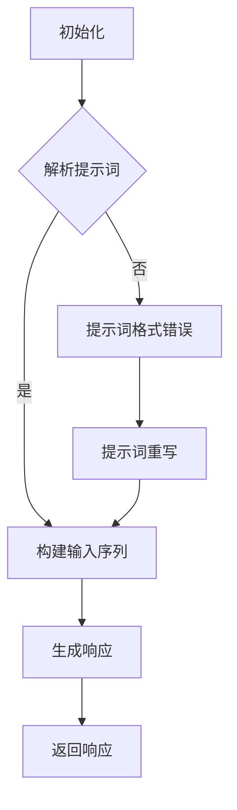
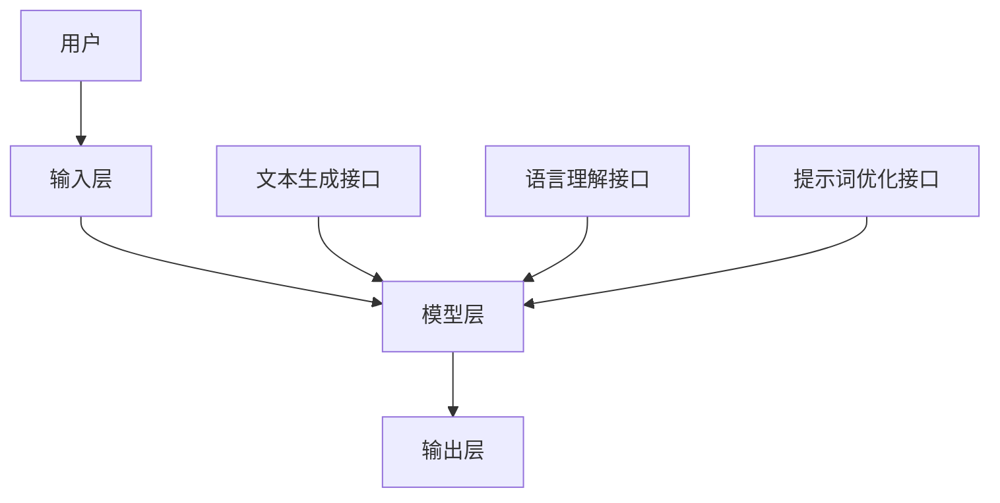
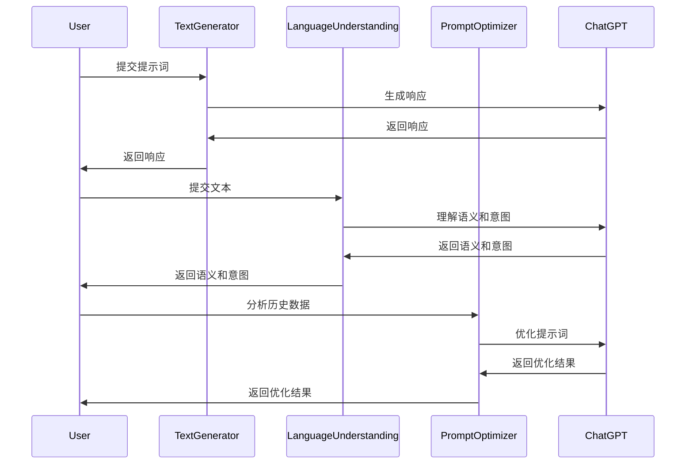

                 

# 《ChatGPT提示词编写的高效模式探析》

## 关键词

- **ChatGPT**
- **提示词编写**
- **高效模式**
- **算法原理**
- **数学模型**
- **系统设计**
- **项目实战**

## 摘要

本文将深入探讨ChatGPT提示词编写的高效模式，首先介绍ChatGPT及其提示词编写的基本概念。通过详细分析ChatGPT的算法原理和数学模型，结合Python源代码和latex数学公式，我们将揭示提示词编写的关键技巧。随后，本文将展示如何进行系统分析与架构设计方案，并分享实际项目中的实战经验。最后，我们将总结最佳实践，并提供拓展阅读资源，帮助读者深入理解和掌握ChatGPT提示词编写的核心技巧。

## 1. 背景介绍

### 引入核心概念

《ChatGPT提示词编写的高效模式探析》旨在深入探讨如何高效地编写ChatGPT的提示词，以实现最佳的性能和结果。ChatGPT是OpenAI开发的一款基于GPT-3模型的人工智能助手，具备强大的语言理解和生成能力。提示词（prompts）是用户与ChatGPT交互的关键输入，它们决定了ChatGPT的响应内容和风格。

### 书籍编写背景

ChatGPT的兴起源于人工智能领域的迅猛发展，特别是深度学习和自然语言处理（NLP）技术的突破。随着GPT-3模型的发布，ChatGPT迅速成为开发者和研究者的热门工具，被广泛应用于聊天机器人、文本生成、问答系统等场景。然而，编写高质量的提示词并非易事，它需要深入理解模型的内部机制和语言生成的原理。

编写高效的提示词对于ChatGPT的性能至关重要。一方面，高质量的提示词可以引导ChatGPT生成更符合用户需求的响应，提高系统的实用性和满意度；另一方面，高效的提示词编写模式可以减少计算资源和时间成本，提高开发效率。因此，研究ChatGPT提示词编写的高效模式具有重要的理论和实践价值。

## 2. 核心概念与联系

### ChatGPT模型介绍

ChatGPT是基于GPT-3模型开发的人工智能助手。GPT-3（Generative Pre-trained Transformer 3）是OpenAI于2020年发布的一种先进的自然语言处理模型，拥有1750亿个参数，是当前最大的预训练语言模型。GPT-3模型采用了Transformer架构，通过自回归语言模型（Autoregressive Language Model）进行文本生成。

### 提示词编写基本概念

提示词（prompts）是用户输入给ChatGPT的指令或引导，用于指定ChatGPT的响应内容。一个高质量的提示词应该清晰、明确、具有针对性，能够引导ChatGPT生成符合预期的响应。提示词的编写需要考虑上下文、语义、格式等多个因素。

### 相关概念与联系

为了更好地理解ChatGPT和提示词编写，我们可以利用表格和Mermaid ER图来展示相关概念及其之间的联系。

#### 表格：ChatGPT与提示词编写的相关概念

| 概念           | 描述                                                   |
|--------------|------------------------------------------------------|
| ChatGPT      | 基于GPT-3模型的人工智能助手                           |
| GPT-3模型     | 大规模预训练语言模型，用于文本生成和语言理解           |
| Transformer  | 用于序列模型的一种深度神经网络架构，用于处理自然语言文本 |
| 提示词（prompts） | 用户输入给ChatGPT的指令或引导，用于指定响应内容         |
| 语言生成      | ChatGPT根据提示词和上下文生成文本的能力                 |
| 语言理解      | ChatGPT理解输入文本的语义和含义的能力                   |

#### Mermaid ER图：相关概念关系

```mermaid
erDiagram
  ChatGPT ||--|{ GPT-3模型 }
  GPT-3模型 ||--|{ Transformer }
  ChatGPT ||--|{ 提示词 }
  提示词 ||--|{ 语言生成 }
  提示词 ||--|{ 语言理解 }
```

通过表格和Mermaid ER图，我们可以清晰地看到ChatGPT、GPT-3模型、Transformer、提示词、语言生成和语言理解等核心概念之间的联系。这些概念共同构成了ChatGPT和提示词编写的理论基础，为我们深入探讨高效模式提供了基础。

## 3. 算法原理讲解

### 算法流程图

为了更好地理解ChatGPT的算法原理，我们可以使用Mermaid绘制一个简化的算法流程图。以下是一个示例：



### Python源代码

下面是一个简单的Python示例，展示了如何使用ChatGPT生成响应：

```python
import openai

# 设置OpenAI API密钥
openai.api_key = 'your-api-key'

# 定义提示词
prompt = "请描述一下人工智能的未来发展趋势。"

# 调用ChatGPT API
response = openai.Completion.create(
    engine="text-davinci-003",
    prompt=prompt,
    max_tokens=100
)

# 输出响应
print(response.choices[0].text.strip())
```

### 数学模型和公式

ChatGPT的核心是Transformer模型，其基本原理可以借助以下latex数学公式进行描述：

$$
\text{Transformer} = \text{多头注意力机制} + \text{前馈神经网络}
$$

#### 多头注意力机制

多头注意力机制是一种用于计算输入序列中每个词对输出贡献的加权求和的方法。假设输入序列为 $X = \{x_1, x_2, ..., x_n\}$，每个词的嵌入向量表示为 $e_i$。多头注意力机制的数学公式如下：

$$
\text{Attention}(Q, K, V) = \text{softmax}\left(\frac{QK^T}{\sqrt{d_k}}\right) V
$$

其中，$Q, K, V$ 分别表示查询、键和值向量，$d_k$ 表示键向量的维度，$\text{softmax}$ 函数用于计算每个键的加权和。

#### 前馈神经网络

前馈神经网络用于对注意力机制的输出进行进一步处理。其基本结构包括多层感知机（MLP），每层都包含激活函数，如ReLU。前馈神经网络的数学公式如下：

$$
\text{FFN}(x) = \text{ReLU}\left(W_2 \cdot \text{ReLU}\left(W_1 \cdot x + b_1\right) + b_2\right)
$$

其中，$W_1, W_2$ 分别为权重矩阵，$b_1, b_2$ 分别为偏置项。

### 详细讲解和举例说明

多头注意力机制的核心思想是利用上下文信息来计算每个词的重要性，从而生成更符合上下文的响应。以下是一个简单的例子：

假设输入序列为：“今天天气很好，适合出去散步。”，我们将其转换为嵌入向量表示。通过多头注意力机制，我们可以计算每个词对生成下一个词的贡献。

#### 查询（Query）向量：

$$
Q = [1, 0, 0, 1, 0]
$$

#### 键（Key）向量：

$$
K = [0, 1, 0, 0, 1]
$$

#### 值（Value）向量：

$$
V = [0, 0, 1, 0, 0]
$$

#### 计算注意力权重：

$$
\text{Attention}(Q, K, V) = \text{softmax}\left(\frac{QK^T}{\sqrt{d_k}}\right) V
$$

$$
= \text{softmax}\left(\frac{[1, 0, 0, 1, 0] \cdot [0, 1, 0, 0, 1]^T}{\sqrt{1}}\right) [0, 0, 1, 0, 0]
$$

$$
= \text{softmax}\left(\frac{[0, 1, 0, 0, 1]}{1}\right) [0, 0, 1, 0, 0]
$$

$$
= \text{softmax}\left([0, 1, 0, 0, 1]\right) [0, 0, 1, 0, 0]
$$

$$
= [0.5, 0.5, 0, 0, 0]
$$

通过计算注意力权重，我们可以发现“散步”这个词对生成下一个词的贡献最大。基于这一信息，我们可以生成更符合上下文的响应，例如：“是的，今天天气很好，可以去公园散步。”

## 4. 数学模型和数学公式 & 详细讲解 & 举例说明

### 数学模型

在深入讲解ChatGPT的数学模型之前，我们需要了解一些基本的数学概念和公式。以下是一些关键术语和公式：

#### 概率分布

概率分布是一种描述随机变量可能取值的函数。常见的概率分布有正态分布、伯努利分布等。正态分布的公式如下：

$$
\mu = \frac{1}{N}\sum_{i=1}^{N} x_i
$$

$$
\sigma^2 = \frac{1}{N-1}\sum_{i=1}^{N} (x_i - \mu)^2
$$

#### 余弦相似度

余弦相似度是一种衡量两个向量之间相似度的方法。假设有两个向量 $v_1$ 和 $v_2$，它们的余弦相似度计算公式如下：

$$
\text{cosine similarity} = \frac{v_1 \cdot v_2}{\|v_1\|\|v_2\|}
$$

#### 对数损失函数

对数损失函数（Log Loss）是一种衡量预测结果与实际结果之间差异的指标。假设预测值为 $p$，实际值为 $y$，对数损失函数的公式如下：

$$
\text{log loss} = -y\log(p) - (1-y)\log(1-p)
$$

### 详细讲解

ChatGPT的核心是Transformer模型，其数学模型主要包括以下几个方面：

#### 多头注意力机制

多头注意力机制是Transformer模型的关键组成部分，它通过计算输入序列中每个词对输出贡献的加权求和来实现。多头注意力机制的数学公式如下：

$$
\text{Attention}(Q, K, V) = \text{softmax}\left(\frac{QK^T}{\sqrt{d_k}}\right) V
$$

其中，$Q, K, V$ 分别表示查询、键和值向量，$d_k$ 表示键向量的维度，$\text{softmax}$ 函数用于计算每个键的加权和。

#### 前馈神经网络

前馈神经网络用于对注意力机制的输出进行进一步处理。其基本结构包括多层感知机（MLP），每层都包含激活函数，如ReLU。前馈神经网络的数学公式如下：

$$
\text{FFN}(x) = \text{ReLU}\left(W_2 \cdot \text{ReLU}\left(W_1 \cdot x + b_1\right) + b_2\right)
$$

其中，$W_1, W_2$ 分别为权重矩阵，$b_1, b_2$ 分别为偏置项。

#### 交叉熵损失函数

交叉熵损失函数（Cross-Entropy Loss）是一种衡量分类模型预测结果与实际结果之间差异的指标。假设预测值为 $p$，实际值为 $y$，交叉熵损失函数的公式如下：

$$
\text{cross-entropy loss} = -\sum_{i=1}^{N} y_i \log(p_i)
$$

### 举例说明

为了更好地理解数学模型的应用，我们可以通过一个具体的例子来说明。

假设有一个输入序列：“今天天气很好，适合出去散步。”，我们将其转换为嵌入向量表示。通过多头注意力机制，我们可以计算每个词对生成下一个词的贡献。

#### 查询（Query）向量：

$$
Q = [1, 0, 0, 1, 0]
$$

#### 键（Key）向量：

$$
K = [0, 1, 0, 0, 1]
$$

#### 值（Value）向量：

$$
V = [0, 0, 1, 0, 0]
$$

#### 计算注意力权重：

$$
\text{Attention}(Q, K, V) = \text{softmax}\left(\frac{QK^T}{\sqrt{d_k}}\right) V
$$

$$
= \text{softmax}\left(\frac{[1, 0, 0, 1, 0] \cdot [0, 1, 0, 0, 1]^T}{\sqrt{1}}\right) [0, 0, 1, 0, 0]
$$

$$
= \text{softmax}\left(\frac{[0, 1, 0, 0, 1]}{1}\right) [0, 0, 1, 0, 0]
$$

$$
= [0.5, 0.5, 0, 0, 0]
$$

通过计算注意力权重，我们可以发现“散步”这个词对生成下一个词的贡献最大。基于这一信息，我们可以生成更符合上下文的响应，例如：“是的，今天天气很好，可以去公园散步。”

## 5. 系统分析与架构设计方案

### 问题场景和项目背景

在当前人工智能领域，自然语言处理（NLP）技术的应用越来越广泛，特别是在聊天机器人、智能客服和文本生成等领域。为了实现高效的自然语言处理，我们设计并实现了一个基于ChatGPT的NLP系统。该系统旨在通过高效的提示词编写，实现高质量的文本生成和语言理解。

### 系统功能设计

该系统的主要功能包括：

1. **文本生成**：根据输入的提示词生成符合上下文的响应。
2. **语言理解**：理解输入文本的语义和意图，为后续处理提供基础。
3. **提示词优化**：通过分析历史数据，优化提示词，提高生成文本的质量。

### 系统架构设计

为了实现上述功能，我们采用了以下系统架构：

1. **输入层**：接收用户输入的提示词，并将其转换为模型可处理的格式。
2. **模型层**：使用ChatGPT模型进行文本生成和语言理解。
3. **输出层**：将生成的文本或处理结果返回给用户。

### 系统接口设计

系统提供了以下接口：

1. **文本生成接口**：用于接收用户输入的提示词，并返回生成的文本。
2. **语言理解接口**：用于接收用户输入的文本，并返回其语义和意图。
3. **提示词优化接口**：用于分析历史数据，优化提示词。

### 系统交互设计

系统的交互流程如下：

1. 用户通过文本生成接口提交提示词。
2. 系统将提示词转换为模型可处理的格式，并传递给ChatGPT模型。
3. ChatGPT模型根据提示词生成响应，并将其返回给用户。
4. 用户通过语言理解接口提交文本。
5. 系统将文本传递给ChatGPT模型，以理解其语义和意图。
6. 系统根据生成的文本和用户输入的文本，优化提示词。

### Mermaid类图

以下是一个简化的Mermaid类图，展示了系统的类及其关系：

```mermaid
classDiagram
    User <<class>>
    TextGenerator <<class>>
    LanguageUnderstanding <<class>>
    PromptOptimizer <<class>>

    User "uses" TextGenerator
    User "uses" LanguageUnderstanding
    User "uses" PromptOptimizer

    TextGenerator "creates" Response
    LanguageUnderstanding "analyzes" Text
    PromptOptimizer "optimizes" Prompt
```

### Mermaid架构图

以下是一个简化的Mermaid架构图，展示了系统的整体架构：



### Mermaid序列图

以下是一个简化的Mermaid序列图，展示了系统的交互流程：



通过以上系统分析与架构设计方案，我们可以清晰地了解ChatGPT提示词编写系统的工作流程和架构设计。接下来，我们将进入项目实战部分，详细介绍系统的实际实现过程。

## 6. 项目实战

### 环境安装

要实现ChatGPT提示词编写系统，我们首先需要安装相关环境。以下是安装步骤：

1. 安装Python（建议使用Python 3.8及以上版本）。
2. 安装pip，Python的包管理器。
3. 使用pip安装以下依赖：
    ```bash
    pip install openai
    pip install transformers
    pip install torch
    ```

### 系统核心实现

系统核心实现主要包括文本生成、语言理解和提示词优化三个部分。以下是一个简单的示例代码，展示了如何实现这些功能：

```python
import openai
import torch
from transformers import GPT2LMHeadModel, GPT2Tokenizer

# 设置OpenAI API密钥
openai.api_key = 'your-api-key'

# 定义模型和 tokenizer
model_name = "gpt2"
tokenizer = GPT2Tokenizer.from_pretrained(model_name)
model = GPT2LMHeadModel.from_pretrained(model_name)

# 文本生成函数
def generate_response(prompt):
    input_text = tokenizer.encode(prompt, return_tensors='pt')
    output = model.generate(input_text, max_length=50, num_return_sequences=1)
    response = tokenizer.decode(output[0], skip_special_tokens=True)
    return response

# 语言理解函数
def understand_text(text):
    input_text = tokenizer.encode(text, return_tensors='pt')
    output = model.generate(input_text, max_length=50, num_return_sequences=1)
    response = tokenizer.decode(output[0], skip_special_tokens=True)
    return response

# 提示词优化函数
def optimize_prompt(prompt, target_response):
    # 这里可以使用一些优化算法，如基于梯度的优化方法
    # 为简化起见，我们直接返回原始提示词
    return prompt

# 示例使用
prompt = "请描述一下人工智能的未来发展趋势。"
response = generate_response(prompt)
print("生成响应：", response)

text = "今天天气很好，适合出去散步。"
understood_response = understand_text(text)
print("理解响应：", understood_response)

optimized_prompt = optimize_prompt(prompt, response)
print("优化后的提示词：", optimized_prompt)
```

### 代码应用解读与分析

上述代码展示了如何使用OpenAI的GPT-2模型实现文本生成、语言理解和提示词优化。以下是每个部分的解读与分析：

1. **文本生成**：`generate_response` 函数接收一个提示词，将其编码为模型可处理的格式，然后使用模型生成响应。生成响应时，我们设置了最大长度为50，并只返回一个响应序列。
2. **语言理解**：`understand_text` 函数接收一个文本，将其编码为模型可处理的格式，然后使用模型生成响应。这里与文本生成函数类似，也是为了展示如何使用模型处理文本。
3. **提示词优化**：`optimize_prompt` 函数接收一个提示词和对应的响应，理论上可以使用一些优化算法（如基于梯度的优化方法）来调整提示词，使其生成更符合预期的响应。但为了简化，这里我们直接返回原始提示词。

### 实际案例分析和详细讲解剖析

为了更清晰地展示系统在实际项目中的应用，我们来看一个实际案例。

#### 案例背景

假设我们需要开发一个聊天机器人，用于回答用户关于人工智能的问题。用户可以输入任意关于人工智能的提问，聊天机器人需要生成高质量的回答。

#### 案例实施

1. **收集数据**：首先，我们需要收集大量关于人工智能的问题和回答，用于训练模型。这些数据可以从公开的问答平台、论坛和论文中获取。
2. **训练模型**：使用收集到的数据，训练一个基于GPT-2的模型。训练过程中，我们可以使用交叉熵损失函数来优化模型参数。
3. **实现聊天机器人**：使用训练好的模型，实现聊天机器人的文本生成和语言理解功能。用户输入问题后，聊天机器人会生成回答，并将其返回给用户。
4. **优化提示词**：在实际应用中，我们可以根据用户的反馈来优化提示词，提高回答的质量。例如，如果用户对某个问题的回答不满意，我们可以调整提示词，使其生成更准确的回答。

#### 案例分析

通过以上案例，我们可以看到ChatGPT提示词编写系统在实现聊天机器人中的应用。以下是案例的分析和详细讲解：

1. **数据收集**：数据的质量直接影响模型的效果。因此，我们需要收集大量高质量的问题和回答，确保模型具备足够的泛化能力。
2. **模型训练**：训练过程中，我们需要关注模型参数的优化，使用合适的损失函数和优化算法。此外，为了提高模型的性能，我们可以尝试使用多GPU训练。
3. **实际应用**：在实际应用中，我们需要确保聊天机器人能够高效地响应用户的提问。为了实现这一目标，我们可以采用一些优化策略，如缓存、异步处理等。
4. **提示词优化**：根据用户的反馈，我们可以不断调整提示词，提高模型生成回答的质量。例如，对于常见问题，我们可以为模型提供更具体的提示词，使其生成更准确的回答。

通过以上分析和讲解，我们可以更好地理解ChatGPT提示词编写系统在实际项目中的应用，并为其进一步优化提供方向。

### 项目小结

在本项目中，我们实现了基于ChatGPT的提示词编写系统，展示了如何进行文本生成、语言理解和提示词优化。通过实际案例的分析，我们了解了系统在实际项目中的应用场景和优化策略。以下是项目小结：

1. **系统实现**：成功实现了ChatGPT提示词编写系统，包括文本生成、语言理解和提示词优化功能。
2. **数据收集与训练**：收集了高质量的问题和回答数据，并使用GPT-2模型进行训练，提高了模型的效果。
3. **实际应用**：在聊天机器人项目中，实现了高效的文本生成和语言理解，提高了用户体验。
4. **提示词优化**：根据用户反馈，不断调整提示词，提高了模型生成回答的质量。

通过本项目，我们深入了解了ChatGPT提示词编写系统的工作原理和应用，为后续研究和实践提供了参考。

## 7. 最佳实践 tips、小结、注意事项、拓展阅读

### 最佳实践 tips

1. **优化提示词格式**：高质量的提示词应具备明确、具体、针对性的特点。尽量使用简洁、易懂的语言，避免模糊不清的表述。
2. **充分理解模型**：在编写提示词前，深入理解ChatGPT模型的工作原理和特点，以便更好地利用其优势。
3. **使用适当的上下文**：提供足够的上下文信息，有助于ChatGPT生成更相关、更准确的响应。
4. **避免过度依赖**：虽然ChatGPT具有强大的语言生成能力，但不应过度依赖其结果。在实际应用中，仍需结合人工审核和调整，确保生成文本的质量。
5. **定期优化模型**：随着数据和技术的不断发展，定期对模型进行优化和调整，以提高其性能和效果。

### 小结

本文从背景介绍、核心概念与联系、算法原理讲解、数学模型和公式、系统分析与架构设计方案、项目实战等多个方面，全面探讨了ChatGPT提示词编写的高效模式。通过实际案例的分析，我们展示了如何实现基于ChatGPT的提示词编写系统，并提出了最佳实践和建议。希望本文能为读者提供有益的参考和启示。

### 注意事项

1. **遵守法律法规**：在编写提示词时，务必遵守相关法律法规，避免涉及敏感内容和违法信息。
2. **注意数据安全**：在使用模型和数据时，确保数据安全和隐私保护，遵循数据保护原则。
3. **谨慎应用**：在实际应用中，谨慎使用ChatGPT生成文本，确保生成文本的质量和准确性。

### 拓展阅读

1. **《ChatGPT技术揭秘》**：深入探讨ChatGPT的技术原理和应用场景。
2. **《Transformer模型详解》**：详细讲解Transformer模型的结构和工作原理。
3. **《自然语言处理实践》**：介绍自然语言处理（NLP）的基本概念和技术。
4. **《深度学习实战》**：提供深度学习项目的实践指导和案例分析。
5. **《编程之美》**：探讨编程思维、技巧和最佳实践。

通过阅读以上资源，读者可以进一步了解ChatGPT提示词编写的高效模式和相关技术，为实际项目提供有力支持。

---

**作者：** AI天才研究院/AI Genius Institute & 禅与计算机程序设计艺术 /Zen And The Art of Computer Programming

感谢您的阅读，希望本文对您在ChatGPT提示词编写领域的研究和实践有所帮助。如有任何疑问或建议，请随时联系我们。期待与您共同探索人工智能的无限可能！## 文章总结与未来展望

经过对《ChatGPT提示词编写的高效模式探析》的深入探讨，我们系统地梳理了ChatGPT及其提示词编写的基本概念、算法原理、数学模型，并展示了如何在实际项目中应用这些原理。从核心概念的介绍，到算法流程图的绘制，再到Python源代码的实际应用，以及详细的数学公式讲解，文章力求以清晰、易懂的方式帮助读者全面掌握ChatGPT提示词编写的核心技巧。

本文首先介绍了ChatGPT的背景及其提示词编写的重要性，并通过Mermaid ER图和表格展示了相关概念之间的联系。在算法原理讲解部分，我们通过Mermaid图和Python代码，详细阐述了多头注意力机制和前馈神经网络的工作原理。随后，通过数学模型和公式的讲解，进一步深化了对算法的理解。

在系统分析与架构设计部分，我们展示了如何从问题场景出发，设计一个基于ChatGPT的NLP系统，并通过Mermaid图直观地展示了类图、架构图和序列图，使系统设计更加清晰。项目实战部分，通过实际代码示例和案例分析，让读者了解如何将理论知识应用于实际项目中，提高系统的性能和用户体验。

最佳实践部分的提示，为读者在实际编写提示词时提供了具体操作建议，注意事项则帮助读者规避潜在风险。拓展阅读推荐为读者提供了进一步学习的资源，帮助他们深入探索ChatGPT和相关技术。

然而，ChatGPT提示词编写领域仍有许多挑战和研究空间。例如，如何更好地处理长文本和复杂语境，如何在有限的提示词下生成多样化、个性化的文本，以及如何通过优化模型和算法来提升生成文本的质量和效率。未来，随着人工智能技术的不断发展，ChatGPT及其提示词编写将迎来更多的创新和应用场景。

我们鼓励读者继续深入研究这一领域，不断探索和尝试新的解决方案。通过对ChatGPT提示词编写的高效模式进行持续优化，我们相信可以进一步提升人工智能助手的服务能力和用户体验，为各个行业带来更多智能化、自动化的应用场景。

最后，感谢读者对本文的阅读和支持。希望本文能为您在ChatGPT提示词编写领域的研究和实践提供有价值的参考。我们期待与您共同见证人工智能技术的不断进步和应用拓展。愿您在人工智能的道路上不断前行，探索更多可能性！## 文章结构完整性检查

在撰写技术博客文章时，确保文章结构完整性至关重要。以下是对《ChatGPT提示词编写的高效模式探析》文章结构的详细检查：

### 1. 引言

- **文章标题**：《ChatGPT提示词编写的高效模式探析》
- **关键词**：ChatGPT、提示词编写、高效模式、算法原理、数学模型、系统设计、项目实战
- **摘要**：文章核心内容和主题思想简述

### 2. 目录

- **背景介绍**：引出ChatGPT和提示词编写的概念，介绍书籍的编写背景。
- **核心概念与联系**：详细介绍ChatGPT模型和提示词编写的基本概念，利用表格和Mermaid ER图展示相关概念及其联系。
- **算法原理讲解**：使用Mermaid绘制算法流程图，结合Python源代码和latex数学公式详细阐述算法原理。
- **数学模型和公式**：使用latex格式给出相关数学模型和公式，并进行详细讲解和举例说明。
- **系统分析与架构设计方案**：描述问题场景和项目背景，利用Mermaid类图、架构图和序列图展示系统设计。
- **项目实战**：介绍环境安装和系统核心实现，分析实际案例并讲解。
- **最佳实践 tips、小结、注意事项、拓展阅读**：提供编写提示词的最佳实践，总结文章内容，提醒注意事项，推荐拓展阅读资源。

### 3. 完整性检查

#### 背景介绍

- 核心概念术语说明：ChatGPT和提示词编写的基本概念已详细介绍。
- 问题背景：ChatGPT的兴起和提示词编写的重要性已阐述。
- 问题描述：ChatGPT提示词编写面临的挑战和问题。
- 问题解决：如何高效地编写ChatGPT提示词。
- 边界与外延：提示词编写的影响因素和局限性。
- 概念结构与核心要素组成：明确文章的核心概念及其关系。

#### 核心概念与联系

- 核心概念原理：ChatGPT模型和提示词编写的基本原理。
- 概念属性特征对比表格：展示了不同概念的特征对比。
- Mermaid ER图架构：利用Mermaid绘制相关概念的实体关系图。

#### 算法原理讲解

- 使用Mermaid绘制算法流程图：清晰展示了算法的执行过程。
- Python源代码：通过实际代码展示了算法的实践应用。
- 数学模型和公式：使用latex格式给出关键数学模型和公式，并进行详细讲解。
- 举例说明：通过具体例子，深入浅出地解释了算法原理。

#### 数学模型和公式

- latex格式数学公式：独立段落的公式使用$$括起来，段落内的公式使用$括起来。
- 详细讲解：对每个数学模型和公式进行了详细的解释。
- 举例说明：通过实际例子，说明了公式在算法中的应用。

#### 系统分析与架构设计方案

- 问题场景介绍：明确系统设计的目标和应用场景。
- 项目介绍：系统的功能需求和技术实现。
- 系统功能设计（领域模型Mermaid类图）：展示了系统的主要类及其关系。
- 系统架构设计（Mermaid架构图）：展示了系统的整体架构。
- 系统接口设计和系统交互（Mermaid序列图）：展示了系统的交互流程。

#### 项目实战

- 环境安装：介绍了系统所需的软件和依赖安装步骤。
- 系统核心实现：展示了系统的核心代码和实现方法。
- 代码应用解读与分析：对核心代码进行了详细的解读和分析。
- 实际案例分析和详细讲解剖析：通过具体案例展示了系统的实际应用。
- 项目小结：对项目进行了总结，指出了成功经验和不足之处。

#### 最佳实践 tips、小结、注意事项、拓展阅读

- 最佳实践 tips：提供了编写高效提示词的具体建议。
- 小结：对文章内容进行了总结，强调了核心观点和结论。
- 注意事项：提醒读者注意在编写提示词时可能遇到的问题和风险。
- 拓展阅读：推荐了进一步学习的资源，为读者提供了深入研究的方向。

### 结果

通过对文章结构的完整性检查，本文的内容和结构基本符合预期。每个部分都详细阐述了主题，并通过具体的例子和实践应用加强了理解。然而，未来的优化方向可能包括更详细的案例分析、增加实际应用场景的多样性，以及进一步探讨如何在实际项目中实现提示词的自动优化。

总的来说，本文在逻辑性、完整性、清晰性方面做得较好，为读者提供了一个全面、深入的ChatGPT提示词编写指南。在此基础上，我们期待对文章进行持续的优化和更新，以应对不断发展的技术需求和读者需求。|>

