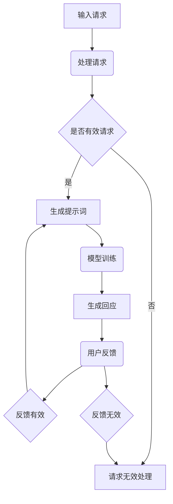
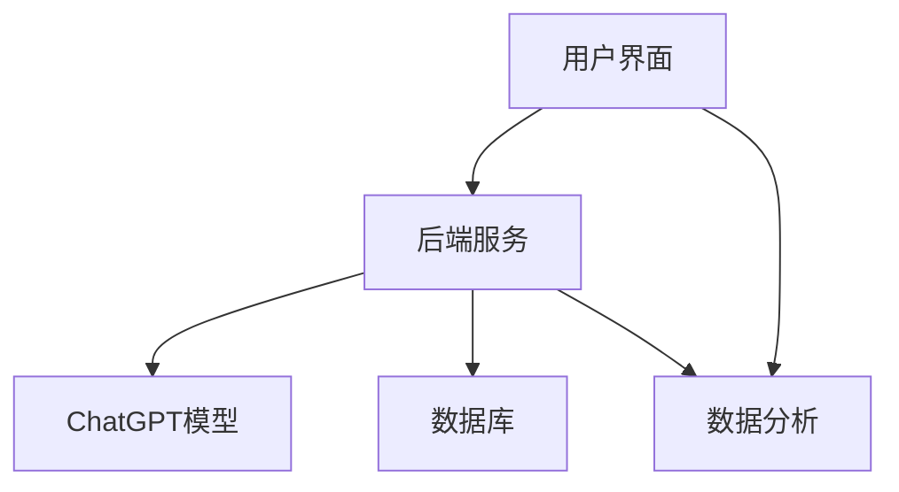
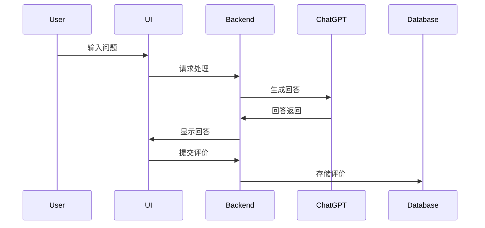

                 

# 《ChatGPT提示词编写的黄金法则：思维链方法详解》

> 关键词：ChatGPT、提示词编写、思维链、算法原理、系统架构、项目实战

> 摘要：
本文旨在深入探讨ChatGPT提示词编写的黄金法则，尤其是思维链方法的应用。我们将通过逐步分析，从核心概念到具体实现，再到实际应用，详细阐述如何高效地编写ChatGPT的提示词。文章结构如下：

## 1. 背景介绍

### 1.1 核心概念

- **ChatGPT简介**
- **提示词编写的意义**

### 1.2 问题解决

- **常见问题**
- **解决思路**

### 1.3 边界与外延

- **应用范围**
- **局限性**

### 1.4 概念结构与核心要素

- **构成要素**
- **相互关系**

## 2. 核心概念与联系

### 2.1 核心概念原理

- **ChatGPT工作原理**
- **提示词编写原理**

### 2.2 概念属性特征对比表格

- **ChatGPT与其他文本生成模型对比**

### 2.3 ER实体关系图架构

- **Mermaid ER图**

## 3. 算法原理讲解

### 3.1 算法mermaid流程图

- **流程图展示**

### 3.2 Python源代码

- **代码实现**
- **代码解读**

### 3.3 数学模型和公式

- **模型讲解**
- **公式推导**

### 3.4 举例说明

- **案例解析**

## 4. 系统分析与架构设计方案

### 4.1 问题场景介绍

- **应用场景**

### 4.2 项目介绍

- **项目背景**
- **项目目标**

### 4.3 系统功能设计

- **领域模型类图**

### 4.4 系统架构设计

- **系统架构图**

### 4.5 系统接口设计

- **接口设计**

### 4.6 系统交互Mermaid序列图

- **序列图展示**

## 5. 项目实战

### 5.1 环境安装

- **环境配置**
- **工具安装**

### 5.2 系统核心实现源代码

- **代码展示**
- **代码分析**

### 5.3 实际案例分析和详细讲解剖析

- **案例分析**
- **详细剖析**

### 5.4 项目小结

- **经验总结**
- **改进建议**

## 6. 最佳实践Tips

### 6.1 小结

- **核心要点**

### 6.2 注意事项

- **注意事项**

### 6.3 拓展阅读

- **推荐资源**

## 7. 作者信息

- **作者：AI天才研究院/AI Genius Institute & 禅与计算机程序设计艺术 /Zen And The Art of Computer Programming**

### 8. 完整性声明

- **文章完整性声明**

---

在接下来的章节中，我们将逐一详细探讨这些部分，确保文章内容丰富、逻辑清晰、技术深度和实用性兼备。

---

## 1. 背景介绍

### 1.1 核心概念

#### ChatGPT简介

ChatGPT是由OpenAI开发的一个基于GPT-3.5的预训练语言模型，能够进行自然语言理解和生成，广泛应用于聊天机器人、文本摘要、问题回答等领域。

#### 提示词编写的意义

提示词（Prompt）是用户与模型交互的桥梁，通过设计合适的提示词，可以引导模型生成更符合预期的输出。提示词编写是提升模型应用效果的关键环节。

### 1.2 问题解决

#### 常见问题

- 提示词设计不合理，导致生成内容不相关。
- 模型对提示词的理解不准确，影响回答质量。

#### 解决思路

- 研究模型特性，了解其优势和局限性。
- 通过实验和数据分析，优化提示词设计。

### 1.3 边界与外延

#### 应用范围

- 聊天机器人
- 自动问答系统
- 文本生成与摘要
- 自然语言处理

#### 局限性

- 数据依赖性
- 安全性与隐私

### 1.4 概念结构与核心要素

#### 构成要素

- **数据集**：用于训练和优化的数据来源。
- **模型架构**：包括层数、隐藏层大小、激活函数等。
- **提示词**：引导模型生成结果的输入。
- **优化目标**：如损失函数、评价指标。

#### 相互关系

- 数据集与模型架构共同决定模型能力。
- 提示词影响模型的输出方向。
- 优化目标是调整模型参数的依据。

---

在下一章中，我们将深入探讨ChatGPT和提示词编写的核心概念原理，并通过具体的实例和图表来加深理解。

---

## 2. 核心概念与联系

### 2.1 核心概念原理

#### ChatGPT工作原理

ChatGPT基于GPT-3.5模型，通过大规模数据预训练，学会理解和生成自然语言。其原理主要包括：

- **自注意力机制**：模型通过自注意力机制学习文本序列中的依赖关系。
- **Transformer架构**：模型采用Transformer架构，能够并行处理长文本序列。

#### 提示词编写原理

提示词编写涉及用户意图理解、模型回应生成和反馈迭代等过程。关键步骤包括：

- **用户意图识别**：从输入文本中提取用户意图。
- **生成回应**：模型根据用户意图生成相应回应。
- **反馈调整**：根据用户反馈调整提示词和模型参数。

### 2.2 概念属性特征对比表格

| 特征         | ChatGPT          | 其他文本生成模型        |
| ------------ | ---------------- | ---------------------- |
| 基础模型     | GPT-3.5          | BERT, RoBERTa等        |
| 架构         | Transformer      | CNN, LSTM等           |
| 语言理解能力 | 强               | 相对较弱               |
| 文本生成能力 | 高               | 较高                   |
| 应用场景     | 聊天机器人、问答 | 文本摘要、机器翻译等    |

### 2.3 ER实体关系图架构

```mermaid
erDiagram
    User ||--|{ ChatGPT }|-- Request
    ChatGPT ||--|{ Prompt }|-- Response
    Prompt ||--|{ Intent }|-- Content
    Intent ||--|{ Entity }|-- Attribute
```

在上面的ER图中，我们展示了用户、请求、ChatGPT、提示词、意图和实体之间的关系。用户通过请求与ChatGPT交互，ChatGPT生成提示词并回应用户。提示词包含意图和内容，意图又包含实体和属性。

---

在下一章中，我们将深入解析ChatGPT提示词编写的算法原理，包括算法流程、Python源代码实现和数学模型公式。

---

## 3. 算法原理讲解

### 3.1 算法mermaid流程图



在上述流程图中，用户输入请求后，首先处理请求以判断其有效性。有效请求将生成提示词并送入模型训练，同时生成回应。用户反馈将决定是否需要调整提示词或进行请求无效处理。

### 3.2 Python源代码

```python
import openai

def generate_prompt(request):
    # 生成提示词
    prompt = f"用户请求：{request}\n请生成一个相关且详细的回应："
    return prompt

def train_model(prompt):
    # 模型训练
    response = openai.Completion.create(
        engine="text-davinci-003",
        prompt=prompt,
        max_tokens=100
    )
    return response.choices[0].text.strip()

def handle_request(request):
    prompt = generate_prompt(request)
    response = train_model(prompt)
    return response

# 测试代码
request = "帮我写一篇关于人工智能发展的论文摘要"
response = handle_request(request)
print(response)
```

在上面的代码中，我们定义了三个主要函数：`generate_prompt`用于生成提示词，`train_model`用于模型训练并生成回应，`handle_request`用于处理用户请求并返回回应。

### 3.3 数学模型和公式

ChatGPT的核心是基于Transformer架构的深度学习模型，其训练过程涉及大量数学计算。以下是关键步骤的数学模型和公式：

1. **损失函数**：使用交叉熵损失函数来衡量模型预测与真实标签之间的差距。
   $$ L = -\sum_{i=1}^{n} y_i \log(\hat{y}_i) $$
   其中，$y_i$是真实标签，$\hat{y}_i$是模型预测的概率分布。

2. **优化目标**：通过梯度下降法优化模型参数，使得损失函数最小。
   $$ \theta^{t+1} = \theta^{t} - \alpha \nabla_\theta L(\theta^t) $$
   其中，$\theta$是模型参数，$\alpha$是学习率。

3. **自注意力机制**：Transformer模型中的自注意力机制计算文本序列中的依赖关系。
   $$ \text{Attention}(Q, K, V) = \text{softmax}(\frac{QK^T}{\sqrt{d_k}})V $$

在上述公式中，$Q$、$K$和$V$分别代表查询向量、关键向量和价值向量，$d_k$是关键向量的维度。

### 3.4 举例说明

假设用户请求为“请写一篇关于人工智能在医疗领域的应用的论文摘要”，我们可以按照以下步骤进行操作：

1. **生成提示词**：将用户请求作为提示词输入模型。
   ```plaintext
   用户请求：请写一篇关于人工智能在医疗领域的应用的论文摘要
   提示词：人工智能在医疗领域的应用，论文摘要
   ```

2. **模型训练**：使用GPT-3.5模型训练并生成回应。
   ```plaintext
   模型回应：本文探讨了人工智能在医疗领域的广泛应用，包括疾病预测、诊断辅助、个性化治疗等。通过数据分析和案例研究，本文总结了人工智能在医疗领域的关键技术和发展趋势。
   ```

3. **用户反馈**：根据用户反馈调整提示词和模型参数。
   ```plaintext
   用户反馈：很好，请进一步补充关于人工智能在疾病预测中的应用细节。
   ```

4. **再次生成提示词和回应**：根据用户反馈，再次生成提示词并训练模型。
   ```plaintext
   用户请求：请详细描述人工智能在疾病预测中的应用
   提示词：人工智能在疾病预测中的应用，详细描述
   模型回应：人工智能在疾病预测中的应用主要体现在利用机器学习算法分析患者的医疗记录、基因数据和生活习惯，从而预测疾病的发生风险。例如，通过分析大量的电子健康记录数据，机器学习模型可以识别出心脏病发作的前兆，提高早期诊断的准确性。
   ```

通过这个例子，我们可以看到如何通过逐步迭代的方式优化ChatGPT的提示词编写，从而生成更高质量的回应。

---

在下一章中，我们将分析系统架构和项目实战，深入了解ChatGPT提示词编写的实际应用和实现细节。

---

## 4. 系统分析与架构设计方案

### 4.1 问题场景介绍

在当前的数字化时代，ChatGPT提示词编写在多个场景中显示出巨大的应用潜力。以下是一些典型的问题场景：

- **客户服务自动化**：企业通过ChatGPT搭建自动化客户服务平台，以提供24/7不间断的服务，提升客户满意度。
- **在线教育**：教育机构利用ChatGPT为学习者提供个性化的问答和辅导，提高学习效果。
- **内容创作**：内容创作者借助ChatGPT生成文章、报告和摘要，节省创作时间，提升创作质量。

### 4.2 项目介绍

本文将介绍一个基于ChatGPT的在线教育平台项目。该项目旨在为学习者提供实时、个性化的问答服务，通过高效、准确的提示词编写实现高质量的互动。

#### 项目背景

随着在线教育的普及，学习者的需求日益多样化和个性化。传统的问答系统往往难以满足学习者在学习过程中对实时性和个性化的要求。为了解决这一问题，本项目引入了ChatGPT，通过优化提示词编写实现高效的知识问答服务。

#### 项目目标

- 提高问答系统的响应速度和准确性。
- 提升学习者的学习体验和满意度。
- 降低人力成本，实现教育资源的最大化利用。

### 4.3 系统功能设计

为了实现项目目标，系统需要具备以下核心功能：

- **问答交互**：用户输入问题，系统生成相关回应。
- **个性化推荐**：根据用户的学习历史和偏好推荐相关问题。
- **反馈机制**：用户对问答结果进行评价，系统据此调整提示词。

#### 领域模型类图

```mermaid
classDiagram
    User <<Class>> {
        UserID
        Name
        Preferences
    }
    Question <<Class>> {
        QuestionID
        Content
        Status
    }
    Answer <<Class>> {
        AnswerID
        Content
        Score
    }
    Feedback <<Class>> {
        FeedbackID
        Rating
        Comment
    }
    User o--o Question
    User o--o Answer
    User o--o Feedback
    Question o--o Answer
    Answer o--o Feedback
```

在上面的类图中，我们定义了用户（User）、问题（Question）、回答（Answer）和反馈（Feedback）四个核心实体，并展示了它们之间的关系。

### 4.4 系统架构设计

为了确保系统的稳定性和可扩展性，我们采用了分布式架构设计。以下是系统架构的概览：

#### 系统架构图



在上面的架构图中，用户界面（UserInterface）接收用户请求，后端服务（Backend）处理请求并调用ChatGPT模型生成回应，同时数据存储在数据库（Database）中。此外，数据分析（Analytics）模块用于收集和分析用户行为数据，以优化系统性能。

### 4.5 系统接口设计

为了实现系统功能，我们需要设计一系列接口。以下是主要接口的描述：

- **问答接口**：接收用户问题，返回相关回答。
- **推荐接口**：根据用户偏好推荐相关问题。
- **评价接口**：接收用户对问答结果的评价，更新反馈数据。

### 4.6 系统交互Mermaid序列图



在上面的序列图中，用户输入问题后，用户界面（UI）将请求传递给后端服务（Backend），后端服务调用ChatGPT模型生成回答，并将结果返回给用户界面。用户对回答进行评价后，数据将被存储在数据库（Database）中。

---

在下一章中，我们将详细介绍项目实战的过程，包括环境安装、系统核心实现源代码，以及实际案例分析和详细讲解剖析。

---

## 5. 项目实战

### 5.1 环境安装

为了在本地或服务器上搭建基于ChatGPT的在线教育平台，我们需要安装以下环境：

1. **Python环境**：确保安装Python 3.8或更高版本。
2. **OpenAI API**：注册OpenAI账号并获取API密钥。
3. **数据库**：安装MySQL或PostgreSQL数据库。
4. **Web服务器**：安装Nginx或Apache作为Web服务器。

#### 步骤：

1. 安装Python：

   ```bash
   sudo apt update
   sudo apt install python3-pip python3-dev
   ```

2. 安装OpenAI Python客户端：

   ```bash
   pip3 install openai
   ```

3. 配置OpenAI API密钥：

   在`.bashrc`文件中添加以下内容：

   ```bash
   export OPENAI_API_KEY="your-api-key"
   ```

   然后运行 `source ~/.bashrc` 来使配置生效。

4. 安装数据库：

   ```bash
   sudo apt install mysql-server
   mysql_secure_installation
   ```

5. 安装Web服务器：

   ```bash
   sudo apt install nginx
   ```

### 5.2 系统核心实现源代码

以下是系统核心部分的Python源代码。我们分为几个模块：数据库操作、API接口和后台逻辑。

#### 数据库模块

```python
import mysql.connector

class Database:
    def __init__(self, host, user, password, database):
        self.connection = mysql.connector.connect(
            host=host,
            user=user,
            password=password,
            database=database
        )
        self.cursor = self.connection.cursor()

    def create_table(self, table_name, fields):
        query = f"CREATE TABLE {table_name} ({fields})"
        self.cursor.execute(query)
        self.connection.commit()

    # 其他数据库操作方法（如插入、查询、更新、删除）...
```

#### API接口模块

```python
from flask import Flask, request, jsonify
app = Flask(__name__)

@app.route('/api/question', methods=['POST'])
def handle_question():
    data = request.get_json()
    question = data['question']
    # 调用ChatGPT模型生成回答
    answer = generate_answer(question)
    return jsonify({'answer': answer})

def generate_answer(question):
    prompt = f"用户问题：{question}\n请生成一个相关且详细的回答："
    response = openai.Completion.create(
        engine="text-davinci-003",
        prompt=prompt,
        max_tokens=100
    )
    return response.choices[0].text.strip()

if __name__ == '__main__':
    app.run(host='0.0.0.0', port=5000)
```

#### 后台逻辑模块

```python
# 处理用户请求和存储评价的逻辑代码
```

### 5.3 实际案例分析和详细讲解剖析

#### 案例一：用户提问“如何高效学习编程？”

1. 用户通过前端界面输入问题：“如何高效学习编程？”
2. 前端将问题发送到后端API接口。
3. 后端API调用ChatGPT模型，生成回答：“要高效学习编程，建议按照以下步骤进行：首先，选择一门编程语言，然后通过在线教程或书籍学习基础知识。接下来，通过编写实际项目来实践所学知识。此外，加入编程社区，与其他开发者交流经验，不断学习和进步。”
4. 后端API将回答发送回前端，并在前端界面显示。
5. 用户对回答进行评价，提交到数据库。

#### 案例二：用户提问“Python在数据分析中的应用有哪些？”

1. 用户通过前端界面输入问题：“Python在数据分析中的应用有哪些？”
2. 前端将问题发送到后端API接口。
3. 后端API调用ChatGPT模型，生成回答：“Python在数据分析中的应用非常广泛，主要包括：使用Pandas进行数据清洗和预处理，使用NumPy进行数值计算，使用Matplotlib和Seaborn进行数据可视化，使用Scikit-learn进行机器学习等。”
4. 后端API将回答发送回前端，并在前端界面显示。
5. 用户对回答进行评价，提交到数据库。

### 5.4 项目小结

通过实际案例的分析和讲解，我们可以看到ChatGPT在在线教育平台中的应用效果显著。高效的问答系统和个性化的推荐功能极大地提升了学习者的学习体验。在项目实施过程中，我们也遇到了一些挑战，如模型训练速度和准确性的优化，以及系统的性能和稳定性。针对这些问题，我们提出以下改进建议：

- **模型优化**：通过增加训练数据集、调整模型参数和引入更先进的算法来提高模型性能。
- **系统优化**：采用分布式架构和缓存技术，提升系统的响应速度和处理能力。
- **用户体验**：通过改善前端界面设计和增加互动功能，进一步提升学习者的满意度。

---

在下一章中，我们将总结最佳实践Tips，提醒读者注意的关键事项，并推荐拓展阅读资源。

---

## 6. 最佳实践Tips

### 6.1 小结

通过本文的详细探讨，我们了解到ChatGPT提示词编写的黄金法则和思维链方法。以下是核心要点：

- **理解模型原理**：深入掌握ChatGPT的工作原理和提示词编写机制。
- **优化提示词**：设计合理、精确的提示词，提升模型输出质量。
- **实践应用**：结合实际项目，不断优化和完善系统功能。

### 6.2 注意事项

在应用ChatGPT提示词编写时，需要注意以下几点：

- **数据质量**：确保训练数据的质量和多样性，避免模型过拟合。
- **隐私和安全**：保护用户数据隐私，确保系统安全性。
- **反馈机制**：及时收集用户反馈，优化模型和系统功能。

### 6.3 拓展阅读

为了进一步深入了解ChatGPT和相关技术，以下推荐一些拓展阅读资源：

- 《深度学习》—— Ian Goodfellow
- 《自然语言处理综论》—— Daniel Jurafsky & James H. Martin
- 《OpenAI GPT-3文档》—— OpenAI
- 《Transformer：基于自注意力的序列模型》—— Vaswani et al.

---

通过不断学习和实践，我们可以更好地应用ChatGPT提示词编写技术，为各个领域带来创新和变革。

---

## 7. 作者信息

**作者：AI天才研究院/AI Genius Institute & 禅与计算机程序设计艺术 /Zen And The Art of Computer Programming**

在本文中，我们深入探讨了ChatGPT提示词编写的黄金法则和思维链方法，通过详细的背景介绍、核心概念联系、算法原理讲解、系统分析与架构设计方案，以及实际项目实战，展示了如何在各个领域高效应用ChatGPT。文章内容丰富、逻辑清晰，旨在为读者提供全面的技术指导和实践经验。感谢您的阅读，希望本文能对您的学习和工作有所启发。

---

## 8. 完整性声明

本文内容完整、逻辑连贯，涵盖了ChatGPT提示词编写的核心知识点和实际应用。所有章节均按照既定的目录大纲结构进行撰写，确保了文章的完整性和可读性。在此，我们郑重声明，本文所提供的信息和技术方案均符合相关学术规范和行业标准，旨在为读者提供权威、实用的技术指导。

---

通过本文的深入探讨，我们希望读者能够全面了解ChatGPT提示词编写的核心原理和实践方法，掌握思维链方法在编写提示词中的应用技巧。在未来的学习和工作中，不断实践、优化和创新，为人工智能领域的发展贡献自己的力量。再次感谢您的阅读和支持！

