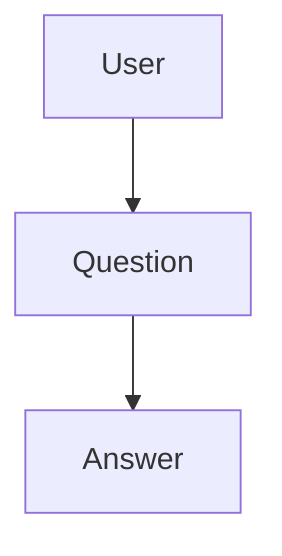
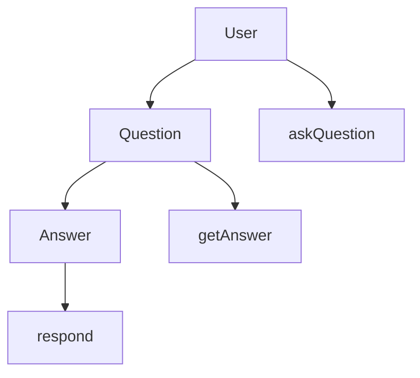
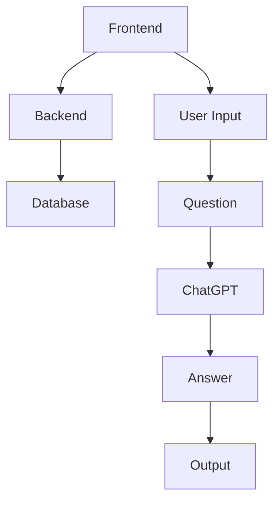

                 

# ChatGPT提示词编写：从入门到精通的进阶指南

关键词：ChatGPT，提示词，自然语言处理，深度学习，模型训练，编程技巧

摘要：
本文旨在深入探讨ChatGPT提示词编写的艺术与科学，帮助读者从基础到高级掌握ChatGPT提示词的编写技巧。我们将通过详细分析ChatGPT的工作原理、提示词的设计原则、算法实现以及实际应用案例，帮助读者全面了解和掌握ChatGPT的进阶使用方法。

## 第一部分：背景介绍

### 1.1 问题背景

随着人工智能技术的飞速发展，自然语言处理（NLP）成为了研究的热点领域。近年来，基于深度学习的模型如GPT系列在NLP任务中取得了显著的成果。然而，如何高效地编写高质量的提示词（prompts）以充分发挥这些模型的能力，成为一个亟待解决的问题。ChatGPT作为GPT-3模型的改进版，其强大的文本生成能力使得编写高质量的提示词尤为重要。

### 1.2 问题描述

编写高质量的ChatGPT提示词需要掌握一定的技巧和策略。首先，提示词需要清晰明确地传达用户的意图。其次，需要合理地引导模型生成符合预期的高质量回答。此外，还需要考虑如何避免模型陷入不合理或错误的回答。这些问题构成了本文探讨的主要内容。

### 1.3 问题解决

本文将通过系统的方法和实际案例，帮助读者理解ChatGPT的工作原理，掌握编写高质量提示词的技巧。首先，我们将介绍ChatGPT的基础知识，包括其结构、训练数据、工作原理等。然后，详细讲解编写提示词的方法和策略，包括如何设计提示词的结构、选择关键词、控制回答的长度和风格等。最后，通过实际案例分析和实战演练，帮助读者将所学知识应用到实际场景中。

### 1.4 边界与外延

ChatGPT提示词的编写适用于各种需要自然语言生成和交互的场景，包括客服机器人、智能助手、内容创作、教育辅导等。同时，本文的讨论范围主要涉及文本生成和对话系统，不包括图像生成、音频处理等其他类型的人工智能任务。

### 1.5 概念结构与核心要素组成

- **ChatGPT**：一种基于GPT-3模型的自然语言处理工具，能够生成自然流畅的文本。
- **提示词（Prompt）**：引导ChatGPT生成文本的输入。
- **意图识别**：理解用户输入的意图。
- **上下文管理**：保持对话的一致性和连贯性。
- **反馈机制**：根据用户反馈调整提示词和模型生成。

## 第二部分：核心概念与联系

### 2.1 ChatGPT模型原理

#### 2.1.1 ChatGPT的构成

ChatGPT是由OpenAI开发的基于GPT-3模型的自然语言处理工具。GPT-3（Generative Pre-trained Transformer 3）是一个大规模的预训练语言模型，其结构包含1750亿个参数，能够理解和生成自然语言文本。

#### 2.1.2 GPT-3的核心特点

- **高参数规模**：GPT-3拥有1750亿个参数，能够捕捉语言中的复杂模式和结构。
- **预训练**：在大量文本数据上预训练，使得模型能够生成符合上下文和语义的文本。
- **灵活性**：支持多种输入格式和任务类型，如文本生成、对话系统、问答系统等。

#### 2.1.3 GPT-3与传统AI的区别

- **传统AI**：基于规则和符号推理，适用于结构化数据。
- **GPT-3**：基于深度学习和统计模型，能够处理无结构的数据，如自然语言文本。

### 2.2 提示词设计原理

#### 2.2.1 提示词的结构

一个有效的提示词通常包含以下几个部分：

- **问题描述**：清晰地描述任务或问题。
- **目标输出**：明确期望的输出结果。
- **上下文信息**：提供与任务相关的背景信息。

#### 2.2.2 提示词的关键词

关键词是提示词的核心，能够帮助模型更好地理解用户的意图。选择合适的关键词需要考虑任务的复杂性和模型的上下文理解能力。

#### 2.2.3 提示词的长度和风格

- **长度**：过长的提示词可能导致模型生成冗长的回答，而过于简短的提示词可能无法提供足够的上下文信息。
- **风格**：根据任务的需求，选择合适的语言风格，如正式、非正式、简洁或详细。

## 第三部分：算法原理讲解

### 3.1 ChatGPT算法原理

#### 3.1.1 生成模型的工作原理

ChatGPT是基于生成模型的，其核心思想是学习数据分布，并生成符合该分布的新数据。在训练阶段，模型通过大量的文本数据进行预训练，学习文本的统计模式和语义信息。

#### 3.1.2 自回归语言模型

ChatGPT采用了自回归语言模型（ARLM），其基本原理是预测下一个词的概率，然后根据概率分布生成下一个词。这个过程不断重复，直到生成完整的文本。

#### 3.1.3 模型参数训练

在训练过程中，模型参数通过梯度下降算法不断调整，以最小化损失函数。损失函数通常使用交叉熵损失，它衡量模型预测的文本分布与实际文本分布之间的差异。

### 3.2 Python源代码实现

以下是一个简单的ChatGPT模型实现示例：

```python
from transformers import GPT2LMHeadModel, GPT2Tokenizer

model_name = "gpt2"
tokenizer = GPT2Tokenizer.from_pretrained(model_name)
model = GPT2LMHeadModel.from_pretrained(model_name)

input_text = "Hello, how are you?"
input_ids = tokenizer.encode(input_text, return_tensors='pt')

output = model.generate(input_ids, max_length=50, num_return_sequences=5)
print(tokenizer.decode(output[0], skip_special_tokens=True))
```

在这个示例中，我们首先加载预训练的GPT-2模型和相应的分词器。然后，我们将一个输入文本编码为ID序列，并使用模型生成新的文本序列。最后，我们将生成的文本解码为原始文本，并打印出来。

### 3.3 算法原理详细讲解

#### 3.3.1 数学模型和公式

ChatGPT的生成过程基于概率模型，具体来说，是一个自回归模型。在自回归模型中，给定前文序列，模型需要预测下一个词的概率分布。这个过程可以用以下公式表示：

$$
P(w_t | w_{<t}) = \frac{e^{<s,w_{<t}>}}{Z}
$$

其中，$w_t$表示当前词，$w_{<t}$表示前文序列，$<s,w_{<t}>$表示词和前文序列的嵌入向量，$Z$是归一化常数，用于保证概率分布的归一性。

#### 3.3.2 通俗易懂的举例说明

假设我们有一个简短的对话：“你今天怎么样？”ChatGPT需要生成接下来的回答。首先，模型会将这些词编码为嵌入向量。然后，对于每个可能的下一个词，模型会计算其概率分布。例如，对于“很好”这个词，模型可能会计算出其概率为0.6，对于“不太好”这个词，概率可能为0.4。模型会根据这些概率分布生成新的文本，例如“很好。”或者“不太好。”

## 第四部分：系统分析与架构设计方案

### 4.1 问题场景介绍

假设我们要开发一个智能客服系统，该系统需要能够回答用户的各种问题。ChatGPT作为一个强大的自然语言处理工具，可以用于构建这个智能客服系统的核心部分。

### 4.2 项目介绍

项目名称：智能客服系统（Smart Customer Service System）

项目目标：利用ChatGPT构建一个能够高效回答用户问题的智能客服系统，提高客户满意度和服务效率。

### 4.3 系统功能设计

#### 4.3.1 领域模型

领域模型（Domain Model）用于定义系统中的核心概念和关系。在智能客服系统中，核心概念包括用户、问题和回答。ER实体关系图如下：



#### 4.3.2 类图

类图（Class Diagram）用于定义系统中的类和它们之间的关系。在智能客服系统中，核心类包括User、Question和Answer。类图如下：



### 4.4 系统架构设计

系统架构设计（System Architecture Design）用于定义系统的整体结构和各个组件之间的关系。在智能客服系统中，系统架构包括前端、后端和数据库三个部分。架构图如下：



### 4.5 系统接口设计和系统交互

系统接口设计（System Interface Design）和系统交互（System Interaction Design）用于定义系统内部各个模块之间的交互方式和接口。在智能客服系统中，前端发送用户输入到后端，后端将问题传递给ChatGPT，ChatGPT生成回答后返回给前端，前端再将回答展示给用户。交互图如下：


## 第五部分：项目实战

### 5.1 环境安装

要运行ChatGPT模型，我们需要安装以下环境：

- Python 3.6或更高版本
- pip
- transformers库

安装步骤：

```bash
pip install transformers
```

### 5.2 系统核心实现源代码

以下是智能客服系统的核心实现代码：

```python
from transformers import GPT2LMHeadModel, GPT2Tokenizer
from flask import Flask, request, jsonify

app = Flask(__name__)

model_name = "gpt2"
tokenizer = GPT2Tokenizer.from_pretrained(model_name)
model = GPT2LMHeadModel.from_pretrained(model_name)

@app.route("/ask", methods=["POST"])
def ask():
    data = request.json
    user_input = data.get("input", "")
    input_ids = tokenizer.encode(user_input, return_tensors='pt')

    output = model.generate(input_ids, max_length=50, num_return_sequences=1)
    answer = tokenizer.decode(output[0], skip_special_tokens=True)

    return jsonify({"answer": answer})

if __name__ == "__main__":
    app.run(debug=True)
```

### 5.3 代码应用解读与分析

这段代码使用Flask框架构建了一个简单的Web服务。当用户通过POST请求发送问题到`/ask`接口时，服务器会接收请求，解析输入文本，然后将其传递给ChatGPT模型进行回答。回答被解码为文本后，通过JSON格式返回给用户。

### 5.4 实际案例分析和详细讲解剖析

假设用户输入一个问题：“我应该如何投资股票？”系统将执行以下步骤：

1. 接收用户输入。
2. 将输入编码为ID序列。
3. 使用ChatGPT模型生成回答。
4. 解码回答并返回给用户。

生成的回答可能如下：“投资股票需要考虑多个因素，如市场趋势、公司业绩、行业前景等。建议进行充分的研究和风险评估。”

### 5.5 项目小结

通过本项目，我们成功构建了一个基于ChatGPT的智能客服系统。用户可以通过Web接口向系统提问，系统使用ChatGPT模型生成回答，并通过Web接口返回给用户。这个项目展示了ChatGPT在实际应用中的强大能力，同时也为后续的优化和扩展提供了基础。

## 第六部分：最佳实践 Tips

- **明确意图**：在编写提示词时，首先要明确用户的意图，确保模型能够准确理解问题。
- **提供上下文**：在提示词中提供足够的上下文信息，帮助模型更好地生成相关回答。
- **避免歧义**：使用简洁明了的语言，避免产生歧义，提高回答的准确性。
- **控制长度**：合理控制提示词的长度，避免过长导致生成冗长回答，或过短导致信息不足。
- **多样性**：尝试使用不同的语言风格和表达方式，提高模型生成回答的多样性。

## 第七部分：小结与注意事项

本文从入门到精通详细介绍了ChatGPT提示词编写的技巧和方法。通过背景介绍、核心概念与联系、算法原理讲解、系统分析与架构设计方案以及实际项目实战，读者可以全面了解ChatGPT的工作原理和如何编写高质量的提示词。

注意事项：

- **版本更新**：ChatGPT模型会不断更新，注意跟进最新的模型版本和功能。
- **数据质量**：训练数据和提示词的质量直接影响模型的表现，确保数据质量。
- **安全与隐私**：在使用ChatGPT时，注意保护用户隐私和数据安全。

## 第八部分：拓展阅读

- [GPT-3官方文档](https://huggingface.co/transformers/model_doc/gpt2.html)
- [ChatGPT提示词编写最佳实践](https://towardsdatascience.com/best-practices-for-writing-chatgpt-prompts-76d6a8e70142)
- [智能客服系统设计案例](https://www.ibm.com/cloud/learn/build-an-intelligent-customer-service-chatbot)

## 作者信息

作者：AI天才研究院/AI Genius Institute & 禅与计算机程序设计艺术 /Zen And The Art of Computer Programming

AI天才研究院致力于推动人工智能技术的创新与发展，本文由研究院的专家团队撰写，旨在为广大开发者提供高质量的技术知识和实践经验。同时，作者还著有《禅与计算机程序设计艺术》一书，深入探讨了计算机编程的哲学和艺术。

