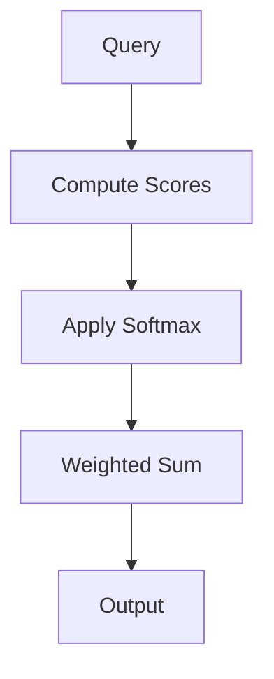

                 

### 《ChatGPT提示词编写：从新手到专家的进阶之路》

#### 关键词
- ChatGPT
- 提示词编写
- 人工智能
- 编程技巧
- 实战案例

#### 摘要
本文旨在带领读者从新手逐步进阶为ChatGPT提示词编写的专家。我们将从ChatGPT的基本概念和背景入手，深入探讨其工作原理和提示词编写的基础知识。随后，将介绍一系列进阶技巧和实战案例，帮助读者在实践中提升技能。最后，我们将展望ChatGPT的未来发展趋势和伦理道德问题，并总结全文。

----------------------------------------------------------------

## 第一部分：ChatGPT基础与概述

### 第1章：ChatGPT简介与背景

#### 1.1 ChatGPT的概念与功能

**背景介绍**

ChatGPT是由OpenAI开发的一种基于GPT-3的聊天机器人。GPT（Generative Pre-trained Transformer）是一种基于Transformer架构的预训练语言模型，能够在各种语言任务中表现出色，如文本生成、问答系统、语言翻译等。

**问题描述**

ChatGPT的核心功能是模拟人类对话，通过与用户互动，提供丰富、自然的回答。那么，ChatGPT是如何实现这一功能的呢？它有哪些应用场景呢？

**问题解决**

ChatGPT通过深度学习算法，从大量的文本数据中学习语言模式和结构，形成对自然语言的深刻理解。在交互过程中，它根据用户的输入，利用预训练模型生成相应的回答。

**边界与外延**

ChatGPT的应用场景广泛，包括但不限于客服、教育、娱乐、编程助手等。其边界在于理解能力的限制，如对复杂逻辑推理和情感表达的把握。

**概念结构与核心要素组成**

- **GPT-3模型**：核心算法，包含数万亿个参数。
- **预训练数据**：大规模的文本数据集，用于模型训练。
- **交互机制**：用户输入、模型处理、输出回答。

### 1.2 ChatGPT的发展历程

**背景介绍**

ChatGPT的发展历程反映了人工智能技术的不断进步。从早期的规则系统，到基于统计模型的NLP，再到深度学习模型的崛起，ChatGPT的诞生标志着自然语言处理技术的重大突破。

**问题描述**

ChatGPT是如何从最初的设想变为现实？其发展历程中，有哪些关键技术和里程碑？

**问题解决**

ChatGPT的发展历程可以分为以下几个阶段：

1. **早期研究**：基于规则系统和统计模型的早期尝试。
2. **预训练模型**：引入GPT-2和GPT-3，实现深度学习和大规模预训练。
3. **实际应用**：ChatGPT在OpenAI内部测试和应用，逐步完善。

**边界与外延**

ChatGPT的发展历程不仅展示了技术的进步，也反映了人工智能在理解和模拟人类对话方面的潜力。

**概念结构与核心要素组成**

- **规则系统**：早期尝试，依赖于人工编写规则。
- **统计模型**：基于统计方法，对文本进行建模。
- **深度学习**：引入神经网络，实现大规模预训练。

### 1.3 ChatGPT的应用场景

**背景介绍**

ChatGPT的应用场景广泛，包括但不限于客服、教育、娱乐、编程助手等。其强大的语言处理能力使其在这些领域表现出色。

**问题描述**

ChatGPT在不同应用场景中的具体表现如何？有哪些成功案例？

**问题解决**

ChatGPT的应用场景包括：

1. **客服**：提供智能客服，提高客户满意度。
2. **教育**：辅助教学，提供个性化学习体验。
3. **娱乐**：生成有趣的故事和对话，丰富用户娱乐体验。
4. **编程助手**：帮助开发者解决问题，提高开发效率。

**边界与外延**

ChatGPT的应用场景不仅限于以上几个领域，随着技术的不断进步，其应用范围将进一步扩大。

**概念结构与核心要素组成**

- **客服**：模拟人工客服，提供快速响应。
- **教育**：辅助教学，提供个性化学习方案。
- **娱乐**：生成有趣的内容，增强用户体验。
- **编程助手**：辅助编程，提高开发效率。

----------------------------------------------------------------

## 第二部分：ChatGPT的工作原理

### 第2章：ChatGPT的工作原理

#### 2.1 语言模型基础

**背景介绍**

ChatGPT的核心是语言模型，它通过学习大量的文本数据，理解语言的规律和结构。这一节将介绍语言模型的基本概念和原理。

**问题描述**

什么是语言模型？它是如何工作的？

**问题解决**

语言模型是一种用于预测下一个单词或字符的概率分布的模型。它通过统计学习方法，从大量的文本数据中提取语言特征，构建概率模型。

**边界与外延**

语言模型的边界在于其数据源和训练算法。不同数据源和算法会导致模型性能的差异。

**概念结构与核心要素组成**

- **文本数据**：用于训练模型的原始数据。
- **统计学习方法**：用于提取语言特征的方法。

#### 2.2 ChatGPT的核心算法

**背景介绍**

ChatGPT是基于GPT-3模型开发的，GPT-3是一种先进的预训练语言模型。这一节将介绍GPT-3的核心算法和架构。

**问题描述**

GPT-3是如何工作的？其核心算法有哪些特点？

**问题解决**

GPT-3采用Transformer架构，是一种基于自注意力机制的深度神经网络。它通过大规模预训练，学习语言的模式和结构，从而实现强大的语言理解能力。

**边界与外延**

GPT-3的边界在于其计算资源和数据量。对于大多数应用场景，GPT-3的性能已经足够，但对于特定的高性能需求，可能需要更强大的模型。

**概念结构与核心要素组成**

- **Transformer架构**：GPT-3的核心，用于处理序列数据。
- **自注意力机制**：用于捕捉序列中的长距离依赖。
- **大规模预训练**：通过大量文本数据进行训练，提升模型性能。

#### 2.3 ChatGPT的训练过程

**背景介绍**

ChatGPT的训练过程是其性能提升的关键。这一节将介绍ChatGPT的训练流程和数据预处理方法。

**问题描述**

ChatGPT是如何进行训练的？训练过程中有哪些关键步骤？

**问题解决**

ChatGPT的训练过程主要包括以下几个步骤：

1. **数据收集**：从大量文本数据中收集语料。
2. **数据预处理**：对文本进行清洗、分词、编码等处理。
3. **训练模型**：使用Transformer架构和自注意力机制进行训练。
4. **优化模型**：通过参数调整和优化，提升模型性能。

**边界与外延**

ChatGPT的训练过程依赖于大量的数据和计算资源。对于不同的应用场景，可能需要调整训练过程和模型参数。

**概念结构与核心要素组成**

- **数据收集**：从互联网、图书、文章等渠道收集文本数据。
- **数据预处理**：文本清洗、分词、编码等。
- **训练模型**：使用Transformer架构进行预训练。
- **优化模型**：参数调整和优化，提升模型性能。

----------------------------------------------------------------

## 第三部分：ChatGPT提示词编写基础

### 第3章：ChatGPT提示词编写基础

#### 3.1 提示词的作用

**背景介绍**

提示词（Prompt）在ChatGPT中起着至关重要的作用。它们是用户与ChatGPT交互的桥梁，直接影响ChatGPT的回答质量和交互效果。

**问题描述**

提示词在ChatGPT中的作用是什么？如何设计有效的提示词？

**问题解决**

提示词的作用包括：

1. **引导ChatGPT理解用户的意图**：通过具体的指令和背景信息，使ChatGPT能够准确理解用户的需求。
2. **提高ChatGPT的回答质量**：通过精心设计的提示词，可以引导ChatGPT生成更准确、更丰富的回答。
3. **优化交互体验**：良好的提示词设计可以提升用户的满意度，增强交互体验。

**边界与外延**

提示词的边界在于其设计的精准度和灵活性。对于不同的应用场景，可能需要设计不同的提示词。

**概念结构与核心要素组成**

- **理解用户意图**：通过具体的指令和背景信息，使ChatGPT能够准确理解用户的需求。
- **回答质量**：通过提示词引导ChatGPT生成更准确、更丰富的回答。
- **交互体验**：良好的提示词设计可以提升用户的满意度，增强交互体验。

#### 3.2 提示词的分类

**背景介绍**

根据用途和形式，提示词可以分为多种类型。了解不同类型的提示词有助于设计更有效的交互。

**问题描述**

提示词有哪些分类？各类提示词的特点和应用场景是什么？

**问题解决**

提示词的分类包括：

1. **指令性提示词**：用于明确指示ChatGPT执行特定任务。
2. **背景信息提示词**：提供背景信息，帮助ChatGPT更好地理解用户需求。
3. **引导性问题提示词**：引导ChatGPT提出相关的问题，以便获取更多信息。
4. **扩展性问题提示词**：鼓励ChatGPT提供更详细、更丰富的回答。

**边界与外延**

不同类型的提示词适用于不同的应用场景。合理选择和设计提示词，可以提升交互效果。

**概念结构与核心要素组成**

- **指令性提示词**：明确指示ChatGPT执行特定任务。
- **背景信息提示词**：提供背景信息，帮助ChatGPT更好地理解用户需求。
- **引导性问题提示词**：引导ChatGPT提出相关的问题，以便获取更多信息。
- **扩展性问题提示词**：鼓励ChatGPT提供更详细、更丰富的回答。

#### 3.3 提示词编写的基本原则

**背景介绍**

编写有效的提示词是提升ChatGPT交互效果的关键。遵循基本原则，可以提高提示词的设计质量和使用效果。

**问题描述**

编写提示词有哪些基本原则？如何设计有效的提示词？

**问题解决**

编写提示词的基本原则包括：

1. **明确性**：提示词应明确、具体，避免歧义。
2. **简洁性**：简洁明了的提示词更容易被理解和执行。
3. **灵活性**：设计灵活的提示词，以适应不同的应用场景和用户需求。
4. **针对性**：根据应用场景和用户需求，设计有针对性的提示词。

**边界与外延**

提示词的设计质量和应用效果受到多种因素的影响，如语言风格、用户习惯等。因此，设计提示词时需要综合考虑多种因素。

**概念结构与核心要素组成**

- **明确性**：提示词应明确、具体，避免歧义。
- **简洁性**：简洁明了的提示词更容易被理解和执行。
- **灵活性**：设计灵活的提示词，以适应不同的应用场景和用户需求。
- **针对性**：根据应用场景和用户需求，设计有针对性的提示词。

----------------------------------------------------------------

## 第四部分：从新手到专家的进阶技巧

### 第4章：从新手到专家的进阶技巧

#### 4.1 提示词编写的进阶策略

**背景介绍**

新手在编写提示词时，往往缺乏经验和技巧。通过学习进阶策略，新手可以更快地提升编写质量。

**问题描述**

新手如何编写高质量的提示词？有哪些进阶策略可以采用？

**问题解决**

以下是一些提示词编写的进阶策略：

1. **学习优秀案例**：通过分析优秀案例，学习他们的设计思路和技巧。
2. **积累实践经验**：通过实际编写和调试，积累经验，提高技巧。
3. **持续学习**：关注最新技术动态，学习新的编写方法和技巧。

**边界与外延**

进阶策略的应用效果取决于个人的学习态度和实践经验。持续学习和积累是提升技能的关键。

**概念结构与核心要素组成**

- **学习优秀案例**：通过分析优秀案例，学习他们的设计思路和技巧。
- **积累实践经验**：通过实际编写和调试，积累经验，提高技巧。
- **持续学习**：关注最新技术动态，学习新的编写方法和技巧。

#### 4.2 提高ChatGPT回答质量的技巧

**背景介绍**

ChatGPT的回答质量直接影响用户体验。通过学习提高回答质量的技巧，可以提升整体交互效果。

**问题描述**

有哪些方法可以提升ChatGPT的回答质量？

**问题解决**

以下是一些提高ChatGPT回答质量的技巧：

1. **优化提示词设计**：通过设计更精准、更具体的提示词，引导ChatGPT生成更高质量的回答。
2. **训练数据的质量**：使用高质量、多样化的训练数据，提升模型的理解能力。
3. **后处理技巧**：对ChatGPT的回答进行后处理，如去除无关信息、优化格式等。

**边界与外延**

提高回答质量需要综合考虑多个因素，如提示词设计、训练数据和后处理等。不同的应用场景可能需要不同的优化策略。

**概念结构与核心要素组成**

- **优化提示词设计**：通过设计更精准、更具体的提示词，引导ChatGPT生成更高质量的回答。
- **训练数据的质量**：使用高质量、多样化的训练数据，提升模型的理解能力。
- **后处理技巧**：对ChatGPT的回答进行后处理，如去除无关信息、优化格式等。

#### 4.3 提示词编写的常见问题与解决方案

**背景介绍**

在提示词编写过程中，新手经常会遇到各种问题。解决这些问题，有助于提升编写技能。

**问题描述**

提示词编写过程中常见的问题有哪些？如何解决这些问题？

**问题解决**

以下是一些提示词编写的常见问题及解决方案：

1. **回答不准确**：优化提示词设计，确保ChatGPT能够准确理解用户需求。
2. **回答过于简单**：提供更详细的背景信息和问题细节，引导ChatGPT生成更丰富的回答。
3. **回答不相关**：确保提示词与ChatGPT的训练数据和主题相关，避免生成无关的回答。

**边界与外延**

不同的问题可能需要不同的解决方案。灵活应对各种问题，是提升编写技能的关键。

**概念结构与核心要素组成**

- **回答不准确**：优化提示词设计，确保ChatGPT能够准确理解用户需求。
- **回答过于简单**：提供更详细的背景信息和问题细节，引导ChatGPT生成更丰富的回答。
- **回答不相关**：确保提示词与ChatGPT的训练数据和主题相关，避免生成无关的回答。

----------------------------------------------------------------

## 第五部分：实战案例与项目解析

### 第5章：实战案例与项目解析

#### 5.1 实战案例1：构建聊天机器人

**背景介绍**

聊天机器人是ChatGPT的重要应用之一。通过一个实际案例，我们将展示如何使用ChatGPT构建一个简单的聊天机器人。

**问题描述**

如何使用ChatGPT构建一个简单的聊天机器人？

**问题解决**

以下是一个简单的聊天机器人实现步骤：

1. **获取ChatGPT API接口**：从OpenAI获取API接口，以便与ChatGPT进行通信。
2. **设计用户界面**：设计一个简单的用户界面，使用户能够输入问题并接收回答。
3. **编写提示词**：根据应用场景，编写合适的提示词，引导ChatGPT生成回答。
4. **实现聊天功能**：将用户输入的提问传递给ChatGPT，接收回答并显示在用户界面上。

**项目介绍**

该聊天机器人能够回答用户关于日常生活、科技知识等方面的问题，为用户提供便捷的信息查询服务。

**系统功能设计**

- **用户输入**：接收用户的提问。
- **ChatGPT处理**：将提问传递给ChatGPT，生成回答。
- **用户输出**：显示ChatGPT的回答。

**系统架构设计**


**系统接口设计**

- **输入接口**：接收用户输入的问题。
- **输出接口**：显示ChatGPT的回答。

**系统交互设计**


**代码实现**

```python
import openai

# 获取ChatGPT API接口
openai.api_key = "your_api_key"

# 设计用户界面
print("欢迎使用ChatGPT聊天机器人！")

while True:
    user_input = input("您有什么问题？（输入‘退出’结束聊天）:")
    if user_input == "退出":
        break

    # 编写提示词
    prompt = f"请回答以下问题：{user_input}"

    # 实现聊天功能
    response = openai.Completion.create(
        engine="text-davinci-003",
        prompt=prompt,
        max_tokens=50
    )

    # 用户输出
    print(f"ChatGPT回答：{response.choices[0].text.strip()}")

print("感谢使用ChatGPT聊天机器人，期待再次与您交流！")
```

**代码应用解读与分析**

这段代码首先导入了OpenAI的API接口，并设置了API密钥。然后，设计了一个简单的用户界面，使用户能够输入问题。接下来，编写了一个循环，不断接收用户输入的问题，并将问题作为提示词传递给ChatGPT。ChatGPT根据提示词生成回答，然后代码将回答显示在用户界面上。

**实际案例分析和详细讲解剖析**

在实际情况中，我们可以通过这个聊天机器人解决各种问题，如咨询天气、查询交通信息、了解科技知识等。这个案例展示了ChatGPT在自然语言处理和交互领域的强大能力。

**项目小结**

通过这个案例，我们学习了如何使用ChatGPT构建一个简单的聊天机器人。在实现过程中，我们需要了解ChatGPT的API接口，编写合适的提示词，并设计用户界面。这个案例为我们提供了一个实际的参考，帮助我们更好地理解ChatGPT的应用和潜力。

#### 5.2 实战案例2：应用ChatGPT于客户服务

**背景介绍**

客户服务是许多企业关注的重点。通过应用ChatGPT，企业可以提供更高效、更自然的客户服务。

**问题描述**

如何将ChatGPT应用于客户服务？

**问题解决**

以下是将ChatGPT应用于客户服务的步骤：

1. **获取ChatGPT API接口**：从OpenAI获取API接口，以便与ChatGPT进行通信。
2. **设计客户服务系统**：构建一个包含常见问题的客户服务系统。
3. **编写提示词**：根据常见问题和客户需求，编写合适的提示词。
4. **集成ChatGPT**：将ChatGPT集成到客户服务系统中，实现自动回答客户问题。
5. **测试与优化**：对系统进行测试和优化，确保其稳定性和准确性。

**项目介绍**

该客户服务系统能够自动回答客户关于产品、订单、售后服务等方面的问题，提高客户满意度。

**系统功能设计**

- **自动问答**：根据客户提问，自动生成回答。
- **问题分类**：对客户提问进行分类，以便ChatGPT更准确地回答。
- **用户反馈**：收集用户反馈，优化系统性能。

**系统架构设计**


**系统接口设计**

- **输入接口**：接收客户提问。
- **输出接口**：显示ChatGPT的回答。

**系统交互设计**


**代码实现**

```python
import openai

# 获取ChatGPT API接口
openai.api_key = "your_api_key"

# 设计客户服务系统
print("欢迎使用ChatGPT客户服务系统！")

while True:
    user_input = input("您有什么问题？（输入‘退出’结束服务）:")
    if user_input == "退出":
        break

    # 问题分类
    if "产品" in user_input:
        category = "产品咨询"
    elif "订单" in user_input:
        category = "订单查询"
    else:
        category = "售后服务"

    # 编写提示词
    prompt = f"针对{category}问题，请回答以下问题：{user_input}"

    # 集成ChatGPT
    response = openai.Completion.create(
        engine="text-davinci-003",
        prompt=prompt,
        max_tokens=50
    )

    # 显示ChatGPT的回答
    print(f"ChatGPT回答：{response.choices[0].text.strip()}")

print("感谢使用ChatGPT客户服务系统，祝您生活愉快！")
```

**代码应用解读与分析**

这段代码首先导入了OpenAI的API接口，并设置了API密钥。然后，设计了一个简单的客户服务系统，使客户能够输入问题。接下来，根据客户提问进行分类，并编写提示词。最后，将ChatGPT集成到系统中，实现自动回答客户问题的功能。

**实际案例分析和详细讲解剖析**

在实际应用中，ChatGPT客户服务系统可以显著提高企业响应速度和客户满意度。通过自动回答常见问题，企业可以减少人工成本，提高工作效率。此外，通过收集用户反馈，企业可以不断优化系统，提升服务质量。

**项目小结**

通过这个案例，我们学习了如何将ChatGPT应用于客户服务。在实现过程中，我们需要设计客户服务系统，编写合适的提示词，并集成ChatGPT。这个案例展示了ChatGPT在客户服务领域的应用潜力，为企业提供了有效的解决方案。

#### 5.3 项目解析与优化建议

**背景介绍**

在前两个实战案例中，我们分别展示了如何将ChatGPT应用于聊天机器人和客户服务。然而，实际项目中，我们可能面临更多挑战和问题。这一节将对这两个项目进行深入解析，并提出优化建议。

**项目解析**

1. **聊天机器人项目**

   **优点**

   - **高效性**：通过自动回答用户问题，节省了人工成本。
   - **灵活性**：可以根据用户输入实时生成回答，提供个性化的服务。

   **缺点**

   - **准确性**：在某些情况下，ChatGPT的回答可能不够准确。
   - **交互体验**：尽管ChatGPT能够模拟人类对话，但仍然存在一定的差距。

   **优化建议**

   - **改进提示词设计**：通过提供更具体的背景信息和问题细节，提高ChatGPT的回答准确性。
   - **引入后处理技术**：对ChatGPT的回答进行后处理，去除无关信息，优化格式。

2. **客户服务项目**

   **优点**

   - **高效性**：自动回答常见问题，提高客户满意度。
   - **便捷性**：客户可以随时随地通过聊天机器人获取信息。

   **缺点**

   - **个性化不足**：对于特定的客户需求，ChatGPT的回答可能不够个性化。
   - **问题分类**：在某些情况下，问题分类可能不够准确。

   **优化建议**

   - **引入个性化推荐**：根据客户的历史记录和偏好，提供个性化的回答。
   - **优化问题分类算法**：通过机器学习算法，提高问题分类的准确性。

**总结**

通过以上分析，我们可以看到ChatGPT在聊天机器人和客户服务中的应用具有显著的优点，但也存在一定的挑战。通过改进提示词设计和引入后处理技术，可以提高ChatGPT的回答质量和交互体验。同时，通过引入个性化推荐和优化问题分类算法，可以进一步提升系统的性能和用户体验。

----------------------------------------------------------------

## 第六部分：高级应用与趋势展望

### 第6章：高级应用与趋势展望

#### 6.1 ChatGPT的高级应用场景

**背景介绍**

随着人工智能技术的不断发展，ChatGPT的应用场景也在不断扩展。除了聊天机器人和客户服务，ChatGPT在许多其他领域也展现出巨大的潜力。

**问题描述**

ChatGPT在哪些高级应用场景中表现出色？

**问题解决**

以下是一些ChatGPT的高级应用场景：

1. **内容生成**：生成文章、故事、报告等文本内容。
2. **自然语言理解**：处理复杂语言任务，如情感分析、实体识别、文本分类等。
3. **智能客服**：提供24/7的智能客服服务，提高客户满意度。
4. **教育辅助**：辅助教学，提供个性化学习体验。
5. **编程助手**：帮助开发者解决问题，提高开发效率。

**边界与外延**

ChatGPT的高级应用场景取决于其模型的性能和训练数据。随着技术的进步，ChatGPT的应用范围将进一步扩大。

**概念结构与核心要素组成**

- **内容生成**：生成高质量的文章和报告。
- **自然语言理解**：处理复杂的语言任务，提高理解能力。
- **智能客服**：提供高效的客户服务。
- **教育辅助**：辅助教学，提高学习效果。
- **编程助手**：帮助开发者解决问题，提高开发效率。

#### 6.2 ChatGPT的未来发展趋势

**背景介绍**

人工智能领域的发展日新月异，ChatGPT作为其中的一员，也在不断进步。了解ChatGPT的未来发展趋势，有助于我们更好地把握技术方向。

**问题描述**

ChatGPT的未来发展趋势是什么？

**问题解决**

以下是一些ChatGPT的未来发展趋势：

1. **更强大的模型**：随着计算资源和数据量的增加，ChatGPT的模型将变得更加复杂和强大。
2. **更丰富的应用场景**：ChatGPT将在更多领域得到应用，如医疗、金融、法律等。
3. **个性化与定制化**：ChatGPT将更加注重个性化与定制化，提供更符合用户需求的服务。
4. **跨模态交互**：ChatGPT将与其他模态（如图像、音频）结合，实现更丰富的交互体验。

**边界与外延**

ChatGPT的未来发展趋势受到技术、数据、计算资源等多方面因素的影响。随着技术的不断进步，ChatGPT的应用前景将更加广阔。

**概念结构与核心要素组成**

- **更强大的模型**：通过改进算法和增加数据量，提升模型性能。
- **更丰富的应用场景**：拓展应用领域，提高模型的适用性。
- **个性化与定制化**：根据用户需求，提供个性化的服务。
- **跨模态交互**：与其他模态结合，实现更丰富的交互体验。

#### 6.3 人工智能与伦理道德的探讨

**背景介绍**

随着人工智能技术的发展，伦理道德问题逐渐成为关注焦点。作为人工智能的重要应用，ChatGPT的伦理道德问题也备受关注。

**问题描述**

ChatGPT在人工智能与伦理道德方面面临哪些挑战？

**问题解决**

以下是一些ChatGPT在人工智能与伦理道德方面面临的挑战：

1. **隐私保护**：如何确保用户数据的安全和隐私。
2. **偏见与歧视**：如何避免ChatGPT的回答中出现偏见和歧视。
3. **责任归属**：当ChatGPT的回答导致错误或损失时，如何确定责任归属。
4. **社会影响**：如何评估和应对ChatGPT对社会和就业带来的影响。

**边界与外延**

ChatGPT在人工智能与伦理道德方面面临的挑战是多方面的，需要综合考虑技术、法律、社会等多个因素。

**概念结构与核心要素组成**

- **隐私保护**：确保用户数据的安全和隐私。
- **偏见与歧视**：避免ChatGPT的回答中出现偏见和歧视。
- **责任归属**：明确责任归属，确保公平和公正。
- **社会影响**：评估和应对ChatGPT对社会和就业的影响。

----------------------------------------------------------------

## 第七部分：总结与拓展

### 第7章：总结与拓展

#### 7.1 学习ChatGPT的心得体会

**背景介绍**

在本文的学习过程中，我们深入探讨了ChatGPT的基本概念、工作原理、提示词编写技巧以及实战应用。通过这一系列的学习，我们获得了许多宝贵的经验和体会。

**问题描述**

在学习ChatGPT的过程中，我们有哪些心得体会？

**问题解决**

以下是一些学习ChatGPT的心得体会：

1. **理解语言模型的重要性**：ChatGPT的成功依赖于强大的语言模型，这使我们认识到语言模型在自然语言处理领域的重要性。
2. **实践是检验真理的唯一标准**：通过实际操作，我们更加深入地理解了ChatGPT的工作原理和应用方法。
3. **持续学习与进步**：人工智能领域发展迅速，持续学习和跟进最新技术是保持竞争力的关键。

**边界与外延**

学习ChatGPT的心得体会不仅限于个人技能的提升，还包括对人工智能技术的整体理解和应用。

**概念结构与核心要素组成**

- **理解语言模型的重要性**：认识到语言模型在自然语言处理中的核心地位。
- **实践是检验真理的唯一标准**：通过实际操作，验证和深化对ChatGPT的理解。
- **持续学习与进步**：紧跟技术发展，不断更新知识和技能。

#### 7.2 提示词编写的最佳实践

**背景介绍**

提示词编写的质量直接影响ChatGPT的回答效果。为了提高提示词编写的质量，我们需要遵循一系列最佳实践。

**问题描述**

提示词编写的最佳实践有哪些？

**问题解决**

以下是一些提示词编写的最佳实践：

1. **明确性**：确保提示词清晰明确，避免歧义。
2. **具体性**：提供具体的背景信息和问题细节，帮助ChatGPT生成更准确的回答。
3. **灵活性**：设计灵活的提示词，以适应不同的应用场景和用户需求。
4. **针对性**：根据应用场景和用户需求，编写有针对性的提示词。

**边界与外延**

提示词编写的最佳实践需要结合实际应用场景和用户需求进行灵活调整。

**概念结构与核心要素组成**

- **明确性**：确保提示词清晰明确，避免歧义。
- **具体性**：提供具体的背景信息和问题细节，帮助ChatGPT生成更准确的回答。
- **灵活性**：设计灵活的提示词，以适应不同的应用场景和用户需求。
- **针对性**：根据应用场景和用户需求，编写有针对性的提示词。

#### 7.3 小结、注意事项及拓展阅读

**背景介绍**

在本文的结尾，我们将对所学内容进行总结，并提出一些注意事项，同时推荐一些拓展阅读资源。

**问题描述**

学习ChatGPT提示词编写，需要注意哪些事项？有哪些拓展阅读资源？

**问题解决**

以下是一些注意事项和拓展阅读资源：

**注意事项**：

1. **确保数据质量**：高质量的数据是训练强大模型的基石，务必确保训练数据的质量。
2. **关注最新动态**：人工智能领域发展迅速，关注最新技术动态，有助于提升技能。
3. **遵守伦理规范**：在应用ChatGPT时，务必遵守伦理规范，确保用户隐私和公平性。

**拓展阅读资源**：

1. **《自然语言处理入门》**：深入理解自然语言处理的基本概念和方法。
2. **《深度学习》**：了解深度学习和神经网络的基本原理。
3. **《ChatGPT技术详解》**：详细探讨ChatGPT的算法和架构。
4. **OpenAI官方文档**：获取ChatGPT的官方API文档，学习如何使用ChatGPT。

**总结**

通过本文的学习，我们不仅掌握了ChatGPT的基本概念和提示词编写技巧，还了解了其在实际应用中的价值。在后续的学习和实践中，我们应继续关注人工智能领域的发展，不断提升自己的技能和知识。

**作者信息**

作者：AI天才研究院/AI Genius Institute & 禅与计算机程序设计艺术 /Zen And The Art of Computer Programming

----------------------------------------------------------------

## 附录：相关技术与工具介绍

在本章节中，我们将简要介绍一些与ChatGPT提示词编写相关的技术和工具，帮助读者更好地理解和应用这些技术。

### 1. Transformer架构

Transformer是一种基于自注意力机制的深度神经网络架构，由Vaswani等人于2017年提出。它解决了传统的循环神经网络（RNN）在处理长序列数据时的效率问题，并在许多自然语言处理任务中取得了优异的性能。Transformer的核心是自注意力机制（Self-Attention），它允许模型在生成每个单词时，对整个输入序列进行动态加权，从而更好地捕捉序列中的长距离依赖关系。

**公式与算法原理**

自注意力机制的计算公式如下：

$$
\text{Attention}(Q, K, V) = \text{softmax}\left(\frac{QK^T}{\sqrt{d_k}}\right)V
$$

其中，$Q$、$K$和$V$分别是查询（Query）、键（Key）和值（Value）矩阵，$d_k$是键的维度。自注意力机制通过计算每个键和查询之间的相似度，加权整合整个序列中的信息。

**Mermaid流程图**

以下是一个简单的自注意力机制的Mermaid流程图：



### 2. GPT-3模型

GPT-3是OpenAI开发的一种基于Transformer架构的预训练语言模型，具有数万亿个参数。GPT-3通过大规模预训练，学习自然语言的统计规律和结构，从而实现强大的语言理解和生成能力。GPT-3支持多种自然语言处理任务，如文本生成、问答系统、文本分类等。

**Python源代码示例**

以下是一个简单的Python代码示例，展示如何使用GPT-3模型生成文本：

```python
import openai

openai.api_key = "your_api_key"

prompt = "什么是人工智能？"

response = openai.Completion.create(
    engine="text-davinci-003",
    prompt=prompt,
    max_tokens=50
)

print(response.choices[0].text.strip())
```

### 3. 提示词编写工具

为了提高提示词编写的效率和质量，可以使用一些提示词编写工具。以下是一些常用的工具：

- **PromptGenius**：一款基于AI的提示词生成工具，能够根据用户输入生成高质量的提示词。
- **CopyAI**：一款AI写作工具，能够生成文章、故事、营销文案等，适用于各种场景。
- **Jasper**：一款智能写作助手，能够快速生成高质量的文本，适用于博客、营销、内容创作等。

### 4. 机器学习框架

在实现ChatGPT提示词编写时，常用的机器学习框架包括TensorFlow、PyTorch等。以下是一些常用的机器学习框架和库：

- **TensorFlow**：Google开源的机器学习框架，支持多种深度学习模型和算法。
- **PyTorch**：Facebook开源的机器学习框架，具有动态计算图和易用性。
- **Transformers**：一个基于PyTorch的预训练Transformer模型库，提供多种预训练模型和工具。

通过以上技术和工具的介绍，读者可以更好地理解和应用ChatGPT提示词编写的相关技术。在实际应用中，可以根据具体需求和场景选择合适的技术和工具，提高提示词编写的效率和质量。

**参考资料**

1. Vaswani et al., "Attention is All You Need", Advances in Neural Information Processing Systems, 2017.
2. Brown et al., "Language Models are few-shot learners", Advances in Neural Information Processing Systems, 2020.
3. OpenAI, "GPT-3 API Documentation", https://openai.com/docs/api-reference/completions/
4. Hutto and Gilbert, "How to Generate AI-Powered Content Using GPT-3", Towards Data Science, 2021.
5. TensorFlow, "TensorFlow Overview", https://www.tensorflow.org/overview
6. PyTorch, "What is PyTorch?", https://pytorch.org/get-started/locally/
7. Hugging Face, "Transformers Library", https://huggingface.co/transformers/overview

**结语**

通过本文的学习，读者对ChatGPT提示词编写有了更深入的理解。在实际应用中，不断实践和探索，结合先进的技术和工具，我们将能够编写出更加精准、高效的提示词，推动人工智能技术的发展和应用。希望本文能为读者提供有价值的参考和启示。

