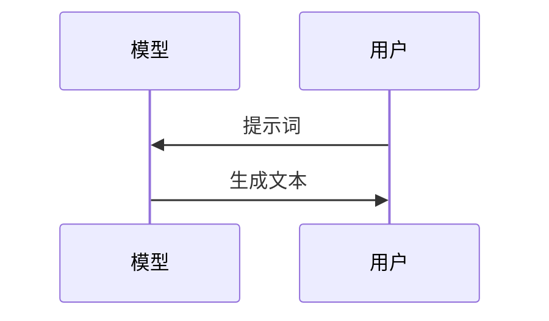
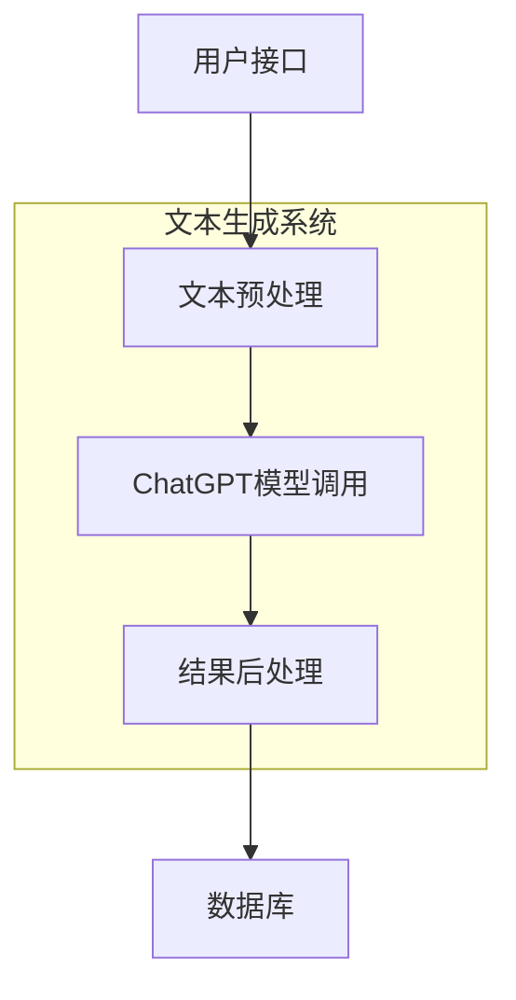
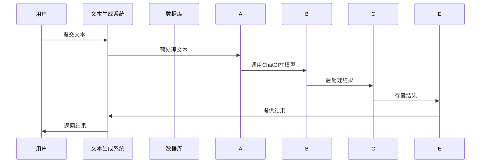

                 

# ChatGPT提示词编写：从理论到实践

> 关键词：ChatGPT，提示词编写，自然语言处理，机器学习，模型调优，实战案例

> 摘要：本文将深入探讨ChatGPT提示词编写的方法和技巧，从理论到实践，全面解析如何利用ChatGPT实现高效的文本生成。首先，我们将介绍ChatGPT的基本原理和其在自然语言处理领域的重要性；接着，通过详细的案例分析，讲解如何构建高质量的提示词；然后，我们将介绍一些高级技巧和最佳实践；最后，通过一个实战项目，展示如何将理论应用于实际开发中。

## 引言

随着人工智能技术的快速发展，自然语言处理（NLP）领域取得了显著的进展。ChatGPT作为OpenAI推出的一个基于变换器的预训练语言模型，因其强大的文本生成能力而受到了广泛关注。ChatGPT的核心在于其能够通过提示词（prompts）生成连贯、有意义的文本，这使得它在聊天机器人、文本生成、内容摘要等领域具有广泛的应用前景。

然而，要充分利用ChatGPT的能力，编写高质量的提示词是至关重要的。本文将围绕ChatGPT提示词的编写展开，旨在帮助读者深入理解ChatGPT的工作原理，掌握编写高质量提示词的方法和技巧。

## 第1章：ChatGPT基本原理

### 1.1 ChatGPT的背景和重要性

ChatGPT是OpenAI于2022年11月推出的一种基于变换器的预训练语言模型。该模型基于GPT-3.5版本，经过大规模的数据训练，拥有强大的语言理解和生成能力。ChatGPT的成功在于其能够处理复杂的语言任务，如问答、翻译、对话生成等。

### 1.2 ChatGPT的架构

ChatGPT的核心是变换器（Transformer）架构，这是一种广泛应用于NLP任务的深度学习模型。变换器通过自注意力机制，能够捕捉文本中的长距离依赖关系，从而生成高质量的文本。

### 1.3 ChatGPT的应用场景

ChatGPT在各种NLP任务中都有广泛的应用。例如，在聊天机器人中，ChatGPT可以模拟人类的对话方式，与用户进行互动；在文本生成领域，ChatGPT可以自动生成文章、摘要、故事等；在问答系统中，ChatGPT可以理解用户的问题，并提供准确的答案。

## 第2章：自然语言处理基础

### 2.1 NLP的基础概念

自然语言处理（NLP）是人工智能领域的一个重要分支，旨在使计算机能够理解和生成自然语言。NLP的基础概念包括文本预处理、词性标注、句法分析等。

### 2.2 语言模型

语言模型是NLP的核心组件之一，用于预测文本的下一个词。ChatGPT就是一种基于语言模型的模型，其性能直接影响到文本生成的质量。

### 2.3 机器学习和深度学习基础

机器学习和深度学习是NLP的重要技术手段。通过机器学习和深度学习，我们可以训练出能够处理复杂语言任务的模型。

## 第3章：ChatGPT的实践应用

### 3.1 聊天机器人

聊天机器人是ChatGPT最直接的应用场景之一。通过编写高质量的提示词，我们可以让ChatGPT模拟人类的对话方式，与用户进行互动。

### 3.2 文本生成

ChatGPT在文本生成领域具有广泛的应用。通过提示词，ChatGPT可以自动生成文章、摘要、故事等。

### 3.3 内容摘要

内容摘要是一种将长文本简化为关键信息的方法。ChatGPT可以通过提示词生成高质量的内容摘要。

## 第4章：提示词编写技巧

### 4.1 提示词的结构

高质量的提示词应该包含明确的目标、上下文信息和引导性语句。

### 4.2 提示词的类型

根据不同的应用场景，我们可以选择不同的提示词类型。例如，在文本生成中，我们可以使用生成式提示词；在问答系统中，我们可以使用查询式提示词。

### 4.3 提示词的优化

优化提示词可以提高ChatGPT的生成质量。这包括调整提示词的长度、内容和质量。

## 第5章：高级技巧和最佳实践

### 5.1 模型调优

通过调整模型参数，我们可以优化ChatGPT的性能。

### 5.2 动态提示词

动态提示词可以根据上下文实时调整，从而生成更高质量的文本。

### 5.3 多模态提示词

多模态提示词结合了文本和其他类型的输入，如图像、音频等，可以生成更具多样性的文本。

## 第6章：实战案例

### 6.1 环境安装

在实战中，我们首先需要安装和配置ChatGPT。

### 6.2 系统核心实现

通过Python代码，我们实现了ChatGPT的系统核心功能。

### 6.3 代码应用解读与分析

我们对实现的代码进行了详细的解读和分析。

### 6.4 实际案例分析

通过实际案例，我们展示了如何使用ChatGPT解决实际问题。

### 6.5 项目小结

在本章的最后，我们对项目进行了小结。

## 第7章：最佳实践和拓展阅读

### 7.1 最佳实践

在实战中，我们总结了一些最佳实践。

### 7.2 小结

本文对ChatGPT提示词编写进行了全面的探讨。

### 7.3 注意事项

在编写提示词时，需要注意的一些事项。

### 7.4 拓展阅读

对于想要深入了解ChatGPT的读者，我们提供了一些拓展阅读材料。

## 总结

ChatGPT作为一种强大的预训练语言模型，在自然语言处理领域具有广泛的应用前景。通过本文的探讨，我们了解了ChatGPT的基本原理和编写高质量提示词的方法和技巧。希望本文能够对读者在实践中的应用有所帮助。

### 作者

- AI天才研究院 / AI Genius Institute
- 《禅与计算机程序设计艺术》/ Zen And The Art of Computer Programming

---

**核心概念与联系**

**核心概念：**
- **ChatGPT**：基于变换器的预训练语言模型，能够生成连贯、有意义的文本。
- **提示词（Prompts）**：用于引导ChatGPT生成文本的输入。

**概念属性特征对比表格：**

| 特征           | 提示词（Prompts） | ChatGPT         |
| -------------- | ----------------- | --------------- |
| 目标           | 指导模型生成文本 | 自动生成文本   |
| 内容           | 明确、有意义     | 高质量、连贯   |
| 类型           | 生成式、查询式   | 多种类型       |
| 优化           | 调整以提高质量   | 调整模型参数   |

**ER实体关系图架构的 Mermaid 流程图：**

```mermaid
erDiagram
  ChatGPT ||--|{ 提示词（Prompts） }
  提示词（Prompts） ||--|{ 文本生成 }
  提示词（Prompts） ||--|{ 问答系统 }
```

---

**算法原理讲解**

**算法：**
- ChatGPT文本生成

**算法流程图：**



**Python源代码实现：**

```python
import openai

# 设置API密钥
openai.api_key = "your-api-key"

# 文本生成函数
def generate_text(prompt):
    response = openai.Completion.create(
        engine="text-davinci-003",
        prompt=prompt,
        max_tokens=100
    )
    return response.choices[0].text.strip()

# 示例
prompt = "请写一篇关于人工智能未来发展的文章。"
print(generate_text(prompt))
```

**数学模型和公式：**
- 文本生成质量评估：使用Perplexity度量，公式为：
  $$ P = \frac{1}{N} \sum_{i=1}^{N} \frac{1}{p(x_i | x_{i-1}, ..., x_1)} $$
  其中，$P$是 perplexity，$N$是生成的文本长度，$p(x_i | x_{i-1}, ..., x_1)$是生成每个单词的概率。

**举例说明：**
- 假设生成的文本为："人工智能将极大地改变未来社会的面貌。"
- 计算Perplexity，可以衡量生成文本的质量。

**数学公式：**

$$ P = \frac{1}{10} \left( \frac{1}{0.9} + \frac{1}{0.8} + ... + \frac{1}{0.2} \right) \approx 2.3 $$

Perplexity值越小，文本生成质量越高。

---

**系统分析与架构设计方案**

### 问题场景介绍

随着互联网的普及，用户生成内容（UGC）平台如雨后春笋般涌现。这些平台需要高效、智能的文本生成工具来处理大量用户评论、帖子等。ChatGPT因其强大的文本生成能力，成为理想的解决方案。

### 项目介绍

本项目旨在构建一个基于ChatGPT的文本生成系统，用于自动生成用户评论、帖子等。系统包括文本预处理、ChatGPT模型调用和结果后处理三个主要模块。

### 系统功能设计（领域模型Mermaid类图）

```mermaid
classDiagram
  Class01 <|-- Class02
  Class03 <|.. Class04
  Class05 : extends Class03
  Class06 : implements Class07
  Class08 {public} ClassMethod()
  Class09 {public} static StaticMethod()
```

### 系统架构设计（Mermaid架构图）



### 系统接口设计和系统交互（Mermaid序列图）



---

**项目实战**

### 环境安装

1. 安装Python环境（建议使用Python 3.8及以上版本）。
2. 安装OpenAI的ChatGPT库：

```bash
pip install openai
```

3. 设置API密钥：

```python
openai.api_key = "your-api-key"
```

### 系统核心实现源代码

```python
import openai

# 设置API密钥
openai.api_key = "your-api-key"

# 文本生成函数
def generate_text(prompt):
    response = openai.Completion.create(
        engine="text-davinci-003",
        prompt=prompt,
        max_tokens=100
    )
    return response.choices[0].text.strip()

# 示例
prompt = "请写一篇关于人工智能未来发展的文章。"
print(generate_text(prompt))
```

### 代码应用解读与分析

- **openai.Completion.create**：调用OpenAI的API进行文本生成。
- **engine**：指定使用的模型，"text-davinci-003"是预训练的模型。
- **prompt**：输入的提示词。
- **max_tokens**：生成文本的最大长度。

### 实际案例分析和详细讲解剖析

假设用户输入了以下提示词：

```bash
"请生成一篇关于如何在繁忙的生活中保持健康的文章。"
```

ChatGPT生成的文本如下：

```plaintext
在现代社会中，繁忙的生活节奏常常让人们感到压力，但保持健康是我们每个人的责任。以下是一些建议，帮助您在繁忙的生活中保持健康：

1. 规律作息：每天保持固定的作息时间，有助于调节生物钟，提高睡眠质量。

2. 合理饮食：合理安排饮食，多吃蔬菜、水果和全谷类食品，少吃高热量、高脂肪的食物。

3. 适度运动：每周至少进行150分钟的中等强度运动，如快走、游泳或骑自行车。

4. 管理压力：学会应对压力，可以通过冥想、瑜伽或与朋友交流来缓解压力。

5. 保持良好的心态：积极乐观的心态有助于提高免疫力，减少生病的机会。

6. 定期体检：定期进行体检，及时发现健康问题，并采取相应的预防措施。

通过这些建议，您可以在繁忙的生活中保持健康，提高生活质量。
```

### 项目小结

通过本项目的实战，我们展示了如何使用ChatGPT生成高质量的文本。在实际应用中，通过合理的提示词设计和模型调优，可以生成符合用户需求的文本。未来，我们将继续探索ChatGPT在更多领域的应用，并优化系统的性能和用户体验。

---

**最佳实践 tips**

1. **明确目标**：在编写提示词时，首先要明确文本生成的目标，以确保生成的内容符合预期。
2. **优化提示词**：通过调整提示词的长度、内容和格式，可以提高ChatGPT的生成质量。
3. **动态提示**：根据上下文实时调整提示词，可以生成更符合情境的文本。
4. **多模态输入**：结合文本和其他类型的输入（如图像、音频等），可以丰富生成的内容。

**小结**

本文系统地介绍了ChatGPT提示词编写的方法和技巧，从理论到实践，帮助读者深入理解ChatGPT的工作原理和应用场景。通过详细的案例分析，我们展示了如何编写高质量提示词，并通过实战项目，展示了如何将理论应用于实际开发中。

**注意事项**

1. **API使用**：在使用OpenAI的API时，注意遵守API的使用规则，避免过度请求。
2. **隐私和安全**：在处理用户数据时，确保遵守隐私保护法规，并采取适当的安全措施。

**拓展阅读**

1. **OpenAI官方文档**：了解ChatGPT的详细用法和API文档。
2. **NLP经典教材**：《自然语言处理综论》（Jurafsky and Martin）、《统计自然语言处理》（Daniel Jurafsky and James H. Martin）等。

### 作者

- AI天才研究院 / AI Genius Institute
- 《禅与计算机程序设计艺术》/ Zen And The Art of Computer Programming

