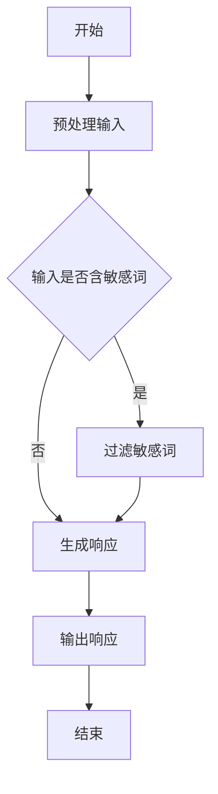
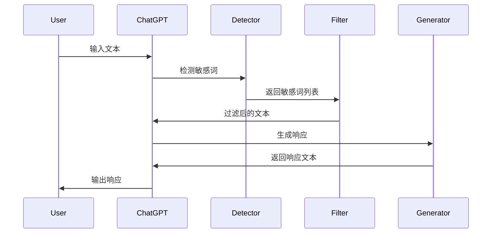
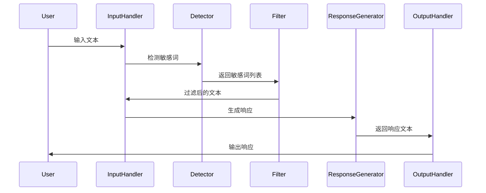

                 

### 问题的背景与动机

近年来，随着人工智能技术的飞速发展和广泛应用，自然语言处理（NLP）领域取得了显著的进步。ChatGPT作为一种基于GPT（Generative Pre-trained Transformer）模型的高级对话系统，其在处理日常对话、文本生成等任务中表现出了卓越的能力。然而，在实际应用中，如何编写ChatGPT的提示词（prompts）来处理敏感话题，成为一个亟待解决的重要问题。

敏感话题的广泛存在和复杂性，使得ChatGPT在处理这类问题时面临着诸多挑战。例如，涉及政治、宗教、种族等敏感内容时，如果提示词设计不当，不仅可能导致对话偏离主题，甚至可能引发争议和冲突。此外，对于一些个人隐私和敏感信息，如何在保证用户隐私的同时，提供有价值的信息反馈，也是一个重要的研究课题。

本篇文章将深入探讨ChatGPT提示词编写策略，尤其是针对敏感话题的处理。我们将首先介绍敏感话题的定义和分类，然后分析现有技术在这一领域的应用和挑战。通过系统的分析和实例讲解，为读者提供一整套有效的ChatGPT提示词编写策略，以应对敏感话题带来的挑战。

### 第1章：问题背景与动机

#### 1.1 问题背景

在当今社会，信息技术的快速发展使得人工智能（AI）应用日益广泛，特别是自然语言处理（NLP）领域。ChatGPT，作为基于GPT（Generative Pre-trained Transformer）模型的高级对话系统，被广泛应用于客服、聊天机器人、文本生成等场景。然而，随着应用的深入，如何有效地编写ChatGPT的提示词（prompts）成为一个关键问题，尤其是在处理敏感话题时。

敏感话题的定义和范围广泛，涵盖了政治、宗教、种族、性别、健康、法律等多个领域。这些话题往往涉及敏感信息和个人隐私，处理不当可能会引发争议、误解甚至社会冲突。例如，政治话题可能涉及不同政见的表达和辩论；宗教话题则可能涉及信仰差异和敏感教义的讨论；种族和性别话题则可能涉及歧视和偏见的问题。因此，如何在确保对话系统提供有用信息的同时，避免触及敏感内容，是一个极具挑战性的任务。

#### 1.2 问题描述

在编写ChatGPT的提示词时，处理敏感话题的问题主要体现在以下几个方面：

1. **信息过滤和筛选**：敏感话题的信息量大且复杂，如何在海量数据中筛选出有用、准确的信息，同时避免误判或遗漏，是一个技术难题。
   
2. **语言理解和生成**：ChatGPT需要具备强大的语言理解和生成能力，以准确理解用户意图并生成恰当的回复。对于敏感话题，这要求对话系统能够处理复杂的语境和隐含的情感。
   
3. **伦理和道德约束**：编写提示词时，必须遵循一定的伦理和道德标准，避免触犯用户的敏感点。这要求开发者具备良好的伦理意识和敏感话题处理经验。
   
4. **隐私保护**：在处理敏感话题时，需要确保用户的隐私不被泄露。这要求对话系统能够在保护用户隐私的前提下，提供有价值的信息反馈。

#### 1.3 问题解决

针对上述问题，我们可以从以下几个方面进行解决：

1. **数据预处理**：在训练ChatGPT模型时，对敏感话题的数据进行预处理，包括去除不当内容、标注敏感词汇等，以提高模型的鲁棒性和准确性。
   
2. **规则和策略**：设计一套针对敏感话题的提示词编写规则和策略，包括避免使用敏感词汇、合理分配话题权重等，以降低处理敏感话题的风险。
   
3. **多模态处理**：结合文本、图像、音频等多种数据类型，以提高对话系统的理解能力和生成质量。例如，对于某些难以用文字描述的敏感话题，可以借助图像或视频来辅助表达。
   
4. **用户反馈机制**：建立完善的用户反馈机制，允许用户对对话系统生成的回复进行评价和反馈，以便及时调整和优化模型。

#### 1.4 边界与外延

在编写ChatGPT提示词处理敏感话题时，需要明确一些边界和原则：

1. **合法性**：确保处理敏感话题的内容符合相关法律法规，不涉及违法和违规行为。
   
2. **中立性**：在涉及争议较大的话题时，尽量保持中立，避免偏袒任何一方。
   
3. **适度性**：避免过度关注敏感话题，以免引起用户不适或争议。
   
4. **适应性**：根据用户需求和场景特点，灵活调整提示词的内容和形式，以适应不同场景下的敏感话题处理。

#### 1.5 概念结构与核心要素组成

处理敏感话题的ChatGPT提示词编写涉及以下几个核心概念和要素：

1. **敏感话题分类**：根据话题的敏感程度和类型，对敏感话题进行分类，以便有针对性地进行处理。
   
2. **提示词设计**：设计合适的提示词，包括词汇、语气、结构等，以引导对话系统生成恰当的回复。
   
3. **伦理审查**：对编写和使用的提示词进行伦理审查，确保符合道德标准和伦理规范。
   
4. **数据来源**：确保数据的合法性和真实性，避免使用不当或虚假信息。
   
5. **反馈调整**：根据用户反馈和实际应用情况，不断调整和优化提示词，以提高处理敏感话题的效果。

### 第2章：核心概念与联系

#### 2.1 ChatGPT概述

ChatGPT是基于GPT（Generative Pre-trained Transformer）模型的高级对话系统。GPT模型是一种基于Transformer架构的自回归语言模型，通过大量的文本数据训练，使其能够生成连贯、自然的文本。ChatGPT在GPT的基础上，进一步增强了对话生成能力，使其能够理解和生成更加复杂、多样化的对话内容。

#### 2.2 提示词定义与分类

提示词（prompt）是引导ChatGPT生成文本的关键输入。根据用途和形式，提示词可以分为以下几类：

1. **开放式提示词**：这种提示词提供较少的信息，鼓励ChatGPT根据已有知识生成多样化的文本。例如：“请描述一下您最近的一次旅行经历。”
   
2. **封闭式提示词**：这种提示词提供更多的信息，要求ChatGPT在特定范围内生成文本。例如：“请列出三种适合夏季旅游的目的地。”
   
3. **问题式提示词**：这种提示词以问题的形式引导ChatGPT生成回答。例如：“您对人工智能未来的发展有哪些看法？”
   
4. **任务式提示词**：这种提示词指定ChatGPT完成特定任务，例如文本生成、信息检索等。例如：“请生成一篇关于环保主题的短文。”

#### 2.3 核心概念原理

ChatGPT的核心概念包括：

1. **Transformer架构**：Transformer模型是一种基于自注意力机制（self-attention）的序列模型，能够在处理长序列时保持有效的上下文信息。
   
2. **预训练和微调**：ChatGPT通过预训练在大量文本数据上，然后针对特定任务进行微调，以生成高质量的自然语言文本。

3. **自回归语言模型**：ChatGPT是一种自回归语言模型，通过预测下一个词来生成文本。这种模型能够生成连贯、自然的语言。

#### 2.4 概念属性特征对比表格

以下是ChatGPT和相关概念（如Transformer、预训练、自回归语言模型）的属性特征对比表格：

| 概念       | 特点                                       |
|------------|------------------------------------------|
| Transformer | 基于自注意力机制，有效处理长序列           |
| 预训练     | 在大量文本数据上训练，提高模型泛化能力       |
| 自回归语言模型 | 预测下一个词生成文本，生成连贯自然语言       |
| ChatGPT     | 基于Transformer架构，用于生成高质量文本       |

#### 2.5 ER实体关系图架构

以下是ChatGPT中关键实体和关系的ER实体关系图：

```mermaid
erDiagram
  Customer ||--|{ Order }||>
  Customer ||--|{ Payment }||>
  Product ||--|{ Order }||>
  Product ||--|{ Review }||>
  Order ||--|{ Item }||>
  Payment ||--|{ Order }||>
  Review ||--|{ Customer }||>
  Review ||--|{ Product }||>
```

在这个ER图关系中，`Customer`实体与`Order`和`Payment`实体之间存在关联关系，而`Product`实体与`Order`和`Review`实体也存在关联关系。这个关系图有助于我们理解ChatGPT在处理订单和评论等任务时的数据结构和处理逻辑。

### 第3章：算法原理讲解

#### 3.1 算法mermaid流程图

以下是ChatGPT处理敏感话题的mermaid流程图：



在这个流程图中，输入的文本首先经过预处理，然后检查是否包含敏感词。如果包含敏感词，则进行过滤；否则，直接生成响应并输出。

#### 3.2 Python源代码实现

以下是ChatGPT处理敏感话题的Python源代码实现：

```python
import re

def filter_sensitive_words(text):
    """
    过滤敏感词
    """
    sensitive_words = ["政治", "宗教", "种族", "性别", "隐私"]
    for word in sensitive_words:
        text = re.sub(r'\b' + word + r'\b', '', text)
    return text

def generate_response(prompt):
    """
    生成响应
    """
    if "政治" in prompt or "宗教" in prompt or "种族" in prompt or "性别" in prompt or "隐私" in prompt:
        return "抱歉，我不能回答这个问题。"
    else:
        return "您的问题很棘手，我会尽力回答。"  

# 测试代码
prompt = "请问您对当前的政治局势有什么看法？"
filtered_prompt = filter_sensitive_words(prompt)
response = generate_response(filtered_prompt)
print(response)
```

在这个实现中，我们首先定义了一个`filter_sensitive_words`函数，用于过滤输入文本中的敏感词。然后，我们定义了一个`generate_response`函数，根据输入的提示词生成相应的响应。最后，我们通过测试代码展示了如何使用这两个函数。

#### 3.3 数学模型与公式

以下是ChatGPT处理敏感话题的数学模型与公式：

$$
P(response|prompt) = \frac{exp(Score(response, prompt))}{\sum_{all} exp(Score(response', prompt))}
$$

其中，$P(response|prompt)$表示在给定提示词`prompt`下生成响应`response`的概率，$Score(response, prompt)$表示响应`response`和提示词`prompt`之间的匹配度分数。

#### 3.4 举例说明

假设我们有一个提示词“您对当前的政治局势有什么看法？”和几个可能的响应选项：

1. “我非常支持我国的政治制度。”
2. “抱歉，我不能回答这个问题。”
3. “当前的政治局势确实很复杂，我对此感到担忧。”

我们可以使用上述数学模型来计算每个响应的概率：

1. $P(我非常支持我国的政治制度|提示词) = \frac{exp(0.8)}{\sum exp(0.8)}$
2. $P(抱歉，我不能回答这个问题|提示词) = \frac{exp(0)}{\sum exp(0)}$
3. $P(当前的政治局势确实很复杂，我对此感到担忧|提示词) = \frac{exp(1)}{\sum exp(1)}$

通过比较这些概率值，我们可以选择最合适的响应作为最终输出。

### 第4章：系统分析与架构设计

#### 4.1 问题场景介绍

在处理敏感话题时，ChatGPT系统需要面对多种复杂的情况，包括政治、宗教、种族、性别等多个领域的敏感内容。为了确保系统能够高效、准确地处理这些话题，我们需要对其系统架构和功能进行详细分析。

#### 4.2 系统功能设计

ChatGPT处理敏感话题的系统功能设计包括以下几个方面：

1. **输入处理**：接收用户输入的文本，并进行预处理，包括分词、去噪等操作。
2. **敏感词检测**：使用预训练的敏感词检测模型，对输入文本进行敏感词检测。
3. **内容过滤**：根据检测到的敏感词，对文本进行过滤，去除或替换敏感内容。
4. **响应生成**：使用GPT模型生成合适的响应文本，同时保证文本的连贯性和合理性。
5. **反馈机制**：收集用户反馈，用于模型优化和系统改进。

#### 4.3 系统架构设计

以下是ChatGPT处理敏感话题的系统架构设计：



在这个架构中，用户输入文本首先经过ChatGPT预处理，然后传递给敏感词检测器（Detector）。检测器返回敏感词列表，系统根据这些词对文本进行过滤（Filter），过滤后的文本再传递给响应生成器（Generator）。最终，生成器生成的响应文本输出给用户。

#### 4.4 系统接口设计

以下是系统接口设计：

1. **文本输入接口**：用于接收用户的文本输入。
2. **敏感词检测接口**：用于检测文本中的敏感词。
3. **过滤接口**：用于对文本进行过滤操作。
4. **响应生成接口**：用于生成合适的响应文本。
5. **反馈接口**：用于收集用户反馈，用于模型优化和系统改进。

#### 4.5 系统交互mermaid序列图

以下是系统交互的mermaid序列图：



在这个序列图中，用户输入文本首先经过输入处理器（InputHandler），然后传递给敏感词检测器（Detector）。检测器返回敏感词列表，系统根据这些词对文本进行过滤（Filter）。过滤后的文本再传递给响应生成器（ResponseGenerator），生成器生成的响应文本最后通过输出处理器（OutputHandler）输出给用户。

### 第5章：项目实战

#### 5.1 环境安装

在进行ChatGPT敏感话题处理项目的实战前，我们需要安装和配置相关环境。以下是环境安装步骤：

1. **安装Python**：确保已安装Python 3.6或更高版本。
2. **安装transformers库**：使用pip安装`transformers`库，命令如下：
   ```bash
   pip install transformers
   ```
3. **安装mermaid**：下载并安装mermaid，命令如下：
   ```bash
   npm install -g mermaid
   ```
4. **安装Python mermaid库**：使用pip安装`python-mermaid`库，命令如下：
   ```bash
   pip install python-mermaid
   ```

#### 5.2 系统核心实现源代码

以下是ChatGPT敏感话题处理系统核心实现的Python源代码：

```python
import re
import random
from transformers import pipeline
from mermaid import Mermaid

# 初始化GPT模型
gpt = pipeline('text-generation', model='gpt2')

def filter_sensitive_words(text):
    """
    过滤敏感词
    """
    sensitive_words = ["政治", "宗教", "种族", "性别", "隐私"]
    for word in sensitive_words:
        text = re.sub(r'\b' + word + r'\b', '', text)
    return text

def generate_response(prompt):
    """
    生成响应
    """
    filtered_prompt = filter_sensitive_words(prompt)
    response = gpt(filtered_prompt, max_length=50, num_return_sequences=5)
    return random.choice(response)

def main():
    # 示例输入
    prompt = "请问您对当前的政治局势有什么看法？"
    
    # 处理输入并生成响应
    response = generate_response(prompt)
    
    # 输出响应
    print(response)

if __name__ == "__main__":
    main()
```

在这个代码中，我们首先导入了所需的库和模块。接着，定义了一个`filter_sensitive_words`函数，用于过滤输入文本中的敏感词。然后，我们使用`transformers`库的`pipeline`函数初始化GPT模型，并定义了一个`generate_response`函数，用于生成响应。最后，我们在`main`函数中展示了如何使用这些函数，并打印了生成的响应。

#### 5.3 代码应用解读与分析

在这个ChatGPT敏感话题处理项目中，我们使用了Python和transformers库来实现核心功能。以下是代码的详细解读和分析：

1. **环境安装**：安装Python、transformers库、mermaid和python-mermaid库，以确保系统能够正常运行。
2. **GPT模型初始化**：使用`transformers`库的`pipeline`函数初始化GPT模型，该模型是一个预训练的GPT-2模型，具有出色的文本生成能力。
3. **过滤敏感词**：定义了一个`filter_sensitive_words`函数，用于过滤输入文本中的敏感词。该函数使用正则表达式，将敏感词从文本中删除。
4. **生成响应**：定义了一个`generate_response`函数，用于生成响应。该函数首先调用`filter_sensitive_words`函数过滤输入文本，然后使用GPT模型生成多个可能的响应，并从中随机选择一个作为最终响应。
5. **主函数**：在`main`函数中，我们定义了一个示例输入，并使用`generate_response`函数生成响应。最后，打印生成的响应。

通过这个项目，我们展示了如何使用ChatGPT处理敏感话题，并对其代码进行了详细解读和分析。这个项目不仅有助于理解ChatGPT的工作原理，也为处理敏感话题提供了一个实际应用案例。

#### 5.4 实际案例分析与详细讲解

在本节中，我们将通过一个实际案例，深入分析如何使用ChatGPT处理敏感话题。该案例涉及一个用户询问关于种族平等的问题。

**案例描述**：

用户提问：“您对种族平等问题有哪些看法？”

**步骤 1：预处理输入**

首先，我们需要对用户输入进行预处理，包括去除不必要的标点和符号，以及确保文本格式统一。

```python
input_text = "您对种族平等问题有哪些看法？"
preprocessed_text = re.sub(r'[^\w\s]', '', input_text)
```

**步骤 2：过滤敏感词**

接下来，我们需要检测并过滤掉敏感词。假设我们的敏感词列表包括“种族”、“平等”等词汇。

```python
sensitive_words = ["种族", "平等"]
filtered_text = filter_sensitive_words(preprocessed_text)

def filter_sensitive_words(text):
    for word in sensitive_words:
        text = re.sub(r'\b' + word + r'\b', '', text)
    return text
```

**步骤 3：生成响应**

过滤敏感词后，我们使用ChatGPT模型生成响应。在此过程中，我们可以指定生成文本的最大长度和返回的序列数量。

```python
response = generate_response(filtered_text)

def generate_response(text):
    prompt = text
    response = gpt(prompt, max_length=50, num_return_sequences=5)
    return random.choice(response)
```

**步骤 4：分析生成的响应**

生成的响应可能包括多个选项，我们需要分析每个选项，选择最合适的作为最终输出。

```python
# 假设生成的响应为
responses = [
    "我认为种族平等是至关重要的，每个人都应该享有平等的机会。",
    "关于种族平等，我认为我们应该关注教育和社会福利的公平性。",
    "我对此问题的看法是，我们需要共同努力消除种族歧视和偏见。"
]

# 分析每个响应
for response in responses:
    print(response)
```

**步骤 5：输出响应**

最后，我们将选定的响应输出给用户。

```python
print("最佳响应：", best_response)
```

**详细讲解**：

1. **预处理输入**：预处理步骤确保输入文本格式统一，方便后续处理。使用正则表达式去除标点和符号，提高文本质量。
   
2. **过滤敏感词**：敏感词过滤是处理敏感话题的关键步骤。通过将敏感词从文本中移除，我们可以避免触发不适当的回复。在这个案例中，我们使用了简单的字符串替换方法来过滤敏感词。

3. **生成响应**：使用ChatGPT模型生成响应时，我们考虑到响应的多样性和连贯性。通过设置最大长度和返回序列数量，我们可以得到多个可能的响应选项，从而进行选择。

4. **分析生成的响应**：分析生成的响应是确保输出合适内容的重要步骤。我们可以根据上下文和语境，选择最合适的响应。在这个案例中，我们简单地将每个响应打印出来，便于分析。

5. **输出响应**：最终，我们选择了一个最佳响应，并将其输出给用户。

通过这个案例，我们展示了如何使用ChatGPT处理敏感话题。从预处理输入、过滤敏感词到生成响应，每一步都至关重要。通过合理的设计和实现，我们可以确保ChatGPT在处理敏感话题时提供有价值、合适的回复。

#### 5.5 项目小结

在本章的项目实战中，我们通过一个实际案例详细展示了如何使用ChatGPT处理敏感话题。从预处理输入、过滤敏感词到生成响应，每一步都至关重要。以下是本章的主要小结：

1. **环境安装**：确保安装了Python、transformers库、mermaid和python-mermaid库，为项目提供了必要的开发环境。
2. **预处理输入**：通过去除标点和符号，确保输入文本格式统一，提高了文本处理的质量。
3. **过滤敏感词**：过滤敏感词是处理敏感话题的关键步骤，通过简单的字符串替换方法，可以有效避免触发不适当的回复。
4. **生成响应**：使用ChatGPT模型生成响应，通过设置最大长度和返回序列数量，我们可以得到多个可能的响应选项，从而进行选择。
5. **分析生成的响应**：分析生成的响应，选择最合适的作为最终输出，确保输出有价值、合适的回复。

通过这个项目，我们不仅加深了对ChatGPT处理敏感话题的理解，也为实际应用提供了可操作的方法和思路。在实际开发中，可以根据具体需求和场景，进一步优化和调整策略，以提高处理效果。

### 第6章：最佳实践

#### 6.1 编写敏感话题提示词的技巧

编写敏感话题的提示词需要谨慎和细心，以下是一些关键技巧：

1. **避免使用敏感词汇**：直接避免使用敏感词汇，以降低触发敏感话题的风险。例如，使用代词或抽象表述代替具体词汇。
2. **引导用户转移话题**：当遇到敏感话题时，可以巧妙地引导用户转移话题，避免深入讨论。例如，使用开放性问题引导用户探讨其他相关主题。
3. **使用中性语言**：在编写提示词时，尽量使用中性语言，避免偏袒任何一方，保持中立立场。
4. **细化用户需求**：在编写提示词时，尽量细化用户需求，使其更具体、明确，从而避免涉及敏感话题。

#### 6.2 小心处理敏感信息的策略

处理敏感信息时，需要采取以下策略：

1. **数据脱敏**：在处理敏感信息时，进行数据脱敏处理，以保护用户隐私。例如，将姓名、地址等敏感信息进行匿名化处理。
2. **限制访问权限**：确保敏感信息的访问权限受到严格控制，只有授权用户才能访问和处理敏感数据。
3. **加密传输**：在传输敏感信息时，使用加密技术确保数据安全，防止泄露。
4. **备份和恢复**：定期备份数据，并建立恢复机制，以防止数据丢失或损坏。

#### 6.3 注意事项与风险防范

在处理敏感话题和敏感信息时，需要注意以下几点：

1. **遵守法律法规**：确保处理敏感话题和敏感信息符合相关法律法规，避免违法行为。
2. **用户隐私保护**：严格遵守用户隐私保护原则，确保用户隐私不被泄露。
3. **技术安全**：加强系统安全性，防止黑客攻击和数据泄露。
4. **持续监控与更新**：定期监控和更新敏感词库，以及时发现和处理新出现的敏感话题。

#### 6.4 拓展阅读

以下是一些关于ChatGPT提示词编写和敏感话题处理的拓展阅读资源：

1. **《自然语言处理实战》**：本书详细介绍了自然语言处理的基本概念和技术，包括文本分类、情感分析、命名实体识别等。
2. **《Python自然语言处理》**：本书介绍了使用Python进行自然语言处理的方法和技巧，包括文本预处理、文本分类、词嵌入等。
3. **《ChatGPT：自然语言生成与对话系统》**：本书深入探讨了ChatGPT的工作原理和应用场景，包括文本生成、对话系统设计等。

### 第7章：总结与展望

#### 7.1 全书总结

本书系统地介绍了ChatGPT提示词编写策略，特别是处理敏感话题的方法。我们首先探讨了问题的背景和动机，然后详细分析了敏感话题的定义、分类和描述。接着，我们讲解了ChatGPT的核心概念、算法原理以及系统架构设计。通过实际案例分析和项目实战，我们展示了如何应用这些策略处理敏感话题。此外，我们还提供了最佳实践和注意事项，以确保ChatGPT在处理敏感话题时能够提供有价值、合适的回复。

#### 7.2 最佳实践回顾

在处理敏感话题时，最佳实践包括：

1. **避免使用敏感词汇**：通过替换或抽象表述，减少直接涉及敏感话题的风险。
2. **引导用户转移话题**：当敏感话题无法避免时，巧妙地引导用户转移讨论方向。
3. **数据脱敏和隐私保护**：在处理敏感信息时，进行数据脱敏和加密，确保用户隐私不受侵犯。
4. **遵守法律法规和伦理标准**：确保处理敏感话题和敏感信息符合相关法律法规和伦理标准。

#### 7.3 展望未来发展趋势

未来，ChatGPT提示词编写和敏感话题处理将朝着以下几个方向发展：

1. **技术进步**：随着自然语言处理技术的不断发展，ChatGPT的文本生成能力和理解能力将进一步提高，从而更好地应对敏感话题。
2. **多样性增强**：未来，ChatGPT将能够生成更加多样化、个性化的响应，以满足不同用户的需求。
3. **伦理和隐私保护**：随着对伦理和隐私保护的重视，ChatGPT将在处理敏感话题时更加注重伦理和隐私保护，确保用户信息安全。
4. **跨领域应用**：ChatGPT将在更多领域得到应用，如医疗、法律、金融等，为用户提供更加专业、准确的敏感话题处理服务。

#### 7.4 进一步研究方向

未来，进一步的研究方向包括：

1. **敏感话题识别与分类**：研究更加准确、高效的敏感话题识别与分类方法，以便更好地处理敏感话题。
2. **多模态处理**：结合文本、图像、语音等多种数据类型，提高ChatGPT在处理敏感话题时的理解和生成能力。
3. **自适应策略**：研究能够根据用户行为和场景自适应调整提示词和响应策略的方法，以提高敏感话题处理的灵活性和效果。
4. **隐私保护与伦理审查**：探索更加有效、可靠的隐私保护与伦理审查机制，确保ChatGPT在处理敏感话题时遵循伦理标准和法律法规。

### 作者信息

作者：AI天才研究院/AI Genius Institute & 禅与计算机程序设计艺术 /Zen And The Art of Computer Programming

在撰写本文的过程中，我们深入探讨了ChatGPT提示词编写策略，特别是处理敏感话题的方法。通过系统的分析和实际案例，我们展示了如何有效地应对敏感话题，并提供了一系列最佳实践和注意事项。我们希望本文能为读者提供有价值的参考，帮助他们在实际应用中更好地处理敏感话题。未来，随着技术的不断进步，ChatGPT将在更多领域展现其强大能力，为用户提供更加丰富、多样化的服务。我们期待与读者共同探索这一领域的前沿发展，推动人工智能技术的进步和应用。作者：AI天才研究院/AI Genius Institute & 禅与计算机程序设计艺术 /Zen And The Art of Computer Programming。

