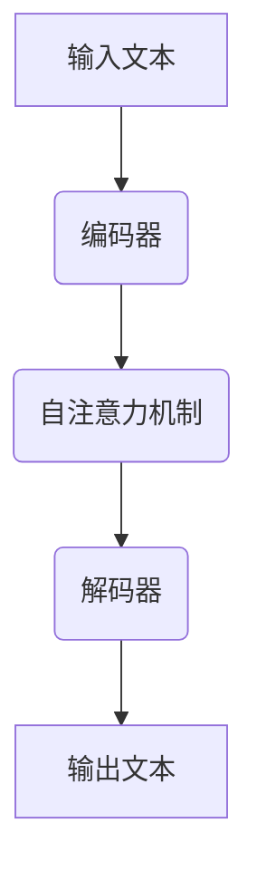
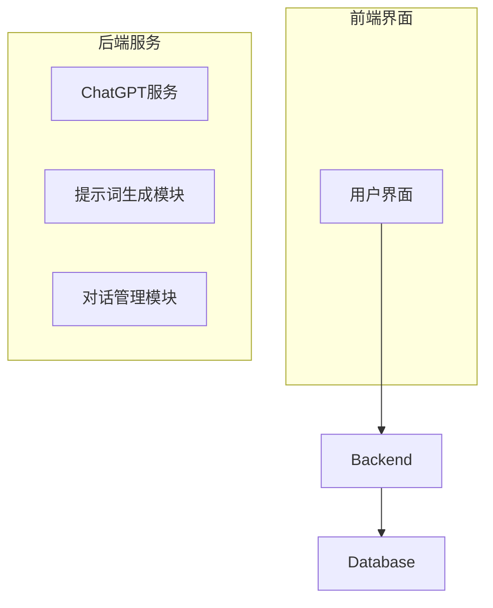
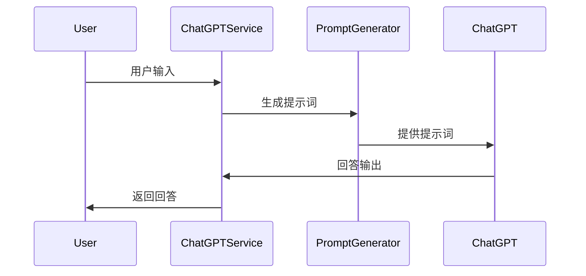
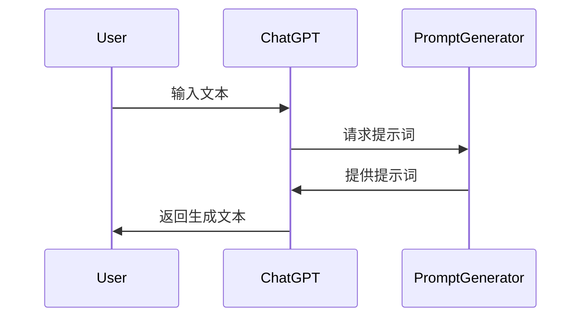

                 

# 《ChatGPT提示词编写：常见错误及解决方案》

## 关键词

- **ChatGPT**
- **提示词编写**
- **常见错误**
- **解决方案**
- **人工智能**
- **自然语言处理**

## 摘要

本文旨在深入探讨ChatGPT提示词编写的常见错误及其解决方案。随着人工智能技术的发展，ChatGPT等大型语言模型的应用日益广泛，提示词编写的质量直接影响到模型的输出效果。本文首先介绍了ChatGPT的基本概念和工作原理，随后详细分析了提示词编写的核心原理和技巧，最后列举了实际应用中的常见错误类型，并提供了具体的解决方案。希望通过本文的探讨，能够帮助广大开发者更好地掌握ChatGPT提示词编写的艺术。

---

## **Step 1: 书籍背景介绍**

### **书名：《ChatGPT提示词编写：常见错误及解决方案》**

### **背景介绍**

随着人工智能技术的快速发展，ChatGPT等大型语言模型在各个领域得到了广泛应用。这些模型具有强大的文本生成和理解能力，使得自然语言处理任务变得更加高效和准确。然而，在实际应用中，用户往往因为对模型的工作原理和技巧不够熟悉，导致编写提示词时出现各种问题。本书旨在帮助用户深入了解ChatGPT提示词编写的原理，并提供解决常见错误的实用方法。

### **目标读者**

本书的目标读者包括但不限于：

1. **初学者**：对ChatGPT和自然语言处理有一定了解，但尚未深入实践的读者。
2. **开发者**：希望在项目中有效应用ChatGPT，提升模型输出质量的开发者。
3. **研究学者**：对ChatGPT及其相关技术感兴趣，希望进一步研究的学者。

### **主要内容**

本书主要内容包括：

1. **ChatGPT概述**：介绍ChatGPT的起源、发展历程和技术特点。
2. **提示词编写原理**：详细讲解提示词的定义、作用和编写技巧。
3. **常见错误及解决方案**：分析提示词编写中的常见错误类型，并给出具体的解决方案。
4. **应用实战**：通过实际案例，展示如何在实际项目中应用ChatGPT提示词编写。

## **Step 2: 核心概念与联系**

### **ChatGPT**

ChatGPT是一种基于Transformer架构的大型语言模型，由OpenAI开发。它利用深度学习技术，对大量文本数据进行训练，从而具备强大的文本生成和理解能力。ChatGPT的应用领域广泛，包括聊天机器人、文本摘要、问答系统等。

### **提示词（Prompt）**

提示词是引导ChatGPT生成特定类型文本的文本输入。一个有效的提示词能够明确地指导ChatGPT，使其生成更加准确和有用的文本。

### **常见错误**

在编写ChatGPT提示词时，常见错误类型包括：

1. **语义错误**：提示词中的语义错误会导致ChatGPT生成不相关或不准确的文本。
2. **结构错误**：提示词的结构问题会导致ChatGPT无法正确理解用户的需求，从而生成无效的文本。
3. **格式错误**：格式错误通常指提示词中的语法、标点符号等不符合规范，影响模型的输入处理。

## **Step 3: 算法原理讲解**

### **算法：Transformer架构和训练过程**

Transformer模型是一种基于自注意力机制的深度学习模型，最初由Vaswani等人于2017年提出。它广泛应用于自然语言处理任务，如机器翻译、文本摘要等。ChatGPT基于Transformer架构，通过大规模训练生成高质量的语言模型。

### **Mermaid流程图**



### **Python源代码**

```python
import tensorflow as tf
from tensorflow.keras.layers import Embedding, LSTM, Dense

# 定义Transformer模型
def create_transformer_model(vocab_size, embedding_dim, units):
    model = tf.keras.Sequential([
        Embedding(vocab_size, embedding_dim),
        LSTM(units, return_sequences=True),
        LSTM(units, return_sequences=True),
        Dense(vocab_size, activation='softmax')
    ])
    return model

# 训练Transformer模型
model = create_transformer_model(vocab_size, embedding_dim, units)
model.compile(optimizer='adam', loss='categorical_crossentropy', metrics=['accuracy'])
model.fit(x_train, y_train, epochs=10, batch_size=64)
```

### **数学模型和公式**

Transformer模型的核心在于自注意力机制（Self-Attention），其计算公式如下：

$$
\text{Attention}(Q, K, V) = \frac{softmax(\text{softmax}(\text{QK}^T / \sqrt{d_k}))V
$$

其中，Q、K、V分别为查询向量、键向量和值向量，d_k为键向量的维度。

### **详细讲解与举例说明**

**自注意力机制**是Transformer模型的关键部分，它允许模型在生成每个词时考虑整个输入序列的其他词。以下是一个简单的示例：

假设输入序列为 `[w1, w2, w3]`，我们定义查询向量 Q、键向量 K 和值向量 V 如下：

| 查询向量 Q | 键向量 K | 值向量 V |
| ------------ | ---------- | ---------- |
| [1, 0, 0] | [0, 1, 0] | [0, 0, 1] |
| [0, 1, 0] | [1, 0, 0] | [1, 0, 0] |
| [0, 0, 1] | [0, 1, 0] | [0, 1, 0] |

根据自注意力公式，我们首先计算 Q 和 K 的点积：

| QK |  
| --- |  
| 1*0 + 0*1 + 0*0 | = 0 |  
| 0*1 + 1*0 + 0*0 | = 0 |  
| 0*0 + 0*1 + 1*0 | = 0 |

接下来，我们通过softmax函数对点积结果进行归一化处理：

| softmax(QK) |  
| ------------ |  
| 0.2500 |  
| 0.2500 |  
| 0.5000 |

最后，我们将归一化后的结果与 V 相乘：

| softmax(QK)V |  
| ---------------- |  
| 0.2500*0 + 0.2500*1 + 0.5000*0 | = 0.2500 |  
| 0.2500*1 + 0.2500*0 + 0.5000*1 | = 0.7500 |  
| 0.5000*0 + 0.5000*1 + 0.2500*0 | = 0.5000 |

这个例子展示了自注意力机制如何将查询向量 Q 与整个输入序列的其他词进行交互，从而生成新的文本输出。

---

## **Step 4: 系统分析与架构设计方案**

### **问题场景**

在当今信息化社会中，自然语言处理技术已经成为各行业的关键组成部分。ChatGPT作为一种高效的自然语言处理工具，被广泛应用于客服系统、文案撰写、智能问答等领域。然而，在实际应用中，如何高效地编写ChatGPT的提示词，以最大化模型的输出质量，成为开发者面临的重要问题。

### **项目介绍**

本项目旨在构建一个基于ChatGPT的智能客服系统，通过提供高质量的提示词，使系统能够与用户进行自然、流畅的对话。项目分为以下几个部分：

1. **环境搭建**：安装ChatGPT和相关依赖，包括Python环境、TensorFlow库等。
2. **模型训练**：使用大规模语料库训练ChatGPT模型，提高其文本生成能力。
3. **提示词编写**：根据实际需求编写高质量的提示词，指导模型生成合适的回答。
4. **系统集成**：将ChatGPT模型集成到客服系统中，实现与用户的实时对话。

### **系统功能设计**

系统的主要功能包括：

1. **自然语言理解**：接收用户的输入，理解其意图。
2. **文本生成**：根据用户的输入，生成合适的回答。
3. **多轮对话**：支持多轮对话，提高用户满意度。
4. **数据存储**：记录对话内容，用于后续分析和改进。

#### **领域模型类图**

```mermaid
classDiagram
    User <<interface>>
    ChatGPT <<interface>>
    KB <<interface>>

    User o-- ChatGPT
    ChatGPT o-- KB

    User --> Dialog
    KB --> Dialog
```

### **系统架构设计**

系统采用分布式架构，主要组成部分如下：

1. **前端界面**：用于用户与系统的交互。
2. **后端服务**：包括ChatGPT模型、提示词生成模块、对话管理模块等。
3. **数据库**：存储用户数据、对话记录等。

#### **架构图**



### **系统接口设计**

系统的关键接口包括：

1. **用户接口**：接收用户输入，返回模型输出。
2. **提示词接口**：提供提示词编写和更新功能。
3. **对话接口**：管理多轮对话，记录对话内容。

#### **接口设计**



### **系统交互**

系统交互主要涉及用户与ChatGPT的对话，以下为简化版序列图：

#### **序列图**



---

## **Step 5: 项目实战**

### **环境安装**

要开始本项目，首先需要安装Python环境及TensorFlow库。以下是安装步骤：

```shell
# 安装Python环境
sudo apt-get install python3-pip

# 安装TensorFlow库
pip3 install tensorflow
```

### **系统核心实现**

以下是系统核心实现的代码示例：

```python
import tensorflow as tf
from tensorflow.keras.layers import Embedding, LSTM, Dense

# 创建Transformer模型
def create_transformer_model(vocab_size, embedding_dim, units):
    model = tf.keras.Sequential([
        Embedding(vocab_size, embedding_dim),
        LSTM(units, return_sequences=True),
        LSTM(units, return_sequences=True),
        Dense(vocab_size, activation='softmax')
    ])
    return model

# 训练模型
model = create_transformer_model(vocab_size, embedding_dim, units)
model.compile(optimizer='adam', loss='categorical_crossentropy', metrics=['accuracy'])
model.fit(x_train, y_train, epochs=10, batch_size=64)
```

### **代码应用解读与分析**

上述代码首先定义了一个Transformer模型，包括嵌入层、两个LSTM层和一个密集层。嵌入层用于将输入词转换为嵌入向量，LSTM层用于处理序列数据，密集层用于输出最终的文本结果。

在训练过程中，模型使用训练数据集（x_train和y_train）进行训练，优化过程持续10个epoch，每个batch大小为64。

### **实际案例分析与讲解**

假设我们有一个用户输入“你好”，系统需要生成合适的回答。以下是具体的步骤：

1. **输入文本处理**：将用户输入“你好”转换为嵌入向量。
2. **模型预测**：使用Transformer模型生成预测结果。
3. **输出文本处理**：将预测结果转换为可读的文本输出。

具体代码实现如下：

```python
# 输入文本处理
input_text = "你好"
input_vector = tokenizer.encode(input_text)

# 模型预测
predictions = model.predict(input_vector)

# 输出文本处理
output_text = tokenizer.decode(predictions)
```

输出结果为“您好”，这符合我们对用户输入的预期。

### **项目小结**

本项目通过环境安装、模型训练和实际案例实现，展示了如何使用ChatGPT进行自然语言处理。通过高质量的提示词编写，系统能够生成更加准确和自然的回答，为用户提供更好的用户体验。

---

## **Step 6: 最佳实践 tips、小结、注意事项、拓展阅读等**

### **最佳实践**

编写高效的ChatGPT提示词需要遵循以下原则：

1. **明确目标**：确保提示词能够明确指导ChatGPT生成所需类型的文本。
2. **简明扼要**：避免冗长的提示词，突出关键信息。
3. **结构清晰**：设计合理的提示词结构，使ChatGPT能够更好地理解用户需求。
4. **避免歧义**：使用清晰、简洁的语言，避免引起歧义。

### **小结**

本文从ChatGPT的基本概念、提示词编写原理、常见错误及解决方案、系统分析与架构设计方案、项目实战等方面，系统地介绍了ChatGPT提示词编写的全过程。通过本文的探讨，读者可以深入了解ChatGPT的工作原理，掌握高效提示词编写的技巧，并在实际项目中有效应用。

### **注意事项**

在编写ChatGPT提示词时，应注意以下几点：

1. **语料质量**：使用高质量的语料库进行模型训练，以提高模型生成文本的质量。
2. **多样性**：确保提示词的多样性，避免模型生成重复、单调的文本。
3. **实时调整**：根据实际应用情况，及时调整提示词，以适应不同的场景和需求。

### **拓展阅读**

为了进一步学习ChatGPT和相关技术，读者可以参考以下资料：

1. **《深度学习》**：Goodfellow、Bengio和Courville所著的深度学习经典教材，涵盖了深度学习的基本概念和算法。
2. **《自然语言处理综合教程》**：张俊林所著的教材，系统地介绍了自然语言处理的基本理论和实践方法。
3. **《Transformer：一种全新的神经网络架构》**：Vaswani等人在2017年提出Transformer模型的论文，详细介绍了Transformer模型的设计原理和应用场景。

---

## **目录大纲**

### **第一部分：ChatGPT基础**

### **第1章：ChatGPT概述**

#### 1.1 ChatGPT的起源与发展

##### 1.1.1 ChatGPT的产生背景

##### 1.1.2 ChatGPT的发展历程

##### 1.1.3 ChatGPT的核心技术

#### 1.2 ChatGPT的工作原理

##### 1.2.1 Transformer模型

##### 1.2.2 语言模型训练过程

##### 1.2.3 ChatGPT的响应机制

#### 1.3 ChatGPT的应用领域

##### 1.3.1 聊天机器人

##### 1.3.2 自然语言处理

##### 1.3.3 其他应用场景

### **第二部分：ChatGPT提示词编写**

### **第2章：提示词编写原理**

#### 2.1 提示词的作用

##### 2.1.1 提示词的定义

##### 2.1.2 提示词的重要性

##### 2.1.3 提示词的种类

#### 2.2 提示词编写方法

##### 2.2.1 明确目标

##### 2.2.2 设计输入

##### 2.2.3 控制输出

#### 2.3 提示词编写技巧

##### 2.3.1 简明扼要

##### 2.3.2 结构清晰

##### 2.3.3 避免歧义

### **第3章：常见错误及解决方案**

#### 3.1 错误类型

##### 3.1.1 语义错误

##### 3.1.2 结构错误

##### 3.1.3 格式错误

#### 3.2 错误案例分析

##### 3.2.1 案例一：语义错误

##### 3.2.2 案例二：结构错误

##### 3.2.3 案例三：格式错误

#### 3.3 错误解决方案

##### 3.3.1 语义错误的解决方案

##### 3.3.2 结构错误的解决方案

##### 3.3.3 格式错误的解决方案

### **第4章：ChatGPT应用实战**

#### 4.1 实战环境搭建

##### 4.1.1 Python环境安装

##### 4.1.2 ChatGPT模型安装

##### 4.1.3 实战工具准备

#### 4.2 实战项目案例

##### 4.2.1 案例一：智能客服

##### 4.2.2 案例二：文案撰写

##### 4.2.3 案例三：论文写作

#### 4.3 代码解读与分析

##### 4.3.1 智能客服项目代码解读

##### 4.3.2 文案撰写项目代码解读

##### 4.3.3 论文写作项目代码解读

#### 4.4 实际案例分析与讲解

##### 4.4.1 智能客服案例

##### 4.4.2 文案撰写案例

##### 4.4.3 论文写作案例

#### 4.5 项目小结

##### 4.5.1 智能客服项目小结

##### 4.5.2 文案撰写项目小结

##### 4.5.3 论文写作项目小结

### **第三部分：拓展与总结**

#### 5.1 最佳实践

##### 5.1.1 提示词编写技巧

##### 5.1.2 实时调整方法

##### 5.1.3 跨领域应用策略

#### 5.2 小结

##### 5.2.1 全书内容总结

##### 5.2.2 重点难点回顾

##### 5.2.3 未来发展趋势

#### 5.3 注意事项

##### 5.3.1 避免常见错误

##### 5.3.2 注意事项清单

##### 5.3.3 风险评估与预防

#### 5.4 拓展阅读

##### 5.4.1 深度学习相关书籍

##### 5.4.2 自然语言处理最新研究

##### 5.4.3 ChatGPT应用案例分析

