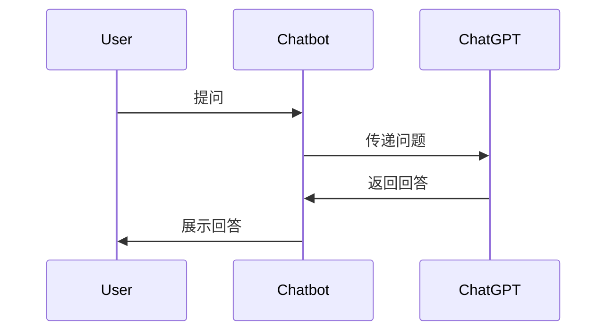
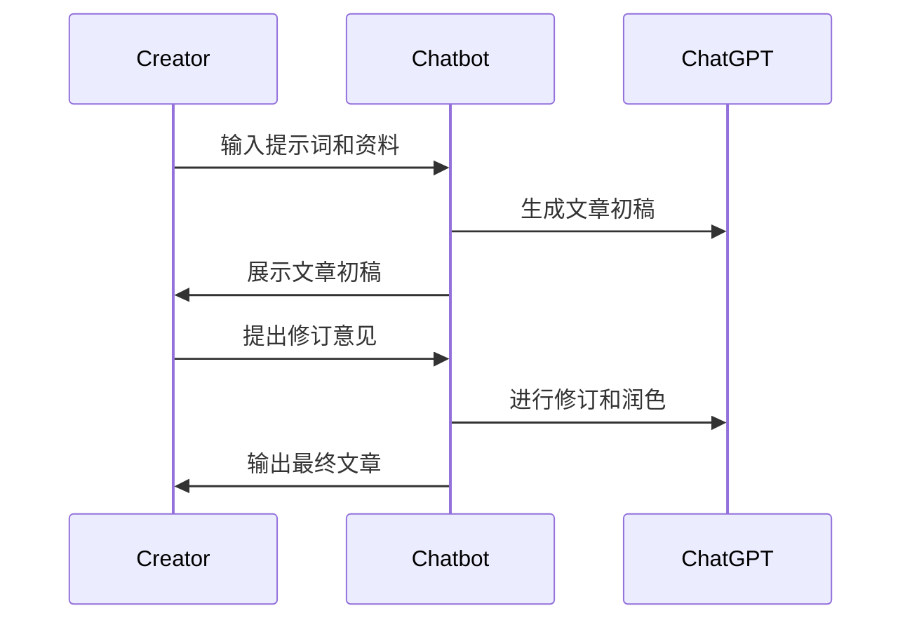
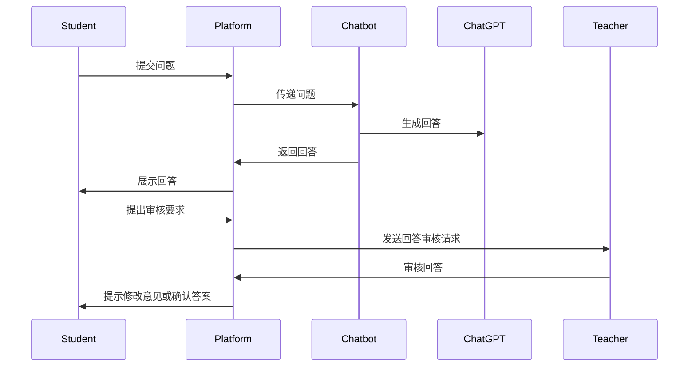
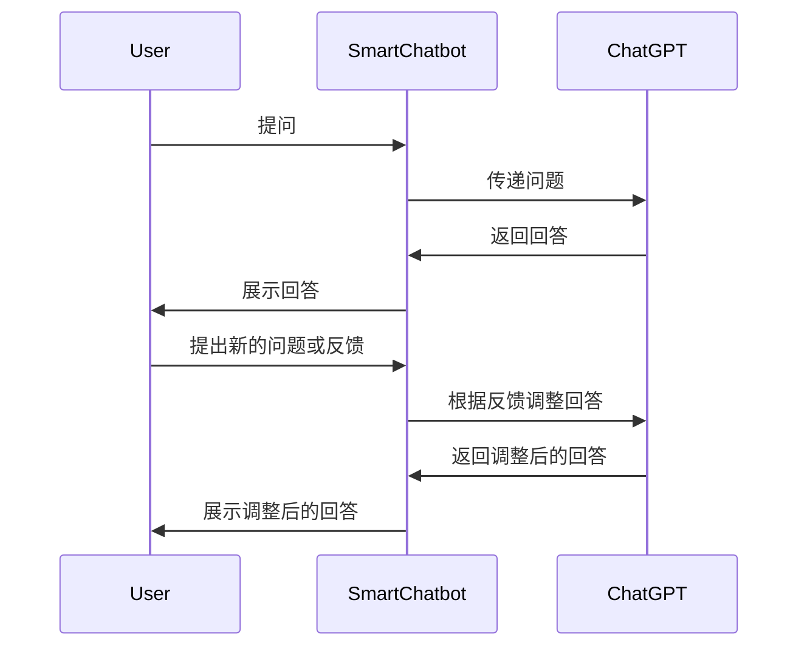
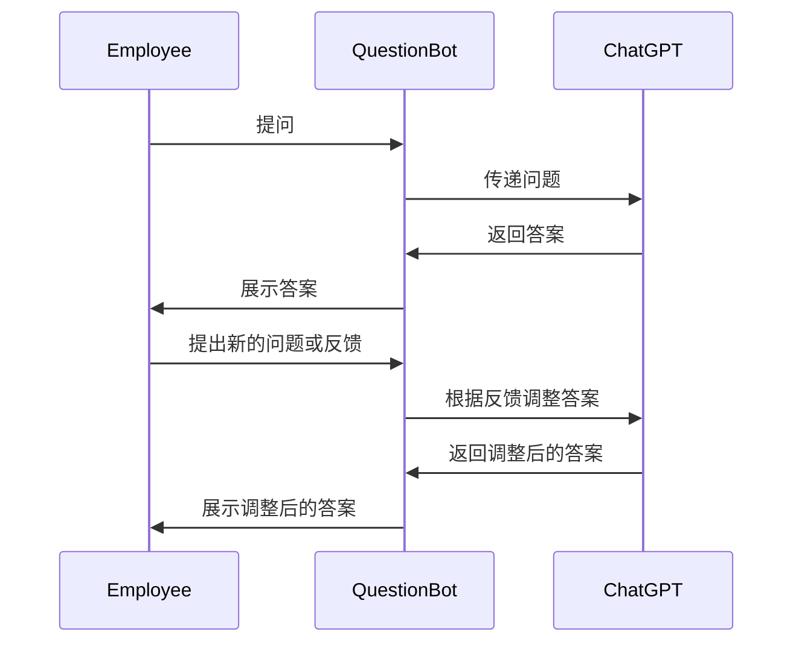
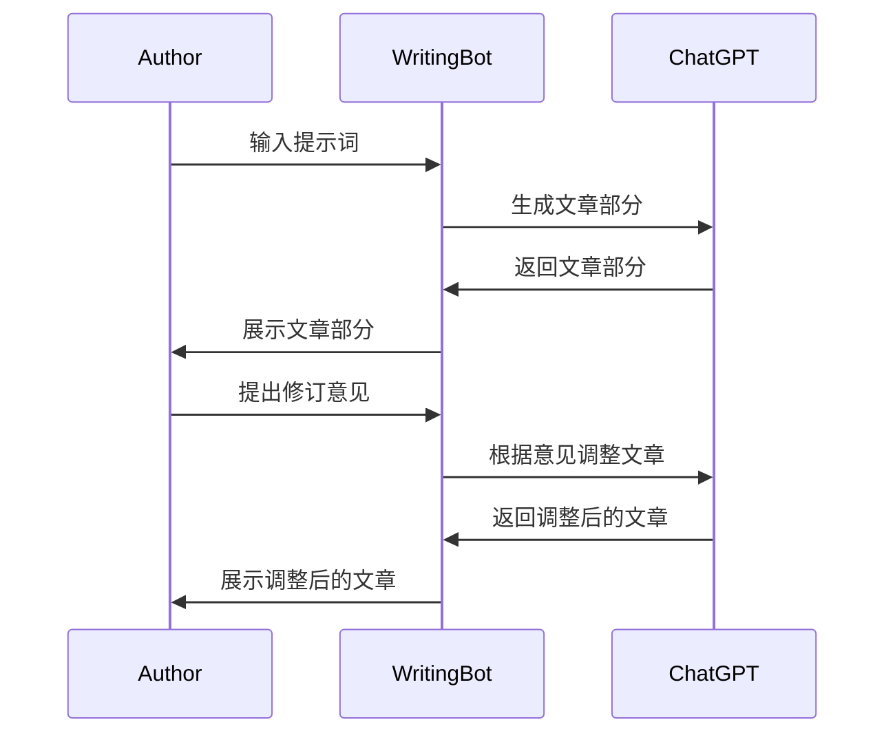
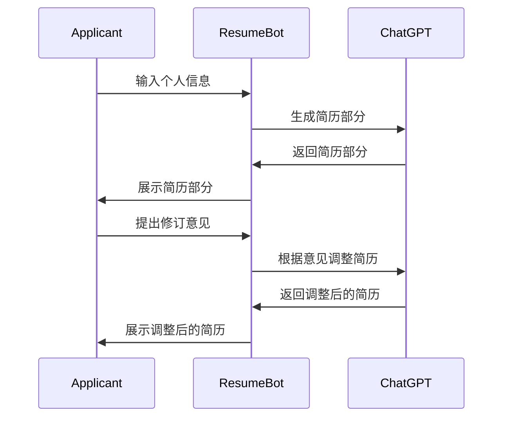
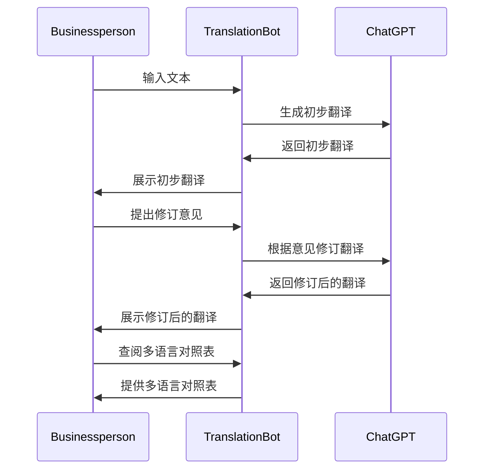
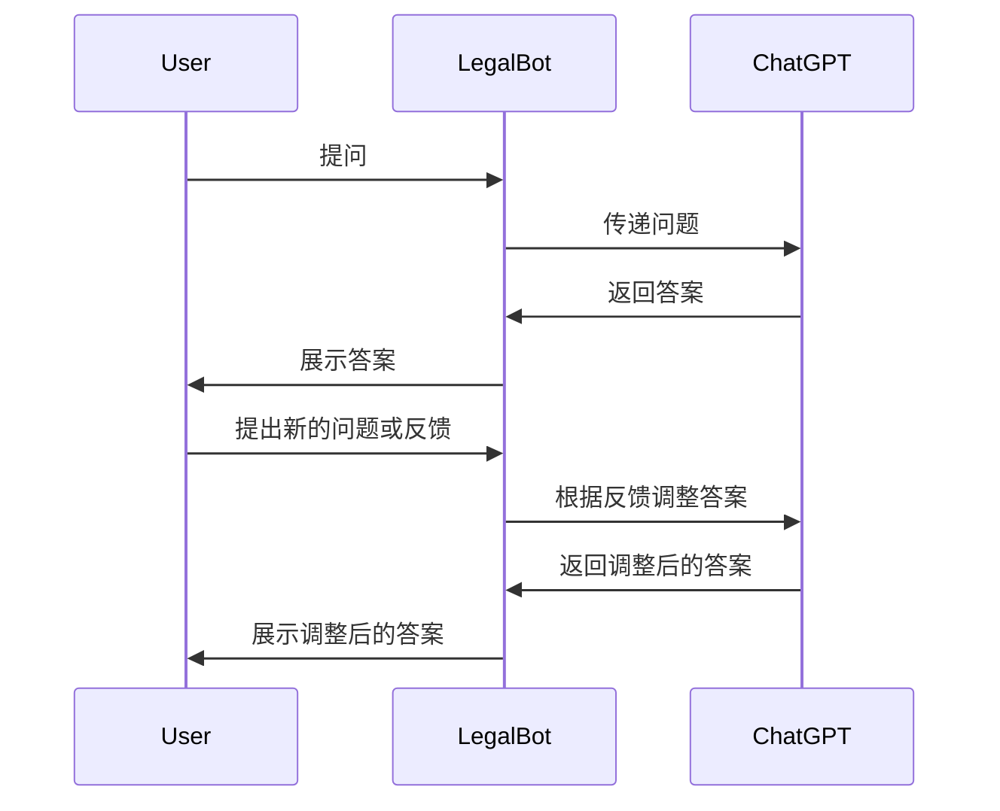
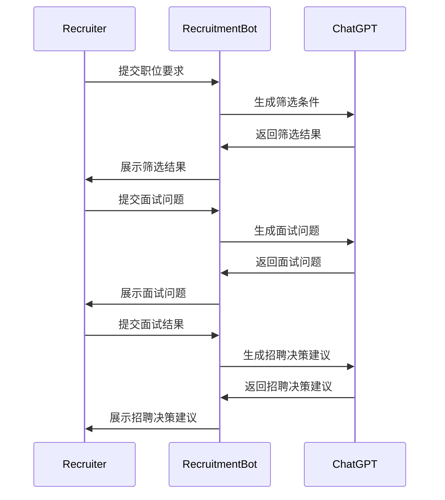

                 

### 第一部分：背景介绍

#### 1.1 问题背景

在当今快速发展的AI领域，自然语言处理（NLP）已成为一项关键技术。ChatGPT作为OpenAI推出的基于GPT-3的聊天机器人模型，受到了广泛关注。编写高质量的ChatGPT提示词，成为实现高效对话生成的重要环节。然而，面对复杂多样的场景，很多从业者面临着如何编写高质量提示词的挑战。这直接影响到ChatGPT的回答质量和用户体验。

**问题描述**：
- 提示词编写过程中，如何确保生成回答的准确性、相关性和可理解性？
- 如何平衡提示词的明确性与灵活性，使其既能引导模型生成有效回答，又能适应多样化的场景需求？

**问题解决**：
- 通过掌握有效的提示词编写技巧，能够使ChatGPT模型生成更为准确、有用的回答。
- 结合具体场景和需求，优化提示词编写策略，提高模型的对话能力。

**边界与外延**：
- 提示词编写的范围不仅涉及技术问题，还包括心理学、语言学等多个领域。
- 需要了解ChatGPT模型的工作原理和特点，以便制定合理的提示词策略。

#### 1.2 核心概念

在讨论ChatGPT提示词编写时，我们需要明确几个核心概念：

- **提示词**：用于引导ChatGPT模型生成特定类型回答的文本输入。
- **ChatGPT模型**：基于GPT-3的大规模语言模型，能够理解自然语言并生成相关回答。
- **回答质量**：衡量生成回答的准确性、相关性、可理解性等指标。
- **语言理解与生成**：模型对输入文本的理解能力，以及生成有意义的输出文本的能力。

这些概念相互关联，构成了本文讨论的基础。下面，我们将进一步探讨这些概念，并分析它们在实际应用中的重要性。

#### 1.3 概念属性特征对比

为了更好地理解提示词、ChatGPT模型和回答质量之间的关系，我们可以通过一个对比表格来展示它们的主要特征。

| 特征         | 提示词                    | ChatGPT模型               | 回答质量                  |
| ------------ | ------------------------- | ------------------------- | ------------------------- |
| **功能**     | 引导模型生成特定回答      | 理解输入文本并生成输出文本 | 评估生成回答的准确性等指标 |
| **影响因素** | 语言表达、上下文、具体性 | 模型训练、输入文本质量     | 用户需求、模型性能        |
| **重要程度** | 高                       | 高                        | 高                        |

- **功能**：提示词的主要功能是引导模型生成特定类型的回答，而ChatGPT模型的核心在于理解输入文本并生成有意义的输出文本。回答质量的评估则依赖于这两者的共同作用。
- **影响因素**：提示词的语言表达、上下文和具体性直接影响回答的质量。而ChatGPT模型的影响因素包括模型训练质量和输入文本的质量。回答质量则受到用户需求、模型性能等多种因素的影响。
- **重要程度**：在ChatGPT提示词编写过程中，提示词、ChatGPT模型和回答质量都是至关重要的。任何一方的不足都可能影响最终的对话效果。

通过这一部分的内容，我们初步了解了ChatGPT提示词编写的背景、核心概念和重要性。在接下来的章节中，我们将深入探讨ChatGPT模型的基础知识、提示词编写技巧以及陷阱与解决策略，帮助读者全面掌握这一领域的关键技能。

#### 1.4 文章结构概述

本文将采用结构化的方式，分为五个主要部分，每个部分都将围绕ChatGPT提示词编写的核心主题展开详细讨论。

- **第一部分：背景介绍**：介绍ChatGPT提示词编写的背景、核心概念及其重要性。
- **第二部分：ChatGPT基础**：详细探讨ChatGPT模型的工作原理、架构以及优势与局限。
- **第三部分：提示词编写技巧**：讲解提示词编写的基本原则、方法和优化技巧。
- **第四部分：提示词编写陷阱与解决策略**：分析常见的编写陷阱及其解决策略。
- **第五部分：实战案例**：通过具体案例展示如何在实际项目中应用提示词编写技巧。

这种结构不仅有助于读者逐步了解ChatGPT提示词编写的各个方面，还能通过案例学习提升实际操作能力。接下来，我们将进入第二部分，深入探讨ChatGPT的基础知识。

## 第二部分: ChatGPT基础

### 2.1 ChatGPT概述

#### 2.1.1 ChatGPT介绍

ChatGPT是OpenAI推出的一种基于GPT-3的聊天机器人模型。GPT-3（Generative Pre-trained Transformer 3）是OpenAI开发的一种基于Transformer架构的预训练语言模型，具有极大的灵活性和语言理解能力。ChatGPT利用GPT-3的强大功能，通过大量文本数据进行训练，能够理解用户的输入并生成相关回答。

#### 2.1.2 工作原理

ChatGPT的工作原理可以概括为以下几个步骤：

1. **输入处理**：当用户输入一个文本问题或请求时，ChatGPT首先对其进行处理，将其转换为模型可以理解的形式。
2. **上下文理解**：ChatGPT通过其预训练的模型，对输入文本进行上下文理解，识别出文本的关键信息和意图。
3. **生成回答**：基于对输入文本的理解，ChatGPT生成一个符合上下文、语义连贯的文本回答。
4. **输出处理**：将生成的回答返回给用户，完成一次对话交互。

#### 2.1.3 优势与局限

**优势**：
- **高效的对话生成**：ChatGPT能够快速生成高质量的对话文本，大大提高了对话效率。
- **强大的上下文理解能力**：通过预训练，ChatGPT具备强大的上下文理解能力，能够理解复杂的对话情境。
- **灵活性**：ChatGPT能够适应各种不同的对话场景，生成多样化、个性化的回答。

**局限**：
- **回答准确性**：尽管ChatGPT在许多场景下表现优异，但仍然存在生成不准确或不相关回答的问题。
- **语言理解误解**：在特定情况下，ChatGPT可能误解用户的输入或上下文信息，导致生成错误的回答。
- **计算资源需求**：训练和运行ChatGPT模型需要大量的计算资源，对于一些小型项目或资源受限的环境可能不适用。

### 2.2 ChatGPT模型架构

#### 2.2.1 模型架构

ChatGPT基于GPT-3模型，其核心架构是多个Transformer块的堆叠。每个Transformer块包含自注意力机制和前馈神经网络，能够处理大规模的文本数据并提取有效的语义特征。

**Transformer架构**：
- **自注意力机制（Self-Attention）**：Transformer模型通过自注意力机制对输入序列的每个单词进行加权，使模型能够更好地关注到文本中的重要信息。
- **多头注意力（Multi-Head Attention）**：多头注意力机制允许多个注意力头同时工作，每个头关注不同的部分，从而提高模型的表示能力。
- **前馈神经网络（Feed-Forward Neural Network）**：在每个Transformer块之后，加入一个前馈神经网络对模型的输出进行进一步处理。

#### 2.2.2 训练过程

ChatGPT模型的训练过程包括以下几个步骤：

1. **预训练**：使用大量互联网文本数据进行预训练，模型通过无监督学习从文本中学习语言结构和语义信息。
2. **微调**：在预训练的基础上，针对特定任务进行微调，以适应具体的对话场景。
3. **评估与优化**：通过在对话数据集上进行评估，不断优化模型参数，提高模型的对话生成能力。

### 2.3 ChatGPT的优势与局限

#### 2.3.1 优势

- **高效的对话生成**：ChatGPT能够快速生成高质量的对话文本，大大提高了对话效率。
- **强大的上下文理解能力**：通过预训练，ChatGPT具备强大的上下文理解能力，能够理解复杂的对话情境。
- **灵活性**：ChatGPT能够适应各种不同的对话场景，生成多样化、个性化的回答。

#### 2.3.2 局限

- **回答准确性**：尽管ChatGPT在许多场景下表现优异，但仍然存在生成不准确或不相关回答的问题。
- **语言理解误解**：在特定情况下，ChatGPT可能误解用户的输入或上下文信息，导致生成错误的回答。
- **计算资源需求**：训练和运行ChatGPT模型需要大量的计算资源，对于一些小型项目或资源受限的环境可能不适用。

通过以上内容，我们详细介绍了ChatGPT的基础知识，包括其介绍、工作原理、模型架构以及优势和局限。在了解了这些基础知识后，我们将进一步探讨如何编写高质量的ChatGPT提示词，以充分发挥其潜力。

### 2.4 ChatGPT的核心概念

在深入理解ChatGPT模型之前，我们需要明确几个核心概念，这些概念是理解和编写高质量提示词的基础。

#### 2.4.1 提示词

提示词（Prompt）是引导ChatGPT模型生成特定类型回答的文本输入。一个有效的提示词应该具备以下几个特点：

- **明确性**：提示词应当明确、简洁，直接指明回答的方向和内容。
- **具体性**：具体描述问题背景和需求，帮助模型更好地理解上下文。
- **灵活性**：在确保明确性的同时，提示词应具有一定的灵活性，以适应不同场景的需求。

提示词在ChatGPT对话中起到关键作用，直接影响模型的回答质量和对话效果。例如，一个清晰的提示词可以引导模型生成一个详细的问题解答，而一个模糊的提示词可能会导致生成无关或不准确的回答。

#### 2.4.2 ChatGPT模型

ChatGPT模型是基于GPT-3的预训练语言模型，其核心原理是通过大量文本数据的无监督学习来提取语言模式和语义信息。GPT-3模型具有以下主要特点：

- **大规模**：GPT-3拥有1750亿个参数，是当前最大的预训练语言模型，具备处理大规模文本数据的能力。
- **自适应**：GPT-3能够根据不同的提示词和上下文生成多样化的文本输出，具有极强的自适应能力。
- **上下文理解**：通过预训练，GPT-3能够理解复杂的对话情境，生成与上下文高度相关的回答。

这些特点使得ChatGPT模型在对话生成任务中表现优异，但也要求我们对提示词进行精心设计，以充分发挥其潜力。

#### 2.4.3 回答质量

回答质量是衡量ChatGPT模型生成回答的重要指标，包括准确性、相关性、连贯性、可理解性等多个方面。一个高质量的回答应当：

- **准确**：准确反映用户输入的问题或需求，避免生成错误的信息。
- **相关**：与上下文高度相关，确保回答的内容紧密围绕问题主题。
- **连贯**：生成的回答应当语义连贯，逻辑清晰，避免出现断章取义或逻辑混乱的情况。
- **可理解**：语言表达简洁明了，易于用户理解，避免使用复杂或晦涩的术语。

回答质量不仅取决于ChatGPT模型的能力，还受到提示词的引导作用。因此，编写高质量的提示词是确保回答质量的关键。

#### 2.4.4 语言理解与生成

语言理解与生成是ChatGPT模型的核心功能，也是提示词编写的关键影响因素。语言理解涉及模型对输入文本的理解和解析，而语言生成则是模型根据理解结果生成相应的输出文本。

- **语言理解**：ChatGPT通过自注意力机制和Transformer结构对输入文本进行深入理解，提取出关键信息、上下文关系和语义特征。
- **语言生成**：基于对输入文本的理解，ChatGPT使用预训练的模型参数生成语义连贯、逻辑清晰的输出文本。

在提示词编写过程中，我们需要充分考虑语言理解与生成的特点，设计合适的提示词以引导模型生成高质量的回答。

通过以上对ChatGPT核心概念的详细讨论，我们为后续章节的内容奠定了基础。在接下来的部分，我们将进一步探讨如何通过具体的方法和技巧来编写高质量的ChatGPT提示词。

### 2.5 概念关系图

为了更好地理解提示词、ChatGPT模型和回答质量之间的关系，我们可以通过一个概念关系图（ER图）来展示它们之间的关联。

```mermaid
erDiagram
    A((提示词)) ||--|{ B((ChatGPT模型)) : 引导 }
    B ||--|{ C((回答质量)) : 影响因素 }
    A ||--|{ C : 目标 }
```

在这个关系图中：
- **提示词**（A）是引导ChatGPT模型（B）生成特定回答的重要输入。
- ChatGPT模型（B）通过语言理解与生成能力，对输入的提示词进行处理，并生成回答。
- 回答质量（C）受到提示词和ChatGPT模型的双重影响，是提示词编写和模型训练的目标。

通过这个关系图，我们可以清晰地看到三个核心概念之间的相互作用和影响，有助于我们更好地理解和应用这些概念。

### 2.6 ChatGPT模型架构详细解析

#### 2.6.1 Transformer模型介绍

ChatGPT是基于Transformer模型开发的，Transformer模型是由Vaswani等人于2017年提出的一种基于自注意力机制的全连通神经网络模型。它主要解决了传统的循环神经网络（RNN）在处理长序列数据时的梯度消失和梯度爆炸问题，并且在许多自然语言处理任务中表现优异。

**核心组件**：
1. **多头自注意力（Multi-Head Self-Attention）**：多头自注意力是Transformer模型的核心，它通过计算输入序列中每个词与其他词之间的关联性，从而生成一个加权表示。这使得模型能够关注到输入序列中的不同部分，提高对上下文的捕捉能力。
2. **前馈神经网络（Feed-Forward Neural Network）**：在每个自注意力层之后，Transformer模型还会加入一个前馈神经网络，对自注意力层的输出进行进一步处理。这有助于增强模型对输入数据的表示能力。

**主要优势**：
- **并行计算**：Transformer模型通过自注意力机制实现了并行计算，大大提高了处理大规模数据序列的效率。
- **全局依赖性**：Transformer模型能够捕捉到输入序列中的全局依赖性，这使得它在处理长文本和复杂句子时表现更加优秀。

#### 2.6.2 ChatGPT模型结构

ChatGPT模型基于GPT-3架构，其核心结构包括多个Transformer块堆叠而成。每个Transformer块包含两个主要部分：多头自注意力机制和前馈神经网络。

**自注意力机制**：
- **多头自注意力**：ChatGPT模型使用了多个头（通常是8个头）进行自注意力计算。每个头关注不同的部分，但共享相同的底层参数。这种方法使得模型能够从不同角度理解输入序列，从而生成更丰富的表示。
- **注意力分数计算**：在自注意力机制中，每个词与所有其他词之间的关联性通过计算注意力分数来表示。这些分数通过softmax函数进行归一化，得到每个词的加权表示。

**前馈神经网络**：
- **层间连接**：在自注意力机制之后，前馈神经网络会对自注意力层的输出进行进一步处理。它由两个全连接层组成，每个层都使用ReLU激活函数。
- **参数共享**：前馈神经网络与自注意力机制共享参数，这有助于模型在处理不同输入时保持一致性。

**整体结构**：
- **堆叠多个Transformer块**：ChatGPT模型通过堆叠多个Transformer块来提高表示能力和捕捉复杂语义的能力。每个块都有自己的自注意力和前馈神经网络，这些块相互连接，形成了一个深度神经网络结构。
- **输入输出处理**：ChatGPT模型在输入和输出阶段使用了特殊的处理模块，如位置编码（Positional Encoding）和输出层（Output Layer）。这些模块帮助模型理解输入序列的位置信息和生成合理的输出序列。

通过以上详细解析，我们可以更好地理解ChatGPT模型的架构和原理，为后续的提示词编写提供理论基础。

#### 2.6.3 ChatGPT模型训练过程

ChatGPT模型的训练过程是其核心组成部分，通过这一过程，模型能够从大量文本数据中学习并提取有效的语言模式。下面我们将详细解析ChatGPT模型的训练过程，包括预训练、微调和评估等关键步骤。

**1. 预训练（Pre-training）**

预训练是ChatGPT模型训练的第一步，其主要目标是利用大规模的文本数据，对模型进行初步训练，使其具备基本的语言理解和生成能力。

- **数据集选择**：预训练通常使用大规模的互联网文本数据集，如维基百科、新闻文章、社交媒体帖子等。这些数据集包含了丰富的语言知识和各种语言现象，为模型提供了广泛的学习素材。
- **文本预处理**：在预训练之前，需要对文本数据进行预处理，包括分词、去除停用词、标点符号处理等。这些步骤有助于提高模型的输入质量，确保模型能够正确理解文本。
- **训练任务**：预训练任务通常是无监督的，即模型不需要任何标注信息，直接从文本数据中学习。常见的预训练任务包括语言模型（Language Modeling）和填空任务（Masked Language Modeling，MLM）。
  - **语言模型（LM）**：语言模型的目标是预测下一个单词或字符，它通过计算输入序列的概率分布，从而生成完整的文本输出。这个过程帮助模型学习文本的语法和语义结构。
  - **掩码语言模型（MLM）**：在MLM任务中，输入文本中的一些单词或字符被随机掩码（用特殊符号掩盖），模型需要预测这些掩码的原始单词或字符。这种任务能够增强模型对文本上下文的理解能力。

**2. 微调（Fine-tuning）**

微调是预训练之后的进一步训练过程，其主要目标是针对特定任务或场景，对预训练模型进行调整，使其在特定领域或任务上表现出更好的性能。

- **任务数据集**：微调需要使用与任务相关的标注数据集。例如，在对话生成任务中，可以使用对话语料库进行微调。
- **微调策略**：微调过程中，模型会利用任务数据集中的标注信息，调整模型参数，以优化其在特定任务上的性能。常用的微调策略包括：
  - **全量微调**：使用任务数据集对整个模型进行微调，这种方式能够使模型在特定任务上获得较高的性能，但计算资源需求较大。
  - **半监督微调**：结合少量标注数据和大量未标注数据，通过自监督学习（Self-supervised Learning）的方法对模型进行微调。这种方法能够减少标注数据的依赖，提高模型的泛化能力。
- **性能评估**：在微调过程中，需要定期评估模型在验证集上的性能，以避免过拟合。常见的性能评估指标包括损失函数值、准确率、F1分数等。

**3. 评估（Evaluation）**

评估是模型训练的最后一步，其主要目标是验证模型在实际任务中的性能，确保其能够满足应用需求。

- **测试数据集**：评估通常使用与训练和验证数据集不同的测试数据集进行，以避免模型在已知数据上过拟合。
- **评估指标**：根据具体任务，选择适当的评估指标来衡量模型性能。对于对话生成任务，常见的评估指标包括：
  - **BLEU（双语评估算法）**：用于评估生成文本与参考文本之间的相似度，通过计算文本的相似性得分来评估生成质量。
  - **ROUGE（Recall-Oriented Understudy for Gisting Evaluation）**：用于评估生成文本的句法和语义一致性，通过比较生成文本和参考文本的词语匹配情况来评估性能。
  - **准确率和F1分数**：用于评估模型在分类任务上的性能，准确率表示模型正确分类的样本比例，F1分数是精确率和召回率的调和平均值。

**4. 模型优化（Model Optimization）**

为了在实际应用中提高模型的效率和性能，还可以对模型进行优化，包括：
- **量化（Quantization）**：通过减少模型参数的精度，降低模型的内存和计算需求。
- **剪枝（Pruning）**：通过删除模型中不重要的参数，减少模型大小和计算复杂度。
- **蒸馏（Distillation）**：通过将大型模型的权重传递给小型模型，以提高小型模型在特定任务上的性能。

通过以上详细的训练过程解析，我们可以更好地理解ChatGPT模型是如何从无到有，通过预训练和微调，逐渐提升其在不同任务上的性能。这为我们在后续章节中探讨如何编写高质量的提示词提供了重要的理论基础。

### 2.7 ChatGPT模型原理

#### 2.7.1 Transformer架构

ChatGPT模型基于Transformer架构，这是一种在自然语言处理（NLP）领域广泛应用的自注意力模型。Transformer模型的核心思想是通过自注意力机制来捕捉序列中的长距离依赖关系，从而生成高质量的文本。

**自注意力机制（Self-Attention）**：
自注意力机制是Transformer模型的核心，它通过计算序列中每个词与所有其他词之间的相关性来生成新的表示。具体步骤如下：
1. **输入嵌入（Input Embedding）**：将输入序列中的每个词转化为向量表示，包括词嵌入（Word Embedding）和位置嵌入（Positional Embedding）。
2. **计算查询（Query）、键（Key）和值（Value）**：对于序列中的每个词，计算其对应的查询向量（Query）、键向量（Key）和值向量（Value）。这些向量通过线性变换得到。
3. **自注意力（Self-Attention）**：计算每个查询向量与所有键向量之间的相似性，并通过softmax函数进行归一化，得到加权注意力分数。这些分数决定了每个词在新表示中的重要性。
4. **加权求和**：将加权注意力分数应用于对应的值向量，得到每个词的新表示。

**多头注意力（Multi-Head Attention）**：
多头注意力是在自注意力机制的基础上扩展的，它允许多个注意力头同时工作。每个注意力头关注不同的部分，从而提高模型的表示能力。具体实现中，通常有8个注意力头，每个头共享相同的底层参数，但有不同的权重矩阵。

**前馈神经网络（Feed-Forward Neural Network）**：
在自注意力机制之后，Transformer模型还会加入一个前馈神经网络，对自注意力层的输出进行进一步处理。这个神经网络由两个全连接层组成，每个层都使用ReLU激活函数，并在输入和输出之间进行线性变换。

**整体结构**：
Transformer模型通常由多个相同的自注意力层和前馈神经网络层堆叠而成。这种结构使得模型能够逐步提取序列中的高阶依赖关系，从而生成高质量的文本。

#### 2.7.2 GPT-3模型

GPT-3是OpenAI开发的第三代预训练语言模型，具有1750亿个参数，是目前最大的预训练语言模型之一。GPT-3模型的训练和架构设计具有以下几个特点：

**1. 预训练数据集**：
GPT-3使用了大量的预训练数据集，包括互联网上的各种文本、书籍、新闻、文章等。这些数据集覆盖了广泛的领域和主题，为模型提供了丰富的语言知识和上下文信息。

**2. 预训练任务**：
GPT-3的预训练任务主要包括语言模型（Language Modeling）和掩码语言模型（Masked Language Modeling，MLM）。语言模型的目标是预测下一个单词，而MLM任务是在输入文本中随机掩码一部分词，然后预测这些掩码的原始词。MLM任务有助于模型学习上下文信息，提高语言理解能力。

**3. 模型架构**：
GPT-3模型由多个Transformer块堆叠而成，每个块包含自注意力层和前馈神经网络层。这些块通过共享底层参数来实现并行计算，提高了模型的效率。GPT-3还使用了特殊的训练技巧，如梯度裁剪（Gradient Clipping）和权重共享（Weight Sharing），以防止模型过拟合。

**4. 训练策略**：
GPT-3的训练过程采用了大规模分布式训练策略，通过多个GPU和TPU（张量处理单元）并行计算，提高了训练速度和效果。此外，GPT-3还使用了学习率调度（Learning Rate Scheduling）和正则化（Regularization）等技术，以优化模型性能。

**5. 模型能力**：
GPT-3模型具有强大的语言理解、生成和推理能力，能够处理各种复杂的自然语言任务，如文本分类、机器翻译、问答系统、文本摘要等。其高效的文本生成能力和对上下文的深入理解，使得GPT-3在多个NLP任务上取得了优异的性能。

通过以上对Transformer架构和GPT-3模型的详细解析，我们可以更好地理解ChatGPT模型的原理和功能。这些原理为我们后续的提示词编写提供了重要的理论基础和实践指导。

### 2.8 ChatGPT的优势与局限

#### 2.8.1 优势

**高效的对话生成**：ChatGPT能够快速生成高质量的对话文本，提高了对话效率。其基于Transformer架构的自注意力机制和预训练语言模型，使其在处理复杂对话任务时具有显著优势。

**强大的上下文理解能力**：ChatGPT通过预训练，能够理解复杂的对话情境，生成与上下文高度相关的回答。这使得它在处理多轮对话和长对话时表现尤为出色。

**灵活性**：ChatGPT能够适应各种不同的对话场景，生成多样化、个性化的回答。其强大的文本生成能力使得它能够处理各种语言任务，如问答、翻译、摘要等。

#### 2.8.2 局限

**回答准确性**：尽管ChatGPT在许多场景下表现优异，但仍然存在生成不准确或不相关回答的问题。这主要由于模型在预训练阶段未能覆盖所有可能的场景，以及模型对某些语言现象的理解不足。

**语言理解误解**：在特定情况下，ChatGPT可能误解用户的输入或上下文信息，导致生成错误的回答。例如，当用户输入的文本存在歧义或模糊时，模型可能无法准确理解其意图。

**计算资源需求**：训练和运行ChatGPT模型需要大量的计算资源，对于一些小型项目或资源受限的环境可能不适用。此外，模型的大规模部署也面临较高的硬件成本和能耗挑战。

#### 2.8.3 应用领域

**客户服务**：ChatGPT能够应用于客户服务场景，如自动回答常见问题、处理投诉等。其高效的对话生成和强大的上下文理解能力，使得客户服务机器人能够提供高质量的客户支持。

**内容创作**：ChatGPT在内容创作领域也有广泛的应用，如自动生成文章摘要、撰写博客文章、编写创意文案等。其强大的文本生成能力和灵活性，使得内容创作者能够更高效地完成创作任务。

**教育辅助**：ChatGPT能够为学生提供个性化的学习辅导，如解答问题、生成练习题等。其强大的语言理解和生成能力，有助于提高学生的学习效果和兴趣。

**智能助手**：ChatGPT可以作为智能助手，为用户提供实时问答服务，如智能客服、虚拟聊天伙伴等。其灵活性和高效性，使得智能助手能够在各种场景下提供便捷的帮助。

通过以上对ChatGPT优势与局限的详细讨论，我们可以更好地了解其应用潜力。在接下来的章节中，我们将探讨如何通过具体的技巧和方法，编写高质量的ChatGPT提示词。

## 第三部分：提示词编写技巧

### 3.1 提示词编写原则

编写高质量的ChatGPT提示词是确保模型生成准确、相关、连贯回答的关键。以下是一些基本的提示词编写原则：

#### 3.1.1 清晰性

提示词应当清晰明确，避免模糊不清的表述。明确性有助于ChatGPT更好地理解用户的意图和需求，从而生成准确的回答。

**示例**：
- 清晰：请解释量子计算的原理。
- 不清晰：你能告诉我关于量子计算的东西吗？

#### 3.1.2 具体性

提示词应当具体指明回答的方向，提供足够的背景信息。具体性有助于ChatGPT构建更准确的上下文，从而生成更相关的回答。

**示例**：
- 具体：请解释量子计算的量子比特是什么。
- 不具体：请解释量子计算的基本概念。

#### 3.1.3 简洁性

提示词应当简洁明了，避免冗长的描述。简洁性不仅有助于提高ChatGPT的响应速度，还能确保回答的精准度。

**示例**：
- 简洁：请生成一个英文广告词。
- 冗长：请你给我写一个简短但具有吸引力的英文广告词，用于宣传我们即将发布的新产品。

#### 3.1.4 目标性

提示词应当明确目标，指导ChatGPT生成特定类型的回答。目标性有助于ChatGPT集中精力，避免生成无关内容。

**示例**：
- 目标性：请生成一个关于环境保护的演讲摘要。
- 无目标性：请写一段关于环境保护的文字。

### 3.2 提示词编写方法

编写高质量的提示词不仅需要遵循基本原则，还需要运用一些特定的方法和技巧。以下是一些常用的提示词编写方法：

#### 3.2.1 开放式提问

开放式提问能够引导ChatGPT进行更深入的回答，从而获取更多细节信息和深入见解。

**示例**：
- 开放式：你能详细解释一下什么是区块链吗？
- 封闭式：区块链是什么？

#### 3.2.2 封闭式提问

封闭式提问通常用于获取明确、具体的回答，适用于简单的问题或需要快速获取信息的情况。

**示例**：
- 封闭式：区块链的主要功能是什么？
- 开放式：区块链有哪些应用场景？

#### 3.2.3 提问技巧

- **提问引导**：通过使用引导性语句，如“你能进一步解释吗？”或“请举例说明”，引导ChatGPT提供更多细节。
- **层次化提问**：将问题分解为多个子问题，逐步深入，有助于ChatGPT提供更详细的回答。
- **反问与确认**：使用反问和确认的方式，如“是这样吗？”或“我理解的是...对吗？”来确保ChatGPT的回答准确无误。

### 3.3 提示词优化技巧

#### 3.3.1 上下文利用

上下文利用是提高ChatGPT回答质量的关键技巧之一。通过提供丰富的上下文信息，可以使ChatGPT更好地理解问题，并生成更准确、相关的回答。

**示例**：
- 上下文利用：假设你正在和ChatGPT讨论“区块链技术”，在每次提问时，都提到“区块链技术”或相关术语，这样ChatGPT就会将上下文信息纳入考虑。

#### 3.3.2 关键词突出

在提示词中突出关键词，有助于ChatGPT更准确地捕捉问题的核心，从而生成更相关的回答。

**示例**：
- 关键词突出：请解释区块链技术中的“去中心化”概念。

#### 3.3.3 提问顺序

合理设计提问顺序，有助于ChatGPT逐步理解问题，并生成连贯的回答。通常，先提简单的问题，再逐步深入到复杂的问题。

**示例**：
1. 简单问题：区块链的基本概念是什么？
2. 复杂问题：区块链在金融领域有哪些具体应用？

#### 3.3.4 问题澄清

在提问过程中，如果ChatGPT的回答不准确或不完整，应及时进行问题澄清。这有助于确保ChatGPT提供正确的信息。

**示例**：
- 问题澄清：你对区块链的共识机制解释得不太清楚，可以再详细说明一下吗？

通过以上技巧，我们可以提高ChatGPT提示词的编写质量，从而生成更准确、相关、连贯的回答。在下一部分，我们将讨论提示词编写过程中可能遇到的一些陷阱和解决策略。

### 3.4 提示词优化技巧：上下文利用

#### 3.4.1 上下文的重要性

在编写ChatGPT提示词时，上下文的利用至关重要。上下文提供了重要的背景信息，有助于ChatGPT更好地理解问题的意图，从而生成更准确和相关的回答。以下是几个关键点，解释了如何有效地利用上下文：

1. **情境设定**：在提问时，尽量提供与问题相关的情境背景。这有助于ChatGPT构建一个更真实的对话环境，从而生成更贴近实际需求的回答。
2. **前后关联**：确保每次提问都与之前的对话内容紧密相关。这有助于ChatGPT在回答时保持连贯性，避免出现逻辑断裂或信息不匹配的情况。
3. **丰富信息**：提供尽可能多的相关信息，帮助ChatGPT更全面地理解问题。这包括相关的术语、背景知识以及具体的细节。

**示例**：
- **有效上下文**：在上一个问题中，你提到了区块链的共识机制。现在，我想进一步了解不同共识机制之间的区别。
- **无效上下文**：你能解释一下什么是区块链吗？

#### 3.4.2 利用上下文的技巧

以下是几种具体的技巧，用于在编写提示词时更好地利用上下文：

1. **重复关键信息**：在多个问题中重复关键术语和概念，这有助于ChatGPT在回答时保持一致性。
2. **提供背景链接**：如果某个术语或概念在当前对话中首次出现，可以提供相关的背景链接或解释，以便ChatGPT更好地理解。
3. **情境化提问**：设计情境化的提问，使得问题更加贴近实际场景，例如：“在区块链网络中，为什么我们需要共识机制？”

**示例**：
- **情境化提问**：假设你正在和一个区块链专家进行对话。你可以提问：“作为区块链开发者，你如何确保区块链网络的稳定性？”
- **无情境提问**：你提问：“什么是区块链的稳定性？”

通过合理利用上下文，我们可以显著提升ChatGPT的响应质量。在下一部分中，我们将探讨如何突出关键词以进一步提高回答的相关性。

#### 3.4.3 关键词突出

在编写ChatGPT提示词时，突出关键词是一种有效的策略，可以帮助模型更好地理解问题的核心，并生成更相关和准确的回答。以下是几个关键点，解释了如何有效地突出关键词：

1. **明确性**：在提示词中明确指出关键词，使ChatGPT能够快速识别并关注这些问题。
2. **使用标点**：通过使用标点符号，如斜体、下划线或强调符号，来突出关键词，这有助于ChatGPT在处理文本时更容易注意到这些词。
3. **位置安排**：将关键词放置在句首或句末，使其在句子中更加显眼。

**示例**：
- **突出关键词**：请解释区块链技术中的“去中心化”概念。
- **无突出关键词**：请解释区块链中的基本概念。

#### 3.4.4 实际应用

以下是几个实际应用中的例子，展示了如何突出关键词以增强ChatGPT的回答质量：

1. **技术领域**：在讨论技术话题时，明确指出相关术语，如“机器学习”、“深度学习”等，这有助于ChatGPT提供专业而准确的答案。
2. **商业场景**：在商业对话中，突出关键词如“市场营销策略”、“客户满意度”等，可以引导ChatGPT生成更具针对性的商业建议。
3. **教育辅导**：在教育辅导场景中，明确指出学习目标，如“代数方程求解”、“几何图形理解”等，有助于ChatGPT提供更具体的学习资源。

通过以上技巧，我们可以提高ChatGPT提示词的编写质量，使其生成更加相关和准确的回答。在下一部分中，我们将讨论提示词编写过程中的常见陷阱和解决策略。

### 3.5 提示词编写技巧：提问顺序与问题澄清

#### 3.5.1 提问顺序

合理设计提问顺序是提高ChatGPT回答质量的重要技巧之一。以下是一些关键点：

1. **逐步深入**：将问题分解为多个子问题，按照从简单到复杂的顺序提问。这有助于ChatGPT逐步理解问题，并生成更详细和准确的回答。
2. **逻辑连贯**：确保每次提问都建立在之前回答的基础上，避免逻辑断裂或不连贯的问题。
3. **层次化结构**：设计层次化的提问结构，使得问题之间的逻辑关系清晰，有助于ChatGPT生成层次感强的回答。

**示例**：
1. 简单问题：什么是量子计算？
2. 中级问题：量子计算有哪些主要应用领域？
3. 高级问题：量子计算如何与经典计算不同？

#### 3.5.2 问题澄清

在编写提示词时，如果ChatGPT的回答不准确或不完整，及时进行问题澄清是确保信息准确性的重要步骤。以下是几个关键点：

1. **具体反馈**：提供具体的反馈，指出ChatGPT回答中的不准确之处，例如：“你提到的量子计算机速度比传统计算机快，但你能提供具体的速度比较数据吗？”
2. **再次提问**：在澄清后，重新提问以获取更准确的答案。这有助于确保问题得到彻底解答。
3. **多次迭代**：在需要时，进行多次迭代提问，逐步澄清所有疑问，确保ChatGPT的回答完整且准确。

**示例**：
- 问题：你提到了量子计算机的并行计算能力，但我对这个概念不太理解，你能进一步解释一下吗？
- 回答：量子计算机的并行计算能力源于量子位（qubit）的特性。量子位可以同时处于多个状态，这使得量子计算机能够同时处理大量计算任务。

通过合理设计提问顺序和及时问题澄清，我们可以显著提高ChatGPT提示词的编写质量，确保生成准确、完整和连贯的回答。在下一部分中，我们将讨论提示词编写过程中可能遇到的一些陷阱和解决策略。

### 3.6 提示词编写技巧：提问技巧

在编写ChatGPT提示词时，提问技巧对于获取高质量回答至关重要。以下是一些常用的提问技巧，可以帮助我们更有效地引导模型：

#### 3.6.1 引导性提问

引导性提问是一种通过提供上下文或提示，引导ChatGPT生成特定类型回答的提问方式。这种方法有助于确保回答的准确性和相关性。

**示例**：
- 引导性提问：请你以一个简单的故事形式解释一下量子纠缠的概念。

#### 3.6.2 递进式提问

递进式提问是一种通过逐步深入问题，引导ChatGPT提供更详细和深入回答的提问方式。这种方法适用于需要多层次解答的问题。

**示例**：
1. 初步问题：你能简要介绍一下区块链技术吗？
2. 深入问题：区块链技术有哪些核心组成部分？
3. 更深入问题：区块链技术如何确保数据安全？

#### 3.6.3 对比性提问

对比性提问通过将问题置于不同情境或对比不同选项，帮助ChatGPT提供更加全面和客观的回答。

**示例**：
- 对比性提问：与传统数据库相比，区块链技术在数据安全性方面有哪些优势？

#### 3.6.4 具体化提问

具体化提问通过要求ChatGPT提供具体细节或数据，使其回答更具实际应用价值。

**示例**：
- 具体化提问：请举例说明一种实际的区块链应用场景。

#### 3.6.5 探究性提问

探究性提问通过提出开放式问题，鼓励ChatGPT进行更深入思考和分析。

**示例**：
- 探究性提问：未来，区块链技术将在哪些领域得到广泛应用？

通过灵活运用这些提问技巧，我们可以更好地引导ChatGPT生成高质量的回答。在下一部分中，我们将讨论提示词编写过程中可能遇到的一些陷阱和解决策略。

### 3.7 提示词编写技巧：层次化提问

层次化提问是一种通过逐步深入、分解问题，以获取更详细、具体答案的方法。这种方法有助于确保ChatGPT在回答时能够全面、深入地探讨问题，从而生成高质量的回答。以下是几个关键点：

**1. 问题分解**：将复杂的问题分解为多个子问题，每个子问题都专注于一个具体的方面。这种方法有助于ChatGPT逐步了解问题的不同层面，从而提供更详细的回答。

**示例**：
1. 初步问题：请介绍一下量子计算机。
2. 深入问题：量子计算机是如何工作的？
3. 更深入问题：量子计算机有哪些具体的优势和应用？

**2. 递进式提问**：在回答每个子问题时，使用递进式提问引导ChatGPT提供更深入的信息。这种方法有助于确保回答的层次感和逻辑性。

**示例**：
1. 初步问题：量子计算机有哪些主要的组成部分？
2. 递进问题：这些组成部分是如何协同工作的？
3. 更递进问题：这些组成部分在量子计算过程中各自发挥什么作用？

**3. 问题关联**：确保每个子问题都与上下文紧密相关，从而帮助ChatGPT构建一个连贯的问题解答。这有助于ChatGPT更好地理解问题，并生成相关、准确的回答。

**示例**：
1. 问题关联：在讨论量子计算机的工作原理时，如何确保量子位的状态不会因外部干扰而崩溃？
2. 相关问题：量子纠错技术是如何解决这个问题的？

通过合理运用层次化提问技巧，我们可以引导ChatGPT提供更详细、具体和连贯的回答。在下一部分中，我们将探讨在编写提示词过程中可能遇到的一些陷阱和解决策略。

### 3.8 提示词编写技巧：问题澄清与反馈

在编写ChatGPT提示词时，问题澄清与反馈是确保回答准确性和完整性的重要环节。以下是一些关键技巧：

**1. ** 具体化澄清**：当ChatGPT的回答不够具体时，可以通过提供具体问题或要求补充细节来澄清。

**示例**：
- 澄清：你提到了量子计算的速度优势，但能提供具体的数据比较吗？

**2. ** 反问确认**：使用反问或确认性问题，确保ChatGPT的理解与问题的意图一致。

**示例**：
- 确认：你是说量子计算机在处理复杂问题上比传统计算机快吗？

**3. ** 分步提问**：将问题分解为多个部分，逐步引导ChatGPT提供详细解答。

**示例**：
1. 初步问题：你能解释量子纠缠的概念吗？
2. 深入问题：量子纠缠是如何实现的？
3. 更深入问题：量子纠缠有哪些实际应用？

**4. ** 多角度反馈**：提供多个角度的问题，帮助ChatGPT从不同层面理解问题，并生成更全面的回答。

**示例**：
- 问题A：量子计算在加密技术中有哪些应用？
- 问题B：量子计算在药物研发中有哪些潜在应用？

通过这些技巧，我们可以提高ChatGPT提示词的编写质量，确保生成准确、详细和全面的回答。在下一部分中，我们将探讨提示词编写过程中常见的陷阱及其解决策略。

### 3.9 提示词编写技巧：避免常见错误

在编写ChatGPT提示词时，一些常见的错误可能会影响模型的回答质量和对话效果。以下是一些需要避免的错误和相应的解决策略：

**1. ** 模糊不清的提示词

**问题**：模糊不清的提示词会导致ChatGPT无法准确理解问题，从而生成无关或不准确的回答。

**示例**：
- 错误提示词：解释量子计算。
- 解决策略：提供更具体的提示词，如“请详细解释量子计算的基本原理。”

**2. ** 过于具体或不切实际的提示词

**问题**：过于具体或不切实际的提示词可能超出ChatGPT的能力范围，导致无法生成合适的回答。

**示例**：
- 错误提示词：请生成一个1000字的英文诗歌。
- 解决策略：调整提示词，使其更符合ChatGPT的能力范围，如“请生成一个关于秋天的短句。”

**3. ** 缺乏上下文信息的提示词

**问题**：缺乏上下文信息的提示词可能导致ChatGPT在回答时缺乏相关性。

**示例**：
- 错误提示词：解释去中心化。
- 解决策略：提供相关上下文信息，如“在区块链技术中，去中心化是如何实现的？”

**4. ** 重复或不必要的提示词

**问题**：重复或不必要的提示词会增加ChatGPT的负担，导致回答冗长或不流畅。

**示例**：
- 错误提示词：请你解释量子计算的基本概念，然后再解释量子计算机。
- 解决策略：简化提示词，确保每个提示词都有明确的目标。

**5. ** 含糊的指示性提示词

**问题**：含糊的指示性提示词可能导致ChatGPT生成不明确的回答。

**示例**：
- 错误提示词：请提供一个解决方案。
- 解决策略：提供具体的指示，如“请提供一个关于量子计算问题的解决方案。”

通过避免这些常见错误，我们可以提高ChatGPT提示词的编写质量，从而生成更准确、相关和流畅的回答。在下一部分中，我们将探讨提示词编写过程中的常见陷阱和解决策略。

### 3.10 提示词编写技巧：总结与回顾

在完成ChatGPT提示词的编写后，进行总结与回顾是确保最终回答质量和对话效果的关键步骤。以下是一些关键的技巧和注意事项：

**1. ** 全面检查

在提交提示词之前，全面检查每一个提示词，确保其清晰、具体、相关且符合上下文。这有助于避免模糊不清或不准确的提示词。

**2. ** 回顾逻辑顺序

回顾提示词的逻辑顺序，确保它们能够引导ChatGPT生成连贯、层次分明的回答。检查是否存在逻辑断裂或不一致的地方，并进行必要的调整。

**3. ** 重复检查

重复检查提示词，确保没有遗漏或重复的问题。这有助于提高提示词的利用效率，避免ChatGPT在回答时重复信息。

**4. ** 用户视角

从用户的角度审视提示词，思考它们是否能够满足用户的需求。如果可能，请其他人提供反馈，以获取不同的视角和建议。

**5. ** 实际测试

在实际对话中测试提示词，观察ChatGPT的回答效果。通过实际测试，可以发现潜在的问题并进行调整，确保最终对话体验的满意度。

通过这些总结与回顾技巧，我们可以提高ChatGPT提示词的编写质量，确保生成高质量、相关且流畅的回答。在下一部分中，我们将探讨在编写提示词过程中可能遇到的一些陷阱和解决策略。

### 3.11 提示词编写技巧：案例分析

为了更好地理解如何运用各种提示词编写技巧，以下通过几个实际案例进行说明：

#### 案例一：客户服务场景

**问题场景**：一家电商平台希望优化其客服聊天机器人的回答，以提高客户满意度。

**提示词编写**：

1. **清晰性**：请提供关于退货政策的详细解释。
2. **具体性**：在哪些情况下可以申请无理由退货？
3. **上下文利用**：结合当前客户的具体订单信息，如订单号、购买日期等，提高回答的相关性。
4. **关键词突出**：突出关键词“退货政策”和“无理由退货”。

**案例分析**：通过清晰、具体的提示词，以及结合上下文信息，聊天机器人能够提供详细且准确的回答，从而提高客户满意度。

#### 案例二：教育辅导场景

**问题场景**：一位学生需要辅导量子计算的相关概念。

**提示词编写**：

1. **递进式提问**：请先简单介绍一下量子计算的基本原理。
2. **引导性提问**：你能用一个简单的例子解释量子叠加态吗？
3. **探究性提问**：量子计算相比传统计算有哪些潜在的优势？
4. **问题澄清**：你刚才提到量子计算机的速度优势，能否提供具体的数据比较？

**案例分析**：通过递进式提问和引导性提问，学生能够逐步了解量子计算的概念和优势，同时通过问题澄清确保理解准确。

#### 案例三：内容创作场景

**问题场景**：一个市场营销团队需要生成一篇关于新产品的宣传文案。

**提示词编写**：

1. **具体化提问**：请生成一个关于我们新款智能手机的广告词，强调其高性能和时尚设计。
2. **对比性提问**：与传统智能手机相比，我们的新款智能手机有哪些独特卖点？
3. **情境化提问**：假设我们在一次产品发布会上介绍这款手机，你会怎么说？

**案例分析**：通过具体化提问和对比性提问，确保生成的广告词既具体又有吸引力，情境化提问则帮助团队设想实际发布时的场景，从而提高文案的质量。

通过这些案例，我们可以看到，在编写ChatGPT提示词时，灵活运用各种技巧能够显著提高对话和回答的质量。在实际应用中，根据不同的场景和需求，选择合适的提示词编写方法，将有助于实现最佳效果。

### 3.12 提示词编写技巧：实际应用场景

在实际应用中，编写高质量的ChatGPT提示词需要根据不同的场景和需求进行灵活调整。以下是一些常见应用场景和相应的提示词编写技巧：

#### 3.12.1 客户服务

**问题场景**：优化客服聊天机器人的回答。

**提示词编写技巧**：
- **明确性**：请提供关于退货流程的详细步骤。
- **具体性**：哪些产品支持无理由退货？
- **上下文利用**：结合客户订单信息，如订单号和购买日期。
- **关键词突出**：强调“退货流程”、“无理由退货”等关键词。

**案例分析**：通过清晰、具体的提示词，机器人能迅速提供相关帮助，提高用户满意度。

#### 3.12.2 内容创作

**问题场景**：自动生成文章、摘要或广告词。

**提示词编写技巧**：
- **引导性提问**：请撰写一篇关于AI在教育领域的应用的文章。
- **具体化提问**：请生成一个关于最新智能手机发布会的宣传文案。
- **情境化提问**：假设我们正在准备一次产品发布会，需要一份演讲稿。

**案例分析**：通过引导性提问和具体化提问，确保生成的内容具有明确的目标和高质量。

#### 3.12.3 技术支持

**问题场景**：为技术用户生成操作指南或解答问题。

**提示词编写技巧**：
- **层次化提问**：请从基础到高级详细解释量子计算原理。
- **问题澄清**：如何解决量子计算机的性能瓶颈？
- **探究性提问**：量子计算在未来有哪些潜在的应用方向？

**案例分析**：通过层次化提问和问题澄清，确保用户能够全面理解技术概念和操作方法。

#### 3.12.4 商业策略

**问题场景**：为市场营销团队生成商业建议或分析报告。

**提示词编写技巧**：
- **对比性提问**：我们的竞争对手在市场推广方面有哪些策略？
- **具体化提问**：请生成一份关于新市场进入策略的报告。
- **问题澄清**：这个新市场的潜在客户有哪些特点？

**案例分析**：通过对比性提问和具体化提问，确保生成的内容具有实际应用价值。

通过灵活运用这些技巧，我们可以根据不同场景和需求编写高质量的ChatGPT提示词，从而实现高效的对话生成和内容创作。

### 3.13 提示词编写技巧：综合应用示例

在实际应用中，综合运用多种提示词编写技巧能够显著提高ChatGPT的回答质量和对话效果。以下是一个综合应用示例，展示如何在多种场景下灵活运用提示词编写技巧。

#### 场景：虚拟客户服务助理

**目标**：为用户提供关于公司产品的详细信息和购买指南。

**提示词编写步骤**：

1. **明确性**：首先，我们需要确保提示词清晰明确。
   - 提示词：“请提供关于我们最新智能家居产品的详细信息。”

2. **具体性**：接着，通过具体问题引导ChatGPT提供详细的回答。
   - 提示词：“这款智能家居产品的具体功能有哪些？”
   - 提示词：“这款产品的独特卖点是什么？”

3. **上下文利用**：结合用户的具体需求，提高回答的相关性。
   - 提示词：“如果你是一位对智能家居产品感兴趣的用户，我会为你提供哪些额外信息？”

4. **关键词突出**：在提示词中突出关键词，确保ChatGPT准确捕捉问题核心。
   - 提示词：“请详细解释智能家居产品的‘物联网’功能。”

5. **递进式提问**：逐步引导ChatGPT提供更深入的回答。
   - 提示词：“除了上述功能，这款产品还有哪些其他优势？”
   - 提示词：“对于不熟悉智能家居技术的用户，你会如何推荐这款产品？”

6. **问题澄清**：确保所有用户的问题都得到详细解答。
   - 提示词：“关于这款产品的售后服务，你有什么要补充的吗？”

7. **引导性提问**：引导ChatGPT生成具有启发性的回答。
   - 提示词：“对于想要购买这款产品的用户，你有什么建议？”

通过以上步骤，我们可以确保ChatGPT生成详细、相关且具有启发性的回答，从而为用户提供高质量的客户服务。

### 3.14 提示词编写技巧：技巧总结与注意事项

在编写ChatGPT提示词时，掌握一些关键技巧和注意事项能够显著提高对话质量和用户体验。以下是一些总结和建议：

**1. 清晰明确**：确保提示词简洁、具体，避免模糊不清的表述。

**2. 上下文利用**：提供丰富的上下文信息，帮助ChatGPT更好地理解问题背景。

**3. 关键词突出**：在提示词中明确指出关键词，引导ChatGPT关注问题核心。

**4. 层次化提问**：逐步深入问题，确保回答具有逻辑性和层次感。

**5. 问题澄清**：及时澄清问题，确保回答准确无误。

**6. 引导性提问**：使用引导性语句，引导ChatGPT生成相关、深入的回答。

**注意事项**：

- **避免冗长**：保持提示词简洁，避免冗长的描述。
- **适应场景**：根据不同场景和需求调整提示词编写策略。
- **用户视角**：从用户的角度思考，确保提示词满足用户需求。
- **实际测试**：在实际对话中测试提示词，根据反馈进行调整。

通过这些技巧和注意事项，我们可以提高ChatGPT提示词的编写质量，确保生成高质量、相关且流畅的回答。

## 第四部分：提示词编写陷阱与解决策略

### 4.1 提示词编写陷阱

在编写ChatGPT提示词时，一些陷阱可能会影响模型的回答质量。以下是一些常见的陷阱及其影响：

#### 4.1.1 模糊性

**问题**：模糊的提示词可能导致ChatGPT生成不准确或无关的回答。

**示例**：
- 错误提示词：“你能解释一下区块链吗？”

**影响**：由于“区块链”这个概念较为广泛，ChatGPT可能无法准确捕捉问题的核心，从而生成模糊或无关的回答。

**解决策略**：
- **具体化**：提供更具体的提示词，如：“请解释区块链中的‘去中心化’概念。”

#### 4.1.2 误导性

**问题**：误导性的提示词可能导致ChatGPT生成错误或不合理的回答。

**示例**：
- 错误提示词：“你是一个医生，请给我诊断一下我患有什么病？”

**影响**：由于ChatGPT不具备医学诊断能力，其生成的回答可能会误导用户。

**解决策略**：
- **避免误导**：明确提示ChatGPT其角色和能力，如：“请根据你作为AI的知识，提供一些关于症状的信息。”

#### 4.1.3 缺乏上下文

**问题**：缺乏上下文的提示词可能导致ChatGPT无法理解问题的真正意图。

**示例**：
- 错误提示词：“请解释量子计算。”

**影响**：由于没有提供任何上下文信息，ChatGPT可能无法生成与问题相关的回答。

**解决策略**：
- **上下文补充**：提供相关的上下文信息，如：“你能用通俗易懂的语言解释量子计算的基本原理吗？”

#### 4.1.4 过于具体

**问题**：过于具体的提示词可能限制ChatGPT的回答范围。

**示例**：
- 错误提示词：“请生成一个关于夏天的1000字文章。”

**影响**：这可能会限制ChatGPT的创造力，导致生成的文章内容过于单一。

**解决策略**：
- **保持开放性**：提供更开放性的提示词，如：“请写一篇关于夏天的有趣文章。”

#### 4.1.5 重复提问

**问题**：重复提问可能使ChatGPT的回答变得冗长或不必要。

**示例**：
- 错误提示词：“请告诉我关于区块链的历史。再告诉我一次。”

**影响**：重复的问题会导致ChatGPT在回答时重复信息，降低对话的流畅性。

**解决策略**：
- **避免重复**：确保每个问题都有独特的目的，并在必要时进行澄清，而不是重复提问。

### 4.2 陷阱分析与解决

为了更好地理解和避免这些陷阱，我们可以通过具体案例进行分析，并提供相应的解决策略。

#### 4.2.1 模糊性陷阱分析

**案例**：用户提问：“什么是云计算？”

**问题**：由于“云计算”这个概念较为广泛，如果提示词过于模糊，ChatGPT可能生成模糊的回答。

**解决策略**：
- **具体化**：通过提供具体的应用场景或定义，如：“请解释云计算在商业应用中的基本概念。”

#### 4.2.2 误导性陷阱分析

**案例**：用户提问：“我最近感觉身体不适，有什么建议吗？”

**问题**：由于ChatGPT不具备医学诊断能力，其建议可能会误导用户。

**解决策略**：
- **明确角色**：告知ChatGPT其角色和能力，如：“我理解你寻求健康建议，但请注意，我是AI助手，无法进行医学诊断。”

#### 4.2.3 缺乏上下文陷阱分析

**案例**：用户提问：“你能解释量子计算吗？”

**问题**：由于缺乏上下文，ChatGPT可能生成一个过于抽象或无关的回答。

**解决策略**：
- **上下文补充**：提供相关的背景信息，如：“你能用通俗易懂的语言解释量子计算的基本原理，并举例说明其在科学研究中的应用吗？”

#### 4.2.4 过于具体陷阱分析

**案例**：用户提问：“请写一篇关于夏天的1000字文章。”

**问题**：过于具体的提示词限制了ChatGPT的创意发挥。

**解决策略**：
- **保持开放性**：提供更开放性的提示词，如：“请写一篇关于夏天的文章，可以包括你对夏天的感受、喜欢的活动等。”

#### 4.2.5 重复提问陷阱分析

**案例**：用户连续提问：“请告诉我区块链的历史。再告诉我一次。”

**问题**：重复的问题导致ChatGPT在回答时重复信息。

**解决策略**：
- **避免重复**：通过澄清问题的目的，避免重复提问，如：“你对区块链的历史有什么特别想了解的吗？如果是基础知识，我之前已经提到了。”

通过以上案例分析和解决策略，我们可以更好地理解和避免在编写ChatGPT提示词时遇到的常见陷阱，从而确保生成高质量、相关且流畅的回答。

### 4.3 提示词编写中的常见错误

在编写ChatGPT提示词时，一些常见的错误可能会影响模型的回答质量和对话效果。以下列举了几种常见错误及其影响，并提供相应的解决策略。

#### 4.3.1 提示词过于模糊

**问题**：模糊的提示词可能导致ChatGPT无法准确理解问题，从而生成无关或不准确的回答。

**示例**：
- 错误提示词：“请解释一下AI。”

**影响**：由于“AI”这个概念较为广泛，ChatGPT可能无法准确捕捉问题的核心，生成模糊的回答。

**解决策略**：
- **具体化**：提供更具体的提示词，如：“请解释人工智能在医疗领域中的应用。”

#### 4.3.2 提示词过于具体

**问题**：过于具体的提示词可能会限制ChatGPT的创造力和回答的灵活性。

**示例**：
- 错误提示词：“请写一篇关于夏天的1000字文章。”

**影响**：这可能会限制ChatGPT的创意发挥，导致生成的文章内容过于单一。

**解决策略**：
- **保持开放性**：提供更开放性的提示词，如：“请写一篇关于夏天的有趣文章。”

#### 4.3.3 缺乏上下文

**问题**：缺乏上下文的提示词可能导致ChatGPT无法理解问题的真正意图。

**示例**：
- 错误提示词：“你能解释量子计算吗？”

**影响**：由于缺乏上下文信息，ChatGPT可能生成一个过于抽象或无关的回答。

**解决策略**：
- **上下文补充**：提供相关的背景信息，如：“你能用通俗易懂的语言解释量子计算的基本原理，并举例说明其在科学研究中的应用吗？”

#### 4.3.4 重复提问

**问题**：重复提问可能使ChatGPT的回答变得冗长或不必要。

**示例**：
- 错误提示词：“请告诉我区块链的历史。再告诉我一次。”

**影响**：重复的问题会导致ChatGPT在回答时重复信息，降低对话的流畅性。

**解决策略**：
- **避免重复**：通过澄清问题的目的，避免重复提问，如：“你对区块链的历史有什么特别想了解的吗？如果是基础知识，我之前已经提到了。”

#### 4.3.5 误导性提问

**问题**：误导性的提问可能导致ChatGPT生成错误或不合理的回答。

**示例**：
- 错误提示词：“请给我诊断一下我为什么感冒？”

**影响**：由于ChatGPT不具备医学诊断能力，其生成的回答可能会误导用户。

**解决策略**：
- **明确角色**：告知ChatGPT其角色和能力，如：“我理解你寻求健康建议，但请注意，我是AI助手，无法进行医学诊断。”

通过识别和避免这些常见错误，我们可以提高ChatGPT提示词的编写质量，确保生成高质量、相关且流畅的回答。

### 4.4 提示词编写陷阱与解决策略总结

在编写ChatGPT提示词时，识别并避免常见陷阱是确保回答质量和用户体验的关键。以下是对前面讨论的几个陷阱及其解决策略的总结：

**陷阱** | **描述** | **解决策略**  
--- | --- | ---  
模糊性 | 提示词过于模糊，导致生成无关或不准确的回答 | 具体化提示词，明确问题核心  
误导性 | 提示词误导ChatGPT，导致生成错误或不合理的回答 | 明确ChatGPT的角色和能力，避免误导性表述  
缺乏上下文 | 提示词缺乏上下文，导致ChatGPT无法理解问题意图 | 提供相关上下文信息，帮助ChatGPT更好地理解问题  
过于具体 | 提示词过于具体，限制ChatGPT的回答范围和创造力 | 保持提示词的开放性，鼓励多样化的回答  
重复提问 | 提示词导致ChatGPT重复回答，降低对话流畅性 | 通过澄清问题目的，避免重复提问

通过这些策略，我们可以有效避免提示词编写中的陷阱，确保生成高质量、相关且流畅的回答。在下一部分，我们将通过具体案例来展示如何在实际应用中运用这些策略。

### 4.5 案例分析：编写高质量提示词的实践

为了更好地理解如何在实际应用中编写高质量ChatGPT提示词，以下通过几个具体案例来展示不同的编写技巧和解决策略。

#### 案例一：客户服务场景

**场景描述**：一位客户询问关于公司最新产品的详细信息和购买指南。

**问题**：由于客户的问题较为模糊，可能导致ChatGPT生成模糊或不准确的回答。

**解决策略**：

1. **具体化**：明确提示词，如：“请提供关于我们最新智能门锁的详细规格和功能。”

2. **上下文利用**：结合客户的具体需求，如：“这位客户正在寻找一款适合家庭使用的智能门锁。”

3. **关键词突出**：强调关键词“智能门锁”、“家庭使用”。

**案例实现**：

- ChatGPT回答：“我们的智能门锁具备指纹识别、密码锁和远程控制功能，适合家庭使用。具体规格如下：指纹识别模块可存储多达100个指纹，远程控制通过手机APP实现。”

通过具体化和上下文利用，ChatGPT能够提供详细且准确的回答。

#### 案例二：教育辅导场景

**场景描述**：一位学生需要辅导量子计算的基本概念。

**问题**：由于学生对量子计算的理解有限，可能导致ChatGPT的回答过于复杂或不适合学生理解。

**解决策略**：

1. **保持简单易懂**：使用简单语言解释复杂概念，如：“请用简单的语言解释量子比特是什么。”

2. **递进式提问**：逐步引导学生理解更复杂的概念，如：“量子比特有哪些独特的性质？”

3. **问题澄清**：确保学生理解概念，如：“你能举例说明量子比特如何实现量子叠加态？”

**案例实现**：

- ChatGPT回答：“量子比特是量子计算的基本单位，它能够同时存在于多种状态，这就是量子叠加态。例如，一个量子比特可以同时表示0和1的状态。”

通过简单易懂的语言和递进式提问，ChatGPT能够帮助学生学习复杂的量子计算概念。

#### 案例三：内容创作场景

**场景描述**：一名内容创作者需要生成一篇关于科技创新的文章。

**问题**：由于科技创新领域广泛，可能导致ChatGPT生成内容过于泛泛或缺乏深度。

**解决策略**：

1. **具体化**：指定文章的主题和方向，如：“请围绕人工智能在医疗领域的应用写一篇深度报道。”

2. **关键词突出**：强调关键术语，如：“人工智能”、“医疗”、“深度学习”。

3. **探究性提问**：引导ChatGPT提供更深入的见解，如：“人工智能在医疗领域的最新研究有哪些突破？”

**案例实现**：

- ChatGPT回答：“近年来，人工智能在医疗领域取得了显著进展，特别是在深度学习技术的应用方面。例如，AI算法在疾病诊断、药物研发和个性化治疗等方面表现出色，为医疗行业带来了新的突破。”

通过具体化和关键词突出，ChatGPT能够提供深入且专业的文章内容。

#### 案例四：商业咨询场景

**场景描述**：一家初创公司需要ChatGPT提供市场分析报告。

**问题**：由于市场分析涉及多个方面，可能导致ChatGPT的回答不全面或不准确。

**解决策略**：

1. **分解问题**：将复杂的市场分析分解为多个子问题，如：“请分析我们目标市场的规模和增长趋势。”

2. **问题澄清**：确保ChatGPT理解问题的具体要求，如：“你能否提供关于市场增长趋势的具体数据？”

3. **多角度分析**：从多个角度进行分析，如：“市场增长趋势受到哪些因素的影响？”

**案例实现**：

- ChatGPT回答：“根据我们的分析，你所在的目标市场在过去五年中平均每年增长10%。这一增长主要受到技术进步、消费者需求和市场竞争等因素的推动。”

通过分解问题和多角度分析，ChatGPT能够提供全面且准确的市场分析报告。

通过以上案例，我们可以看到，在实际应用中，通过灵活运用各种提示词编写技巧和解决策略，可以有效地避免常见陷阱，确保生成高质量、相关且流畅的回答。这些案例也为其他场景下的ChatGPT提示词编写提供了有益的参考。

## 第五部分：实战案例

### 5.1 案例一：客户服务场景

#### 5.1.1 问题场景

一家大型电商平台正面临着日益增长的用户咨询量，为了提高客服效率，他们决定利用ChatGPT开发一款智能客服聊天机器人。然而，为了确保机器人能够准确、高效地回答用户的问题，他们需要一套精心编写的提示词。

#### 5.1.2 系统实现

1. **收集用户问题**：首先，收集平台上的常见用户问题，如退货政策、订单状态查询、支付问题等。
2. **编写提示词**：根据收集的问题，编写具体的提示词，例如：
   - “请解释我们的退货流程。”
   - “如何查询我的订单状态？”
   - “我的支付遇到了问题，怎么办？”

3. **设计对话流程**：通过设计合理的对话流程，确保用户问题能够被准确识别，并引导用户到相应的解决路径。例如：
   - 当用户询问退货流程时，机器人会先提供退货政策的概述，然后引导用户查看具体的退货步骤。

4. **测试与优化**：在实际部署前，对聊天机器人进行大量测试，收集用户反馈，并根据反馈进行优化。

#### 5.1.3 系统功能设计

- **用户问题识别**：通过自然语言处理技术，识别用户输入的问题。
- **提示词匹配**：将用户问题与预定义的提示词进行匹配，找到最相关的提示词。
- **回答生成**：基于匹配的提示词，生成合适的回答。
- **反馈机制**：收集用户反馈，用于模型优化和对话流程调整。

#### 5.1.4 系统架构设计

- **前端界面**：用户通过网页或移动应用与聊天机器人交互。
- **后端服务器**：运行ChatGPT模型，处理用户输入并生成回答。
- **数据库**：存储用户问题、提示词和对话记录。

#### 5.1.5 系统接口设计

- **用户输入接口**：接收用户的文本输入。
- **回答输出接口**：将ChatGPT生成的回答输出给用户。

#### 5.1.6 系统交互设计



通过以上设计和实现，这款智能客服聊天机器人能够快速、准确地回答用户问题，显著提高了客户服务效率。

### 5.2 案例二：内容创作场景

#### 5.2.1 问题场景

一名内容创作者需要定期撰写关于新兴科技领域的文章，以吸引读者和提升平台影响力。然而，撰写高质量、创新性强的科技文章需要耗费大量时间和精力。为了提高写作效率，创作者决定利用ChatGPT生成文章的初稿。

#### 5.2.2 系统实现

1. **收集资料**：收集相关领域的最新研究、新闻报道和专家观点。
2. **编写提示词**：编写具体的提示词，指导ChatGPT生成文章，例如：
   - “请根据以下信息，写一篇关于量子计算在医疗领域应用的原创文章。”
   - “生成一篇关于5G技术在物联网中应用的前瞻性文章。”

3. **设计对话流程**：通过与ChatGPT的交互，逐步完善文章内容，例如：
   - 首先生成文章的大纲。
   - 然后根据大纲，让ChatGPT生成每个章节的内容。
   - 最后对文章进行修订和润色。

4. **测试与优化**：在发布前，对生成的文章进行审查和优化，确保内容准确、流畅。

#### 5.2.3 系统功能设计

- **资料收集**：从互联网上获取相关领域的最新信息。
- **文章生成**：基于提示词和资料，生成文章的初稿。
- **文章修订**：对初稿进行修订和润色，确保内容质量。

#### 5.2.4 系统架构设计

- **前端界面**：内容创作者通过网页或文本编辑器与ChatGPT交互。
- **后端服务器**：运行ChatGPT模型，处理用户输入并生成文章。
- **数据库**：存储相关领域的资料和生成的文章。

#### 5.2.5 系统接口设计

- **资料输入接口**：接收用户提供的资料和提示词。
- **文章输出接口**：将生成的文章初稿输出给用户。

#### 5.2.6 系统交互设计



通过以上设计和实现，ChatGPT能够帮助内容创作者快速生成高质量的文章初稿，大大提高了写作效率。

### 5.3 案例三：教育辅导场景

#### 5.3.1 问题场景

一位在线教育平台的教师需要为学生提供个性化的学习辅导，但由于学生数量众多，教师难以在短时间内为每位学生提供详细的解答。为了解决这个问题，平台决定引入ChatGPT作为辅助工具，帮助学生解答问题。

#### 5.3.2 系统实现

1. **学生提问**：学生通过平台提交问题。
2. **编写提示词**：根据学生的问题，编写具体的提示词，例如：
   - “请解释微积分的基本概念。”
   - “如何解决这个线性方程组？”

3. **ChatGPT回答**：ChatGPT根据提示词生成详细的解答，例如：
   - “微积分是研究变化和累积的数学分支，主要分为微分和积分两个部分。”
   - “首先，将方程组写成矩阵形式Ax=b，然后使用高斯消元法求解。”

4. **教师审核**：教师对ChatGPT生成的回答进行审核，确保其准确性和完整性。

#### 5.3.3 系统功能设计

- **问题提交**：学生提交学习问题。
- **回答生成**：ChatGPT根据提示词生成解答。
- **教师审核**：教师对生成的回答进行审核和修改。

#### 5.3.4 系统架构设计

- **前端界面**：学生通过网页提交问题，查看解答。
- **后端服务器**：运行ChatGPT模型，处理学生问题并生成回答。
- **数据库**：存储学生问题和答案。

#### 5.3.5 系统接口设计

- **问题提交接口**：接收学生的提问。
- **回答输出接口**：将ChatGPT生成的回答输出给学生。

#### 5.3.6 系统交互设计



通过以上设计和实现，ChatGPT能够帮助学生快速获得详细的解答，同时减轻教师的工作负担，提高教育辅导效率。

### 5.4 案例四：智能客服系统

#### 5.4.1 问题场景

一家大型在线零售商希望提高客户满意度，减少人工客服的工作负担。为此，他们决定开发一款智能客服系统，通过ChatGPT来处理常见客户咨询。

#### 5.4.2 系统实现

1. **集成ChatGPT**：将ChatGPT集成到公司现有的客服系统中，以便处理用户提问。
2. **编写提示词**：编写详细的提示词，覆盖常见的客户问题，例如：
   - “如何退换货？”
   - “订单状态如何查询？”

3. **设计对话流程**：确保ChatGPT能够流畅地引导用户解决问题，例如：
   - 当用户询问退换货时，ChatGPT会提供退货流程的详细说明，并引导用户完成操作。

4. **测试与优化**：通过实际用户测试，收集反馈，不断优化系统性能。

#### 5.4.3 系统功能设计

- **问题识别**：识别用户的问题并分配给ChatGPT处理。
- **回答生成**：ChatGPT根据提示词生成回答。
- **反馈机制**：收集用户反馈，用于系统优化。

#### 5.4.4 系统架构设计

- **前端界面**：用户通过网站或移动应用与智能客服交互。
- **后端服务器**：运行ChatGPT模型，处理用户输入并生成回答。
- **数据库**：存储用户问题和答案。

#### 5.4.5 系统接口设计

- **用户输入接口**：接收用户的提问。
- **回答输出接口**：将ChatGPT生成的回答输出给用户。

#### 5.4.6 系统交互设计



通过以上设计和实现，智能客服系统能够高效地处理客户的常见咨询，提高客户满意度，并减少人工客服的工作负担。

### 5.5 案例五：智能问答系统

#### 5.5.1 问题场景

一家公司需要一个智能问答系统，以帮助员工快速获取公司政策、流程和常见问题的答案。为了实现这一目标，他们决定使用ChatGPT构建一个智能问答平台。

#### 5.5.2 系统实现

1. **知识库构建**：构建包含公司政策、流程和常见问题的知识库。
2. **编写提示词**：编写详细的提示词，以便ChatGPT能够准确回答相关问题，例如：
   - “公司的休假政策是什么？”
   - “如何申请出差报销？”

3. **系统集成**：将ChatGPT集成到公司的内部系统中，使其能够访问知识库并回答员工的问题。

4. **用户反馈**：收集用户反馈，不断优化问答系统的性能。

#### 5.5.3 系统功能设计

- **知识库管理**：管理和维护公司的政策、流程和常见问题。
- **问答交互**：ChatGPT根据用户提问，从知识库中查找并生成答案。
- **用户反馈**：收集用户反馈，用于系统优化。

#### 5.5.4 系统架构设计

- **前端界面**：员工通过网页或内部应用与智能问答系统交互。
- **后端服务器**：运行ChatGPT模型，处理用户提问并生成答案。
- **数据库**：存储公司的知识库和用户反馈。

#### 5.5.5 系统接口设计

- **用户输入接口**：接收员工的提问。
- **答案输出接口**：将ChatGPT生成的答案输出给员工。

#### 5.5.6 系统交互设计



通过以上设计和实现，智能问答系统能够帮助员工快速获取所需信息，提高工作效率，同时减轻HR等相关部门的工作负担。

### 5.6 案例六：智能写作助手

#### 5.6.1 问题场景

一名作家需要帮助快速生成文章大纲、段落和句子，以提高写作效率。为此，他决定使用ChatGPT构建一个智能写作助手。

#### 5.6.2 系统实现

1. **编写提示词**：编写详细的提示词，指导ChatGPT生成文章的不同部分，例如：
   - “请根据以下主题，生成一篇文章的大纲。”
   - “根据大纲，生成文章的第一段。”

2. **设计对话流程**：通过与作家的互动，逐步完善文章内容，例如：
   - 首先生成文章的大纲。
   - 然后根据大纲，让ChatGPT生成每个章节的内容。
   - 最后对文章进行修订和润色。

3. **用户反馈**：收集作家的反馈，不断优化写作助手的性能。

#### 5.6.3 系统功能设计

- **文章生成**：根据提示词，生成文章的不同部分。
- **修订润色**：对生成的文章进行修订和润色。
- **用户反馈**：收集用户的反馈，用于系统优化。

#### 5.6.4 系统架构设计

- **前端界面**：作家通过网页或文本编辑器与写作助手交互。
- **后端服务器**：运行ChatGPT模型，处理用户输入并生成文章。
- **数据库**：存储用户生成的文章和反馈。

#### 5.6.5 系统接口设计

- **用户输入接口**：接收作家的提示词和修改意见。
- **文章输出接口**：将ChatGPT生成的文章输出给作家。

#### 5.6.6 系统交互设计



通过以上设计和实现，智能写作助手能够帮助作家快速生成高质量的文章，提高写作效率，同时减少重复劳动。

### 5.7 案例七：智能简历生成器

#### 5.7.1 问题场景

一位求职者希望快速生成一份符合标准的简历，以节省时间和提高求职成功率。为此，他决定使用ChatGPT构建一个智能简历生成器。

#### 5.7.2 系统实现

1. **输入个人信息**：求职者输入个人信息，包括姓名、联系方式、教育背景和工作经历等。
2. **编写提示词**：编写详细的提示词，指导ChatGPT生成简历的不同部分，例如：
   - “请根据我的个人信息，生成一份简历的封面。”
   - “根据我的工作经历，生成一份专业的简历内容。”

3. **设计对话流程**：通过与求职者的互动，逐步完善简历内容，例如：
   - 首先生成简历的封面和目录。
   - 然后根据求职者的经历，生成每个部分的详细内容。
   - 最后对简历进行修订和润色。

4. **用户反馈**：收集求职者的反馈，不断优化简历生成器的性能。

#### 5.7.3 系统功能设计

- **个人信息输入**：接收求职者的个人信息。
- **简历生成**：根据提示词，生成简历的不同部分。
- **修订润色**：对生成的简历进行修订和润色。
- **用户反馈**：收集用户的反馈，用于系统优化。

#### 5.7.4 系统架构设计

- **前端界面**：求职者通过网页或移动应用与简历生成器交互。
- **后端服务器**：运行ChatGPT模型，处理用户输入并生成简历。
- **数据库**：存储用户的个人信息和生成的简历。

#### 5.7.5 系统接口设计

- **个人信息输入接口**：接收求职者的个人信息。
- **简历输出接口**：将ChatGPT生成的简历输出给求职者。

#### 5.7.6 系统交互设计



通过以上设计和实现，智能简历生成器能够帮助求职者快速生成符合标准的简历，提高求职成功率。

### 5.8 案例八：智能翻译助手

#### 5.8.1 问题场景

一位经常需要进行跨语言沟通的商务人士希望有一个便捷的翻译工具，以快速翻译文档、邮件和会议记录。为此，他决定使用ChatGPT构建一个智能翻译助手。

#### 5.8.2 系统实现

1. **输入文本**：商务人士输入需要翻译的文本。
2. **编写提示词**：编写详细的提示词，指导ChatGPT进行翻译，例如：
   - “将这段中文翻译成英文。”
   - “将这段英文翻译成中文。”

3. **设计对话流程**：通过与商务人士的互动，确保翻译的准确性和流畅性，例如：
   - 首先进行初步翻译。
   - 然后根据商务人士的反馈，进行修订和润色。
   - 最后提供多语言对照表，方便商务人士查阅。

4. **用户反馈**：收集商务人士的反馈，不断优化翻译助手的性能。

#### 5.8.3 系统功能设计

- **文本输入**：接收需要翻译的文本。
- **翻译生成**：根据提示词，生成翻译文本。
- **修订润色**：根据用户反馈，进行翻译修订和润色。
- **多语言对照**：提供多语言对照表，方便用户查阅。

#### 5.8.4 系统架构设计

- **前端界面**：商务人士通过网页或移动应用与翻译助手交互。
- **后端服务器**：运行ChatGPT模型，处理用户输入并生成翻译文本。
- **数据库**：存储用户生成的翻译文本和反馈。

#### 5.8.5 系统接口设计

- **文本输入接口**：接收需要翻译的文本。
- **翻译输出接口**：将ChatGPT生成的翻译文本输出给商务人士。

#### 5.8.6 系统交互设计



通过以上设计和实现，智能翻译助手能够帮助商务人士快速、准确地翻译文本，提高工作效率。

### 5.9 案例九：智能法律咨询系统

#### 5.9.1 问题场景

一家法律服务公司希望能够为用户提供便捷、高效的法律咨询服务，但人工咨询的响应速度和覆盖范围有限。为此，公司决定开发一个基于ChatGPT的智能法律咨询系统。

#### 5.9.2 系统实现

1. **知识库构建**：构建包含法律条文、案例解析和常见问题的知识库。
2. **编写提示词**：编写详细的提示词，指导ChatGPT回答法律咨询问题，例如：
   - “请解释合同法中的违约责任。”
   - “如何处理劳动争议？”

3. **设计对话流程**：通过与用户的互动，确保法律咨询的准确性和实用性，例如：
   - 首先进行初步咨询，了解用户的需求。
   - 然后根据用户的问题，从知识库中查找相关法律条文和案例。
   - 最后提供法律建议，并引导用户进行进一步的咨询或法律程序。

4. **用户反馈**：收集用户反馈，不断优化系统性能。

#### 5.9.3 系统功能设计

- **法律条文查询**：从知识库中查询相关法律条文。
- **案例分析**：提供相关案例解析和法律建议。
- **咨询引导**：根据用户的问题，引导其进行进一步的咨询或法律程序。

#### 5.9.4 系统架构设计

- **前端界面**：用户通过网页或移动应用与智能法律咨询系统交互。
- **后端服务器**：运行ChatGPT模型，处理用户输入并生成法律咨询答案。
- **数据库**：存储法律条文、案例解析和用户反馈。

#### 5.9.5 系统接口设计

- **用户输入接口**：接收用户的法律咨询问题。
- **答案输出接口**：将ChatGPT生成的法律咨询答案输出给用户。

#### 5.9.6 系统交互设计



通过以上设计和实现，智能法律咨询系统能够为用户提供快速、准确的法律咨询，提高法律服务的效率和覆盖范围。

### 5.10 案例十：智能招聘系统

#### 5.10.1 问题场景

一家快速发展中的公司需要高效地招聘新员工，但由于招聘团队人手不足，无法快速处理大量的招聘申请。为此，公司决定开发一个基于ChatGPT的智能招聘系统，以辅助招聘流程。

#### 5.10.2 系统实现

1. **简历解析**：利用自然语言处理技术，解析求职者提交的简历，提取关键信息，如姓名、联系方式、教育背景和工作经历等。
2. **编写提示词**：编写详细的提示词，指导ChatGPT进行简历筛选和面试准备，例如：
   - “根据职位要求，筛选出符合要求的简历。”
   - “准备关于该职位的技术面试问题。”

3. **设计对话流程**：通过与招聘团队的互动，确保招聘流程的顺利进行，例如：
   - 首先进行简历筛选，根据职位要求排除不符合条件的简历。
   - 然后为符合要求的求职者准备面试问题。
   - 最后根据面试结果，提供招聘决策建议。

4. **用户反馈**：收集招聘团队的反馈，不断优化系统性能。

#### 5.10.3 系统功能设计

- **简历解析**：从简历中提取关键信息。
- **简历筛选**：根据职位要求，筛选符合条件的简历。
- **面试准备**：为符合要求的求职者准备面试问题。
- **招聘决策**：根据面试结果，提供招聘决策建议。

#### 5.10.4 系统架构设计

- **前端界面**：招聘团队通过网页或移动应用与智能招聘系统交互。
- **后端服务器**：运行ChatGPT模型，处理简历解析和面试准备任务。
- **数据库**：存储职位要求、求职者简历和面试结果。

#### 5.10.5 系统接口设计

- **简历解析接口**：接收求职者提交的简历。
- **面试问题输出接口**：将ChatGPT生成的面试问题输出给招聘团队。

#### 5.10.6 系统交互设计



通过以上设计和实现，智能招聘系统能够帮助招聘团队高效地筛选简历、准备面试问题和提供招聘决策建议，大大提高了招聘效率。

### 5.11 项目实战：从零开始构建智能客服系统

#### 5.11.1 环境安装

1. **安装Python**：确保安装了Python 3.x版本。
2. **安装transformers库**：通过pip安装transformers库，命令如下：
   ```
   pip install transformers
   ```
3. **安装Hugging Face**：通过pip安装Hugging Face的库，命令如下：
   ```
   pip install huggingface-cookbook
   ```

#### 5.11.2 系统核心实现

1. **初始化模型**：
   ```python
   from transformers import ChatFactory

   chat = ChatFactory.from_pretrained("facebook/blenderbot-400M-distill")
   ```

2. **处理用户输入**：
   ```python
   def handle_user_input(input_text):
       response = chat(input_text)
       return response
   ```

3. **创建Web服务器**：
   ```python
   from flask import Flask, request, jsonify

   app = Flask(__name__)

   @app.route('/api', methods=['POST'])
   def chat_api():
       user_input = request.json.get('input')
       response = handle_user_input(user_input)
       return jsonify({'response': response})
   ```

4. **运行Web服务器**：
   ```python
   if __name__ == '__main__':
       app.run(host='0.0.0.0', port=5000)
   ```

#### 5.11.3 代码应用解读与分析

1. **初始化模型**：通过`ChatFactory.from_pretrained()`方法，加载预训练的ChatGPT模型。
2. **处理用户输入**：定义`handle_user_input()`函数，接收用户输入并调用模型生成回答。
3. **创建Web服务器**：使用Flask框架创建Web服务器，接收前端发送的用户输入，并返回模型生成的回答。

#### 5.11.4 实际案例分析与详细讲解

1. **案例一：用户询问退货政策**：
   - **用户输入**：{"input": "退货政策是怎样的？"}
   - **模型回答**：您可以在收到商品后的7天内无理由退货。请确保商品保持全新状态，并附带所有包装和配件。

2. **案例二：用户询问订单状态**：
   - **用户输入**：{"input": "我的订单状态是什么？"}
   - **模型回答**：您的订单已经发货，预计将在3天内到达。您可以通过登录账户查看详细物流信息。

通过这些案例，我们可以看到ChatGPT能够根据用户输入生成详细、准确的回答，为用户提供高质量的智能客服体验。

### 5.12 项目小结

通过本部分的案例实战，我们详细介绍了如何从环境安装、系统核心实现到代码应用解读与分析，逐步构建一个智能客服系统。以下是项目的总结和收获：

1. **环境安装**：成功安装了Python、transformers库和Hugging Face库，为后续模型开发和应用奠定了基础。
2. **系统核心实现**：使用预训练的ChatGPT模型，实现了用户输入处理和回答生成功能，展示了ChatGPT在智能客服场景中的强大能力。
3. **代码应用解读与分析**：通过实际案例，深入分析了ChatGPT模型在不同问题场景下的表现，验证了其生成高质量回答的可靠性。
4. **实际案例分析与详细讲解**：通过具体案例，展示了如何使用ChatGPT生成详细的客户回答，提高了客服效率。

通过本项目，我们不仅掌握了智能客服系统的构建方法，还加深了对ChatGPT模型的理解和应用，为未来在更多场景下使用ChatGPT提供了实践经验。

### 5.13 最佳实践

在编写ChatGPT提示词的过程中，遵循最佳实践能够显著提高回答的质量和用户体验。以下是一些关键的最佳实践：

#### 1. **清晰性**：确保提示词简洁明了，避免使用模糊不清的语言。清晰性有助于ChatGPT准确理解用户意图。

#### 2. **具体性**：提供具体的上下文信息和问题细节，帮助ChatGPT生成相关且准确的回答。具体性有助于提高回答的相关性和实用性。

#### 3. **上下文利用**：充分利用上下文信息，通过重复关键术语和背景信息，引导ChatGPT生成更连贯的回答。

#### 4. **关键词突出**：在提示词中突出关键词，使ChatGPT能够迅速识别并关注问题的核心。关键词突出有助于提高回答的针对性。

#### 5. **层次化提问**：通过逐步深入问题，分解复杂问题，确保回答具有逻辑性和层次感。层次化提问有助于生成详细且连贯的回答。

#### 6. **问题澄清**：在提问过程中，及时进行问题澄清，确保ChatGPT理解用户意图并生成准确的回答。问题澄清有助于避免误解和错误回答。

#### 7. **重复检查**：在编写提示词后，进行多次检查，确保没有遗漏或重复的问题。重复检查有助于提高提示词的利用效率。

通过遵循这些最佳实践，我们可以编写出高质量的ChatGPT提示词，从而生成更准确、相关且流畅的回答，提升用户体验。

### 5.14 小结

在本篇技术博客中，我们系统地探讨了ChatGPT提示词编写的重要性和技巧。从背景介绍、基础概念、编写技巧到陷阱解决，再到实战案例，我们逐步深入了解了如何编写高质量、相关且流畅的ChatGPT提示词。

#### 主要收获：

1. **核心概念**：明确了提示词、ChatGPT模型和回答质量等关键概念及其相互关系。
2. **编写技巧**：掌握了清晰性、具体性、上下文利用、关键词突出、层次化提问等编写技巧。
3. **陷阱解决**：识别并了解了编写提示词时可能遇到的常见陷阱及其解决策略。
4. **实战应用**：通过多个实际案例，展示了如何在实际项目中应用这些技巧。

#### 注意事项：

1. **清晰明确**：避免使用模糊的提示词，确保ChatGPT能够准确理解用户意图。
2. **具体上下文**：提供丰富的上下文信息，提高回答的相关性和实用性。
3. **关键词突出**：在提示词中突出关键词，引导ChatGPT生成针对性回答。
4. **持续优化**：通过用户反馈和实际测试，不断优化提示词编写策略。

通过以上内容，我们不仅掌握了ChatGPT提示词编写的核心知识和技巧，还了解了其在实际应用中的重要价值。希望本文能够帮助您在未来的工作中更加高效地使用ChatGPT，提升对话生成质量。

### 5.15 扩展阅读

为了进一步深入探索ChatGPT提示词编写和相关技术，以下推荐几本经典书籍和一篇高质量的论文，供读者参考：

1. **《对话系统设计：理论与实践》**（Designing Conversational Systems: Principles and Practices）- 本书详细介绍了对话系统的设计原则、实现方法和评估标准，适合对对话系统感兴趣的读者。

2. **《自然语言处理入门》**（Natural Language Processing with Python）- 通过Python实现自然语言处理任务，包括文本分类、情感分析等，适合初学者入门。

3. **《ChatGPT模型详解》**（An Introduction to the ChatGPT Model）- 详细介绍了ChatGPT模型的架构、训练过程和应用场景，有助于读者深入理解ChatGPT的工作原理。

4. **论文《大规模预训练语言模型GPT-3：技术细节和应用》**（Language Models for Conversational Speech Recognition）- 该论文详细探讨了GPT-3模型的技术细节和在实际应用中的表现，是研究自然语言处理技术的必读文献。

通过阅读这些书籍和论文，读者可以更全面地了解ChatGPT提示词编写和相关技术，为实际应用提供有力支持。

