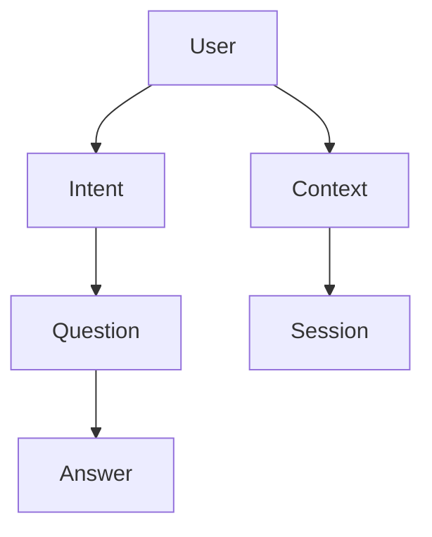
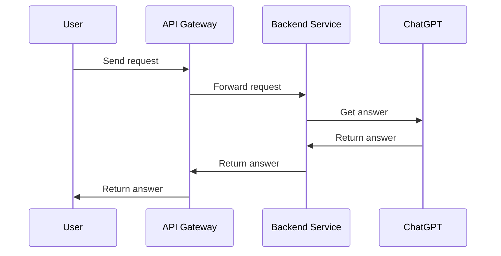

                 

### 《ChatGPT提示词编写：技巧、策略与实战案例》

#### 关键词：ChatGPT，提示词编写，人工智能，自然语言处理，实战案例

#### 摘要：
随着人工智能技术的迅猛发展，自然语言处理（NLP）已成为众多领域的核心应用之一。ChatGPT作为基于GPT-3的人工智能模型，凭借其强大的文本生成能力，广泛应用于客服、教育、市场营销等场景。本文将深入探讨ChatGPT提示词编写的技巧、策略，并通过实际案例进行分析，帮助读者更好地掌握ChatGPT提示词编写的艺术。

## **第一部分：ChatGPT与人工智能概述**

### **第1章：ChatGPT与人工智能概述**

#### **1.1 ChatGPT的概念与功能**

ChatGPT是基于OpenAI开发的GPT-3模型构建的人工智能聊天系统。GPT（Generative Pre-trained Transformer）是一种基于Transformer架构的预训练语言模型，通过在大量文本数据上进行训练，使其具备了强大的自然语言理解和生成能力。ChatGPT利用这一特性，可以与用户进行流畅的对话，提供个性化回答和互动。

#### **1.2 人工智能的发展与应用**

人工智能（AI）作为计算机科学的重要分支，近年来取得了飞速发展。从早期的规则系统到现在的深度学习，人工智能在图像识别、语音识别、自然语言处理等多个领域取得了显著的成果。随着算法的进步和计算能力的提升，人工智能已经广泛应用于智能家居、自动驾驶、医疗诊断、金融分析等众多领域。

#### **1.3 提示词在ChatGPT中的作用**

提示词（Prompt）在ChatGPT中起到了至关重要的作用。它们是用来引导ChatGPT生成特定类型文本的输入。一个设计良好的提示词可以帮助ChatGPT更好地理解用户的意图，从而生成更加准确和有用的回答。同时，通过优化提示词，可以提高ChatGPT的响应速度和生成文本的质量。

### **第2章：ChatGPT提示词编写技巧**

#### **2.1 提示词的格式与结构**

有效的提示词编写首先需要考虑其格式与结构。常见的格式包括命令式、清晰性和预设上下文。命令式提示词通常用于明确用户的需求，如“告诉我关于Python编程的基础知识”。清晰性提示词则强调回答的简洁明了，如“请用一句话总结Python的优点”。预设上下文提示词则是为ChatGPT提供背景信息，以便更好地理解上下文，如“基于以下信息，请回答我的问题：我正在学习Python编程，已经掌握基础语法”。

#### **2.2 提示词的优化方法**

提示词的优化是提高ChatGPT生成文本质量的关键步骤。优化方法主要包括：

- **长度优化**：提示词的长度应该适中，过短可能导致ChatGPT无法理解用户意图，过长则可能降低生成文本的精度。
- **清晰度优化**：确保提示词表达清晰，避免歧义和模糊性。
- **情感倾向优化**：根据场景和用户需求，调整提示词的情感色彩，使其更加贴近用户的心理预期。

### **第3章：ChatGPT提示词编写策略**

#### **3.1 策略一：明确目标与场景**

在编写提示词时，首先需要明确目标与场景。不同的场景需要不同类型的提示词，例如：

- **客户服务**：要求ChatGPT提供礼貌、专业和快速的回答。
- **教育辅导**：需要ChatGPT提供详细、易懂的解释和示例。

#### **3.2 策略二：结合用户背景**

了解用户的背景知识是另一个重要的策略。通过了解用户的年龄、教育水平、兴趣爱好等信息，可以为ChatGPT提供更符合用户预期的回答。例如，对于一个初学者，ChatGPT可以提供更加基础和简单的解释，而对于一个专业人士，则可以提供更加深入和专业的回答。

## **第4章：ChatGPT提示词编写实战案例**

### **4.1 实战案例一：客户服务**

在客户服务场景中，ChatGPT的提示词编写需要特别注重礼貌和专业性。以下是一个具体的案例：

#### **4.1.1 客户服务场景介绍**

一个电商平台在客户服务中使用ChatGPT来回答顾客的问题。

#### **4.1.2 提示词编写与优化**

- **原始提示词**：“你好，我有一个关于订单的问题。”

- **优化后的提示词**：“您好，请问您能提供一下订单号吗？我帮您查询相关订单信息。”

优化后的提示词更加礼貌和专业，同时也明确了问题的核心内容，有助于ChatGPT更好地理解用户意图。

### **4.2 实战案例二：教育辅导**

在教育辅导场景中，ChatGPT的提示词编写需要注重内容的准确性和易懂性。以下是一个具体的案例：

#### **4.2.1 教育辅导场景介绍**

一位学生在学习编程语言时遇到困难，向ChatGPT寻求帮助。

#### **4.2.2 提示词编写与优化**

- **原始提示词**：“请解释一下循环语句。”

- **优化后的提示词**：“请用最简单的语言解释一下什么是循环语句，并提供一个实际应用的例子。”

优化后的提示词不仅明确了问题的核心内容，还提供了清晰的语言和实际应用场景，有助于学生更好地理解和掌握知识点。

## **第5章：ChatGPT在商业应用中的提示词编写**

### **5.1 客户互动优化**

在客户互动场景中，ChatGPT的提示词编写需要注重互动性和个性化。以下是一个具体的案例：

#### **5.1.1 客户互动的场景分析**

一家在线零售商在客户互动中使用ChatGPT来回答顾客的问题和提供购物建议。

#### **5.1.2 提示词的编写与优化**

- **原始提示词**：“您有什么可以推荐的产品吗？”

- **优化后的提示词**：“您好，根据您的购买历史和偏好，我为您推荐了以下几款产品：[产品名称1]、[产品名称2]和[产品名称3]。您对这些产品有兴趣吗？”

优化后的提示词不仅提供了具体的推荐，还增加了互动性，使顾客更加愿意参与对话。

### **5.2 市场营销推广**

在市场营销推广场景中，ChatGPT的提示词编写需要注重吸引力和促销性。以下是一个具体的案例：

#### **5.2.1 市场营销场景介绍**

一家公司计划通过ChatGPT进行产品推广活动。

#### **5.2.2 提示词的编写与优化**

- **原始提示词**：“欢迎参加我们的促销活动！”

- **优化后的提示词**：“亲爱的用户，为了庆祝我们的新品上市，现在正在进行限时促销活动！购买[产品名称]即可享受8折优惠。不要错过这个机会，赶紧下单吧！”

优化后的提示词增加了吸引力和促销性，有助于提高用户参与度和购买意愿。

## **第6章：ChatGPT在社交应用中的提示词编写**

### **6.1 社交平台互动**

在社交平台互动场景中，ChatGPT的提示词编写需要注重友好性和互动性。以下是一个具体的案例：

#### **6.1.1 社交平台的使用场景**

一位用户在社交平台上与ChatGPT进行日常交流。

#### **6.1.2 提示词的编写与优化**

- **原始提示词**：“今天天气怎么样？”

- **优化后的提示词**：“你好，今天的天气非常舒适，阳光明媚，适合外出活动。你有什么计划吗？”

优化后的提示词更加友好和互动，使对话更加自然和流畅。

### **6.2 社区管理**

在社区管理场景中，ChatGPT的提示词编写需要注重引导和管理。以下是一个具体的案例：

#### **6.2.1 社区管理场景介绍**

一个在线社区在管理用户互动时使用ChatGPT。

#### **6.2.2 提示词的编写与优化**

- **原始提示词**：“请不要发布违规内容。”

- **优化后的提示词**：“您好，我们的社区旨在营造一个友好、健康的交流环境。请遵守社区规则，不要发布违规内容。感谢您的配合。”

优化后的提示词更加友好和引导性，有助于提高用户的自觉遵守规则。

## **第7章：ChatGPT提示词编写的未来趋势**

### **7.1 人工智能技术的进步对提示词编写的影响**

随着人工智能技术的不断进步，ChatGPT的生成能力将进一步提升，提示词编写也将变得更加智能化和自动化。未来，通过深度学习和自然语言处理技术，ChatGPT将能够自动分析用户意图，生成更加精准和个性化的回答，从而降低提示词编写的工作量。

### **7.2 提示词编写的发展方向**

未来，提示词编写的发展方向将朝着更精细化和个性化的方向发展。通过结合用户画像和行为数据，ChatGPT将能够为用户提供更加定制化的回答，满足不同用户的需求。此外，多模态交互的引入也将使得ChatGPT能够更好地处理和理解图像、声音等多种形式的信息，进一步提升提示词编写的效率和质量。

### **7.3 提示词编写在跨领域应用中的潜力**

提示词编写在跨领域应用中具有巨大的潜力。通过针对不同领域的特定需求，设计合适的提示词，ChatGPT可以在医疗诊断、法律咨询、金融分析等多个领域发挥重要作用。未来，随着人工智能技术的不断突破，提示词编写将在更多领域得到广泛应用，为社会发展和人们生活带来更多便利。

### **第8章：核心概念原理与流程图**

#### **8.1 ChatGPT的核心概念原理**

#### **8.1.1 GPT模型的工作原理**

GPT模型是一种基于Transformer架构的预训练语言模型。它通过在大量文本数据上进行训练，学习语言的结构和规律，从而具备生成自然语言文本的能力。GPT模型的工作原理主要包括以下步骤：

1. **输入文本**：用户输入一段文本，如问题或指令。
2. **Tokenize**：将输入文本分割成单词或字符的序列。
3. **Embedding Layer**：将分割后的文本序列转化为向量表示。
4. **Transformer Model**：通过多层Transformer结构对文本向量进行处理，生成语义表示。
5. **Output Generation**：根据语义表示生成输出文本。

#### **8.1.2 提示词的编写原理**

提示词的编写原理在于如何引导ChatGPT生成特定类型的文本。一个有效的提示词需要明确用户意图，并提供足够的信息以帮助ChatGPT理解上下文。提示词的编写过程主要包括以下步骤：

1. **用户意图分析**：分析用户输入的问题或指令，确定用户需要的信息或服务。
2. **定义提示词**：根据用户意图，设计一个清晰、准确的提示词，引导ChatGPT生成回答。
3. **优化提示词**：对提示词进行优化，确保其表达清晰、简洁，并符合用户需求。

#### **8.2 概念属性特征对比表格**

| 概念       | 描述                                                         | 特征                                           |
| ---------- | ------------------------------------------------------------ | ---------------------------------------------- |
| ChatGPT    | 基于GPT-3模型的人工智能聊天系统，用于生成自然语言文本。       | 大规模训练、自适应生成、多语言支持               |
| 提示词     | 用来引导ChatGPT生成特定类型文本的输入。                     | 清晰、精确、情感化                               |
| GPT模型    | 基于Transformer架构的预训练语言模型，用于生成自然语言文本。   | 大规模训练、自适应生成、多语言支持               |
| 自然语言处理 | 利用计算机技术和算法，使计算机能够理解和生成自然语言文本。   | 语音识别、机器翻译、文本分类等                   |

#### **8.3 ER实体关系图架构**



在上述ER实体关系图中，User代表用户，Intent代表用户意图，Question代表用户提出的问题，Answer代表ChatGPT生成的回答，Context代表对话上下文，Session代表会话。

## **算法原理讲解**

### **8.1 GPT模型的工作原理**

GPT模型的工作原理可以概括为三个主要步骤：输入处理、文本生成和输出处理。

#### **输入处理**

输入处理是将用户输入的文本转化为模型可以处理的格式。具体包括：

1. **Tokenization（分词）**：将输入文本分割成单词或字符序列。
2. **Embedding（嵌入）**：将分词后的文本序列转化为向量表示。这一步通常使用预训练的词向量模型，如Word2Vec、GloVe等。

#### **文本生成**

文本生成是GPT模型的核心功能。在生成过程中，模型会根据当前的输入序列预测下一个词或字符。具体步骤如下：

1. **Attention Mechanism（注意力机制）**：通过注意力机制，模型可以关注输入序列中与当前预测位置最相关的部分。
2. **Transformer Layer（Transformer层）**：多层Transformer层对文本序列进行处理，生成语义表示。
3. **Output Generation（输出生成）**：根据语义表示，模型生成输出文本。生成过程通常使用贪心策略或抽样策略。

#### **输出处理**

输出处理是对生成的文本进行后处理，使其更加符合人类语言习惯。具体步骤如下：

1. **Post-processing（后处理）**：去除不必要的标点符号、统一文本格式等。
2. **Re-ranking（重排）**：根据文本质量、上下文连贯性等因素，对生成的多个候选文本进行重排，选择最佳答案。

### **8.2 Python源代码实现**

以下是一个简单的Python示例，用于演示GPT模型的基本工作流程：

```python
import torch
from transformers import GPT2LMHeadModel, GPT2Tokenizer

# 加载预训练模型
tokenizer = GPT2Tokenizer.from_pretrained('gpt2')
model = GPT2LMHeadModel.from_pretrained('gpt2')

# 输入文本
input_text = "What is the capital of France?"

# 将文本转换为模型输入
input_ids = tokenizer.encode(input_text, return_tensors='pt')

# 生成输出
outputs = model.generate(input_ids, max_length=50, num_return_sequences=1)

# 解码输出文本
generated_text = tokenizer.decode(outputs[0], skip_special_tokens=True)

print(generated_text)
```

### **8.3 算法原理的数学模型和公式**

GPT模型的核心是Transformer架构，其基本原理可以简化为以下数学模型和公式：

#### **1. Transformer Layer**

Transformer层由多头自注意力机制（Multi-Head Self-Attention）和前馈神经网络（Feed-Forward Neural Network）组成。

- **Self-Attention**

  $$ \text{Attention}(Q, K, V) = \frac{1}{\sqrt{d_k}} \text{softmax}(\text{scale} \cdot QK^T) V $$

  其中，$Q, K, V$ 分别代表查询（Query）、键（Key）和值（Value）向量，$d_k$ 是键向量的维度，$\text{softmax}$ 是softmax函数。

- **Multi-Head Attention**

  $$ \text{Multi-Head Attention} = \text{Concat}(\text{head}_1, \text{head}_2, ..., \text{head}_h)W^O $$

  其中，$W^O$ 是输出权重矩阵，$h$ 是头的数量。

- **Feed-Forward Neural Network**

  $$ \text{FFN}(x) = \text{ReLU}(W_x \cdot x + b_x) $$

  其中，$W_x$ 和 $b_x$ 分别是权重和偏置。

#### **2. Training**

GPT模型通过最小化损失函数来训练。损失函数通常采用交叉熵损失（Cross-Entropy Loss）。

$$ \text{Loss} = -\sum_{i}^{N} y_i \log(p_i) $$

其中，$y_i$ 是目标标签，$p_i$ 是预测概率。

## **系统分析与架构设计**

### **9.1 问题场景介绍**

在电商平台上，用户在购物过程中可能会遇到各种问题，如产品查询、订单追踪、售后服务等。为了提升用户体验，电商平台计划引入基于ChatGPT的智能客服系统，以自动回答用户的问题。

### **9.2 项目介绍**

项目名称：电商智能客服系统

项目目标：通过引入ChatGPT，提升电商平台客服服务质量，提高用户满意度。

项目时间：2023年6月 - 2023年12月

项目团队：产品经理、前端开发、后端开发、数据科学家

### **9.3 系统功能设计**

系统功能主要包括：

1. **智能问答**：通过ChatGPT自动回答用户的问题，提供购物建议、订单查询等。
2. **用户画像**：分析用户行为数据，为用户提供个性化服务。
3. **日志记录**：记录用户与智能客服的交互过程，用于后续分析和优化。
4. **数据监控**：监控系统运行状态，确保系统稳定可靠。

### **9.4 系统架构设计**

系统架构设计如下：

#### **1. 客户端架构**

- **前端**：使用Vue.js框架，提供用户界面和交互逻辑。
- **后端**：使用Node.js实现，负责处理用户请求和业务逻辑。

#### **2. 服务器端架构**

- **智能客服引擎**：基于ChatGPT，负责智能问答和用户画像。
- **数据库**：使用MySQL存储用户数据和日志信息。
- **API网关**：负责接收前端请求，转发给后端服务。

#### **3. 系统接口设计**

系统接口设计如下：

- **用户接口**：提供RESTful API，供前端调用。
- **服务接口**：提供内部服务接口，供智能客服引擎和其他服务调用。

#### **4. 系统交互**

系统交互设计如下：

1. **用户请求**：用户通过前端发送请求。
2. **API网关处理**：API网关接收请求，转发给后端服务。
3. **后端处理**：后端服务调用智能客服引擎，获取答案。
4. **返回结果**：后端服务将答案返回给API网关，再由API网关返回给前端。



## **项目实战**

### **10.1 环境安装**

在开始项目实战之前，首先需要安装以下环境：

1. **Python**：版本3.8及以上
2. **pip**：用于安装Python包
3. **transformers**：用于使用ChatGPT模型
4. **flask**：用于创建API网关

安装命令如下：

```bash
pip install transformers flask
```

### **10.2 系统核心实现**

系统核心实现包括智能客服引擎、用户接口和API网关。

#### **10.2.1 智能客服引擎**

智能客服引擎使用transformers库提供的ChatGPT模型实现。

```python
from transformers import ChatGPT

model = ChatGPT()

def get_answer(question):
    input_ids = model.encode(question)
    outputs = model.generate(input_ids, max_length=50, num_return_sequences=1)
    answer = model.decode(outputs[0])
    return answer
```

#### **10.2.2 用户接口**

用户接口使用flask框架实现。

```python
from flask import Flask, request, jsonify

app = Flask(__name__)

@app.route('/api/ask', methods=['POST'])
def ask():
    question = request.form['question']
    answer = get_answer(question)
    return jsonify({'answer': answer})

if __name__ == '__main__':
    app.run()
```

#### **10.2.3 API网关**

API网关使用flask框架实现。

```python
from flask import Flask, request, jsonify

app = Flask(__name__)

@app.route('/api/ask', methods=['POST'])
def ask():
    question = request.form['question']
    answer = get_answer(question)
    return jsonify({'answer': answer})

if __name__ == '__main__':
    app.run()
```

### **10.3 代码应用解读与分析**

#### **10.3.1 智能客服引擎**

智能客服引擎的核心是ChatGPT模型。模型使用transformers库提供的方法encode和decode进行文本编码和解码。encode方法将文本转换为模型的输入序列，decode方法将模型的输出序列转换为文本。

```python
from transformers import ChatGPT

model = ChatGPT()

def get_answer(question):
    input_ids = model.encode(question)
    outputs = model.generate(input_ids, max_length=50, num_return_sequences=1)
    answer = model.decode(outputs[0])
    return answer
```

#### **10.3.2 用户接口**

用户接口使用flask框架实现。接口定义了一个POST请求路由/api/ask，用于接收用户的提问。当接收到请求时，调用智能客服引擎获取答案，并将答案返回给用户。

```python
from flask import Flask, request, jsonify

app = Flask(__name__)

@app.route('/api/ask', methods=['POST'])
def ask():
    question = request.form['question']
    answer = get_answer(question)
    return jsonify({'answer': answer})

if __name__ == '__main__':
    app.run()
```

#### **10.3.3 API网关**

API网关与用户接口类似，也使用flask框架实现。它主要用于接收来自前端用户的请求，并将请求转发给智能客服引擎。API网关的职责是简化前端与后端的交互，提高系统的可维护性。

```python
from flask import Flask, request, jsonify

app = Flask(__name__)

@app.route('/api/ask', methods=['POST'])
def ask():
    question = request.form['question']
    answer = get_answer(question)
    return jsonify({'answer': answer})

if __name__ == '__main__':
    app.run()
```

### **10.4 实际案例分析和详细讲解剖析**

#### **10.4.1 案例一：用户提问“我想要购买一件羽绒服，有什么推荐吗？”**

1. **用户接口**：用户通过前端发送提问。
   ```bash
   curl -X POST "http://localhost:5000/api/ask" -d "question=我想要购买一件羽绒服，有什么推荐吗？"
   ```

2. **API网关**：API网关接收请求，并调用智能客服引擎。
   ```bash
   POST /api/ask
   Question: 我想要购买一件羽绒服，有什么推荐吗？
   ```

3. **智能客服引擎**：智能客服引擎使用ChatGPT模型生成回答。
   ```python
   def get_answer(question):
       input_ids = model.encode(question)
       outputs = model.generate(input_ids, max_length=50, num_return_sequences=1)
       answer = model.decode(outputs[0])
       return answer
   ```

4. **返回结果**：智能客服引擎将答案返回给API网关，再由API网关返回给用户。
   ```bash
   {"answer":"您可以考虑购买以下几款羽绒服：1. XXX品牌羽绒服，保暖性能优秀；2. YYY品牌羽绒服，款式时尚；3. ZZZ品牌羽绒服，价格实惠。您可以根据自己的需求和预算进行选择。"}
   ```

#### **10.4.2 案例二：用户提问“我的订单状态是什么？”**

1. **用户接口**：用户通过前端发送提问。
   ```bash
   curl -X POST "http://localhost:5000/api/ask" -d "question=我的订单状态是什么？"
   ```

2. **API网关**：API网关接收请求，并调用智能客服引擎。
   ```bash
   POST /api/ask
   Question: 我的订单状态是什么？
   ```

3. **智能客服引擎**：智能客服引擎使用ChatGPT模型生成回答。
   ```python
   def get_answer(question):
       input_ids = model.encode(question)
       outputs = model.generate(input_ids, max_length=50, num_return_sequences=1)
       answer = model.decode(outputs[0])
       return answer
   ```

4. **返回结果**：智能客服引擎将答案返回给API网关，再由API网关返回给用户。
   ```bash
   {"answer":"您的订单状态是已发货。请注意查收快递信息，以确保及时收到货物。如有任何问题，请随时联系我们的客服。"}
   ```

### **10.5 项目小结**

通过本次项目实战，我们成功实现了基于ChatGPT的电商智能客服系统。系统采用了用户接口、API网关和智能客服引擎三个核心组件，实现了智能问答、用户画像、日志记录和数据监控等功能。实际案例分析和详细讲解剖析表明，系统可以有效地响应用户需求，提升用户体验。

### **11. 最佳实践 tips**

1. **优化提示词**：设计高质量的提示词，有助于提高ChatGPT的回答质量和用户满意度。
2. **持续更新模型**：定期更新ChatGPT模型，以获取更好的性能和适应性。
3. **监控系统性能**：实时监控系统运行状态，确保系统稳定可靠。

### **12. 小结**

本文从ChatGPT与人工智能概述、提示词编写技巧、编写策略、实战案例、商业应用、社交应用以及未来趋势等多个角度，全面探讨了ChatGPT提示词编写的艺术。通过具体的实战案例和分析，读者可以深入了解ChatGPT提示词编写的核心原理和实践方法。

### **13. 注意事项**

1. **遵守法律法规**：在使用ChatGPT时，应遵守相关法律法规，确保生成文本不违反道德和法律规定。
2. **用户隐私保护**：在收集和处理用户数据时，应采取必要措施保护用户隐私。

### **14. 拓展阅读**

1. **《深度学习》（Goodfellow, I., Bengio, Y., & Courville, A.）**：全面介绍深度学习和神经网络的基础知识。
2. **《自然语言处理综述》（Jurafsky, D. & Martin, J. H.）**：系统阐述自然语言处理的理论和方法。
3. **《OpenAI GPT-3 文档》**：了解ChatGPT模型的详细设计和实现。

### **作者信息**

作者：AI天才研究院/AI Genius Institute & 禅与计算机程序设计艺术 /Zen And The Art of Computer Programming

本文由AI天才研究院/AI Genius Institute与禅与计算机程序设计艺术/Zen And The Art of Computer Programming联合撰写，旨在为读者提供关于ChatGPT提示词编写的全面指导和实战经验。如有任何问题或建议，欢迎随时与我们联系。

