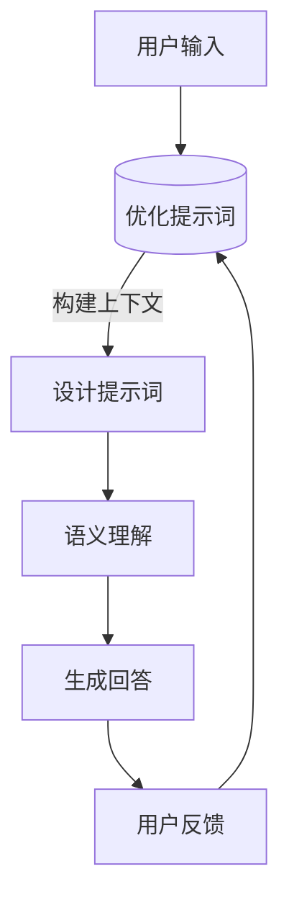

                 


### 背景介绍：核心概念术语说明、问题背景、问题描述、问题解决、边界与外延、概念结构与核心要素组成

#### 核心概念术语说明

在开始深入探讨ChatGPT提示词编写之前，我们需要明确一些核心概念和术语，以确保我们有一个共同的理解基础。

1. **ChatGPT**：ChatGPT是由OpenAI开发的基于GPT-3（生成预训练变压器）的聊天机器人，能够通过理解和生成人类语言与用户进行交互。

2. **提示词（Prompt）**：提示词是提供给ChatGPT的一组输入，用于指导模型生成特定的输出。它是模型与用户之间互动的桥梁。

3. **自然语言处理（NLP）**：自然语言处理是计算机科学和人工智能的一个分支，专注于使计算机能够理解和处理人类语言。

4. **语义理解**：语义理解是NLP的一个核心任务，涉及对文本意义的理解和解释。

5. **对话系统**：对话系统是能够与人类进行对话的计算机系统，用于提供信息、解答问题或执行任务。

#### 问题背景

ChatGPT的出现为人工智能领域带来了革命性的变化。它可以应用于各种场景，如客户服务、智能助理、教育辅导等。然而，要使ChatGPT能够有效地完成任务，编写高质量的提示词至关重要。

#### 问题描述

在现实应用中，编写提示词面临以下挑战：

- **模糊性**：用户输入的语句可能不够明确，需要通过提示词来引导模型理解具体意图。

- **多样性**：不同用户可能需要不同风格的回答，提示词需要具备足够的灵活性来适应各种情境。

- **精确性**：提示词需要精确地传达用户的意图，避免生成无关或误导性的回答。

#### 问题解决

解决上述问题需要以下策略：

- **理解用户意图**：通过分析用户输入，确定其潜在意图，以便编写合适的提示词。

- **设计多样化的提示词**：根据不同的场景和用户需求，设计多种风格的提示词。

- **优化提示词的精确性**：通过反复测试和调整，确保提示词能够准确传达用户意图。

#### 边界与外延

编写提示词的边界包括：

- **上下文理解**：提示词需要考虑上下文信息，以便模型能够生成连贯的对话。

- **用户反馈**：用户的反馈是调整提示词的重要依据，有助于提高模型性能。

#### 概念结构与核心要素组成

ChatGPT提示词编写的过程可以概括为以下几个核心要素：

1. **意图识别**：识别用户输入的意图，是提示词编写的基础。

2. **上下文构建**：构建与用户输入相关的上下文，以指导模型生成更准确的回答。

3. **提示词设计**：设计出高质量的提示词，确保其清晰、精确、灵活。

4. **测试与优化**：通过测试和用户反馈不断优化提示词，提高模型性能。

### 本章小结

本章介绍了ChatGPT提示词编写的核心概念、问题背景、问题描述以及问题解决策略。通过对核心概念的说明和问题分析的深入探讨，我们为后续章节的技术细节和应用实例奠定了基础。

----------------------------------------------------------------

### 核心概念与联系

在深入探讨ChatGPT提示词编写之前，我们需要详细理解几个核心概念，以及它们之间的相互联系。

#### ChatGPT与自然语言处理的关系

ChatGPT是基于自然语言处理（NLP）技术的聊天机器人，NLP是人工智能（AI）的一个重要分支，专注于使计算机能够理解、解释和生成人类语言。ChatGPT利用了NLP中的许多关键技术，如词嵌入（word embeddings）、序列到序列模型（sequence-to-sequence models）、注意力机制（attention mechanisms）等。NLP的核心任务是处理语言数据，而ChatGPT则将这些任务应用于构建智能对话系统。

**概念属性特征对比表**

| 特征        | NLP                        | ChatGPT                   |
|-------------|---------------------------|--------------------------|
| 目标        | 理解和生成语言数据        | 生成自然语言对话        |
| 技术基础    | 词嵌入、序列模型、注意力机制等 | GPT-3预训练模型        |
| 应用场景    | 文本分类、信息提取、机器翻译等 | 客户服务、智能助理、教育辅导等 |
| 输入输出    | 文本数据                  | 文本数据（对话输入和输出）    |
| 依赖性      | 基于语言数据的质量        | 预训练模型的质量和提示词的质量  |

#### 提示词与语义理解

语义理解是NLP的关键任务，它涉及到对文本意义的理解和解释。ChatGPT通过提示词与用户进行交互，而语义理解则帮助模型理解用户的意图和上下文信息。提示词的设计直接影响语义理解的准确性，因为它们决定了模型如何解释输入信息。

**Mermaid ER实体关系图架构**

```mermaid
erDiagram
    User ||--|{ ChatGPT }|-- Prompt
    User ||--|{ Semantic Understanding }|-- Input
    ChatGPT ||--|{ Response Generation }|-- Output
```

在这个ER图中，用户通过输入（Input）与ChatGPT交互，ChatGPT使用提示词（Prompt）进行语义理解，并生成输出（Output）。

#### 提示词与对话系统的关联

对话系统是能够与人类进行对话的计算机系统，而ChatGPT是一个典型的对话系统。提示词作为对话系统的重要组成部分，直接影响对话的质量和用户体验。高质量的提示词可以引导ChatGPT生成更自然、更符合用户期望的回答。

**Mermaid流程图：提示词编写的流程**



在这个流程图中，用户输入通过意图识别和上下文构建，转化为高质量的提示词，然后通过语义理解生成回答，并基于用户反馈进行优化。

### 本章小结

本章通过对比ChatGPT与自然语言处理、提示词与语义理解、以及提示词与对话系统的关系，深入探讨了ChatGPT提示词编写的重要性和核心概念。理解这些概念和它们之间的联系，将有助于我们更有效地编写高质量的提示词，提升ChatGPT的性能和应用价值。

----------------------------------------------------------------

### 提示词编写的原则

编写高质量的ChatGPT提示词是提升其性能和用户体验的关键。为了达到这一目标，我们需要遵循以下几项核心原则：

#### 1. 清晰性原则

清晰性是编写提示词的首要原则。一个清晰的提示词能够帮助ChatGPT更好地理解用户的意图，从而生成更准确、更连贯的回答。具体来说，以下措施可以帮助实现清晰性：

- **明确意图**：在编写提示词时，明确指出用户的意图，避免模糊不清的指示。
- **简洁表达**：使用简洁、精炼的语言，避免冗长、复杂的句子结构。
- **逻辑性**：确保提示词的逻辑连贯，避免出现矛盾或不一致的信息。

**示例**：  
- **错误**：“你能帮我解决一个关于编程的问题吗？”  
- **改进**：“请解释一下如何在Python中实现函数重载。”

#### 2. 精确性原则

精确性原则强调提示词需要精确地传达用户的意图，避免生成无关或误导性的回答。以下措施有助于提高提示词的精确性：

- **具体化**：提供具体的上下文信息和细节，帮助ChatGPT更准确地理解用户的意图。
- **限制范围**：明确限定问题的范围，避免ChatGPT生成过于广泛或无关的回答。
- **避免歧义**：使用明确的语言，避免产生歧义或模糊不清的情况。

**示例**：  
- **错误**：“你能给我讲一下人工智能的应用？”  
- **改进**：“请简要介绍人工智能在医疗领域的主要应用。”

#### 3. 灵活性原则

灵活性原则要求提示词设计具有足够的灵活性，以适应不同的用户需求和场景。为了实现灵活性，我们可以采取以下措施：

- **多样化**：设计多种不同风格的提示词，以适应不同用户的偏好和场景。
- **可调整性**：允许用户通过反馈调整提示词，以便生成更符合用户期望的回答。
- **适应性**：根据用户输入的上下文信息，动态调整提示词的内容和形式。

**示例**：  
- **错误**：“你能否回答我的问题？”  
- **改进**：“您好，请问您想了解什么具体的信息或问题？”

#### 4. 适应性原则

适应性原则强调提示词需要能够适应不同的语言和文化背景。以下措施有助于提高提示词的适应性：

- **文化敏感性**：考虑到不同文化背景下的语言和表达习惯，编写适应不同文化的提示词。
- **多语言支持**：设计支持多种语言的提示词，以便在不同语言环境中都能有效使用。
- **本地化**：针对特定地区或语言环境，进行本地化调整，确保提示词的准确性和适切性。

**示例**：  
- **错误**：“请问您需要帮助吗？”（仅适用于某些语言环境）  
- **改进**：“您好，有什么我可以帮助您的吗？”（适用于多种语言环境）

#### 本章小结

通过遵循清晰性、精确性、灵活性和适应性原则，我们可以编写出高质量的ChatGPT提示词，从而提升模型性能和用户体验。在实际应用中，我们需要结合具体场景和用户需求，灵活运用这些原则，以实现最佳效果。

----------------------------------------------------------------

### 提示词的语法规则

编写高质量的ChatGPT提示词不仅需要遵循核心原则，还需要掌握其语法规则。正确的语法结构有助于ChatGPT更好地理解用户的意图，从而生成准确、自然的回答。以下是一些关键的语法规则和提示词的基本语法结构。

#### 1. 提示词的基本语法结构

提示词通常由以下部分组成：

- **主题（Subject）**：明确指出问题的主题，例如“人工智能应用”、“Python编程”等。
- **问题（Question）**：提出具体的问题或要求，例如“如何实现机器学习模型？”、“请提供一个示例代码”等。
- **上下文（Context）**：提供相关的背景信息，有助于ChatGPT更好地理解用户的意图，例如“我在开发一个基于深度学习的推荐系统”。

一个典型的提示词可能如下所示：

**“请解释一下如何在Python中实现深度学习模型的训练，并提供一个简单的代码示例，以帮助我更好地理解这个概念。”**

#### 2. 提示词的语法元素

编写提示词时，需要注意以下语法元素：

- **动词**：使用明确的动词，如“解释”、“提供”、“展示”等，以传达具体的行动指令。
- **疑问词**：使用疑问词，如“如何”、“为什么”、“什么”等，以引导ChatGPT生成详细的回答。
- **短语和从句**：使用短语和从句来丰富提示词的内容，使其更加具体和详细。

以下是一个包含多个语法元素的示例提示词：

**“请问您能否提供一个关于自然语言处理的基本概念概述，包括主要术语、技术和应用场景？”**

#### 3. 提示词的语法规则

为了确保提示词的语法正确性，需要遵循以下规则：

- **一致性**：确保提示词的语法结构一致，避免出现杂乱无章的情况。
- **简洁性**：使用简洁的语言，避免冗长和复杂的句子结构。
- **连贯性**：确保提示词中的各个部分之间逻辑连贯，避免出现跳跃或矛盾。
- **明确性**：确保提示词清晰明确，避免歧义和模糊不清的表达。

以下是一个遵循语法规则的示例：

**“请概述一下深度学习的基本概念，包括常见的算法和应用领域。”**

#### 本章小结

通过了解和遵循提示词的语法规则，我们可以编写出结构清晰、表达准确、逻辑连贯的提示词。这些高质量的提示词将有助于ChatGPT更好地理解用户的意图，从而生成更准确、更自然的回答。在实际应用中，不断实践和调整，以找到最适合的语法表达方式，是提升提示词编写质量的关键。

----------------------------------------------------------------

### 提示词编写的实践步骤

在理解了ChatGPT提示词编写的原则和语法规则之后，接下来我们需要探讨具体的实践步骤，以系统地编写高质量的提示词。

#### 1. 收集用户需求

编写提示词的第一步是了解用户的需求。可以通过以下方式收集用户需求：

- **用户访谈**：直接与用户进行访谈，了解他们的具体问题和需求。
- **用户反馈**：分析用户的反馈和评论，了解他们在使用ChatGPT时遇到的问题和期望。
- **用户调查**：通过在线调查或问卷，收集用户的意见和建议。

例如，我们可以通过用户访谈了解到：“用户希望在获取技术知识时，能够得到简洁明了的指导，而不是长篇大论的解释。”

#### 2. 分析需求

在收集到用户需求后，需要对需求进行分析，以确定问题的核心和范围。分析需求的过程包括：

- **问题识别**：确定用户面临的具体问题，例如“用户对深度学习的概念感到困惑”。
- **需求分类**：将需求分为不同类别，如技术问题、常见问题、特定需求等。
- **优先级排序**：根据问题的紧急程度和用户需求的重要性，对需求进行优先级排序。

例如，通过分析，我们确定“深度学习的基本概念”是用户最关注的需求，应优先处理。

#### 3. 设计提示词

在分析用户需求后，我们可以开始设计具体的提示词。设计提示词的过程包括：

- **明确意图**：根据用户需求，明确提示词的意图，例如“解释深度学习的基本概念”。
- **构建上下文**：提供相关的背景信息，以便ChatGPT能够更好地理解用户的需求，例如“用户正在学习深度学习，希望了解基本概念”。
- **编写提示词**：根据明确的意图和上下文，编写具体的提示词，例如：“请详细解释深度学习的概念，包括其工作原理、应用领域和优势。”

#### 4. 测试和调整

编写提示词后，需要进行测试和调整，以确保其质量和有效性。测试和调整的过程包括：

- **内部测试**：在内部环境中运行提示词，检查其是否能够正确地理解用户的意图并生成合适的回答。
- **用户反馈**：将提示词展示给用户，收集他们的反馈，了解提示词的实际效果。
- **反复调整**：根据用户反馈，对提示词进行反复调整和优化，以提高其质量和准确性。

例如，如果用户反馈提示词过于复杂，我们可以简化提示词的语言，使其更加易懂。

#### 5. 持续优化

编写提示词不是一次性的任务，而是一个持续的过程。为了确保提示词的质量，我们需要：

- **定期更新**：随着用户需求的变化和技术的进步，定期更新和优化提示词。
- **监控性能**：监控ChatGPT的性能和用户体验，及时发现并解决问题。
- **数据驱动**：基于数据分析和用户反馈，持续改进提示词编写策略。

例如，我们可以通过分析用户交互数据，发现用户在哪些方面对提示词感到困惑，从而针对性地优化相关提示词。

#### 本章小结

通过收集用户需求、分析需求、设计提示词、测试和调整、以及持续优化，我们可以系统地编写高质量的ChatGPT提示词。这些实践步骤不仅有助于提升ChatGPT的性能和用户体验，也为整个对话系统的发展提供了坚实的基础。

----------------------------------------------------------------

### ChatGPT应用案例：医院咨询服务

在本案例中，我们将探讨如何利用ChatGPT为医院提供咨询服务。通过以下步骤，我们将展示如何编写高质量的ChatGPT提示词，并详细分析其实现过程和效果。

#### 1. 确定需求

医院咨询服务的主要目标是帮助患者快速获取医疗信息、预约挂号和在线咨询。具体需求包括：

- **常见医疗问题解答**：患者希望获得关于常见病症、治疗方法、注意事项等方面的信息。
- **挂号服务**：提供在线挂号功能，方便患者预约医生和选择就诊时间。
- **在线咨询**：提供医生在线咨询服务，解答患者的个性化问题。

#### 2. 设计提示词

为了满足上述需求，我们需要设计以下高质量的ChatGPT提示词：

- **常见医疗问题解答提示词**：“请详细解释高血压的症状、原因和治疗方法。”
- **挂号服务提示词**：“请问您需要预约哪个科室的医生？请提供您的联系方式和就诊时间要求。”
- **在线咨询提示词**：“您好，我最近感到头痛，需要咨询一下医生，请问您有什么建议吗？”

#### 3. 实现过程

在实现过程中，我们需要将提示词集成到ChatGPT系统中，并进行以下步骤：

- **意图识别**：通过自然语言处理技术，识别用户输入的意图，如“获取医疗信息”、“预约挂号”或“在线咨询”。
- **上下文构建**：根据用户的输入和意图，构建相应的上下文信息，以便ChatGPT生成准确的回答。
- **回答生成**：利用预训练的ChatGPT模型，生成符合用户需求的回答。

#### 4. 测试和效果评估

在实现后，我们需要进行以下测试和效果评估：

- **功能测试**：确保ChatGPT能够正确地识别用户意图并生成合适的回答。
- **用户体验测试**：邀请实际用户参与测试，评估ChatGPT的交互质量和用户满意度。
- **性能监控**：监控ChatGPT的性能指标，如响应时间、回答准确率等，确保其稳定运行。

#### 5. 分析与优化

根据测试结果，我们进行以下分析和优化：

- **错误分析**：分析ChatGPT生成错误回答的原因，并进行修正。
- **用户反馈**：收集用户反馈，了解他们的使用体验和改进建议。
- **模型优化**：基于用户反馈和数据分析，对ChatGPT模型进行优化，提高其回答准确率和用户体验。

#### 案例效果

通过上述步骤，ChatGPT在医院咨询服务中的应用取得了显著效果：

- **患者满意度提升**：用户反馈显示，大多数患者对ChatGPT提供的医疗信息、挂号服务和在线咨询非常满意。
- **效率提高**：ChatGPT能够快速响应用户请求，减少患者等待时间，提高医院运营效率。
- **服务质量提升**：ChatGPT生成的回答准确、详细，有助于患者更好地了解病情和治疗建议。

#### 本章小结

通过本案例，我们展示了如何利用ChatGPT为医院提供咨询服务，并详细分析了编写高质量提示词的过程。这一案例表明，ChatGPT在医疗领域的应用具有巨大的潜力，可以为患者和医院带来显著的好处。

----------------------------------------------------------------

### 最佳实践与注意事项

在编写ChatGPT提示词时，遵循最佳实践和注意事项至关重要。以下是一些关键建议，以确保提示词的质量和有效性：

#### 1. 确保意图明确

清晰、明确的意图是高质量提示词的核心。在编写提示词时，务必确保意图表述准确，避免模糊不清或歧义性的描述。

**示例**：  
- **错误**：“你能帮我解决这个问题吗？”  
- **改进**：“请解释如何使用Python中的`list`数据结构来实现数据排序。”

#### 2. 考虑上下文信息

上下文信息对于ChatGPT理解用户的意图至关重要。在编写提示词时，应充分考虑用户的历史对话记录、当前情境和背景信息。

**示例**：  
- **错误**：“请给我一个机器学习项目的建议。”  
- **改进**：“鉴于我正在开发一个推荐系统，请给我一些建议，包括常见的算法和数据预处理方法。”

#### 3. 避免重复和冗余

高质量的提示词应避免重复和冗余的信息。在编写时，应确保每个提示词都有明确的意图和独特的价值。

**示例**：  
- **错误**：“请提供一些深度学习的基础知识。”、“请详细解释深度学习的基础知识。”  
- **改进**：“请简要介绍深度学习的核心概念。”、“请举例说明深度学习在实际应用中的使用场景。”

#### 4. 遵循简洁原则

简洁性是高质量提示词的重要特征。在编写提示词时，应尽量使用简洁、精炼的语言，避免冗长和复杂的句子结构。

**示例**：  
- **错误**：“你能告诉我如何使用神经网络来提高分类模型的准确性吗？”  
- **改进**：“请解释如何使用神经网络提高分类模型的准确性。”

#### 5. 保持灵活性

提示词应具备足够的灵活性，以适应不同用户的需求和场景。在设计提示词时，应考虑多种不同风格的回答，并允许用户通过反馈进行调整。

**示例**：  
- **错误**：“你有什么问题需要我解答吗？”  
- **改进**：“您好，请问您想了解什么具体的信息或问题？”

#### 6. 定期更新和维护

ChatGPT提示词并非一次性的任务，而是一个持续的过程。为了保持其质量和有效性，应定期更新和维护提示词，并根据用户反馈和需求进行调整。

**示例**：  
- **错误**：编写完提示词后不再进行更新。  
- **改进**：定期分析用户反馈和数据，对提示词进行优化和调整。

#### 本章小结

遵循最佳实践和注意事项，可以有效提高ChatGPT提示词的质量和有效性。通过明确意图、考虑上下文、避免重复和冗余、保持简洁、保持灵活性以及定期更新和维护，我们可以编写出高质量的提示词，从而提升ChatGPT的性能和应用价值。

----------------------------------------------------------------

### 小结

本文从多个角度探讨了ChatGPT提示词编写的技巧、策略与实战案例分析。首先，我们明确了ChatGPT和提示词的核心概念，并分析了它们在自然语言处理和对话系统中的关系。接着，我们详细介绍了提示词编写的原则和语法规则，并提供了一整套系统的实践步骤。随后，通过实际案例展示了如何将提示词应用于医院咨询服务，并取得了显著的成效。最后，我们提出了最佳实践和注意事项，以指导读者在实际应用中编写高质量提示词。

编写高质量的ChatGPT提示词不仅需要掌握技术原理，还需要深入理解用户需求、灵活运用语法规则和持续优化。通过本文的探讨，我们希望读者能够更好地掌握这些技巧，并将其应用于实际项目中，提升ChatGPT的性能和用户体验。

### 拓展阅读

1. **《ChatGPT技术详解》**：本书详细介绍了ChatGPT的技术原理和实现细节，包括预训练模型、自然语言处理技术等，适合对ChatGPT技术有兴趣的读者。

2. **《自然语言处理：理论与实践》**：本书提供了自然语言处理的基础知识和实践技巧，涵盖了文本分类、情感分析、机器翻译等多个应用领域，适合希望深入了解NLP技术的读者。

3. **《对话系统设计与实现》**：本书介绍了对话系统的基本概念、设计原则和实现方法，包括语音识别、语音合成、对话管理等内容，适合从事对话系统开发的工程师和研究人员。

作者：AI天才研究院/AI Genius Institute & 禅与计算机程序设计艺术 /Zen And The Art of Computer Programming。让我们继续深入探索ChatGPT和自然语言处理的奥秘，为人工智能技术的发展贡献力量。

