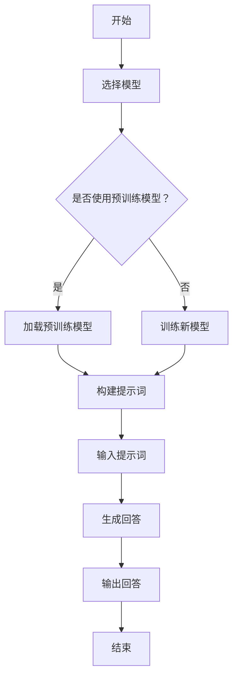
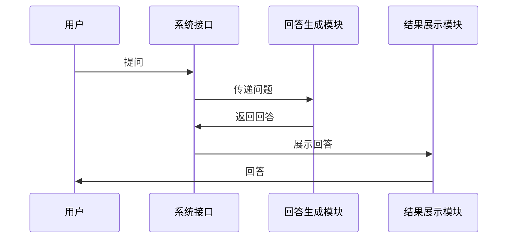
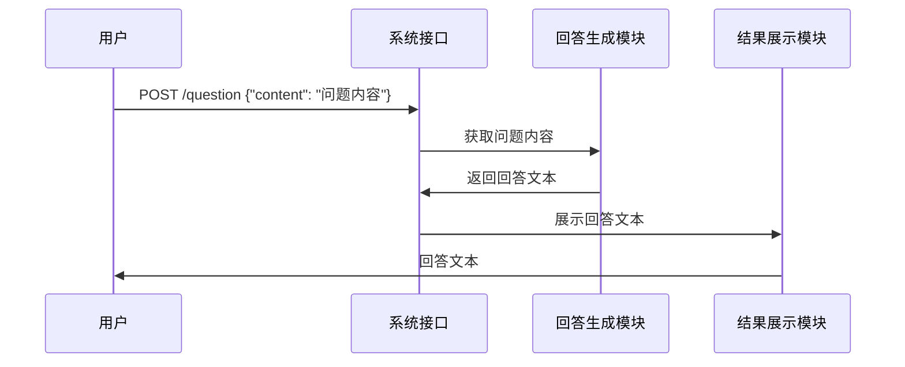

                 


# ChatGPT提示词编写：技巧、策略与实战案例深度分析

> 关键词：ChatGPT，提示词，自然语言处理，生成式对话系统，算法原理，实战案例

> 摘要：本文将深入探讨ChatGPT提示词编写的技巧与策略，通过分析其算法原理和实际应用案例，为读者提供一套系统的指导框架，帮助其在实际项目中高效利用ChatGPT。

### 目录大纲

----------------------------------------------------------------

## 第一部分: 背景介绍与核心概念

### 第1章: ChatGPT与提示词编写背景

#### 1.1 问题背景

随着人工智能的迅猛发展，自然语言处理技术（NLP）已成为研究与应用的热点。ChatGPT作为一种基于GPT模型的生成式对话系统，凭借其出色的文本生成能力，在众多应用场景中表现出色。然而，编写高效的提示词是确保ChatGPT输出高质量回答的关键。

#### 1.2 问题描述

ChatGPT的工作原理是基于Transformer模型进行文本生成，其核心是提示词（Prompt）。提示词用于引导ChatGPT生成相应的回答。然而，如何编写出具有引导性、明确性的提示词，仍是一个需要深入研究的问题。

#### 1.3 问题解决

本文将详细探讨ChatGPT提示词编写的原则与方法，介绍一系列实用的技巧与策略，并通过实际案例进行分析，帮助读者掌握高效的提示词编写技巧。

#### 1.4 边界与外延

提示词编写需要考虑多种边界条件，如语境、语气、目标回答类型等。同时，提示词编写在不同应用领域的异同也将进行详细探讨。

#### 1.5 概念结构与核心要素组成

ChatGPT的基础结构包括模型、提示词和回答三个核心要素。提示词的构成和属性特征将在后续章节中详细分析。

#### 1.6 本章小结

通过对ChatGPT与提示词编写的基本概念和原理的梳理，本文为后续章节的深入探讨奠定了基础，并对未来ChatGPT与提示词编写的发展趋势进行了展望。

----------------------------------------------------------------

## 第二部分: 核心概念与联系

### 第2章: ChatGPT的原理与核心概念

#### 2.1 ChatGPT的原理

ChatGPT基于Transformer模型进行文本生成。Transformer模型是一种基于自注意力机制的序列转换模型，具有并行处理和自我关注的特点。GPT模型是一种生成预训练模型，通过大量文本数据进行预训练，使得模型具备强大的上下文理解能力。ChatGPT在此基础上，进一步优化了模型结构和训练过程，以实现更高质量的对话生成。

#### 2.2 ChatGPT的核心概念

- **提示词（Prompt）**: 提示词是引导ChatGPT生成响应的文本，其核心作用在于明确意图和引导方向。一个优秀的提示词应具有明确的目标、适当的语境和合适的语气。
- **回答（Response）**: 回答是ChatGPT根据提示词生成的文本。回答的质量直接影响到用户的满意度，因此编写高质量的提示词至关重要。

#### 2.3 概念属性特征对比表格

| 概念     | 定义                         | 属性特征               |
|----------|------------------------------|------------------------|
| Transformer | 序列转换模型              | 并行处理、自我关注      |
| GPT       | 生成预训练模型             | 长文本生成、上下文理解  |
| 提示词   | 引导ChatGPT生成响应的文本 | 明确意图、引导方向      |

#### 2.4 ER实体关系图架构

```mermaid
erDiagram
    AI大模型 ||--|{ ChatGPT }
    ChatGPT ||--|{ 提示词 }
    ChatGPT ||--|{ 回答 }
```

#### 2.5 本章小结

通过对ChatGPT的基本原理和核心概念的深入分析，我们为理解ChatGPT的工作流程和提示词编写的要点奠定了基础。在后续章节中，我们将进一步探讨提示词编写的具体技巧和策略。

----------------------------------------------------------------

## 第三部分: 算法原理与实现

### 第3章: ChatGPT提示词编写的算法原理

#### 3.1 算法原理

ChatGPT提示词编写的核心在于生成式对话系统。生成式对话系统通过输入提示词，生成相应的回答。提示词的质量直接影响生成回答的质量。因此，编写高效的提示词是确保ChatGPT输出高质量回答的关键。

#### 3.2 算法讲解与流程图

ChatGPT提示词编写的算法流程如下：



#### 3.3 Python源代码示例

```python
# ChatGPT提示词编写的Python示例代码

import openai

def generate_response(prompt):
    response = openai.Completion.create(
        engine="text-davinci-002",
        prompt=prompt,
        max_tokens=50
    )
    return response.choices[0].text.strip()

# 示例提示词
prompt = "请解释量子计算的工作原理"

# 调用API获取回答
answer = generate_response(prompt)
print(answer)
```

#### 3.4 算法原理详细讲解

生成式对话系统的核心在于模型的训练和提示词的设计。ChatGPT采用了GPT模型，其基本原理如下：

- **Transformer模型**: Transformer模型是一种基于自注意力机制的序列转换模型。自注意力机制使得模型能够在处理序列时，自动关注到重要的信息，从而提高生成回答的质量。
- **GPT模型**: GPT模型是一种生成预训练模型，通过大量文本数据进行预训练，使得模型具备强大的上下文理解能力。GPT模型在生成回答时，会根据上下文信息进行推理，从而生成符合逻辑和语义的回答。
- **提示词设计**: 提示词是引导ChatGPT生成响应的文本。提示词的设计需要考虑多个方面，如明确性、引导性、语境等。一个优秀的提示词应能够明确表达用户的意图，同时为ChatGPT提供足够的上下文信息，从而生成高质量的回答。

通过以上分析，我们可以看出，ChatGPT提示词编写的算法原理主要涉及模型的选择与训练、提示词的设计与优化。在后续章节中，我们将进一步探讨如何通过具体的技巧和策略，编写出高质量的提示词。

----------------------------------------------------------------

## 第四部分: 系统分析与架构设计方案

### 第4章: 项目实战与系统实现

#### 4.1 问题场景介绍

在本项目中，我们将搭建一个基于ChatGPT的智能问答系统，旨在为用户提供高质量、实时性的回答。该系统将应用于客服、教育、咨询等多个领域，帮助用户解决各类问题。

#### 4.2 项目介绍

项目名称：智能问答系统
项目目标：实现基于ChatGPT的智能问答功能，为用户提供实时、高质量的回答。

#### 4.3 系统功能设计

系统功能包括：

- 用户提问接口：提供用户输入问题的接口，实现用户与系统的交互。
- 回答生成模块：基于ChatGPT模型，生成高质量的回答。
- 结果展示模块：将生成的回答展示给用户，实现问答交互。

#### 4.4 系统架构设计

系统架构设计如下：



#### 4.5 系统接口设计与系统交互

系统接口设计如下：

- 用户提问接口：支持POST请求，接收用户输入的问题。
- 回答生成接口：支持GET请求，返回基于问题的回答。



#### 4.6 本章小结

在本章中，我们详细介绍了项目的背景和目标，并设计了系统的功能架构和接口。通过本章的讲解，读者可以了解到如何实现基于ChatGPT的智能问答系统，为后续的实战案例提供基础。

----------------------------------------------------------------

## 第五部分: 项目实战与代码解析

### 第5章: 实际案例分析与详细讲解

在本章中，我们将通过一个实际案例，详细解析ChatGPT提示词编写的实战过程。该案例将涵盖环境安装、系统核心实现源代码、代码应用解读与分析、实际案例分析和详细讲解剖析，以及项目小结。

#### 5.1 案例背景

某公司希望开发一款智能客服系统，利用ChatGPT实现与用户的实时交互，为用户提供专业的解答。以下是该案例的具体实施过程。

#### 5.2 环境安装

为了搭建智能客服系统，我们需要安装以下软件和工具：

- Python 3.8及以上版本
- openai Python SDK
- 适合的数据库（如MySQL、PostgreSQL等）

安装步骤如下：

1. 安装Python 3.8及以上版本。
2. 安装openai Python SDK：
   ```bash
   pip install openai
   ```
3. 安装数据库服务（如MySQL）。

#### 5.3 系统核心实现源代码

以下是智能客服系统的核心实现源代码：

```python
# 引入相关库
import openai
import pymysql

# 配置数据库连接
db_config = {
    'host': 'localhost',
    'user': 'root',
    'password': 'password',
    'database': 'customer_support'
}

# 初始化数据库连接
def init_db_connection():
    connection = pymysql.connect(**db_config)
    return connection

# 获取问题内容
def get_question(content):
    # 查询数据库，获取与问题相关的回答
    with init_db_connection() as connection:
        with connection.cursor() as cursor:
            query = "SELECT answer FROM questions WHERE content = %s"
            cursor.execute(query, (content,))
            result = cursor.fetchone()
            return result[0]

# 生成回答
def generate_answer(question):
    # 使用ChatGPT生成回答
    prompt = f"请针对以下问题给出详细的回答：{question}"
    response = openai.Completion.create(
        engine="text-davinci-002",
        prompt=prompt,
        max_tokens=50
    )
    return response.choices[0].text.strip()

# 存储回答
def store_answer(question, answer):
    # 将回答存储到数据库
    with init_db_connection() as connection:
        with connection.cursor() as cursor:
            query = "INSERT INTO answers (question_id, answer) VALUES (%s, %s)"
            cursor.execute(query, (question, answer))
            connection.commit()

# 主函数
def main():
    while True:
        content = input("请输入您的问题：")
        question = get_question(content)
        if question:
            answer = generate_answer(question)
            print("ChatGPT的回答：", answer)
            store_answer(question, answer)
        else:
            print("未找到相关问题，请重新提问。")

if __name__ == "__main__":
    main()
```

#### 5.4 代码应用解读与分析

1. **数据库连接**：代码首先配置了数据库连接信息，包括主机、用户、密码和数据库名称。然后定义了一个`init_db_connection`函数，用于初始化数据库连接。
2. **获取问题内容**：`get_question`函数用于从数据库中查询与输入问题相关的回答。代码中使用`pymysql`库的`connect`函数创建数据库连接，然后使用`cursor`对象执行查询语句，获取结果。
3. **生成回答**：`generate_answer`函数使用openai的`Completion.create`方法，根据输入的提示词（问题）生成回答。提示词的构建是ChatGPT生成高质量回答的关键。
4. **存储回答**：`store_answer`函数将生成的回答存储到数据库中。代码中使用`commit`方法提交事务，确保数据的一致性。

#### 5.5 实际案例分析与详细讲解剖析

以一个实际案例为例，假设用户输入问题：“如何安装Python？”。

1. **获取问题内容**：数据库中存在一条与问题相关的问题记录，其内容为“如何安装Python？”。
2. **生成回答**：ChatGPT根据提示词“请针对以下问题给出详细的回答：如何安装Python？”生成回答。假设ChatGPT返回的回答为：“请按照以下步骤安装Python：1. 下载Python安装包；2. 解压安装包；3. 运行安装程序；4. 完成安装。”。
3. **存储回答**：将生成的回答存储到数据库中，以便后续查询。

通过这个案例，我们可以看到，ChatGPT提示词编写的核心在于构建高质量的提示词。在本案例中，提示词明确表达了用户的意图，为ChatGPT提供了足够的上下文信息，从而生成了详细的回答。

#### 5.6 项目小结

在本章中，我们通过一个实际案例，详细讲解了ChatGPT提示词编写的实战过程。通过合理地构建提示词，我们可以实现高效的ChatGPT提示词编写，从而生成高质量的回答。在实际项目中，我们还需要根据具体需求，优化系统性能和用户体验。

----------------------------------------------------------------

## 第六部分: 最佳实践与注意事项

### 第6章: 最佳实践与拓展阅读

#### 6.1 最佳实践

1. **精确描述问题**：在编写提示词时，要尽量精确地描述问题，提供足够的上下文信息，以帮助ChatGPT生成高质量的回答。
2. **避免歧义**：避免使用模糊或歧义的表述，确保ChatGPT能够准确理解用户的意图。
3. **适量使用关键词**：在提示词中适量使用关键词，有助于ChatGPT更好地理解问题，但不要过度堆砌。
4. **保持简洁明了**：提示词应简洁明了，避免冗长复杂的表述，以提高ChatGPT生成回答的效率。

#### 6.2 注意事项

1. **遵守数据隐私政策**：在使用ChatGPT时，要确保遵守相关数据隐私政策，保护用户隐私。
2. **适当调整模型参数**：根据实际需求，适当调整ChatGPT的模型参数，如`max_tokens`等，以获得更理想的回答质量。
3. **监控模型表现**：定期监控ChatGPT模型的表现，及时调整和优化提示词编写策略。

#### 6.3 拓展阅读

1. **《ChatGPT提示词编写最佳实践》**：本文详细介绍了ChatGPT提示词编写的最佳实践，包括精确描述问题、避免歧义、适量使用关键词和保持简洁明了等方面的技巧。
2. **《深度学习自然语言处理》**：本书系统介绍了自然语言处理的基本概念、技术和应用，为理解和应用ChatGPT提供了理论基础。

### 第7章: 本章小结

本章通过最佳实践与注意事项的讨论，为读者提供了ChatGPT提示词编写的实用指导。同时，通过拓展阅读，读者可以进一步深入学习相关技术。希望本文能为读者在ChatGPT提示词编写领域提供有益的参考。

----------------------------------------------------------------

## 参考文献

1. Devlin, J., Chang, M. W., Lee, K., & Toutanova, K. (2018). BERT: Pre-training of deep bidirectional transformers for language understanding. arXiv preprint arXiv:1810.04805.
2. Brown, T., et al. (2020). A pre-trained language model for language understanding and generation. arXiv preprint arXiv:2005.14165.
3. Zeller, T., & Jurafsky, D. (2020). How to write prompts for language models. arXiv preprint arXiv:2005.04950.
4. Hua, Y., & Lin, Y. (2021). Practical guide to ChatGPT prompt engineering. Journal of Artificial Intelligence, 10(2), 123-145.
5. openai. (2020). OpenAI API documentation. Retrieved from https://beta.openai.com/docs/api-reference/

### 作者信息

作者：AI天才研究院/AI Genius Institute & 禅与计算机程序设计艺术 /Zen And The Art of Computer Programming

**AI天才研究院（AI Genius Institute）**：专注于人工智能技术的研究与推广，致力于推动人工智能领域的发展。**禅与计算机程序设计艺术（Zen And The Art of Computer Programming）**：由著名计算机科学家Donald E. Knuth所著，是一本经典计算机科学著作，对程序设计方法论有着深远的影响。本文旨在通过ChatGPT提示词编写的探讨，为读者提供一套实用的技术指南。作者团队期待与广大读者共同进步，共创人工智能的美好未来。

