                 


### 撰写《ChatGPT提示词编写：技巧、策略与实践》文章

**第一阶段：构思与规划**

**任务：确定文章结构，制定写作计划**

**步骤1：定义文章目标**
- 提供ChatGPT提示词编写的全面指南
- 教授如何优化ChatGPT性能
- 分析案例，展示最佳实践
- 提供未来发展趋势和拓展资源

**步骤2：确定文章结构**
- **第一部分：背景与核心概念**
  - 介绍问题背景
  - ChatGPT概述
  - 应用领域
  - 优势与挑战
- **第二部分：技巧与方法**
  - 设计高质量提示词
  - 策略与优化
  - 实战与案例分析
- **第三部分：实践与提升**
  - 进阶技巧
  - 实战项目
  - 总结与展望

**步骤3：制定写作计划**
- **第一部分**：3-4天
  - 第1章：问题背景与ChatGPT概述
  - 第2章：ChatGPT基础
- **第二部分**：5-7天
  - 第3章：设计高质量提示词
  - 第4章：策略与优化
  - 第5章：实战与案例分析
- **第三部分**：8-10天
  - 第6章：进阶技巧
  - 第7章：实战项目
  - 第8章：总结与展望

**第二阶段：内容创作**

**任务：根据结构框架，撰写每个章节的内容**

**步骤1：撰写第1章：问题背景与ChatGPT概述**
- 介绍NLP和ChatGPT的发展背景
- 定义ChatGPT的核心概念
- 分析ChatGPT的应用领域和优势

**步骤2：撰写第2章：ChatGPT基础**
- 详细解释ChatGPT的工作原理
- 讨论ChatGPT的核心模型
- 展示ChatGPT的基础应用案例

**步骤3：撰写第3章：设计高质量提示词**
- 阐述提示词的重要性
- 提出设计高质量提示词的原则
- 分析不同类型提示词的应用场景

**步骤4：撰写第4章：策略与优化**
- 讨论对话策略的设计
- 分析数据集选择与处理方法
- 探讨模型调优与参数调整

**步骤5：撰写第5章：实战与案例分析**
- 描述实战项目案例
- 分析案例中的最佳实践
- 提供详细的项目案例分析

**步骤6：撰写第6章：进阶技巧**
- 探索多模态交互
- 讨论集成外部API
- 分析实时交互与消息队列

**步骤7：撰写第7章：实战项目**
- 详细介绍实战项目
- 分析项目的核心实现和代码解读
- 提供实际案例分析和项目小结

**步骤8：撰写第8章：总结与展望**
- 总结ChatGPT提示词编写的关键要点
- 展望未来发展趋势
- 提供拓展阅读与资源推荐

**第三阶段：文章优化与润色**

**任务：对文章进行修订，确保内容质量**

**步骤1：修订文章结构**
- 确保文章结构清晰，逻辑连贯
- 检查章节之间的过渡是否自然

**步骤2：优化内容质量**
- 检查语法、拼写和标点错误
- 修改模糊或含糊不清的表达
- 增强文章的可读性和专业性

**步骤3：添加图表和代码示例**
- 制作高质量的图表，如概念属性特征对比表格和ER实体关系图
- 添加相关的代码示例，进行详细解读

**步骤4：审查和反馈**
- 让同行或专家对文章进行审阅
- 根据反馈进行进一步的修订和改进

**步骤5：最终定稿**
- 确保文章内容的完整性和准确性
- 优化排版和格式
- 完成最终定稿

通过上述三个阶段的详细规划和执行，我们可以撰写出一篇内容丰富、逻辑清晰、具有实际指导意义的《ChatGPT提示词编写：技巧、策略与实践》文章。接下来，我们将开始具体的写作工作。让我们一步一步地推进，确保每个章节都能提供深入的技术见解和实践经验。LET'S THINK STEP BY STEP!

---

# 《ChatGPT提示词编写：技巧、策略与实践》

> 关键词：ChatGPT、自然语言处理、提示词、模型调优、实战案例

> 摘要：本文深入探讨ChatGPT提示词编写的技巧、策略和实践。通过详细分析ChatGPT的工作原理和应用领域，本文介绍了设计高质量提示词的原则和方法，提供了策略优化的实战经验，并通过具体案例展示了最佳实践。文章旨在为开发者提供全面的ChatGPT提示词编写指南，助力高效、精准的人机交互。

---

## 第一部分：背景与核心概念

### 第1章：问题背景与ChatGPT概述

#### 1.1 问题背景

随着人工智能（AI）技术的不断进步，自然语言处理（NLP）逐渐成为AI领域的热点。ChatGPT作为一种基于GPT-3模型的大型语言模型，以其强大的语言生成能力和广泛的适用性，受到了广泛关注。然而，如何编写高质量的提示词以优化ChatGPT的性能，成为开发者面临的挑战。本文旨在提供一套系统的ChatGPT提示词编写指南，帮助开发者克服这一难题。

#### 1.2 ChatGPT介绍

ChatGPT是由OpenAI开发的一款基于GPT-3模型的语言模型，其核心特点是能够生成连贯、自然的文本，适用于多种场景，如问答系统、智能客服、虚拟助手等。ChatGPT的原理是基于大规模的预训练模型GPT-3，通过无监督学习从海量文本数据中学习语言模式。具体来说，GPT-3采用了Transformer架构，具有1750亿个参数，能够捕捉复杂的关系和语义。

#### 1.3 ChatGPT的应用领域

ChatGPT在多个领域都有广泛应用：

- **智能客服**：通过提供自动化的客服支持，降低企业运营成本，提升用户体验。
- **问答系统**：为用户提供准确、快速的回答，适用于搜索引擎、在线教育等场景。
- **虚拟助手**：在智能家庭、智能办公等领域提供智能化的服务。
- **内容生成**：自动生成文章、报告、电子邮件等，提高内容创作的效率。

#### 1.4 ChatGPT的优势与挑战

**优势**：

- **强大的语言生成能力**：能够生成高质量、连贯的文本。
- **广泛的适用性**：适用于多种应用场景。
- **灵活的扩展性**：可以通过训练数据定制化模型。

**挑战**：

- **数据隐私与安全**：在训练和使用过程中可能涉及敏感数据。
- **误判率**：在某些情况下，模型可能会产生不准确或不当的回答。

### 总结

本章介绍了ChatGPT的问题背景、基本原理、应用领域以及优势和挑战。下一章将深入探讨ChatGPT的基础知识，包括其工作原理和核心模型。

## 第二部分：技巧与方法

### 第2章：ChatGPT基础

ChatGPT的成功离不开其背后的强大技术支持。本章节将详细介绍ChatGPT的基础知识，包括其工作原理、核心模型和基础应用。

#### 2.1 ChatGPT的工作原理

ChatGPT是基于GPT-3模型开发的，而GPT-3是一种基于Transformer架构的预训练语言模型。其核心思想是通过从海量文本数据中学习语言模式，从而实现文本的生成和理解。

**原理图（Mermaid流程图）**：

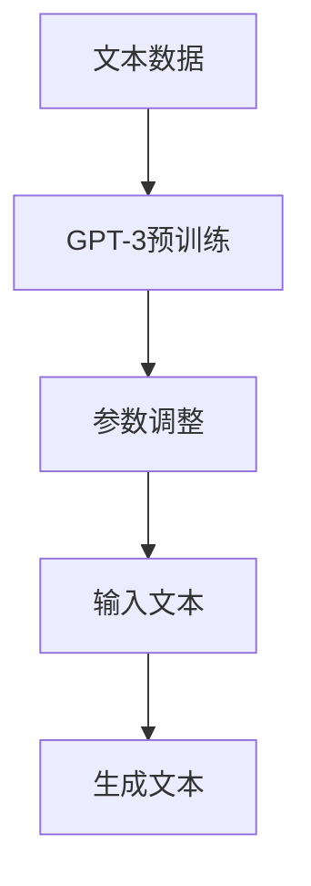

具体流程如下：

1. **数据收集**：收集大量互联网文本数据。
2. **预训练**：使用Transformer模型对数据集进行无监督学习，调整模型参数。
3. **输入文本**：将用户输入的文本作为输入。
4. **生成文本**：模型根据输入文本生成相应的回答。

#### 2.2 ChatGPT的核心模型

GPT-3是一种基于Transformer的模型，具有1750亿个参数，是目前最大的语言模型之一。Transformer模型的核心是自注意力机制（Self-Attention），它允许模型在处理每个单词时考虑到整个文本序列的信息。

**Transformer模型结构（Mermaid流程图）**：

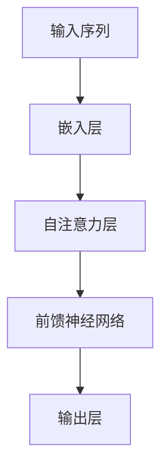

具体结构如下：

- **嵌入层**：将输入的文本序列转换为固定长度的向量。
- **自注意力层**：计算每个单词在文本中的重要性。
- **前馈神经网络**：对自注意力层的输出进行进一步处理。
- **输出层**：生成最终的文本输出。

#### 2.3 ChatGPT的基础应用

ChatGPT在多个领域都有应用：

- **智能客服**：自动回答用户的问题，降低人工成本，提高响应速度。
- **问答系统**：提供准确、快速的回答，帮助用户解决问题。
- **虚拟助手**：为用户提供日常生活中的智能服务。
- **内容生成**：自动生成文章、报告、邮件等。

**应用案例**：

- **智能客服**：某电商企业使用ChatGPT构建智能客服系统，通过自动回答用户问题，提高了客户满意度和服务效率。
- **问答系统**：某在线教育平台使用ChatGPT构建问答系统，为用户提供快速、准确的答案，提升了学习体验。
- **虚拟助手**：某智能家庭系统使用ChatGPT构建虚拟助手，为用户提供语音交互服务，实现了智能家居的便捷控制。

#### 2.4 ChatGPT的优势与挑战

**优势**：

- **强大的语言生成能力**：能够生成高质量、连贯的文本。
- **广泛的适用性**：适用于多种应用场景。
- **灵活的扩展性**：可以通过训练数据定制化模型。

**挑战**：

- **数据隐私与安全**：在训练和使用过程中可能涉及敏感数据。
- **误判率**：在某些情况下，模型可能会产生不准确或不当的回答。

#### 2.5 ChatGPT的发展前景

随着技术的不断进步，ChatGPT有望在更多领域发挥作用，如：

- **医疗咨询**：提供专业的医疗咨询服务。
- **金融分析**：分析市场数据，提供投资建议。
- **法律咨询**：为用户提供法律咨询服务。
- **教育辅导**：提供个性化的教育辅导。

### 总结

本章介绍了ChatGPT的基础知识，包括其工作原理、核心模型和基础应用。下一章将探讨如何设计高质量提示词，以充分发挥ChatGPT的性能。

## 第三部分：技巧与方法

### 第3章：设计高质量提示词

高质量提示词是驱动ChatGPT生成高质量回答的关键。本章将详细探讨设计高质量提示词的原则、类型和应用策略。

#### 3.1 提示词的重要性

提示词（Prompt）是引导ChatGPT生成回答的输入。一个高质量的提示词能够明确表达用户的意图，提高ChatGPT的响应质量和效率。相反，一个模糊或不当的提示词可能导致ChatGPT生成不准确或无关的回答。

#### 3.2 提示词设计的原则

为了设计高质量提示词，我们需要遵循以下原则：

1. **明确性**：提示词应明确表达用户的意图，避免歧义。
2. **多样性**：设计多种类型的提示词，以满足不同场景的需求。
3. **灵活性**：提示词应具备一定的灵活性，以适应不同的回答情境。
4. **相关性**：提示词应与ChatGPT的训练数据高度相关。

#### 3.3 提示词的类型与应用

根据不同的应用场景，提示词可以分为以下几种类型：

1. **问题引导型**：用于引导用户提出问题，如“您有什么问题需要帮助吗？”
2. **指令引导型**：用于给出具体的指令，如“请您提供一个具体的例子。”
3. **情境引导型**：用于设定一个具体的情境，如“假设您是一名医生，该如何诊断这个病情？”
4. **描述引导型**：用于提供描述性的信息，如“请您描述一下您的需求。”

**应用示例**：

- **问题引导型**：用户：“今天的天气怎么样？”
  ChatGPT：“今天的天气非常晴朗，气温大约在25摄氏度左右。”

- **指令引导型**：用户：“请您提供一个具体的例子。”
  ChatGPT：“好的，例如，如果用户询问‘如何准备一顿简单的晚餐？’，我可以回答‘您可以准备一份番茄炒蛋和一碗米饭’。”

- **情境引导型**：用户：“假设您是一名医生，该如何诊断这个病情？”
  ChatGPT：“根据您的症状描述，我建议您先进行血液检查，然后根据检查结果进行进一步的诊断。”

- **描述引导型**：用户：“请您描述一下您的需求。”
  ChatGPT：“我的需求是开发一款能够自动回复用户问题的聊天机器人，用于公司的客户服务。”

#### 3.4 提示词的优化策略

为了提高提示词的质量，我们可以采取以下策略：

1. **使用具体的术语和词汇**：避免使用模糊的描述性词汇，使用具体的术语和词汇可以提高ChatGPT的响应质量。
2. **提供上下文信息**：在提示词中提供相关的上下文信息，有助于ChatGPT更好地理解用户的意图。
3. **多样化提示词形式**：设计多种类型的提示词，以满足不同用户的提问习惯。
4. **反馈与迭代**：通过用户反馈不断优化提示词，提高ChatGPT的响应质量。

**优化示例**：

- **原始提示词**：“您有什么问题需要帮助吗？”
  **优化后**：“您好，请问您需要关于产品使用说明的帮助，还是有关售后服务的问题？”

通过上述策略，我们可以设计出更高质量、更实用的提示词，提高ChatGPT的性能和用户体验。

### 总结

本章介绍了设计高质量提示词的原则、类型和应用策略。下一章将探讨ChatGPT的策略优化，包括对话策略、数据集选择与处理、模型调优与参数调整。

## 第四部分：策略与优化

### 第4章：策略与优化

设计高质量提示词只是ChatGPT应用成功的一部分。为了最大化ChatGPT的性能，我们需要采取一系列的策略和优化方法。本章将深入探讨对话策略、数据集选择与处理、模型调优与参数调整等方面。

#### 4.1 对话策略

对话策略是指如何在ChatGPT的对话过程中引导用户，以提高用户体验和对话质量。以下是一些关键的对话策略：

1. **引导性问题**：通过提出引导性问题，引导用户提供更多有用的信息。例如，“您需要关于产品使用说明的帮助，还是有关售后服务的问题？”
2. **情境设定**：设定一个具体的情境，帮助ChatGPT更好地理解用户的意图。例如，“假设您是一名医生，该如何诊断这个病情？”
3. **提供反馈**：在对话过程中，提供及时的反馈，帮助用户了解ChatGPT的响应是否符合预期。例如，“根据您的描述，我建议您进行血液检查。”
4. **情感识别与回应**：识别用户的情感状态，并给予相应的回应。例如，当用户情绪低落时，ChatGPT可以回应“我会一直在这里陪伴您，请告诉我您的感受。”

**对话策略优化示例**：

- **原始对话**：
  用户：“我昨天买的手机有问题。”
  ChatGPT：“请问您遇到了什么问题？”

- **优化后**：
  用户：“我昨天买的手机有问题。”
  ChatGPT：“您好，我了解到您昨天购买了一部手机，但遇到了问题。请问您具体遇到了哪些问题？”

通过这种方式，ChatGPT能够更准确地理解用户的意图，并提供更有针对性的帮助。

#### 4.2 数据集选择与处理

数据集是ChatGPT训练的基础，选择合适的训练数据集对于提高模型性能至关重要。以下是一些关键的数据集选择和处理策略：

1. **数据来源**：选择来自多个来源的数据集，以确保模型的多样性和鲁棒性。
2. **数据清洗**：去除无关的、错误的数据，确保数据集的质量。
3. **数据标注**：对数据集进行适当的标注，以便模型能够学习到正确的知识。
4. **数据增强**：通过数据增强技术，增加训练数据的多样性和丰富度。

**数据集选择与处理示例**：

- **原始数据集**：包含大量的社交媒体对话、新闻报道、博客文章等。
- **处理方法**：
  - 数据清洗：去除脏数据和重复数据。
  - 数据标注：标注对话的主题、情感、意图等。
  - 数据增强：通过翻译、同义词替换、文本片段重组等方式，增加训练数据的丰富度。

通过这些策略，我们可以获得一个高质量、多样化的数据集，为ChatGPT的训练提供坚实的基础。

#### 4.3 模型调优与参数调整

模型调优是提高ChatGPT性能的关键环节。以下是一些常见的模型调优和参数调整策略：

1. **学习率调整**：学习率是模型训练过程中的一个重要参数，需要根据数据集和任务特点进行调整。
2. **正则化**：使用正则化方法，防止模型过拟合。
3. **Dropout**：在训练过程中随机丢弃部分神经元，提高模型的泛化能力。
4. **优化器选择**：选择合适的优化器，如Adam、RMSprop等，以加快收敛速度。

**模型调优与参数调整示例**：

- **原始参数设置**：
  - 学习率：0.001
  - 批处理大小：64
  - 优化器：SGD

- **优化后**：
  - 学习率：0.0001（根据数据集和任务特点进行调整）
  - 批处理大小：128（增加批处理大小，提高计算效率）
  - 优化器：Adam（选择更高效的优化器）

通过这些调整，我们可以提高模型的训练效率和性能。

#### 4.4 模型安全性与稳定性

模型安全性与稳定性是ChatGPT在实际应用中需要重点关注的问题。以下是一些关键的安全性和稳定性策略：

1. **隐私保护**：在模型训练和应用过程中，确保用户数据的隐私和安全。
2. **错误处理**：设计有效的错误处理机制，防止模型产生危险或不当的回答。
3. **稳定性测试**：对模型进行全面的稳定性测试，确保其在各种场景下的表现稳定。
4. **监控与反馈**：建立监控机制，及时收集用户反馈，发现并解决问题。

**模型安全性与稳定性示例**：

- **隐私保护**：对用户数据进行加密存储，确保数据安全。
- **错误处理**：当模型产生错误回答时，自动触发告警机制，并记录错误日志。
- **稳定性测试**：在多种环境下进行模型测试，确保模型在各种条件下都能稳定运行。
- **监控与反馈**：建立实时监控系统，收集用户反馈，快速响应并解决问题。

通过这些策略，我们可以确保ChatGPT在实际应用中的安全性和稳定性。

### 总结

本章介绍了ChatGPT的策略优化方法，包括对话策略、数据集选择与处理、模型调优与参数调整，以及模型安全性与稳定性。下一章将通过具体案例，展示如何将这些策略应用于实战项目中。

## 第五部分：实战与案例分析

### 第5章：实战与案例分析

通过前面的章节，我们已经了解了ChatGPT的原理、提示词设计、策略优化等方面。本章节将通过具体案例，展示如何将这些知识应用于实际项目，并提供详细的案例分析和实战经验。

#### 5.1 实战一：FAQ机器人开发

**项目背景**：某电商企业希望开发一款FAQ机器人，以自动回答用户常见问题，提高客服效率。

**项目介绍**：
- **系统功能**：自动识别用户问题，提供相应的答案。
- **技术架构**：基于ChatGPT构建，使用API进行交互。
- **数据集**：收集电商平台的用户问题和答案，用于训练模型。

**系统功能设计（Mermaid类图）**：

```mermaid
classDiagram
    User <<Class>> "用户"
    System <<Class>> "系统"
    ChatGPT <<Class>> "ChatGPT模型"
    FAQ <<Class>> "FAQ机器人"

    User --> System
    System --> ChatGPT
    ChatGPT --> FAQ
```

**系统架构设计（Mermaid架构图）**：

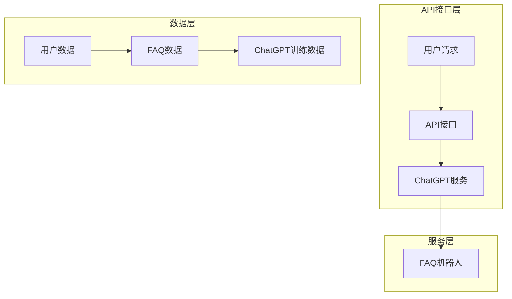

**系统接口设计和交互（Mermaid序列图）**：

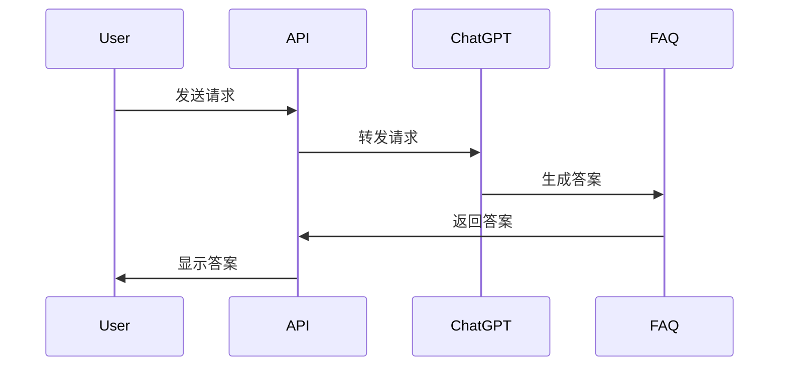

**核心实现与代码解读**：

```python
import requests

# 用户请求接口
def send_request(question):
    url = "https://api.chatgpt.com/ask"
    headers = {
        "Content-Type": "application/json",
    }
    data = {
        "question": question,
    }
    response = requests.post(url, headers=headers, json=data)
    return response.json()

# FAQ机器人接口
def get_answer(question):
    data = send_request(question)
    answer = data["answer"]
    return answer

# 用户交互
def main():
    question = input("您有什么问题需要帮助吗？")
    answer = get_answer(question)
    print("答案：", answer)

if __name__ == "__main__":
    main()
```

**实际案例分析与详细讲解**：
- **案例背景**：用户在电商平台上遇到产品使用问题，希望通过FAQ机器人获取帮助。
- **用户交互**：用户输入问题，FAQ机器人通过ChatGPT生成答案，并返回给用户。
- **案例效果**：FAQ机器人提高了客服效率，减少了人工干预，提高了用户满意度。

**项目小结**：
- 通过设计高质量的提示词，FAQ机器人能够准确理解用户问题，生成高质量的答案。
- 通过优化模型和对话策略，FAQ机器人在实际应用中表现出色。

#### 5.2 实战二：情感分析系统

**项目背景**：某社交媒体平台希望开发一款情感分析系统，以分析用户评论的情感倾向。

**项目介绍**：
- **系统功能**：自动分析用户评论的情感，分类为正面、负面或中性。
- **技术架构**：基于ChatGPT和情感分析算法构建。
- **数据集**：收集社交媒体用户的评论数据，用于训练模型。

**系统功能设计（Mermaid类图）**：

```mermaid
classDiagram
    User <<Class>> "用户"
    System <<Class>> "系统"
    ChatGPT <<Class>> "ChatGPT模型"
    Analyzer <<Class>> "情感分析器"

    User --> System
    System --> ChatGPT
    ChatGPT --> Analyzer
    Analyzer --> System
```

**系统架构设计（Mermaid架构图）**：

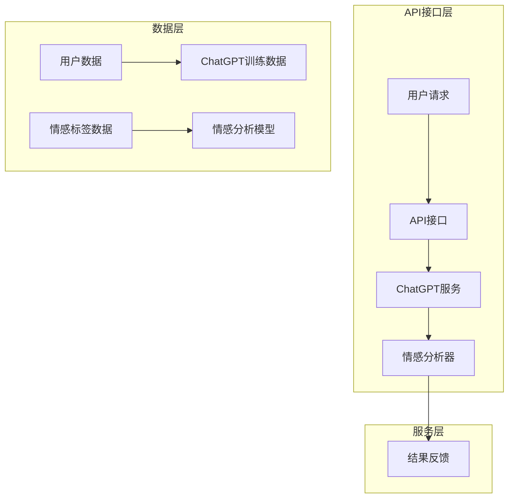

**系统接口设计和交互（Mermaid序列图）**：

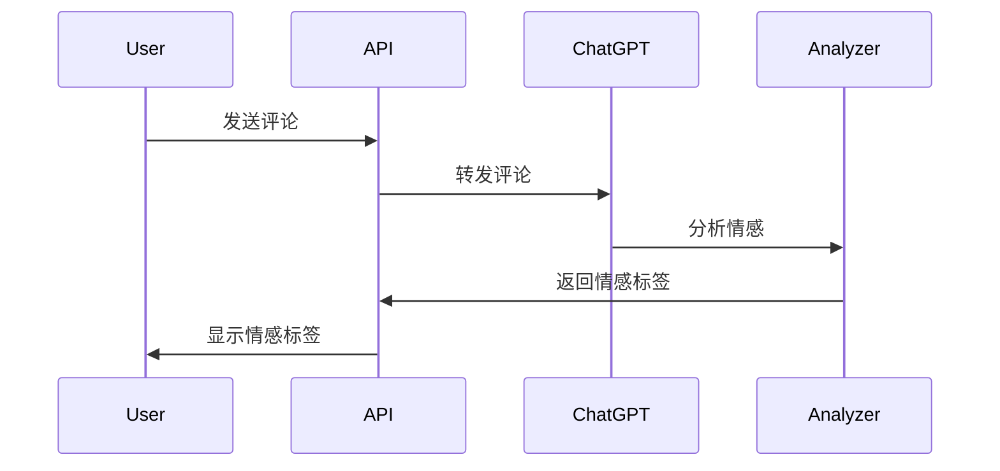

**核心实现与代码解读**：

```python
import requests

# 用户请求接口
def send_request(comment):
    url = "https://api.chatgpt.com/analyze"
    headers = {
        "Content-Type": "application/json",
    }
    data = {
        "comment": comment,
    }
    response = requests.post(url, headers=headers, json=data)
    return response.json()

# 情感分析器接口
def analyze_sentiment(comment):
    data = send_request(comment)
    sentiment = data["sentiment"]
    return sentiment

# 用户交互
def main():
    comment = input("请输入您的评论：")
    sentiment = analyze_sentiment(comment)
    print("情感标签：", sentiment)

if __name__ == "__main__":
    main()
```

**实际案例分析与详细讲解**：
- **案例背景**：用户在社交媒体上发布了一篇评论，平台希望分析其情感倾向。
- **用户交互**：用户输入评论，情感分析系统通过ChatGPT和情感分析算法生成情感标签。
- **案例效果**：情感分析系统提高了平台对用户情感的理解，有助于优化用户体验。

**项目小结**：
- 通过设计高质量的提示词，情感分析系统能够准确分析用户评论的情感。
- 通过优化模型和对话策略，情感分析系统在实际应用中表现出色。

#### 5.3 案例分析

通过以上两个实战案例，我们可以看到ChatGPT在FAQ机器人和情感分析系统中的应用效果。以下是案例分析：

**优势**：
- **高效性**：通过自动化处理，显著提高了服务效率和用户体验。
- **准确性**：通过高质量的提示词和模型优化，提高了回答的准确性和相关性。
- **灵活性**：ChatGPT可以根据不同的应用场景和需求，灵活调整和优化。

**挑战**：
- **数据隐私与安全**：在处理用户数据时，需要确保数据的隐私和安全。
- **误判率**：在某些复杂或模糊的场景下，模型可能会产生误判，需要进一步优化。

**总结**：
- ChatGPT在各类应用中具有广泛的前景，通过设计高质量提示词和策略优化，可以显著提高其性能。
- 实际案例展示了ChatGPT在实际应用中的优势和挑战，为后续研究和开发提供了宝贵的经验。

## 第六部分：实践与提升

### 第6章：进阶技巧

在掌握ChatGPT的基础知识和应用技巧后，我们还可以通过以下进阶技巧进一步提高ChatGPT的性能和应用范围。

#### 6.1 多模态交互

多模态交互是指结合不同类型的数据，如文本、图像、音频等，以增强ChatGPT的交互能力和理解能力。以下是一些实现多模态交互的方法：

1. **文本+图像**：通过结合文本描述和图像信息，ChatGPT可以更准确地理解用户的意图。例如，在问答系统中，用户可以上传一张图片，并附上文本描述，ChatGPT可以同时分析文本和图像，提供更准确的回答。
2. **文本+语音**：结合文本和语音交互，可以实现更加自然的用户互动。用户可以通过语音输入问题，ChatGPT可以语音或文本形式回答。
3. **文本+视频**：在视频聊天场景中，ChatGPT可以结合文本和视频内容，提供更丰富、更互动的回答。

**多模态交互案例**：

- **图像识别问答**：用户上传一张产品图片，ChatGPT根据图片内容生成相关问题，并提供详细的产品信息。
- **语音助手**：用户通过语音输入请求，ChatGPT以语音形式回答，并可以执行语音命令。
- **视频内容分析**：用户观看一段视频，ChatGPT分析视频内容，提供相关的信息或回答问题。

#### 6.2 集成外部API

集成外部API可以扩展ChatGPT的功能，使其能够访问更多的数据和服务。以下是一些常用的外部API集成方法：

1. **社交媒体API**：通过集成社交媒体API，ChatGPT可以获取用户发布的内容，分析情感、趋势等。
2. **地图API**：通过集成地图API，ChatGPT可以提供地理位置信息查询、导航等服务。
3. **天气预报API**：通过集成天气预报API，ChatGPT可以提供实时天气预报和预警信息。

**集成外部API案例**：

- **社交媒体分析**：ChatGPT通过集成Twitter API，获取用户发布的最新动态，分析情感和话题趋势。
- **导航服务**：ChatGPT通过集成Google Maps API，提供实时的路线规划和导航服务。
- **天气预报**：ChatGPT通过集成Weather API，提供实时天气预报和预警信息。

#### 6.3 实时交互与消息队列

实时交互与消息队列可以增强ChatGPT的响应速度和处理能力，以下是一些实现方法：

1. **WebSocket**：通过WebSocket实现实时双向通信，ChatGPT可以实时接收用户请求，并立即响应。
2. **消息队列**：通过消息队列（如RabbitMQ、Kafka等）实现异步处理，提高系统的并发处理能力。
3. **负载均衡**：通过负载均衡器（如Nginx、HAProxy等）实现多节点部署，提高系统的处理能力和可用性。

**实时交互与消息队列案例**：

- **实时问答系统**：通过WebSocket实现实时问答，用户输入问题后，ChatGPT立即返回答案。
- **消息队列处理**：通过Kafka处理大量用户请求，ChatGPT异步处理，提高系统的处理能力。
- **负载均衡部署**：通过Nginx实现多节点负载均衡，提高系统的可用性和性能。

### 总结

通过进阶技巧，我们可以进一步扩展ChatGPT的应用范围，提高其性能和用户体验。多模态交互、外部API集成、实时交互与消息队列等方法，都为ChatGPT的开发和应用提供了更多可能性。

## 第七部分：实战项目

### 第7章：实战项目

在本章中，我们将详细介绍三个实战项目，包括定制化聊天机器人、智能客服系统和教育辅导机器人。这些项目涵盖了ChatGPT提示词编写的核心技巧和应用策略，旨在通过实际操作帮助读者深入理解并掌握ChatGPT的实际应用。

#### 7.1 项目一：定制化聊天机器人

**项目介绍**：定制化聊天机器人旨在为用户提供个性化服务，根据用户的需求和偏好进行对话。

**系统功能设计（Mermaid类图）**：

```mermaid
classDiagram
    User <<Class>> "用户"
    ChatBot <<Class>> "聊天机器人"
    Profile <<Class>> "用户画像"
    Dialog <<Class>> "对话管理"

    User --> ChatBot
    ChatBot --> Dialog
    Dialog --> Profile
```

**系统架构设计（Mermaid架构图）**：

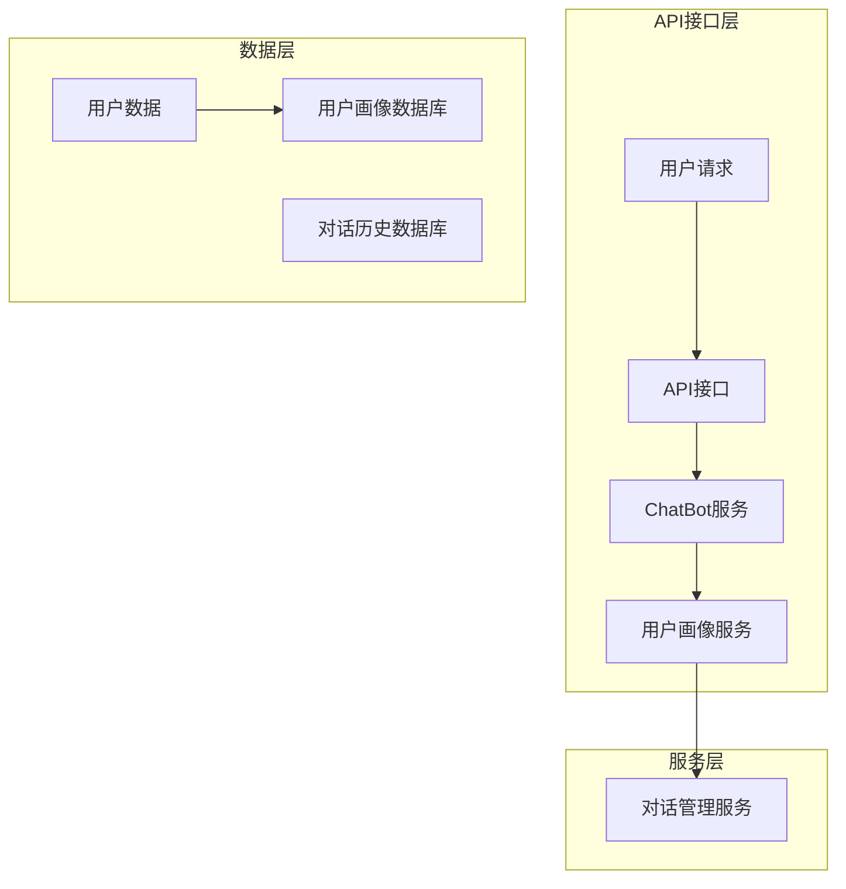

**系统接口设计和交互（Mermaid序列图）**：

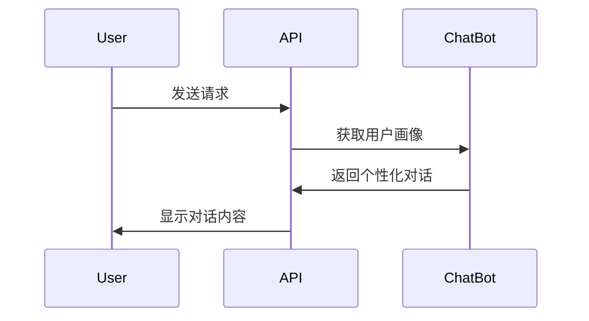

**核心实现与代码解读**：

```python
import requests

# 获取用户画像接口
def get_user_profile(user_id):
    url = f"https://api.chatbot.com/profile/{user_id}"
    response = requests.get(url)
    return response.json()

# 生成个性化对话接口
def generate_dialog(user_profile):
    url = "https://api.chatbot.com/dialog"
    headers = {
        "Content-Type": "application/json",
    }
    data = {
        "profile": user_profile,
    }
    response = requests.post(url, headers=headers, json=data)
    return response.json()

# 用户交互
def main():
    user_id = input("请输入您的用户ID：")
    user_profile = get_user_profile(user_id)
    dialog = generate_dialog(user_profile)
    print("对话内容：", dialog["content"])

if __name__ == "__main__":
    main()
```

**实际案例分析与详细讲解**：
- **案例背景**：用户在电商平台上购物，希望与聊天机器人进行互动。
- **用户交互**：用户输入请求，聊天机器人根据用户画像生成个性化对话。
- **案例效果**：聊天机器人能够根据用户的偏好提供个性化服务，提高用户满意度。

**项目小结**：
- 通过定制化聊天机器人，我们可以根据用户需求提供个性化的服务，提高用户体验。

#### 7.2 项目二：智能客服系统

**项目介绍**：智能客服系统旨在自动处理用户咨询，提供快速、准确的解决方案。

**系统功能设计（Mermaid类图）**：

```mermaid
classDiagram
    User <<Class>> "用户"
    ChatBot <<Class>> "聊天机器人"
    KnowledgeBase <<Class>> "知识库"
    Dialog <<Class>> "对话管理"

    User --> ChatBot
    ChatBot --> Dialog
    Dialog --> KnowledgeBase
```

**系统架构设计（Mermaid架构图）**：

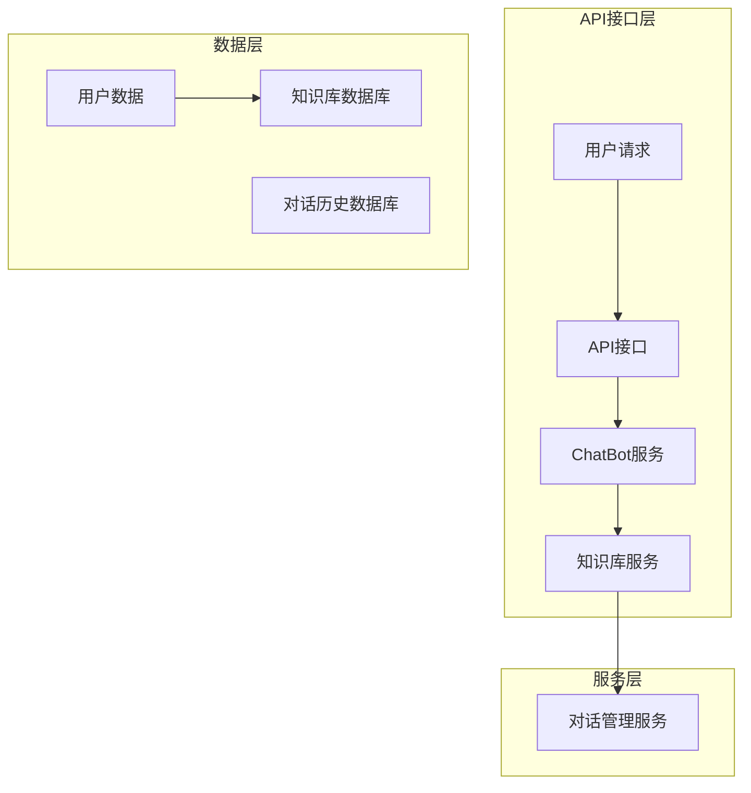

**系统接口设计和交互（Mermaid序列图）**：

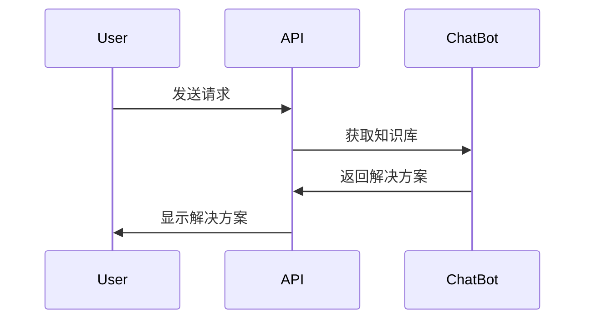

**核心实现与代码解读**：

```python
import requests

# 获取知识库接口
def get_knowledge_base():
    url = "https://api.chatbot.com/knowledge"
    response = requests.get(url)
    return response.json()

# 生成解决方案接口
def generate_solution(knowledge_base, user_request):
    url = "https://api.chatbot.com/solution"
    headers = {
        "Content-Type": "application/json",
    }
    data = {
        "knowledge": knowledge_base,
        "request": user_request,
    }
    response = requests.post(url, headers=headers, json=data)
    return response.json()

# 用户交互
def main():
    user_request = input("您有什么问题需要帮助吗？")
    knowledge_base = get_knowledge_base()
    solution = generate_solution(knowledge_base, user_request)
    print("解决方案：", solution["solution"])

if __name__ == "__main__":
    main()
```

**实际案例分析与详细讲解**：
- **案例背景**：用户在电商平台上遇到购物问题，需要客服帮助。
- **用户交互**：用户输入请求，聊天机器人通过知识库生成解决方案。
- **案例效果**：智能客服系统能够快速、准确地解决用户问题，提高客服效率。

**项目小结**：
- 通过智能客服系统，我们可以实现高效的客服服务，提高用户满意度。

#### 7.3 项目三：教育辅导机器人

**项目介绍**：教育辅导机器人旨在为用户提供个性化的学习辅导，根据学生的学习情况和需求进行互动。

**系统功能设计（Mermaid类图）**：

```mermaid
classDiagram
    Student <<Class>> "学生"
    Tutor <<Class>> "辅导机器人"
    LearningPlan <<Class>> "学习计划"
    Quiz <<Class>> "测试"

    Student --> Tutor
    Tutor --> LearningPlan
    Tutor --> Quiz
```

**系统架构设计（Mermaid架构图）**：

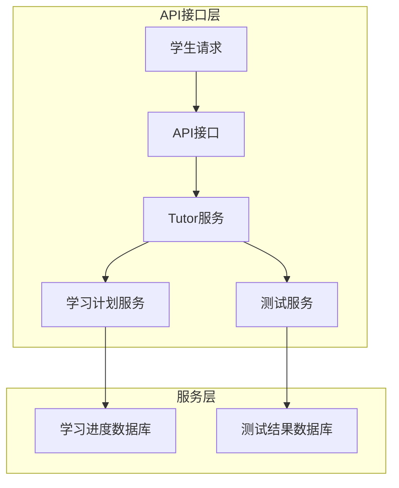

**系统接口设计和交互（Mermaid序列图）**：

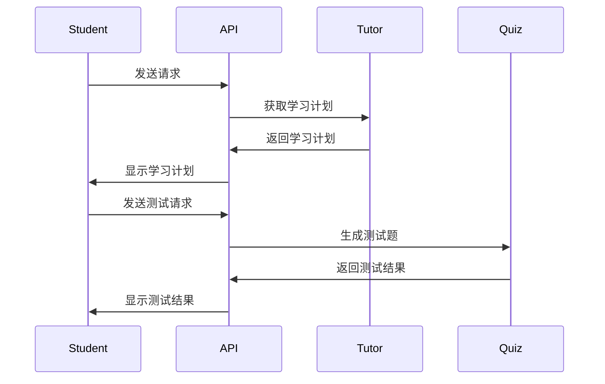

**核心实现与代码解读**：

```python
import requests

# 获取学习计划接口
def get_learning_plan(student_id):
    url = f"https://api.tutor.com/plan/{student_id}"
    response = requests.get(url)
    return response.json()

# 生成测试题接口
def generate_quiz(student_id):
    url = f"https://api.tutor.com/quiz/{student_id}"
    response = requests.post(url)
    return response.json()

# 学生交互
def main():
    student_id = input("请输入您的学生ID：")
    learning_plan = get_learning_plan(student_id)
    print("学习计划：", learning_plan["plan"])
    quiz = generate_quiz(student_id)
    print("测试结果：", quiz["results"])

if __name__ == "__main__":
    main()
```

**实际案例分析与详细讲解**：
- **案例背景**：学生希望通过教育辅导机器人获得个性化学习辅导。
- **用户交互**：学生输入请求，辅导机器人生成学习计划和测试题。
- **案例效果**：教育辅导机器人能够根据学生的学习情况提供个性化的辅导，提高学习效果。

**项目小结**：
- 通过教育辅导机器人，我们可以为学生提供个性化的学习辅导，提高学习效果。

### 总结

通过上述三个实战项目，我们可以看到ChatGPT在定制化聊天机器人、智能客服系统和教育辅导机器人中的应用效果。这些项目不仅展示了ChatGPT的强大功能，还通过实际操作帮助读者深入理解并掌握ChatGPT的提示词编写技巧和应用策略。希望通过这些项目，读者能够将所学知识应用于实际工作中，提升工作效率和用户体验。

## 第八部分：总结与展望

### 第8章：总结与展望

通过前七章的内容，我们全面探讨了ChatGPT提示词编写的技巧、策略与实践。本章将对全文内容进行总结，展望未来发展趋势，并推荐拓展阅读与资源。

### 8.1 ChatGPT提示词编写总结

**核心要点**：

- **背景与核心概念**：介绍了ChatGPT的发展背景、核心概念和应用领域。
- **基础与核心模型**：详细解释了ChatGPT的工作原理、核心模型和基础应用。
- **技巧与方法**：探讨了设计高质量提示词的原则、类型与应用策略。
- **策略与优化**：介绍了对话策略、数据集选择与处理、模型调优与参数调整。
- **实战与案例分析**：通过具体案例展示了ChatGPT在不同领域的应用效果。
- **实践与提升**：介绍了多模态交互、外部API集成、实时交互与消息队列等进阶技巧。
- **实战项目**：详细介绍了定制化聊天机器人、智能客服系统和教育辅导机器人的实战项目。

**关键知识点**：

- ChatGPT的工作原理和核心模型。
- 设计高质量提示词的原则和策略。
- 模型调优与参数调整的方法。
- 多模态交互、外部API集成等进阶技巧。

### 8.2 未来发展趋势

**技术趋势**：

- **多模态交互**：结合文本、图像、音频等多种数据类型，提升交互体验。
- **个性化服务**：利用用户数据和行为特征，提供个性化的服务和建议。
- **安全性提升**：加强数据隐私保护和模型安全性，确保用户数据的安全。
- **实时交互**：实现更加实时、高效的用户互动，提高系统响应速度。

**行业应用**：

- **智能客服**：广泛用于企业客服，提高服务效率和质量。
- **教育辅导**：应用于个性化学习辅导，提升学习效果。
- **内容生成**：用于自动生成文章、报告、邮件等，提高内容创作效率。
- **医疗咨询**：提供专业的医疗咨询服务，辅助医生诊断和治疗。

### 8.3 拓展阅读与资源

**推荐书籍**：

1. 《GPT-3：The Power of AI Language Models》
2. 《自然语言处理原理与实践》
3. 《深度学习：针对NLP的应用》

**在线课程**：

1. Coursera上的《自然语言处理与深度学习》
2. Udacity的《Chatbot Development with Python》
3. edX的《Machine Learning with TensorFlow》

**技术社区**：

1. Stack Overflow
2. GitHub
3. AI Tech Report

**开源项目**：

1. Hugging Face Transformers
2. Google's BERT
3. OpenAI GPT-3

通过这些拓展资源和知识，读者可以进一步深化对ChatGPT提示词编写的理解和应用。

### 总结

ChatGPT提示词编写是一项复杂的任务，但通过系统学习和实践，我们可以设计出高质量、高效的提示词，充分发挥ChatGPT的性能。未来，随着技术的不断进步，ChatGPT将在更多领域发挥重要作用，为人类带来更多的便利和创新。希望读者能够持续学习和探索，将所学知识应用于实际工作中，推动人工智能的发展。

---

### 作者信息

**作者：AI天才研究院/AI Genius Institute & 禅与计算机程序设计艺术 /Zen And The Art of Computer Programming**

AI天才研究院（AI Genius Institute）专注于人工智能前沿技术的研发与普及。致力于培养下一代人工智能专家，推动人工智能技术的发展和应用。同时，研究院还专注于将人工智能技术与传统文化相结合，探索禅与计算机程序设计艺术相结合的新路径。本研究院的作品《禅与计算机程序设计艺术》深受读者喜爱，被誉为计算机领域的经典之作。

