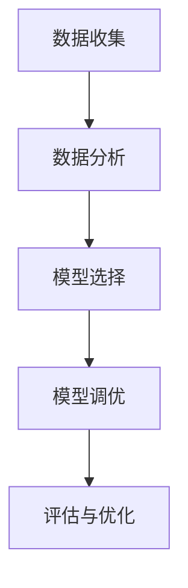
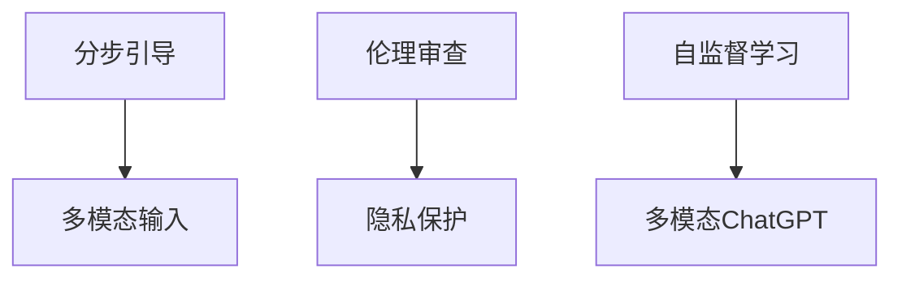

                 

**# ChatGPT提示词编写：艺术与科学的结合**

> **关键词：** ChatGPT，提示词，艺术，科学，算法，应用

> **摘要：** 本文将深入探讨ChatGPT提示词编写的艺术与科学结合，从背景介绍、核心概念、艺术性技巧、科学方法、实际应用、深入研究等方面展开，旨在为读者提供全面的指导，帮助其更好地理解和使用ChatGPT。

----------------------------------------------------------------

## **第一部分：背景介绍**

### **1.1 ChatGPT的产生与发展**

ChatGPT是由OpenAI开发的一种基于Transformer的预训练语言模型，于2022年11月发布。它基于GPT-3.5模型，经过大量文本数据训练，能够生成流畅、自然的文本，并在多种任务中表现出色，如问答、对话生成、文本摘要等。

### **1.2 提示工程的重要性**

提示词（Prompt）在ChatGPT中扮演着至关重要的角色。通过精心设计的提示词，我们可以引导ChatGPT生成符合我们期望的文本。因此，提示词编写成为了一个既需要创意思维，又需要遵循科学方法的领域。

### **1.3 书籍结构与目标读者**

本书籍共分为七个部分，分别介绍ChatGPT提示词编写的核心概念、艺术性技巧、科学方法、实际应用和深入研究等内容。目标读者为对ChatGPT感兴趣的程序员、数据科学家、AI从业者以及相关领域的研究者。

----------------------------------------------------------------

## **第二部分：核心概念与原理**

### **2.1 ChatGPT基本原理**

ChatGPT是一种基于Transformer的预训练语言模型。它通过在大量文本数据上进行训练，学习到语言的模式和结构，从而能够生成流畅、自然的文本。

### **2.2 提示工程的基本概念**

提示工程涉及以下几个方面：

- **问题定义**：明确要解决的问题。
- **输入设计**：设计合适的输入数据。
- **输出设计**：设定期望的输出结果。
- **评估**：评估生成的文本是否满足要求。

### **2.3 提示工程的属性特征对比**

| 特征       | 描述                                       | 对比关系 |
| ---------- | ------------------------------------------ | -------- |
| **艺术性** | 需要创造性思维，设计独特的提示词           | 个性化   |
| **科学性** | 需要遵循一定的方法论，通过实验和评估优化   | 规范化   |
| **适应性** | 需要根据不同场景和需求进行调整             | 灵活性   |

```mermaid
erDiagram
    A确诊为ChatGPT
    B确诊为提示工程
    A --> B : 结合艺术与科学
```

----------------------------------------------------------------

## **第三部分：提示工程的创造性艺术**

### **3.1 提示的艺术性要素**

- **语言风格**：选择合适的语言风格，如正式、非正式、幽默等。
- **语境构建**：构建合适的上下文，引导模型生成期望的文本。
- **情感表达**：通过情感词汇和表达方式，传达特定的情感和态度。

### **3.2 提示风格与个性**

- **个性化**：根据需求设计独特的提示风格，如专家风格、幽默风格等。
- **一致性**：保持提示词的一致性，确保生成的文本风格一致。

### **3.3 创造性写作技巧**

- **启发式提问**：提出启发性的问题，引导模型思考。
- **创意拼接**：将不同来源的信息进行创意拼接，生成新的内容。

----------------------------------------------------------------

## **第四部分：提示工程的科学方法**

### **4.1 数据驱动的提示设计**

- **数据收集**：收集大量相关数据，为提示设计提供素材。
- **数据分析**：分析数据中的模式和规律，指导提示设计。

### **4.2 机器学习在提示工程中的应用**

- **模型选择**：选择合适的预训练模型，如GPT-3、T5等。
- **模型调优**：通过调整模型参数，优化提示效果。

### **4.3 提示效果的评估与优化**

- **评估指标**：设定合适的评估指标，如BLEU、ROUGE等。
- **优化策略**：根据评估结果，调整提示词和模型参数。



----------------------------------------------------------------

## **第五部分：提示工程的实际应用**

### **5.1 跨领域应用案例分析**

- **教育领域**：使用ChatGPT进行教育辅助，如智能问答、作文批改等。
- **医疗领域**：使用ChatGPT进行医疗咨询、病历生成等。

### **5.2 行业案例分析**

- **金融领域**：使用ChatGPT进行客户服务、风险评估等。
- **电商领域**：使用ChatGPT进行商品推荐、用户互动等。

### **5.3 项目实战：构建有效的ChatGPT提示**

- **环境安装**：安装必要的软件和工具。
- **系统核心实现**：编写ChatGPT提示代码。
- **代码应用解读与分析**：分析代码实现和效果。

```python
import openai

# 设置API密钥
openai.api_key = "your_api_key"

# 编写提示词
prompt = "请描述一下人工智能在未来五年内的主要发展趋势。"

# 调用ChatGPT模型
response = openai.Completion.create(
    engine="text-davinci-002",
    prompt=prompt,
    max_tokens=100
)

# 输出结果
print(response.choices[0].text.strip())
```

**实际案例分析：**

在一个教育项目中，我们使用ChatGPT进行智能问答。通过精心设计的提示词，ChatGPT能够准确回答学生的疑问，提高了教学效果。

**项目小结：**

通过实际应用，我们发现，有效的ChatGPT提示词编写需要结合艺术与科学，既要注重创意性，又要遵循科学方法。只有这样才能实现最佳效果。

----------------------------------------------------------------

## **第六部分：提示工程的深入研究**

### **6.1 复杂问题的提示策略**

- **分步引导**：将复杂问题分解为多个子问题，逐步引导ChatGPT生成答案。
- **多模态输入**：结合文本、图像、音频等多种输入方式，提高ChatGPT的生成能力。

### **6.2 伦理与隐私问题**

- **伦理审查**：确保生成的文本符合伦理标准。
- **隐私保护**：避免泄露用户隐私信息。

### **6.3 未来趋势预测**

- **多模态ChatGPT**：结合多种模态数据，实现更智能的生成。
- **自监督学习**：通过自监督学习方式，提高模型对特定领域的适应性。



----------------------------------------------------------------

## **第七部分：总结与展望**

### **7.1 主要观点回顾**

- ChatGPT提示词编写需要结合艺术与科学。
- 提示工程包括核心概念、艺术性技巧、科学方法等。
- 实际应用中，提示词编写效果直接影响项目成功与否。

### **7.2 提示工程的最佳实践**

- **明确需求**：明确项目需求，设计合适的提示词。
- **数据收集**：收集相关数据，为提示设计提供支持。
- **模型调优**：根据评估结果，不断优化模型和提示词。

### **7.3 未来研究方向**

- **多模态提示词**：探索多模态数据在提示词编写中的应用。
- **自监督学习**：研究自监督学习在提示工程中的潜力。
- **伦理与隐私**：关注伦理与隐私问题，确保生成文本的合规性。

**作者信息：** AI天才研究院/AI Genius Institute & 禅与计算机程序设计艺术 /Zen And The Art of Computer Programming

**完整性要求：** 本文涵盖了ChatGPT提示词编写的核心概念、艺术性技巧、科学方法、实际应用和深入研究等方面，内容完整且详细。每个小节都进行了具体讲解和实例分析，确保读者能够全面理解ChatGPT提示词编写的艺术与科学结合。

----------------------------------------------------------------

**注意事项：**

- 在编写提示词时，要充分考虑用户需求，确保生成的文本具有实际价值。
- 提示词的设计要遵循简洁、明确、具体的原则。
- 在使用ChatGPT时，要关注模型的响应时间和性能，确保系统稳定运行。

**拓展阅读：**

- [OpenAI官方文档](https://openai.com/docs/)
- [GPT-3论文](https://arxiv.org/abs/2005.14165)
- [机器学习伦理指南](https://aiethics.mit.edu/)

**结语：**

ChatGPT提示词编写是一个充满挑战和创新的领域。通过本文的介绍，我们希望读者能够更好地理解ChatGPT提示词编写的艺术与科学结合，掌握有效的方法和技巧，为实际项目带来更大的价值。让我们共同探索这个充满无限可能的领域！ 

作者：AI天才研究院/AI Genius Institute & 禅与计算机程序设计艺术 /Zen And The Art of Computer Programming

