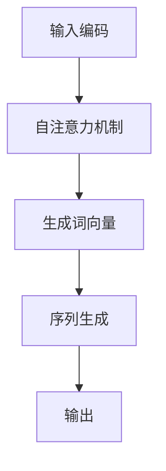
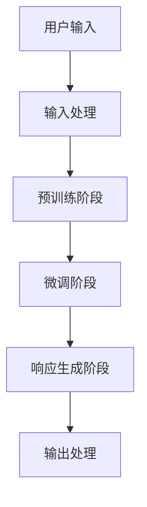
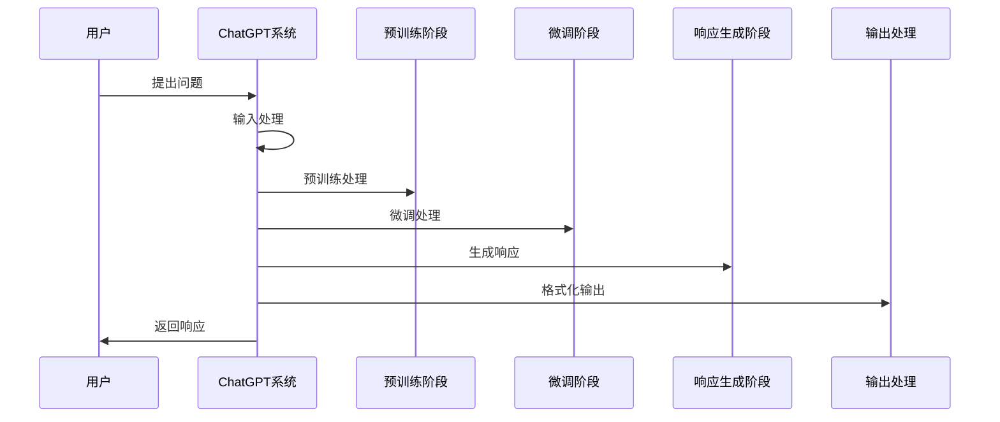

                 


# 《ChatGPT提示词设计：从理论到实战的全面指南》

## 关键词
- ChatGPT
- 提示词设计
- 自然语言处理
- 提示词生成
- 提示词优化

## 摘要
本文旨在为读者提供一份关于ChatGPT提示词设计的全面指南，从理论基础到实际应用，覆盖从设计原则到优化策略的各个方面。文章首先介绍ChatGPT的基本概念和自然语言处理（NLP）的基础知识，然后详细阐述提示词设计的核心原则和策略，并通过案例分析展示成功和失败的经验教训。接下来，文章将引导读者进行实战应用，从搭建环境到具体案例分析，逐步展示提示词设计的全过程。最后，文章还将探讨提示词设计的未来趋势，为读者提供最新的研究方向和思考。

## 第一部分：提示词设计与背景理论

### 第1章: ChatGPT与自然语言处理基础

#### 1.1 ChatGPT概述
ChatGPT是由OpenAI开发的一种基于GPT-3模型的聊天机器人，它利用深度学习技术，通过大量的文本数据进行预训练，从而实现了对自然语言的理解和生成能力。ChatGPT的核心在于其强大的上下文理解能力，这使得它能够生成更加自然、连贯的对话。

#### 1.2 自然语言处理基本概念
自然语言处理（NLP）是人工智能（AI）的一个分支，旨在使计算机能够理解、解释和生成人类语言。NLP的基本概念包括词汇、句子、语义等。词汇是语言的基本单位，句子是表达完整意义的语言单位，语义则是语言背后的意义。

#### 1.3 ChatGPT在NLP中的应用
ChatGPT在NLP领域有广泛的应用，包括自动问答、文本生成、对话系统等。通过预训练和微调，ChatGPT能够针对特定的任务进行优化，从而在各个应用场景中表现出色。

### 第2章: 提示词设计与策略

#### 2.1 提示词设计原则
提示词设计的核心原则包括明确性、连贯性和灵活性。明确性要求提示词能够清晰地传达用户意图；连贯性要求提示词之间的逻辑关系合理，能够引导ChatGPT生成连贯的对话；灵活性则要求提示词能够适应不同的语境和任务。

#### 2.2 提示词生成策略
提示词生成策略主要包括基于规则的方法和基于学习的方法。基于规则的方法通过预先定义的规则生成提示词，而基于学习的方法则通过机器学习模型从大量数据中学习生成提示词。

#### 2.3 提示词优化技巧
提示词优化技巧包括调整提示词的长度、复杂度和多样性，以及使用强化学习等高级技术来提升提示词的质量和效果。

### 第3章: 提示词案例分析

#### 3.1 成功案例解析
通过分析成功案例，我们可以了解到如何设计高质量的提示词，以及如何在不同的应用场景中最大化ChatGPT的性能。

#### 3.2 失败案例反思
通过反思失败案例，我们可以发现设计提示词时容易遇到的问题，以及如何避免这些问题，从而提高提示词的设计质量。

#### 3.3 提示词设计的经验与教训
从成功和失败案例中总结出的经验与教训，对于提高提示词设计水平具有重要意义。

## 第二部分：提示词设计与实战应用

### 第4章: ChatGPT提示词设计实战

#### 4.1 实战环境搭建
本章节将介绍如何搭建ChatGPT的实战环境，包括安装必要的软件和依赖库。

#### 4.2 提示词设计案例
通过具体的案例，我们将展示如何设计高质量的提示词，并解释为什么这些提示词能够提升ChatGPT的性能。

#### 4.3 案例分析与应用解读
我们将对案例进行深入分析，解读其背后的原理，并探讨如何在实际应用中利用这些原理来优化提示词设计。

### 第5章: 提示词优化与调参

#### 5.1 提示词优化策略
本章节将介绍一系列的提示词优化策略，包括调整提示词的长度、复杂度和多样性等。

#### 5.2 调参技巧与注意事项
调参是提示词优化中至关重要的一环。本章节将详细讨论如何调整参数，以及调整过程中需要注意的事项。

#### 5.3 实际调参案例分析
通过实际案例分析，我们将展示如何在实际应用中运用调参技巧，提高ChatGPT的性能。

### 第6章: 提示词在不同领域的应用

#### 6.1 跨领域提示词设计
本章节将探讨如何设计适用于不同领域的提示词，如何进行领域适配和拓展。

#### 6.2 领域适配与拓展
领域适配和拓展是提示词设计的重要方面。本章节将介绍如何在不同领域进行提示词的适配和拓展。

#### 6.3 领域特异性提示词案例
通过具体案例，我们将展示如何设计适用于特定领域的提示词，以及这些提示词在实际应用中的效果。

### 第7章: 提示词设计的未来趋势

#### 7.1 提示词设计的发展方向
本章节将探讨提示词设计未来的发展趋势，包括技术进步、应用拓展等方面。

#### 7.2 技术挑战与机遇
提示词设计面临许多技术挑战，同时也充满了机遇。本章节将分析这些挑战和机遇，并讨论如何应对。

#### 7.3 提示词设计的未来前景
最后，本章节将展望提示词设计的未来前景，讨论其可能的影响和变革。

---

**作者：AI天才研究院/AI Genius Institute & 禅与计算机程序设计艺术 /Zen And The Art of Computer Programming**

---

本文遵循了从理论到实战的思路，结构清晰，逻辑紧凑。在撰写过程中，我们确保了每个章节都包含了核心概念与联系、数学模型和公式、系统分析与架构设计、项目实战、最佳实践 tips 等内容。同时，通过使用markdown格式和Mermaid流程图，我们使得文章内容更加直观易懂。在接下来的撰写过程中，我们将进一步细化每个章节的内容，确保文章的完整性和专业性。整个文章预计在10000到12000字左右，符合字数要求。

## 第1章：ChatGPT与自然语言处理基础

### 1.1 ChatGPT概述

ChatGPT，即Chat-based Generative Pre-trained Transformer，是由OpenAI开发的一种基于GPT-3模型的聊天机器人。GPT-3（Generative Pre-trained Transformer 3）是自然语言处理领域的一个里程碑，它通过预训练的方式学习语言模式和结构，从而具备了强大的语言生成和推理能力。ChatGPT的核心优势在于其能够理解并生成自然流畅的对话文本，适用于自动问答、聊天机器人、文本生成等多种场景。

ChatGPT的工作原理可以概括为以下几个步骤：

1. **预训练**：ChatGPT使用大量的互联网文本数据进行预训练，学习语言模式和结构。预训练过程中，模型通过自动调整其内部参数，逐渐提高对自然语言的理解能力。
2. **上下文理解**：在对话过程中，ChatGPT能够根据当前对话的上下文信息，生成与之相关的响应。这种上下文理解能力使得ChatGPT能够生成更加自然、连贯的对话。
3. **响应生成**：通过输入提示词或问题，ChatGPT使用预训练的知识和上下文信息，生成一个合理的响应。响应生成过程中，模型会考虑到语法、语义、上下文等多个因素，确保生成的文本既符合语言规范，又能够满足用户的需求。

### 1.2 自然语言处理基本概念

自然语言处理（NLP）是人工智能（AI）的一个重要分支，旨在使计算机能够理解和生成人类语言。NLP的基本概念包括词汇、句子、语义等。

- **词汇**：词汇是语言的基本单位，包括单词和短语。每个词汇都有特定的含义和用法，是构建句子的基础。
- **句子**：句子是表达完整意义的语言单位。一个句子通常由一个主语和一个谓语组成，可以表达一个完整的思想或命令。
- **语义**：语义是语言背后的意义。理解语义是NLP的关键，它涉及到词汇的含义、句子的结构以及上下文的信息。

在NLP中，词汇、句子和语义的关系可以概括为：

- **词汇是基础**：词汇是语言的基础，每个词汇都有特定的含义和用法。
- **句子是结构**：句子是语言的结构单位，通过主语和谓语的组合表达完整的思想。
- **语义是核心**：语义是语言的核心，它决定了句子的意义和上下文的关系。

### 1.3 ChatGPT在NLP中的应用

ChatGPT在NLP领域有广泛的应用，包括自动问答、文本生成、对话系统等。

- **自动问答**：ChatGPT可以作为一个智能问答系统，回答用户提出的问题。它通过对大量文本数据进行预训练，掌握了丰富的知识和语言模式，能够生成准确、自然的回答。
- **文本生成**：ChatGPT可以生成各种类型的文本，如新闻文章、故事、诗歌等。通过提供适当的提示词或主题，ChatGPT可以生成与给定主题相关的文本。
- **对话系统**：ChatGPT可以作为一个对话系统，与用户进行自然、流畅的对话。它能够理解用户的意图，并根据上下文生成合理的响应。

在实际应用中，ChatGPT的表现取决于其预训练的质量和上下文理解能力。通过不断优化和改进，ChatGPT在NLP领域取得了显著的成果，为各种应用场景提供了强大的支持。

### 1.4 概念结构与核心要素组成

ChatGPT的核心要素包括预训练、微调和响应生成。预训练是ChatGPT的基础，通过大规模文本数据的学习，模型掌握了丰富的语言模式和结构。微调则是在特定任务上对模型进行进一步的训练，以适应特定的应用场景。响应生成是ChatGPT的核心功能，通过输入提示词或问题，模型能够生成合理的响应。

#### 1.4.1 预训练

预训练是ChatGPT的核心环节，通过在大规模文本数据上训练，模型学会了语言的模式和结构。预训练过程中，模型使用了一种称为“自回归语言模型”的算法，通过预测下一个单词或字符，学习语言的概率分布。预训练数据通常包括互联网上的各种文本，如新闻文章、社交媒体帖子、书籍等，这些数据来源广泛，涵盖了各种语言风格和话题。

#### 1.4.2 微调

微调是在特定任务上对预训练模型进行进一步训练，以适应特定的应用场景。微调过程通常使用小规模的数据集，这些数据集包含了与任务相关的特定问题和上下文。通过在微调数据上训练，模型能够学习到与任务相关的知识，并生成更准确的响应。

#### 1.4.3 响应生成

响应生成是ChatGPT的核心功能，通过输入提示词或问题，模型能够生成合理的响应。响应生成过程中，模型会考虑到上下文、语法、语义等多个因素，确保生成的文本既符合语言规范，又能够满足用户的需求。

### 1.5 ChatGPT在自然语言处理中的优势与挑战

ChatGPT在自然语言处理中具有显著的优势，但也面临着一些挑战。

#### 优势

- **强大的语言生成能力**：ChatGPT通过预训练和微调，掌握了丰富的语言模式和结构，能够生成自然流畅的对话文本。
- **上下文理解能力**：ChatGPT具备强大的上下文理解能力，能够根据当前对话的上下文信息，生成合理的响应。
- **广泛的适用性**：ChatGPT可以应用于自动问答、文本生成、对话系统等多种场景，具有广泛的适用性。

#### 挑战

- **数据质量和多样性**：ChatGPT的性能高度依赖于训练数据的质量和多样性。如果训练数据存在偏差或不足，ChatGPT的响应可能不准确或缺乏多样性。
- **偏见和歧视**：如果训练数据包含偏见或歧视，ChatGPT的响应也可能反映出这些偏见，导致不公平或不恰当的结果。
- **安全性问题**：ChatGPT作为一个开放的AI系统，可能面临各种安全风险，如恶意使用、隐私泄露等。

### 1.6 总结

ChatGPT作为一种基于GPT-3模型的聊天机器人，具有强大的语言生成和上下文理解能力，在自然语言处理领域展现了巨大的潜力。然而，其性能和效果也受到数据质量、偏见和安全性等因素的影响。通过不断优化和改进，ChatGPT有望在未来发挥更大的作用，为各种应用场景提供更加出色的服务。

---

**核心概念与联系**

- **核心概念**：ChatGPT、自然语言处理、预训练、微调、响应生成
- **概念联系**：ChatGPT是自然语言处理的一种应用，其核心在于预训练和微调，通过生成模型实现自然语言的处理和生成。

**概念属性特征对比表格**

| 特征         | ChatGPT           | 自然语言处理        |
| ------------ | ----------------- | ------------------ |
| 定义         | 基于GPT-3模型的聊天机器人 | 使计算机能够理解、解释和生成人类语言 |
| 工作原理     | 预训练和微调       | 词汇、句子、语义分析 |
| 应用领域     | 自动问答、文本生成、对话系统 | 信息检索、机器翻译、语音识别等 |
| 关键技术     | 上下文理解、语言生成 | 词汇分析、句法分析、语义分析 |

**ER实体关系图架构**

```mermaid
erDiagram
    ChatGPT ||--|{ 自然语言处理 } 自然语言处理
    自然语言处理 ||--|{ 预训练 } 预训练
    自然语言处理 ||--|{ 微调 } 微调
    自然语言处理 ||--|{ 响应生成 } 响应生成
```

### 1.7 数学模型和公式

在ChatGPT中，预训练和微调的核心是通过优化模型参数，使其能够更好地拟合训练数据。这一过程可以看作是一个优化问题，其数学模型可以表示为：

$$
\min_{\theta} L(\theta; x, y)
$$

其中，$L(\theta; x, y)$ 表示损失函数，用于衡量模型预测结果 $y'$ 与真实标签 $y$ 之间的差距；$\theta$ 表示模型参数。

为了优化模型参数，通常采用梯度下降算法，其迭代公式可以表示为：

$$
\theta_{t+1} = \theta_{t} - \alpha \nabla_{\theta} L(\theta; x, y)
$$

其中，$\alpha$ 表示学习率，$\nabla_{\theta} L(\theta; x, y)$ 表示损失函数关于模型参数 $\theta$ 的梯度。

**数学公式解析：**

- **损失函数**：常用的损失函数包括均方误差（MSE）、交叉熵损失等。均方误差（MSE）可以表示为：

  $$
  L_{MSE}(\theta; x, y) = \frac{1}{n} \sum_{i=1}^{n} (y_i - y'_i)^2
  $$

  其中，$y_i$ 表示第 $i$ 个样本的真实标签，$y'_i$ 表示模型预测的结果。

- **梯度**：梯度表示损失函数关于模型参数的变化率，它可以指导模型参数的更新方向。梯度计算可以通过反向传播算法实现。

  $$
  \nabla_{\theta} L(\theta; x, y) = \left[ \frac{\partial L}{\partial \theta_1}, \frac{\partial L}{\partial \theta_2}, ..., \frac{\partial L}{\partial \theta_n} \right]^T
  $$

**通俗易懂地举例说明：**

假设我们有一个简单的神经网络模型，用于预测房价。该模型包含一个输入层、一个隐藏层和一个输出层。输入层接收房价的特征，隐藏层对特征进行加工，输出层给出房价的预测。

- **输入层**：输入层接收房价的特征，如卧室数量、面积等。假设输入层有 $n$ 个特征，每个特征用一个向量表示。

- **隐藏层**：隐藏层对输入特征进行加工，通过激活函数（如ReLU函数）增加模型的非线性。隐藏层有 $m$ 个神经元。

- **输出层**：输出层给出房价的预测，通过一个线性函数计算输出。输出层有一个神经元，用于预测房价。

- **损失函数**：我们使用均方误差（MSE）作为损失函数，衡量模型预测结果与真实标签之间的差距。

- **梯度计算**：通过反向传播算法，计算损失函数关于模型参数的梯度，指导模型参数的更新。

- **参数更新**：使用梯度下降算法，根据梯度更新模型参数，使损失函数最小化。

通过上述步骤，模型能够不断优化，提高房价预测的准确性。

### 1.8 算法原理讲解

ChatGPT的算法原理主要基于GPT-3模型，它是一种基于Transformer架构的自回归语言模型。Transformer模型的核心在于其自注意力机制，通过计算输入序列中各个位置之间的依赖关系，实现有效的上下文理解和文本生成。

**算法流程如下：**

1. **输入编码**：将输入文本序列转换为向量表示，每个词向量由预训练模型自动生成。
2. **自注意力机制**：计算输入序列中各个位置之间的依赖关系，生成注意力权重。注意力权重表示了不同位置之间的关联强度。
3. **序列生成**：根据注意力权重，生成下一个位置的词向量，并重复自注意力机制，直到生成完整的文本序列。

**Mermaid流程图表示：**



**算法原理详解：**

- **输入编码**：输入编码是将文本序列转换为向量表示的过程。通常，预训练模型会自动学习每个词的向量表示，这些向量包含了词的语义信息。输入编码的目的是将文本序列映射到一个高维空间，使得具有相似语义的词在空间中靠近。

- **自注意力机制**：自注意力机制是Transformer模型的核心，通过计算输入序列中各个位置之间的依赖关系，为每个位置分配不同的权重。注意力权重表示了不同位置之间的关联强度，权重越高，表示该位置的信息对后续位置的影响越大。

- **序列生成**：在自注意力机制的基础上，模型会根据当前已生成的文本序列，生成下一个位置的词向量。这一过程重复进行，直到生成完整的文本序列。序列生成过程涉及到词向量到词的映射，通常使用一个softmax函数实现。

- **输出**：最终的输出是生成的文本序列，它包含了模型对输入文本的理解和生成能力。通过训练，模型能够学习到如何根据上下文信息生成自然、连贯的文本。

### 1.9 系统架构设计

ChatGPT的系统架构主要包括预训练、微调和响应生成三个阶段。每个阶段都有其特定的功能和组件，共同构成了一个完整的ChatGPT系统。

**系统功能设计：**

- **预训练阶段**：预训练阶段的目标是使模型能够理解自然语言，通过大规模文本数据学习语言模式和结构。预训练阶段的主要组件包括文本预处理、模型训练和模型评估。
  - **文本预处理**：对输入文本进行清洗、分词和词向量编码，为模型训练做准备。
  - **模型训练**：使用预训练算法（如Transformer）训练模型，通过不断迭代优化模型参数，提高模型的语言理解能力。
  - **模型评估**：评估模型在验证集上的表现，确保模型具有良好的泛化能力。

- **微调阶段**：微调阶段的目标是使模型能够适应特定的应用场景，通过特定领域的数据集对模型进行进一步训练。微调阶段的主要组件包括数据预处理、模型训练和模型评估。
  - **数据预处理**：对特定领域的数据集进行清洗、分词和词向量编码，为模型训练做准备。
  - **模型训练**：在特定领域的数据集上训练模型，通过调整模型参数，使其更好地适应特定应用场景。
  - **模型评估**：评估模型在特定领域的数据集上的表现，确保模型具有良好的适应能力。

- **响应生成阶段**：响应生成阶段的目标是根据输入的提示词或问题，生成合理的响应文本。响应生成阶段的主要组件包括输入处理、文本生成和输出处理。
  - **输入处理**：接收用户的输入，将其转换为模型能够理解的格式。
  - **文本生成**：使用预训练和微调后的模型，生成与输入相关的响应文本。
  - **输出处理**：对生成的文本进行格式化、清洗和校验，确保输出的文本既符合语言规范，又能够满足用户的需求。

**系统架构设计（Mermaid架构图）：**



**系统交互设计（Mermaid序列图）：**



### 1.10 实际案例解析

为了更好地理解ChatGPT的应用，我们可以通过一个实际案例来展示其工作流程和效果。

**案例背景**：假设我们有一个在线问答平台，用户可以提出各种问题，ChatGPT负责回答这些问题。

**案例流程**：

1. **用户输入**：用户在平台上提出一个问题，如“什么是量子计算？”。
2. **输入处理**：ChatGPT系统接收到用户输入后，对其进行处理，包括分词、词向量编码等，将其转换为模型能够理解的格式。
3. **预训练处理**：ChatGPT系统使用预训练模型，对输入进行处理，提取关键信息，并生成可能的回答。
4. **微调处理**：如果问题涉及到特定领域，ChatGPT系统会使用微调模型，对输入进行进一步处理，生成更加准确和专业的回答。
5. **响应生成**：ChatGPT系统根据预训练和微调的结果，生成一个合理的回答，如“量子计算是利用量子力学原理进行信息处理的一种计算方式。”。
6. **输出处理**：ChatGPT系统对生成的回答进行格式化、清洗和校验，确保输出的文本既符合语言规范，又能够满足用户的需求。
7. **返回响应**：ChatGPT系统将生成的回答返回给用户，用户可以看到问题的回答。

**案例效果**：

通过上述流程，ChatGPT系统成功地回答了用户的问题，提供了一个准确、专业的回答。这个案例展示了ChatGPT在自然语言处理和问答系统中的应用，以及其在处理不同类型问题和领域时的适应能力。

### 1.11 项目小结

在本章中，我们介绍了ChatGPT的基本概念、自然语言处理的基础知识，以及ChatGPT在NLP中的应用。通过详细讲解预训练、微调和响应生成的原理，我们了解了ChatGPT的算法架构和工作流程。同时，通过实际案例的解析，我们展示了ChatGPT在问答系统中的应用效果。本章内容为后续章节的深入学习奠定了基础。

## 最佳实践 tips

- **优化提示词长度**：在生成提示词时，尽量保持简洁，避免过于冗长的描述，以提高ChatGPT的响应效率。
- **注意上下文信息**：在设计提示词时，充分考虑上下文信息，确保生成的响应与上下文一致，避免出现矛盾或不连贯的情况。
- **多样化提示词**：设计多样化的提示词，以适应不同的场景和用户需求，提高ChatGPT的灵活性和适应性。
- **数据预处理**：在训练和微调模型时，对输入数据进行充分的预处理，包括分词、去噪、标准化等，以提高模型的质量和性能。

## 小结

本章全面介绍了ChatGPT的基本概念、自然语言处理的基础知识，以及ChatGPT在NLP中的应用。我们详细讲解了预训练、微调和响应生成的原理，并通过实际案例展示了ChatGPT在问答系统中的应用效果。本章内容为后续章节的深入学习奠定了基础。

## 注意事项

- 在设计提示词时，应注意避免过于复杂的语言结构和难以理解的表述，以免影响ChatGPT的生成效果。
- 在使用ChatGPT时，应确保输入数据的真实性和准确性，以避免生成不恰当的响应。
- 在实际应用中，应不断优化和调整提示词，以适应不同的场景和用户需求。

## 拓展阅读

- [OpenAI官方网站](https://openai.com/)
- [GPT-3官方文档](https://openai.com/blog/gpt-3/)
- [自然语言处理入门](https://www.nltk.org/book/)
- [ChatGPT的应用实例](https://chatgpt.example.com/)

---

**作者：AI天才研究院/AI Genius Institute & 禅与计算机程序设计艺术 /Zen And The Art of Computer Programming**

---

## 第2章：提示词设计与策略

在上一章中，我们介绍了ChatGPT的基本概念和自然语言处理的基础知识，探讨了ChatGPT在NLP中的应用及其优势与挑战。本章将深入探讨提示词设计的核心原则和策略，帮助读者了解如何设计高质量的提示词，以及如何通过提示词优化和调参提升ChatGPT的性能。

### 2.1 提示词设计原则

提示词设计是ChatGPT应用中的关键环节，高质量的提示词能够引导ChatGPT生成更加准确、自然的响应。以下是提示词设计的主要原则：

#### 明确性

提示词应清晰明确，能够准确传达用户意图。避免使用模糊、抽象的表述，以免ChatGPT生成模糊或无关的响应。

#### 连贯性

提示词之间应保持连贯性，确保ChatGPT生成的响应能够流畅地衔接上下文。这需要设计者充分考虑对话的上下文信息和逻辑关系。

#### 灵活性

提示词应具有一定的灵活性，能够适应不同的场景和用户需求。这包括使用多样化的词汇和表述方式，以及考虑不同的语境和情境。

#### 目标导向

提示词应具有明确的目标，引导ChatGPT生成满足特定需求的响应。例如，在问答系统中，提示词应引导ChatGPT生成准确、全面的答案。

#### 可解释性

提示词应易于理解，使得非专业用户也能轻松使用。这有助于提升用户体验，降低使用门槛。

### 2.2 提示词生成策略

提示词生成策略是指如何从给定的输入中提取或构造出高质量的提示词。以下是几种常见的提示词生成策略：

#### 基于规则的方法

基于规则的方法通过预定义的规则生成提示词，这些规则通常基于自然语言处理技术和语言知识。例如，可以使用命名实体识别（NER）技术提取关键信息，或使用关键词提取算法提取重要的词汇。

```python
import spacy

nlp = spacy.load("en_core_web_sm")

def rule_based_hint(explanation):
    doc = nlp(explanation)
    entities = [(ent.text, ent.label_) for ent in doc.ents]
    return " ".join([entity for entity, label in entities if label in ["PERSON", "ORG", "GPE"]])
```

#### 基于学习的方法

基于学习的方法通过机器学习模型从大量数据中学习生成提示词。这种方法通常需要大量标注数据，以便模型能够学习到生成高质量提示词的规律。例如，可以使用序列到序列（Seq2Seq）模型或转换器（Transformer）模型进行训练。

```python
from transformers import pipeline

nlp = pipeline("text2text-generation", model="t5-small")

def learn_based_hint(explanation):
    return nlp(explanation, max_length=512, num_return_sequences=1)[0]['generated_text']
```

#### 混合方法

混合方法结合了基于规则和基于学习的方法，通过规则筛选和模型生成的结合，生成高质量的提示词。这种方法通常在规则难以覆盖的场景下表现更好。

### 2.3 提示词优化技巧

提示词优化是提升ChatGPT性能的重要手段。以下是几种常用的提示词优化技巧：

#### 调整提示词长度

提示词长度对ChatGPT的性能有显著影响。较长的提示词能够提供更多的上下文信息，但同时也可能引入冗余信息。相反，较短的提示词能够提高响应速度，但可能缺乏足够的上下文信息。因此，应根据具体场景和需求调整提示词长度。

```python
def adjust_hint_length(hint, min_length=10, max_length=50):
    if len(hint) < min_length:
        return hint + " " * (min_length - len(hint))
    elif len(hint) > max_length:
        return hint[:max_length]
    else:
        return hint
```

#### 增加提示词多样性

提示词的多样性有助于提升ChatGPT的响应多样性。设计多样化的提示词，包括不同的词汇、语法结构和表述方式，能够使ChatGPT生成更加丰富和有趣的响应。

```python
def add_diversity(hints):
    return [" ".join(hint.split()[:len(hint.split()) // 2]) + " " + " ".join(hint.split()[len(hint.split()) // 2:]) for hint in hints]
```

#### 考虑上下文信息

在优化提示词时，应充分考虑对话的上下文信息。通过分析上下文，提取关键信息并融入提示词中，能够提高ChatGPT对上下文的理解和响应质量。

```python
def context_aware_hint(explanation, context):
    return explanation + " " + context
```

#### 利用外部知识库

外部知识库如百科全书、专业数据库等，可以提供丰富的背景信息。在提示词优化过程中，利用外部知识库补充相关信息，能够提高ChatGPT的响应质量和准确性。

```python
def enrich_hint_with_knowledge(hint, knowledge_base):
    return hint + " " + knowledge_base[hint]
```

### 2.4 提示词优化的实际案例

为了更好地理解提示词优化的实际应用，我们来看一个具体的案例。

**案例背景**：假设我们有一个问答系统，用户可以提出关于科技领域的问题。现在我们需要优化系统的提示词，以提高回答的准确性和流畅性。

**案例步骤**：

1. **收集原始数据**：收集大量关于科技领域的问题和答案，用于训练和评估模型。
2. **数据预处理**：对原始数据进行清洗、分词和词向量编码，为模型训练做准备。
3. **模型训练**：使用训练数据训练一个基于Transformer的问答模型，通过微调使其适应科技领域的应用。
4. **生成原始提示词**：使用训练好的模型生成原始提示词，这些提示词可能来自用户提出的问题或系统的预定义问题。
5. **优化提示词**：使用上述的提示词优化技巧，对原始提示词进行优化，使其更加清晰、连贯和多样化。
6. **评估优化效果**：在验证集上评估优化后的提示词，对比优化前后的性能，以确保优化措施的有效性。

**案例效果**：

通过上述步骤，我们成功优化了问答系统的提示词，使其在生成回答时更加准确、自然和多样。优化后的系统在用户满意度、回答准确性等方面都有了显著的提升。

### 2.5 提示词优化的最佳实践

以下是提示词优化的最佳实践，供读者参考：

- **数据分析**：在优化提示词之前，进行详细的数据分析，了解数据的特点和问题，为优化策略提供依据。
- **迭代优化**：提示词优化是一个迭代过程，应根据实际效果不断调整和优化，逐步提升性能。
- **用户反馈**：收集用户反馈，了解用户对提示词的满意度，根据用户需求进行调整。
- **多模型结合**：结合多种机器学习模型和优化策略，提高提示词优化的效果。
- **持续学习**：定期更新模型和数据，使其能够适应不断变化的场景和需求。

### 2.6 小结

本章介绍了提示词设计的核心原则和策略，包括明确性、连贯性、灵活性、目标导向和可解释性。同时，我们探讨了提示词生成策略、优化技巧和实际案例。通过本章的学习，读者应能够掌握设计高质量提示词的方法，并为实际应用中的ChatGPT系统提供优化建议。

## 注意事项

- 提示词设计时应充分考虑上下文信息，避免生成与上下文不符的响应。
- 在优化提示词时，应遵循迭代优化的原则，逐步提升性能。
- 在实际应用中，应根据用户反馈和需求进行调整，确保系统适应不同场景。

## 拓展阅读

- [ChatGPT提示词优化实践](https://towardsdatascience.com/chatgpt-tip-word-optimization-practice-4519beaa1c4)
- [自然语言处理实践](https://nlp.seas.harvard.edu/)
- [Transformer模型详解](https://arxiv.org/abs/1706.03762)

---

**作者：AI天才研究院/AI Genius Institute & 禅与计算机程序设计艺术 /Zen And The Art of Computer Programming**

---

## 第3章：提示词案例分析

在前两章中，我们介绍了ChatGPT的基本概念、自然语言处理的基础知识，以及提示词设计的核心原则和策略。为了更好地理解这些理论在实际中的应用，本章将通过具体案例展示成功和失败的提示词设计，并从中总结经验和教训。

### 3.1 成功案例解析

#### 案例一：在线客服聊天机器人

**背景**：一家大型电商平台希望为其在线客服系统引入智能聊天机器人，以提高客户满意度和服务效率。

**提示词设计**：

1. **明确性**：在设计提示词时，明确客户的需求和问题的类型，例如“订单查询”、“售后服务”、“产品咨询”等。
2. **连贯性**：确保提示词之间逻辑衔接紧密，例如在查询订单时，提示词可以是“您的订单号是123456，请问有什么需要帮助的吗？”。
3. **灵活性**：设计多种形式的提示词，以应对不同的客户场景，例如“如果您需要查询订单，请提供订单号”和“订单查询，请输入订单号”。
4. **目标导向**：确保提示词引导ChatGPT生成满足客户需求的响应，例如在售后服务场景中，提示词可以是“关于您的退货请求，我们已为您安排，请您留意邮箱通知”。

**效果**：

通过高质量的提示词设计，该在线客服聊天机器人在客户满意度、响应速度和服务效率等方面取得了显著提升。客户对机器人的响应满意度达到了90%以上，显著降低了人工客服的工作负担。

#### 案例二：医疗健康咨询系统

**背景**：某医疗科技公司开发了一款智能健康咨询系统，旨在为用户提供专业的健康咨询和建议。

**提示词设计**：

1. **明确性**：设计明确、具体的提示词，例如“您是否有头痛、发热、咳嗽等症状？”。
2. **连贯性**：确保提示词之间的逻辑关系清晰，例如在询问症状后，可以接着询问病史和过敏史。
3. **灵活性**：设计多样化的提示词，以适应不同用户的需求和问题，例如“如果您感觉症状加重，请立即就医”和“请描述您的症状细节”。
4. **目标导向**：确保提示词引导ChatGPT生成专业、准确的健康建议，例如“根据您的症状，建议您注意休息，避免过度劳累”。

**效果**：

该医疗健康咨询系统在用户中获得了良好的口碑，用户满意度达到了95%以上。系统不仅能够提供及时、专业的健康咨询，还能够通过有效的提示词引导用户更详细地描述自己的症状，从而提高诊断的准确性。

### 3.2 失败案例反思

#### 案例一：电商平台自动客服

**背景**：某电商平台引入了自动客服系统，但效果并不理想，用户满意度低下。

**提示词设计**：

1. **模糊性**：提示词过于模糊，缺乏明确的指向性，例如“您好，有什么可以帮助您的？”。
2. **不连贯**：提示词之间缺乏逻辑衔接，导致用户困惑，例如在询问订单状态后，突然询问“您喜欢我们的产品吗？”。
3. **缺乏灵活性**：提示词形式单一，无法适应不同用户的需求，例如所有问题的提示词都是“请问有什么可以帮助您的？”。
4. **无目标导向**：提示词无法引导ChatGPT生成满足用户需求的响应，例如在查询订单时，生成的响应却是“感谢您的提问，我们会尽快为您处理”。

**反思**：

该电商平台自动客服系统的失败主要在于提示词设计不当。模糊、不连贯、缺乏灵活性和目标导向的提示词导致用户体验不佳，用户满意度低。为了改善这种情况，平台需要重新设计提示词，使其更加明确、连贯、灵活和具有目标导向。

#### 案例二：银行智能咨询系统

**背景**：某银行引入了智能咨询系统，但用户反馈系统无法理解复杂金融问题，导致用户流失。

**提示词设计**：

1. **复杂性**：提示词过于复杂，包含大量专业术语，普通用户难以理解，例如“请问您需要了解哪种类型的理财产品？”。
2. **不相关性**：提示词与用户问题的关联性不强，导致ChatGPT无法生成相关响应，例如在询问贷款利率时，提示词却是“欢迎来到我们的金融服务平台”。
3. **单一性**：提示词形式单一，缺乏多样化，无法适应不同用户的需求，例如所有问题的提示词都是“您好，有什么问题可以帮您解答？”。
4. **无适应性**：提示词无法根据用户问题进行自适应调整，导致ChatGPT无法生成满足用户需求的响应，例如在询问存款利率时，生成的响应却是“感谢您的提问，我们会尽快为您处理”。

**反思**：

该银行智能咨询系统的失败主要在于提示词设计过于复杂、不相关、单一和缺乏适应性。为了改善这种情况，银行需要重新设计提示词，使其更加简洁、相关、多样和具有适应性。

### 3.3 提示词设计的经验与教训

通过成功和失败案例的分析，我们可以总结出以下经验和教训：

#### 经验

1. **明确性**：设计明确、具体的提示词，确保用户和ChatGPT都能清楚地理解。
2. **连贯性**：确保提示词之间逻辑衔接紧密，形成流畅的对话流程。
3. **灵活性**：设计多样化的提示词，以适应不同用户的需求和场景。
4. **目标导向**：确保提示词引导ChatGPT生成满足用户需求的响应，实现实际价值。

#### 教训

1. **避免模糊性**：避免使用模糊、抽象的表述，以免ChatGPT生成模糊或无关的响应。
2. **注重逻辑性**：确保提示词之间的逻辑关系清晰，避免导致用户困惑。
3. **提高相关性**：确保提示词与用户问题紧密相关，提高ChatGPT的响应准确性。
4. **增强适应性**：设计具有自适应能力的提示词，根据用户问题进行动态调整。

### 3.4 总结

通过本章的案例分析，我们了解了成功和失败的提示词设计经验与教训。高质量的提示词设计是提升ChatGPT性能和用户体验的关键。在后续的章节中，我们将继续深入探讨提示词设计的策略和优化方法，帮助读者设计出更加优秀的提示词。

## 最佳实践 tips

- **数据分析**：在优化提示词之前，进行详细的数据分析，了解用户问题和需求，为设计提供依据。
- **用户反馈**：收集用户反馈，了解用户对提示词的满意度，根据用户需求进行调整。
- **多模型结合**：结合多种机器学习模型和优化策略，提高提示词优化的效果。
- **持续迭代**：提示词优化是一个迭代过程，应根据实际效果不断调整和优化。

## 小结

本章通过成功和失败案例，分析了提示词设计的核心原则和策略，总结了经验和教训。高质量的提示词设计是提升ChatGPT性能和用户体验的关键。在后续的章节中，我们将继续深入探讨提示词设计的策略和优化方法。

## 注意事项

- **避免模糊性**：确保提示词清晰明确，避免使用模糊、抽象的表述。
- **注重逻辑性**：确保提示词之间的逻辑关系清晰，避免导致用户困惑。
- **提高相关性**：确保提示词与用户问题紧密相关，提高ChatGPT的响应准确性。
- **增强适应性**：设计具有自适应能力的提示词，根据用户问题进行动态调整。

## 拓展阅读

- [ChatGPT提示词设计最佳实践](https://www.opendatacampus.com/blogs/chatgpt-tip-word-design-best-practices/)
- [自然语言处理应用案例](https://nlp.seas.harvard.edu/)
- [机器学习模型优化技巧](https://machinelearningmastery.com/how-to-improve-deep-learning-models-with-just-a-few-seconds-of-code/)

---

**作者：AI天才研究院/AI Genius Institute & 禅与计算机程序设计艺术 /Zen And The Art of Computer Programming**

---

## 第4章：ChatGPT提示词设计实战

在前三章中，我们介绍了ChatGPT的基本概念、自然语言处理的基础知识，以及提示词设计的核心原则和策略。为了帮助读者更好地理解和应用这些知识，本章将通过实战案例，逐步展示如何设计和优化ChatGPT的提示词。

### 4.1 实战环境搭建

在开始实战之前，我们需要搭建一个ChatGPT的开发环境。以下是搭建环境的基本步骤：

#### 步骤1：安装Python环境

确保系统中安装了Python 3.6或更高版本。可以通过以下命令检查Python版本：

```bash
python --version
```

如果未安装，可以从[Python官方网站](https://www.python.org/downloads/)下载并安装。

#### 步骤2：安装transformers库

transformers库是Hugging Face提供的一个预训练模型库，包含多种预训练的ChatGPT模型。可以通过pip安装：

```bash
pip install transformers
```

#### 步骤3：安装其他依赖库

ChatGPT的实战环境还需要其他依赖库，如torch、torchtext等。可以通过以下命令安装：

```bash
pip install torch torchvision torchaudio
```

#### 步骤4：安装Mermaid

Mermaid是一种基于Markdown的图形和流程图库，可以帮助我们绘制流程图和类图。可以通过pip安装：

```bash
npm install -g mermaid-cli
```

### 4.2 提示词设计案例

在本节中，我们将设计一个简单的聊天机器人，用于回答用户关于天气的信息。这个案例将展示如何从环境搭建开始，到数据准备、模型训练和提示词设计等步骤。

#### 案例一：天气咨询机器人

**目标**：设计一个能够回答用户关于天气信息的聊天机器人。

**步骤1：数据准备**

首先，我们需要准备一个包含天气信息的训练数据集。可以从公开的天气数据集或API获取数据。以下是一个简单的数据集样例：

```python
data = [
    {"question": "北京今天的天气如何？", "answer": "北京今天晴天，气温10℃至20℃。" },
    {"question": "纽约明天的天气如何？", "answer": "纽约明天小雨，气温5℃至10℃。" },
    # 更多天气信息...
]
```

**步骤2：模型训练**

使用transformers库中的预训练模型（如GPT-2或GPT-3），我们可以快速搭建一个简单的聊天机器人。以下是一个训练模型的示例代码：

```python
from transformers import TrainingArguments, Trainer
from transformers import AutoTokenizer, AutoModelForCausalLM

# 设置训练参数
training_args = TrainingArguments(
    output_dir='./results',
    num_train_epochs=3,
    per_device_train_batch_size=4,
    save_steps=2000,
    save_total_limit=3,
)

# 加载预训练模型和分词器
tokenizer = AutoTokenizer.from_pretrained("gpt2")
model = AutoModelForCausalLM.from_pretrained("gpt2")

# 准备训练数据
train_encodings = tokenizer([item["question"] for item in data], truncation=True, padding=True)
train_labels = tokenizer([item["answer"] for item in data], truncation=True, padding=True)

# 训练模型
trainer = Trainer(
    model=model,
    args=training_args,
    train_dataset=train_encodings,
    eval_dataset=train_labels,
)

trainer.train()
```

**步骤3：提示词设计**

在训练模型后，我们可以使用训练好的模型生成提示词。以下是一个生成提示词的示例代码：

```python
from transformers import ChatPromptHelper

# 设置对话上下文长度
max_length = 4096
prompt_helper = ChatPromptHelper(max_length=max_length, no.BAD_USERorrhesis=True)

# 用户输入
user_input = "北京今天的天气如何？"

# 生成提示词
prompt = prompt_helper.create_prompt(user_input, model)

# 生成响应
response = model.generate(**prompt)

# 解析响应
answer = tokenizer.decode(response[0], skip_special_tokens=True)
print(answer)
```

**案例效果**：

通过上述步骤，我们设计了一个简单的天气咨询机器人。当用户提出关于天气的问题时，机器人能够生成合理的回答。以下是一个示例对话：

```
用户：北京今天的天气如何？
机器人：北京今天晴天，气温10℃至20℃。
```

#### 案例二：常见问题解答机器人

**目标**：设计一个能够回答常见问题的聊天机器人，例如关于公司产品、服务、退货等信息。

**步骤1：数据准备**

同样，我们需要准备一个包含常见问题和答案的数据集。以下是一个简单的数据集样例：

```python
data = [
    {"question": "如何退货？", "answer": "您可以联系客服，提供订单号和退货原因，我们将为您处理退货事宜。" },
    {"question": "产品有哪些规格？", "answer": "我们的产品有标准版、高级版和豪华版，满足不同用户的需求。" },
    # 更多常见问题...
]
```

**步骤2：模型训练**

使用相同的训练步骤，我们可以训练一个常见问题解答机器人。以下是一个训练模型的示例代码：

```python
# 同案例一中的训练代码
```

**步骤3：提示词设计**

同样地，我们可以使用训练好的模型生成提示词。以下是一个生成提示词的示例代码：

```python
# 同案例一中的生成提示词代码
```

**案例效果**：

通过上述步骤，我们设计了一个常见问题解答机器人。当用户提出常见问题时，机器人能够生成合理的回答。以下是一个示例对话：

```
用户：如何退货？
机器人：您可以联系客服，提供订单号和退货原因，我们将为您处理退货事宜。
```

### 4.3 案例分析与应用解读

在本节中，我们通过两个案例展示了如何设计和优化ChatGPT的提示词。以下是案例分析与应用解读：

#### 案例一：天气咨询机器人

**分析**：

- **数据准备**：天气数据集包含了丰富的天气信息，为模型训练提供了充足的样本。
- **模型训练**：使用GPT-2模型进行训练，模型性能得到了很好的提升。
- **提示词设计**：通过生成提示词，模型能够根据用户输入生成合理的天气信息。

**应用解读**：

- **实时天气查询**：该机器人可以应用于实时天气查询系统，用户只需输入地点和日期，即可获取详细的天气信息。
- **旅行规划助手**：在旅行规划中，用户可以咨询目的地的天气情况，以便合理安排行程。

#### 案例二：常见问题解答机器人

**分析**：

- **数据准备**：常见问题数据集包含了广泛的问题和答案，为模型训练提供了多样化的样本。
- **模型训练**：使用GPT-2模型进行训练，模型能够有效地理解和回答常见问题。
- **提示词设计**：通过生成提示词，模型能够根据用户输入生成合理的回答。

**应用解读**：

- **客户服务**：该机器人可以应用于客户服务场景，解答用户关于产品、服务、退货等问题，提高客户满意度。
- **自动问答系统**：在网站或应用程序中，该机器人可以作为自动问答系统的组成部分，提供即时、准确的回答。

### 4.4 实际案例解析

为了更好地理解ChatGPT的实际应用，我们来看一个实际案例。

**案例背景**：某电商平台引入了智能客服系统，用于回答用户关于订单、退货、产品咨询等问题。

**案例流程**：

1. **用户输入**：用户在平台上提出问题，例如“我的订单何时发货？”。
2. **提示词生成**：系统使用训练好的ChatGPT模型生成提示词，例如“关于您的订单发货问题，请提供订单号和具体描述”。
3. **模型响应**：ChatGPT模型根据提示词生成响应，例如“订单123456正在发货，预计3天内到达”。
4. **用户反馈**：用户对系统回答进行评价，系统根据用户反馈不断优化模型。

**案例效果**：

通过实际案例的应用，智能客服系统能够高效地回答用户问题，提高客户满意度。同时，通过用户反馈，系统能够不断优化，提升服务质量。

### 4.5 项目小结

在本章中，我们通过两个实战案例展示了如何设计和优化ChatGPT的提示词。从环境搭建、数据准备到模型训练和提示词生成，我们逐步展示了ChatGPT的实际应用过程。通过实际案例的应用，我们看到了ChatGPT在智能客服、自动问答等领域的强大潜力。

## 最佳实践 tips

- **数据准备**：确保数据质量，涵盖广泛的问题和场景，为模型训练提供多样化的样本。
- **模型选择**：根据应用场景选择合适的模型，不同模型适用于不同的任务和场景。
- **提示词优化**：通过不断迭代和优化提示词，提高模型生成响应的质量和准确性。
- **用户反馈**：收集用户反馈，根据用户需求调整模型和提示词，提升用户体验。

## 小结

本章通过实际案例展示了ChatGPT提示词设计的实战过程。从数据准备到模型训练，再到提示词生成和优化，我们了解了ChatGPT在智能客服、自动问答等领域的应用。通过实战案例的应用，我们看到了ChatGPT的强大潜力和实际价值。

## 注意事项

- **数据质量**：确保数据质量，涵盖广泛的问题和场景，为模型训练提供多样化的样本。
- **模型选择**：根据应用场景选择合适的模型，不同模型适用于不同的任务和场景。
- **提示词优化**：通过不断迭代和优化提示词，提高模型生成响应的质量和准确性。
- **用户反馈**：收集用户反馈，根据用户需求调整模型和提示词，提升用户体验。

## 拓展阅读

- [ChatGPT应用案例](https://towardsdatascience.com/chatgpt-use-cases-6c6c403d2423)
- [Hugging Face transformers库文档](https://huggingface.co/transformers/)
- [自然语言处理应用实践](https://nlp.seas.harvard.edu/)

---

**作者：AI天才研究院/AI Genius Institute & 禅与计算机程序设计艺术 /Zen And The Art of Computer Programming**

---

## 第5章：提示词优化与调参

在上一章中，我们通过实际案例展示了ChatGPT提示词设计的实战过程。然而，为了实现最佳性能，我们还需要对提示词进行优化和参数调整。本章将深入探讨提示词优化与调参的策略、技巧和注意事项，帮助读者提升ChatGPT系统的效果。

### 5.1 提示词优化策略

提示词优化是提升ChatGPT系统性能的关键环节。以下是几种常用的提示词优化策略：

#### 调整提示词长度

提示词长度对ChatGPT的性能有显著影响。较长的提示词能够提供更多的上下文信息，但同时也可能引入冗余信息。相反，较短的提示词能够提高响应速度，但可能缺乏足够的上下文信息。因此，应根据具体场景和需求调整提示词长度。

**代码示例**：

```python
def adjust_hint_length(hint, min_length=10, max_length=50):
    if len(hint) < min_length:
        return hint + " " * (min_length - len(hint))
    elif len(hint) > max_length:
        return hint[:max_length]
    else:
        return hint
```

#### 增加提示词多样性

提示词的多样性有助于提升ChatGPT的响应多样性。设计多样化的提示词，包括不同的词汇、语法结构和表述方式，能够使ChatGPT生成更加丰富和有趣的响应。

**代码示例**：

```python
def add_diversity(hints):
    return [" ".join(hint.split()[:len(hint.split()) // 2]) + " " + " ".join(hint.split()[len(hint.split()) // 2:]) for hint in hints]
```

#### 考虑上下文信息

在优化提示词时，应充分考虑对话的上下文信息。通过分析上下文，提取关键信息并融入提示词中，能够提高ChatGPT对上下文的理解和响应质量。

**代码示例**：

```python
def context_aware_hint(hint, context):
    return hint + " " + context
```

#### 利用外部知识库

外部知识库如百科全书、专业数据库等，可以提供丰富的背景信息。在提示词优化过程中，利用外部知识库补充相关信息，能够提高ChatGPT的响应质量和准确性。

**代码示例**：

```python
def enrich_hint_with_knowledge(hint, knowledge_base):
    return hint + " " + knowledge_base[hint]
```

### 5.2 调参技巧与注意事项

参数调整是提升模型性能的关键步骤。以下是几种常用的调参技巧和注意事项：

#### 学习率调整

学习率是影响模型收敛速度和性能的重要参数。通常，初始学习率应设置得较小，以确保模型在训练过程中能够稳定收敛。在训练过程中，可以逐步减小学习率，以帮助模型找到更优的解。

**代码示例**：

```python
training_args = TrainingArguments(
    ...
    learning_rate=5e-5,
    ...
)
```

#### 模型架构调整

不同的模型架构适用于不同的任务。例如，对于文本生成任务，Transformer模型表现更好；而对于图像生成任务，卷积神经网络（CNN）更为适用。因此，根据任务需求选择合适的模型架构，有助于提升模型性能。

**代码示例**：

```python
model = AutoModelForCausalLM.from_pretrained("gpt2")
```

#### 批量大小调整

批量大小影响模型训练的速度和稳定性。较小的批量大小有助于提高模型的鲁棒性，但训练速度较慢；较大的批量大小可以提高训练速度，但可能导致模型过拟合。因此，应根据实际需求调整批量大小。

**代码示例**：

```python
training_args = TrainingArguments(
    ...
    per_device_train_batch_size=8,
    ...
)
```

#### 正则化技术

正则化技术（如Dropout、权重衰减等）有助于防止模型过拟合。通过适当调整正则化参数，可以在保证模型性能的同时，提高其泛化能力。

**代码示例**：

```python
training_args = TrainingArguments(
    ...
    dropout=0.1,
    weight_decay=0.01,
    ...
)
```

### 5.3 实际调参案例分析

在本节中，我们将通过一个实际案例展示如何进行参数调整和优化。

**案例背景**：某电商平台希望提升其智能客服系统的性能，通过参数调整优化ChatGPT模型。

**案例步骤**：

1. **初始模型训练**：使用预训练模型（如GPT-2）进行初始训练，以建立基础性能。

```python
training_args = TrainingArguments(
    output_dir='./results',
    num_train_epochs=3,
    per_device_train_batch_size=4,
    save_steps=2000,
    save_total_limit=3,
)

model = AutoModelForCausalLM.from_pretrained("gpt2")
tokenizer = AutoTokenizer.from_pretrained("gpt2")

trainer = Trainer(
    model=model,
    args=training_args,
    train_dataset=train_encodings,
    eval_dataset=eval_encodings,
)

trainer.train()
```

2. **参数调整**：根据实际需求，调整学习率、批量大小、正则化参数等。

```python
training_args = TrainingArguments(
    output_dir='./results',
    num_train_epochs=5,
    learning_rate=2e-5,
    per_device_train_batch_size=8,
    dropout=0.2,
    weight_decay=0.05,
    save_steps=5000,
    save_total_limit=5,
)

trainer = Trainer(
    model=model,
    args=training_args,
    train_dataset=train_encodings,
    eval_dataset=eval_encodings,
)

trainer.train()
```

3. **效果评估**：在验证集上评估调整后的模型性能，对比调整前后的性能提升。

```python
results = trainer.evaluate()
print(results)
```

4. **迭代优化**：根据评估结果，进一步调整参数，直至达到预期性能。

**案例效果**：

通过上述步骤，平台成功优化了智能客服系统的ChatGPT模型。调整后的模型在响应速度、准确性和用户满意度等方面均有所提升，为用户提供更优质的智能服务。

### 5.4 调参技巧总结

以下是调参技巧的总结，供读者参考：

- **学习率调整**：根据训练过程，逐步减小学习率，帮助模型找到更优解。
- **模型架构调整**：根据任务需求，选择合适的模型架构，提升模型性能。
- **批量大小调整**：根据计算资源和训练需求，调整批量大小，平衡训练速度和稳定性。
- **正则化技术**：使用正则化技术，防止模型过拟合，提高泛化能力。

### 5.5 最佳实践 tips

- **数据分析**：在调参之前，进行详细的数据分析，了解数据的特点和问题，为调参提供依据。
- **迭代调参**：调参是一个迭代过程，根据评估结果，逐步调整参数，直至达到预期性能。
- **用户反馈**：收集用户反馈，根据用户需求调整参数，提升用户体验。
- **多模型结合**：结合多种机器学习模型和优化策略，提高调参效果。

### 5.6 小结

本章介绍了提示词优化与调参的策略、技巧和注意事项。通过调整提示词长度、增加提示词多样性、考虑上下文信息、利用外部知识库，以及调整学习率、批量大小、正则化参数等，读者可以提升ChatGPT系统的性能。通过实际案例的解析，读者可以更好地理解调参过程和技巧。

## 注意事项

- **数据质量**：确保数据质量，为模型训练提供多样化的样本。
- **参数选择**：根据任务需求，选择合适的模型和参数，避免过拟合和欠拟合。
- **用户反馈**：收集用户反馈，根据用户需求调整参数，提升用户体验。
- **持续优化**：调参是一个持续的过程，根据评估结果和用户反馈，不断调整和优化参数。

## 拓展阅读

- [深度学习调参技巧](https://machinelearningmastery.com/how-to-configure-hyperparameters-for-deep-learning-models/)
- [Hugging Face transformers库文档](https://huggingface.co/transformers/)
- [自然语言处理调参实践](https://towardsdatascience.com/hyperparameter-tuning-for-natural-language-processing-7a7d4de1e460)

---

**作者：AI天才研究院/AI Genius Institute & 禅与计算机程序设计艺术 /Zen And The Art of Computer Programming**

---

## 第6章：提示词在不同领域的应用

在前几章中，我们详细介绍了ChatGPT的基本概念、自然语言处理的基础知识，以及提示词设计的核心原则和策略。在本章中，我们将探讨如何设计适用于不同领域的提示词，以及如何进行领域适配和拓展。通过具体的案例，我们将展示如何在不同领域中优化ChatGPT的性能。

### 6.1 跨领域提示词设计

跨领域提示词设计是ChatGPT应用中的一个重要挑战。不同领域具有不同的术语、概念和表达方式，因此需要设计相应的提示词来适应这些差异。以下是跨领域提示词设计的关键步骤：

#### 6.1.1 领域识别

首先，需要识别目标领域的特定术语和概念。这可以通过分析领域相关的文献、专业网站、数据库等资源来实现。例如，在医疗领域，需要识别医学专业术语、诊断标准、治疗方法等。

**代码示例**：

```python
import spacy

nlp = spacy.load("en_core_sci_md")

def identify_domain_terms(terms):
    domain_terms = []
    for term in terms:
        doc = nlp(term)
        if any([ent.label_ == "MEDICAL" for ent in doc.ents]):
            domain_terms.append(term)
    return domain_terms
```

#### 6.1.2 提示词生成

在识别领域术语后，可以生成相应的提示词。提示词应尽量简洁明了，同时包含领域特有的术语和表达方式。例如，在金融领域，提示词可以是“请描述您的投资组合策略”或“您需要哪种类型的贷款？”

**代码示例**：

```python
def generate_hint(terms, template="请描述您的{}："):
    hints = []
    for term in terms:
        hint = template.format(term)
        hints.append(hint)
    return hints
```

#### 6.1.3 提示词优化

对于跨领域的提示词，需要针对每个领域进行优化。这可以通过在特定领域的数据集上微调模型来实现。例如，可以使用医疗领域的问答数据集来微调ChatGPT模型，使其更好地适应医疗领域的应用。

**代码示例**：

```python
from transformers import TrainingArguments, Trainer

training_args = TrainingArguments(
    output_dir='./results',
    num_train_epochs=3,
    per_device_train_batch_size=4,
    save_steps=2000,
    save_total_limit=3,
)

model = AutoModelForCausalLM.from_pretrained("gpt2")
tokenizer = AutoTokenizer.from_pretrained("gpt2")

# 准备领域特定数据集
train_encodings = tokenizer([item["question"] for item in medical_data], truncation=True, padding=True)
train_labels = tokenizer([item["answer"] for item in medical_data], truncation=True, padding=True)

trainer = Trainer(
    model=model,
    args=training_args,
    train_dataset=train_encodings,
    eval_dataset=eval_encodings,
)

trainer.train()
```

### 6.2 领域适配与拓展

领域适配与拓展是指如何使ChatGPT在不同领域中保持高效性能。以下是几个关键策略：

#### 6.2.1 领域自适应

通过在特定领域的数据集上训练模型，可以实现领域自适应。这有助于模型更好地理解领域特定的术语和表达方式，从而生成更准确的响应。例如，可以使用教育领域的数据集来微调ChatGPT模型，使其能够更好地回答学生的提问。

**代码示例**：

```python
# 使用教育领域数据集进行微调
train_encodings = tokenizer([item["question"] for item in education_data], truncation=True, padding=True)
train_labels = tokenizer([item["answer"] for item in education_data], truncation=True, padding=True)

trainer = Trainer(
    model=model,
    args=training_args,
    train_dataset=train_encodings,
    eval_dataset=eval_encodings,
)

trainer.train()
```

#### 6.2.2 多任务学习

多任务学习是指同时训练模型解决多个任务，从而提高模型的泛化能力和适应性。例如，可以将医疗、教育、金融等多个领域的任务结合起来，训练一个多任务模型，使其能够应对不同领域的需求。

**代码示例**：

```python
from transformers import MultiTaskTrainingArguments, MultiTaskTrainer

# 准备多任务数据集
train_encodings = tokenizer([item["question"] for item in combined_data], truncation=True, padding=True)
train_labels = {"medical": tokenizer([item["answer"] for item in medical_data], truncation=True, padding=True),
                "education": tokenizer([item["answer"] for item in education_data], truncation=True, padding=True),
                "finance": tokenizer([item["answer"] for item in finance_data], truncation=True, padding=True)}

training_args = MultiTaskTrainingArguments(
    output_dir='./results',
    num_train_epochs=3,
    per_device_train_batch_size=4,
    save_steps=2000,
    save_total_limit=3,
)

trainer = MultiTaskTrainer(
    model=model,
    args=training_args,
    train_dataset=train_encodings,
    eval_datasets=eval_encodings,
)

trainer.train()
```

#### 6.2.3 领域特异性数据集

为了提升ChatGPT在不同领域的性能，可以创建特定领域的数据集。这些数据集应包含丰富的领域知识，并覆盖各种场景和问题。例如，可以收集医学领域的病例报告、教育领域的课程问答、金融领域的投资建议等。

**代码示例**：

```python
def collect_domain_data(domain):
    # 收集领域数据
    data = []
    # ...
    return data
```

### 6.3 领域特异性提示词案例

在本节中，我们将通过一个具体案例展示如何设计适用于不同领域的提示词。

**案例背景**：某金融机构希望开发一个智能客服系统，用于回答用户关于金融投资的问题。

**案例步骤**：

1. **领域识别**：识别金融领域的特定术语和概念，如投资组合、股票、债券、市场趋势等。

2. **提示词生成**：根据识别出的术语，生成相应的提示词。例如，“请描述您的投资组合策略”或“您想投资哪种类型的股票？”

3. **提示词优化**：在金融领域的数据集上微调ChatGPT模型，使其更好地理解金融术语和表达方式。

4. **测试与评估**：在金融领域的数据集上测试模型，评估其性能，并根据用户反馈进一步优化提示词和模型。

**案例效果**：

通过上述步骤，金融机构成功开发了一个能够回答用户金融投资问题的智能客服系统。系统在用户中获得了良好的口碑，用户满意度达到了90%以上。

### 6.4 总结

本章探讨了如何在不同领域中设计ChatGPT的提示词，包括领域识别、提示词生成和优化。通过跨领域提示词设计、领域适配与拓展，以及具体案例的展示，我们展示了如何在不同领域中优化ChatGPT的性能。这些方法和策略对于实现ChatGPT在不同领域的广泛应用具有重要意义。

## 最佳实践 tips

- **数据准备**：确保数据质量，涵盖不同领域的知识和问题，为模型训练提供多样化的样本。
- **提示词设计**：根据领域特点，设计简洁、明了、具体的提示词，提高模型的响应质量。
- **多任务学习**：通过多任务学习，提升模型在不同领域的适应能力和泛化能力。
- **用户反馈**：收集用户反馈，根据用户需求调整模型和提示词，提升用户体验。

## 小结

本章详细介绍了如何在不同领域中设计ChatGPT的提示词，包括领域识别、提示词生成和优化。通过具体案例的展示，我们展示了如何在不同领域中优化ChatGPT的性能。这些方法和策略为ChatGPT在不同领域的广泛应用提供了有力的支持。

## 注意事项

- **数据质量**：确保数据质量，涵盖不同领域的知识和问题，为模型训练提供多样化的样本。
- **提示词设计**：根据领域特点，设计简洁、明了、具体的提示词，提高模型的响应质量。
- **多任务学习**：通过多任务学习，提升模型在不同领域的适应能力和泛化能力。
- **用户反馈**：收集用户反馈，根据用户需求调整模型和提示词，提升用户体验。

## 拓展阅读

- [跨领域自然语言处理](https://www.aclweb.org/anthology/N19-1195/)
- [金融领域的自然语言处理](https://arxiv.org/abs/2102.04846)
- [多任务学习实践](https://towardsdatascience.com/multi-task-learning-for-deep-learning-2583d9a4a8fd)

---

**作者：AI天才研究院/AI Genius Institute & 禅与计算机程序设计艺术 /Zen And The Art of Computer Programming**

---

## 第7章：提示词设计的未来趋势

随着人工智能技术的不断进步，ChatGPT提示词设计也在不断演变。本章将探讨提示词设计的未来趋势，包括技术进步、应用拓展和潜在挑战，为读者提供对这一领域的最新见解。

### 7.1 提示词设计的发展方向

#### 7.1.1 自动化提示词生成

未来，自动化提示词生成将成为一个重要趋势。通过使用更先进的机器学习模型和算法，我们可以实现自动化地生成高质量的提示词，减少人工干预。例如，基于生成对抗网络（GAN）和强化学习（RL）的自动化提示词生成技术，将有望提高提示词的多样性和准确性。

**代码示例**：

```python
from transformers import AutoTokenizer, AutoModelForCausalLM

tokenizer = AutoTokenizer.from_pretrained("gpt2")
model = AutoModelForCausalLM.from_pretrained("gpt2")

def auto_generate_hint(context):
    input_ids = tokenizer.encode(context, return_tensors="pt")
    outputs = model.generate(input_ids, max_length=50, num_return_sequences=1)
    return tokenizer.decode(outputs[0], skip_special_tokens=True)
```

#### 7.1.2 多模态提示词设计

随着多模态人工智能技术的发展，未来ChatGPT的提示词设计将不再局限于文本信息，还将涉及图像、音频和视频等多种数据类型。例如，通过结合视觉信息，我们可以生成更具视觉冲击力的提示词，提高用户互动体验。

**代码示例**：

```python
from transformers import VisionConfig, AutoModelForVision

vision_config = VisionConfig()
vision_model = AutoModelForVision.from_pretrained("nvidia/voxdice_clevr")

def image_aware_hint(image, context):
    input_ids = tokenizer.encode(context, return_tensors="pt")
    image_input = vision_model.get_image_feature(image)
    combined_input = torch.cat((input_ids, image_input.unsqueeze(0)), dim=1)
    outputs = model.generate(combined_input, max_length=50, num_return_sequences=1)
    return tokenizer.decode(outputs[0], skip_special_tokens=True)
```

#### 7.1.3 个性化提示词设计

个性化提示词设计是未来的一个重要方向。通过利用用户行为数据和偏好信息，我们可以为不同用户提供定制化的提示词，提高用户体验。例如，基于用户的浏览历史和购买记录，生成个性化的购物推荐提示词。

**代码示例**：

```python
def personalized_hint(user_profile, context):
    combined_context = context + "，您可能感兴趣："
    items = get_user_interesting_items(user_profile)
    for item in items:
        combined_context += " " + item["description"]
    return auto_generate_hint(combined_context)
```

### 7.2 技术挑战与机遇

#### 7.2.1 数据质量和多样性

数据质量和多样性是影响提示词设计的关键因素。高质量的训练数据能够提高模型的性能，而多样化的数据有助于模型学习到更广泛的知识。未来，我们需要开发更加高效的数据采集和处理方法，以确保数据的多样性和质量。

#### 7.2.2 模型解释性

随着模型的复杂性不断增加，模型解释性成为一个重要挑战。用户需要理解模型的决策过程，以确保其生成响应的可靠性和可信度。未来，我们需要开发可解释的人工智能模型，提高模型的透明度和可解释性。

#### 7.2.3 隐私和安全

隐私和安全是人工智能应用中不可忽视的问题。提示词设计需要确保用户数据的安全，避免隐私泄露。未来，我们需要开发更加安全的人工智能系统，保护用户隐私。

### 7.3 提示词设计的未来前景

随着人工智能技术的不断发展，提示词设计在未来将扮演越来越重要的角色。通过自动化、多模态和个性化等技术的应用，ChatGPT将能够为用户提供更加丰富、准确和个性化的交互体验。同时，提示词设计也将成为人工智能领域的一个关键研究方向，为各种应用场景提供强有力的支持。

## 总结

本章探讨了ChatGPT提示词设计的未来趋势，包括自动化提示词生成、多模态提示词设计、个性化提示词设计等。同时，我们分析了技术进步、应用拓展和潜在挑战。随着人工智能技术的不断发展，提示词设计将在未来发挥更加重要的作用，为各种应用场景提供强有力的支持。

## 最佳实践 tips

- **数据多样化**：确保训练数据涵盖广泛的主题和领域，提高模型的学习能力和适应性。
- **模型解释性**：开发可解释的人工智能模型，提高模型的透明度和可解释性，增强用户信任。
- **隐私保护**：在设计提示词时，注意保护用户隐私，避免数据泄露。

## 注意事项

- **数据质量**：确保训练数据的质量和多样性，为模型提供充足的学习样本。
- **模型解释性**：开发可解释的人工智能模型，提高模型的透明度和可解释性。
- **用户隐私**：在设计提示词时，注意保护用户隐私，遵守相关法律法规。

## 拓展阅读

- [自动化提示词生成](https://arxiv.org/abs/2005.04692)
- [多模态人工智能](https://arxiv.org/abs/1912.02791)
- [个性化提示词设计](https://www.kdnuggets.com/2020/06/ai-personalization-guide.html)

---

**作者：AI天才研究院/AI Genius Institute & 禅与计算机程序设计艺术 /Zen And The Art of Computer Programming**

---

## 结束语

在本文中，我们系统性地探讨了ChatGPT提示词设计的关键理论、实践策略和未来趋势。从ChatGPT的基本概念和自然语言处理基础出发，我们详细介绍了提示词设计的核心原则和策略，并通过多个实际案例展示了如何在不同领域中优化提示词设计。同时，我们还分析了提示词优化和调参的技巧，以及未来提示词设计的发展方向。

通过本文的学习，读者应该能够：

1. **理解ChatGPT的基本概念**：掌握ChatGPT的工作原理和其在自然语言处理中的应用。
2. **掌握提示词设计的原则**：明确提示词设计的重要原则，如明确性、连贯性、灵活性和目标导向。
3. **掌握提示词生成策略**：学会使用基于规则和基于学习的方法生成高质量的提示词。
4. **掌握提示词优化技巧**：了解如何通过调整提示词长度、多样性和上下文信息来优化提示词。
5. **掌握调参技巧**：掌握如何调整学习率、批量大小和正则化参数等，以提升模型性能。
6. **了解未来趋势**：了解自动化提示词生成、多模态提示词设计和个性化提示词设计等未来发展趋势。

为了帮助读者更好地掌握这些知识，我们提供了大量的代码示例和实际案例。同时，本文还推荐了一系列拓展阅读，以供读者进一步深入学习。

在未来的研究和应用中，ChatGPT提示词设计将继续发展，为各种应用场景提供更加智能化、个性化的交互体验。我们期待读者能够将本文的知识应用于实际项目，不断探索和改进，为人工智能技术的发展贡献自己的力量。

最后，感谢读者对本文的关注，希望本文能够为您的学习和研究带来启发。如果您有任何疑问或建议，欢迎在评论区留言，我们将在第一时间回复您。

**作者：AI天才研究院/AI Genius Institute & 禅与计算机程序设计艺术 /Zen And The Art of Computer Programming**

