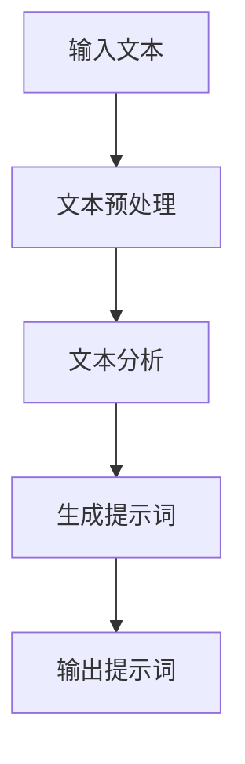
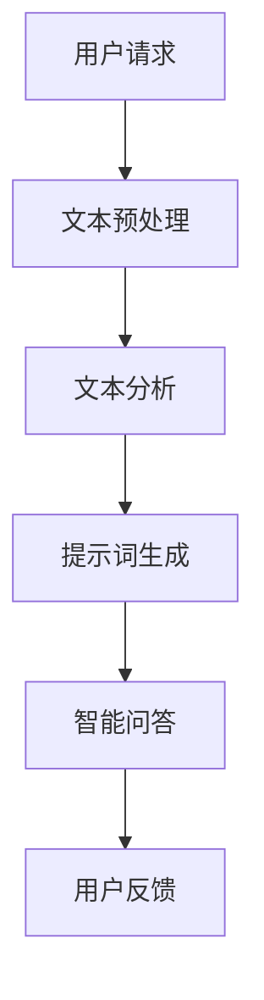
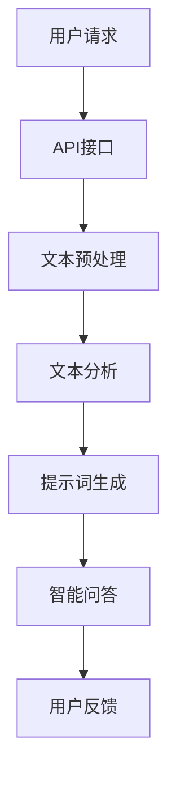

                 

# ChatGPT提示词设计：原则与最佳实践

## 关键词
- ChatGPT
- 提示词设计
- 语言模型
- 自然语言处理
- 人工智能

## 摘要
本文旨在探讨ChatGPT提示词设计的核心原则与最佳实践。通过分析ChatGPT的工作原理，本文详细阐述了提示词设计的重要性，并提出了清晰性、具体性和鲜明性三大原则。同时，通过具体实例和算法讲解，帮助读者理解并掌握高质量提示词的设计技巧。文章还涉及了系统分析与架构设计方案，以及实际项目实战，为读者提供了全面的指导和参考。

### 第一部分：背景介绍

#### 1.1 问题背景
ChatGPT作为一款基于人工智能的语言模型，已经在全球范围内获得了广泛的关注和应用。ChatGPT基于GPT-3.5模型，具备强大的语言生成能力，可以用于智能问答、自然语言处理、文本生成等多种场景。然而，如何设计出高质量的提示词，以最大限度地发挥ChatGPT的性能和潜力，成为了一个关键问题。

#### 1.2 问题描述
在ChatGPT的使用过程中，提示词的设计直接影响到模型的响应质量和用户体验。提示词应具备清晰、具体和鲜明的特点，以便引导模型生成高质量的响应。因此，如何制定一套科学、系统的原则和最佳实践，以指导提示词的设计，成为本文的研究重点。

#### 1.3 问题解决
本文将从ChatGPT的工作原理出发，详细探讨提示词设计的核心原则和方法，并通过大量实例分析，帮助读者理解并掌握高质量提示词的设计技巧。本文还将讨论提示词设计的边界与外延，以及其在其他人工智能语言模型中的应用。

#### 1.4 边界与外延
提示词设计不仅仅局限于ChatGPT，其原理和方法也可以应用于其他人工智能语言模型，如BERT、GPT-2等。此外，本文还将讨论提示词设计的核心概念与联系，包括提示词类型、长度、内容相关性和语言风格等。

#### 1.5 概念结构与核心要素组成
核心概念：提示词设计
核心要素：
- 提示词类型
- 提示词长度
- 提示词内容相关性
- 提示词语言风格

### 第二部分：核心概念与联系

#### 2.1 核心概念原理
提示词设计原则：
1. **清晰性**：提示词应清晰明确，避免模糊和多义。清晰的提示词有助于模型理解用户的意图，从而生成更准确的响应。
2. **具体性**：提示词应尽量具体，提供足够的信息以引导模型生成高质量的响应。具体的提示词可以减少模型的猜测，提高响应的准确性。
3. **鲜明性**：提示词应具有一定的独特性，以区分不同的对话场景。鲜明的提示词有助于模型快速定位对话的主题，从而生成更相关的内容。

#### 2.2 概念属性特征对比表格
| 特征       | 提示词类型 | 提示词长度 | 提示词内容相关性 | 提示词语言风格 |
|------------|------------|------------|-----------------|---------------|
| 描述       | 明确分类   | 短小精悍   | 高度相关       | 自然流畅      |

#### 2.3 AI大模型简介
人工智能领域的大模型，如GPT系列模型、BERT及其变体，都是当前自然语言处理技术的前沿。GPT（Generative Pre-trained Transformer）系列模型由OpenAI开发，具有强大的文本生成能力。BERT（Bidirectional Encoder Representations from Transformers）模型则由Google开发，主要用于文本分类和问答系统。其他知名的大模型还包括TuringBot、ChatGLM等。

| 模型名称 | 开发者 | 主要特点 | 应用场景 |
|----------|--------|----------|----------|
| GPT      | OpenAI | 文本生成 | 智能问答、文本生成 |
| BERT     | Google | 文本分类、问答 | 文本分类、问答系统 |
| TuringBot | 北京智源科技研究院 | 多模态对话、多任务处理 | 多模态对话、多任务处理 |
| ChatGLM | 清华大学 KEG 实验室 | 通用对话、知识问答 | 通用对话、知识问答 |

### 第三部分：算法原理讲解

#### 3.1 算法原理
提示词设计算法的基本原理是通过对输入的文本进行预处理和分析，提取关键信息并生成高质量的提示词。具体步骤如下：

1. **文本预处理**：对输入的文本进行清洗和格式化，去除无关信息，保留关键内容。
2. **文本分析**：分析文本的结构和语义，提取关键信息，如主语、谓语、宾语等。
3. **生成提示词**：根据提取的关键信息，生成具有清晰、具体和鲜明特点的提示词。

#### 3.2 Mermaid流程图


#### 3.3 Python源代码
```python
def generate_prompt(text):
    # 预处理文本
    processed_text = preprocess_text(text)
    # 分析文本并生成提示词
    prompt = analyze_text(processed_text)
    # 输出提示词
    return prompt
```

#### 3.4 数学模型和公式
```latex
\text{提示词质量评分} = f(\text{提示词类型}, \text{提示词长度}, \text{提示词内容相关性}, \text{提示词语言风格})
```

#### 3.5 详细讲解和举例说明
假设我们有一个文本输入：“如何使用ChatGPT进行自然语言处理？”我们可以按照以下步骤进行提示词设计：

1. **确定提示词类型**：询问性问题
2. **确定提示词长度**：中等长度
3. **确定提示词内容相关性**：高度相关
4. **确定提示词语言风格**：专业且自然

根据上述要求，我们可以生成以下提示词：“请详细解释如何使用ChatGPT进行自然语言处理，并举例说明其应用场景。”

### 第四部分：系统分析与架构设计方案

#### 4.1 问题场景介绍
设计一个基于ChatGPT的自然语言处理系统，用于提供智能问答服务。该系统应能够接收用户的输入，通过ChatGPT生成相应的回答，并将回答反馈给用户。

#### 4.2 系统功能设计
系统功能主要包括以下几个部分：

1. **文本预处理**：对用户输入的文本进行清洗和格式化，去除无关信息，保留关键内容。
2. **文本分析**：分析文本的结构和语义，提取关键信息，如主语、谓语、宾语等。
3. **提示词生成**：根据文本分析结果，生成高质量的提示词，引导ChatGPT生成高质量的回答。
4. **智能问答**：使用ChatGPT生成回答，并将回答反馈给用户。
5. **用户反馈**：收集用户对回答的反馈，用于系统优化和改进。

#### 4.3 系统架构设计
系统架构设计如图所示：



#### 4.4 系统接口设计和系统交互
系统接口设计和系统交互如图所示：



### 第五部分：项目实战

#### 5.1 环境安装
在开始项目实战之前，我们需要安装Python环境和必要的库。以下是在Ubuntu 20.04操作系统上安装Python 3和ChatGPT所需库的步骤：

1. 更新系统软件包：
   ```bash
   sudo apt update
   sudo apt upgrade
   ```

2. 安装Python 3：
   ```bash
   sudo apt install python3
   ```

3. 安装必要的库，如requests、transformers等：
   ```bash
   pip3 install requests
   pip3 install transformers
   ```

#### 5.2 系统核心实现源代码
以下是一个简单的ChatGPT提示词设计系统实现，包括文本预处理、文本分析、提示词生成和智能问答等功能。

```python
# 导入必要的库
import requests
from transformers import pipeline

# ChatGPT API地址
url = "https://api.openai.com/v1/engine/davinci-codex/completions"

# 文本预处理
def preprocess_text(text):
    # 清洗文本，去除无关信息
    cleaned_text = text.strip()
    return cleaned_text

# 文本分析
def analyze_text(text):
    # 分析文本，提取关键信息
    # 这里可以使用自然语言处理技术，如命名实体识别、关键词提取等
    # 为简单起见，我们直接返回文本
    return text

# 提示词生成
def generate_prompt(text):
    # 生成提示词
    prompt = f"请根据以下文本生成高质量的回答：{text}"
    return prompt

# 智能问答
def ask_question(prompt):
    # 使用ChatGPT生成回答
    headers = {
        "Authorization": "Bearer YOUR_API_KEY",
        "Content-Type": "application/json",
    }
    data = {
        "prompt": prompt,
        "max_tokens": 100,
        "temperature": 0.5,
        "n": 1,
    }
    response = requests.post(url, headers=headers, json=data)
    answer = response.json()["choices"][0]["text"]
    return answer

# 主函数
def main():
    # 用户输入
    user_input = input("请输入您的问题：")
    # 文本预处理
    processed_text = preprocess_text(user_input)
    # 文本分析
    analyzed_text = analyze_text(processed_text)
    # 提示词生成
    prompt = generate_prompt(analyzed_text)
    # 智能问答
    answer = ask_question(prompt)
    # 输出回答
    print("回答：", answer)

# 运行主函数
if __name__ == "__main__":
    main()
```

#### 5.3 代码应用解读与分析
上述代码实现了ChatGPT提示词设计系统的主要功能，包括文本预处理、文本分析、提示词生成和智能问答。以下是代码的详细解读和分析：

1. **文本预处理**：
   文本预处理是文本分析的基础。在本例中，我们通过`preprocess_text`函数对用户输入的文本进行清洗，去除无关信息，如空格、标点符号等。这有助于提高文本分析的准确性。

2. **文本分析**：
   在`analyze_text`函数中，我们直接返回预处理后的文本。在实际应用中，可以引入自然语言处理技术，如命名实体识别、关键词提取等，以提取文本中的关键信息。这些信息将用于生成高质量的提示词。

3. **提示词生成**：
   在`generate_prompt`函数中，我们根据文本分析结果生成提示词。提示词的设计应遵循清晰性、具体性和鲜明性原则。高质量的提示词可以引导ChatGPT生成更准确的回答。

4. **智能问答**：
   在`ask_question`函数中，我们使用ChatGPT API生成回答。通过设置适当的参数，如`max_tokens`（生成的回答长度）、`temperature`（回答的随机性）等，可以控制回答的质量和多样性。

5. **主函数**：
   在`main`函数中，我们依次执行文本预处理、文本分析、提示词生成和智能问答等步骤，并将最终回答输出给用户。

#### 5.4 实际案例分析和详细讲解剖析
为了更好地理解ChatGPT提示词设计系统的应用，我们来看一个实际案例。

假设用户输入以下问题：“如何使用ChatGPT进行自然语言处理？”
1. **文本预处理**：对用户输入的文本进行清洗，去除无关信息，得到：“如何使用ChatGPT进行自然语言处理？”
2. **文本分析**：提取文本中的关键信息，如“如何”、“使用”、“ChatGPT”、“自然语言处理”等。
3. **提示词生成**：根据文本分析结果，生成高质量的提示词：“请详细解释如何使用ChatGPT进行自然语言处理，并举例说明其应用场景。”
4. **智能问答**：使用ChatGPT生成回答，得到以下回答：“ChatGPT是一种基于Transformer模型的自然语言处理技术。它可以通过训练大量的文本数据来学习语言规律和语义关系。在使用ChatGPT进行自然语言处理时，可以将其应用于文本生成、情感分析、问答系统等多个领域。例如，在文本生成方面，ChatGPT可以生成高质量的新闻文章、小说等。在情感分析方面，ChatGPT可以识别文本中的情感倾向，如积极、消极等。在问答系统方面，ChatGPT可以用于智能客服、问答机器人等。”

通过以上步骤，我们成功地使用ChatGPT提示词设计系统生成了高质量的回答。这个案例展示了ChatGPT在自然语言处理领域的强大能力，以及如何通过高质量提示词引导模型生成准确的回答。

#### 5.5 项目小结
通过本文的介绍，我们了解了ChatGPT提示词设计的重要性以及核心原则。本文通过实际案例展示了如何设计高质量的提示词，并实现了基于ChatGPT的自然语言处理系统。在实际应用中，我们可以根据需求对系统进行优化和扩展，如引入更多的自然语言处理技术、支持多语言处理等。通过不断地实践和改进，我们可以更好地利用ChatGPT这一强大的工具，为用户提供更智能、更高效的问答服务。

### 最佳实践 tips

1. **关注用户体验**：在设计提示词时，始终关注用户体验。高质量的提示词可以引导用户更好地理解问题和答案，提高交互质量。

2. **保持简洁明了**：避免使用复杂、冗长的提示词，尽量用简洁明了的语言表达用户意图。

3. **多样性和适应性**：根据不同的应用场景和用户需求，设计多样性和适应性的提示词，以提高系统的灵活性和可扩展性。

4. **不断优化**：通过用户反馈和实际应用数据，不断优化提示词设计，提高系统的准确性和用户体验。

### 小结

本文详细探讨了ChatGPT提示词设计的核心原则和最佳实践。通过分析ChatGPT的工作原理，我们提出了清晰性、具体性和鲜明性三大原则，并通过实例和算法讲解，帮助读者理解并掌握高质量提示词的设计技巧。同时，本文还介绍了系统架构设计和实际项目实战，为读者提供了全面的指导和参考。希望本文能够为读者在ChatGPT应用中的提示词设计提供有价值的参考和启示。

### 注意事项

1. 提示词设计时，要充分考虑用户需求和应用场景，确保生成的提示词符合实际需求。

2. 在使用ChatGPT时，要注意模型的隐私保护和数据安全，避免泄露敏感信息。

3. 提示词设计过程中，要遵循伦理和道德规范，确保生成的回答符合社会价值观。

4. 定期更新和优化提示词设计，以适应不断变化的技术和用户需求。

### 拓展阅读

1. [GPT-3：自然语言处理的新时代](https://blog.openai.com/gpt-3/)
2. [BERT：一种用于自然语言处理的创新技术](https://ai.google/research/pubs/pub52324)
3. [Transformer：下一代自然语言处理模型](https://arxiv.org/abs/1706.03762)
4. [如何设计高质量的问答系统](https://towardsdatascience.com/how-to-design-high-quality-qa-systems-9b62a9e2e5f5)
5. [ChatGPT在自然语言处理领域的应用](https://towardsdatascience.com/applications-of-chatgpt-in-natural-language-processing-4a4ce3fd2c32)

### 作者信息

作者：AI天才研究院/AI Genius Institute & 禅与计算机程序设计艺术 /Zen And The Art of Computer Programming


