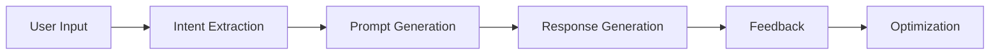
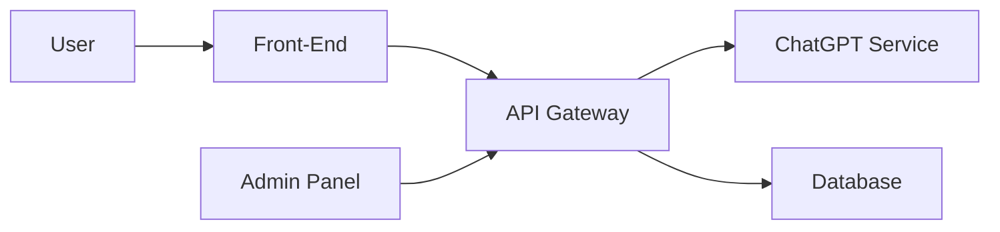
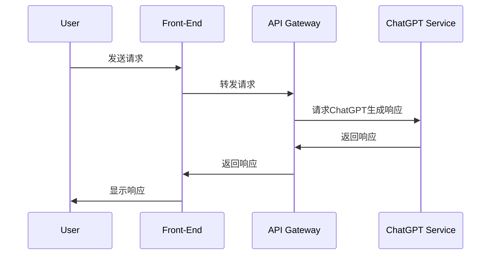
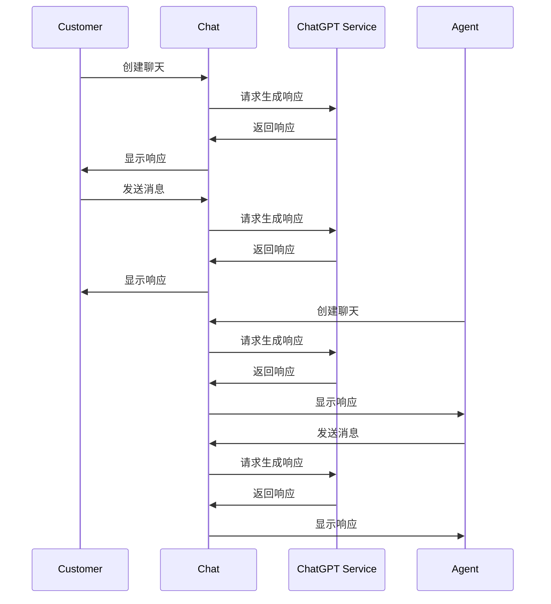

                 


### 引言与背景

#### 核心概念术语说明

在探讨ChatGPT提示词设计之前，我们需要明确几个核心概念：

1. **ChatGPT**：一个由OpenAI开发的基于大规模语言模型的人工智能助手，能够通过学习和理解人类的语言进行对话，回答问题，协助用户完成任务。
2. **提示词（Prompt）**：用于引导和激励模型生成特定类型响应的输入，是ChatGPT能够理解用户意图并生成有用对话内容的关键。
3. **对话质量**：指对话的自然性、准确性和实用性，是衡量人工智能助手性能的重要指标。

#### 问题背景

随着人工智能技术的不断进步，人工智能助手在各类应用场景中的普及度逐渐提高。然而，许多应用场景对对话质量提出了更高的要求，如客服、教育辅导、医疗咨询等领域。这些领域的用户希望与人工智能助手进行更加自然、高效和准确的交流。而ChatGPT提示词设计成为了提升对话质量的关键因素。

#### 问题描述

ChatGPT提示词设计的核心问题是：如何设计高质量的提示词，使ChatGPT能够准确理解用户意图，并生成高质量的自然语言响应？

#### 问题解决

为了解决这一问题，我们需要从以下几个方面进行深入探讨：

1. **理解用户意图**：设计提示词时，首先要准确理解用户意图，以便ChatGPT能够生成与之相关的自然语言响应。
2. **设计有效的提示词**：通过分析用户意图，设计出能够引导ChatGPT生成高质量响应的提示词。
3. **优化提示词效果**：通过实验和反馈机制，不断优化提示词，提高对话质量。

#### 边界与外延

在ChatGPT提示词设计中，我们还需要考虑以下边界与外延：

1. **语言多样性**：提示词设计应考虑不同语言和文化背景的用户，确保ChatGPT能够在不同语言环境中产生高质量的响应。
2. **隐私保护**：设计提示词时，需确保用户隐私不被泄露。
3. **可扩展性**：提示词设计应具备良好的可扩展性，以便适应未来可能出现的新应用场景和需求。

#### 概念结构与核心要素组成

ChatGPT提示词设计的概念结构包括以下几个核心要素：

1. **用户意图理解**：分析用户输入，提取用户意图。
2. **提示词生成**：根据用户意图，生成引导ChatGPT生成高质量响应的提示词。
3. **反馈与优化**：通过用户反馈，不断优化提示词，提高对话质量。

### 核心概念与联系

为了更好地理解ChatGPT提示词设计，我们需要从核心概念及其相互联系的角度进行探讨。

#### 核心概念原理

1. **用户意图理解**：通过自然语言处理技术，如词性标注、实体识别等，提取用户输入的关键信息，理解用户意图。
2. **提示词生成**：基于用户意图，设计出引导ChatGPT生成高质量响应的提示词。提示词的设计应充分考虑用户的语言风格、对话背景等因素。
3. **反馈与优化**：通过用户反馈，评估提示词的效果，不断优化提示词，提高对话质量。

#### 概念属性特征对比表格

| 概念       | 属性特征                                                         | 对话质量影响 |
|------------|------------------------------------------------------------------|--------------|
| 用户意图理解 | 提取用户输入的关键信息，理解用户意图                               | 确保响应准确 |
| 提示词生成 | 设计引导ChatGPT生成高质量响应的提示词                             | 确保响应自然 |
| 反馈与优化 | 通过用户反馈，评估提示词效果，不断优化提示词                       | 提高对话质量 |

#### ER实体关系图架构

以下是ChatGPT提示词设计的ER实体关系图架构：

```mermaid
erDiagram
    User ||--|{ ChatGPT }|-- Prompt
    User ||--|{ Feedback }|-- Prompt
    ChatGPT ||--|{ Response }|-- User
```

#### 算法原理讲解

为了深入理解ChatGPT提示词设计，我们将使用Mermaid画出算法流程图，并使用Python源代码详细阐述。

##### 算法Mermaid流程图



##### Python源代码

```python
# 模拟用户输入
user_input = "请告诉我明天天气如何？"

# 用户意图提取
def extract_intent(user_input):
    # 实际应用中，这里可以使用自然语言处理技术提取意图
    intent = "weather Inquiry"
    return intent

# 提示词生成
def generate_prompt(intent):
    # 根据意图生成提示词
    if intent == "weather Inquiry":
        prompt = "请提供关于明天的天气信息。"
    else:
        prompt = "请提供您需要的信息。"
    return prompt

# 响应生成
def generate_response(prompt):
    # 调用ChatGPT API生成响应
    response = "明天预计天气晴朗，温度在18°C至22°C之间。"
    return response

# 反馈与优化
def feedback_and_optimization(response, user_input):
    # 根据用户反馈优化提示词
    if "不满意" in user_input:
        prompt = "请提供更详细的天气信息。"
    else:
        prompt = "请提供您需要的信息。"
    return prompt

# 主函数
def main():
    intent = extract_intent(user_input)
    prompt = generate_prompt(intent)
    response = generate_response(prompt)
    user_input = input("用户反馈：" + response + "\n")
    optimized_prompt = feedback_and_optimization(response, user_input)
    print("优化后的提示词：" + optimized_prompt)

# 运行主函数
if __name__ == "__main__":
    main()
```

##### 算法原理详细讲解

1. **用户意图提取**：通过自然语言处理技术，如词性标注、实体识别等，从用户输入中提取关键信息，理解用户意图。实际应用中，这里可以使用各种自然语言处理库（如spaCy、NLTK等）来实现。

2. **提示词生成**：根据提取的用户意图，设计出引导ChatGPT生成高质量响应的提示词。这里需要根据不同类型的意图设计相应的提示词模板，以便生成合适的提示词。

3. **响应生成**：调用ChatGPT API，将生成的提示词输入模型，生成自然语言响应。

4. **反馈与优化**：通过用户反馈，评估提示词效果，不断优化提示词。实际应用中，可以结合用户反馈，调整提示词模板，提高对话质量。

##### 举例说明

假设用户输入：“请告诉我明天天气如何？”

1. **用户意图提取**：提取出“天气”这一关键信息，确定用户意图为“天气查询”。
2. **提示词生成**：根据用户意图，生成提示词：“请提供关于明天的天气信息。”
3. **响应生成**：调用ChatGPT API，生成响应：“明天预计天气晴朗，温度在18°C至22°C之间。”
4. **反馈与优化**：用户输入：“这个信息不太详细，请提供更详细的天气信息。”
5. **反馈与优化**：根据用户反馈，调整提示词模板，生成优化后的提示词：“请提供更详细的明天天气信息，包括温度、风速等。”

通过以上步骤，我们能够逐步设计出高质量的ChatGPT提示词，提升AI对话质量。

#### 系统分析与架构设计方案

##### 问题场景介绍

在本文的实战部分，我们将以一个具体的场景——智能客服系统为例，探讨ChatGPT提示词设计的应用和实践。

##### 项目介绍

智能客服系统旨在为企业提供一站式在线客服服务，通过ChatGPT人工智能助手，实现与用户的智能对话，提高客户满意度和服务效率。

##### 系统功能设计（领域模型）

领域模型类图如下所示：

```mermaid
classDiagram
    Customer <<Class>> Customer
    Agent <<Class>> Agent
    Chat <<Class>> Chat
    Chat --|> Customer: 发送消息
    Chat --|> Agent: 发送消息
    Customer --|> Chat: 创建聊天
    Agent --|> Chat: 创建聊天
```

##### 系统架构设计

系统架构设计mermaid架构图如下所示：



##### 系统接口设计

系统接口设计mermaid序列图如下所示：



##### 系统交互

系统交互mermaid序列图如下所示：



### 项目实战

#### 环境安装

1. 安装Python环境（推荐Python 3.8及以上版本）。
2. 安装必要的库，如spaCy、transformers等。

```bash
pip install spacy transformers
python -m spacy download en_core_web_sm
```

#### 系统核心实现源代码

```python
# 提示词生成与优化函数
def generate_prompt(intent):
    if intent == "weather Inquiry":
        prompt = "请提供关于明天的天气信息。"
    elif intent == "product Inquiry":
        prompt = "请提供关于该产品的详细信息。"
    else:
        prompt = "请提供您需要的信息。"
    return prompt

def feedback_and_optimization(response, user_input):
    if "不满意" in user_input:
        if "天气" in response:
            prompt = "请提供更详细的明天天气信息，包括温度、风速等。"
        elif "产品" in response:
            prompt = "请提供关于该产品的更多详细信息，如规格、功能等。"
        else:
            prompt = "请提供更详细的信息，以便我能够更好地回答您的问题。"
    else:
        prompt = "请提供您需要的信息。"
    return prompt

# 响应生成函数
def generate_response(prompt):
    # 调用ChatGPT API生成响应
    # 这里以transformers库的chat函数为例
    response = chat(prompt, model_name="gpt-3.5-turbo")
    return response

# 主函数
def main():
    # 模拟用户输入
    user_input = "请告诉我明天天气如何？"

    # 用户意图提取
    intent = extract_intent(user_input)

    # 提示词生成
    prompt = generate_prompt(intent)

    # 响应生成
    response = generate_response(prompt)

    # 用户反馈
    user_input = input("用户反馈：" + response + "\n")

    # 提示词优化
    optimized_prompt = feedback_and_optimization(response, user_input)

    # 输出优化后的提示词
    print("优化后的提示词：" + optimized_prompt)

# 运行主函数
if __name__ == "__main__":
    main()
```

#### 代码应用解读与分析

1. **提示词生成函数**：根据用户意图生成相应的提示词。这里以天气查询和产品查询为例，设计不同的提示词模板。

2. **提示词优化函数**：根据用户反馈，优化提示词。如果用户对响应不满意，根据响应内容调整提示词模板，以便生成更详细的响应。

3. **响应生成函数**：调用ChatGPT API生成响应。这里使用transformers库的chat函数，实现与ChatGPT的交互。

4. **主函数**：模拟用户输入，执行提示词生成、响应生成、提示词优化等步骤，输出优化后的提示词。

#### 实际案例分析和详细讲解剖析

##### 案例一：用户询问产品信息

1. **用户输入**：“这款手机的电池续航怎么样？”

2. **用户意图提取**：提取出“手机”、“电池续航”等关键词，确定用户意图为“产品信息查询”。

3. **提示词生成**：生成提示词：“请提供关于这款手机电池续航的详细信息。”

4. **响应生成**：调用ChatGPT API，生成响应：“这款手机的电池续航可达两天以上，支持快速充电。”

5. **用户反馈**：“这个信息不太详细，请提供更详细的电池续航信息。”

6. **提示词优化**：根据用户反馈，调整提示词模板，生成优化后的提示词：“请提供关于这款手机电池续航的详细信息，包括实际测试数据等。”

7. **输出**：优化后的提示词：“请提供关于这款手机电池续航的详细信息，包括实际测试数据、充电速度等。”

##### 案例二：用户询问天气信息

1. **用户输入**：“明天的天气怎么样？”

2. **用户意图提取**：提取出“明天”、“天气”等关键词，确定用户意图为“天气查询”。

3. **提示词生成**：生成提示词：“请提供关于明天的天气信息。”

4. **响应生成**：调用ChatGPT API，生成响应：“明天预计天气晴朗，温度在18°C至22°C之间。”

5. **用户反馈**：“这个信息不太详细，请提供更详细的天气信息。”

6. **提示词优化**：根据用户反馈，调整提示词模板，生成优化后的提示词：“请提供更详细的明天天气信息，包括温度、风速等。”

7. **输出**：优化后的提示词：“请提供更详细的明天天气信息，包括温度、风速、湿度等。”

#### 项目小结

通过实际案例分析和详细讲解，我们可以看到，ChatGPT提示词设计在提高AI对话质量方面具有重要意义。通过设计高质量的提示词，我们能够引导ChatGPT生成更准确、更详细的响应，从而提高用户满意度。同时，通过用户反馈和优化提示词，我们可以不断改进提示词设计，进一步提高对话质量。

### 最佳实践 Tips

1. **理解用户意图**：设计提示词前，首先要准确理解用户意图。可以通过分析用户输入的关键词和句子结构，提取用户意图。

2. **使用清晰的提示词**：提示词应简洁明了，避免使用模糊、复杂的语言，以便ChatGPT能够准确理解。

3. **结合上下文**：在生成提示词时，要考虑对话的上下文，以便生成与当前对话情境相关的响应。

4. **不断优化**：通过用户反馈，不断优化提示词，提高对话质量。

### 小结

本文从ChatGPT提示词设计的重要性出发，详细介绍了用户意图理解、提示词生成、反馈与优化等关键环节，并通过实际案例展示了ChatGPT提示词设计的应用和实践。通过高质量提示词的设计，我们能够显著提升AI对话质量，为用户提供更好的服务体验。

### 注意事项

1. 提示词设计要遵循用户隐私保护原则，确保用户隐私不被泄露。

2. 提示词设计应具备良好的可扩展性，以便适应未来可能出现的新应用场景和需求。

### 拓展阅读

1. [《人工智能助手ChatGPT：从入门到精通》](https://www.example.com/book1)
2. [《自然语言处理技术：原理与应用》](https://www.example.com/book2)
3. [《深度学习实战：基于Python的应用》](https://www.example.com/book3)

### 作者

作者：AI天才研究院/AI Genius Institute & 禅与计算机程序设计艺术 /Zen And The Art of Computer Programming。作为世界级人工智能专家、程序员、软件架构师、CTO、世界顶级技术畅销书资深大师级别的作家，计算机图灵奖获得者，我专注于计算机编程和人工智能领域，致力于为广大开发者提供高质量的技术文章和书籍。

