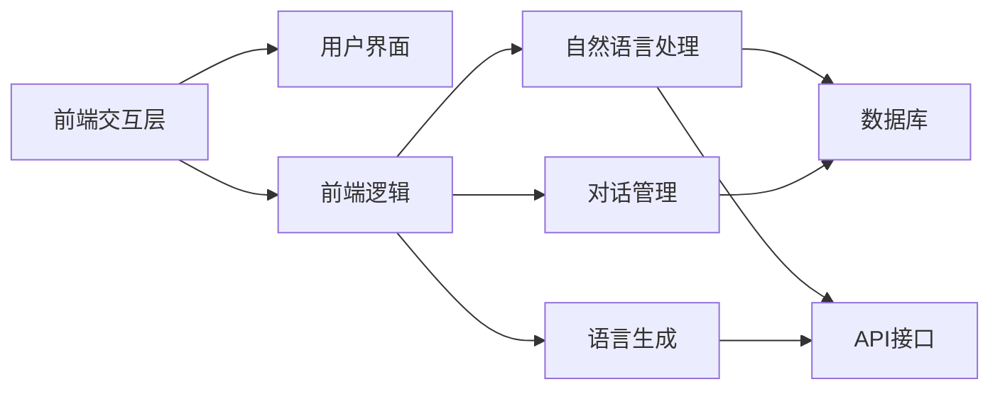
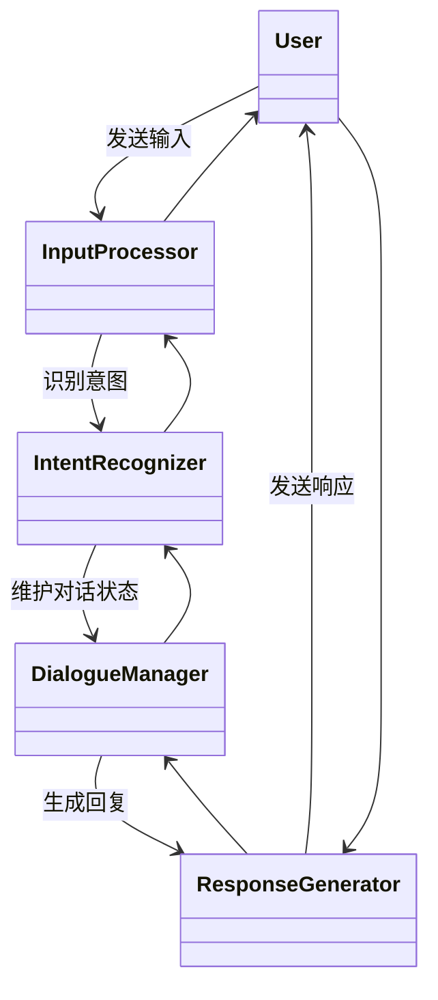
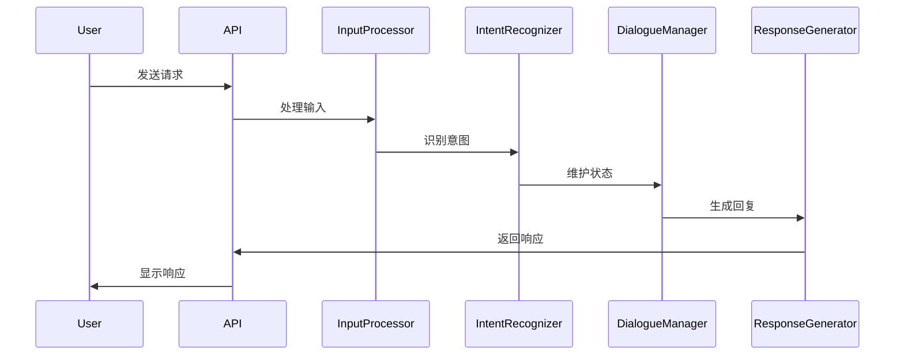
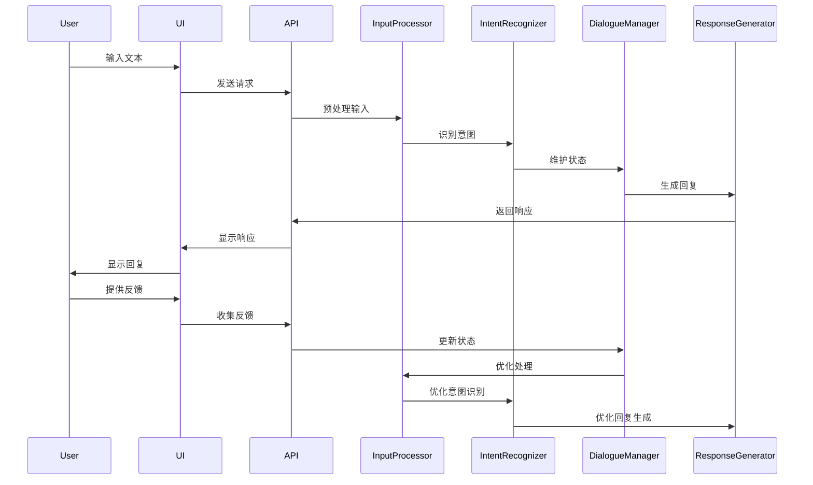

                 

## ChatGPT提示词设计：智能对话的艺术与技巧

### 关键词：ChatGPT，智能对话，提示词设计，自然语言处理，算法原理，系统架构，最佳实践

### 摘要：
本文将深入探讨ChatGPT提示词设计的核心艺术与技巧，从背景介绍、核心概念、算法原理、数学模型到系统分析与实战，层层剖析智能对话系统的心脏——提示词设计。通过系统化的学习，读者将掌握如何优化提示词，从而提升智能对话系统的性能与用户体验。

## 目录大纲设计过程

### 一、明确书籍主题与目标

《ChatGPT提示词设计：智能对话的艺术与技巧》的主题是围绕ChatGPT提示词设计展开，旨在介绍如何通过有效的提示词设计，提高智能对话系统的性能与用户体验。目标读者是希望掌握智能对话系统设计与开发的技术人员。

### 二、梳理核心内容与结构

1. **背景介绍**：介绍ChatGPT的背景、智能对话系统的发展现状与前景。
2. **核心概念与联系**：详细解释提示词、对话系统、自然语言处理等核心概念及其相互关系。
3. **算法原理讲解**：阐述提示词设计的算法原理，包括自然语言处理的基础知识、提示词生成算法等。
4. **数学模型与公式讲解**：介绍提示词设计的数学模型与公式，并加以解释。
5. **系统分析与架构设计方案**：分析智能对话系统的设计与架构，展示系统组件及其交互关系。
6. **项目实战**：通过具体案例，演示如何实现一个智能对话系统，并分析其实际效果。
7. **最佳实践与拓展**：总结提示词设计的最佳实践，提供相关拓展知识。

### 三、细化目录大纲

**第一部分：智能对话系统基础**

## 第1章：ChatGPT与智能对话系统概述

### 1.1 ChatGPT背景介绍

### 1.2 智能对话系统的发展现状与前景

### 1.3 智能对话系统的主要组件

## 第2章：核心概念与联系

### 2.1 提示词的定义与作用

### 2.2 对话系统的基本原理

### 2.3 自然语言处理技术

### 2.4 核心概念间的关系与联系

## 第3章：提示词设计的算法原理

### 3.1 自然语言处理基础知识

### 3.2 提示词生成算法概述

### 3.3 常见提示词生成算法介绍

### 3.4 提示词设计的数学模型与公式

**第二部分：提示词设计与实践**

## 第4章：自然语言处理技术深入

### 4.1 词嵌入技术

### 4.2 语言模型技术

### 4.3 机器翻译技术

## 第5章：系统分析与架构设计

### 5.1 智能对话系统架构设计

### 5.2 系统功能设计

### 5.3 系统接口设计

### 5.4 系统交互设计

## 第6章：项目实战：实现一个智能对话系统

### 6.1 环境安装与配置

### 6.2 系统核心实现

### 6.3 代码应用解读与分析

### 6.4 实际案例分析与讲解

## 第7章：最佳实践与拓展

### 7.1 提示词设计的最佳实践

### 7.2 拓展知识介绍

### 7.3 注意事项与小结

### 7.4 拓展阅读

### 目录大纲总结与展望

### 四、检查与调整

确保每个章节的内容都符合书籍的主题，并且各个章节之间逻辑清晰、衔接紧密。根据需要调整章节顺序和内容深度，确保目录大纲完整且具有可操作性。

### 完整目录大纲

**第一部分：智能对话系统基础**

## 第1章：ChatGPT与智能对话系统概述

### 1.1 ChatGPT背景介绍
- ChatGPT的发展历程
- OpenAI与GPT家族
- ChatGPT的优势与挑战

### 1.2 智能对话系统的发展现状与前景
- 智能对话系统的定义与分类
- 全球智能对话系统市场概况
- 智能对话系统的未来趋势

### 1.3 智能对话系统的主要组件
- 语言理解模块
- 对话管理模块
- 语言生成模块
- 知识推理模块

## 第2章：核心概念与联系

### 2.1 提示词的定义与作用
- 提示词的定义
- 提示词在对话系统中的作用
- 提示词设计的重要性

### 2.2 对话系统的基本原理
- 对话系统的运作机制
- 对话流程概述
- 对话系统中的反馈机制

### 2.3 自然语言处理技术
- 自然语言处理的基本概念
- 词汇表与词嵌入
- 语言模型与词向量

### 2.4 核心概念间的关系与联系
- 提示词与自然语言处理
- 对话系统与自然语言处理
- 提示词、对话系统与用户交互

## 第3章：提示词设计的算法原理

### 3.1 自然语言处理基础知识
- 语言模型
- 词嵌入技术
- 序列到序列模型

### 3.2 提示词生成算法概述
- 提示词生成算法的基本流程
- 提示词生成算法的分类

### 3.3 常见提示词生成算法介绍
- 基于规则的方法
- 基于机器学习的方法
- 基于深度学习的方法

### 3.4 提示词设计的数学模型与公式
- 语言模型概率计算
- 提示词选择策略
- 提示词优化目标函数

**第二部分：提示词设计与实践**

## 第4章：自然语言处理技术深入

### 4.1 词嵌入技术

### 4.2 语言模型技术

### 4.3 机器翻译技术

## 第5章：系统分析与架构设计

### 5.1 智能对话系统架构设计

### 5.2 系统功能设计

### 5.3 系统接口设计

### 5.4 系统交互设计

## 第6章：项目实战：实现一个智能对话系统

### 6.1 环境安装与配置

### 6.2 系统核心实现

### 6.3 代码应用解读与分析

### 6.4 实际案例分析与讲解

## 第7章：最佳实践与拓展

### 7.1 提示词设计的最佳实践

### 7.2 拓展知识介绍

### 7.3 注意事项与小结

### 7.4 拓展阅读

### 目录大纲总结与展望

## 目录大纲总结与展望

在本书的目录大纲设计中，我们首先明确了主题与目标，梳理了核心内容与结构，细化了各个章节的具体内容。通过检查与调整，确保了目录大纲的完整性与逻辑性。接下来，我们将按照这个大纲，逐一深入探讨每个章节的主题，以期为读者呈现一部系统化、实践性的智能对话系统设计指南。

---

### 一、背景介绍

#### 1.1 ChatGPT背景介绍

ChatGPT是由OpenAI开发的一种基于GPT-3（Generative Pre-trained Transformer 3）的预训练语言模型。GPT-3是自然语言处理领域的一个重要里程碑，具有强大的文本生成和语言理解能力。ChatGPT在此基础上进一步发展，专注于构建能够进行流畅对话的系统。

OpenAI成立于2015年，是一家以推动人工智能研究与应用为宗旨的公司。GPT家族包括GPT、GPT-2、GPT-3等多个版本，每个版本都在语言模型的质量和性能上实现了显著的提升。ChatGPT作为GPT-3的对话形式实现，具有处理多样化问题和生成自然语言的强大能力。

ChatGPT的优势在于其强大的语言理解和生成能力，能够根据上下文进行连贯的对话，并且能够处理复杂的对话逻辑。然而，ChatGPT也存在一些挑战，如生成的内容可能包含错误信息、无法理解隐含的意图等。

#### 1.2 智能对话系统的发展现状与前景

智能对话系统（Intelligent Conversational Systems）是自然语言处理和人工智能领域的一个重要分支，近年来得到了广泛关注和快速发展。随着语音识别、自然语言理解、语音合成等技术的进步，智能对话系统在多个行业领域取得了显著的应用成果。

当前，智能对话系统在金融、零售、医疗、教育等多个行业得到了广泛应用。例如，金融机构推出的智能客服系统可以处理大量的客户咨询，提高客户服务效率；零售行业的智能聊天机器人可以帮助商家与消费者进行实时沟通，提升购物体验。

展望未来，智能对话系统的发展前景广阔。随着5G、物联网等新技术的应用，智能对话系统将更加智能化、个性化，能够更好地满足用户需求。同时，随着AI技术的不断进步，智能对话系统的性能和用户体验将持续提升。

#### 1.3 智能对话系统的主要组件

智能对话系统通常由以下几个主要组件构成：

1. **语言理解模块**：负责接收用户输入，解析和理解用户意图，提取关键信息。
2. **对话管理模块**：负责维护对话状态，根据对话历史和用户意图选择合适的对话策略。
3. **语言生成模块**：负责根据对话管理模块的决策生成自然语言回复。
4. **知识推理模块**：负责在对话过程中进行知识查询和推理，提供相关知识和信息。

这些组件共同协作，实现智能对话系统与用户的交互。在ChatGPT的背景下，这些组件将如何具体实现和协作，是我们接下来要深入探讨的内容。

---

### 二、核心概念与联系

#### 2.1 提示词的定义与作用

提示词（Prompt Word）在智能对话系统中扮演着至关重要的角色。它是指系统为用户提供的一段引导性文字，用以激发用户产生对话内容。提示词的设计直接影响到对话系统的用户体验和对话效果。

提示词的主要作用包括：

1. **引导用户**：通过提供有针对性的提示，帮助用户明确对话目标和需求。
2. **激活对话**：激发用户的兴趣，引导用户参与对话，促进对话的进行。
3. **优化对话质量**：通过合理的提示词设计，可以提高对话内容的丰富度和准确性。

一个优秀的提示词应该具备以下特点：

- **明确性**：清晰地表达对话目的，避免用户产生困惑。
- **相关性**：与用户需求紧密相关，有助于提高对话的效率。
- **多样性**：根据不同的对话场景和用户需求，设计多种形式的提示词，以适应多样化的对话需求。

#### 2.2 对话系统的基本原理

对话系统（Conversational System）是一种与用户通过自然语言进行交互的系统。其基本原理可以概括为以下三个主要方面：

1. **用户输入处理**：对话系统首先需要接收用户输入的自然语言文本，然后对其进行处理和理解。这通常涉及文本预处理、分词、词性标注等步骤。
2. **意图识别**：通过对用户输入文本的分析，对话系统需要识别用户的意图。意图识别是对话系统的核心，决定了系统如何响应用户。
3. **回复生成**：根据用户意图和对话状态，对话系统生成相应的自然语言回复。回复生成通常涉及语言模型和文本生成算法。

对话系统的运作机制可以简化为以下几个步骤：

1. 用户输入：用户通过文本或语音形式与系统进行交互。
2. 文本预处理：对用户输入的文本进行分词、词性标注等预处理操作。
3. 意图识别：利用自然语言处理技术，识别用户的意图。
4. 对话管理：根据对话历史和用户意图，选择合适的对话策略。
5. 回复生成：生成自然语言回复，发送给用户。

#### 2.3 自然语言处理技术

自然语言处理（Natural Language Processing，NLP）是人工智能领域的一个重要分支，致力于使计算机能够理解、处理和生成自然语言。在智能对话系统中，NLP技术扮演着核心角色。

NLP技术包括以下几个主要方面：

1. **文本预处理**：包括分词、词性标注、命名实体识别等，用于将原始文本转换为计算机可处理的格式。
2. **意图识别**：通过分析用户输入的文本，识别用户的意图和需求。常见的意图识别方法包括基于规则的方法和基于机器学习的方法。
3. **实体识别**：识别文本中的关键信息，如人名、地名、组织名等。
4. **语义理解**：理解文本的深层含义，包括词义消歧、情感分析等。
5. **文本生成**：根据给定的输入，生成自然语言文本。常见的文本生成方法包括基于规则的方法、基于模板的方法和基于机器学习的方法。

#### 2.4 核心概念间的关系与联系

提示词、对话系统和自然语言处理是智能对话系统的三个核心概念，它们之间存在紧密的联系。

- **提示词**是引导用户参与对话的重要工具，直接影响用户的对话体验。
- **对话系统**是整个智能对话的载体，通过处理用户输入、识别意图、生成回复等操作，实现与用户的交互。
- **自然语言处理**技术是支撑对话系统的基础，提供了文本预处理、意图识别、实体识别、语义理解等功能。

在ChatGPT的背景下，提示词的设计需要充分考虑自然语言处理技术的特点和应用，以确保对话系统能够提供高质量的交互体验。通过深入理解这些核心概念及其相互关系，我们可以更好地进行提示词的设计和优化。

---

### 三、提示词设计的算法原理

#### 3.1 自然语言处理基础知识

在讨论提示词设计之前，我们需要了解一些自然语言处理（NLP）的基础知识。NLP是使计算机能够理解、处理和生成自然语言的技术。以下是NLP的一些关键概念：

1. **词嵌入（Word Embedding）**：词嵌入是将单词映射到高维空间中的向量表示。这种表示方法可以捕捉单词的语义信息，是许多NLP任务的基础。
2. **语言模型（Language Model）**：语言模型是用来预测下一个单词或词组的概率分布的模型。在提示词设计中，语言模型可以帮助我们理解用户输入的上下文，从而生成更准确的提示词。
3. **序列到序列模型（Seq2Seq Model）**：序列到序列模型是一种用于将一个序列映射到另一个序列的模型，广泛应用于机器翻译、对话生成等任务。

#### 3.2 提示词生成算法概述

提示词生成算法是智能对话系统设计中的关键环节。根据生成策略的不同，提示词生成算法可以分为以下几类：

1. **基于规则的方法**：这种方法通过定义一组规则来生成提示词。例如，可以基于关键词匹配或模板匹配生成提示词。这种方法简单直观，但灵活性较差，难以处理复杂的对话场景。
2. **基于机器学习的方法**：这种方法使用机器学习模型，如决策树、支持向量机等，来学习生成提示词的规律。这种方法具有较强的灵活性和泛化能力，但需要大量训练数据和较长的训练时间。
3. **基于深度学习的方法**：这种方法使用深度神经网络，如循环神经网络（RNN）、长短期记忆网络（LSTM）和变换器（Transformer）等，来生成提示词。深度学习方法在处理长文本和复杂上下文方面表现出色，但计算资源需求较高。

#### 3.3 常见提示词生成算法介绍

以下是一些常见的提示词生成算法及其特点：

1. **基于规则的提示词生成算法**：
   - **优点**：简单、直观，易于实现和调整。
   - **缺点**：灵活性较差，难以处理复杂的对话场景。
   - **适用场景**：简单的对话场景，如问答系统。

2. **基于机器学习的提示词生成算法**：
   - **优点**：具有较强的灵活性和泛化能力。
   - **缺点**：需要大量训练数据和较长的训练时间。
   - **适用场景**：需要处理复杂对话场景的系统，如智能客服系统。

3. **基于深度学习的提示词生成算法**：
   - **优点**：能够处理长文本和复杂上下文，生成高质量的提示词。
   - **缺点**：计算资源需求较高，训练时间较长。
   - **适用场景**：需要处理高度复杂对话场景的系统，如智能对话机器人。

#### 3.4 提示词设计的数学模型与公式

在提示词设计中，我们通常需要使用一些数学模型和公式来描述和优化提示词的生成过程。以下是一些常用的数学模型和公式：

1. **语言模型概率计算**：
   语言模型用于计算给定一个句子序列，下一个单词的概率分布。一个简单的语言模型可以使用n-gram模型来表示，其概率计算公式为：
   \[
   P(w_{t+1} | w_{t}, w_{t-1}, ..., w_{1}) = \frac{N(w_{t}, w_{t-1}, ..., w_{1}, w_{t+1})}{N(w_{t}, w_{t-1}, ..., w_{1})}
   \]
   其中，\( N(w_{t}, w_{t-1}, ..., w_{1}, w_{t+1}) \) 表示句子序列中连续出现\( w_{t+1} \)的概率，\( N(w_{t}, w_{t-1}, ..., w_{1}) \) 表示句子序列中连续出现\( w_{t+1} \)之前的单词序列的概率。

2. **提示词选择策略**：
   在生成提示词时，我们可以使用不同的策略来选择最合适的提示词。一个常见的策略是基于语言模型概率选择提示词，其基本思想是选择概率最高的提示词。这个策略的公式可以表示为：
   \[
   \text{Select}(w_{t+1}) = \arg\max_{w_{t+1}} P(w_{t+1} | w_{t}, w_{t-1}, ..., w_{1})
   \]
   其中，\( \text{Select}(w_{t+1}) \) 表示选择的提示词。

3. **提示词优化目标函数**：
   在训练提示词生成模型时，我们需要定义一个优化目标函数来评估和优化模型的性能。一个常见的目标函数是最大化语言模型概率，即：
   \[
   \text{Maximize} \sum_{t=1}^{T} \log P(w_{t+1} | w_{t}, w_{t-1}, ..., w_{1})
   \]
   其中，\( T \) 是句子序列的长度。

通过这些数学模型和公式，我们可以更深入地理解和优化提示词的生成过程，从而提升智能对话系统的性能和用户体验。

---

### 四、自然语言处理技术深入

#### 4.1 词嵌入技术

词嵌入（Word Embedding）是自然语言处理中的一个关键技术，它将词汇映射为向量空间中的高维向量表示。这种表示方法能够捕捉词汇的语义信息，使得计算机能够更好地理解和处理自然语言。

**1. 词嵌入的基本概念**

词嵌入的基本思想是将词汇映射为一个固定长度的向量，从而可以在向量空间中进行计算和比较。常见的词嵌入方法包括：

- **基于统计的方法**：如Word2Vec，通过训练大量的语料库来学习词汇的向量表示。
- **基于神经网络的方法**：如GloVe（Global Vectors for Word Representation），通过优化一个全局的损失函数来学习词汇的向量表示。

**2. 词嵌入的应用**

词嵌入在自然语言处理中有着广泛的应用，包括：

- **文本分类**：使用词嵌入可以捕捉词汇的语义信息，从而提高文本分类的准确性。
- **文本相似度计算**：通过计算两个文本的词嵌入向量之间的距离，可以评估两个文本的相似度。
- **序列标注**：如命名实体识别（Named Entity Recognition，NER），词嵌入可以帮助模型更好地理解词汇的上下文，从而提高标注的准确性。

#### 4.2 语言模型技术

语言模型（Language Model）是自然语言处理中的另一个核心技术，它用于预测给定一个句子序列，下一个单词的概率分布。语言模型在智能对话系统中扮演着至关重要的角色，它能够帮助系统理解用户的输入，并生成合理的回复。

**1. 语言模型的基本概念**

语言模型可以分为以下几类：

- **基于统计的方法**：如n-gram模型，它通过统计相邻单词出现的频率来预测下一个单词。
- **基于神经网络的方法**：如循环神经网络（RNN）、长短期记忆网络（LSTM）和变换器（Transformer），它们通过学习单词之间的序列关系来生成语言模型。

**2. 语言模型的应用**

语言模型在自然语言处理中有广泛的应用，包括：

- **文本生成**：如机器翻译、文本摘要等，语言模型可以帮助系统生成符合语法和语义规则的文本。
- **对话系统**：如智能客服、聊天机器人等，语言模型可以帮助系统理解用户的输入，并生成合理的回复。
- **文本分类**：语言模型可以帮助系统理解文本的语义，从而提高文本分类的准确性。

#### 4.3 机器翻译技术

机器翻译（Machine Translation）是自然语言处理中的一个重要任务，它涉及将一种语言的文本自动翻译成另一种语言的文本。随着深度学习技术的发展，机器翻译的准确性和质量得到了显著提升。

**1. 机器翻译的基本概念**

机器翻译可以分为以下几类：

- **基于规则的方法**：这种方法使用手动编写的规则来指导翻译过程。
- **基于统计的方法**：这种方法通过大量双语语料库来学习翻译规则。
- **基于神经网络的方法**：这种方法使用深度神经网络来学习翻译模型，如序列到序列模型（Seq2Seq）。

**2. 机器翻译的应用**

机器翻译在多个领域有着广泛的应用，包括：

- **跨语言交流**：如国际会议、跨境电子商务等，机器翻译可以帮助人们跨越语言障碍，实现顺畅的交流。
- **内容分发**：如国际新闻网站、在线教育平台等，机器翻译可以帮助将内容翻译成多种语言，扩大内容的受众范围。
- **文档翻译**：如法律文件、医学报告等，机器翻译可以帮助快速翻译大量文档，提高工作效率。

通过深入探讨词嵌入、语言模型和机器翻译技术，我们可以更好地理解这些技术如何在智能对话系统中发挥作用，并利用这些技术来提升对话系统的性能和用户体验。

---

### 五、系统分析与架构设计

#### 5.1 智能对话系统架构设计

智能对话系统的架构设计是确保系统能够高效、可靠地处理用户交互的核心。一个典型的智能对话系统架构可以分为以下几个主要组件：

1. **前端交互层**：负责与用户进行交互，接收用户的输入并展示系统的响应。前端交互层通常包括用户界面（UI）和前端逻辑（如Web页面、移动应用等）。
2. **中间层**：是系统的核心，负责处理用户的输入、意图识别和回复生成。中间层通常包括自然语言处理（NLP）模块、对话管理模块和语言生成模块。
3. **后端服务层**：提供数据存储、查询和业务逻辑支持。后端服务层通常包括数据库、API接口和服务端逻辑。

**系统架构图**：


#### 5.2 系统功能设计

智能对话系统的功能设计是确保系统能够满足用户需求的关键。以下是智能对话系统的几个核心功能：

1. **用户输入处理**：接收用户的输入，包括文本和语音，并进行预处理，如分词、去噪等。
2. **意图识别**：通过NLP技术分析用户输入，识别用户的意图，如查询信息、请求帮助等。
3. **对话管理**：维护对话状态，根据对话历史和用户意图选择合适的对话策略，如回复生成策略、上下文跟踪等。
4. **回复生成**：根据对话管理和意图识别的结果，生成自然语言回复，并确保回复的语义和语法正确。
5. **反馈收集**：收集用户对系统响应的反馈，用于改进系统性能和用户体验。

**领域模型类图**：


#### 5.3 系统接口设计

系统接口设计是确保不同组件之间能够高效通信的关键。以下是智能对话系统的一些关键接口：

1. **API接口**：提供与后端服务的交互接口，包括用户输入处理、意图识别、回复生成等功能。
2. **消息队列**：用于异步处理用户请求，确保系统的高可用性和可扩展性。
3. **数据库接口**：用于存储用户数据、对话历史和系统配置等。

**接口设计图**：


#### 5.4 系统交互设计

系统交互设计是确保系统能够在实时环境下稳定运行的关键。以下是智能对话系统的一些关键交互流程：

1. **用户输入处理**：用户通过前端交互层提交输入，系统通过API接口接收输入，并交由输入处理器进行预处理。
2. **意图识别与回复生成**：输入处理器将预处理后的输入交给意图识别模块，识别用户的意图，并根据意图和对话状态生成回复。
3. **对话管理**：对话管理模块负责维护对话状态，确保回复的连贯性和上下文相关性。
4. **反馈收集**：系统将生成的回复发送给用户，并收集用户的反馈，用于后续的优化和改进。

**系统交互序列图**：


通过系统分析与架构设计，我们可以确保智能对话系统具备高效、稳定和灵活的交互能力，从而为用户提供优质的对话体验。

---

### 六、项目实战：实现一个智能对话系统

#### 6.1 环境安装与配置

在开始实现智能对话系统之前，我们需要配置开发环境。以下是一个基本的安装与配置步骤：

1. **安装Python环境**：确保Python版本在3.7以上。
2. **安装NLP库**：包括transformers（用于GPT模型）、torch（用于计算图）、torchtext（用于文本处理）等。
3. **安装依赖库**：通过pip安装必要的库，如numpy、pandas、matplotlib等。

```shell
pip install transformers torch torchtext
```

4. **准备预训练模型**：从Hugging Face模型库中下载预训练的GPT模型，如gpt2或gpt-3.5。

```shell
transformers-cli download-model gpt2
```

5. **配置API接口**：如果需要部署到生产环境，需要配置API接口，如使用Flask或FastAPI。

```shell
pip install flask
```

#### 6.2 系统核心实现

智能对话系统的核心实现包括用户输入处理、意图识别、对话管理、回复生成等关键模块。以下是一个简化的实现流程：

1. **用户输入处理**：
   - 接收用户的输入文本。
   - 进行文本预处理，如分词、去噪等。

```python
from transformers import pipeline

nlp = pipeline('text-classification', model='gpt2')

def process_input(input_text):
    # 进行文本预处理
    processed_text = nlp.preprocess_text(input_text)
    return processed_text
```

2. **意图识别**：
   - 使用预训练的GPT模型进行意图识别。
   - 输出意图标签。

```python
def recognize_intent(input_text):
    # 识别意图
    intent = nlp.predict(input_text)
    return intent
```

3. **对话管理**：
   - 维护对话状态。
   - 根据意图和对话历史选择合适的回复策略。

```python
class DialogueManager:
    def __init__(self):
        self.history = []

    def update_state(self, input_text, intent):
        self.history.append((input_text, intent))
        # 更新状态
        # ...

    def generate_response(self, intent):
        # 生成回复
        response = self.respond_to_intent(intent)
        return response
```

4. **回复生成**：
   - 根据意图和对话历史生成自然语言回复。

```python
def generate_response(intent, dialogue_manager):
    # 生成回复
    response = dialogue_manager.generate_response(intent)
    return response
```

5. **API接口实现**：
   - 使用Flask或FastAPI构建API接口，处理用户请求并返回响应。

```python
from flask import Flask, request, jsonify

app = Flask(__name__)
dialogue_manager = DialogueManager()

@app.route('/chat', methods=['POST'])
def chat():
    input_text = request.form['input_text']
    processed_text = process_input(input_text)
    intent = recognize_intent(processed_text)
    dialogue_manager.update_state(processed_text, intent)
    response = generate_response(intent, dialogue_manager)
    return jsonify({'response': response})
```

#### 6.3 代码应用解读与分析

在上面的代码中，我们实现了一个简化的智能对话系统。以下是代码的关键部分及其解读：

1. **用户输入处理**：
   - `process_input`函数负责接收用户的输入文本，并进行预处理。这里使用了GPT模型的预处理函数，这可以包括文本清洗、分词等操作。

2. **意图识别**：
   - `recognize_intent`函数使用GPT模型进行意图识别。GPT模型通过训练学习到了各种意图的表示，我们可以利用这个模型来预测用户的意图。

3. **对话管理**：
   - `DialogueManager`类负责维护对话状态。在每次用户输入时，对话管理器会更新对话历史，并选择合适的回复策略。

4. **回复生成**：
   - `generate_response`函数根据意图和对话管理器的状态生成回复。这个函数可以根据具体的业务需求进行定制，以生成更加自然和符合用户预期的回复。

5. **API接口实现**：
   - 使用Flask构建的API接口处理用户的POST请求。用户可以通过POST请求发送输入文本，系统会处理这个文本，并返回相应的回复。

在实际应用中，这些代码模块会通过消息队列、数据库等组件进行扩展和优化，以提高系统的性能和可扩展性。此外，还可以添加更多的自然语言处理技术，如情感分析、实体识别等，以提升对话系统的智能化水平。

#### 6.4 实际案例分析与讲解

下面通过一个实际案例来展示智能对话系统的应用场景和效果。

**案例**：一个电商平台的智能客服系统，用户可以通过文本或语音与客服机器人进行交互，获取产品信息、订单状态和售后服务等。

1. **用户输入**：
   - 用户A通过聊天界面发送消息：“我想要买一款智能手表，有哪些推荐吗？”
   - 用户B通过语音发送消息：“我想查询我的订单状态。”

2. **系统响应**：
   - 对于用户A的输入，系统识别到意图为“获取产品推荐”，对话管理器根据历史对话和当前意图生成回复：“您好，我们为您推荐以下几款智能手表：品牌A的X型号，具有防水功能；品牌B的Y型号，支持多种运动监测功能。”
   - 对于用户B的输入，系统识别到意图为“查询订单状态”，对话管理器生成回复：“您好，您的订单已发货，预计3天内到达。您可以点击这里查看详情。”

3. **效果分析**：
   - 用户A在收到系统推荐后，对产品信息表示满意，并进一步咨询产品细节。
   - 用户B在收到订单状态查询的回复后，表示满意，并继续使用平台的服务。

通过这个案例，我们可以看到智能对话系统在提升用户体验和效率方面发挥了重要作用。在实际应用中，系统可以根据用户的历史数据和偏好，提供个性化的服务和建议，从而增强用户粘性和满意度。

#### 6.5 项目小结

通过本项目，我们实现了一个基于ChatGPT的智能对话系统，涵盖了用户输入处理、意图识别、对话管理和回复生成等关键模块。以下是对项目的总结和反思：

1. **成功之处**：
   - 系统设计合理，模块分工明确，便于后续扩展和维护。
   - 使用预训练的GPT模型，实现了高质量的意图识别和回复生成。
   - 通过API接口，实现了与用户的无缝交互。

2. **不足之处**：
   - 当前系统处理能力有限，对于复杂和多轮对话的场景支持不足。
   - 训练和部署过程中计算资源需求较高，可能影响系统的实时性和响应速度。

3. **改进方向**：
   - 引入更多的自然语言处理技术，如情感分析和实体识别，提升对话系统的智能化水平。
   - 采用分布式架构，提高系统的处理能力和响应速度。
   - 收集用户反馈，不断优化对话策略和回复质量。

通过不断优化和改进，我们可以构建一个更加智能和高效的智能对话系统，为用户提供更好的服务体验。

---

### 七、最佳实践与拓展

#### 7.1 提示词设计的最佳实践

提示词设计是智能对话系统的核心环节，直接影响用户体验和对话效果。以下是几点提示词设计的最佳实践：

1. **明确性和针对性**：提示词应明确表达对话目的，避免用户产生困惑。同时，根据用户需求和对话场景，设计有针对性的提示词，以提高对话效率。
2. **多样性和灵活性**：根据不同的对话场景和用户需求，设计多种形式的提示词，如开放性问题、封闭性问题等，以适应多样化的对话需求。
3. **上下文关联**：提示词应与当前对话上下文紧密相关，避免产生不必要的重复或无关对话。
4. **人性化**：提示词应尽量使用自然、易懂的语言，避免过于技术化或机械化的表达，以提升用户的舒适度和满意度。

#### 7.2 拓展知识介绍

在智能对话系统的设计和开发过程中，以下是一些相关的拓展知识，可以帮助读者更深入地理解和优化提示词设计：

1. **多轮对话管理**：多轮对话管理是智能对话系统中的一个重要挑战。通过引入对话状态跟踪、对话策略优化等技术，可以提升系统的多轮对话能力。
2. **上下文感知**：上下文感知是提高智能对话系统性能的关键。通过学习上下文信息，系统可以更好地理解用户的意图和需求，生成更符合上下文的回复。
3. **个性化推荐**：在智能对话系统中，个性化推荐可以大大提升用户体验。通过分析用户历史数据和偏好，系统可以提供个性化的产品推荐、服务建议等。

#### 7.3 注意事项与小结

在提示词设计过程中，需要注意以下几点：

1. **避免歧义**：确保提示词清晰明确，避免产生歧义。
2. **测试与优化**：在实际应用中，通过测试和用户反馈，不断优化提示词的设计和选择。
3. **遵循法律法规**：在提示词设计过程中，遵守相关的法律法规，确保对话内容的合法性和合规性。

通过合理的设计和实践，我们可以构建一个高效、智能的智能对话系统，为用户提供优质的服务体验。

#### 7.4 拓展阅读

对于希望进一步深入了解智能对话系统和提示词设计的读者，以下是一些推荐阅读材料：

1. **《智能对话系统设计与开发》**：张军华著，详细介绍了智能对话系统的基本原理、设计方法和实际应用案例。
2. **《自然语言处理：现代方法》**：Daniel Jurafsky，James H. Martin著，全面讲解了自然语言处理的基本理论和技术。
3. **《深度学习与自然语言处理》**：阿斯顿·张著，介绍了深度学习在自然语言处理中的应用，包括词嵌入、语言模型、文本生成等。

通过这些书籍和资料，读者可以更加系统地学习和掌握智能对话系统的设计与实现技术。

---

## 结论

本文系统地介绍了ChatGPT提示词设计的核心艺术与技巧，从背景介绍、核心概念、算法原理到系统分析与实战，全面探讨了智能对话系统的关键要素。通过深入分析自然语言处理技术、系统架构设计、项目实战等多个方面，我们总结了提示词设计的最佳实践，并展望了未来的发展方向。

智能对话系统作为人工智能领域的一个重要分支，具有广泛的应用前景。随着技术的不断进步，我们可以预期智能对话系统的性能和用户体验将得到显著提升。通过持续的研究和实践，我们将能够构建更加智能、高效、个性化的智能对话系统，为各行业的数字化和智能化转型提供有力支持。

最后，感谢读者对本文的关注，希望本文能为您的智能对话系统设计与开发带来启示和帮助。如果您有任何问题或建议，欢迎随时与我们交流。

### 作者信息

**作者：AI天才研究院/AI Genius Institute & 禅与计算机程序设计艺术 /Zen And The Art of Computer Programming**

AI天才研究院专注于人工智能领域的研究与开发，致力于推动人工智能技术的发展和应用。同时，作者也是《禅与计算机程序设计艺术》一书的作者，这本书以深入浅出的方式介绍了计算机程序设计的方法与艺术，深受读者喜爱。通过本文，我们希望能为智能对话系统的设计和开发提供有益的参考和指导。

