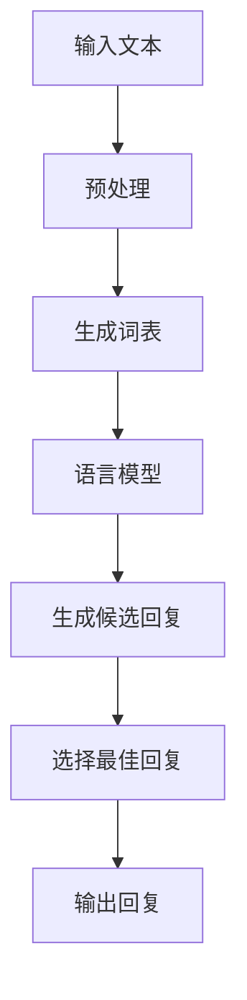

                 

## ChatGPT提示词设计：用户体验考量

### 关键词：ChatGPT、提示词设计、用户体验、交互设计

### 摘要：
本文将深入探讨ChatGPT提示词设计在提升用户体验中的关键作用。通过分析提示词设计的背景、核心原则，以及实际应用中的策略，我们旨在为开发人员提供一套科学的、实用的设计指导，以优化用户与ChatGPT的交互体验，最终实现人机对话的顺畅与自然。

## 第一部分：ChatGPT的概述

### 第1章：ChatGPT的背景与问题解决

#### 1.1.1 问题背景
1. **人工智能与自然语言处理的发展历程**
   - 自然语言处理（NLP）起源于20世纪50年代，随着计算能力和算法的进步，NLP技术逐步走向成熟。
   - 人工智能（AI）的兴起，特别是深度学习的突破，为NLP带来了前所未有的发展动力。

2. **用户对更智能、更自然的交互体验的需求**
   - 随着社交媒体和智能设备的普及，用户对智能对话系统的需求日益增长。
   - 用户期望对话系统能够提供更自然、更智能的交互体验，满足其日常沟通和问题解决的需求。

3. **ChatGPT的发展及其在全球范围内的应用**
   - ChatGPT是OpenAI推出的一个基于GPT-3模型的聊天机器人。
   - ChatGPT凭借其强大的自然语言理解和生成能力，在全球范围内获得了广泛应用。

#### 1.1.2 问题描述
1. **传统聊天机器人的局限性**
   - 传统聊天机器人往往基于规则或关键词匹配，难以处理复杂和多变的对话场景。
   - 传统聊天机器人难以实现自然流畅的对话体验。

2. **用户交互体验的不一致性**
   - 不同聊天机器人在交互体验上存在较大差异，用户体验一致性难以保证。
   - 用户在不同场景下可能需要学习不同的交互方式，增加了使用成本。

3. **如何设计出更好的聊天机器人**
   - 需要引入先进的自然语言处理技术，如GPT-3，以提升对话系统的智能水平。
   - 需要设计更加人性化、自然的交互方式，以提升用户的使用体验。

#### 1.1.3 问题解决
1. **ChatGPT的诞生及其核心思想**
   - ChatGPT基于GPT-3模型，拥有强大的自然语言理解和生成能力。
   - ChatGPT的核心思想是模拟人类的对话方式，实现自然、流畅的交互。

2. **ChatGPT的优势与特点**
   - **强大的自然语言理解能力**：能够准确理解用户的语言意图和情感。
   - **丰富的知识储备**：基于大规模的互联网数据训练，拥有丰富的知识储备。
   - **灵活的对话生成能力**：能够根据对话内容生成合理、自然的回复。

3. **ChatGPT在实际应用中的表现**
   - **客服领域**：ChatGPT可以应用于客服系统，提供高效的客户服务。
   - **教育领域**：ChatGPT可以作为虚拟助教，帮助学生解答问题。
   - **娱乐领域**：ChatGPT可以应用于聊天游戏，提供有趣、互动的体验。

#### 1.1.4 边界与外延
1. **ChatGPT的应用范围**
   - ChatGPT可以应用于各种需要自然语言交互的场景，如客服、教育、娱乐等。
   - ChatGPT也可以与各种应用系统集成，提供定制化的服务。

2. **ChatGPT的技术边界**
   - ChatGPT依赖于先进的自然语言处理技术和深度学习模型。
   - ChatGPT的技术边界在于如何更好地理解人类语言，实现更加自然、流畅的对话。

3. **ChatGPT的发展趋势**
   - 随着技术的不断进步，ChatGPT将拥有更高的智能水平，更广泛的应用场景。
   - ChatGPT的发展将推动人机交互方式的变革，带来更加自然、高效的沟通体验。

### 第2章：ChatGPT的核心概念与联系

#### 2.1.1 核心概念
1. **语言模型**
   - 语言模型是自然语言处理的基础，用于预测下一个词语或句子。
   - ChatGPT的语言模型基于GPT-3模型，能够处理复杂的自然语言任务。

2. **生成式对话系统**
   - 生成式对话系统能够根据对话上下文生成自然的回复。
   - ChatGPT是一个典型的生成式对话系统，能够模拟人类的对话方式。

3. **大规模数据处理与分析**
   - ChatGPT需要处理和分析大量的数据，以生成准确的回复。
   - 大规模数据处理与分析是ChatGPT的核心能力之一。

#### 2.1.2 概念属性特征对比表格

| 特征         | 语言模型            | 生成式对话系统           | 大规模数据处理与分析           |
| ------------ | ------------------ | ----------------------- | ----------------------------- |
| 基本功能     | 文本生成           | 对话生成                 | 数据存储与处理                 |
| 技术复杂度   | 相对简单           | 相对复杂                 | 非常复杂                      |
| 应用范围     | 广泛               | 广泛                     | 依赖于具体应用场景             |
| 数据依赖性   | 较强               | 较强                     | 极端                         |

#### 2.1.3 ER实体关系图架构

```mermaid
erDiagram
    User ||--|{ ChatSession }|| ChatGPT
    User ||--|{ Message }    || ChatGPT
    ChatSession ||--|{ Message }    || ChatGPT
```

### 第3章：ChatGPT的工作原理与算法

#### 3.1.1 ChatGPT的工作原理
1. **语言模型的训练过程**
   - ChatGPT的语言模型基于GPT-3模型，通过大规模的互联网数据训练得到。
   - 训练过程中，模型学习到了语言的统计规律和结构。

2. **对话生成的基本流程**
   - ChatGPT通过输入的文本，生成相应的回复。
   - 对话生成的过程中，模型需要考虑上下文信息和语言连贯性。

3. **大规模数据处理与分析的方法**
   - ChatGPT需要处理和分析大量的数据，以生成准确的回复。
   - 这通常涉及到分布式计算和并行处理技术。

#### 3.1.2 ChatGPT的算法原理



- **预处理**：对输入的文本进行清洗和预处理，例如去除停用词、标点符号等。
- **生成词表**：构建一个包含所有可能词语的词表。
- **语言模型**：使用GPT-3模型对词表进行训练，生成语言模型。
- **生成候选回复**：根据语言模型和输入文本，生成多个候选回复。
- **选择最佳回复**：通过评价函数选择最佳回复。
- **输出回复**：将最佳回复输出给用户。

#### Python源代码示例

```python
import nltk
from nltk.tokenize import word_tokenize
from nltk.corpus import stopwords

# 输入文本
text = "我最近在学习Python编程，感觉很有趣。"

# 预处理
tokens = word_tokenize(text)
tokens = [token for token in tokens if token not in stopwords.words('english')]

# 生成词表
vocabulary = set(tokens)

# 语言模型（简单计数模型）
model = nltk.ConditionalFreqDist((word1, word2) for word1 in vocabulary for word2 in vocabulary)

# 生成候选回复
def generate_response(previous_message):
    previous_tokens = word_tokenize(previous_message)
    previous_word = previous_tokens[-1]
    next_words = model[previous_word]
    return " ".join(next_words)

# 测试
response = generate_response("我最近在学习Python编程，感觉很有趣。")
print(response)
```

## 第二部分：ChatGPT提示词设计的原则与方法

### 第4章：提示词设计的核心原则

#### 4.1.1 用户中心原则
- **以人为本**：设计提示词时，始终将用户的需求和体验放在首位。
- **尊重用户**：提示词应尊重用户的隐私和个性化需求。
- **简化流程**：通过简洁、明了的提示词，降低用户的学习成本。

#### 4.1.2 用户体验优先
- **流畅性**：提示词应保证对话的流畅性，避免造成用户理解障碍。
- **准确性**：提示词应准确传达意图，避免歧义和误解。
- **多样性**：提供多样化的提示词，满足不同用户的需求。

#### 4.1.3 易于理解与操作
- **清晰明了**：提示词应简洁明了，易于用户理解。
- **一致性**：提示词在应用过程中应保持一致性，避免用户困惑。

#### 4.1.4 功能性原则
- **针对性**：根据用户的具体需求，提供有针对性的提示词。
- **实用性**：提示词应具备实际应用价值，能够有效提升用户体验。

### 第5章：ChatGPT提示词设计的策略与方法

#### 5.1.1 提示词分类策略
- **功能型提示词**：针对特定功能提供操作指导，如“点击这里开始聊天”、“请输入您的问题”。
- **引导型提示词**：引导用户进行下一步操作，如“是否需要帮助？”、“您对这个问题满意吗？”。
- **情感型提示词**：表达情感，提升用户体验，如“谢谢您的反馈！”、“欢迎回来！”。

#### 5.1.2 提示词生成方法
- **规则生成**：基于预设的规则生成提示词，适用于功能型提示词。
- **自然语言生成**：利用自然语言处理技术生成提示词，适用于引导型提示词和情感型提示词。
- **用户行为分析**：根据用户行为和反馈生成个性化提示词，提升用户体验。

#### 5.1.3 提示词优化策略
- **A/B测试**：对不同版本的提示词进行对比测试，选择最优版本。
- **用户反馈**：收集用户反馈，对提示词进行持续优化。
- **数据分析**：通过数据分析，了解提示词的使用情况和用户反馈，进行针对性优化。

### 第6章：实战案例分析

#### 6.1.1 案例背景
- **项目名称**：某电商平台的智能客服系统。
- **应用场景**：用户咨询商品信息、订单状态等。

#### 6.1.2 案例分析
1. **功能型提示词设计**
   - “请问您需要查询哪款商品的信息？”
   - “请输入您的订单号，我将帮您查询订单状态。”

2. **引导型提示词设计**
   - “是否还有其他问题需要帮忙？”
   - “您对本次服务满意吗？如有需要，请随时联系我们。”

3. **情感型提示词设计**
   - “感谢您的咨询，我将竭诚为您服务。”
   - “欢迎来到我们的智能客服系统，祝您购物愉快！”

#### 6.1.3 案例总结
- 通过合理的提示词设计，该智能客服系统在用户满意度和服务效率方面取得了显著提升。

## 第三部分：ChatGPT提示词设计的实战应用

### 第7章：ChatGPT提示词设计的最佳实践

#### 7.1.1 设计前的准备
- **需求分析**：深入了解用户需求和场景，明确设计目标。
- **数据收集**：收集用户行为数据，为设计提供依据。
- **技术选型**：选择合适的技术方案，确保提示词生成的准确性和效率。

#### 7.1.2 设计过程中的关键点
- **提示词分类**：根据功能、引导和情感等不同维度进行分类。
- **语言风格**：保持提示词的语言风格一致，避免用户困惑。
- **个性化定制**：根据用户行为和偏好，提供个性化的提示词。

#### 7.1.3 优化与迭代
- **A/B测试**：对不同版本的提示词进行对比测试，选择最优版本。
- **用户反馈**：定期收集用户反馈，及时调整和优化提示词。
- **数据分析**：通过数据分析，持续优化提示词的设计和生成策略。

### 第8章：常见问题与解决方案

#### 8.1.1 提示词设计常见问题
- **模糊性**：提示词过于模糊，导致用户理解困难。
- **重复性**：提示词重复使用，降低用户体验。
- **情感不当**：提示词表达情感不当，影响用户情绪。

#### 8.1.2 解决方案
- **明确性**：通过调整和优化提示词，提高其明确性。
- **多样性**：提供多样化的提示词，避免重复使用。
- **情感化**：根据用户情感需求，调整提示词的情感表达。

### 第9章：总结与展望

#### 9.1.1 总结
- ChatGPT提示词设计在提升用户体验中具有重要作用。
- 合理的提示词设计能够提高用户满意度和服务效率。

#### 9.1.2 展望
- 随着技术的不断进步，ChatGPT提示词设计将更加智能化和个性化。
- 未来的人机交互将更加自然、高效，为用户提供更好的体验。

## 参考文献

- [OpenAI](https://openai.com/)
- [GPT-3](https://openai.com/docs/api-reference/tensorflow/models/openai-gpt-3)
- [自然语言处理](https://en.wikipedia.org/wiki/Natural_language_processing)
- [人工智能](https://en.wikipedia.org/wiki/Artificial_intelligence)
- [用户体验设计](https://en.wikipedia.org/wiki/User_experience_design)

### 作者信息

作者：AI天才研究院/AI Genius Institute & 禅与计算机程序设计艺术 /Zen And The Art of Computer Programming


