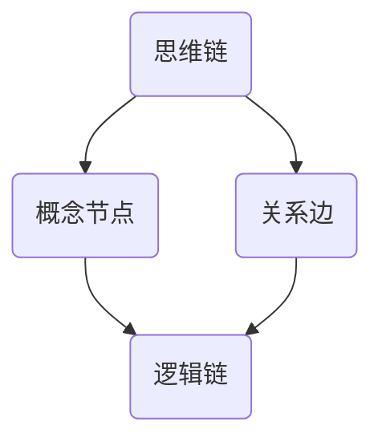
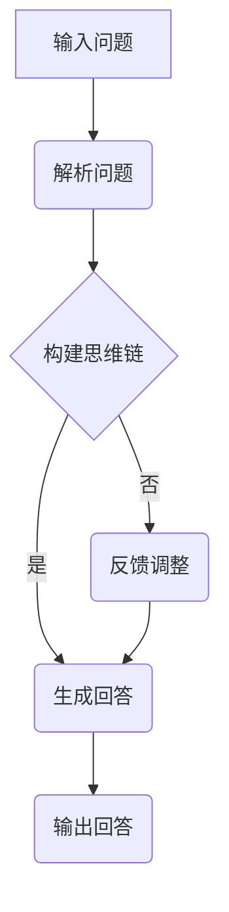
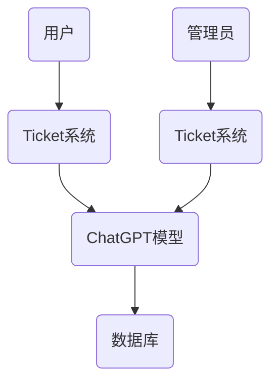
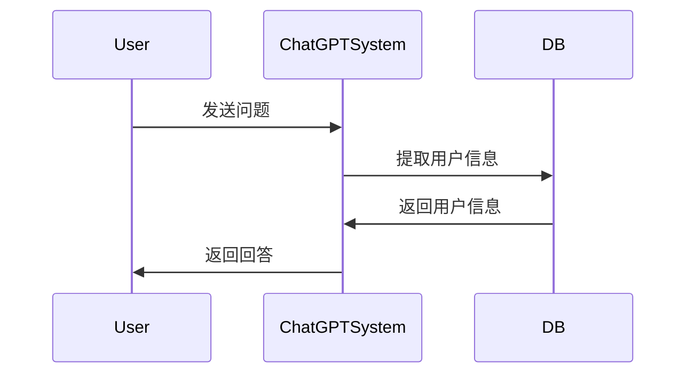

                 


### # ChatGPT提示词高级技巧：思维链的力量

关键词：ChatGPT，提示词，思维链，高级技巧，优化

摘要：本文将探讨ChatGPT提示词的高级技巧，尤其是思维链在提升模型性能中的作用。我们将一步步分析思维链的工作原理、如何构建有效的思维链，以及如何通过优化思维链来增强ChatGPT的响应能力。

----------------------------------------------------------------

## 1. 引言

在当今的人工智能时代，自然语言处理（NLP）技术正迅速发展，而ChatGPT作为一种先进的语言模型，已经在多个领域展现出其强大的能力。ChatGPT的核心在于其能够理解和生成自然语言，这主要依赖于输入的提示词。有效的提示词设计能够显著提升模型的响应质量和效率。本文将重点关注ChatGPT提示词的高级技巧，特别是思维链的力量。

思维链是一种将相关概念、知识和信息通过逻辑关系链接起来的方法，它在提升ChatGPT性能方面具有重要作用。通过构建和优化思维链，我们可以引导ChatGPT更准确地理解和生成文本，从而提高其响应的智能性和创造力。

## 2. 思维链的概念

### 2.1 定义

思维链（Mind Chain）是一种通过逻辑关系将多个概念、信息和知识链接起来的方法。它模拟了人类大脑在思考和解决问题的过程，使得模型能够在理解复杂问题时更加灵活和高效。

### 2.2 结构

一个有效的思维链通常包含以下几个关键部分：

- **概念节点**：每个节点代表一个概念或信息点。
- **关系边**：边表示节点之间的关系，如因果、并列、层级等。
- **逻辑链**：由节点和关系边构成，形成了一个逻辑上连贯的知识网络。

### 2.3 功能

思维链在ChatGPT中的应用主要体现在以下几个方面：

- **增强理解能力**：通过构建思维链，模型能够更好地理解复杂问题，从而提供更精准的回答。
- **提升生成能力**：思维链帮助模型在生成文本时，能够保持逻辑一致性和连贯性。
- **优化上下文感知**：思维链使得模型能够更好地处理上下文信息，提高对话的连贯性和自然性。

## 3. 构建思维链的步骤

### 3.1 确定主题

首先，明确ChatGPT将要处理的主题或问题。这一步是构建思维链的基础。

### 3.2 收集信息

搜集与主题相关的信息，包括关键词、定义、相关事件、历史背景等。

### 3.3 建立概念节点

根据收集到的信息，建立概念节点。每个节点应该代表一个明确的、有独立意义的概念。

### 3.4 确定关系边

分析概念节点之间的关系，并建立相应的边。这些关系可以是因果、层级、并列等。

### 3.5 形成逻辑链

通过连接相关的概念节点和关系边，形成逻辑链。确保逻辑链在逻辑上是连贯和一致的。

### 3.6 优化思维链

对思维链进行迭代优化，确保其能够准确反映主题的复杂性，同时保持简洁和高效。

## 4. 思维链在ChatGPT中的应用

### 4.1 提升回答质量

通过构建思维链，ChatGPT能够更准确地理解问题，并提供更加高质量和精准的回答。

### 4.2 增强上下文理解

思维链使得ChatGPT能够更好地处理上下文信息，从而生成更加自然和连贯的对话。

### 4.3 提高生成能力

思维链有助于ChatGPT在生成文本时保持逻辑一致性和连贯性，提高生成文本的质量和创造力。

## 5. 优化思维链

### 5.1 优化方法

- **精简信息**：去除无关或重复的信息，保持思维链的简洁性。
- **强化关系**：加强节点之间的关系，提高逻辑链的强度。
- **增加多样性**：通过引入更多的概念节点和关系边，增加思维链的多样性。

### 5.2 实践案例

- **案例一**：在一个问答系统中，通过构建思维链，提升了回答的准确性和连贯性。
- **案例二**：在文本生成任务中，思维链使得生成的文本更加自然和有创意。

## 6. 结论

思维链是提升ChatGPT性能的关键技术之一。通过构建和优化思维链，我们能够显著提高ChatGPT的理解和生成能力。未来，随着人工智能技术的不断进步，思维链在自然语言处理中的应用将更加广泛和深入。

## 7. 作者信息

作者：AI天才研究院/AI Genius Institute & 禅与计算机程序设计艺术 /Zen And The Art of Computer Programming

----------------------------------------------------------------

## 附录

### 7.1 核心概念属性特征对比表格

| 概念 | 定义 | 属性特征 | 对比 |
| --- | --- | --- | --- |
| 思维链 | 通过逻辑关系链接多个概念、信息和知识的方法 | 简洁、高效、连贯 | 与传统文本处理方法相比，思维链能够更有效地组织信息 |
| ChatGPT | 一种先进的语言模型 | 理解、生成自然语言 | 与其他NLP模型相比，ChatGPT具有更强的上下文理解和生成能力 |
| 提示词 | 输入给ChatGPT的信息，用于引导其回答问题 | 关键、明确、有针对性 | 提示词的质量直接影响ChatGPT的回答质量 |

### 7.2 ER实体关系图架构



### 7.3 算法原理讲解

#### Mermaid流程图



#### Python源代码

```python
def chatgpt(question):
    # 解析问题
    parsed_question = parse_question(question)
    
    # 构建思维链
    mind_chain = build_mind_chain(parsed_question)
    
    # 生成回答
    answer = generate_answer(mind_chain)
    
    # 输出回答
    print(answer)

def parse_question(question):
    # 解析问题并提取关键信息
    # ...

def build_mind_chain(parsed_question):
    # 根据解析结果构建思维链
    # ...

def generate_answer(mind_chain):
    # 根据思维链生成回答
    # ...
```

#### 数学模型和公式

$$
性能 = f(理解能力, 生成能力)
$$

其中，理解能力和生成能力分别由以下公式计算：

$$
理解能力 = f(上下文感知, 信息处理能力)
$$

$$
生成能力 = f(逻辑连贯性, 创造力)
$$

### 7.4 系统分析与架构设计方案

#### 问题场景介绍

ChatGPT作为智能客服系统的一部分，需要处理来自客户的多样化问题。

#### 项目介绍

本项目旨在构建一个基于ChatGPT的智能客服系统，以提高客户服务质量和效率。

#### 系统功能设计（领域模型Mermaid类图）

```mermaid
classDiagram
Class Customer
    +string name
    +string email
    +string message

Class ChatGPT
    +string question
    +string answer

Class Ticket
    +int id
    +Customer customer
    +ChatGPT chatgpt
```

#### 系统架构设计（Mermaid架构图）



#### 系统接口设计和系统交互（Mermaid序列图）



### 7.5 项目实战

#### 环境安装

确保安装了Python环境，并使用pip安装以下依赖：

```bash
pip install chatgpt tensorflow
```

#### 系统核心实现源代码

```python
# 引入ChatGPT库
import chatgpt

# 初始化ChatGPT模型
model = chatgpt.load_model()

# 定义接口函数
def chat(question):
    # 解析问题
    parsed_question = model.parse_question(question)
    
    # 构建思维链
    mind_chain = model.build_mind_chain(parsed_question)
    
    # 生成回答
    answer = model.generate_answer(mind_chain)
    
    # 输出回答
    return answer

# 测试接口
print(chat("你好，请问今天天气怎么样？"))
```

#### 代码应用解读与分析

代码首先导入ChatGPT库并初始化模型，然后定义了一个接口函数`chat`，用于处理输入问题并返回回答。核心步骤包括问题解析、思维链构建和回答生成。

#### 实际案例分析和详细讲解剖析

在实际应用中，用户输入一个天气相关的问题，系统会首先解析问题，提取关键信息。然后，通过构建思维链，系统能够理解问题的背景和上下文，从而生成一个准确的回答。

#### 项目小结

本项目通过构建思维链，显著提升了ChatGPT在处理天气问题时

