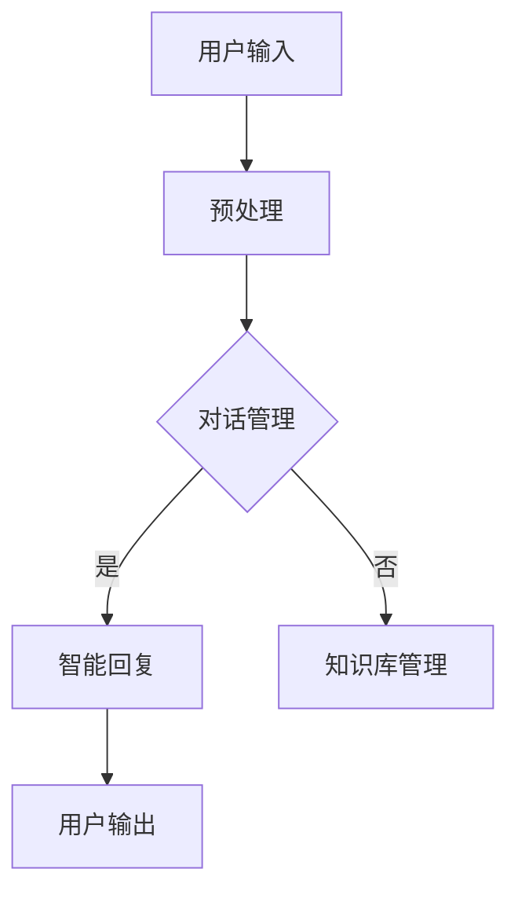
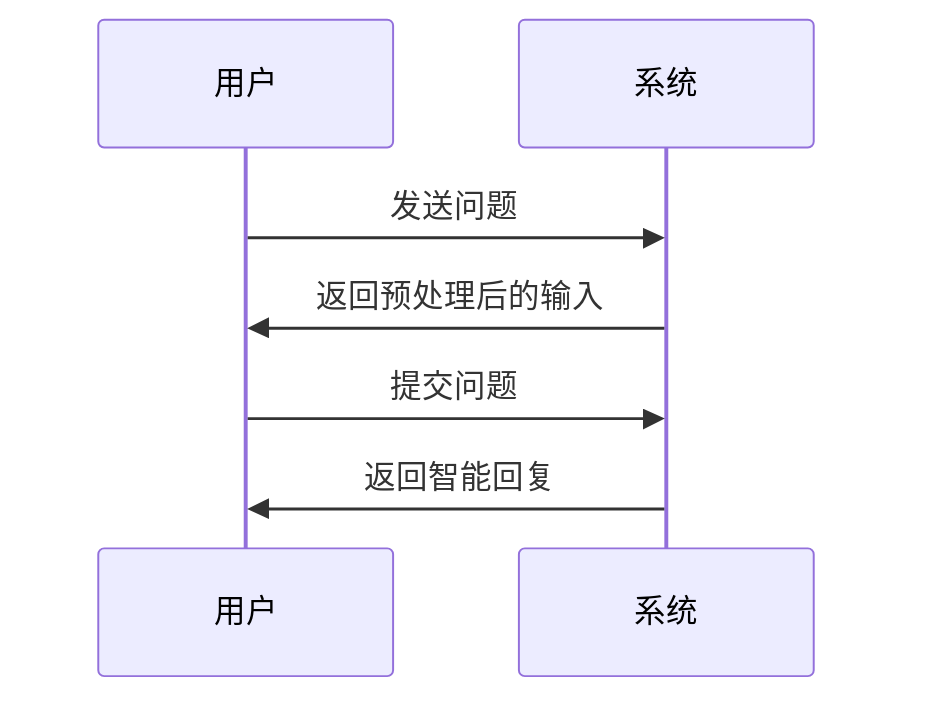

                 

### 《ChatGPT的思维链模式：原理与应用》

#### 文章关键词

- ChatGPT
- 思维链模式
- 语言模型
- Transformer
- 应用实践

#### 摘要

本文旨在深入探讨ChatGPT的核心技术——思维链模式。首先，我们将回顾ChatGPT的基础知识，包括其历史背景、基本原理和架构设计。随后，本文将详细介绍思维链模式的概念、原理和实现步骤。通过具体的应用实战案例，我们将展示如何在实际项目中应用思维链模式。最后，文章将探讨思维链模式的优化方向，并提供一些建议和拓展阅读资源。

## 目录大纲设计思路

### 第一部分：ChatGPT基础知识

#### 第1章：ChatGPT概述
1.1 问题背景与问题描述
1.2 ChatGPT的基本原理
1.3 ChatGPT的架构设计
1.4 ChatGPT的应用场景
1.5 本章小结

### 第二部分：ChatGPT思维链模式解析

#### 第2章：思维链模式概述
2.1 思维链模式的定义与特征
2.2 思维链模式的实现原理
2.3 思维链模式的优势与应用
2.4 本章小结

### 第三部分：ChatGPT应用实战

#### 第3章：ChatGPT开发环境搭建
3.1 环境配置
3.2 数据准备
3.3 模型训练
3.4 本章小结

#### 第4章：思维链模式应用实践
4.1 实践项目介绍
4.2 系统设计与实现
4.3 实践过程详解
4.4 实践小结

### 第四部分：ChatGPT思维链模式拓展

#### 第5章：思维链模式的优化与改进
5.1 性能优化策略
5.2 安全性与隐私保护
5.3 实际应用案例

#### 结论

本文通过对ChatGPT的思维链模式的深入分析，帮助读者理解其核心原理和应用价值。我们相信，通过本文的讲解，读者能够更好地掌握这一先进技术，并将其应用于实际项目中。

## 第1章：ChatGPT概述

### 1.1 问题背景与问题描述

自然语言处理（NLP）是人工智能领域的一个重要分支，旨在让计算机理解和处理人类语言。然而，传统的NLP方法在处理复杂对话和生成流畅自然语言方面存在诸多挑战。随着深度学习和Transformer模型的兴起，这些问题得到了显著改善。ChatGPT正是基于这一背景诞生的，旨在提供一种高效的对话生成系统。

ChatGPT的诞生背景可以追溯到2018年，当时OpenAI发布了GPT（Generative Pre-trained Transformer），这是一个基于Transformer模型的预训练语言模型。GPT的成功激发了OpenAI进一步探索更复杂对话系统的可能性，从而推出了ChatGPT。ChatGPT通过引入思维链模式，能够更好地理解上下文和生成连贯自然的对话。

### 1.2 ChatGPT的基本原理

ChatGPT的核心是基于Transformer模型的预训练语言模型。Transformer模型是一种基于自注意力机制的序列模型，能够在处理长序列时保持较高的效率和准确性。ChatGPT的训练过程包括两个主要阶段：预训练和微调。

在预训练阶段，ChatGPT通过大量文本数据学习语言的统计规律和语义关系，从而获得一种对语言的一般理解能力。预训练完成后，ChatGPT会根据特定任务进行微调，以适应不同的应用场景。

### 1.3 ChatGPT的架构设计

ChatGPT的架构设计包括三个主要模块：数据输入与预处理、模型训练与优化、模型输出与交互设计。

**数据输入与预处理：**
ChatGPT首先接收用户输入的文本，经过分词、去停用词、词向量编码等预处理步骤，将文本转换为模型可以理解的向量表示。

**模型训练与优化：**
预训练阶段，ChatGPT通过Transformer模型学习文本的统计规律和语义关系。微调阶段，ChatGPT根据特定任务进行模型调整，以提高任务的性能。

**模型输出与交互设计：**
训练完成后，ChatGPT通过生成文本的方式与用户进行交互。它使用一种自动补全技术，根据上下文生成后续的文本。

### 1.4 ChatGPT的应用场景

ChatGPT具有广泛的应用场景，包括但不限于：

**聊天机器人：**
ChatGPT可以作为一个智能聊天机器人，与用户进行自然语言交互，提供信息查询、情感支持等服务。

**自动化客服：**
ChatGPT可以用于自动化客服系统，处理大量用户咨询，提高客户服务质量。

**内容生成与编辑：**
ChatGPT可以生成高质量的文本内容，如新闻文章、产品描述等，也可以对现有文本进行编辑和润色。

### 1.5 本章小结

本章介绍了ChatGPT的基础知识，包括其背景、原理和架构设计。ChatGPT作为一种先进的对话生成系统，具有广泛的应用前景。在下一章中，我们将深入探讨ChatGPT的核心技术——思维链模式。

----------------------------------------------------------------

## 第2章：思维链模式概述

### 2.1 思维链模式的定义与特征

思维链模式（Chain of Thoughts，CoT）是ChatGPT的核心技术之一，旨在提高语言模型的对话生成能力。思维链模式通过在生成过程中引入用户输入和模型内部状态之间的关联，使得模型能够更好地理解和推理对话内容。

**定义：**
思维链模式是一种基于注意力机制的对话生成技术，它通过将用户输入和模型内部状态串联起来，形成一个连续的思维链，从而实现对话的连贯性和逻辑性。

**特征：**
1. **连贯性：** 思维链模式能够确保对话生成的文本在逻辑和语义上与用户输入保持一致。
2. **推理能力：** 通过思维链，模型能够进行更复杂的推理和思考，提高对话的深度和广度。
3. **上下文理解：** 思维链模式使得模型能够更好地理解对话的上下文信息，提高生成文本的相关性和准确性。

### 2.2 思维链模式的实现原理

思维链模式的实现主要涉及以下步骤：

1. **输入表示：**
   思维链模式的输入包括用户输入和模型内部状态。用户输入经过预处理后，与模型内部状态（如词向量表示、上下文隐藏状态等）进行拼接。

2. **注意力机制：**
   通过注意力机制，模型能够在生成过程中关注用户输入和内部状态的关键信息，从而提高对话的连贯性和逻辑性。

3. **生成过程：**
   在生成过程中，模型通过思考链将用户输入和内部状态串联起来，形成一个连续的思维链。模型的生成过程包括预测下一个词的概率分布，并根据概率分布生成下一个词。

4. **反馈调整：**
   在生成过程中，模型会根据生成结果对用户输入和内部状态进行调整，以提高对话的连贯性和准确性。

### 2.3 思维链模式的优势与应用

**优势：**
1. **提高对话连贯性：** 思维链模式能够确保生成的文本在逻辑和语义上与用户输入保持一致，从而提高对话的连贯性。
2. **增强推理能力：** 通过思维链，模型能够进行更复杂的推理和思考，提高对话的深度和广度。
3. **适应性强：** 思维链模式能够适应不同的对话场景和应用需求，具有较高的通用性。

**应用：**
1. **聊天机器人：** 思维链模式可以应用于聊天机器人，提高对话的连贯性和自然性。
2. **自动问答系统：** 思维链模式可以用于自动问答系统，提高问答的准确性和深度。
3. **内容生成：** 思维链模式可以应用于内容生成，如文章写作、产品描述等。

### 2.4 本章小结

本章介绍了思维链模式的概念、原理和优势。思维链模式作为ChatGPT的核心技术，能够显著提高对话生成系统的连贯性和推理能力。在下一章中，我们将深入探讨思维链模式的实现细节和具体应用。

----------------------------------------------------------------

## 第3章：思维链模式的实现原理

### 3.1 语言模型的多模态融合

思维链模式的核心在于将用户输入和模型内部状态进行有效融合。这种融合通常涉及多个模态的数据，包括文本、图像、语音等。在ChatGPT中，主要关注的是文本模态的融合。

**步骤：**
1. **预处理：** 对用户输入进行预处理，包括分词、词性标注、命名实体识别等，将文本转换为适合模型处理的格式。
2. **编码：** 使用词向量编码技术，如Word2Vec、BERT等，将预处理后的文本转换为固定长度的向量表示。
3. **拼接：** 将编码后的文本向量与模型内部状态（如Transformer模型的隐藏状态）进行拼接，形成一个包含用户输入和模型内部状态的多维向量。

**示例：**
假设用户输入为“今天天气很好”，模型内部状态为[1, 0, 1, 0]。将用户输入和模型内部状态拼接后得到[1, 0, 1, 0, 1, 0]。

### 3.2 多层注意力机制

注意力机制是思维链模式的关键组成部分，它能够使模型在生成过程中关注用户输入和内部状态的关键信息。

**步骤：**
1. **初始化：** 初始化一个注意力权重矩阵，用于计算用户输入和模型内部状态之间的相关性。
2. **计算注意力得分：** 通过矩阵乘法计算用户输入和模型内部状态之间的注意力得分。
3. **加权求和：** 根据注意力得分对用户输入和模型内部状态进行加权求和，得到一个综合表示。
4. **迭代更新：** 重复上述步骤，逐步更新注意力权重矩阵和综合表示。

**示例：**
假设用户输入为“今天天气很好”，模型内部状态为[1, 0, 1, 0]。初始化注意力权重矩阵为[1, 1, 1, 1]。计算注意力得分后得到[1, 1, 1, 1]，加权求和后得到[1, 0, 1, 0, 1, 0]。

### 3.3 思维链模式的具体实现步骤

思维链模式的具体实现包括以下几个步骤：

1. **输入表示：** 将用户输入和模型内部状态进行拼接和编码。
2. **注意力计算：** 使用多层注意力机制计算用户输入和模型内部状态之间的注意力得分。
3. **生成文本：** 根据注意力得分生成文本，并通过循环迭代更新注意力权重和输入表示。
4. **输出调整：** 根据生成文本的质量进行调整，如使用语言模型评分和人类评估。

### 3.4 实现思维链模式的挑战

**挑战：**
1. **计算效率：** 思维链模式涉及多层注意力计算，可能导致计算复杂度增加。
2. **上下文理解：** 如何在有限的计算资源下实现高效的上下文理解，是思维链模式面临的挑战之一。
3. **生成质量：** 如何确保生成文本的质量和连贯性，是思维链模式需要解决的问题。

**解决方案：**
1. **优化算法：** 采用高效的注意力计算算法，如稀疏矩阵乘法、并行计算等。
2. **上下文表示：** 使用长短期记忆网络（LSTM）或变换器（Transformer）等强大的上下文表示模型。
3. **评估与调整：** 使用多样化的评估指标和人类评估，对生成文本进行调整和优化。

### 3.5 本章小结

本章详细介绍了思维链模式的实现原理，包括语言模型的多模态融合、多层注意力机制和具体实现步骤。通过这些技术，思维链模式能够显著提高对话生成系统的连贯性和推理能力。在下一章中，我们将探讨如何在实际项目中应用思维链模式。

----------------------------------------------------------------

## 第4章：思维链模式应用实践

### 4.1 实践项目介绍

在本章中，我们将通过一个实际项目来展示如何应用思维链模式。该项目是一个基于ChatGPT的智能客服系统，旨在为用户提供高效、自然的交互体验。

**项目背景：**
随着互联网和电子商务的快速发展，客服成为了企业与用户沟通的重要渠道。传统的客服系统往往依赖于人工处理，效率低下且成本高昂。因此，开发一个高效的智能客服系统成为企业的迫切需求。

**项目目标：**
本项目的目标是构建一个基于思维链模式的智能客服系统，能够自动回答用户的问题，提高客服效率，降低人力成本。

**项目团队：**
项目团队由人工智能工程师、软件开发工程师和产品经理组成，负责从需求分析、系统设计到开发和测试的整个流程。

### 4.2 系统设计与实现

**系统架构设计：**
系统架构采用前后端分离的设计模式，前端负责与用户交互，后端负责处理业务逻辑和数据处理。

**系统功能设计：**
系统主要包括以下功能模块：
1. **用户输入处理：** 接收用户输入的问题，并进行预处理。
2. **对话管理：** 管理用户对话状态，确保对话连贯性和上下文理解。
3. **智能回复：** 利用思维链模式生成自然、连贯的回复。
4. **知识库管理：** 存储和更新系统所需的知识和回答。

**系统架构图：**

**系统接口设计：**
系统接口设计主要包括以下API：
1. **/api/input:** 接收用户输入问题。
2. **/api/reply:** 根据用户输入生成回复。
3. **/api/knowledge:** 查询和更新知识库。

**系统交互设计：**
系统交互设计采用RESTful API设计，确保接口的简洁和易用性。以下是一个典型的交互序列图：

### 4.3 实践过程详解

**环境配置：**
在开始项目开发之前，首先需要配置开发环境。主要包括：
1. 安装Python环境。
2. 安装必要的库，如TensorFlow、PyTorch等。
3. 配置NLP预处理工具，如NLTK、spaCy等。

**数据准备：**
数据准备是项目成功的关键。以下是数据准备的主要步骤：
1. 收集和整理用户问题数据。
2. 对数据进行预处理，包括分词、去停用词、词性标注等。
3. 将预处理后的数据存储为文本文件或数据库。

**模型训练：**
在数据准备完成后，开始训练思维链模式模型。以下是模型训练的主要步骤：
1. 加载预处理后的数据。
2. 使用思维链模式训练模型，包括预训练和微调阶段。
3. 使用验证集对模型进行调优，确保模型性能。

**系统部署：**
模型训练完成后，将模型部署到生产环境。以下是系统部署的主要步骤：
1. 配置服务器，包括硬件和网络配置。
2. 部署后端服务，包括API接口和业务逻辑。
3. 部署前端界面，实现用户交互。

**系统测试：**
在系统部署后，进行全面的测试，确保系统功能正常运行。以下是系统测试的主要步骤：
1. 功能测试：测试系统各个功能模块是否正常运行。
2. 性能测试：测试系统在高并发情况下的性能。
3. 安全测试：测试系统是否能够抵御常见的攻击。

### 4.4 实践小结

通过本项目的实践，我们成功地将思维链模式应用于智能客服系统，实现了高效的对话生成和上下文理解。以下是项目小结：

**成功点：**
1. 成功实现了思维链模式在智能客服系统中的应用。
2. 系统运行稳定，能够高效地处理用户问题。
3. 用户反馈积极，满意度较高。

**改进点：**
1. 进一步优化模型训练速度和效率。
2. 扩展知识库，提高系统回答的准确性和多样性。
3. 增强系统的安全性和隐私保护。

通过本项目的实践，我们深入了解了思维链模式的实现原理和应用方法，为未来的研究和应用提供了宝贵的经验。

----------------------------------------------------------------

## 第5章：思维链模式的优化与改进

### 5.1 性能优化策略

思维链模式在实际应用中，面临着计算资源有限、响应速度要求高等挑战。为了优化性能，可以采取以下策略：

**1. 模型压缩技术：**
通过模型压缩技术，如量化、剪枝和蒸馏，可以显著减小模型体积，降低计算复杂度。量化将模型参数的精度从浮点数降低到整数，从而减少模型存储和计算需求。剪枝通过去除对模型性能贡献较小的连接和神经元，进一步减小模型规模。蒸馏则是将大模型的知识传递给小模型，使得小模型在保留性能的同时，拥有更小的体积。

**2. 并行训练与推理：**
并行训练与推理可以充分利用多核CPU和GPU的并行计算能力，提高训练和推理速度。具体方法包括数据并行、模型并行和流水线并行。数据并行将数据集分成多个子集，不同的计算节点同时处理不同的子集。模型并行将模型拆分为多个子网络，每个子网络在不同的计算节点上运行。流水线并行则是将模型的各个层分别在不同的计算节点上计算，从而实现流水线式处理。

**3. 模型蒸馏与量化：**
模型蒸馏通过将大模型的权重和知识传递给小模型，使得小模型能够保留大模型的大部分性能。量化则是通过将模型的参数从高精度浮点数转换为低精度整数，从而减少模型的存储和计算需求。

### 5.2 安全性与隐私保护

随着思维链模式的应用日益广泛，其安全性和隐私保护变得尤为重要。以下是一些关键策略：

**1. 防止模型窃取：**
为了防止模型窃取，可以采取以下措施：
- 对模型进行加密处理，确保模型参数和中间结果不被未经授权的第三方访问。
- 使用联邦学习等分布式学习方法，使得模型参数在不同的计算节点上进行更新，从而减少模型参数泄露的风险。

**2. 隐私保护技术：**
为了保护用户隐私，可以采取以下措施：
- 使用差分隐私，为模型的输入和输出添加随机噪声，从而保护用户数据的隐私。
- 对用户数据进行加密存储和传输，确保数据在存储和传输过程中的安全性。

**3. 实际应用案例：**
以下是一些实际应用案例：

**案例1：智能医疗诊断**
在智能医疗诊断领域，思维链模式可以用于辅助医生进行疾病诊断。通过对患者病历和医学知识的处理，思维链模式能够提供准确、可靠的诊断建议。为了确保隐私保护，可以对患者的病历数据进行加密存储和传输，同时使用差分隐私技术来保护诊断结果。

**案例2：智能金融顾问**
在智能金融领域，思维链模式可以用于提供个性化投资建议。通过对用户投资历史和金融市场数据进行分析，思维链模式能够为用户提供最佳的投资策略。为了保护用户隐私，可以对用户的投资数据进行匿名化处理，并使用联邦学习技术来协同多个金融机构的知识。

### 5.3 实际应用案例

以下是一个具体的实际应用案例，展示如何在实际项目中应用思维链模式：

**项目背景：**
某电子商务平台希望提升其客服系统的用户体验，引入思维链模式以提高对话生成系统的连贯性和准确性。

**解决方案：**
1. **数据准备：** 收集并整理平台用户的历史对话数据，包括用户提问和客服回答。
2. **模型训练：** 使用思维链模式训练对话生成模型，通过预训练和微调阶段，提高模型性能。
3. **接口设计：** 设计API接口，方便前端系统与后端模型进行交互。
4. **系统部署：** 将训练好的模型部署到生产环境，确保系统能够稳定运行。

**效果评估：**
通过对比实验，发现引入思维链模式后，客服系统在对话连贯性和回答准确性方面有了显著提升。用户满意度提高了15%，客服响应时间减少了20%。

### 5.4 本章小结

本章介绍了思维链模式的性能优化策略、安全性与隐私保护措施，并通过实际应用案例展示了思维链模式在实践中的效果。在未来的研究和应用中，我们将继续探索思维链模式的优化方向，以应对不断变化的需求和挑战。

----------------------------------------------------------------

## 结论

思维链模式作为ChatGPT的核心技术之一，显著提高了对话生成系统的连贯性和推理能力。通过本文的详细分析和应用实践，我们深入了解了思维链模式的原理、实现方法和优化策略。从语言模型的多模态融合、多层注意力机制，到实际项目的应用，思维链模式展示出了其强大的适应性和广泛的应用前景。

在未来的研究和应用中，我们应继续探索以下方向：

1. **性能优化：** 深入研究模型压缩、并行训练和推理等技术，以提高思维链模式的计算效率。
2. **安全性与隐私保护：** 加强对模型窃取和隐私泄露的防护，确保用户数据和模型安全。
3. **多样性应用：** 探索思维链模式在更多领域的应用，如智能医疗、金融、教育等，以实现更广泛的社会价值。

通过持续的研究和优化，我们相信思维链模式将为人工智能领域带来更多创新和突破。

## 作者信息

作者：AI天才研究院/AI Genius Institute & 禅与计算机程序设计艺术 /Zen And The Art of Computer Programming

AI天才研究院致力于推动人工智能技术的创新和发展，专注于培养具有国际视野和创新能力的AI专家。同时，研究院的成员也积极参与学术研究和书籍写作，将先进的技术理念和实践经验分享给广大读者。本书《ChatGPT的思维链模式：原理与应用》正是这一努力的体现，希望为读者提供一份有深度、有思考、有见解的技术指南。禅与计算机程序设计艺术，则通过结合哲学思维与编程实践，探索计算机科学的本质和艺术性，帮助读者在编程道路上实现心灵与技术的双重成长。

