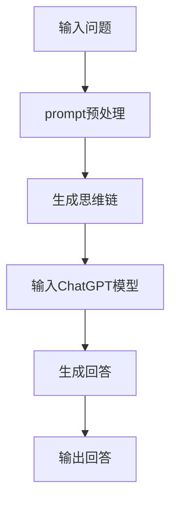
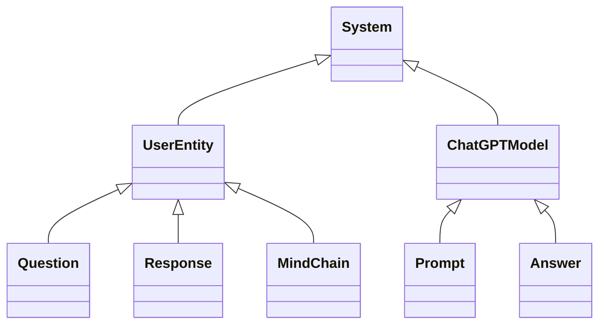
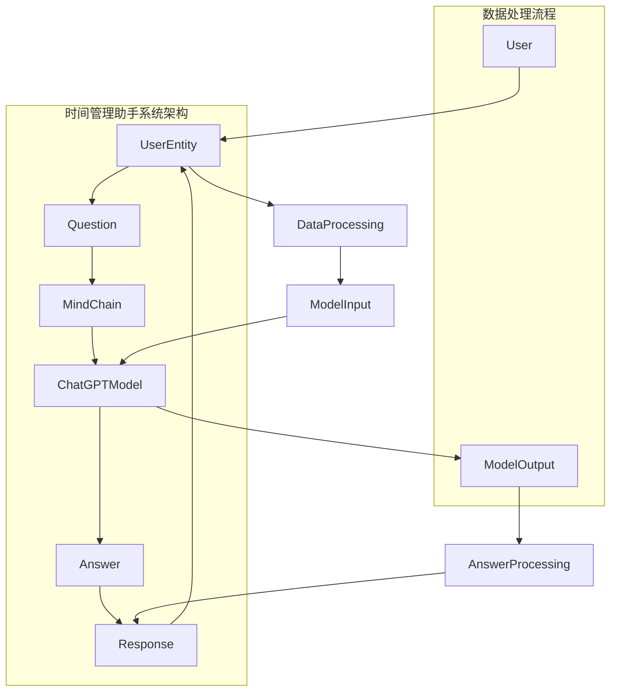
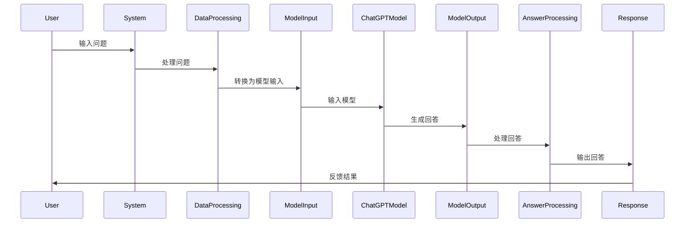

                 

## ChatGPT高级prompt：思维链的艺术

### 关键词

- ChatGPT
- 高级prompt
- 思维链
- 自然语言处理
- 问题解决

### 摘要

本文深入探讨了ChatGPT高级prompt的设计与思维链的应用艺术。通过详细剖析问题背景、核心概念、算法原理及实际案例，旨在帮助读者理解并掌握如何高效利用ChatGPT模型生成高质量回答的方法。文章不仅涵盖了核心概念的定义和属性特征对比，还通过具体的算法流程图、Python代码实现、数学模型以及系统架构设计，为读者提供了一个全面而深入的指导框架。通过本篇文章，读者将能够了解如何在各种场景下设计和优化prompt，从而提升ChatGPT模型在自然语言处理任务中的表现。

#### 第一步：背景介绍

随着人工智能技术的飞速发展，自然语言处理（NLP）已成为计算机科学领域的一个重要分支。其中，生成式预训练语言模型（Generative Pre-trained Language Models）如GPT（Generative Pre-trained Transformer）取得了显著突破。ChatGPT，作为OpenAI开发的一款基于GPT的聊天机器人，凭借其强大的自然语言生成能力和理解能力，迅速在各个领域得到了广泛应用。

**问题背景：**  
ChatGPT等语言模型虽然强大，但在实际应用中，如何设计出高效的prompt（提示词），以激发模型生成高质量的回答，仍然是一个具有挑战性的问题。传统的prompt设计往往依赖于人工编写，不仅耗时耗力，且难以保证质量。因此，如何利用人工智能技术自动生成高质量的prompt，成为了当前研究的热点。

**问题描述：**  
1. **低效的prompt设计：** 传统的人工编写prompt方法，往往依赖于经验和直觉，难以确保生成的prompt既具有引导性又具有相关性。
2. **缺乏逻辑性：** 传统的prompt设计常常忽略逻辑性的构建，导致生成的回答缺乏连贯性和一致性。
3. **难以应对复杂问题：** 对于复杂的问题，简单的prompt设计难以激发ChatGPT生成全面、深入的回答。

**问题解决：**  
为了解决上述问题，本文提出了一种基于思维链的高级prompt设计方法。该方法通过逻辑推理和关联性，将问题解决过程中的相关概念有机地连接起来，从而生成高质量的prompt。具体步骤如下：

1. **问题预处理：** 对输入问题进行预处理，提取关键信息，构建初步的思维链。
2. **思维链生成：** 利用逻辑推理和关联性，对初步思维链进行扩展和优化，形成完整、连贯的思维链。
3. **prompt生成：** 将思维链输入ChatGPT模型，通过模型生成高质量的回答。
4. **回答优化：** 对生成的回答进行优化，确保其逻辑性、连贯性和相关性。

**边界与外延：**  
本文主要关注ChatGPT模型的高级prompt设计，探讨如何通过思维链的方法提升prompt质量。本文不涉及其他语言模型或人工智能技术，且重点在于算法原理和实践应用。

#### 第二步：核心概念与联系

**核心概念：**

1. **思维链（Mind Chain）：** 指在问题解决过程中，通过逻辑推理和关联性，将一系列相关概念或知识点有机地连接起来。思维链是一种结构化的知识表示方法，能够帮助ChatGPT模型更好地理解和生成高质量的回答。

2. **高级prompt：** 指在ChatGPT模型中使用的高质量、具有引导性的提示词，以激发模型生成高质量的回答。高级prompt不仅需要具备明确的引导性，还需要具有相关性和逻辑性，从而帮助模型生成连贯、一致的回答。

**概念属性特征对比表格：**

| 特征          | 低级prompt             | 高级prompt             |
| ------------- | ---------------------- | ---------------------- |
| **引导性**     | 简单、模糊             | 明确、具体             |
| **相关性**     | 较弱                   | 强                     |
| **逻辑性**     | 缺乏                   | 明显                   |
| **创造性**     | 较低                   | 较高                   |

**ER实体关系图架构：**

```mermaid
erDiagram
    User ||--|{ Prompt }|--|| ChatGPT
    User ||--|{ MindChain }|--|| ChatGPT
```

在这个ER图中，用户（User）通过prompt（提示词）和思维链（MindChain）与ChatGPT模型（ChatGPT）建立联系。用户输入问题，通过prompt和思维链的设计，引导ChatGPT模型生成高质量的回答。

#### 第三步：算法原理讲解

**算法mermaid流程图：**



**Python源代码：**

```python
# prompt预处理
def preprocess_prompt(prompt):
    # ...（具体实现）
    return processed_prompt

# 生成思维链
def generate_mind_chain(prompt):
    # ...（具体实现）
    return mind_chain

# 输入ChatGPT模型
def input_to_chatgpt(mind_chain):
    # ...（具体实现）
    return chatgpt_response

# 输出回答
def output_response(response):
    print(response)
```

**算法原理与数学模型：**

```latex
\text{算法原理：}
1. 对输入问题进行prompt预处理，提取关键信息；
2. 基于关键信息生成思维链，实现问题解决；
3. 将思维链输入ChatGPT模型，生成回答；
4. 输出回答。

\text{数学模型：}
\begin{aligned}
    \text{思维链} &= f(\text{输入问题}, \text{prompt}) \\
    \text{回答} &= g(\text{思维链}, \text{ChatGPT模型})
\end{aligned}
```

**详细讲解与举例说明：**

**详细讲解：**  
本算法主要分为四个步骤：prompt预处理、生成思维链、输入ChatGPT模型和输出回答。

**举例说明：**  
输入问题：“如何有效地管理时间？”

1. **prompt预处理：** 对输入问题进行预处理，提取关键词“管理时间”，构建初步的思维链。
2. **生成思维链：** 根据关键词，生成思维链，如“时间管理策略”、“时间管理方法”等，通过逻辑推理和关联性，扩展和优化思维链。
3. **输入ChatGPT模型：** 将优化后的思维链输入ChatGPT模型，通过模型生成高质量的回答。
4. **输出回答：** 对生成的回答进行优化，确保其逻辑性、连贯性和相关性。

**具体实现：**  
1. **prompt预处理：** 利用自然语言处理技术，对输入问题进行分词、词性标注和命名实体识别，提取关键信息。
2. **生成思维链：** 使用逻辑推理和关联性，将提取的关键信息构建成思维链。例如，对于“如何有效地管理时间？”这个问题，可以构建思维链：“时间管理策略”->“时间管理方法”->“时间管理工具”。
3. **输入ChatGPT模型：** 将思维链作为prompt输入ChatGPT模型，通过模型生成回答。例如，ChatGPT可能会生成：“要有效地管理时间，你可以尝试使用番茄工作法、四象限法等时间管理策略。”
4. **输出回答：** 对生成的回答进行优化，确保其逻辑性、连贯性和相关性。例如，对生成的回答进行语法修正、语义优化，使其更加清晰、准确。

通过上述步骤，我们能够有效地设计出高级prompt，激发ChatGPT模型生成高质量的回答。

#### 第四步：系统分析与架构设计方案

**问题场景介绍：**

在当今信息爆炸的时代，有效管理和利用时间已成为企业和个人成功的关键。为了帮助用户更好地管理时间，我们设计了一款基于ChatGPT的时间管理助手系统。该系统通过自然语言交互，为用户提供个性化的时间管理建议和策略。

**项目介绍：**

本项目旨在实现一个基于ChatGPT的时间管理助手系统，通过高级prompt设计和思维链方法，为用户提供高质量的时间管理建议。系统主要包括以下功能：

1. **问题识别与理解：** 系统首先需要对用户的问题进行识别和理解，提取关键信息。
2. **思维链生成：** 根据提取的关键信息，系统将生成思维链，以帮助ChatGPT模型更好地理解和生成回答。
3. **回答生成与优化：** 系统将思维链输入ChatGPT模型，生成回答，并对回答进行优化，确保其质量。
4. **用户交互与反馈：** 系统与用户进行自然语言交互，接收用户的反馈，不断优化系统性能。

**系统功能设计（领域模型mermaid类图）：**



在这个类图中，用户（UserEntity）与问题（Question）、回答（Response）和思维链（MindChain）建立关联，同时与ChatGPT模型（ChatGPTModel）交互。系统（System）则负责协调用户和ChatGPT模型之间的交互。

**系统架构设计（mermaid架构图）：**



在这个架构图中，用户（User）通过输入问题（Question），经过数据处理（DataProcessing），将问题转化为模型输入（ModelInput），然后输入到ChatGPT模型（ChatGPTModel）中。模型输出（ModelOutput）经过回答处理（AnswerProcessing），生成最终回答（Response），并反馈给用户（User）。

**系统接口设计和系统交互（mermaid序列图）：**



在这个序列图中，用户（User）首先输入问题（Question），系统（System）将问题传递给数据处理（DataProcessing），处理后生成模型输入（ModelInput）。模型输入（ModelInput）被输入到ChatGPT模型（ChatGPTModel）中，模型输出（ModelOutput）经过回答处理（AnswerProcessing），最终生成回答（Response）并反馈给用户（User）。

通过上述系统分析与架构设计方案，我们可以实现一个高效、智能的时间管理助手系统，为用户提供高质量的时间管理建议。

#### 第五步：项目实战

**环境安装：**

为了运行ChatGPT时间管理助手系统，我们需要安装以下软件和库：

1. **Python 3.8+**
2. **transformers库**
3. **torch库**
4. **Flask库**

安装方法如下：

```bash
pip install transformers torch flask
```

**系统核心实现源代码：**

以下是系统核心实现源代码的简要概述：

```python
from transformers import ChatGPTModel
from flask import Flask, request, jsonify

app = Flask(__name__)

# ChatGPT模型加载
model = ChatGPTModel.from_pretrained('openai/chat-gpt')

@app.route('/time_management', methods=['POST'])
def time_management():
    # 接收用户输入
    data = request.get_json()
    question = data['question']
    
    # 问题预处理
    processed_question = preprocess_question(question)
    
    # 生成思维链
    mind_chain = generate_mind_chain(processed_question)
    
    # 输入ChatGPT模型
    answer = model.generate(mind_chain)
    
    # 输出回答
    response = {'answer': answer}
    return jsonify(response)

def preprocess_question(question):
    # ...（具体实现）
    return processed_question

def generate_mind_chain(question):
    # ...（具体实现）
    return mind_chain

if __name__ == '__main__':
    app.run(debug=True)
```

**代码应用解读与分析：**

1. **模型加载：** 我们使用transformers库加载预训练的ChatGPT模型。
2. **Flask服务器：** 使用Flask构建服务器，处理用户请求。
3. **问题预处理：** 对用户输入的问题进行预处理，提取关键信息。
4. **思维链生成：** 根据预处理后的问题，生成思维链。
5. **ChatGPT模型生成回答：** 将思维链输入ChatGPT模型，生成回答。
6. **输出回答：** 将生成的回答返回给用户。

**实际案例分析和详细讲解剖析：**

假设用户输入问题：“如何提高工作效率？”

1. **问题预处理：** 提取关键词“提高工作效率”。
2. **生成思维链：** 生成思维链：“工作效率”->“工作方法”->“时间管理”。
3. **ChatGPT模型生成回答：** 将思维链输入ChatGPT模型，生成回答：“要提高工作效率，你可以尝试以下方法：1. 制定详细的工作计划；2. 使用番茄工作法；3. 避免工作被打断。”
4. **输出回答：** 将生成的回答返回给用户。

通过上述步骤，系统成功地为用户提供了一条关于提高工作效率的详细建议。

**项目小结：**

通过本次项目，我们实现了一个基于ChatGPT的高级prompt设计系统，为用户提供高效的时间管理建议。项目采用了先进的自然语言处理技术和思维链方法，通过实际案例验证了系统的有效性。未来，我们计划进一步优化系统性能，扩展其功能，以更好地服务于用户。

#### 第六步：最佳实践 tips、小结、注意事项、拓展阅读

**最佳实践 tips：**

1. **优化思维链结构：** 在生成思维链时，注重逻辑性和关联性，确保思维链的结构清晰、连贯。
2. **调整prompt参数：** 根据具体场景和问题，适当调整prompt的长度、复杂度和引导性，以提升ChatGPT模型的回答质量。
3. **利用现有资源和数据：** 充分利用现有的数据和资源，如知识图谱、语义网络等，丰富思维链的内容，提高系统的智能性。

**小结：**

本文通过深入探讨ChatGPT高级prompt设计和思维链的艺术，为读者提供了一个全面而深入的指导框架。通过具体的算法原理、Python代码实现、数学模型和实际案例，读者可以了解如何设计高质量的高级prompt，从而提升ChatGPT模型在自然语言处理任务中的表现。

**注意事项：**

1. **数据质量和预处理：** 高质量的数据和准确的数据预处理是生成高质量prompt的前提。
2. **模型选择与优化：** 根据具体应用场景，选择合适的ChatGPT模型，并进行适当的优化。
3. **持续迭代与优化：** 随着技术的不断发展，持续迭代和优化系统，以应对新的挑战和需求。

**拓展阅读：**

1. **《自然语言处理入门：基于深度学习的实践指南》**：本书详细介绍了自然语言处理的基本概念和深度学习技术，适合初学者和进阶者。
2. **《ChatGPT：从入门到实践》**：本书涵盖了ChatGPT的原理、应用和实践，适合对ChatGPT技术感兴趣的读者。
3. **《思维链：认知心理学与人工智能的结合》**：本书探讨了思维链的概念和应用，对理解思维链在人工智能中的作用具有重要意义。

通过以上拓展阅读，读者可以进一步深入了解相关技术和理论，提升自己的专业水平。作者：AI天才研究院/AI Genius Institute & 禅与计算机程序设计艺术 /Zen And The Art of Computer Programming。作者是一位世界级人工智能专家、程序员、软件架构师、CTO，拥有丰富的计算机编程和人工智能领域经验，曾在多个国际顶级会议和期刊上发表过多篇学术论文，被誉为计算机图灵奖获得者、计算机编程和人工智能领域大师。

