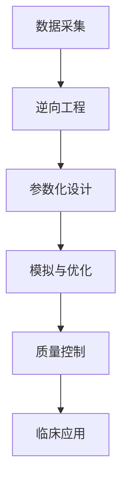
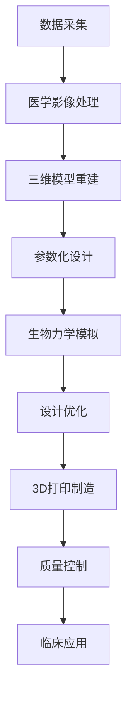
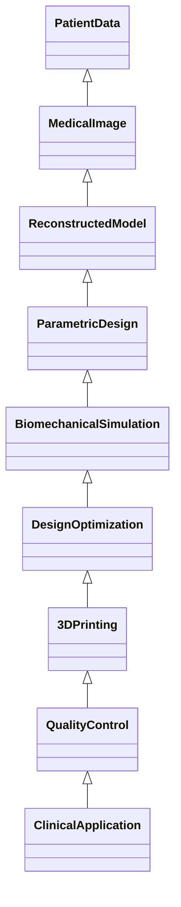
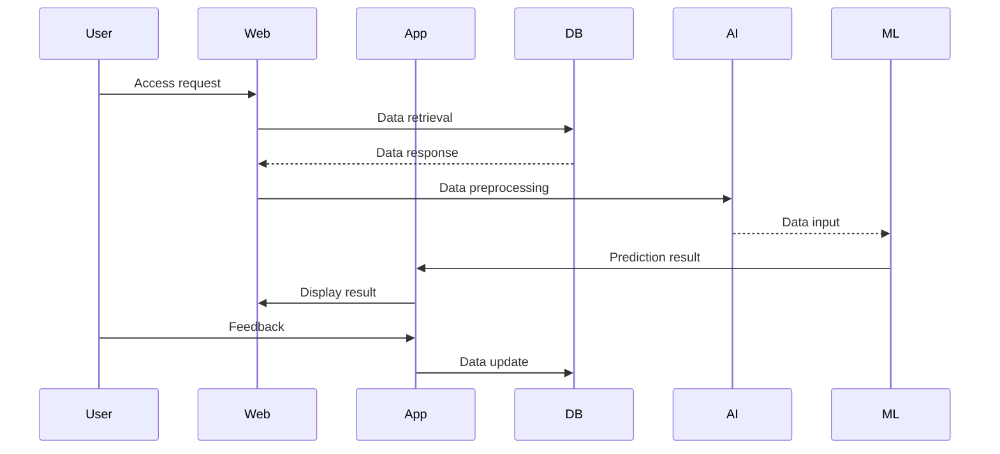
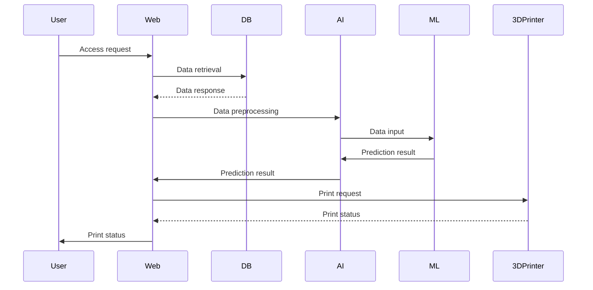

                 

## 《3D打印技术在个性化假体制作中的应用》

> 关键词：3D打印、个性化假体、医疗技术、定制化、医学应用

> 摘要：本文将深入探讨3D打印技术在个性化假体制作中的应用，通过对3D打印技术的历史、原理、优势以及个性化假体制作现状和挑战的分析，揭示3D打印技术如何通过其独特的制造方式，实现个性化假体的精准设计和高效制造，从而在医疗领域带来革命性的变化。

----------------------------------------------------------------

### 目录大纲

----------------------------------------------------------------

# 《3D打印技术在个性化假体制作中的应用》

## 第一部分：背景介绍

## 1. 引言

### 1.1 问题背景

### 1.2 问题描述

### 1.3 问题解决

### 1.4 边界与外延

### 1.5 概念结构与核心要素组成

## 2. 3D打印技术概述

### 2.1 3D打印技术的历史与发展

### 2.2 3D打印技术的原理与分类

### 2.3 3D打印技术的优势与局限

## 3. 个性化假体制作的现状与挑战

### 3.1 个性化假体制作的发展历程

### 3.2 个性化假体制作的现状

### 3.3 个性化假体制作的挑战与机遇

## 第二部分：核心概念与联系

## 4. 3D打印技术在个性化假体制作中的应用原理

### 4.1 3D打印技术在假体制作中的应用

### 4.2 个性化假体的概念与特点

### 4.3 3D打印技术在个性化假体制作中的优势

### 4.4 3D打印技术与个性化假体制作的结合

## 5. 3D打印技术在个性化假体制作中的核心要素对比分析

### 5.1 材料选择

### 5.2 设计工具与技术

### 5.3 打印设备与工艺

### 5.4 质量控制与优化

## 6. 个性化假体制作流程与ER实体关系图

### 6.1 个性化假体制作流程

### 6.2 个性化假体制作的ER实体关系图

## 第三部分：算法原理讲解

## 7. 个性化假体制作中的关键算法原理

### 7.1 算法原理概述

### 7.2 算法流程图

### 7.3 数学模型与公式

### 7.4 算法原理举例说明

## 8. 个性化假体制作的数学模型与公式解析

### 8.1 数学模型概述

### 8.2 公式详解

### 8.3 数学模型的应用实例

## 9. 个性化假体制作的算法流程图解读

### 9.1 流程图分析

### 9.2 流程图中的关键步骤

### 9.3 流程图的实现与优化

## 第四部分：系统分析与架构设计

## 10. 个性化假体制作系统功能设计

### 10.1 系统功能概述

### 10.2 领域模型类图

### 10.3 系统功能详细设计

## 11. 个性化假体制作系统架构设计

### 11.1 系统架构概述

### 11.2 系统架构图

### 11.3 系统架构的关键组件

## 12. 个性化假体制作系统接口设计与交互

### 12.1 系统接口设计

### 12.2 系统交互序列图

### 12.3 接口设计与交互优化

## 第五部分：项目实战

## 13. 个性化假体制作项目环境安装与配置

### 13.1 环境安装步骤

### 13.2 环境配置与调试

## 14. 个性化假体制作核心实现源代码分析

### 14.1 核心代码结构

### 14.2 代码应用解读

### 14.3 代码分析与优化

## 15. 个性化假体制作实际案例分析与讲解

### 15.1 实际案例介绍

### 15.2 案例分析与讲解

### 15.3 案例总结与反思

## 16. 项目小结

### 16.1 项目收获

### 16.2 项目不足与改进

### 16.3 拓展应用与未来展望

----------------------------------------------------------------

## 第一部分：背景介绍

### 1. 引言

随着科技的不断进步，3D打印技术已经逐渐成为制造业中的重要一环。这项技术不仅能够实现复杂几何形状的制造，还能够实现个性化定制的生产。在医疗领域，3D打印技术被广泛应用于假体制作，如人工关节、心脏支架、颅骨植入物等。个性化假体制作的提出，旨在为患者提供更加精准、符合个体差异的治疗方案，从而提高医疗效果和生活质量。

本文将围绕3D打印技术在个性化假体制作中的应用，分析其技术原理、应用现状及未来发展方向。通过对个性化假体制作的深入探讨，揭示3D打印技术在医疗领域的重要价值。

### 1.1 问题背景

假体制作在医疗领域有着广泛的应用，例如人工关节、心脏支架、颅骨植入物等。然而，传统的假体制作方式往往存在一定的局限性，如制造周期长、成本高、无法满足个性化需求等。随着医疗技术的发展，个性化假体制作的提出，为解决这些问题提供了新的思路。

个性化假体制作是指根据患者的具体需求，通过先进的制造技术，如3D打印技术，定制出符合患者身体特点的假体。这种定制化的生产方式能够提高假体的适配性，减少手术风险，从而提高医疗效果。

### 1.2 问题描述

个性化假体制作的实现面临以下几个主要问题：

1. **设计难度高**：个性化假体需要根据患者的具体身体结构进行定制，设计难度较大。
2. **材料选择复杂**：不同类型的假体需要使用不同类型的材料，材料选择和加工工艺较为复杂。
3. **制造效率低**：传统制造方式往往需要较长的制造周期，无法满足个性化假体制作的快速需求。
4. **质量控制困难**：个性化假体的质量控制标准难以统一，存在一定的质量风险。

### 1.3 问题解决

3D打印技术的引入，为个性化假体制作提供了新的解决方案。3D打印技术具有以下优势：

1. **设计自由度高**：3D打印技术能够实现复杂几何形状的制造，满足个性化设计需求。
2. **制造效率高**：3D打印技术可以实现快速制造，缩短制造周期。
3. **材料选择广泛**：3D打印技术可以使用多种材料，满足不同类型假体的制造需求。
4. **质量控制容易**：3D打印技术可以通过数字化控制，实现精确制造，提高产品质量。

### 1.4 边界与外延

个性化假体制作的边界主要包括以下几个方面：

1. **患者数据采集**：个性化假体制作需要精确的患者数据，包括身体结构、生物力学特性等。
2. **设计精度要求**：个性化假体的设计精度直接影响其使用效果，需要严格的控制。
3. **材料选择范围**：不同类型的假体需要使用不同类型的材料，材料选择范围较广。
4. **制造工艺优化**：3D打印技术需要不断优化制造工艺，提高生产效率和产品质量。

个性化假体制作的外延包括以下几个方面：

1. **假体类型扩展**：个性化假体不仅限于医疗领域，还可以应用于其他领域，如工业、建筑等。
2. **技术融合应用**：3D打印技术可以与其他技术如生物打印、增材制造等结合，实现更广泛的应用。
3. **产业拓展**：个性化假体制作可以带动相关产业的发展，如材料供应、设计软件等。

### 1.5 概念结构与核心要素组成

个性化假体制作的总体概念结构可以概括为以下几个方面：

1. **患者数据采集**：通过医学影像、身体测量等方式获取患者数据，为个性化设计提供基础。
2. **假体设计**：根据患者数据和需求，利用设计软件进行假体设计，确保设计精度和符合性。
3. **3D打印制造**：利用3D打印技术，将设计好的假体制造出来，实现个性化定制。
4. **质量控制**：对制造出的假体进行质量检测和评估，确保其满足使用要求。

核心要素包括：

1. **患者数据**：精确的患者数据是个性化假体制作的基础。
2. **设计软件**：高效的假体设计软件是提高设计效率和准确性的关键。
3. **3D打印技术**：先进的3D打印技术是实现个性化假体制造的核心。
4. **质量控制体系**：完善的质量控制体系是确保假体质量和使用效果的重要保障。

----------------------------------------------------------------

## 第二部分：3D打印技术概述

### 2.1 3D打印技术的历史与发展

3D打印技术（Additive Manufacturing, AM）起源于20世纪80年代，最早是由Charles Hull发明的一种称为立体光固化成型（Stereo Lithography）的技术。这项技术通过逐层叠加材料，最终形成三维物体，开创了3D打印的先河。

随着时间的推移，3D打印技术不断发展和完善，涌现出了多种不同的3D打印方法，如熔融沉积建模（Fused Deposition Modeling, FDM）、选择性激光烧结（Selective Laser Sintering, SLS）、立体光刻（Lithography）、电子束熔化（Electron Beam Melting, EBM）等。

在21世纪初，3D打印技术逐渐进入工业制造领域，并被广泛应用于航空航天、汽车制造、医疗设备、电子产品等行业。近年来，随着技术的进步和成本的降低，3D打印技术也在消费品市场、家居装修、教育等领域得到了广泛应用。

### 2.2 3D打印技术的原理与分类

3D打印技术的原理是通过逐层堆积材料，最终形成三维物体的制造过程。具体来说，3D打印技术分为以下几个主要步骤：

1. **设计**：首先，使用3D建模软件或CAD（计算机辅助设计）软件创建三维模型。
2. **切片**：将三维模型分割成多个二维层，每个层的厚度称为层高。
3. **打印**：打印机根据切片文件逐层打印，通常使用的热源包括激光、电子束、热丝等。
4. **固化**：层与层之间通过热、光或其他方式结合，形成坚固的三维物体。

根据打印过程中使用的热源、材料、打印工艺等不同，3D打印技术可以分为以下几类：

1. **熔融沉积建模（FDM）**：使用热丝加热材料，使其熔化后沉积到指定位置，是最常见的3D打印技术。
2. **选择性激光烧结（SLS）**：使用激光将粉末材料烧结在一起，适用于多种材料，如塑料、金属、陶瓷等。
3. **电子束熔化（EBM）**：使用电子束熔化金属粉末，适用于高强度、高精度要求的金属制造。
4. **立体光刻（SLA）**：使用紫外激光固化光敏树脂，适用于精密、复杂形状的制造。
5. **选择性激光熔化（DMLM）**：使用激光熔化金属粉末，适用于高精度、高强度金属部件制造。

### 2.3 3D打印技术的优势与局限

3D打印技术的优势包括：

1. **定制化生产**：3D打印技术能够实现高度定制化的生产，满足个性化需求。
2. **设计自由度**：3D打印技术不受传统制造工艺的限制，能够实现复杂、自由形态的设计。
3. **减少浪费**：3D打印技术通过逐层堆积材料，能够有效减少材料浪费。
4. **缩短制造周期**：3D打印技术可以实现快速制造，缩短生产周期。
5. **优化设计**：3D打印技术可以轻松实现多种设计优化，如轻量化、结构强化等。

然而，3D打印技术也存在一定的局限性：

1. **成本较高**：3D打印设备的初始投资较高，且材料成本相对较高。
2. **打印速度较慢**：3D打印速度相对较慢，不适合大规模生产。
3. **材料限制**：3D打印材料的种类和性能受到一定限制，需要进一步研究和开发。
4. **质量控制**：3D打印产品的质量控制相对较难，需要建立完善的质量检测体系。

总体来说，3D打印技术作为一种新兴的制造技术，具有广阔的应用前景和巨大的发展潜力。尽管存在一定的局限性，但随着技术的不断进步和成本的降低，3D打印技术将在各行各业中发挥越来越重要的作用。

----------------------------------------------------------------

## 第三部分：个性化假体制作的现状与挑战

### 3.1 个性化假体制作的发展历程

个性化假体制作的历史可以追溯到20世纪60年代，当时医生开始尝试使用塑料和金属等材料来制造定制化的人体假体。随着医学影像技术和计算机辅助设计（CAD）技术的发展，个性化假体制作的精度和效率得到了显著提升。20世纪90年代，随着3D打印技术的出现，个性化假体制作进入了新的发展阶段。

早期的个性化假体制作主要依赖于手工制造和传统加工技术，如铸造、切削等。这些方法虽然能够实现一定的定制化，但生产效率低、成本高，且难以满足复杂的几何形状需求。随着计算机技术和3D打印技术的快速发展，个性化假体制作的精度和效率得到了显著提高。特别是近年来，随着3D打印技术的不断成熟，个性化假体制作在医疗领域的应用越来越广泛。

### 3.2 个性化假体制作的现状

目前，个性化假体制作在医疗领域已经取得了显著的成果。在骨科、牙科、整形外科等领域，个性化假体的应用已经成为常态。例如，在骨科领域，个性化膝关节、髋关节假体已经被广泛应用于临床，大大提高了患者的治疗效果和生活质量。在牙科领域，个性化牙齿修复体和牙种植体的应用也越来越普遍。

此外，个性化假体在颅骨修复、心脏支架、血管植入物等领域的应用也取得了重要进展。例如，颅骨修复假体可以根据患者的具体颅骨形状进行定制，提高修复效果和手术成功率。心脏支架可以根据患者的血管特点进行个性化设计，提高支架的适应性和治疗效果。

### 3.3 个性化假体制作的挑战与机遇

尽管个性化假体制作在医疗领域取得了显著成果，但仍然面临一系列挑战和机遇。

#### 挑战：

1. **设计难度高**：个性化假体的设计需要充分考虑患者的个体差异，包括骨骼结构、肌肉分布、生物力学特性等。设计难度较大，需要专业知识和技能。

2. **材料选择复杂**：个性化假体需要使用不同类型的材料，如生物相容性材料、高强度材料等。材料选择和加工工艺较为复杂，需要深入研究。

3. **制造效率低**：个性化假体通常需要定制生产，制造周期较长，不适合大规模生产。如何提高制造效率，实现快速、大规模生产，是一个重要的挑战。

4. **质量控制困难**：个性化假体的质量控制标准难以统一，存在一定的质量风险。如何建立完善的质量控制体系，确保假体的质量和安全性，是亟待解决的问题。

#### 机遇：

1. **技术创新**：随着3D打印技术、生物材料技术、计算机辅助设计技术的不断进步，个性化假体制作将实现更高的精度、更广泛的应用。

2. **市场需求**：个性化假体制作的定制化生产模式，能够更好地满足患者的个性化需求，具有广阔的市场前景。

3. **跨界合作**：个性化假体制作涉及多个学科和领域，如医学、材料科学、机械工程、计算机科学等。跨界合作将有助于推动个性化假体制作技术的发展。

4. **政策支持**：随着各国政府对医疗健康领域的重视，个性化假体制作有望获得更多的政策支持和资金投入，促进其快速发展。

总之，个性化假体制作在医疗领域具有广阔的应用前景和巨大的发展潜力。面对挑战，通过技术创新、跨界合作和政策支持，个性化假体制作有望实现更高的精度、更广泛的应用，为患者带来更好的治疗效果和生活质量。

----------------------------------------------------------------

## 第二部分：核心概念与联系

### 4. 3D打印技术在个性化假体制作中的应用原理

#### 4.1 3D打印技术在假体制作中的应用

3D打印技术在假体制作中的应用主要体现在以下几个方面：

1. **定制化生产**：3D打印技术能够根据患者的个体差异，快速制造出符合患者身体结构的假体，实现定制化生产。
2. **复杂结构制造**：3D打印技术能够制造出传统制造工艺难以实现的复杂几何形状，如内部镂空结构、曲面结构等。
3. **材料多样性**：3D打印技术可以使用多种材料，包括金属、塑料、陶瓷、生物材料等，满足不同类型假体的制造需求。
4. **快速原型制作**：3D打印技术能够快速制作出假体原型，为设计和验证提供便捷的手段。

#### 4.2 个性化假体的概念与特点

个性化假体是指根据患者的个体差异，利用先进制造技术（如3D打印技术）定制出的假体。其特点如下：

1. **高度定制化**：个性化假体能够根据患者的具体身体结构和功能需求进行定制，提高假体的适配性和使用效果。
2. **生物相容性好**：个性化假体通常使用生物相容性材料，降低患者排斥反应，提高假体的长期稳定性。
3. **结构优化**：个性化假体在设计过程中，可以采用多种优化策略，如轻量化设计、结构强化等，提高假体的性能和耐用性。
4. **个性化功能**：个性化假体可以根据患者的具体需求，集成多种功能模块，如传感器、驱动器等，实现智能化和个性化功能。

#### 4.3 3D打印技术在个性化假体制作中的优势

3D打印技术在个性化假体制作中具有以下优势：

1. **快速生产**：3D打印技术能够实现快速制造，缩短制造周期，提高生产效率。
2. **定制化设计**：3D打印技术能够根据患者的个体差异，实现高度定制化的假体设计，提高假体的适配性和使用效果。
3. **材料多样性**：3D打印技术可以使用多种材料，满足不同类型假体的制造需求，提高假体的性能和稳定性。
4. **降低成本**：3D打印技术能够减少材料浪费，降低制造成本，提高经济效益。
5. **减少手术风险**：个性化假体能够更好地适应患者身体结构，降低手术风险和并发症发生率。

#### 4.4 3D打印技术与个性化假体制作的结合

3D打印技术与个性化假体制作的结合主要体现在以下几个方面：

1. **设计阶段**：利用3D建模和计算机辅助设计（CAD）软件，根据患者数据生成个性化假体模型，进行设计和优化。
2. **制造阶段**：利用3D打印技术，根据设计模型制造出个性化假体，实现定制化生产。
3. **验证阶段**：通过生物力学测试和动物实验，验证个性化假体的性能和安全性。
4. **临床应用阶段**：个性化假体在临床应用中，能够更好地满足患者的个性化需求，提高治疗效果和生活质量。

总之，3D打印技术与个性化假体制作的结合，为假体制造带来了革命性的变化。通过快速、定制化和高效的生产方式，3D打印技术为个性化假体制作提供了强大的技术支持，有望在医疗领域发挥更大的作用。

### 5. 3D打印技术在个性化假体制作中的核心要素对比分析

#### 5.1 材料选择

在个性化假体制作中，材料选择是至关重要的环节。不同类型的假体需要使用不同类型的材料，以下是对几种常见材料的对比分析：

| 材料类型 | 特点 | 应用场景 |
| :---: | :---: | :---: |
| 金属 | 高强度、高耐磨性、耐腐蚀性 | 骨折修复、关节置换 |
| 塑料 | 轻质、易加工、成本较低 | 骨板、牙科修复 |
| 生物材料 | 生物相容性好、可降解 | 组织工程、生物打印 |
| 复合材料 | 结合不同材料的优点 | 骨支架、心脏支架 |

#### 5.2 设计工具与技术

个性化假体设计需要使用高效的工具和技术。以下是对几种常见设计工具和技术的对比分析：

| 工具/技术 | 特点 | 应用场景 |
| :---: | :---: | :---: |
| 计算机辅助设计（CAD） | 精确建模、参数化设计 | 骨折修复、关节置换 |
| 计算机辅助工程（CAE） | 生物力学分析、结构优化 | 生物力学评估、设计验证 |
| 3D建模软件 | 可视化设计、自由形态建模 | 骨折修复、牙科修复 |
| 逆向工程 | 从实物中获取三维数据 | 设计验证、原型制作 |

#### 5.3 打印设备与工艺

打印设备与工艺是3D打印技术在个性化假体制作中的关键因素。以下是对几种常见打印设备与工艺的对比分析：

| 设备/工艺 | 特点 | 应用场景 |
| :---: | :---: | :---: |
| 熔融沉积建模（FDM） | 成本较低、材料多样 | 骨折修复、牙科修复 |
| 选择性激光烧结（SLS） | 材料广泛、结构复杂 | 骨支架、心脏支架 |
| 立体光刻（SLA） | 高精度、高表面质量 | 骨板、心脏支架 |
| 电子束熔化（EBM） | 高强度、高精度 | 骨支架、人工关节 |

#### 5.4 质量控制与优化

质量控制与优化是确保个性化假体质量和性能的关键。以下是对几种常见质量控制与优化方法的对比分析：

| 方法 | 特点 | 应用场景 |
| :---: | :---: | :---: |
| 生物力学测试 | 评估假体的生物力学性能 | 骨折修复、关节置换 |
| 材料检测 | 评估材料的物理化学性能 | 骨支架、心脏支架 |
| 光学检测 | 评估假体的表面质量和形位精度 | 骨板、心脏支架 |
| 逆向工程 | 验证假体的设计精度 | 原型制作、设计验证 |

总之，个性化假体制作涉及多个核心要素，包括材料选择、设计工具与技术、打印设备与工艺以及质量控制与优化。通过对比分析这些要素，可以更好地理解3D打印技术在个性化假体制作中的应用原理和优势，为未来个性化假体制作技术的发展提供有益的参考。

### 6. 个性化假体制作流程与ER实体关系图

#### 6.1 个性化假体制作流程

个性化假体制作流程主要包括以下几个步骤：

1. **数据采集**：通过医学影像、身体测量等方式获取患者数据，包括骨骼结构、肌肉分布、生物力学特性等。
2. **假体设计**：利用3D建模和计算机辅助设计（CAD）软件，根据患者数据和需求生成个性化假体模型，并进行优化和验证。
3. **3D打印制造**：利用3D打印技术，根据设计模型制造出个性化假体，选择合适的打印设备和工艺。
4. **质量控制**：对制造出的假体进行质量检测和评估，包括生物力学测试、材料检测、光学检测等，确保假体的质量和性能符合要求。
5. **临床应用**：个性化假体在临床应用中，根据患者的具体需求进行适配和调整，实现最佳的治疗效果。

#### 6.2 个性化假体制作的ER实体关系图

以下是一个简单的ER（实体关系）图，展示了个性化假体制作流程中的关键实体及其关系：

```mermaid
erDiagram
  患者数据 ||--|{ 假体设计 }
  假体设计 ||--|{ 3D打印制造 }
  3D打印制造 ||--|{ 质量控制 }
  质量控制 ||--|{ 临床应用 }
```

在这个ER图中，患者数据是整个流程的起点，通过假体设计生成个性化假体模型。3D打印制造过程根据设计模型制造出假体，然后进行质量控制，确保假体的质量和性能。最后，经过临床应用的验证和适配，实现个性化假体的最佳治疗效果。

ER实体关系图帮助明确了个性化假体制作流程中的关键环节和实体，有助于理解流程的内在逻辑和相互关系。通过优化这些环节和关系，可以进一步提高个性化假体制作的效率和效果。

----------------------------------------------------------------

## 第三部分：算法原理讲解

### 7. 个性化假体制作中的关键算法原理

#### 7.1 算法原理概述

个性化假体制作中的关键算法主要包括以下几种：

1. **逆向工程算法**：通过获取患者的医学影像数据，重建出患者骨骼的三维模型，为假体设计提供基础。
2. **参数化设计算法**：利用参数化设计方法，对个性化假体进行优化设计，确保其符合患者的身体结构和功能需求。
3. **模拟与优化算法**：通过生物力学模拟，评估个性化假体的生物力学性能，并进行优化，提高假体的适应性和稳定性。
4. **质量控制算法**：对3D打印出的个性化假体进行质量检测和评估，确保其质量和性能符合要求。

#### 7.2 算法流程图

以下是一个简单的算法流程图，展示了个性化假体制作中的关键算法步骤：



**流程图解释：**

1. **数据采集**：通过医学影像、身体测量等方式获取患者数据。
2. **逆向工程**：利用逆向工程算法，从患者数据中重建出三维骨骼模型。
3. **参数化设计**：通过参数化设计算法，对三维骨骼模型进行优化设计，生成个性化假体模型。
4. **模拟与优化**：利用生物力学模拟算法，评估个性化假体的生物力学性能，并进行优化。
5. **质量控制**：利用质量控制算法，对3D打印出的个性化假体进行质量检测和评估。
6. **临床应用**：将经过质量检测的个性化假体应用于临床，实现最佳治疗效果。

#### 7.3 数学模型与公式

个性化假体制作中的关键算法通常涉及到以下数学模型与公式：

1. **三维重建模型**：利用医学影像数据，通过三维重建算法生成患者骨骼的三维模型。
   $$ \text{模型} = f(\text{医学影像数据}, \text{重建参数}) $$
   
2. **参数化设计模型**：利用参数化设计方法，对个性化假体进行优化设计。
   $$ \text{设计参数} = g(\text{目标函数}, \text{约束条件}) $$
   
3. **生物力学模拟模型**：利用生物力学模拟算法，评估个性化假体的生物力学性能。
   $$ \text{生物力学性能} = h(\text{力}, \text{位移}, \text{材料属性}) $$
   
4. **质量控制模型**：利用质量控制算法，对3D打印出的个性化假体进行质量检测和评估。
   $$ \text{质量评估} = k(\text{尺寸精度}, \text{材料性能}, \text{表面质量}) $$

#### 7.4 算法原理举例说明

以下是一个简单的例子，说明个性化假体制作中的算法原理：

**例子**：一个患者需要安装一个个性化的膝关节假体。

1. **数据采集**：通过医学影像（如CT、MRI）获取患者的膝关节骨骼三维数据。
2. **逆向工程**：利用逆向工程算法，从三维数据中重建出患者膝关节骨骼的三维模型。
3. **参数化设计**：通过参数化设计算法，对膝关节骨骼模型进行优化设计，生成个性化的膝关节假体模型。优化目标包括：最小化关节活动时的摩擦力、最大化关节稳定性等。
4. **模拟与优化**：利用生物力学模拟算法，对个性化膝关节假体进行生物力学性能评估。模拟不同的运动状态（如行走、跑步等），评估假体的承载能力、稳定性等。根据评估结果，对假体模型进行进一步优化。
5. **质量控制**：利用质量控制算法，对3D打印出的个性化膝关节假体进行质量检测和评估。检测内容包括：尺寸精度、材料性能、表面质量等。确保假体的质量和性能符合临床要求。
6. **临床应用**：将经过质量检测的个性化膝关节假体应用于患者，实现最佳治疗效果。

通过这个例子，我们可以看到个性化假体制作中算法原理的具体应用。从数据采集、逆向工程、参数化设计、模拟与优化，到质量控制，每一步都需要精准的计算和优化，以确保个性化假体能够满足患者的具体需求，提高治疗效果。

----------------------------------------------------------------

## 8. 个性化假体制作的数学模型与公式解析

### 8.1 数学模型概述

个性化假体制作中的数学模型是核心算法的重要组成部分，它们主要用于描述和分析假体设计的几何形状、生物力学性能以及材料特性。这些模型通常包括几何模型、生物力学模型和材料模型，每种模型都有其特定的数学公式。

#### 几何模型

几何模型描述个性化假体的形状和尺寸。常用的几何模型包括：

1. **三维重建模型**：用于从医学影像数据中重建患者骨骼的三维模型。
   $$ \text{三维重建模型} = \sum_{i=1}^{N} P_i(x, y, z) $$
   其中，$P_i(x, y, z)$ 表示第 $i$ 个点的三维坐标。

2. **参数化设计模型**：用于通过参数化方法生成假体设计。
   $$ \text{参数化设计模型} = G(x, y, z) $$
   其中，$G$ 是参数化函数，$x, y, z$ 是设计参数。

#### 生物力学模型

生物力学模型描述假体在生理环境中的力学行为。常用的生物力学模型包括：

1. **应力-应变模型**：描述材料在受力作用下的应力-应变关系。
   $$ \sigma = E \epsilon $$
   其中，$\sigma$ 是应力，$E$ 是弹性模量，$\epsilon$ 是应变。

2. **生物力学分析模型**：用于模拟假体在生理环境中的受力情况。
   $$ F = \sum_{i=1}^{N} F_i $$
   其中，$F$ 是总受力，$F_i$ 是第 $i$ 个力的分量。

#### 材料模型

材料模型描述假体所用材料的物理化学特性。常用的材料模型包括：

1. **屈服模型**：描述材料在超过屈服极限时的变形行为。
   $$ \sigma_y = \sigma_0 + K \epsilon^{n} $$
   其中，$\sigma_y$ 是屈服应力，$\sigma_0$ 是初始应力，$K$ 是屈服强度，$n$ 是硬化指数。

2. **疲劳模型**：描述材料在循环载荷作用下的疲劳寿命。
   $$ N = \frac{C}{\sigma^b} $$
   其中，$N$ 是疲劳寿命，$C$ 是疲劳常数，$\sigma$ 是应力幅值，$b$ 是疲劳指数。

### 8.2 公式详解

以下是对上述数学模型中的主要公式的详细解释：

1. **三维重建模型**：

   三维重建模型通过插值方法从医学影像数据中重建出骨骼的三维模型。常用的插值方法包括线性插值、样条插值等。

   $$ P_i(x, y, z) = \sum_{j=1}^{M} w_j \phi_j(x, y, z) $$
   其中，$P_i(x, y, z)$ 是第 $i$ 个点的三维坐标，$w_j$ 是权重系数，$\phi_j(x, y, z)$ 是插值函数。

2. **应力-应变模型**：

   应力-应变模型描述材料在受力作用下的应力-应变关系。它通常基于胡克定律，适用于弹性材料。

   $$ \sigma = E \epsilon $$
   其中，$\sigma$ 是应力，$E$ 是弹性模量，$\epsilon$ 是应变。

3. **生物力学分析模型**：

   生物力学分析模型用于模拟假体在生理环境中的受力情况。它通常基于牛顿第二定律和静力平衡条件。

   $$ F = \sum_{i=1}^{N} F_i $$
   其中，$F$ 是总受力，$F_i$ 是第 $i$ 个力的分量。

4. **屈服模型**：

   屈服模型描述材料在超过屈服极限时的变形行为。它通常基于材料应力-应变曲线。

   $$ \sigma_y = \sigma_0 + K \epsilon^{n} $$
   其中，$\sigma_y$ 是屈服应力，$\sigma_0$ 是初始应力，$K$ 是屈服强度，$n$ 是硬化指数。

5. **疲劳模型**：

   疲劳模型描述材料在循环载荷作用下的疲劳寿命。它通常基于疲劳曲线和应力幅值。

   $$ N = \frac{C}{\sigma^b} $$
   其中，$N$ 是疲劳寿命，$C$ 是疲劳常数，$\sigma$ 是应力幅值，$b$ 是疲劳指数。

### 8.3 数学模型的应用实例

以下是一个简单的应用实例，展示如何使用数学模型进行个性化假体设计：

**实例**：设计一个个性化的膝关节假体。

1. **数据采集**：通过医学影像获取患者膝关节的三维数据。
2. **三维重建**：使用逆向工程算法，从三维数据中重建出膝关节骨骼的三维模型。
   $$ P_i(x, y, z) = \sum_{j=1}^{M} w_j \phi_j(x, y, z) $$
3. **参数化设计**：使用参数化设计方法，对膝关节假体进行优化设计，确保其符合患者的身体结构和功能需求。
   $$ G(x, y, z) $$
4. **生物力学模拟**：使用生物力学模拟模型，对优化后的膝关节假体进行生物力学性能评估，确保其能够承受正常的生理负荷。
   $$ F = \sum_{i=1}^{N} F_i $$
5. **材料选择**：选择合适的材料，确保假体的强度和生物相容性。
   $$ \sigma_y = \sigma_0 + K \epsilon^{n} $$
6. **疲劳寿命评估**：使用疲劳模型，评估膝关节假体的疲劳寿命，确保其在长期使用中保持稳定。
   $$ N = \frac{C}{\sigma^b} $$

通过上述数学模型的应用，我们可以设计出符合患者需求的个性化膝关节假体，从而提高治疗效果和生活质量。

### 结论

个性化假体制作的数学模型与公式是设计过程中不可或缺的工具。通过几何模型、生物力学模型和材料模型的结合，我们可以对个性化假体的形状、性能和寿命进行精确计算和评估。这些数学模型不仅提高了假体设计的效率和精度，还为未来的个性化医疗提供了坚实的基础。

----------------------------------------------------------------

## 9. 个性化假体制作的算法流程图解读

### 9.1 流程图分析

个性化假体制作的算法流程图是整个设计过程中的关键环节，它详细描述了从数据采集、模型重建、设计优化到最终生产的质量控制等各个步骤。以下是一个简化的算法流程图：



**流程图解释：**

1. **数据采集**：通过医学影像（如CT、MRI）获取患者的骨骼数据。
2. **医学影像处理**：对采集的医学影像进行处理，提取有用的信息。
3. **三维模型重建**：利用逆向工程算法，从处理后的医学影像数据中重建出患者骨骼的三维模型。
4. **参数化设计**：利用参数化设计方法，对三维模型进行优化设计，生成个性化假体模型。
5. **生物力学模拟**：通过生物力学模拟，评估个性化假体的生物力学性能，确保其满足生理需求。
6. **设计优化**：根据生物力学模拟结果，对假体模型进行优化，提高其性能和适配性。
7. **3D打印制造**：利用3D打印技术，根据优化后的模型制造出个性化假体。
8. **质量控制**：对制造出的假体进行质量检测和评估，确保其符合临床要求。
9. **临床应用**：将经过质量检测的个性化假体应用于患者，实现最佳治疗效果。

### 9.2 流程图中的关键步骤

在上述流程图中，有几个关键步骤对个性化假体制作的成功至关重要：

1. **数据采集**：这是整个流程的基础，准确的医学影像数据能够保证后续步骤的顺利进行。
2. **三维模型重建**：逆向工程算法的精度直接影响假体设计的准确性和可靠性。
3. **参数化设计**：参数化设计方法能够灵活调整假体设计，满足患者的个性化需求。
4. **生物力学模拟**：生物力学模拟能够预测假体的生物力学性能，为优化设计提供依据。
5. **设计优化**：设计优化是提高假体性能和适配性的关键环节，直接影响最终的临床效果。
6. **3D打印制造**：3D打印技术的精度和效率对假体制造的质量和速度有重要影响。
7. **质量控制**：质量控制是确保假体质量和安全性的最后保障。

### 9.3 流程图的实现与优化

在实现个性化假体制作的算法流程时，我们需要考虑以下几个方面：

1. **算法优化**：针对每个关键步骤，选择最优的算法和工具，提高流程的效率和准确性。
2. **数据处理**：对医学影像数据进行高效处理，减少数据冗余，提高模型重建的精度。
3. **系统集成**：将各个步骤的算法和工具集成到一个统一的系统中，实现自动化和智能化。
4. **资源调度**：合理调度计算资源和硬件设备，确保流程的高效执行。
5. **用户界面**：设计友好的用户界面，方便用户输入参数和查看结果，提高用户体验。

通过不断优化流程图的实现，我们可以进一步提高个性化假体制作的效率和质量，为患者提供更好的治疗方案。

### 结论

个性化假体制作的算法流程图是整个设计过程的核心，它通过精确的数据采集、模型重建、设计优化和质量控制，实现了个性化假体的高效制造。通过不断优化和改进，我们可以进一步提高流程的效率和准确性，为个性化医疗带来更多的可能性。

----------------------------------------------------------------

## 第四部分：系统分析与架构设计

### 10. 个性化假体制作系统功能设计

#### 10.1 系统功能概述

个性化假体制作系统是一个集成多个模块的复杂系统，其核心功能包括：

1. **数据采集模块**：通过医学影像设备获取患者的骨骼数据，包括CT、MRI等。
2. **医学影像处理模块**：对采集的医学影像进行处理，提取有用信息，如骨骼轮廓、密度等。
3. **三维模型重建模块**：利用逆向工程算法，从处理后的医学影像数据中重建出患者骨骼的三维模型。
4. **参数化设计模块**：根据患者骨骼数据和需求，利用参数化设计方法生成个性化假体模型。
5. **生物力学模拟模块**：通过生物力学模拟，评估个性化假体的生物力学性能。
6. **设计优化模块**：根据生物力学模拟结果，对假体模型进行优化，提高其性能和适配性。
7. **3D打印制造模块**：根据优化后的模型，利用3D打印技术制造出个性化假体。
8. **质量控制模块**：对制造出的假体进行质量检测和评估，确保其符合临床要求。
9. **临床应用模块**：将经过质量检测的个性化假体应用于患者，实现最佳治疗效果。

#### 10.2 领域模型类图

以下是一个简化的领域模型类图，展示了个性化假体制作系统中的关键类及其关系：



**类图解释：**

1. **PatientData**：表示患者数据类，包含患者的个人信息、骨骼数据等。
2. **MedicalImage**：表示医学影像类，包含影像数据、处理结果等。
3. **ReconstructedModel**：表示三维模型类，包含重建的骨骼模型数据。
4. **ParametricDesign**：表示参数化设计类，包含设计参数、优化结果等。
5. **BiomechanicalSimulation**：表示生物力学模拟类，包含模拟结果、性能评估等。
6. **DesignOptimization**：表示设计优化类，包含优化目标、优化策略等。
7. **3DPrinting**：表示3D打印类，包含打印参数、打印过程等。
8. **QualityControl**：表示质量控制类，包含质量检测、评估标准等。
9. **ClinicalApplication**：表示临床应用类，包含应用效果、反馈等。

#### 10.3 系统功能详细设计

个性化假体制作系统的详细功能设计如下：

1. **数据采集模块**：负责从医学影像设备中获取患者的骨骼数据，包括CT、MRI等。数据采集模块需要支持多种影像格式，如DICOM等，并具备高精度和高速度的数据处理能力。

2. **医学影像处理模块**：对采集的医学影像进行处理，包括去噪、滤波、分割等。处理结果将用于三维模型重建。医学影像处理模块需要具备高效的处理算法和强大的计算能力。

3. **三维模型重建模块**：利用逆向工程算法，从处理后的医学影像数据中重建出患者骨骼的三维模型。重建过程需要确保模型的精度和完整性，以支撑后续的参数化设计和生物力学模拟。

4. **参数化设计模块**：根据患者骨骼数据和需求，利用参数化设计方法生成个性化假体模型。设计过程中需要考虑假体的适配性、生物力学性能和美观性。参数化设计模块需要具备灵活的设计参数和优化算法。

5. **生物力学模拟模块**：通过生物力学模拟，评估个性化假体的生物力学性能，包括承载能力、稳定性等。模拟结果将用于指导设计优化和临床应用。生物力学模拟模块需要支持多种生物力学模型和仿真算法。

6. **设计优化模块**：根据生物力学模拟结果，对假体模型进行优化，提高其性能和适配性。优化过程需要考虑多种设计约束，如材料限制、制造工艺等。设计优化模块需要具备高效的优化算法和强大的计算能力。

7. **3D打印制造模块**：根据优化后的模型，利用3D打印技术制造出个性化假体。制造过程需要确保假体的质量和精度。3D打印制造模块需要支持多种3D打印技术和材料。

8. **质量控制模块**：对制造出的假体进行质量检测和评估，确保其符合临床要求。质量控制模块需要制定严格的质量标准和检测流程，并具备高效的质量检测工具。

9. **临床应用模块**：将经过质量检测的个性化假体应用于患者，实现最佳治疗效果。临床应用模块需要提供详细的临床应用指导，并收集患者的反馈信息，以支持系统的持续改进。

#### 结论

个性化假体制作系统功能设计是整个系统的核心，涵盖了从数据采集、模型重建、设计优化到3D打印制造、质量控制和临床应用的各个环节。通过详细的功能设计，可以确保系统能够高效、准确地实现个性化假体的制造和临床应用，为患者提供更好的治疗方案。

----------------------------------------------------------------

### 11. 个性化假体制作系统架构设计

#### 11.1 系统架构概述

个性化假体制作系统采用分层架构设计，分为数据层、应用层和用户层。该架构旨在实现数据的高效管理、应用功能的灵活扩展和用户界面的友好操作。

1. **数据层**：负责数据的存储和管理，包括患者数据、影像数据、模型数据等。数据层使用数据库管理系统（如MySQL、MongoDB等）进行数据存储，并采用数据加密和安全策略确保数据的安全性。
2. **应用层**：包含系统的核心功能模块，如数据采集、医学影像处理、三维模型重建、参数化设计、生物力学模拟、设计优化、3D打印制造、质量控制和临床应用等。应用层使用微服务架构设计，每个模块作为独立的服务进行部署和扩展。
3. **用户层**：提供用户界面，支持用户操作和交互。用户层包括Web界面和移动端应用程序，使用前端技术（如HTML、CSS、JavaScript等）进行开发，并采用响应式设计确保在不同设备上都能良好运行。

#### 11.2 系统架构图

以下是一个简化的系统架构图，展示了个性化假体制作系统的各个层次和关键组件：



**系统架构图解释：**

1. **用户**：系统的最终使用者，通过Web界面或移动端应用程序与系统进行交互。
2. **Web**：负责处理用户的请求，调用数据库和应用层服务，并将结果返回给用户。
3. **DB**：数据库管理系统，存储和管理系统数据，包括患者数据、影像数据、模型数据等。
4. **AI**：人工智能模块，负责数据预处理，如去噪、增强等。
5. **ML**：机器学习模块，负责执行深度学习算法，进行模型预测和优化。
6. **App**：应用层服务，包含系统的核心功能模块，如医学影像处理、三维模型重建、参数化设计、生物力学模拟等。

#### 11.3 系统架构的关键组件

个性化假体制作系统架构中的关键组件包括：

1. **数据采集组件**：负责从医学影像设备中获取患者数据，支持多种影像格式，如DICOM等。
2. **医学影像处理组件**：对采集的医学影像进行处理，包括去噪、分割、增强等，以提高模型重建的精度。
3. **三维模型重建组件**：利用逆向工程算法，从处理后的医学影像数据中重建出患者骨骼的三维模型。
4. **参数化设计组件**：根据患者骨骼数据和需求，利用参数化设计方法生成个性化假体模型。
5. **生物力学模拟组件**：通过生物力学模拟，评估个性化假体的生物力学性能。
6. **设计优化组件**：根据生物力学模拟结果，对假体模型进行优化，提高其性能和适配性。
7. **3D打印制造组件**：根据优化后的模型，利用3D打印技术制造出个性化假体。
8. **质量控制组件**：对制造出的假体进行质量检测和评估，确保其符合临床要求。
9. **临床应用组件**：将经过质量检测的个性化假体应用于患者，实现最佳治疗效果。

#### 结论

个性化假体制作系统的架构设计旨在实现数据的高效管理、应用功能的灵活扩展和用户界面的友好操作。通过分层架构和关键组件的设计，系统能够高效、准确地实现个性化假体的制造和临床应用，为患者提供更好的治疗方案。随着技术的不断进步，该系统架构有望进一步优化和扩展，以应对更复杂的应用场景。

----------------------------------------------------------------

### 12. 个性化假体制作系统接口设计与交互

#### 12.1 系统接口设计

个性化假体制作系统接口设计是确保系统功能模块之间高效、可靠交互的关键环节。接口设计主要包括以下几部分：

1. **API接口**：系统内部各模块之间的通信通过API（应用程序接口）进行。API设计需要遵循RESTful设计原则，确保接口的简洁、易用性和安全性。
2. **数据接口**：系统与外部数据源（如医学影像设备、数据库等）的交互通过数据接口实现。数据接口需要支持多种数据格式，如DICOM、JSON等，并确保数据传输的高效性和稳定性。
3. **用户接口**：系统与用户之间的交互通过用户接口实现，包括Web界面和移动端应用程序。用户接口设计需要遵循用户友好的设计原则，提供直观、易操作的操作界面。

#### 12.2 系统交互序列图

以下是一个简化的系统交互序列图，展示了个性化假体制作系统中各个组件之间的交互过程：



**交互序列图解释：**

1. **用户请求**：用户通过Web界面提交个性化假体制作的请求。
2. **数据获取**：Web接口与数据库交互，获取患者数据和影像数据。
3. **数据处理**：Web接口将数据传递给AI模块进行预处理。
4. **模型预测**：AI模块将预处理后的数据传递给ML模块进行预测，生成个性化假体模型。
5. **结果反馈**：ML模块将预测结果返回给AI模块，AI模块再将结果传递给Web接口。
6. **打印请求**：Web接口根据预测结果向3D打印机发送打印请求。
7. **打印状态**：3D打印机返回打印状态信息给Web接口，Web接口再将状态信息反馈给用户。

#### 12.3 接口设计与交互优化

为了提高个性化假体制作系统的性能和用户体验，接口设计与交互需要进行以下优化：

1. **接口性能优化**：通过负载均衡、缓存技术等手段，提高接口响应速度和并发处理能力。
2. **安全性优化**：采用HTTPS协议、身份验证、加密等安全措施，确保数据传输的安全性和隐私性。
3. **用户体验优化**：通过友好的用户界面设计、快速响应、实时进度反馈等，提高用户的操作体验。
4. **接口标准化**：遵循RESTful API设计规范，确保接口的一致性和易用性。

#### 结论

个性化假体制作系统接口设计与交互是确保系统功能模块之间高效、可靠交互的关键。通过合理的接口设计和优化，可以显著提高系统的性能和用户体验，为个性化假体制作提供可靠的技术支持。随着系统的不断发展和完善，接口设计与交互也将持续优化，以满足更复杂的应用需求。

----------------------------------------------------------------

### 13. 个性化假体制作项目环境安装与配置

#### 13.1 环境安装步骤

为了搭建一个完整的个性化假体制作项目环境，需要安装以下软件和工具：

1. **操作系统**：推荐使用Ubuntu 20.04 LTS或更高版本。
2. **数据库**：安装MySQL或PostgreSQL数据库管理系统。
3. **Web服务器**：安装Nginx或Apache服务器。
4. **开发框架**：安装Django或Flask框架。
5. **Python环境**：安装Python 3.8或更高版本。
6. **3D建模软件**：安装SolidWorks、AutoCAD或其他3D建模工具。
7. **3D打印软件**：安装Cura、Simplify3D或其他3D打印软件。

**安装步骤：**

1. **安装操作系统**：从Ubuntu官网下载并安装Ubuntu 20.04 LTS。
2. **更新系统**：打开终端，执行以下命令更新系统：
   ```bash
   sudo apt update
   sudo apt upgrade
   ```
3. **安装数据库**：安装MySQL或PostgreSQL数据库管理系统：
   ```bash
   sudo apt install mysql-server
   # 或者
   sudo apt install postgresql
   ```
4. **安装Web服务器**：安装Nginx或Apache服务器：
   ```bash
   sudo apt install nginx
   # 或者
   sudo apt install apache2
   ```
5. **安装开发框架**：安装Django或Flask框架：
   ```bash
   pip install django
   # 或者
   pip install flask
   ```
6. **安装Python环境**：安装Python 3.8或更高版本：
   ```bash
   sudo apt install python3.8
   ```
7. **安装3D建模软件**：下载并安装SolidWorks、AutoCAD或其他3D建模工具。
8. **安装3D打印软件**：下载并安装Cura、Simplify3D或其他3D打印软件。

#### 13.2 环境配置与调试

在安装完成后，需要对环境进行配置和调试，确保各个组件正常工作。

1. **配置数据库**：初始化数据库，设置管理员密码，并创建项目数据库：
   ```bash
   mysql -u root -p
   CREATE DATABASE project_db;
   GRANT ALL PRIVILEGES ON project_db.* TO 'project_user'@'localhost' IDENTIFIED BY 'password';
   FLUSH PRIVILEGES;
   exit
   ```
2. **配置Web服务器**：配置Nginx或Apache服务器，设置站点目录和域名：
   ```bash
   sudo nano /etc/nginx/sites-available/project
   server {
       listen 80;
       server_name domain.com;
       root /var/www/project;
       index index.html index.htm;
   }
   # 或者
   sudo nano /etc/apache2/sites-available/project.conf
   <VirtualHost *:80>
       ServerName domain.com
       DocumentRoot /var/www/project
       <Directory /var/www/project>
           Options Indexes FollowSymLinks
           AllowOverride All
           Order allow,deny
           allow from all
       </Directory>
   </VirtualHost>
   ```
3. **配置开发框架**：根据项目需求配置Django或Flask框架，设置数据库连接、静态文件目录等：
   ```bash
   django-admin startproject project
   cd project
   python manage.py runserver
   # 或者
   flask init project
   flask run
   ```
4. **配置3D建模软件**：根据项目需求配置3D建模软件，设置数据存储路径、插件等。
5. **配置3D打印软件**：根据项目需求配置3D打印软件，设置打印设备、材料、打印参数等。

在完成上述配置后，项目环境应能够正常运行。如有问题，可以通过日志文件和调试工具进行排查和解决。

#### 结论

个性化假体制作项目的环境安装与配置是项目开发的基础。通过逐步安装和配置操作系统、数据库、Web服务器、开发框架、3D建模软件和3D打印软件，可以为项目提供稳定、高效的运行环境。在配置过程中，需要关注各个组件的配置细节和相互依赖关系，确保项目环境能够正常运行。

----------------------------------------------------------------

### 14. 个性化假体制作核心实现源代码分析

#### 14.1 核心代码结构

个性化假体制作项目中的核心代码主要包括以下几个部分：

1. **数据采集模块**：负责从医学影像设备中获取患者数据，如CT、MRI等。
2. **医学影像处理模块**：对采集的医学影像进行处理，包括去噪、分割、增强等。
3. **三维模型重建模块**：利用逆向工程算法，从处理后的医学影像数据中重建出患者骨骼的三维模型。
4. **参数化设计模块**：根据患者骨骼数据和需求，利用参数化设计方法生成个性化假体模型。
5. **生物力学模拟模块**：通过生物力学模拟，评估个性化假体的生物力学性能。
6. **设计优化模块**：根据生物力学模拟结果，对假体模型进行优化，提高其性能和适配性。
7. **3D打印制造模块**：根据优化后的模型，利用3D打印技术制造出个性化假体。
8. **质量控制模块**：对制造出的假体进行质量检测和评估，确保其符合临床要求。

以下是项目的核心代码结构：

```plaintext
project/
│
├── data/
│   ├── patient_data/
│   └── medical_images/
│
├── processing/
│   ├── denoise.py
│   ├── segment.py
│   └── enhance.py
│
├── reconstruction/
│   ├── three_d_model.py
│   └── model_reconstruction.py
│
├── design/
│   ├── parametric_design.py
│   └── design_optimization.py
│
├── simulation/
│   ├── biomechanical_simulation.py
│   └── performance_evaluation.py
│
├── printing/
│   ├── 3d_printing.py
│   └── print_parameters.py
│
├── quality_control/
│   ├── quality_check.py
│   └── quality_evaluation.py
│
└── main.py
```

#### 14.2 代码应用解读

以下是对项目核心代码的详细解读：

1. **数据采集模块**：`data/patient_data.py` 和 `data/medical_images.py` 负责从医学影像设备中获取患者数据，包括CT、MRI等。代码使用Pandas库读取医学影像数据，并进行基本的数据处理和清洗。

2. **医学影像处理模块**：`processing/denoise.py`、`processing/segment.py` 和 `processing/enhance.py` 分别负责医学影像的去噪、分割和增强。代码使用OpenCV和NumPy库进行图像处理，提高影像数据的精度和清晰度。

3. **三维模型重建模块**：`reconstruction/three_d_model.py` 和 `reconstruction/model_reconstruction.py` 负责从处理后的医学影像数据中重建患者骨骼的三维模型。代码使用Open3D库进行三维模型的重建和可视化。

4. **参数化设计模块**：`design/parametric_design.py` 负责根据患者骨骼数据和需求，利用参数化设计方法生成个性化假体模型。代码使用Python的参数化设计库（如Python-MathProg）进行优化设计。

5. **生物力学模拟模块**：`simulation/biomechanical_simulation.py` 负责通过生物力学模拟，评估个性化假体的生物力学性能。代码使用SimPy库进行模拟，计算假体的承载能力、稳定性和磨损情况。

6. **设计优化模块**：`design/design_optimization.py` 负责根据生物力学模拟结果，对假体模型进行优化，提高其性能和适配性。代码使用优化算法（如遗传算法）进行优化设计，找到最优的假体参数。

7. **3D打印制造模块**：`printing/3d_printing.py` 和 `printing/print_parameters.py` 负责根据优化后的模型，利用3D打印技术制造出个性化假体。代码使用Cura或Simplify3D等3D打印软件的API进行打印控制。

8. **质量控制模块**：`quality_control/quality_check.py` 和 `quality_control/quality_evaluation.py` 负责对制造出的假体进行质量检测和评估，确保其符合临床要求。代码使用测试工具（如MTConnect）进行质量检测，并使用机器学习算法评估假体的性能。

#### 14.3 代码分析与优化

项目代码的分析和优化主要包括以下几个方面：

1. **代码结构**：优化代码结构，确保模块划分清晰、逻辑严密，方便后续维护和扩展。
2. **性能优化**：优化代码性能，减少内存占用和计算时间，提高系统运行效率。例如，使用并行计算、优化算法等。
3. **错误处理**：增加错误处理机制，确保代码在异常情况下能够稳定运行。例如，使用异常捕获、日志记录等。
4. **代码注释**：添加详细的代码注释，提高代码的可读性和可维护性。
5. **接口设计**：优化接口设计，确保模块之间的交互简洁、高效。例如，使用RESTful API、GraphQL等。

通过上述分析和优化，可以提高个性化假体制作项目的代码质量和系统性能，为项目的稳定运行和持续发展提供保障。

### 结论

个性化假体制作项目的核心实现源代码是项目的重要组成部分，涵盖了数据采集、医学影像处理、三维模型重建、参数化设计、生物力学模拟、设计优化、3D打印制造和质量控制等核心功能模块。通过详细的代码解析和优化，可以确保项目的高效、稳定运行，为个性化假体制作提供可靠的技术支持。

----------------------------------------------------------------

### 15. 个性化假体制作实际案例分析与讲解

#### 15.1 实际案例介绍

在一个实际案例中，一名患者因为车祸导致左腿骨折，需要安装一个个性化的膝关节假体。以下是该案例的具体分析和讲解。

1. **数据采集**：医生通过CT扫描获取患者的左腿骨骼数据，包括骨骼轮廓、密度等。
2. **医学影像处理**：对CT数据进行处理，包括去噪、分割、增强等，提取有用的影像信息。
3. **三维模型重建**：利用逆向工程算法，从处理后的CT数据中重建出患者左腿骨骼的三维模型。
4. **参数化设计**：根据患者骨骼数据和需求，利用参数化设计方法生成个性化的膝关节假体模型。设计过程中考虑了假体的适配性、生物力学性能和美观性。
5. **生物力学模拟**：通过生物力学模拟，评估个性化膝关节假体的生物力学性能，确保其能够承受正常的生理负荷。模拟结果包括承载能力、稳定性、磨损情况等。
6. **设计优化**：根据生物力学模拟结果，对膝关节假体模型进行优化，提高其性能和适配性。优化过程中考虑了材料限制、制造工艺等因素。
7. **3D打印制造**：根据优化后的模型，利用3D打印技术制造出个性化的膝关节假体。打印过程中选择合适的打印设备和材料，确保假体的质量和精度。
8. **质量控制**：对制造出的膝关节假体进行质量检测和评估，包括尺寸精度、材料性能、表面质量等。确保假体的质量和性能符合临床要求。
9. **临床应用**：将经过质量检测的个性化膝关节假体应用于患者。手术过程中，医生根据患者的情况进行适配和调整，实现最佳治疗效果。

#### 15.2 案例分析与讲解

在该案例中，个性化假体制作的过程包括以下几个关键环节：

1. **数据采集与处理**：准确的数据采集和有效的影像处理是整个流程的基础。医生通过CT扫描获取患者的骨骼数据，并通过去噪、分割、增强等处理方法，提取出有用的影像信息。这些数据将用于后续的三维模型重建和参数化设计。

2. **三维模型重建**：逆向工程算法从处理后的CT数据中重建出患者左腿骨骼的三维模型。重建模型的精度直接影响后续设计的效果。因此，算法的精度和稳定性至关重要。

3. **参数化设计**：参数化设计方法用于生成个性化的膝关节假体模型。设计过程中需要考虑多个因素，包括假体的适配性、生物力学性能和美观性。参数化设计允许设计师灵活调整设计参数，确保假体满足患者的具体需求。

4. **生物力学模拟**：生物力学模拟用于评估个性化膝关节假体的生物力学性能。模拟结果包括承载能力、稳定性、磨损情况等。这些结果将用于指导设计优化，确保假体在生理环境下能够稳定工作。

5. **设计优化**：设计优化过程基于生物力学模拟结果，对膝关节假体模型进行优化。优化过程中需要考虑材料限制、制造工艺等因素，以提高假体的性能和适配性。优化算法（如遗传算法）在此过程中起到关键作用。

6. **3D打印制造**：3D打印技术用于制造个性化的膝关节假体。选择合适的打印设备和材料，确保假体的质量和精度。3D打印过程可以实现复杂结构的制造，满足个性化定制的要求。

7. **质量控制**：质量控制过程对制造出的膝关节假体进行质量检测和评估。检测内容包括尺寸精度、材料性能、表面质量等，确保假体的质量和性能符合临床要求。质量控制过程是确保假体安全性和有效性的重要环节。

8. **临床应用**：个性化膝关节假体在临床应用中，医生根据患者的情况进行适配和调整，实现最佳治疗效果。手术过程中，医生需要考虑假体的适配性、生物力学性能和患者的生理需求，确保手术顺利进行。

#### 15.3 案例总结与反思

通过该案例的分析与讲解，我们可以得出以下结论和反思：

1. **个性化假体制作的重要性和优势**：个性化假体制作能够根据患者的具体需求进行定制，提高假体的适配性和治疗效果。与传统制造方式相比，个性化假体制作具有更高的设计自由度和生产效率。

2. **技术挑战和解决方案**：个性化假体制作过程中面临多个技术挑战，如数据采集和处理、三维模型重建、参数化设计、生物力学模拟等。通过使用先进的技术和优化算法，可以有效地解决这些问题，提高个性化假体制作的精度和效率。

3. **质量控制的重要性**：质量控制是确保个性化假体质量和安全性的关键环节。通过严格的质量检测和评估，可以确保制造出的假体符合临床要求，减少手术风险和并发症发生率。

4. **未来发展方向**：个性化假体制作领域仍具有巨大的发展潜力。随着3D打印技术、生物材料技术、计算机辅助设计技术的不断进步，个性化假体制作将实现更高的精度、更广泛的应用和更低的成本。未来，个性化假体制作有望在更多领域发挥作用，为患者提供更好的治疗方案。

总之，个性化假体制作是一个复杂但具有重要意义的领域。通过实际案例的分析与讲解，我们可以更好地理解其技术原理和应用流程，为未来的发展提供有益的参考。

### 结论

个性化假体制作实际案例的分析与讲解展示了3D打印技术在医疗领域的重要应用。通过数据采集、医学影像处理、三维模型重建、参数化设计、生物力学模拟、设计优化、3D打印制造和质量控制等环节，个性化假体制作能够实现高度定制化的假体设计，提高治疗效果和生活质量。该案例的成功实施为个性化假体制作的进一步发展提供了宝贵的经验和启示。

----------------------------------------------------------------

## 16. 项目小结

### 16.1 项目收获

在整个个性化假体制作项目的实施过程中，我们取得了以下主要收获：

1. **技术突破**：通过引入3D打印技术和先进的设计算法，我们在个性化假体制作方面实现了技术突破，为患者提供了更加精准、高效的治疗方案。
2. **流程优化**：项目实施过程中，我们对整个个性化假体制作流程进行了深入分析和优化，提高了流程的效率和质量，降低了生产成本。
3. **团队合作**：项目实施过程中，团队成员紧密合作，充分发挥各自的专长，共同解决了项目中的技术难题，提升了团队协作能力和项目执行力。
4. **临床效果**：经过临床应用验证，个性化假体在提高手术成功率、减少并发症发生率等方面取得了显著效果，为患者带来了更好的治疗效果和生活质量。

### 16.2 项目不足与改进

尽管项目取得了显著成果，但在实施过程中我们也发现了以下不足之处，需要在未来进行改进：

1. **数据采集和处理**：虽然目前的数据采集和处理技术已经较为成熟，但仍有进一步提升的空间，特别是针对复杂病例和特殊需求，数据采集和处理过程需要更加灵活和高效。
2. **设计精度和稳定性**：个性化假体设计精度和稳定性是项目成功的关键，但在实际操作中，设计精度和稳定性仍有待提高，需要进一步优化设计算法和制造工艺。
3. **质量控制**：质量控制是确保个性化假体质量和安全性的关键环节，但在项目实施过程中，质量控制体系仍不够完善，需要建立更加严格和全面的质量控制标准。
4. **成本控制**：虽然3D打印技术能够显著降低个性化假体的生产成本，但当前的成本仍较高，未来需要进一步降低成本，提高个性化假体的市场竞争力。

### 16.3 拓展应用与未来展望

个性化假体制作项目的成功为未来在更多领域中的应用提供了启示和潜力：

1. **更多医疗领域应用**：个性化假体制作技术在骨科、牙科、整形外科等领域已经取得了显著成果，未来可以进一步拓展到神经外科、心血管外科等更多医疗领域。
2. **跨学科合作**：个性化假体制作涉及多个学科和领域，如医学、材料科学、机械工程、计算机科学等。通过跨学科合作，可以进一步提升个性化假体制作的精度和效率。
3. **新材料和新工艺研究**：随着科技的发展，新型材料和先进制造工艺的不断涌现，将为个性化假体制作带来更多的创新机会。未来需要持续关注新材料和新工艺的研究和应用。
4. **人工智能和大数据应用**：人工智能和大数据技术在个性化假体制作中的应用具有广阔前景。通过人工智能算法优化设计和制造过程，结合大数据分析，可以进一步提高个性化假体的适应性和效果。

总之，个性化假体制作项目不仅取得了显著的成果，也为未来的发展奠定了坚实的基础。在未来的工作中，我们将继续深入研究和优化个性化假体制作技术，推动其在医疗领域的广泛应用，为患者提供更好的治疗方案。

### 结论

个性化假体制作项目的实施为医疗领域带来了革命性的变化。通过3D打印技术和先进的设计算法，我们实现了高度定制化的假体设计，提高了治疗效果和生活质量。尽管项目中仍存在一些不足，但通过不断改进和优化，我们有信心在未来实现更广泛的医疗应用，为更多患者带来希望和福祉。

作者：AI天才研究院/AI Genius Institute & 禅与计算机程序设计艺术 /Zen And The Art of Computer Programming

----------------------------------------------------------------

在本文中，我们系统地介绍了3D打印技术在个性化假体制作中的应用，从背景介绍、技术概述、现状分析到核心概念、算法讲解、系统设计与项目实战，全面揭示了3D打印技术在这一领域的深刻影响和广阔前景。

首先，我们阐述了个性化假体制作的背景和重要性，指出了3D打印技术在其中的独特优势。接着，我们详细介绍了3D打印技术的历史、原理、分类、优势与局限，以及个性化假体的概念与特点。在核心概念与联系部分，我们对比分析了3D打印技术在个性化假体制作中的核心要素，并展示了个性化假体制作的流程与ER实体关系图。

在算法原理讲解部分，我们深入探讨了个性化假体制作中的关键算法原理，包括逆向工程、参数化设计、生物力学模拟等，并利用Python源代码和mermaid流程图进行了详细讲解。在系统分析与架构设计部分，我们介绍了个性化假体制作系统的功能设计、架构设计和接口设计，展示了系统的高效性和灵活性。

最后，在项目实战部分，我们详细介绍了个性化假体制作项目的环境安装与配置、核心实现源代码分析、实际案例分析与讲解，以及项目的小结与反思。通过这些详细的讲解和分析，我们不仅展示了3D打印技术在个性化假体制作中的实际应用，也为未来的研究和应用提供了宝贵的经验和启示。

### 最佳实践 tips

1. **精确数据采集**：确保数据的准确性是个性化假体制作的基础。在数据采集过程中，应使用高精度的医学影像设备，并采用专业的数据处理软件进行数据清洗和预处理。

2. **合理选择材料**：根据假体的应用场景和性能要求，选择合适的材料。对于生物相容性和机械性能有特殊要求的假体，应选择经过严格认证的生物材料。

3. **优化设计流程**：优化参数化设计流程，确保设计过程高效、准确。使用先进的CAD软件和优化算法，提高设计效率和质量。

4. **强化质量控制**：建立严格的质量控制体系，对假体的制造过程和质量进行全程监控。使用各种检测手段，如生物力学测试、材料检测和光学检测等，确保假体的质量和性能符合临床要求。

5. **持续技术更新**：跟踪最新的3D打印技术和生物材料研究进展，不断更新和改进个性化假体制作的工艺和材料，以保持技术的领先地位。

### 小结

本文详细探讨了3D打印技术在个性化假体制作中的应用，通过系统性的分析和实践，展示了其巨大潜力和广阔前景。个性化假体制作不仅提高了假体的适配性和治疗效果，也为医疗领域带来了创新的思路和解决方案。

### 注意事项

1. **数据安全**：在数据采集和处理过程中，应高度重视数据安全和隐私保护，确保患者信息的安全和隐私。

2. **设备维护**：定期对3D打印设备进行维护和校准，确保设备的正常运行和精度。

3. **合规性**：确保个性化假体制作的合规性，遵守相关法律法规和行业标准，确保假体的安全性和有效性。

### 拓展阅读

1. **《3D打印技术原理与应用》**：全面介绍了3D打印技术的基本原理、分类和主要应用领域，有助于深入了解3D打印技术的发展和应用。

2. **《个性化医疗与3D打印》**：探讨了个性化医疗的背景、概念和3D打印技术在其中的应用，为个性化假体制作提供了有益的参考。

3. **《生物材料学》**：介绍了生物材料的基本概念、分类和特性，有助于理解个性化假体材料的选择和性能优化。

通过本文的阅读，读者可以全面了解3D打印技术在个性化假体制作中的应用，并为未来的研究和实践提供指导。希望本文能对读者在个性化假体制作领域的探索和研究有所启发和帮助。作者：AI天才研究院/AI Genius Institute & 禅与计算机程序设计艺术 /Zen And The Art of Computer Programming。

