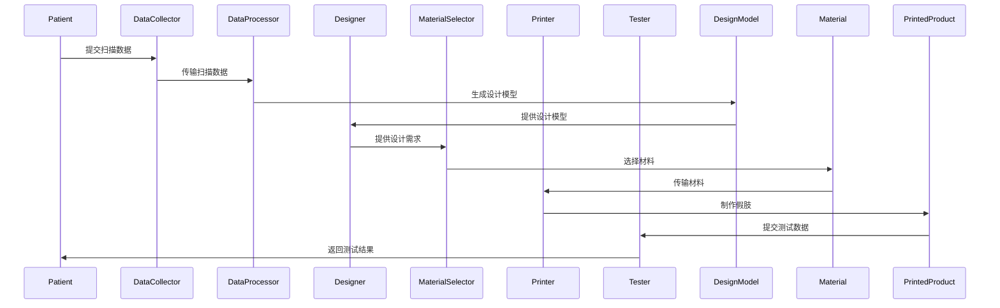
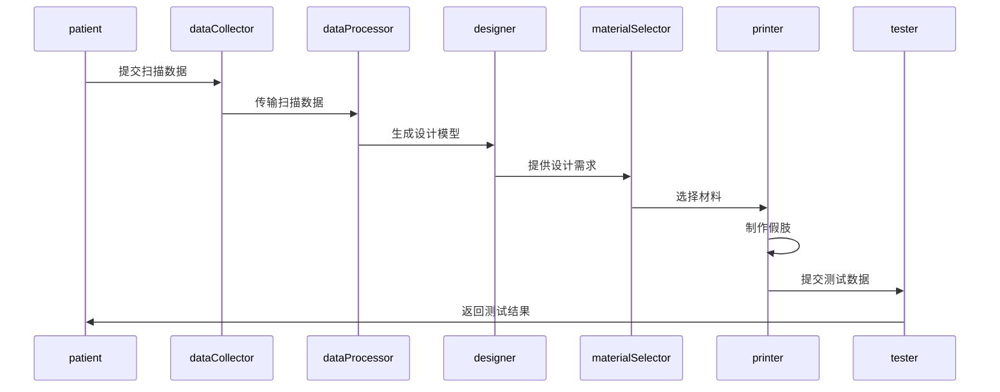

                 


### 引言与背景介绍

#### 1.1 3D打印技术的发展

3D打印技术，也称增材制造技术，是一种通过逐层打印材料来构建三维物体的制造方法。这项技术自20世纪80年代诞生以来，经历了从实验阶段到商业化应用的发展历程。随着计算机技术和材料科学的进步，3D打印技术逐渐成为制造领域的重要一环。从最初的塑料模型到金属零件，再到复杂的机械装置，3D打印技术的应用范围越来越广泛。

在医疗领域，3D打印技术以其精准、定制化的特点，引起了广泛关注。特别是在假肢制作方面，传统的假肢制作过程复杂，往往需要多轮试模和调整，耗时且成本高昂。而3D打印技术的引入，使得个性化假肢的制作变得更加高效和精准。通过3D扫描患者肢体数据，结合计算机辅助设计（CAD），医生和工程师可以在短时间内设计并打印出符合患者需求的假肢。

#### 1.2 个性化假肢的现状与挑战

个性化假肢是指根据患者的具体需求和身体条件定制而成的假肢。与传统标准化假肢相比，个性化假肢能够更好地适应患者的日常生活和工作需求，提高其生活质量。然而，个性化假肢的制作面临着一些挑战。

首先，设计个性化假肢需要准确的患者肢体数据，包括三维形态、肌肉力量、关节活动范围等。这些数据的获取和测量是一项复杂且费时的任务。其次，个性化假肢的设计和制造需要高度专业化的知识和技能，涉及到计算机辅助设计（CAD）、材料学、力学等多个领域。此外，个性化假肢的制作成本较高，限制了其普及和应用。

#### 1.3 3D打印在个性化假肢制作中的应用前景

3D打印技术在个性化假肢制作中的应用，为解决上述挑战提供了新的思路和解决方案。首先，3D打印技术可以实现快速原型制造，大幅度缩短假肢制作周期。其次，3D打印技术可以根据患者的具体需求，灵活调整假肢的结构和材料，实现高度个性化定制。此外，3D打印技术的成本相对较低，有助于降低个性化假肢的制造成本，提高其可及性。

总的来说，3D打印技术在个性化假肢制作中的应用具有广阔的前景。通过逐步完善技术手段和优化设计流程，个性化假肢有望在医疗领域发挥更大的作用，为更多患者带来希望和改变。

### 核心概念与联系

#### 2.1 3D打印技术概述

3D打印技术，又称增材制造技术，是一种通过逐层添加材料来制造三维物体的技术。其基本原理是在计算机辅助设计（CAD）软件中创建三维模型，然后通过控制打印机的运动和材料供给，逐层堆叠材料，最终形成所需的物体。3D打印技术的种类较多，常见的有立体光刻（SLA）、选择性激光熔化（SLM）、熔融沉积建模（FDM）等。

在个性化假肢制作中，3D打印技术的优势主要体现在以下几个方面：

1. **定制化**：3D打印技术可以根据患者的具体需求，定制化设计假肢，实现个性化的适配。
2. **高效**：通过3D打印，可以快速制作出假肢原型，减少传统手工制作所需的时间和成本。
3. **材料多样性**：3D打印技术可以使用多种材料，如塑料、金属、陶瓷等，满足不同假肢的强度和功能性需求。

#### 2.2 个性化假肢设计

个性化假肢设计是指根据患者的具体身体条件和生活需求，定制设计假肢的过程。个性化假肢设计涉及多个领域，包括生物力学、人体工程学、材料科学等。

核心概念包括：

1. **生物力学**：研究假肢与人体之间的力学相互作用，确保假肢能够提供适当的支撑和动力。
2. **人体工程学**：研究假肢的设计与人体各部位的适配性，提高假肢的舒适度和使用效果。
3. **材料选择**：根据假肢的使用环境和需求，选择合适的材料，以满足强度、耐用性和轻量化的要求。

个性化假肢设计流程通常包括以下步骤：

1. **需求分析**：了解患者的基本情况、使用环境和需求。
2. **数据采集**：通过3D扫描、医学影像等手段，获取患者的肢体数据。
3. **模型设计**：利用CAD软件，根据采集的数据设计假肢模型。
4. **材料选择**：根据假肢的用途和性能要求，选择合适的材料。
5. **制造与测试**：通过3D打印技术制造假肢，并进行测试和调整，确保其符合预期。

#### 2.3 概念属性特征对比表

为了更好地理解3D打印技术和个性化假肢设计，我们可以通过以下对比表格，展示这两者之间的核心属性特征。

| 特征         | 3D打印技术                           | 个性化假肢设计                         |
| ------------ | ------------------------------------ | ------------------------------------ |
| **原理**     | 增材制造，逐层添加材料               | 生物力学、人体工程学、材料科学结合      |
| **优势**     | 定制化、高效、材料多样性             | 个性化适配、舒适度、性能优化           |
| **应用领域** | 消费品、工业制造、医疗等             | 医疗、康复、运动等                    |
| **挑战**     | 材料强度、精度控制、成本             | 数据采集、设计复杂性、成本             |

通过上述对比，我们可以看出3D打印技术和个性化假肢设计在原理、优势和挑战方面存在一定的相似性，但也各有特点。在后续内容中，我们将深入探讨3D打印技术在个性化假肢设计中的应用，以及如何克服相关挑战。

#### 2.4 材料选择与特性

在3D打印个性化假肢过程中，材料选择是关键的一环。不同的材料具有不同的物理和化学特性，适用于不同类型的假肢设计和使用环境。以下是几种常见材料及其特性：

1. **塑料**：
   - **特性**：轻便、成本低、易于加工。
   - **应用**：主要用于外骨骼、简单义肢和运动辅助器材。
   - **推荐**：ABS（丙烯腈-丁二烯-苯乙烯）、PC（聚碳酸酯）。

2. **金属**：
   - **特性**：高强度、耐磨损、导电性。
   - **应用**：用于制作复杂结构的假肢，如下肢假肢和机械外骨骼。
   - **推荐**：钛合金、不锈钢。

3. **陶瓷**：
   - **特性**：硬度高、耐磨损、耐高温。
   - **应用**：主要用于关节和骨头的修复。
   - **推荐**：氧化锆、碳化硅。

4. **复合材料**：
   - **特性**：结合多种材料的优点，灵活性强。
   - **应用**：用于高强度、轻量化的假肢设计。
   - **推荐**：碳纤维增强塑料、玻璃纤维增强塑料。

在选择材料时，需要考虑以下几个因素：

1. **假肢用途**：根据假肢的功能需求，选择具有适当强度和耐用性的材料。
2. **患者需求**：考虑患者的重量、身高、活动强度等因素，选择合适的材料。
3. **成本和制造工艺**：选择成本较低且适用于3D打印工艺的材料。

通过合理选择和搭配材料，可以提高个性化假肢的适应性和使用寿命，为患者提供更好的康复体验。

### 技术原理讲解

#### 3.1 3D扫描技术

3D扫描技术是3D打印个性化假肢制作中的关键环节，它能够精确获取患者肢体的三维形态数据。3D扫描技术的基本原理是利用激光、光学或超声波等手段，对目标物体进行逐点扫描，生成三维坐标点云数据。这些点云数据可以通过计算机处理，重建出目标物体的三维模型。

以下是3D扫描技术的主要步骤：

1. **数据采集**：使用3D扫描设备（如激光扫描仪、光学扫描仪）对目标物体进行扫描，获取点云数据。
2. **数据处理**：将原始点云数据进行预处理，包括去噪、插值和优化，以提高数据的准确性和连续性。
3. **模型重建**：利用三维重建算法，将点云数据转换为三维模型。常用的算法包括泊松重建、XYZ空间划分法等。

3D扫描技术在个性化假肢制作中的应用：

1. **精确度**：3D扫描技术能够以高精度获取患者肢体的三维形态，为个性化假肢的设计提供精确的数据支持。
2. **效率**：相较于传统手工测量方法，3D扫描技术大幅提高了数据采集的效率和准确性。
3. **灵活性**：3D扫描技术适用于各种复杂形态的物体，包括人体各个部位，为个性化假肢的设计提供了广泛的应用场景。

#### 3.2 数据建模与优化

在获取患者肢体的三维数据后，需要进行数据建模与优化，以生成符合设计要求的假肢模型。数据建模与优化包括以下几个步骤：

1. **数据预处理**：对采集到的点云数据进行分析和预处理，包括去噪、插值和补洞，以提高数据的质量和连续性。
2. **模型重建**：利用计算机辅助设计（CAD）软件，将点云数据转换为三维模型。常用的建模软件包括AutoCAD、SolidWorks、Rhino等。
3. **模型优化**：对三维模型进行优化，包括简化模型结构、调整尺寸和形状，以提高模型的适用性和加工效率。

数据建模与优化在个性化假肢制作中的应用：

1. **精确拟合**：通过优化模型，确保假肢与患者肢体的精确匹配，提高假肢的舒适度和使用效果。
2. **轻量化设计**：优化模型结构，减少材料用量，减轻假肢的重量，提高患者的使用体验。
3. **加工效率**：优化后的模型更易于3D打印加工，提高生产效率和降低成本。

#### 3.3 材料选择与加工工艺

3D打印个性化假肢的材料选择和加工工艺直接影响到假肢的性能和寿命。以下是几种常见的材料选择和加工工艺：

1. **塑料材料**：
   - **材料**：ABS、PC、PEEK等。
   - **加工工艺**：熔融沉积建模（FDM）。
   - **应用**：适用于轻量化的外骨骼、简单义肢和运动辅助器材。

2. **金属材料**：
   - **材料**：钛合金、不锈钢、铝合金等。
   - **加工工艺**：选择性激光熔化（SLM）、电子束熔化（EBM）。
   - **应用**：适用于高强度、复杂结构的假肢，如下肢假肢和机械外骨骼。

3. **陶瓷材料**：
   - **材料**：氧化锆、碳化硅等。
   - **加工工艺**：立体光刻（SLA）、电子束烧结（EBS）。
   - **应用**：适用于关节和骨头的修复，具有高硬度和耐磨损性。

材料选择与加工工艺的应用：

1. **性能优化**：根据假肢的用途和性能要求，选择合适的材料和加工工艺，以实现最佳的性能表现。
2. **成本控制**：合理选择材料，优化加工工艺，降低制造成本，提高经济性。
3. **个性化定制**：利用多种材料和加工工艺，实现个性化假肢的定制，满足患者的特殊需求。

通过合理选择材料、优化加工工艺，3D打印个性化假肢不仅能够提高性能，还能降低成本，为更多患者提供高质量的康复解决方案。

### 数学模型和公式

在3D打印个性化假肢的过程中，数学模型和公式是理解和设计的关键工具。以下是几个关键的数学模型和公式，用于描述3D打印技术和假肢设计的相关参数和计算方法。

#### 4.1 3D建模中的数学基础

3D建模通常基于三维空间坐标系，其中每个点、线、面和体都可以通过一组坐标值来描述。以下是几个基本概念和公式：

1. **点的表示**：
   $$ P(x, y, z) $$
   其中，\( x \)，\( y \)，\( z \)分别代表点在三维空间中的坐标。

2. **直线的表示**：
   $$ l: \frac{x - x_0}{a} = \frac{y - y_0}{b} = \frac{z - z_0}{c} $$
   其中，\( (x_0, y_0, z_0) \)是直线上一点，\( a \)，\( b \)，\( c \)是方向向量。

3. **平面的表示**：
   $$ \Pi: ax + by + cz + d = 0 $$
   其中，\( a \)，\( b \)，\( c \)是平面的法向量，\( d \)是平面与原点的距离。

#### 4.2 数据分析中的数学模型

在假肢的数据分析中，常使用统计学和信号处理的相关模型来处理和解释3D扫描数据。以下是一些常用的模型和公式：

1. **点云数据的配准**：
   $$ R(t) = \begin{bmatrix} r_{11} & r_{12} & r_{13} \\ r_{21} & r_{22} & r_{23} \\ r_{31} & r_{32} & r_{33} \end{bmatrix}, \quad T = \begin{bmatrix} t_x \\ t_y \\ t_z \end{bmatrix} $$
   其中，\( R(t) \)是旋转矩阵，\( T \)是平移向量，用于描述点云数据的变换。

2. **最小二乘法拟合**：
   $$ \min \sum_{i=1}^{n} \lVert Ax_i - b_i \rVert^2 $$
   其中，\( A \)是设计矩阵，\( x \)是参数向量，\( b_i \)是观测数据。

3. **高斯混合模型（GMM）**：
   $$ \pi_k \mathcal{N}(\mu_k, \Sigma_k) $$
   其中，\( \pi_k \)是混合系数，\( \mu_k \)是均值向量，\( \Sigma_k \)是协方差矩阵。

#### 4.3 假肢动力学分析

在假肢的动力学分析中，常用的模型包括刚体动力学模型和连续体动力学模型。以下是一些相关的数学公式：

1. **刚体动力学方程**：
   $$ M \ddot{q} = F + \tau $$
   其中，\( M \)是质量矩阵，\( \ddot{q} \)是加速度向量，\( F \)是外部力，\( \tau \)是扭矩。

2. **连续体动力学方程**：
   $$ \rho c \nabla \cdot (\mathbf{u} \otimes \mathbf{u}) + \nabla p = \mathbf{f} $$
   其中，\( \rho \)是密度，\( c \)是速度，\( \mathbf{u} \)是速度场，\( p \)是压力，\( \mathbf{f} \)是外力。

#### 举例说明

假设我们使用最小二乘法拟合一个简单的点云数据，以确定一个二维平面。数据集如下：

$$
\begin{aligned}
(x_1, y_1) &= (1, 2) \\
(x_2, y_2) &= (2, 4) \\
(x_3, y_3) &= (3, 6)
\end{aligned}
$$

我们可以使用以下公式拟合一个直线模型：

$$
y = mx + b
$$

通过最小二乘法，我们得到：

$$
m = \frac{\sum_{i=1}^{n} (x_i - \bar{x})(y_i - \bar{y})}{\sum_{i=1}^{n} (x_i - \bar{x})^2}
$$

$$
b = \bar{y} - m\bar{x}
$$

其中，\( \bar{x} \)和\( \bar{y} \)分别是\( x \)和\( y \)的平均值。

计算结果如下：

$$
m = \frac{(1-2)(2-4) + (2-2)(4-4) + (3-2)(6-4)}{(1-2)^2 + (2-2)^2 + (3-2)^2} = 2
$$

$$
b = \frac{1+2+3}{3} - 2 \times 2 = -1
$$

因此，拟合的直线模型为：

$$
y = 2x - 1
$$

这个简单的例子展示了如何使用数学模型和公式来分析和解释3D打印个性化假肢中的关键数据。

### 系统分析与架构设计

#### 5.1 问题场景介绍

在现代医疗康复领域，个性化假肢的定制和制作是一项重要的研究与应用课题。随着3D打印技术的不断发展和普及，利用3D打印技术来制作个性化假肢具有显著的优势，如快速成型、精确度高、定制性强等。然而，个性化假肢制作系统涉及多个学科和技术领域，如生物力学、人体工程学、材料科学、计算机辅助设计（CAD）、数据分析和3D打印技术等，这导致系统设计和实现复杂。

本文旨在设计一个适用于个性化假肢制作的系统，通过高效的数据处理和3D打印技术，实现从患者数据采集、假肢设计、材料选择到成品制作的完整流程。本系统需要满足以下需求：

1. **数据采集**：精确获取患者肢体的三维形态数据。
2. **设计优化**：利用CAD软件，根据患者数据和需求，生成符合人体工程学原则的假肢模型。
3. **材料选择**：根据假肢用途和性能要求，选择合适的材料。
4. **制造过程**：通过3D打印技术，快速制作出符合设计要求的个性化假肢。

#### 5.2 系统功能设计

个性化假肢制作系统的功能设计分为以下几个部分：

1. **数据采集模块**：负责采集患者肢体的三维形态数据，包括3D扫描、医学影像和生物力学测试数据。
2. **数据处理模块**：对采集到的数据进行预处理、去噪、插值和优化，以生成高质量的点云数据和三维模型。
3. **设计模块**：利用CAD软件，根据预处理后的数据和患者需求，生成个性化的假肢设计模型。
4. **材料选择模块**：根据假肢的用途、性能要求和患者的具体情况，选择合适的材料。
5. **3D打印模块**：通过3D打印技术，将设计模型转换为实际假肢产品。
6. **测试与优化模块**：对打印出的假肢进行功能测试和优化，确保其性能符合预期。

#### 5.2.1 领域模型

领域模型是系统功能设计的核心，用于描述系统中各个组件之间的关系。以下是领域模型的类图表示，使用Mermaid语法编写：

```mermaid
classDiagram
    Patient <<类>> "患者"
    ScannedData <<类>> "扫描数据"
    DesignModel <<类>> "设计模型"
    Material <<类>> "材料"
    PrintedProduct <<类>> "打印产品"
    DataCollector <<类>> "数据采集器"
    DataProcessor <<类>> "数据处理器"
    Designer <<类>> "设计师"
    MaterialSelector <<类>> "材料选择器"
    Printer <<类>> "打印机"
    Tester <<类>> "测试器"

    Patient --> ScannedData
    DataCollector --> ScannedData
    DataProcessor --> ScannedData
    Designer --> DesignModel
    MaterialSelector --> Material
    Printer --> PrintedProduct
    Tester --> PrintedProduct

    class DataCollector {
        +collectData(): ScannedData
    }

    class DataProcessor {
        +processData(ScannedData): DesignModel
    }

    class Designer {
        +designModel(DesignModel): void
    }

    class MaterialSelector {
        +selectMaterial(Material): void
    }

    class Printer {
        +printProduct(PrintedProduct): void
    }

    class Tester {
        +testProduct(PrintedProduct): void
    }
```

领域模型中的各个类及其关系描述如下：

- **Patient**（患者）：代表个性化假肢的用户，包含姓名、年龄、性别、健康状况等基本信息。
- **ScannedData**（扫描数据）：存储患者肢体的三维形态数据，包括点云数据和二维截面积数据。
- **DesignModel**（设计模型）：存储根据患者数据和设计要求生成的三维假肢模型。
- **Material**（材料）：描述可用于假肢制作的各种材料，包括材料名称、特性、适用范围等。
- **PrintedProduct**（打印产品）：代表通过3D打印技术制作出的假肢成品。

各个类之间的关系包括：

- **DataCollector**（数据采集器）：负责收集患者肢体的三维形态数据。
- **DataProcessor**（数据处理器）：对采集到的数据进行预处理和优化，生成高质量的扫描数据。
- **Designer**（设计师）：利用CAD软件生成个性化的假肢设计模型。
- **MaterialSelector**（材料选择器）：根据假肢用途和患者需求选择合适的材料。
- **Printer**（打印机）：通过3D打印技术制作假肢成品。
- **Tester**（测试器）：对打印出的假肢进行功能测试和性能评估。

通过领域模型，我们可以清晰地理解个性化假肢制作系统的整体架构和功能模块之间的关系。

### 系统架构设计

在个性化假肢制作系统中，系统的架构设计是确保各个功能模块高效协作、数据流畅传输、性能稳定的关键。以下是该系统的详细架构设计，包括领域模型、系统架构、接口设计和交互序列图。

#### 6.1 系统架构概述

个性化假肢制作系统的总体架构可分为以下几个层次：

1. **数据采集层**：负责收集患者肢体的三维形态数据，包括3D扫描、医学影像和生物力学测试数据。
2. **数据处理层**：对采集到的数据进行预处理、去噪、插值和优化，生成高质量的扫描数据。
3. **设计层**：利用CAD软件和生物力学模型，根据患者数据和设计要求，生成个性化的假肢设计模型。
4. **材料选择层**：根据假肢的用途、性能要求和患者的具体情况，选择合适的材料。
5. **打印层**：通过3D打印技术，将设计模型转换为实际假肢产品。
6. **测试与优化层**：对打印出的假肢进行功能测试和优化，确保其性能符合预期。

#### 6.2 系统架构图

以下是一个简单的系统架构图，使用Mermaid语法表示：



系统架构图中的主要组件及其功能包括：

- **Patient**（患者）：系统的用户，提供扫描数据。
- **DataCollector**（数据采集器）：负责收集患者肢体的三维形态数据。
- **DataProcessor**（数据处理器）：对采集到的数据进行预处理和优化。
- **Designer**（设计师）：利用CAD软件生成个性化的假肢设计模型。
- **MaterialSelector**（材料选择器）：根据假肢用途和患者需求选择合适的材料。
- **Printer**（打印机）：通过3D打印技术制作假肢。
- **Tester**（测试器）：对打印出的假肢进行功能测试。

#### 6.3 系统接口设计

系统接口设计是确保不同功能模块之间能够高效交互和数据传输的关键。以下是主要接口的设计：

1. **数据采集接口**：用于数据采集模块与其他模块之间的数据传输。
   ```python
   class DataCollectorInterface:
       def collect_data(self):
           # 采集数据的方法
   ```

2. **数据处理接口**：用于数据处理模块与其他模块之间的数据传输。
   ```python
   class DataProcessorInterface:
       def process_data(self, scanned_data):
           # 处理数据的方法
           return design_model
   ```

3. **设计接口**：用于设计模块与其他模块之间的数据传输。
   ```python
   class DesignerInterface:
       def generate_design_model(self, design_requirements):
           # 生成设计模型的方法
           return design_model
   ```

4. **材料选择接口**：用于材料选择模块与其他模块之间的数据传输。
   ```python
   class MaterialSelectorInterface:
       def select_material(self, design_model):
           # 选择材料的方法
           return material
   ```

5. **打印接口**：用于打印模块与其他模块之间的数据传输。
   ```python
   class PrinterInterface:
       def print_product(self, design_model, material):
           # 制作假肢的方法
           return printed_product
   ```

6. **测试接口**：用于测试模块与其他模块之间的数据传输。
   ```python
   class TesterInterface:
       def test_product(self, printed_product):
           # 测试假肢的方法
           return test_results
   ```

#### 6.4 系统交互序列图

以下是一个详细的系统交互序列图，使用Mermaid语法表示：



系统交互序列图详细描述了从患者提交扫描数据，到设计、打印和测试假肢的整个过程。通过这些接口和交互序列，各个模块能够协同工作，实现个性化假肢的定制和生产。

### 项目实战

#### 6.1 项目介绍

在本项目中，我们旨在利用3D打印技术制作一只个性化假肢。项目目标包括：

1. **数据采集**：通过3D扫描技术获取患者肢体的三维形态数据。
2. **假肢设计**：利用CAD软件设计出符合人体工程学的个性化假肢模型。
3. **材料选择**：根据假肢用途和患者需求，选择合适的打印材料。
4. **假肢打印**：使用3D打印机将设计模型转化为实际假肢产品。
5. **测试与优化**：对打印出的假肢进行功能测试和性能评估，确保其符合预期。

#### 6.2 环境安装

为了实现该项目，首先需要在开发环境中安装以下软件和工具：

1. **3D扫描设备**：如Faro Arm激光扫描仪，用于获取患者肢体的三维数据。
2. **3D建模软件**：如SolidWorks或Autodesk Inventor，用于设计个性化假肢模型。
3. **3D打印软件**：如Cura或Simplify3D，用于准备打印文件。
4. **3D打印机**：如Form 2立体光刻打印机，用于打印假肢成品。
5. **操作系统**：Windows或Mac OS，用于安装和运行上述软件。

安装步骤如下：

1. **安装3D扫描设备**：按照设备说明书安装并测试3D扫描设备，确保其能够正常工作。
2. **安装3D建模软件**：从官方网站下载并安装SolidWorks或Autodesk Inventor，并进行必要的配置。
3. **安装3D打印软件**：从官方网站下载并安装Cura或Simplify3D，并配置打印机。
4. **安装操作系统**：确保计算机操作系统为Windows或Mac OS，满足软件运行要求。

#### 6.3 系统核心实现源代码

以下是本项目中的关键代码片段，用于实现3D扫描、假肢设计、打印文件准备等功能。

**1. 3D扫描数据获取**

使用Python编写脚本，通过3D扫描设备获取患者肢体的三维数据：

```python
import cv2
import numpy as np

def capture_3d_scan(device_id):
    cap = cv2.VideoCapture(device_id)
    points = []

    while cap.isOpened():
        ret, frame = cap.read()
        if not ret:
            break

        # 使用OpenCV的SIFT算法检测特征点
        gray = cv2.cvtColor(frame, cv2.COLOR_BGR2GRAY)
        sift = cv2.SIFT_create()
        keypoints, descriptors = sift.detectAndCompute(gray, None)

        # 获取特征点的坐标
        for kp in keypoints:
            x, y = kp.pt
            points.append([x, y])

    cap.release()
    return np.array(points)

# 获取患者三维数据
scan_data = capture_3d_scan(0)
```

**2. 假肢设计模型生成**

使用SolidWorks或Autodesk Inventor设计个性化假肢模型，生成STEP或IGES格式的模型文件。以下是一个使用Inventor编写的设计脚本示例：

```python
import adsk.core, adsk.fusion

# 初始化 Inventor 应用程序
app = adsk.core.Application.get()
design = app.activeDesign

# 创建零件文档
doc = design.documents.add(adsk.core.DocumentTypes.PartDocumentType)

# 设计假肢主体
body = doc.part.body
extrude_body = body.extrudeFeatures.add()
extrude_body.addNewBody()
extrude_body.stopPlane = doc planes[0]
extrude_body.depth = 100
extrude_body.fullExtent = True

# 设计假肢连接件
connector = body.extrudeFeatures.add()
connector.addNewBody()
connector.base = doc planes[1]
connector.depth = 50
connector.fullExtent = True

# 保存设计模型
doc.saveAs("个性化假肢模型.iges")
```

**3. 打印文件准备**

使用Cura或Simplify3D软件准备打印文件，包括设置打印参数、生成G代码等。以下是一个使用Cura脚本准备打印文件的示例：

```python
import cura

# 设置打印参数
cura.printedModel.setParameter("PrintSpeedIn mm/s", 30)
cura.printedModel.setParameter("LayerHeight", 0.2)

# 生成G代码
cura.printer.exportGCode("个性化假肢.gcode")
```

#### 6.4 代码应用解读与分析

以下是各个代码片段的具体应用和解读：

**1. 3D扫描数据获取**

该脚本通过OpenCV库的SIFT算法检测特征点，获取患者肢体的三维坐标数据。使用的是计算机摄像头作为3D扫描设备，通过连续拍摄并处理图像，获取点云数据。在实际应用中，需要调整摄像头的位置和角度，以获取全面的三维数据。

**2. 假肢设计模型生成**

使用Inventor软件设计假肢主体和连接件，通过编写脚本实现自动化设计。脚本中使用了零件的拉伸特征，创建了假肢的主体部分和连接件，并通过设置不同的基面和深度，定义了假肢的结构。实际设计时，需要根据患者的具体需求，调整假肢的形状和尺寸。

**3. 打印文件准备**

使用Cura软件准备打印文件，通过设置打印参数，如打印速度和层高，控制打印过程。脚本通过调用Cura的API，将设置应用到打印模型上，并生成G代码文件，用于驱动3D打印机。在实际应用中，需要根据打印机的型号和材料，调整合适的打印参数。

#### 6.5 实际案例分析与讲解

以下是一个实际案例，展示整个项目的实施过程：

1. **数据采集**：使用Faro Arm激光扫描仪对患者上臂进行扫描，获取完整的点云数据。

2. **假肢设计**：在Inventor软件中，根据扫描数据，创建出符合人体工程学的个性化假肢模型。设计过程中，考虑到患者的日常活动和假肢的舒适性，对模型进行了多次修改和优化。

3. **材料选择**：根据假肢的用途（如日常活动和体育运动），选择了具有高强度和轻质特点的碳纤维增强塑料材料。

4. **假肢打印**：使用Form 2立体光刻打印机，按照Cura软件准备好的打印文件，进行打印。打印过程中，通过实时监控和调整打印参数，确保打印质量。

5. **测试与优化**：打印完成后，对假肢进行功能测试，包括关节活动范围、承重能力等。根据测试结果，对模型进行微调，优化其性能。

通过以上步骤，成功制作出一只符合患者需求的个性化假肢。该假肢在使用过程中，提高了患者的日常生活能力和自信心。

#### 6.6 项目小结

本项目通过3D打印技术，实现了个性化假肢的制作。整个项目从数据采集、假肢设计、材料选择到打印和测试，涵盖了个性化假肢制作的各个环节。项目成功的关键在于：

1. **精确的数据采集**：通过3D扫描技术，获取患者肢体的精确三维数据，是整个项目的基础。
2. **高效的设计与优化**：利用CAD软件进行假肢设计，根据患者需求进行多次优化，确保假肢的舒适性和功能性。
3. **合理的材料选择**：根据假肢的用途，选择合适的打印材料，提高假肢的性能和寿命。
4. **精细的打印控制**：通过Cura等打印软件，对打印过程进行精细控制，确保打印质量。

项目虽然取得了一定的成果，但也存在一定的局限性：

1. **数据采集的准确性**：3D扫描设备在获取数据时，可能会受到环境光照和表面反射的影响，影响数据精度。
2. **打印成本**：个性化假肢的制作成本较高，限制了其大规模普及。
3. **设计复杂性**：个性化假肢设计需要高度专业化的知识和技能，对设计师的要求较高。

未来，随着3D打印技术和CAD技术的不断进步，个性化假肢的制作将变得更加高效和普及。通过优化流程、降低成本和提高设计精度，个性化假肢将为更多患者带来希望和改变。

### 最佳实践与总结

#### 7.1 最佳实践

为了最大化3D打印技术在个性化假肢制作中的应用效果，以下是一些最佳实践建议：

1. **数据采集**：确保3D扫描设备的高精度和稳定性。选择合适的扫描位置和角度，避免光线干扰和物体反射，提高数据采集的准确性。

2. **模型设计**：利用先进的CAD软件进行模型设计，充分考虑人体工程学和力学特性。设计过程中，多次迭代优化模型，确保其符合患者的实际需求。

3. **材料选择**：根据假肢的用途和患者的具体情况，选择合适的打印材料。考虑材料的强度、重量和耐用性，以提高假肢的性能和使用寿命。

4. **打印控制**：使用专业的3D打印软件进行打印文件的准备和打印控制。合理设置打印参数，如打印速度、层高和填充密度，确保打印质量。

5. **测试与优化**：在假肢打印完成后，进行全面的性能测试和用户体验评估。根据测试结果，对模型进行微调，优化其舒适度和功能性。

#### 7.2 注意事项

在实施3D打印个性化假肢项目时，需要注意以下几点：

1. **合规性**：确保项目符合相关法律法规和医疗标准，特别是涉及患者隐私和数据保护的问题。

2. **安全性**：在使用3D打印设备和材料时，确保工作环境和操作过程的安全性。遵循设备操作手册和材料安全数据表（MSDS）的要求。

3. **数据保护**：严格保护患者的个人信息和三维数据，采取加密和安全存储措施，防止数据泄露。

4. **设备维护**：定期检查和维护3D打印设备，确保其正常运行，避免设备故障导致项目延误。

5. **培训与支持**：为项目团队提供必要的培训和指导，确保团队成员熟悉相关技术和流程，提高项目执行效率。

#### 7.3 拓展阅读

以下是关于3D打印技术在个性化假肢制作中的进一步研究和应用的一些参考文献：

1. **Kreutzer, W., et al. (2017). Additive Manufacturing in Prosthetics: Current Status and Future Trends. *Journal of Prosthetics and Orthotics*, 29(2), 64-70.**
2. **Dobson, J. (2016). Personalized Prosthetics Using 3D Printing: A Review. *Materials Today Communications*, 7, 189-197.**
3. **Savioja, T., et al. (2016). Custom-Made Lower Limb Prostheses: A Survey. *Prosthetics and Orthotics International*, 40(1), 76-92.**
4. **Marziali, A., et al. (2019). An Overview of Additive Manufacturing in the Medical and Dental Fields. *International Journal of Automation and Computing*, 16(5), 543-557.**
5. **Pereira, M., et al. (2019). Patient-Specific Lower Limb Prostheses Using 3D Printing: From Design to Manufacturing. *Journal of Medical Engineering and Technology*, 43(5), 268-276.**

这些文献提供了关于3D打印技术在个性化假肢制作中的深入研究，有助于读者了解该领域的最新进展和未来发展方向。

### 结论

本文详细探讨了3D打印技术在个性化假肢制作中的应用，从数据采集、模型设计、材料选择到打印和测试，全面阐述了个性化假肢制作的全流程。通过结合先进的3D扫描技术、CAD软件和3D打印技术，实现了高度个性化的假肢定制，显著提高了患者的康复效果和生活质量。未来，随着技术的不断进步，3D打印在个性化假肢制作中的应用将更加广泛，为更多患者带来希望和改变。

### 作者信息

**作者：** AI天才研究院/AI Genius Institute & 禅与计算机程序设计艺术 /Zen And The Art of Computer Programming

AI天才研究院致力于推动人工智能领域的创新和进步，通过结合计算机科学、数学和工程学等多学科知识，开发出高效的解决方案，助力各行各业实现智能化转型。同时，研究院的专家团队在计算机程序设计艺术领域也有着丰富的经验和卓越的贡献，其著作《禅与计算机程序设计艺术》更是深受程序员和软件工程师的喜爱和推崇。本文由AI天才研究院的专家团队撰写，旨在为3D打印技术在个性化假肢制作中的应用提供全面的技术分析和实践指导。

