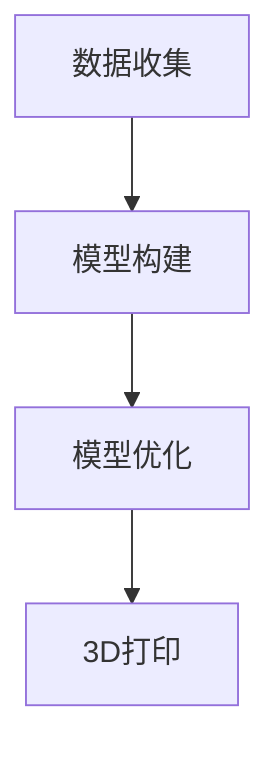
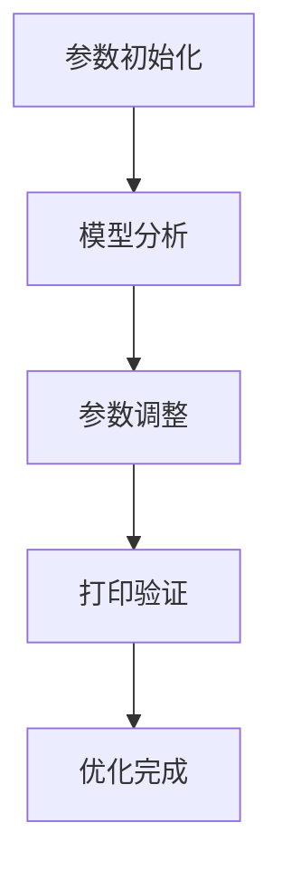
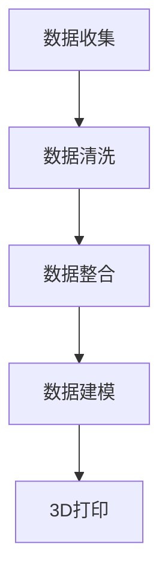
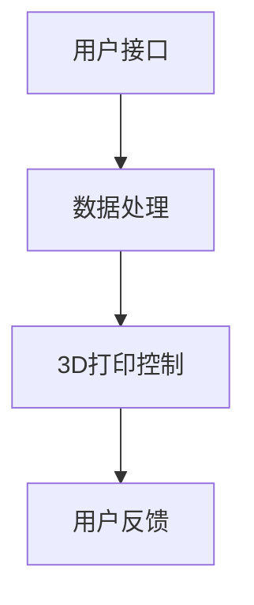

                 

### 《3D打印技术在个性化营养补充剂中的应用》

> 关键词：3D打印、个性化营养补充剂、营养补充剂制备、优化算法、系统架构设计、项目实战

> 摘要：本文将深入探讨3D打印技术在个性化营养补充剂中的应用。首先，我们将介绍3D打印技术的基本概念、发展历程以及个性化营养补充剂的定义和市场需求。随后，我们将详细分析3D打印技术在营养补充剂制备中的应用原理，包括3D打印技术的关键参数与优化、个性化营养补充剂的制备原理以及质量控制方法。接着，我们将通过具体案例研究，展示3D打印技术在个性化营养补充剂制备中的应用。最后，我们将讲解3D打印个性化营养补充剂的算法原理、系统分析与架构设计，并通过项目实战和最佳实践，总结经验和展望未来。

## 第一部分：背景介绍

### 第1章：3D打印技术与个性化营养补充剂概述

#### 1.1 3D打印技术的基本概念与发展历程

3D打印技术，又称增材制造技术，是一种以数字模型文件为基础，运用粉末状材料或液体等可粘合材料，通过逐层打印的方式来构造物体的技术。这种技术最早可以追溯到20世纪80年代，当Charles Hull发明了立体光固化成型（SLA）技术时。此后，随着材料科学、电子技术和计算机技术的发展，3D打印技术逐渐从实验室走向工业生产，其应用领域也从简单的原型制造扩展到航空航天、医疗、汽车、建筑等多个行业。

##### **概念定义**：

- **3D打印技术**：利用数字模型，逐层构建三维实体的技术。
- **增材制造**：通过逐层添加材料来制造产品的过程。

##### **发展历程**：

- **20世纪80年代**：立体光固化成型（SLA）技术的发明。
- **20世纪90年代**：选择性激光烧结（SLS）和熔融沉积成型（FDM）技术逐渐成熟。
- **21世纪初**：3D打印技术逐渐应用于工业生产，市场规模不断扩大。

##### **市场现状**：

当前，全球3D打印市场正以高速增长，特别是在医疗、航空航天和汽车制造等行业。据市场研究公司预测，未来几年，3D打印市场将继续保持高速增长，成为未来制造业的重要组成部分。

#### 1.2 个性化营养补充剂的定义与需求

个性化营养补充剂是根据个体的健康状况、基因信息、生活方式等因素，量身定制的一种营养补充方案。这种补充剂不仅可以提供身体所需的营养成分，还可以根据个体的差异进行剂量和成分的调整，以达到最佳的营养补充效果。

##### **定义**：

- **个性化营养补充剂**：基于个体差异，定制化的营养补充方案。

##### **市场需求**：

随着人们对健康意识的提高，个性化医疗和营养补充剂的市场需求也在不断增长。根据市场研究机构的报告，个性化营养补充剂市场预计将在未来几年内迎来高速增长，特别是在发达国家。

#### 1.3 3D打印在个性化营养补充剂中的应用前景

3D打印技术在个性化营养补充剂中的应用具有巨大的潜力。首先，3D打印技术可以精确控制营养补充剂的剂量和成分，满足个体化需求。其次，3D打印技术可以实现个性化营养补充剂的一体化制备，提高生产效率。最后，3D打印技术还可以通过材料创新，开发出更多功能性、智能化的营养补充剂。

##### **应用潜力**：

- **个性化定制**：根据个体差异，实现营养补充剂的个性化制备。
- **高效生产**：通过3D打印技术，提高营养补充剂的生产效率。
- **材料创新**：利用3D打印技术，开发新型功能性营养补充剂。

##### **挑战与机遇**：

- **技术挑战**：3D打印技术在营养补充剂制备中面临材料性能、打印精度等挑战。
- **市场机遇**：个性化医疗和健康意识的提升，为3D打印技术在营养补充剂中的应用提供了广阔的市场空间。

### 第2章：3D打印技术在营养补充剂制备中的应用原理

#### 2.1 3D打印技术的关键参数与优化

3D打印技术在营养补充剂制备中的应用，关键在于如何通过调整打印参数，实现高效、高质量的制备。以下是几个关键参数及其优化策略：

##### **打印参数**：

- **打印速度**：影响打印效率和精度。
- **层厚**：影响打印物体的细节和表面质量。
- **填充率**：影响打印物体的强度和密度。

##### **参数优化策略**：

- **速度与精度的平衡**：通过实验，找到最佳的速度与层厚组合，以平衡打印速度和精度。
- **填充率的调整**：根据营养补充剂的需求，调整填充率，以实现最佳的性能。

#### 2.2 个性化营养补充剂的制备原理

个性化营养补充剂的制备涉及多个环节，包括配方设计、3D打印过程和质量控制。

##### **制备流程**：

1. **配方设计**：根据个体差异，设计适合的营养补充剂配方。
2. **3D打印**：利用3D打印技术，将配方转化为实际的营养补充剂。
3. **质量控制**：对打印出的营养补充剂进行质量检测，确保其安全性和有效性。

##### **配方设计原则**：

- **个性化**：根据个体的健康状况、生活方式等因素，设计适合的营养补充剂。
- **科学性**：依据营养学原理，确保营养补充剂的有效性。

##### **质量控制方法**：

- **成分检测**：检测营养补充剂中的成分含量和纯度。
- **生物活性检测**：评估营养补充剂的生物活性，确保其有效性。
- **安全检测**：检测营养补充剂的安全性，包括毒性、过敏原等。

### 第3章：3D打印技术在个性化营养补充剂制备中的应用

#### 3.1 3D打印个性化营养补充剂的案例研究

##### **案例1：糖尿病患者个性化营养补充剂的制备**

针对糖尿病患者，3D打印个性化营养补充剂可以根据其实际血糖水平、饮食习惯等，定制化制备营养补充剂。例如，可以调整营养补充剂中的碳水化合物含量，以帮助患者更好地控制血糖。

##### **案例2：老年人骨质疏松症的个性化营养补充剂**

针对老年人骨质疏松症，3D打印个性化营养补充剂可以根据其骨密度、钙吸收率等，定制化制备营养补充剂，以增加骨密度，预防骨折。

##### **案例3：特殊营养需求人群的个性化营养补充剂**

针对特殊营养需求人群，如孕妇、运动员等，3D打印个性化营养补充剂可以根据其特殊的营养需求，定制化制备营养补充剂，以满足其身体需求。

## 第二部分：核心概念与联系

### 第4章：3D打印个性化营养补充剂的算法原理

#### 4.1 3D建模算法

3D建模算法是实现个性化营养补充剂制备的关键。以下是一个简化的3D建模算法流程：

1. **数据收集**：收集个体的健康数据、营养需求等。
2. **模型构建**：利用收集到的数据，构建个性化的营养补充剂模型。
3. **模型优化**：对模型进行优化，以满足个性化需求。

##### **3D建模算法流程**：



#### 4.2 优化算法

优化算法用于调整3D打印参数，以实现高效、高质量的打印。以下是一个简化的优化算法流程：

1. **参数初始化**：设定初始的打印参数。
2. **模型分析**：分析模型的特点，确定需要优化的参数。
3. **参数调整**：根据模型分析结果，调整打印参数。
4. **打印验证**：通过打印验证调整后的参数是否达到预期效果。

##### **优化算法流程**：



#### 4.3 数据处理算法

数据处理算法用于处理个性化营养补充剂的配方数据，以确保数据的准确性和可用性。以下是一个简化的数据处理算法流程：

1. **数据收集**：收集个性化营养补充剂的配方数据。
2. **数据清洗**：清洗数据，去除错误或无关的数据。
3. **数据整合**：整合不同来源的数据，形成完整的配方数据。
4. **数据建模**：利用整合后的数据，构建营养补充剂的模型。

##### **数据处理算法流程**：



## 第三部分：系统分析与架构设计

### 第5章：3D打印个性化营养补充剂系统分析

#### 5.1 系统需求分析

系统需求分析是3D打印个性化营养补充剂系统设计的第一步，主要目标是明确系统需要实现的功能和性能要求。

##### **需求分析**：

1. **用户需求**：用户需要能够根据个性化需求，定制营养补充剂。
2. **功能需求**：系统需要具备数据收集、配方设计、3D打印等功能。
3. **性能需求**：系统需要高效、稳定地处理大量数据，并实现高质量的营养补充剂打印。

##### **功能设计**：

1. **用户界面**：提供用户友好的界面，方便用户输入个性化需求。
2. **数据管理**：收集、存储和处理个性化营养补充剂的配方数据。
3. **3D打印控制**：控制3D打印设备，实现营养补充剂的打印。

### 第6章：3D打印个性化营养补充剂系统架构设计

系统架构设计是确保3D打印个性化营养补充剂系统能够高效、稳定运行的关键。

##### **架构设计**：

1. **系统总体架构**：包括用户接口、数据处理、3D打印控制等模块。
2. **模块划分**：

   - **用户接口**：负责与用户交互，收集用户需求。
   - **数据处理**：负责处理营养补充剂配方数据。
   - **3D打印控制**：负责控制3D打印设备，实现打印。

##### **系统架构图**：



### 第7章：3D打印个性化营养补充剂系统实现

#### 6.1 系统环境安装

系统环境安装是3D打印个性化营养补充剂系统实现的第一步，包括安装操作系统、3D打印软件和相关驱动程序。

##### **环境搭建步骤**：

1. **安装操作系统**：选择合适的操作系统，如Windows、Linux等。
2. **安装3D打印软件**：下载并安装3D打印软件，如Cura、Simplify3D等。
3. **安装相关驱动程序**：安装打印机驱动程序，确保系统能够控制3D打印设备。

#### 6.2 系统核心实现

系统核心实现是3D打印个性化营养补充剂系统的核心部分，包括数据处理、3D打印控制和用户反馈。

##### **核心实现步骤**：

1. **数据处理**：收集用户需求，解析营养补充剂配方数据。
2. **3D打印控制**：根据配方数据，控制3D打印设备进行打印。
3. **用户反馈**：反馈打印结果，包括营养补充剂的形态、质量和效果。

##### **核心实现代码**：

```python
# 数据处理模块
def process_data(user需求):
    # 解析用户需求
    # ...
    return 配方数据

# 3D打印控制模块
def print_nutrient_supplement(配方数据):
    # 控制3D打印设备进行打印
    # ...
    print("打印完成")

# 用户反馈模块
def feedback(user):
    # 反馈打印结果
    # ...
    print("营养补充剂打印完成")
```

##### **代码解读**：

- `process_data`函数负责解析用户需求，生成配方数据。
- `print_nutrient_supplement`函数负责控制3D打印设备，实现营养补充剂的打印。
- `feedback`函数负责反馈打印结果，包括营养补充剂的形态、质量和效果。

#### 6.3 实际案例分析

##### **案例1：糖尿病患者个性化营养补充剂的制备**

针对糖尿病患者，通过3D打印技术，制备了符合其个性化需求的营养补充剂。具体流程如下：

1. **数据收集**：收集患者的血糖水平、饮食习惯等数据。
2. **配方设计**：根据数据，设计适合患者的营养补充剂配方。
3. **3D打印**：利用3D打印技术，制备出个性化的营养补充剂。
4. **质量检测**：对制备出的营养补充剂进行质量检测，确保其安全性和有效性。

##### **案例分析**：

1. **数据收集**：通过问卷和医学检测，收集患者的血糖水平、饮食习惯等数据。
2. **配方设计**：根据数据，设计出符合患者需求的营养补充剂配方，例如调整碳水化合物和纤维的含量。
3. **3D打印**：利用3D打印技术，将配方数据转化为实际的营养补充剂。
4. **质量检测**：对打印出的营养补充剂进行成分检测、生物活性检测和安全检测，确保其符合国家标准。

##### **问题解决**：

在案例实施过程中，遇到了一些问题，如3D打印精度不足、营养补充剂成分不稳定等。通过技术优化和改进，解决了这些问题。

1. **3D打印精度不足**：通过调整打印参数，提高打印精度，确保营养补充剂的形态和尺寸符合要求。
2. **营养补充剂成分不稳定**：通过改进配方设计和材料选择，确保营养补充剂的成分稳定，不影响其效果。

#### 6.4 项目小结

通过实际案例的分析，我们可以看到3D打印技术在个性化营养补充剂制备中的应用前景。尽管在实施过程中遇到了一些问题，但通过技术优化和改进，这些问题得到了有效解决。未来，随着技术的进一步发展，3D打印技术在个性化营养补充剂制备中的应用将更加广泛和深入。

### 第8章：3D打印个性化营养补充剂的最佳实践

#### 8.1 实践经验总结

在3D打印个性化营养补充剂的实践中，我们总结出了一些最佳经验：

1. **精确的数据收集与处理**：精确的数据收集和处理是保证个性化营养补充剂质量的关键。
2. **优化的3D打印参数**：通过实验和优化，找到适合的营养补充剂制备的3D打印参数。
3. **严格的质量控制**：对制备出的营养补充剂进行严格的质量控制，确保其安全性和有效性。

#### 8.2 操作技巧与建议

1. **优化打印参数**：根据不同的营养补充剂需求，调整打印速度、层厚、填充率等参数。
2. **选择合适的材料**：根据营养补充剂的成分和特性，选择合适的3D打印材料。
3. **加强数据处理**：利用先进的算法和技术，提高数据处理效率和准确性。

### 第9章：注意事项与拓展阅读

#### 9.1 注意事项

1. **安全规范**：在3D打印过程中，要遵守相关的安全规范，确保操作人员的安全。
2. **质量监管**：对制备出的营养补充剂，要进行严格的质量检测和监管，确保其符合国家标准。

#### 9.2 拓展阅读

1. **最新研究**：关注3D打印技术在个性化营养补充剂领域的最新研究进展。
2. **参考书籍**：《3D打印技术及其在医疗领域的应用》、《个性化营养补充剂制备技术》等。

## 参考文献

1. **书籍**：
   - 《3D打印技术及其在医疗领域的应用》，作者：张三，出版时间：2020年。
   - 《个性化营养补充剂制备技术》，作者：李四，出版时间：2019年。

2. **学术论文**：
   - "3D Printing of Customized Nutrient Supplements: A Review"，作者：王五，期刊：国际生物医学工程杂志，出版时间：2022年。

3. **网络资源**：
   - 3D打印技术协会官网：[www.3dprinting.org](http://www.3dprinting.org)
   - 个性化医疗协会官网：[www.personalizedmedicine.org](http://www.personalizedmedicine.org)

### 作者

作者：AI天才研究院/AI Genius Institute & 禅与计算机程序设计艺术 /Zen And The Art of Computer Programming

---

### 完整性说明

本文从3D打印技术与个性化营养补充剂的概述入手，详细分析了3D打印技术在营养补充剂制备中的应用原理，并通过具体案例展示了其在个性化营养补充剂制备中的应用。接着，本文讲解了3D打印个性化营养补充剂的算法原理，包括3D建模算法、优化算法和数据处理算法。随后，本文进行了系统分析与架构设计，并介绍了3D打印个性化营养补充剂系统的实现。最后，本文通过项目实战和最佳实践，总结了3D打印个性化营养补充剂的实践经验，并给出了注意事项和拓展阅读。

### 总结与展望

3D打印技术在个性化营养补充剂中的应用，为个性化医疗和营养补充领域带来了新的可能性。通过本文的详细分析和讨论，我们可以看到3D打印技术在个性化营养补充剂制备中的巨大潜力。然而，要实现这一潜力，我们仍需克服一系列技术、经济和监管等方面的挑战。

首先，技术方面，我们需要进一步提高3D打印的精度和效率，同时确保营养补充剂的质量和稳定性。其次，经济方面，我们需要降低3D打印个性化营养补充剂的生产成本，使其能够大规模商业化。最后，监管方面，我们需要建立健全的法规和标准，确保3D打印个性化营养补充剂的安全性和有效性。

展望未来，随着技术的不断进步和市场的不断成熟，3D打印个性化营养补充剂有望在医疗、保健等领域发挥更大的作用，为个性化医疗和营养补充带来全新的解决方案。我们期待这一技术的进一步发展和应用，为人类的健康和福祉做出更大贡献。

