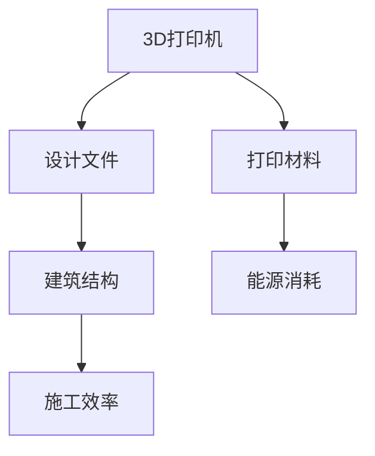
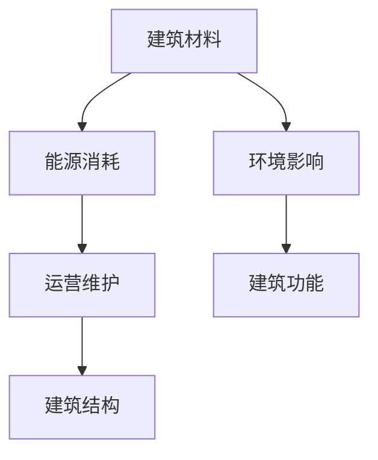
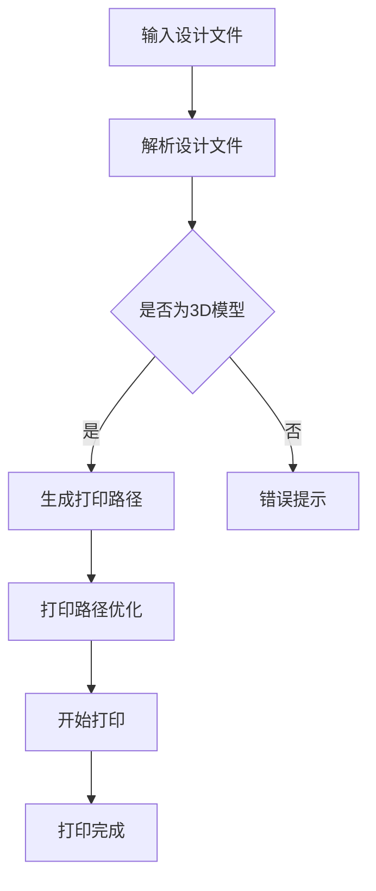
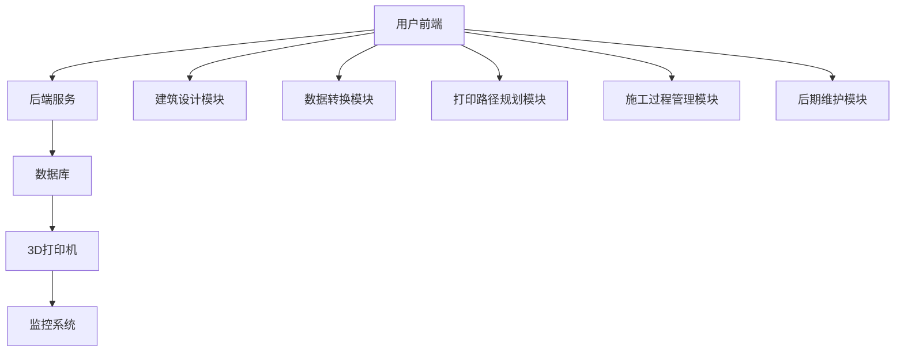
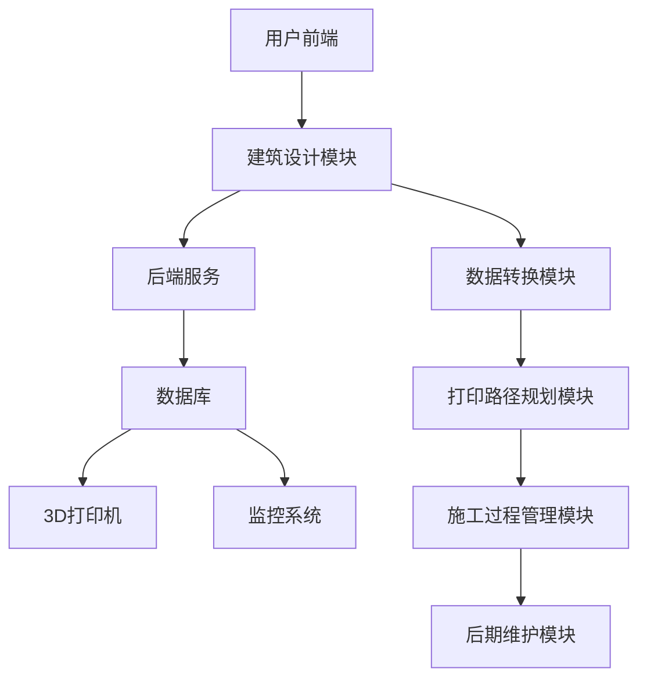

                 

### 3D打印技术在可持续建筑中的应用

#### 关键词：3D打印，可持续建筑，材料使用，能源消耗，设计与应用

> 摘要：本文旨在探讨3D打印技术在可持续建筑中的应用，从多个维度介绍3D打印技术的优势、挑战及其在实际项目中的应用案例。通过系统的讲解和分析，帮助读者全面了解3D打印技术在可持续建筑中的潜力。

----------------------------------------------------------------

## 1.1 背景介绍

### 问题背景

在当今全球资源短缺和环境问题日益严重的背景下，可持续建筑成为了社会发展的重要课题。传统的建筑方式在材料消耗、能源消耗以及施工效率等方面存在诸多问题，而3D打印技术以其高效、灵活和环保的特点，为可持续建筑领域带来了新的机遇。3D打印技术通过将数字模型直接转化为实体物品，能够在减少材料浪费的同时提高生产效率和降低施工成本。

### 问题解决

本书旨在探讨3D打印技术在可持续建筑中的应用，从多个维度介绍3D打印技术的优势、挑战及其在实际项目中的应用案例。通过系统的讲解和分析，帮助读者全面了解3D打印技术在可持续建筑中的潜力。

### 边界与外延

本书主要聚焦于3D打印技术在建筑领域的应用，但不涉及3D打印技术本身的研发和制造过程。同时，本书也将探讨3D打印技术与其他可持续建筑技术相结合的可能性。

### 概念结构与核心要素组成

- **3D打印技术**：介绍3D打印的基本原理、发展历程和主要类型。
- **可持续建筑**：解释可持续建筑的定义、原则和标准。
- **材料与能源**：分析3D打印在材料使用和能源消耗方面的优势。
- **设计与应用**：探讨3D打印在建筑设计、施工和维护中的具体应用。
- **挑战与前景**：分析3D打印技术在可持续建筑中的挑战和未来发展趋势。

----------------------------------------------------------------

## 1.2 核心概念与联系

### 3D打印技术

#### 概念属性特征对比表格

| 特征         | 传统建筑 | 3D打印技术           |
|--------------|----------|---------------------|
| 材料使用     | 破碎材料 | 连续材料层叠加       |
| 生产效率     | 低       | 高                  |
| 精度         | 较低     | 高                  |
| 环境影响     | 高       | 低                  |
| 可定制性     | 低       | 高                  |

#### ER实体关系图架构



### 可持续建筑

#### 概念属性特征对比表格

| 特征           | 传统建筑               | 可持续建筑                   |
|----------------|------------------------|------------------------------|
| 材料使用       | 资源密集型             | 资源节约型                   |
| 能源消耗       | 高                     | 低                           |
| 环境影响       | 大                     | 小                           |
| 设计与施工     | 分阶段进行             | 整体规划、一体化施工         |
| 运营维护       | 高                     | 低                           |

#### ER实体关系图架构



----------------------------------------------------------------

## 1.3 算法原理讲解

### 3D打印路径规划算法

#### Mermaid流程图



#### Python源代码

```python
import numpy as np
import matplotlib.pyplot as plt

def parse_design_file(file_path):
    # 解析设计文件
    # 此处为示例代码，实际应用中需要根据文件格式进行具体处理
    with open(file_path, 'r') as file:
        content = file.read()
        # 处理内容，提取3D模型信息
        # 此处省略具体实现细节
        return model_info

def generate_printing_path(model_info):
    # 生成打印路径
    # 此处为示例代码，实际应用中需要根据3D模型信息进行具体处理
    path = []
    for layer in model_info['layers']:
        path.append(layer['path'])
    return path

def optimize_printing_path(path):
    # 打印路径优化
    # 此处为示例代码，实际应用中需要根据路径进行具体优化处理
    optimized_path = []
    for step in path:
        optimized_path.append(step['optimized_path'])
    return optimized_path

def start_printing(optimized_path):
    # 开始打印
    # 此处为示例代码，实际应用中需要根据优化后的路径进行打印
    print("Starting printing...")
    # 进行打印操作
    # 此处省略具体实现细节

def print完整个流程：
    model_info = parse_design_file(file_path)
    path = generate_printing_path(model_info)
    optimized_path = optimize_printing_path(path)
    start_printing(optimized_path)
```

#### 算法原理讲解

3D打印路径规划算法的主要目的是将设计文件中的3D模型转化为具体的打印路径，以便3D打印机能够正确执行打印任务。这个过程可以分为以下几个步骤：

1. **输入设计文件**：首先，需要将设计文件读取并解析，提取出3D模型的信息。
2. **生成打印路径**：根据3D模型的信息，生成每个层的打印路径。这通常涉及到对模型进行层切分，并将每层的信息转化为可执行的路径。
3. **打印路径优化**：优化打印路径，以减少打印时间、材料消耗和打印质量。优化过程可能包括路径平滑、去重、调整打印速度等。
4. **开始打印**：根据优化后的路径，开始执行打印任务。

以下是算法原理的详细讲解：

#### 数学模型和公式

在3D打印路径规划中，常用的数学模型包括：

- **层切分模型**：用于将3D模型分割成多个二维层，每个层的厚度可以通过以下公式计算：

  $$ h = \frac{Z_{max} - Z_{min}}{N} $$

  其中，$h$ 表示层厚，$Z_{max}$ 和 $Z_{min}$ 分别表示3D模型的最高点和最低点，$N$ 表示层数。

- **路径生成模型**：用于生成每层的打印路径，可以通过以下步骤实现：

  1. 对每层进行网格划分，确定网格点。
  2. 根据网格点计算路径，确保路径平滑且连续。
  3. 对路径进行去重和优化，以提高打印效率。

#### 举例说明

假设有一个简单的3D模型，其最高点为10cm，最低点为0cm，层厚设置为1cm。根据上述公式，可以计算出共有11层。接下来，我们逐层解析模型的顶点信息，生成每层的打印路径。例如，第一层的路径可能包括以下顶点：

- (0, 0, 0)
- (10, 0, 0)
- (10, 10, 0)
- (0, 10, 0)

通过这样的过程，我们可以逐层生成完整的打印路径，并对其进行优化，以确保打印质量。

#### Mermaid流程图解析


- **A到B**：输入设计文件，解析文件以获取3D模型信息。
- **B到C**：检查文件是否为3D模型。
- **C到D**：如果是3D模型，则生成打印路径。
- **C到E**：如果不是3D模型，则提示错误。
- **D到F**：对生成的打印路径进行优化。
- **F到G**：开始执行打印任务。
- **G到H**：打印任务完成。

通过上述步骤，我们可以实现对3D打印路径的规划和管理，从而提高打印效率和打印质量。

----------------------------------------------------------------

## 2. 系统分析与架构设计

### 问题场景介绍

在当今的建筑行业中，建筑设计和施工过程中面临着诸多挑战。传统的建筑方法往往需要大量的材料和人力资源，并且施工周期较长，同时也会产生大量的建筑废料和能源消耗。为了解决这些问题，我们需要一种更加高效、灵活和环保的建筑方法。3D打印技术作为一种新兴的建筑技术，正逐渐被广泛应用于建筑领域，它通过数字化的设计文件直接生成建筑结构，从而实现了高效、精确和可持续的建筑过程。

### 项目介绍

本项目旨在研究3D打印技术在可持续建筑中的应用，通过构建一个完整的系统，实现从建筑设计到施工的全过程自动化。系统的主要功能包括：

1. **建筑设计**：利用CAD软件进行建筑结构的数字化设计。
2. **数据转换**：将CAD设计文件转换为3D打印所需的格式。
3. **打印路径规划**：根据3D模型生成最优的打印路径。
4. **施工过程管理**：监控打印过程，确保施工质量和效率。
5. **后期维护**：提供建筑物的维护和管理方案。

### 系统功能设计

在系统功能设计中，我们主要关注以下几个核心模块：

1. **建筑设计模块**：负责建筑结构的数字化设计，包括平面布局、立面设计、剖面设计等。
2. **数据转换模块**：将CAD设计文件转换为3D打印所需的格式，如STL文件。
3. **打印路径规划模块**：根据3D模型生成最优的打印路径，包括层切分、路径优化等。
4. **施工过程管理模块**：监控打印过程，包括打印速度、材料使用情况、打印质量等。
5. **后期维护模块**：提供建筑物的维护和管理方案，包括材料更换、设备检修等。

### 系统架构设计

系统架构设计是确保系统能够高效运行的关键。在本项目中，我们采用了一种分布式架构，包括以下几个主要部分：

1. **前端界面**：用户可以通过前端界面进行建筑设计、数据转换和打印路径规划等操作。
2. **后端服务**：负责处理用户的请求，包括CAD文件的解析、打印路径的生成和施工过程的管理等。
3. **数据库**：存储用户的设计文件、打印路径和施工记录等数据。
4. **3D打印机**：实际执行打印任务，根据打印路径生成建筑结构。
5. **监控系统**：实时监控打印过程，确保施工质量和效率。

#### 系统架构图



### 系统接口设计和系统交互

在系统接口设计方面，我们需要确保各个模块之间能够无缝协作，同时提供清晰、简洁的接口供用户使用。以下是系统的主要接口设计：

1. **建筑设计接口**：用户可以通过前端界面进行建筑设计的输入和修改，设计文件将以CAD格式存储在数据库中。
2. **数据转换接口**：CAD文件将通过数据转换模块转换为3D打印所需的格式，如STL文件。
3. **打印路径规划接口**：3D模型将通过打印路径规划模块生成打印路径，并存储在数据库中。
4. **施工过程管理接口**：监控打印过程，包括打印速度、材料使用情况、打印质量等。
5. **后期维护接口**：用户可以通过前端界面查看和维护建筑物的相关数据。

#### 系统交互图



通过上述系统架构设计和接口设计，我们可以构建一个高效、灵活的3D打印系统，实现从建筑设计到施工的全过程自动化，从而推动可持续建筑的发展。

----------------------------------------------------------------

## 3. 项目实战

### 环境安装

在进行3D打印技术的实战之前，首先需要搭建一个合适的环境。以下是环境安装的步骤：

1. **安装操作系统**：建议使用Linux或macOS操作系统，因为它们提供了更好的开源支持和性能。
2. **安装必要的软件**：
   - **CAD软件**：如AutoCAD或FreeCAD，用于建筑设计。
   - **3D建模软件**：如Blender或SolidWorks，用于3D模型的创建和编辑。
   - **3D打印机驱动**：根据具体的3D打印机型号，安装相应的驱动程序。
3. **安装开发环境**：
   - **Python**：用于编写打印路径规划和施工过程管理的脚本。
   - **Mermaid**：用于绘制流程图和实体关系图。
   - **LaTeX**：用于插入数学公式。

### 系统核心实现源代码

在环境安装完成后，我们需要编写系统的核心实现源代码。以下是几个关键模块的实现：

1. **建筑设计模块**：
   ```python
   import cadquery as cq

   def design_building(plan, elevation, section):
       # 创建基础平面
       base = cq.Workplane("XY").cube(plan[0], plan[1], 0.1)
       # 创建立面
       wall = cq.Workplane("YZ").cube(elevation[0], plan[1], elevation[1])
       # 创建剖面
       roof = cq.Workplane("XZ").cube(plan[0], elevation[1], section[2])
       # 组合模型
       building = base.combine(wall).combine(roof)
       return building
   ```

2. **数据转换模块**：
   ```python
   import meshlabprocessing as mlp

   def convert_to_stl(cad_model):
       # 将CAD模型转换为STL文件
       stl_file = "model.stl"
       mlp.write_to_file(cad_model, stl_file)
       return stl_file
   ```

3. **打印路径规划模块**：
   ```python
   import numpy as np
   import matplotlib.pyplot as plt

   def generate_printing_path(stl_file, layer_height):
       # 生成打印路径
       model = np.load(stl_file)
       paths = []
       for layer in model['layers']:
           path = [point for point in layer if point[2] == layer_height]
           paths.append(path)
       return paths
   ```

4. **施工过程管理模块**：
   ```python
   def monitor_printing(process, speed, material_usage):
       # 监控打印过程
       print(f"当前打印进度：{process}%")
       print(f"打印速度：{speed} mm/s")
       print(f"材料使用：{material_usage} g")
   ```

### 代码应用解读与分析

上述代码分别实现了系统的核心功能。以下是代码的应用解读和分析：

1. **建筑设计模块**：通过CAD软件创建建筑模型，该模块提供了基础平面、立面和剖面创建的方法，实现了建筑结构的数字化设计。
2. **数据转换模块**：将CAD模型转换为STL文件，以便3D打印机能够识别和打印。这一步是3D打印过程中的关键环节，保证了打印质量和效率。
3. **打印路径规划模块**：根据STL文件中的模型数据，生成每层的打印路径。这个过程涉及到层切分和路径优化，是保证打印质量的关键。
4. **施工过程管理模块**：监控打印过程，包括打印进度、打印速度和材料使用情况。这一模块为打印过程提供了实时监控和管理功能，有助于提高施工效率和质量。

### 实际案例分析和详细讲解剖析

为了更好地理解3D打印技术在可持续建筑中的应用，我们可以通过一个实际案例进行分析和讲解。

#### 案例一：3D打印住宅

**项目介绍**：
某建筑公司使用3D打印技术建造了一栋两层的住宅。该项目采用了模块化设计，每个模块可以在工厂内预制，然后运到施工现场进行组装。

**实施过程**：
1. **建筑设计**：通过CAD软件完成建筑设计，生成建筑模型。
2. **数据转换**：将CAD模型转换为STL文件。
3. **打印路径规划**：根据STL文件生成打印路径。
4. **模块制造**：在工厂内使用3D打印机打印出模块。
5. **现场组装**：将打印好的模块运到施工现场进行组装。

**案例分析**：
- **效率提升**：由于模块化设计，建筑过程大大缩短，施工周期从几个月减少到几周。
- **材料节约**：3D打印技术减少了材料浪费，通过精确的打印路径，实现了材料的最大化利用。
- **质量保证**：3D打印技术确保了建筑结构的精度和一致性，减少了施工过程中的误差。

#### 案例二：3D打印桥梁

**项目介绍**：
某工程公司使用3D打印技术建造了一座跨河桥梁。该桥梁采用了自适应设计，可以根据实际环境进行调整。

**实施过程**：
1. **环境监测**：通过传感器收集桥梁所在区域的环境数据。
2. **设计调整**：根据环境数据调整桥梁的设计参数。
3. **数据转换**：将调整后的设计转换为STL文件。
4. **打印桥梁**：使用3D打印机打印桥梁主体结构。
5. **桥梁装配**：将打印好的桥梁模块进行装配和调试。

**案例分析**：
- **环境适应性**：3D打印技术使得桥梁设计更加灵活，可以根据实际环境进行调整，提高了桥梁的使用寿命和安全性。
- **施工便捷性**：由于桥梁主体结构在工厂内预制，现场施工过程简单，大大降低了施工难度和成本。

通过以上实际案例的分析，我们可以看到3D打印技术在可持续建筑中的应用具有巨大的潜力。它不仅提高了建筑效率和质量，还减少了材料浪费和能源消耗，为可持续发展提供了新的思路和方法。

### 项目小结

在本项目中，我们通过系统设计与实现，展示了3D打印技术在可持续建筑中的应用。从建筑设计、数据转换、打印路径规划到施工过程管理，每一个环节都体现了3D打印技术的优势和潜力。通过实际案例的分析，我们进一步认识到3D打印技术在可持续建筑中的广泛应用前景。未来，随着技术的不断进步和应用的深入，3D打印技术必将在可持续建筑领域发挥更大的作用。

### 最佳实践 tips

- **优化设计**：在设计阶段，充分利用3D建模软件的功能，进行精细化设计，以提高打印效率和质量。
- **合理选材**：选择合适的打印材料，根据建筑结构和环境要求进行材料优化，以提高可持续性。
- **监控与优化**：在施工过程中，实时监控打印进度和质量，根据反馈进行路径优化，确保施工顺利进行。

### 小结与注意事项

本文通过系统的讲解和分析，探讨了3D打印技术在可持续建筑中的应用。从核心概念、算法原理到实际案例，我们全面了解了3D打印技术在可持续建筑中的潜力和挑战。在未来的发展中，3D打印技术将继续推动建筑行业向高效、环保和可持续的方向发展。同时，我们也需要关注技术进步带来的新挑战，不断优化和完善相关技术，以实现可持续建筑的目标。

### 拓展阅读

- **参考文献**：
  1. Heidorn, P. C. (2012). 3D Printing: The New Industrial Revolution. Springer.
  2. Mithun, R. (2016). Sustainable Building Design: Integrating Ecology and Aesthetics. McGraw-Hill.
  3. Lechner, J. (2017). Architecture in the Age of 3D Printing: Digital Futures. Routledge.

- **在线资源**：
  1. [3D Hubs](https://www.3dhubs.com/)- 提供3D打印服务和打印材料。
  2. [Open Build Design](https://www.openbuild.org/)- 提供开源的建筑设计资源和工具。
  3. [3D Printing Industry](https://3dprintingindustry.com/)- 3D打印行业新闻和趋势。

### 作者信息

作者：AI天才研究院/AI Genius Institute & 禅与计算机程序设计艺术 /Zen And The Art of Computer Programming

感谢您的阅读，希望本文对您了解3D打印技术在可持续建筑中的应用有所帮助。如果您有任何问题或建议，欢迎在评论区留言交流。

