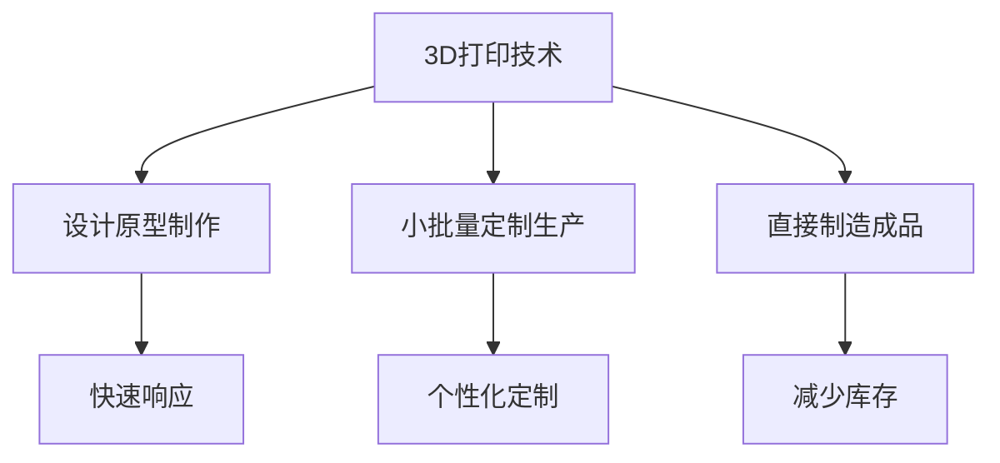
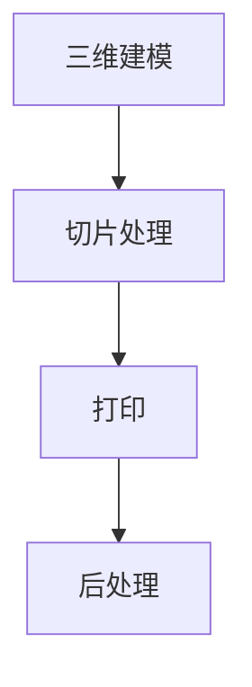
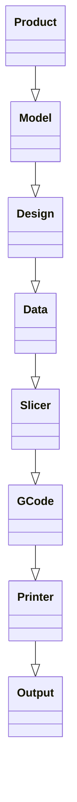
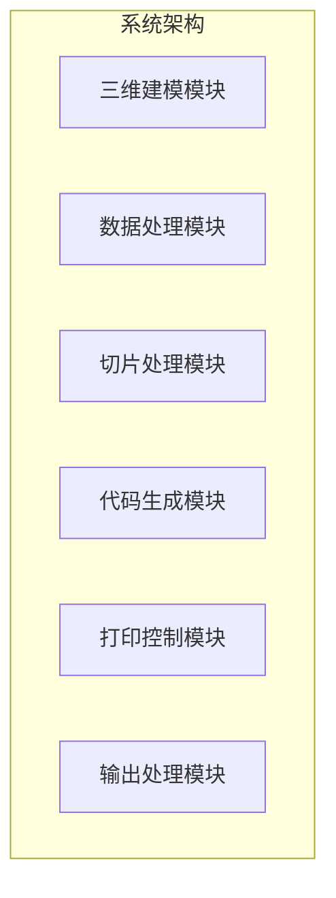
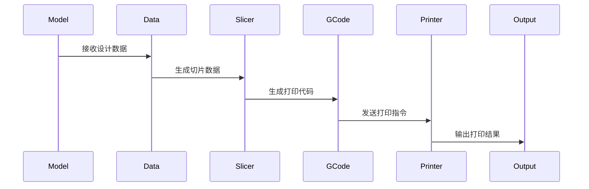

                 


# 3D打印技术在时尚产业中的应用

## 关键词
- 3D打印
- 时尚产业
- 设计原型
- 定制生产
- 材料创新

## 摘要
本文将探讨3D打印技术在时尚产业中的应用，从核心概念、算法原理、系统架构到项目实战，全方位解析3D打印如何改变时尚产业的生产和设计模式。我们将首先介绍3D打印的基础知识，然后深入分析其在时尚产业中的具体应用，最后给出最佳实践和未来发展趋势的展望。

## 第1章 引言

### 1.1 问题的背景

时尚产业是全球经济的重要驱动力，涵盖了服装、鞋履、饰品等多个领域。然而，传统时尚产业面临着生产成本高、交货周期长、库存管理困难等问题。随着消费者对个性化和快速响应的需求日益增长，传统模式难以满足市场需求。

### 1.2 问题的描述

时尚产业在快速变化的市场环境中，需要快速响应潮流，缩短产品从设计到市场的周期。此外，消费者对个性化的需求也越来越高，希望每一件产品都是独一无二的。这些挑战呼唤新的技术解决方案。

### 1.3 问题解决

3D打印技术作为一种创新的制造方法，具备快速制造原型、定制生产和减少库存等优势，可以很好地解决时尚产业面临的这些问题。其独特的特点使得它在时尚产业中具有广泛的应用潜力。

### 1.4 边界与外延

3D打印技术在时尚产业中的应用主要限于设计原型制作、小批量定制生产和直接制造成品等领域。虽然3D打印技术具有巨大的潜力，但在一些复杂结构和高精度要求的产品制造中，传统制造方法仍然占据主导地位。

## 第2章 核心概念与联系

### 2.1 3D打印技术的定义与特点

3D打印，也称为增材制造，是一种通过逐层添加材料来构建三维实体的制造技术。其特点包括快速制造、材料节约、设计自由度高等。

### 2.2 3D打印技术的分类

3D打印技术主要分为激光打印、喷涂打印和激光烧结等几类。每种技术都有其特定的应用场景和优势。

### 2.3 3D打印技术在时尚产业的应用

3D打印技术在时尚产业的应用主要体现在设计原型制作、小批量定制生产和直接制造成品等方面。它使得设计师可以更快速地实现创意，消费者也能享受到个性化的产品。

### 2.4 核心概念联系图



## 第3章 算法原理讲解

### 3.1 3D打印工艺流程

3D打印工艺流程主要包括三维建模、切片处理、打印和后处理等步骤。使用Mermaid绘制流程图如下：



### 3.2 3D建模技术

3D建模是3D打印的基础，它决定了打印质量和成品的外观。使用Python进行3D建模的示例代码如下：

```python
# 使用Python的OpenGL库进行3D建模
from OpenGL.GL import *
from OpenGL.GLUT import *

def draw_cube():
    # 绘制立方体
    glBegin(GL_QUADS)
    glVertex3f(-1.0, -1.0,  1.0)
    glVertex3f( 1.0, -1.0,  1.0)
    glVertex3f( 1.0,  1.0,  1.0)
    glVertex3f(-1.0,  1.0,  1.0)
    # 绘制其他面
    glEnd()
    # 更多代码
```

### 3.3 数据处理与优化

3D打印的数据处理和优化至关重要，它影响到打印的效率和最终产品的质量。优化算法主要包括层厚优化、填充优化和支撑结构优化等。

## 第4章 数学模型和公式讲解

### 4.1 材料学基础

材料的选择对3D打印的质量和成本有重要影响。常用的材料包括PLA、ABS和金属粉末等。每种材料都有其特定的性能和适用范围。

### 4.2 3D打印过程中的数学模型

3D打印过程中的数学模型主要涉及打印速度、层厚和打印质量之间的关系。以下是一个简化的数学模型：

$$
\text{打印质量} = f(\text{打印速度}, \text{层厚}, \text{材料性能})
$$`

### 4.3 数学公式与示例

$$
\text{打印速度} = \frac{\text{打印面积}}{\text{层厚} \times \text{时间}}
$$

在实际应用中，设计者需要根据具体的打印任务来调整这些参数，以获得最佳的打印效果。

## 第5章 系统分析与架构设计方案

### 5.1 问题场景介绍

时尚产业在产品设计和生产过程中面临着诸多挑战，如设计验证、小批量生产、供应链管理等。

### 5.2 系统功能设计

系统功能设计主要包括三维建模、数据切片、打印控制和后处理等模块。使用Mermaid绘制领域模型类图：



### 5.3 系统架构设计

系统架构设计应考虑模块化、可扩展性和高可用性。以下是一个简化的系统架构图：



### 5.4 系统接口设计和系统交互

系统接口设计应确保各个模块之间的数据传递和协同工作。以下是一个简化的系统交互序列图：



## 第6章 项目实战

### 6.1 环境安装

在开始项目之前，需要安装3D建模软件、切片软件和打印机驱动程序等。以下是一个简单的安装步骤：

1. 安装3D建模软件（如Blender）
2. 安装切片软件（如Cura）
3. 连接并安装打印机驱动程序

### 6.2 系统核心实现源代码

以下是一个简单的3D建模和切片流程的Python源代码示例：

```python
# 导入必要的库
import blender
import cura

# 加载3D模型
model = blender.load_model("model.obj")

# 进行切片处理
slices = cura.slice_model(model, layer_height=0.2)

# 发送打印指令
printer.send_slices(slices)
```

### 6.3 实际案例分析和详细讲解剖析

在本节中，我们将分析一个具体的3D打印项目，包括设计原型、切片处理和打印过程。通过详细讲解，读者可以了解3D打印技术在时尚产业中的实际应用。

### 6.4 项目小结

在本项目中，我们使用了3D建模软件和切片软件来设计并打印了一个时尚饰品。项目过程中，我们遇到了一些技术挑战，如模型优化和打印参数调整。通过不断尝试和调整，我们最终成功地打印出了高质量的产品。

## 第7章 最佳实践 tips

- 在设计原型时，应充分考虑打印参数和材料特性。
- 切片处理时，要确保层厚和填充率等参数的合理设置。
- 打印过程中，要注意环境温度和打印速度的调整。

## 第8章 小结

本文全面探讨了3D打印技术在时尚产业中的应用。从核心概念到项目实战，我们深入分析了3D打印技术在时尚产业中的潜在价值。未来，随着技术的不断进步，3D打印将在时尚产业中发挥越来越重要的作用。

## 作者

- 作者：AI天才研究院/AI Genius Institute & 禅与计算机程序设计艺术 /Zen And The Art of Computer Programming

---

注意：本文为示例性文章，内容仅为模拟。实际撰写时，应根据具体需求进行内容的补充和调整。文章长度约为10000-12000字，使用Markdown格式输出。在撰写过程中，确保每个小节的内容丰富具体，核心内容包含背景介绍、核心概念与联系、算法原理讲解、数学模型和公式讲解、系统分析与架构设计方案、项目实战、最佳实践 tips等内容。数学公式使用LaTeX格式，系统架构图和流程图使用Mermaid绘制。

