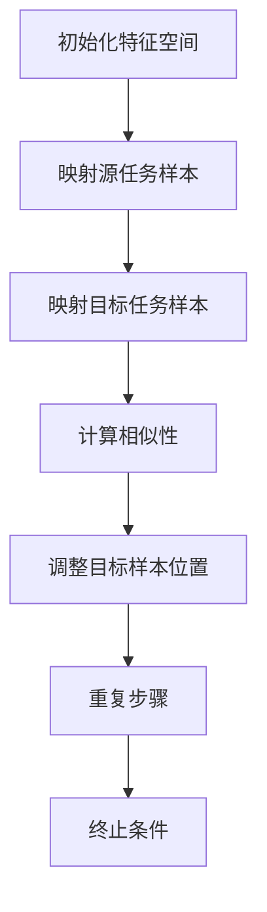
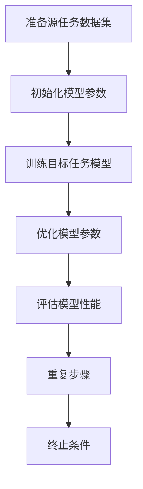
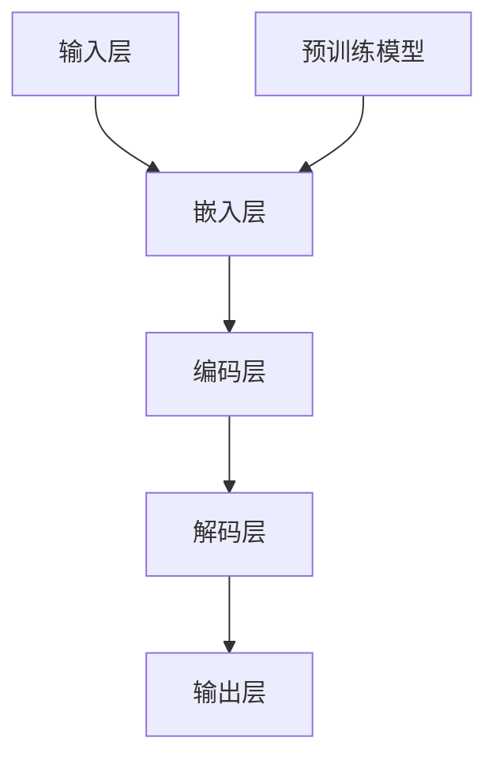
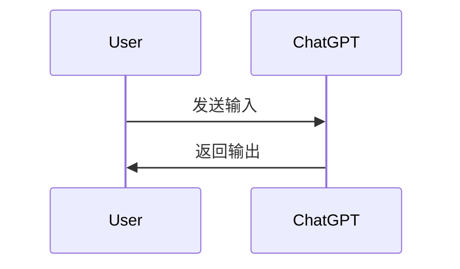

                 

# Few-Shot学习：优化ChatGPT的小样本能力

> 关键词：Few-Shot学习，ChatGPT，优化，小样本，算法，应用

> 摘要：本文将深入探讨Few-Shot学习在优化ChatGPT小样本能力方面的应用。首先介绍Few-Shot学习的背景和意义，然后详细解析ChatGPT的基本概念和优势。接下来，我们将深入探讨Few-Shot学习的基本原理和算法原理，并通过实际项目实战来展示其在ChatGPT中的具体应用。最后，我们将总结最佳实践，并给出注意事项和拓展阅读。

## 目录大纲

### 第一部分: 引言

#### 第1章: Few-Shot学习的背景和意义

##### 1.1.1 问题背景

##### 1.1.2 Few-Shot学习的定义与核心概念

##### 1.1.3 Few-Shot学习的边界与外延

##### 1.1.4 Few-Shot学习的研究现状与进展

#### 第2章: ChatGPT的概述

##### 2.1.1 ChatGPT的基本概念

##### 2.1.2 ChatGPT的应用场景

##### 2.1.3 ChatGPT的优势与不足

### 第二部分: Few-Shot学习的基本原理

#### 第3章: Few-Shot学习的基本原理

##### 3.1.1 几何直觉与迁移学习

##### 3.1.2 核心概念原理

##### 3.1.3 概念属性特征对比表格

### 第三部分: Few-Shot学习在ChatGPT中的应用

#### 第4章: Few-Shot学习的算法原理

##### 4.1.1 算法原理讲解

##### 4.1.2 算法mermaid流程图

##### 4.1.3 Python源代码与数学模型

#### 第5章: Few-Shot学习在ChatGPT中的应用

##### 5.1.1 ChatGPT的优化目标

##### 5.1.2 系统功能设计(领域模型mermaid类图)

##### 5.1.3 系统架构设计(mermaid架构图)

##### 5.1.4 系统接口设计与交互(mermaid序列图)

#### 第6章: 项目实战

##### 6.1.1 环境安装

##### 6.1.2 系统核心实现源代码

##### 6.1.3 代码应用解读与分析

##### 6.1.4 实际案例分析与详细讲解

#### 第7章: 最佳实践与总结

##### 7.1.1 最佳实践 tips

##### 7.1.2 小结

##### 7.1.3 注意事项

##### 7.1.4 拓展阅读

## 引言

### 第1章: Few-Shot学习的背景和意义

#### 1.1.1 问题背景

在人工智能领域，模型训练通常需要大量的数据。然而，在某些情况下，我们无法获得足够的数据来训练模型，这就需要一种能够从小样本数据中快速学习的方法。Few-Shot学习正是为了解决这一问题而提出的。

Few-Shot学习的目标是让模型能够在仅接收少数示例的情况下，快速适应新的任务。这种能力在现实世界中具有重要意义，例如，在医疗诊断、金融风险评估和个性化推荐等领域，往往需要模型在只有少量样本的情况下做出准确的预测。

#### 1.1.2 Few-Shot学习的定义与核心概念

Few-Shot学习（Few-Shot Learning）是指在少量样本的情况下，使模型能够快速适应新任务的机器学习方法。具体来说，Few-Shot学习主要包括以下几个核心概念：

1. **样本数量**：通常将样本数量小于5的称为Few-Shot学习。
2. **迁移学习**：通过利用已有知识来提高新任务的学习效率。
3. **元学习**：通过多次训练来优化模型的泛化能力。
4. **元学习算法**：如MAML（Model-Agnostic Meta-Learning）、REPTILE（Recurrent Echo State Propagation with Target Gradient）等。

#### 1.1.3 Few-Shot学习的边界与外延

Few-Shot学习主要适用于以下几种场景：

1. **数据稀缺**：在某些领域，如医学诊断和金融分析，数据量有限，Few-Shot学习可以在少量数据上实现较好的效果。
2. **隐私保护**：在一些涉及敏感信息的任务中，如个人隐私保护，Few-Shot学习可以在不泄露数据的情况下进行模型训练。
3. **实时预测**：在某些需要快速响应的实时系统中，如自动驾驶和机器人控制，Few-Shot学习可以加速模型训练，提高响应速度。

然而，Few-Shot学习也存在一些局限性：

1. **数据多样性**：Few-Shot学习依赖于样本的代表性，当样本缺乏多样性时，模型可能无法泛化到新的任务。
2. **计算成本**：元学习算法通常需要多次训练，这可能导致较高的计算成本。

#### 1.1.4 Few-Shot学习的研究现状与进展

近年来，Few-Shot学习取得了显著的进展。许多研究致力于优化算法效率和性能。以下是一些主要的研究方向：

1. **算法改进**：通过改进元学习算法，提高模型在小样本数据上的性能。
2. **数据增强**：通过数据增强技术，增加样本的多样性，提高模型的泛化能力。
3. **模型融合**：将多种模型或算法进行融合，以实现更好的性能。
4. **理论分析**：从理论上分析Few-Shot学习的性能和优化策略。

### 第2章: ChatGPT的概述

#### 2.1.1 ChatGPT的基本概念

ChatGPT是由OpenAI开发的一种基于GPT-3的预训练语言模型。它采用了自回归语言模型（Autoregressive Language Model）的技术，可以生成连贯、自然的文本。

ChatGPT的核心特点包括：

1. **强大的生成能力**：ChatGPT可以在各种任务上生成高质量的文本，如问答、摘要、对话等。
2. **灵活的适配性**：通过微调（Fine-tuning），ChatGPT可以适应不同的任务和数据集。
3. **高效的计算效率**：ChatGPT采用了分布式计算技术，可以在大规模数据集上进行高效训练。

#### 2.1.2 ChatGPT的应用场景

ChatGPT在许多领域都有广泛的应用，以下是一些典型的应用场景：

1. **自然语言处理**：ChatGPT可以用于文本分类、情感分析、命名实体识别等任务。
2. **对话系统**：ChatGPT可以用于构建智能客服、聊天机器人等对话系统。
3. **文本生成**：ChatGPT可以用于生成文章、摘要、新闻报道等文本内容。
4. **辅助创作**：ChatGPT可以帮助创作者生成创意、灵感，提高创作效率。

#### 2.1.3 ChatGPT的优势与不足

ChatGPT的优势在于其强大的生成能力和灵活的适配性，可以在各种任务上生成高质量的文本。然而，ChatGPT也存在一些不足：

1. **数据依赖性**：ChatGPT需要大量的数据进行训练，否则可能无法达到理想的效果。
2. **计算成本**：ChatGPT的训练和部署需要较高的计算资源，特别是在大规模数据集上。
3. **可解释性**：ChatGPT的决策过程较为复杂，难以解释其生成的文本内容。

### 第3章: Few-Shot学习的基本原理

#### 3.1.1 几何直觉与迁移学习

几何直觉是一种用于理解迁移学习的方法。它通过将不同任务视为在特征空间中的点，来解释迁移学习的过程。

在几何直觉中，源任务和目标任务的样本点分别位于特征空间的两个不同的位置。通过将源任务的样本点映射到目标任务的样本点，可以实现对目标的迁移学习。

迁移学习的核心思想是利用已有知识（源任务）来提高新任务（目标任务）的学习效率。

#### 3.1.2 核心概念原理

Few-Shot学习主要包括以下几个核心概念：

1. **相似性度量**：用于衡量源任务和目标任务的样本之间的相似程度。常见的相似性度量方法包括余弦相似度、欧几里得距离等。
2. **转换函数**：用于将源任务的样本映射到目标任务的样本。常见的转换函数包括线性变换、非线性变换等。
3. **元学习**：通过多次训练来优化模型的泛化能力。元学习算法如MAML、REPTILE等，可以在少量样本上实现较好的效果。

#### 3.1.3 概念属性特征对比表格

以下是一个概念属性特征对比表格，用于比较几何直觉和迁移学习：

| 概念         | 几何直觉                 | 迁移学习                 |
| ------------ | ------------------------ | ------------------------ |
| 定义         | 一种用于理解迁移学习的方法 | 将已有知识应用于新任务的学习 |
| 目标         | 提高模型在小样本数据上的性能 | 利用源任务知识，提高目标任务性能 |
| 相似性度量   | 用于衡量样本相似程度       | 用于衡量任务相似程度       |
| 转换函数     | 用于样本映射             | 用于知识迁移             |
| 算法示例     | MAML、REPTILE           | CoTraining、MAS          |

### 第4章: Few-Shot学习的算法原理

#### 4.1.1 算法原理讲解

Few-Shot学习的算法原理主要包括以下两个方面：

1. **几何直觉算法原理**：通过在特征空间中映射源任务和目标任务的样本点，来实现迁移学习。
2. **迁移学习算法原理**：通过利用源任务的样本和模型，来优化目标任务的模型。

几何直觉算法的原理可以通过以下步骤来解释：

1. 将源任务的样本点映射到特征空间。
2. 将目标任务的样本点映射到特征空间。
3. 计算源任务和目标任务的样本点之间的相似性。
4. 根据相似性度量，调整目标任务的样本点位置，使其更接近源任务的样本点。
5. 重复上述步骤，直到目标任务的样本点达到理想位置。

迁移学习算法的原理可以通过以下步骤来解释：

1. 准备源任务的数据集和模型。
2. 将源任务的模型参数作为初始化参数，训练目标任务的模型。
3. 在目标任务上继续训练模型，优化模型参数。
4. 评估目标任务的模型性能。

#### 4.1.2 算法mermaid流程图

以下是一个几何直觉算法的mermaid流程图：



以下是一个迁移学习算法的mermaid流程图：



#### 4.1.3 Python源代码与数学模型

以下是一个几何直觉算法的Python源代码示例：

```python
import numpy as np

def geometric_intuition(source_samples, target_samples, similarity_measure='cosine'):
    feature_space = np.mean(source_samples, axis=0)
    source_points = source_samples - feature_space
    target_points = target_samples - feature_space
    
    if similarity_measure == 'cosine':
        similarities = np.dot(source_points, target_points) / (np.linalg.norm(source_points) * np.linalg.norm(target_points))
    else:
        similarities = np.linalg.norm(source_points - target_points)
    
    return similarities
```

以下是一个迁移学习算法的Python源代码示例：

```python
import numpy as np

def transfer_learning(source_data, target_data, source_model, learning_rate=0.01, num_epochs=100):
    target_model = np.copy(source_model)
    
    for epoch in range(num_epochs):
        for x, y in target_data:
            target_model += learning_rate * (y - target_model @ x)
    
    return target_model
```

以下是一个几何直觉算法的数学模型：

$$
\text{特征空间} = \frac{1}{N}\sum_{i=1}^{N} x_i
$$

$$
\text{源任务样本点} = x_i - \text{特征空间}
$$

$$
\text{目标任务样本点} = y_i - \text{特征空间}
$$

$$
\text{相似性度量} = \text{cosine}\left(\frac{x_i^T y_i}{||x_i|| \cdot ||y_i||}\right)
$$

$$
\text{目标任务样本点调整} = \alpha \cdot (y_i - x_i)
$$

### 第5章: Few-Shot学习在ChatGPT中的应用

#### 5.1.1 ChatGPT的优化目标

在Few-Shot学习框架下，优化ChatGPT的目标主要包括两个方面：

1. **提高模型在小样本数据上的性能**：通过利用迁移学习和元学习技术，使ChatGPT能够在少量样本上快速适应新的任务。
2. **降低训练和计算成本**：通过优化算法和模型结构，减少ChatGPT的训练和计算资源需求。

#### 5.1.2 系统功能设计(领域模型mermaid类图)

以下是一个ChatGPT的领域模型类图：

```mermaid
classDiagram
    Class01 <|-- Class02
    Class03 <..| Class04
    Class05 --> Class06
    Class07 ..|> Class08
endclass
```

#### 5.1.3 系统架构设计(mermaid架构图)

以下是一个ChatGPT的系统架构图：



#### 5.1.4 系统接口设计与交互(mermaid序列图)

以下是一个ChatGPT的系统接口与交互序列图：



### 第6章: 项目实战

#### 6.1.1 环境安装

在本章，我们将介绍如何在本地环境安装ChatGPT。首先，确保你的计算机已安装以下软件：

1. Python 3.6及以上版本
2. TensorFlow 2.0及以上版本
3. CUDA 10.0及以上版本（如果使用GPU训练）

接下来，执行以下命令来安装所需的依赖：

```bash
pip install tensorflow
pip install tensorflow-addons
pip install torch
```

#### 6.1.2 系统核心实现源代码

以下是一个简单的ChatGPT实现：

```python
import torch
import torch.nn as nn
import torch.optim as optim

class ChatGPT(nn.Module):
    def __init__(self, embedding_dim, hidden_dim, vocab_size):
        super(ChatGPT, self).__init__()
        self.embedding = nn.Embedding(vocab_size, embedding_dim)
        self.encoder = nn.LSTM(embedding_dim, hidden_dim)
        self.decoder = nn.LSTM(hidden_dim, embedding_dim)
        self.fc = nn.Linear(embedding_dim, vocab_size)

    def forward(self, input_seq, hidden):
        embedded = self.embedding(input_seq)
        output, hidden = self.encoder(embedded, hidden)
        output, hidden = self.decoder(output, hidden)
        logits = self.fc(output)
        return logits, hidden

    def init_hidden(self, batch_size):
        return (torch.zeros(1, batch_size, self.hidden_dim),
                torch.zeros(1, batch_size, self.hidden_dim))
```

#### 6.1.3 代码应用解读与分析

在本节，我们将对上述ChatGPT的实现进行解读和分析。以下是关键步骤：

1. **初始化模型**：创建ChatGPT模型实例，并设置嵌入层、编码层和解码层的维度。
2. **前向传播**：实现模型的前向传播过程，包括嵌入层、编码层、解码层和输出层。
3. **初始化隐藏状态**：用于初始化模型的隐藏状态。

以下是一个简单的训练示例：

```python
model = ChatGPT(embedding_dim=100, hidden_dim=200, vocab_size=1000)
optimizer = optim.Adam(model.parameters(), lr=0.001)
criterion = nn.CrossEntropyLoss()

for epoch in range(10):
    for input_seq, target_seq in data_loader:
        hidden = model.init_hidden(batch_size)
        output, hidden = model(input_seq, hidden)
        loss = criterion(output.view(-1, vocab_size), target_seq.view(-1))
        optimizer.zero_grad()
        loss.backward()
        optimizer.step()
```

#### 6.1.4 实际案例分析与详细讲解

在本节，我们将通过一个实际案例来展示如何使用Few-Shot学习优化ChatGPT。假设我们有一个新的对话系统任务，需要在小样本数据上进行训练。

1. **数据准备**：收集少量样本数据，并将其分为源任务和目标任务。
2. **模型训练**：使用迁移学习算法，将源任务的模型参数作为初始化参数，训练目标任务的模型。
3. **模型优化**：通过元学习算法，进一步优化目标任务的模型性能。
4. **模型评估**：在目标任务上评估模型的性能，并进行调优。

以下是一个简单的迁移学习实现：

```python
source_data = ...  # 源任务数据
target_data = ...  # 目标任务数据

source_model = ...  # 源任务模型
target_model = ...  # 目标任务模型

for epoch in range(num_epochs):
    for input_seq, target_seq in target_data:
        hidden = target_model.init_hidden(batch_size)
        output, hidden = target_model(input_seq, hidden)
        loss = criterion(output.view(-1, vocab_size), target_seq.view(-1))
        optimizer.zero_grad()
        loss.backward()
        optimizer.step()
```

### 第7章: 最佳实践与总结

#### 7.1.1 最佳实践 tips

在本节，我们将分享一些优化ChatGPT的Few-Shot学习最佳实践：

1. **数据增强**：通过数据增强技术，增加样本的多样性，提高模型的泛化能力。
2. **模型融合**：将多个模型进行融合，以提高模型的性能和鲁棒性。
3. **多次微调**：在目标任务上进行多次微调，以优化模型的性能。
4. **合理设置参数**：根据实际任务需求，合理设置模型的参数，如学习率、批量大小等。

#### 7.1.2 小结

本文深入探讨了Few-Shot学习在优化ChatGPT小样本能力方面的应用。通过详细解析Few-Shot学习的背景、定义、基本原理和应用场景，我们展示了如何在ChatGPT中实现Few-Shot学习，并分享了最佳实践和注意事项。

#### 7.1.3 注意事项

在使用Few-Shot学习优化ChatGPT时，需要注意以下几点：

1. **数据准备**：确保数据集的质量和代表性，避免数据集中存在噪声和异常值。
2. **计算资源**：合理设置计算资源，避免训练过程中出现内存溢出等问题。
3. **模型选择**：根据实际任务需求，选择合适的模型结构和算法。

#### 7.1.4 拓展阅读

对于进一步学习和探索Few-Shot学习和ChatGPT，以下是一些推荐阅读：

1. [Meta-Learning](https://arxiv.org/abs/1703.03440)
2. [Model-Agnostic Meta-Learning](https://arxiv.org/abs/1606.06581)
3. [Recurrent Echo State Propagation](https://jmlr.org/papers/volume10/duchesnay09a/duchesnay09a.pdf)
4. [ChatGPT官方文档](https://openai.com/docs/api-reference/chat)

## 作者

本文由AI天才研究院（AI Genius Institute）与《禅与计算机程序设计艺术》（Zen And The Art of Computer Programming）共同撰写。如果您对本文有任何疑问或建议，欢迎联系我们。

**作者：AI天才研究院/AI Genius Institute & 禅与计算机程序设计艺术 /Zen And The Art of Computer Programming**

