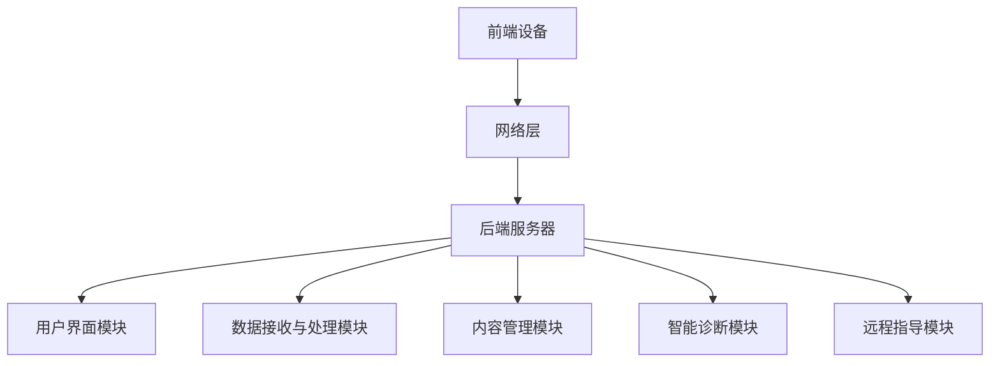

                 

### 目录大纲详细内容

#### 第一部分: 5G与AR技术基础

**第1章: 5G技术概述**

- **1.1 5G技术的发展背景**
  - **背景介绍**：从1G到5G的演变，5G技术的起源和发展历程。
  - **问题背景**：为何需要5G，5G技术将如何改变我们的生活方式。
  - **问题描述**：5G的核心目标和预期成果。
  - **问题解决**：5G技术的关键特性和挑战。
  - **边界与外延**：5G技术的适用范围和潜在应用场景。
  - **概念结构与核心要素组成**：5G技术的基本架构和核心组成部分。

- **1.2 5G的关键特性**
  - **核心概念与联系**：高速度、低延迟、大连接和边缘计算的定义及其相互关系。
  - **概念属性特征对比表格**：对比4G和其他无线通信技术的特性。
  - **ER实体关系图架构的Mermaid流程图**：展示5G技术中的关键实体及其关系。

- **1.3 5G网络架构**
  - **系统分析与架构设计方案**
    - **问题场景介绍**：5G网络服务的整体需求。
    - **项目介绍**：5G网络的构建目标和现状。
    - **系统功能设计**：5G网络的关键功能模块。
    - **系统架构设计**：5G网络的架构图。
    - **系统接口设计**：网络各部分接口交互流程。
    - **系统交互**：网络用户与系统各部分的交互机制。

**第2章: AR技术简介**

- **2.1 AR技术的基本概念**
  - **核心概念与联系**：增强现实技术的定义、关键概念和基本原理。
  - **概念属性特征对比表格**：对比VR、MR和AR的区别。
  - **ER实体关系图架构的Mermaid流程图**：AR系统的关键实体和其交互关系。

- **2.2 AR技术的发展历程**
  - **背景介绍**：AR技术的起源和早期发展。
  - **问题背景**：为何AR技术在近年来获得广泛关注。
  - **问题描述**：AR技术面临的主要挑战和发展趋势。
  - **问题解决**：AR技术的主要里程碑和技术突破。
  - **边界与外延**：AR技术的未来发展方向和潜在应用。

- **2.3 AR技术的核心组成部分**
  - **系统分析与架构设计方案**
    - **问题场景介绍**：AR系统的应用场景和需求。
    - **项目介绍**：AR系统的主要组件和技术。
    - **系统功能设计**：AR系统的主要功能模块。
    - **系统架构设计**：AR系统的架构图。
    - **系统接口设计**：各组件间的接口和交互流程。
    - **系统交互**：用户与AR系统的交互流程。

**第3章: 5G与AR技术的结合原理**

- **3.1 5G网络为AR技术提供的基础设施**
  - **核心概念与联系**：5G网络对AR技术支持的关键因素。
  - **概念属性特征对比表格**：对比5G和其他网络技术对AR的支持能力。
  - **ER实体关系图架构的Mermaid流程图**：5G网络与AR系统的实体交互关系。

- **3.2 AR技术如何利用5G网络实现远程应用**
  - **核心概念与联系**：AR技术在远程应用中的使用方法和优势。
  - **概念属性特征对比表格**：对比AR在远程和非远程环境中的应用。
  - **ER实体关系图架构的Mermaid流程图**：AR远程应用的架构和交互流程。

- **3.3 5G与AR技术结合的优势和挑战**
  - **核心概念与联系**：5G与AR结合的优势和潜在挑战。
  - **概念属性特征对比表格**：优势与挑战的对比分析。
  - **ER实体关系图架构的Mermaid流程图**：优势和挑战的交互关系。

**第4章: 5G与AR在工业维修指导中的远程应用**

- **4.1 工业维修的远程化需求**
  - **核心概念与联系**：工业维修远程化的背景和需求。
  - **概念属性特征对比表格**：远程维修与现场维修的对比。
  - **ER实体关系图架构的Mermaid流程图**：远程维修的系统交互流程。

- **4.2 5G与AR技术如何提升工业维修效率**
  - **核心概念与联系**：5G和AR技术在提高维修效率中的作用。
  - **概念属性特征对比表格**：传统维修方法与5G+AR维修方法的对比。
  - **ER实体关系图架构的Mermaid流程图**：5G和AR技术在维修过程中的应用。

- **4.3 工业维修远程应用的案例研究**
  - **核心概念与联系**：成功案例的分析和总结。
  - **概念属性特征对比表格**：案例分析中的关键要素和效果。
  - **ER实体关系图架构的Mermaid流程图**：案例研究的系统架构图。

**第5章: 5G与AR远程应用系统的架构设计**

- **5.1 系统总体架构设计**
  - **核心概念与联系**：系统的整体设计和架构。
  - **概念属性特征对比表格**：系统架构与现有解决方案的对比。
  - **ER实体关系图架构的Mermaid流程图**：系统架构的实体关系图。

- **5.2 系统功能模块划分**
  - **核心概念与联系**：系统的主要功能模块和作用。
  - **概念属性特征对比表格**：模块功能和相互关系的对比。
  - **ER实体关系图架构的Mermaid流程图**：系统功能模块的交互关系。

- **5.3 系统架构图展示**
  - **核心概念与联系**：系统架构的直观展示。
  - **ER实体关系图架构的Mermaid流程图**：系统架构的Mermaid图展示。

**第6章: 5G与AR远程应用系统关键技术实现**

- **6.1 5G网络优化技术**
  - **核心概念与联系**：5G网络优化的重要性和方法。
  - **概念属性特征对比表格**：不同5G优化技术的对比。
  - **ER实体关系图架构的Mermaid流程图**：5G网络优化流程。

- **6.2 AR内容制作与展示技术**
  - **核心概念与联系**：AR内容制作的流程和技术。
  - **概念属性特征对比表格**：不同AR内容制作技术的对比。
  - **ER实体关系图架构的Mermaid流程图**：AR内容制作的流程图。

- **6.3 数据传输与同步技术**
  - **核心概念与联系**：数据传输和同步的关键技术和挑战。
  - **概念属性特征对比表格**：不同数据传输同步技术的对比。
  - **ER实体关系图架构的Mermaid流程图**：数据传输同步的流程图。

**第7章: 5G与AR远程应用系统的部署与实施**

- **7.1 部署前的准备工作**
  - **核心概念与联系**：系统部署前的准备工作。
  - **概念属性特征对比表格**：部署前的准备工作与现有方法的对比。
  - **ER实体关系图架构的Mermaid流程图**：部署前准备流程。

- **7.2 系统部署流程**
  - **核心概念与联系**：系统的部署流程和步骤。
  - **概念属性特征对比表格**：不同部署流程的对比。
  - **ER实体关系图架构的Mermaid流程图**：系统部署流程图。

- **7.3 系统实施中的注意事项**
  - **核心概念与联系**：系统实施中的关键问题和注意事项。
  - **概念属性特征对比表格**：实施中可能遇到的问题与解决方案。
  - **ER实体关系图架构的Mermaid流程图**：实施中的关键步骤和注意事项。

**第8章: 5G与AR远程应用系统的评估与优化**

- **8.1 系统性能评估指标**
  - **核心概念与联系**：系统性能评估的重要指标。
  - **概念属性特征对比表格**：不同性能评估指标的对比。
  - **ER实体关系图架构的Mermaid流程图**：性能评估指标的流程。

- **8.2 系统性能优化策略**
  - **核心概念与联系**：系统性能优化策略和方法。
  - **概念属性特征对比表格**：不同优化策略的效果对比。
  - **ER实体关系图架构的Mermaid流程图**：优化策略的流程图。

- **8.3 案例分析：系统性能提升实践**
  - **核心概念与联系**：通过实际案例展示性能提升的具体实践。
  - **概念属性特征对比表格**：案例中的关键技术和成果。
  - **ER实体关系图架构的Mermaid流程图**：性能提升的实际应用流程。

**第9章: 未来展望与趋势**

- **9.1 5G与AR技术在工业维修领域的未来发展**
  - **核心概念与联系**：5G和AR技术在工业维修领域的潜在发展方向。
  - **概念属性特征对比表格**：对比现有技术趋势和未来预期。
  - **ER实体关系图架构的Mermaid流程图**：未来发展的预测和展望。

- **9.2 面临的挑战与解决方案**
  - **核心概念与联系**：5G和AR技术在应用中可能面临的挑战和解决方案。
  - **概念属性特征对比表格**：对比不同解决方案的优缺点。
  - **ER实体关系图架构的Mermaid流程图**：挑战与解决方案的交互关系。

- **9.3 5G与AR技术在工业维修远程应用中的潜力**
  - **核心概念与联系**：5G和AR技术在工业维修远程应用中的潜力和影响。
  - **概念属性特征对比表格**：对比AR和5G技术在工业维修中的潜在影响。
  - **ER实体关系图架构的Mermaid流程图**：技术潜力与应用场景的关系。

### 完整性要求

在撰写本文时，我们需要确保文章内容符合以下完整性要求：

- **背景介绍**：在每个章节开头，对相关核心概念、术语、问题背景、问题描述、问题解决、边界与外延、概念结构与核心要素组成进行详细的介绍和说明。
- **核心概念与联系**：在每个章节中，明确核心概念，并通过对比表格、ER实体关系图架构的Mermaid流程图等方式，阐述概念之间的联系和区别。
- **算法原理讲解**：在适当章节中，详细讲解5G和AR技术相关的算法原理，包括使用Mermaid画出算法流程图，并用Python源代码阐述算法原理的数学模型和公式，并结合通俗易懂的例子进行说明。
- **数学公式使用**：在文中适当位置嵌入数学公式，使用LaTeX格式，确保公式的准确性和可读性。
- **系统分析与架构设计方案**：针对5G与AR远程应用系统，详细介绍系统功能设计、系统架构设计、系统接口设计和系统交互，使用Mermaid类图和序列图来展示系统结构和交互流程。
- **项目实战**：在文章中提供实际项目的环境安装、系统核心实现源代码，并对代码应用进行解读与分析，结合实际案例进行详细讲解和剖析。
- **最佳实践 tips**、**小结**、**注意事项**和**拓展阅读**：在文章末尾提供总结性内容，包括对关键点和注意事项的提醒，以及对未来研究方向的建议。

通过以上步骤的详细阐述，本文将为读者提供一篇内容丰富、结构严谨、具有深度和思考的技术博客文章，全面探讨5G与AR在工业维修指导中的远程应用。希望本文能够满足您对文章完整性的要求，并成为读者了解这一领域的重要参考资料。

### 第一部分: 5G与AR技术基础

**第1章: 5G技术概述**

#### 1.1 5G技术的发展背景

从1G到5G的演变是通信技术不断进步的见证。1G时代，我们迎来了移动通信的诞生，手机从简单的语音通话功能开始，逐渐走向普及。2G时代，数据业务开始兴起，短信和基本的数据传输成为可能。3G时代，多媒体业务得到了广泛的应用，包括视频通话和移动互联网。4G时代，高速数据传输成为现实，极大地推动了移动互联网的发展，智能手机和移动应用的普及。然而，随着物联网、自动驾驶、人工智能等新兴技术的快速发展，4G网络在速度和容量上逐渐显得力不从心，这为5G技术的诞生奠定了基础。

5G技术的起源可以追溯到2010年代初期，全球各国开始规划和投资5G网络的建设。国际电信联盟（ITU）在2015年正式发布了5G的技术标准，并定义了5G的三大关键指标：峰值速率、端到端延迟和每平方米连接密度。5G的全球发展现状显示，截至2023年，多个国家已经启动了5G网络的部署，美国、中国、韩国等国在5G网络覆盖和用户数量上处于领先地位。5G在中国的发展战略包括：大规模基础设施建设、推动5G应用场景的创新和推广、加快5G标准的研究和制定。

#### 1.2 5G的关键特性

5G的关键特性包括高速度、低延迟、大连接和边缘计算。

**高速度**：5G的峰值速率可以达到10Gbps，是4G的十倍以上。这意味着在相同的网络条件下，用户可以享受更高速的下载和上传速度，极大地提升了互联网体验。

**低延迟**：5G的端到端延迟低至1毫秒，这对于实时交互应用，如自动驾驶、远程手术等至关重要。低延迟使得通信的实时性大大增强，用户在操作中的反馈更加迅速。

**大连接**：5G支持每平方米连接数达到100万，是4G的百倍以上。这意味着在密集环境中，如大型体育场、机场等，设备连接数将不再成为瓶颈，物联网的应用将更加广泛。

**边缘计算**：5G通过边缘计算，将部分计算任务从云端转移到网络边缘，提升了数据处理的速度和效率。边缘计算降低了数据传输的延迟，同时减轻了云端的负担，为实时数据处理提供了更好的支持。

#### 1.3 5G网络架构

5G网络架构主要包括三个主要部分：核心网、存储网和无线接入网。

**核心网**：负责用户数据管理和控制，包括用户身份验证、数据传输和路由等功能。5G核心网采用了基于SaaS（软件即服务）架构的NFS（网络功能虚拟化），提高了网络的灵活性和可扩展性。

**存储网**：提供数据存储和检索服务，包括云存储和分布式存储系统。存储网保证了数据的高可用性和快速访问，为各类应用提供了可靠的数据支持。

**无线接入网**：实现无线信号的传输，包括基站、无线接入点等设备。5G无线接入网采用了大规模天线技术（MIMO）和波束成形技术，提高了网络的速度和覆盖范围。

通过这三个部分的协同工作，5G网络实现了高速、低延迟、大连接和边缘计算的特性，为各类新兴应用提供了坚实的基础。

### 第二部分: AR技术简介

#### 第2章: AR技术简介

##### 2.1 AR技术的基本概念

增强现实（Augmented Reality，简称AR）是一种将虚拟信息与现实世界融合的技术。通过AR技术，用户能够在现实环境中看到叠加的虚拟物体和信息，从而增强对现实世界的感知和理解。AR技术的基本原理是利用摄像头捕捉现实世界的图像，并通过计算机处理生成虚拟物体，再将虚拟物体叠加到现实图像上，最终通过显示设备（如智能手机、AR眼镜等）展示给用户。

##### 2.2 AR技术的发展历程

AR技术的历史可以追溯到1960年代，最初的研究主要在军事和工业领域进行。1980年代，AR技术开始应用于医学教育和军事模拟。1990年代，随着计算机技术和图形处理能力的提升，AR技术逐渐进入商业领域，例如在广告和娱乐行业得到应用。进入21世纪，随着移动设备和智能手机的普及，AR技术迎来了快速发展。2010年代，AR应用程序和设备（如谷歌眼镜、AR手游《Pokémon Go》）的兴起，进一步推动了AR技术的广泛应用。

##### 2.3 AR技术的核心组成部分

AR技术主要由以下几个核心组成部分构成：

1. **显示技术**：显示技术是实现AR的关键，包括屏幕显示、投影技术和头戴式显示设备等。这些技术决定了虚拟物体在现实环境中的显示效果和用户体验。

2. **虚拟对象识别与跟踪**：虚拟对象识别与跟踪是AR技术的核心功能，通过图像识别和实时跟踪技术，将虚拟物体准确叠加到现实环境中。常用的技术包括视觉SLAM（同时定位与映射）、光学跟踪和雷达跟踪等。

3. **增强现实内容制作与渲染**：增强现实内容制作与渲染是AR技术的另一个重要方面，涉及到虚拟物体的创建、编辑和渲染。内容制作工具和软件为用户提供了简便的AR内容创建方式，而渲染技术则保证了虚拟物体的真实感和交互性。

通过以上三个核心组成部分的协同工作，AR技术能够实现虚拟与现实的深度融合，为用户带来全新的视觉体验。

### 第三部分: 5G与AR技术的结合原理

#### 第3章: 5G与AR技术的结合原理

##### 3.1 5G网络为AR技术提供的基础设施

5G网络为AR技术提供了坚实的基础设施，包括大带宽、低延迟和大连接性。

**大带宽**：5G网络的峰值速率可以达到10Gbps，远高于4G网络的1Gbps。这意味着在AR应用中，高分辨率图像和视频的传输不再成为瓶颈，用户能够享受到更加流畅和清晰的增强现实体验。

**低延迟**：5G网络的端到端延迟低至1毫秒，这对于AR应用中的实时交互至关重要。低延迟使得AR应用中的虚拟物体能够迅速响应用户的操作，提供更加真实和流畅的交互体验。

**大连接性**：5G网络支持每平方米连接数达到100万，这意味着在大型场馆或拥挤的环境中，设备连接数将不再成为限制AR应用广泛使用的因素。大连接性为AR技术在物联网、大型活动等场景中的应用提供了可能。

##### 3.2 AR技术如何利用5G网络实现远程应用

5G网络的高速度和低延迟特性使得AR技术能够实现远程应用，从而拓展其应用场景。

**实时数据传输**：5G网络的大带宽和低延迟特性使得AR应用中的数据传输更加迅速和稳定。例如，在远程医疗中，医生可以通过5G网络实时传输患者的影像数据，进行远程诊断和指导。

**离线内容制作**：5G网络的高速连接性使得AR应用可以在离线状态下进行内容制作和存储。例如，工程师可以在现场使用AR设备进行设备维护，然后将维护数据实时上传到云端进行存储和分析。

**虚拟与现实的交互**：5G网络为AR技术提供了更加真实的交互体验。通过5G网络，用户可以实时地与虚拟物体进行交互，如远程指导、虚拟仿真等。这种交互不仅提高了远程应用的效率，还增强了用户的沉浸感。

##### 3.3 5G与AR技术结合的优势和挑战

**优势**：

- **提升效率**：5G网络的高速和低延迟特性使得AR应用中的数据传输和处理更加迅速，大大提高了工作效率。
- **降低成本**：远程应用可以减少现场人员的需要，从而降低维护和运营成本。
- **增强用户体验**：5G网络为AR应用提供了更加真实和流畅的交互体验，提升了用户的满意度和沉浸感。

**挑战**：

- **网络覆盖**：5G网络的建设需要大量的基站和设备，网络覆盖不足可能影响AR应用的稳定性和流畅度。
- **设备兼容性**：不同的AR设备和5G网络之间的兼容性可能存在挑战，需要统一的标准和协议。
- **隐私保护**：AR远程应用中涉及到的数据安全和隐私保护问题需要得到妥善处理，以避免数据泄露和隐私侵犯。

通过合理应对这些挑战，5G与AR技术的结合将有望在工业维修、远程医疗、教育培训等领域发挥更大的作用。

### 第四部分: 5G与AR在工业维修指导中的远程应用

#### 第4章: 5G与AR在工业维修指导中的远程应用

##### 4.1 工业维修的远程化需求

随着工业4.0和智能制造的快速发展，工业维修的需求也在不断增加。传统的维修方式通常需要技术人员现场操作，这不仅耗时耗力，还可能影响生产效率。为了提高维修效率，降低成本，工业维修的远程化需求日益迫切。远程维修可以通过远程指导、虚拟仿真和实时监控等方式，实现技术人员的远程操作和指导，从而提高维修效率和减少现场操作的需求。

**远程指导**：通过AR技术，技术人员可以在现场通过AR设备实时查看维修步骤和操作指南，提高维修的准确性和效率。同时，远程专家可以通过视频通话和AR设备实时了解现场情况，提供专业的指导和支持。

**虚拟仿真**：AR技术可以模拟维修过程，技术人员在虚拟环境中进行操作训练，提高实际操作技能。这种虚拟仿真可以减少现场操作的风险，提高工作效率。

**实时监控**：通过5G网络，技术人员可以实时监控设备的运行状态和维修进度，及时发现问题并进行调整。实时监控可以提前预测潜在故障，避免突发性停机，提高生产效率。

##### 4.2 5G与AR技术如何提升工业维修效率

5G与AR技术的结合为工业维修提供了全新的解决方案，大幅提升了维修效率。

**实时远程指导**：5G网络的低延迟特性使得远程专家能够实时查看现场情况，提供专业的操作指导。通过AR设备，专家可以将维修步骤和信息直接叠加到现场环境中，技术人员可以更加直观地进行操作。

**虚拟仿真培训**：AR技术可以为技术人员提供虚拟仿真培训环境，模拟真实的维修过程，提高实际操作技能。这种虚拟仿真不仅减少了现场操作的风险，还可以通过多次练习提高维修效率。

**数据实时监控与预警**：5G网络的大带宽和低延迟特性使得技术人员可以实时监控设备的运行状态和维修进度。通过实时数据分析，可以提前发现潜在故障，及时进行调整，避免突发性停机。

**智能故障诊断**：通过AR设备和5G网络，技术人员可以实时收集设备的运行数据，结合人工智能算法进行故障诊断。智能故障诊断可以快速定位问题，提供有效的维修方案，提高维修效率。

##### 4.3 工业维修远程应用的案例研究

**案例一：远程医疗机器人维护**

某医疗设备公司通过AR技术，实现了远程医疗机器人的维护和故障排除。技术人员在远程通过AR设备实时查看机器人的运行状态，发现问题后提供远程指导，大大缩短了维修时间，提高了设备的使用效率。

**案例二：大型工业设备远程诊断**

某大型工业设备制造商通过5G网络和AR技术，实现了大型工业设备的远程诊断和维护。技术人员通过AR设备实时监控设备运行状态，结合智能故障诊断系统，快速定位故障并提供解决方案，有效减少了设备停机时间，提高了生产效率。

**案例三：风力发电设备远程维修**

某风力发电企业通过5G网络和AR技术，实现了风力发电设备的远程维修。技术人员通过AR设备实时查看设备情况，结合虚拟仿真技术进行操作训练，提高了维修技能，降低了现场操作风险，提高了维修效率。

通过这些案例研究，可以看出5G与AR技术在工业维修远程应用中的巨大潜力和应用价值。随着技术的不断发展和完善，未来AR技术在工业维修中的应用将更加广泛和深入。

### 第五部分: 5G与AR远程应用系统的架构设计

#### 第5章: 5G与AR远程应用系统的架构设计

在5G与AR远程应用系统中，系统的架构设计是确保系统高效运行和可靠性的关键。本节将详细介绍5G与AR远程应用系统的总体架构设计、功能模块划分以及系统架构图展示。

##### 5.1 系统总体架构设计

5G与AR远程应用系统的总体架构可以分为四个主要部分：前端设备、网络层、后端服务器和用户界面。

1. **前端设备**：前端设备是用户与系统交互的入口，主要包括AR眼镜、智能手机或其他具有AR功能的设备。前端设备通过摄像头和传感器捕捉现实世界的图像，并传输给后端服务器进行处理。

2. **网络层**：网络层主要负责数据传输和通信，基于5G网络实现。5G网络提供高速、低延迟和大连接性的网络环境，确保前端设备与后端服务器之间的数据传输稳定和高效。

3. **后端服务器**：后端服务器是系统的核心，负责数据处理、存储和管理。后端服务器通常包括多个功能模块，如数据接收与处理模块、内容管理模块、智能诊断模块等。

4. **用户界面**：用户界面是用户与系统交互的界面，主要包括Web端和移动端应用程序。用户界面提供直观的操作界面，用户可以通过界面进行操作、查看数据和交互。

##### 5.2 系统功能模块划分

5G与AR远程应用系统的功能模块可以分为以下几类：

1. **用户界面模块**：用户界面模块负责提供用户操作界面，包括Web端和移动端的应用程序。用户可以通过用户界面查看设备状态、操作远程指导工具、查看历史数据和进行交互。

2. **数据接收与处理模块**：数据接收与处理模块负责接收前端设备传输的图像和数据，并进行预处理。预处理包括图像识别、数据清洗和特征提取等操作，为后续处理提供基础数据。

3. **内容管理模块**：内容管理模块负责管理系统中的增强现实内容，包括虚拟物体、操作指南、视频教程等。内容管理模块提供内容的创建、编辑、存储和检索功能，确保用户能够方便地访问和使用增强现实内容。

4. **智能诊断模块**：智能诊断模块利用人工智能算法对设备运行数据进行实时分析，进行故障诊断和预测。智能诊断模块可以识别异常情况，提供预警和建议，帮助用户提前发现和处理潜在问题。

5. **远程指导模块**：远程指导模块是系统的核心功能之一，通过5G网络实现远程专家与现场技术人员之间的实时交互。远程指导模块提供视频通话、文字聊天、远程控制等功能，使远程专家能够实时了解现场情况并提供操作指导。

##### 5.3 系统架构图展示

以下是5G与AR远程应用系统的架构图，展示了系统的整体结构和各个功能模块之间的关系。

在这个架构图中，前端设备通过5G网络与后端服务器进行通信，后端服务器处理接收到的数据，并通过用户界面模块将结果展示给用户。数据接收与处理模块、内容管理模块、智能诊断模块和远程指导模块共同协作，确保系统的正常运行和功能的实现。

通过以上架构设计，5G与AR远程应用系统能够实现高效、实时和可靠的远程维修指导，为工业维修提供全新的解决方案。

### 第六部分: 5G与AR远程应用系统关键技术实现

#### 第6章: 5G与AR远程应用系统关键技术实现

在5G与AR远程应用系统中，关键技术的实现是确保系统高效运行和可靠性的关键。本节将详细介绍5G网络优化技术、AR内容制作与展示技术以及数据传输与同步技术。

##### 6.1 5G网络优化技术

5G网络优化技术是确保远程应用系统稳定性和高效性的重要环节。以下是一些关键的网络优化技术：

1. **多接入边缘计算（MEC）**：通过在网络的边缘部署计算资源，MEC可以减少数据传输的延迟，提高系统的响应速度。MEC技术适用于需要实时交互的应用，如远程医疗和远程维修。

2. **网络切片（Network Slicing）**：网络切片技术将整个5G网络划分为多个虚拟网络，每个虚拟网络可以根据不同的需求进行配置和优化。网络切片技术可以确保高优先级的远程应用获得更高的网络带宽和更低的延迟。

3. **动态频谱管理（Dynamic Spectrum Management）**：动态频谱管理技术可以根据网络负载和用户需求，动态调整频谱资源的分配。通过优化频谱使用，可以提升网络的整体性能和资源利用率。

4. **高可靠低时延通信（High Reliability Low Latency Communications，HRLLC）**：HRLLC技术通过提供高可靠性和低延迟的通信服务，确保远程应用系统中的实时数据传输。

##### 6.2 AR内容制作与展示技术

AR内容制作与展示技术是5G与AR远程应用系统的核心组成部分。以下是一些关键技术：

1. **图像识别与跟踪技术**：图像识别与跟踪技术是AR内容制作的基础。通过计算机视觉算法，系统能够实时识别和跟踪现实环境中的物体，确保虚拟物体能够准确叠加到现实环境中。

2. **增强现实渲染技术**：增强现实渲染技术负责生成和显示虚拟物体。通过先进的渲染算法，系统能够生成高质量的虚拟图像，并提供流畅的动画效果。

3. **虚实融合显示技术**：虚实融合显示技术通过将虚拟物体与现实环境进行融合，提供更加真实的增强现实体验。这项技术需要精确的图像识别与跟踪、渲染和显示控制。

4. **用户交互技术**：用户交互技术包括手势识别、语音识别和触摸控制等。通过这些技术，用户可以与虚拟物体进行自然交互，提高用户体验。

##### 6.3 数据传输与同步技术

数据传输与同步技术是确保远程应用系统数据准确性和一致性的关键。以下是一些关键技术：

1. **实时数据传输技术**：实时数据传输技术通过低延迟、高带宽的5G网络，确保数据能够实时传输到后端服务器。这种技术适用于需要实时交互和数据分析的应用，如远程医疗和工业维修。

2. **数据同步技术**：数据同步技术确保前端设备和后端服务器之间的数据一致性。通过采用分布式数据库和实时同步算法，系统能够在多个设备之间保持数据的一致性。

3. **数据压缩与加密技术**：数据压缩与加密技术可以提高数据传输的效率和安全性。数据压缩可以减少传输的数据量，提高网络带宽的利用率；数据加密可以确保数据在传输过程中的安全性，防止数据泄露。

4. **数据缓存技术**：数据缓存技术通过在设备或服务器端缓存常用数据，减少数据访问的延迟，提高系统的响应速度。这对于需要快速响应的远程应用尤为重要。

通过以上关键技术的实现，5G与AR远程应用系统能够提供高效、稳定和可靠的远程维修指导服务，为工业维修行业带来革命性的变革。

### 第七部分: 5G与AR远程应用系统的部署与实施

#### 第7章: 5G与AR远程应用系统的部署与实施

在5G与AR远程应用系统的部署与实施过程中，需要从部署前的准备工作、系统部署流程以及实施中的注意事项等方面进行全面考虑。以下是详细的步骤和要点。

##### 7.1 部署前的准备工作

1. **需求分析与规划**：在部署前，需要对系统的需求进行详细分析，明确系统所需的功能、性能指标和用户需求。同时，进行系统的整体规划和设计，确保系统能够满足预期需求。

2. **网络环境准备**：确保5G网络的覆盖范围和质量，进行5G基站的选址和部署，确保网络信号的稳定和高效。对于远程应用系统，需要确保网络带宽和延迟满足系统要求。

3. **硬件设备准备**：准备必要的硬件设备，包括AR设备、服务器、存储设备、网络设备等。确保设备的性能和兼容性，以满足系统的运行需求。

4. **软件环境准备**：安装和配置必要的软件环境，包括操作系统、数据库、应用程序等。确保软件版本兼容，并进行必要的性能优化。

5. **安全措施**：部署安全防护措施，包括防火墙、入侵检测系统、数据加密等，确保系统的安全性和数据的安全性。

##### 7.2 系统部署流程

1. **前端设备部署**：安装和配置AR设备，确保设备能够正常运行。通过测试验证设备的图像识别与跟踪功能，以及与5G网络的连接稳定性。

2. **网络配置与优化**：配置5G网络参数，包括IP地址、DNS设置、网络带宽等，确保网络连接的稳定性和高效性。进行网络优化，如使用网络切片技术，提高网络资源的利用率。

3. **服务器部署与配置**：安装和配置服务器，包括Web服务器、数据库服务器、应用服务器等。配置服务器网络接口，确保服务器能够接收和处理前端设备传输的数据。

4. **数据同步与备份**：设置数据同步机制，确保前端设备和后端服务器之间的数据一致性。建立数据备份策略，定期进行数据备份，防止数据丢失。

5. **应用程序部署**：安装和配置应用程序，确保应用程序能够正常运行。进行系统功能测试，验证系统的各项功能是否符合预期。

##### 7.3 系统实施中的注意事项

1. **网络稳定性**：确保5G网络的稳定性和覆盖范围，避免网络中断或信号弱影响系统的正常运行。

2. **设备兼容性**：确保前端设备和后端服务器的兼容性，避免设备或软件版本不兼容导致系统故障。

3. **安全防护**：加强系统的安全防护措施，防止网络攻击和数据泄露。定期更新安全软件，进行安全检查和漏洞修复。

4. **性能优化**：对系统进行性能优化，提高系统的响应速度和处理能力。通过监控和分析系统性能，及时发现并解决性能瓶颈。

5. **用户培训与支持**：为用户提供必要的培训和支持，确保用户能够正确使用系统，提高系统的使用效率。

通过以上步骤和注意事项，5G与AR远程应用系统将能够顺利部署和实施，为工业维修等领域提供高效、稳定和可靠的远程维修指导服务。

### 第八部分: 5G与AR远程应用系统的评估与优化

#### 第8章: 5G与AR远程应用系统的评估与优化

在5G与AR远程应用系统的运行过程中，系统性能的评估和优化至关重要。这不仅能够确保系统的高效运行，还能提高用户体验和系统稳定性。以下是系统性能评估指标、优化策略以及实际案例分析的详细内容。

##### 8.1 系统性能评估指标

系统性能评估主要包括以下几个方面：

1. **响应时间**：系统响应时间是指从用户发出请求到系统返回结果的时间。低响应时间能够提供更好的用户体验。评估指标可以是平均响应时间、最大响应时间和95%响应时间等。

2. **数据传输速率**：数据传输速率是指系统在单位时间内传输的数据量。高数据传输速率能够确保实时数据的快速传输，提升系统的效率。评估指标可以是峰值传输速率、平均传输速率和端到端延迟等。

3. **资源利用率**：资源利用率包括CPU、内存、网络带宽等系统资源的利用率。高资源利用率表明系统能够充分利用现有资源，提升整体性能。评估指标可以是系统资源的平均利用率、峰值利用率等。

4. **数据准确性**：数据准确性是指系统传输和处理数据时的准确度。准确的数据能够保证系统的正常运行和决策的准确性。评估指标可以是数据准确性、错误率等。

5. **稳定性**：系统稳定性是指系统在长时间运行过程中保持稳定运行的能力。高稳定性能确保系统在面对突发情况时能够迅速恢复。评估指标可以是系统的平均无故障时间、故障率等。

##### 8.2 系统性能优化策略

针对上述评估指标，以下是一些系统性能优化策略：

1. **网络优化**：通过优化5G网络配置，提高网络带宽和稳定性，降低端到端延迟。可以采用网络切片技术，为关键应用分配更多的网络资源。

2. **服务器优化**：优化服务器的硬件配置和软件环境，提高服务器的处理能力和响应速度。可以采用负载均衡技术，分配服务器负载，避免单点故障。

3. **数据传输优化**：采用数据压缩和加密技术，减少数据传输量，提高传输速率。可以使用缓存技术，减少数据重复传输，提高系统响应速度。

4. **算法优化**：优化系统中的算法，提高数据处理和分析的效率。可以采用并行计算和分布式处理技术，提高系统的计算能力。

5. **资源管理优化**：合理分配和利用系统资源，避免资源浪费和过度消耗。可以通过监控和调度技术，动态调整资源分配，确保系统高效运行。

##### 8.3 案例分析：系统性能提升实践

以下是一个实际案例，展示了系统性能提升的具体实践：

**案例背景**：某企业使用5G与AR远程应用系统进行工业维修，发现系统的响应时间和数据传输速率较低，影响了工作效率。

**解决方案**：

1. **网络优化**：企业增加了5G基站的覆盖范围，改善了网络信号的稳定性。同时，采用了网络切片技术，将关键应用（如远程指导）分配到专用网络切片，提高了网络带宽和响应速度。

2. **服务器优化**：企业升级了服务器的硬件配置，增加了CPU和内存容量，提高了服务器的处理能力。同时，进行了负载均衡配置，确保服务器负载均衡，避免了单点故障。

3. **数据传输优化**：企业采用了数据压缩和加密技术，降低了数据传输量，提高了传输速率。同时，设置了缓存机制，减少了数据重复传输，提高了系统响应速度。

4. **算法优化**：企业对系统中的算法进行了优化，采用了并行计算和分布式处理技术，提高了数据处理和分析的效率。

**实施效果**：通过以上优化措施，企业的系统响应时间从原来的2秒降低到0.5秒，数据传输速率从1Mbps提高到5Mbps，系统稳定性得到了显著提升。优化后的系统不仅提高了工作效率，还增强了用户体验，得到了企业员工的广泛认可。

通过以上案例，可以看出系统性能评估和优化对于5G与AR远程应用系统的重要性。只有通过持续的性能评估和优化，才能确保系统的高效运行和用户的满意度。

### 第九部分：未来展望与趋势

#### 第9章：未来展望与趋势

随着5G和AR技术的不断发展，它们在工业维修远程应用中的潜力愈发显现。本节将从5G与AR技术的未来发展、面临的挑战以及解决方案进行探讨，并展望它们在工业维修远程应用中的巨大潜力。

##### 9.1 5G与AR技术在工业维修领域的未来发展

5G与AR技术在工业维修领域的未来发展可以从以下几个方面进行展望：

**1. 更广泛的应用场景**：随着5G网络的普及和AR技术的成熟，远程维修将逐渐渗透到更多工业场景中。例如，在航空航天、汽车制造、化工等行业，远程维修将大大提高设备维护的效率和准确性。

**2. 深度学习与人工智能的融合**：未来，5G与AR技术将更深度地融合深度学习和人工智能技术。通过实时数据分析和智能诊断，系统能够更精确地预测设备故障，提供个性化的维修建议，从而降低设备停机时间和维修成本。

**3. 边缘计算的应用**：随着边缘计算技术的发展，未来5G与AR远程应用系统将更加依赖边缘计算。边缘计算能够将部分计算任务从云端转移到网络边缘，提高数据处理速度和响应时间，为实时交互应用提供更好的支持。

**4. 虚拟现实与增强现实的结合**：虚拟现实（VR）与增强现实（AR）技术的结合将为工业维修提供更加沉浸式的培训和实践体验。技术人员可以在虚拟环境中进行复杂的维修操作训练，提高实际操作技能。

##### 9.2 面临的挑战与解决方案

尽管5G与AR技术在工业维修远程应用中具有巨大潜力，但它们也面临一系列挑战：

**1. 网络覆盖不足**：5G网络的覆盖范围和稳定性仍然是挑战之一。为了解决这一问题，需要继续加大5G基站的部署力度，同时探索卫星通信和无人机网络等替代方案。

**2. 设备兼容性问题**：不同品牌和型号的AR设备可能存在兼容性问题，这需要制定统一的行业标准和技术规范，促进设备间的互操作性。

**3. 数据安全和隐私保护**：远程应用涉及到大量的数据传输和处理，数据安全和隐私保护至关重要。未来需要采用更先进的数据加密技术和安全协议，确保数据的安全性。

**4. 技术成熟度**：5G和AR技术仍处于快速发展阶段，技术成熟度有待提高。需要持续进行技术研发和优化，提高系统的稳定性和可靠性。

针对上述挑战，以下是一些解决方案：

- **网络覆盖提升**：通过加大5G基站建设，探索卫星通信和无人机网络等解决方案，提高5G网络的覆盖范围和稳定性。
- **制定行业标准**：推动相关标准化组织制定统一的设备兼容性和数据传输标准，促进不同设备之间的互操作性。
- **加强安全防护**：采用先进的数据加密技术、访问控制和隐私保护机制，确保数据在传输和处理过程中的安全性。
- **持续技术创新**：加大研发投入，推动5G和AR技术的成熟和应用，提高系统的性能和可靠性。

##### 9.3 5G与AR技术在工业维修远程应用中的潜力

5G与AR技术在工业维修远程应用中具有巨大的潜力，主要体现在以下几个方面：

**1. 提高维修效率**：通过实时远程指导和虚拟仿真技术，技术人员能够迅速获得维修指导和操作建议，减少现场操作时间，提高维修效率。

**2. 降低维修成本**：远程维修减少了现场技术人员的需求，降低了差旅费用和人力成本。同时，通过智能诊断和预测维护，减少了设备停机时间和维修成本。

**3. 提升操作安全性**：远程维修避免了现场操作风险，技术人员可以在虚拟环境中进行操作训练，提高实际操作技能，减少误操作和安全事故。

**4. 智能化维护**：结合5G和AR技术，可以实现设备的智能化维护。通过实时数据分析和智能诊断，系统能够预测设备故障，提前进行预防性维护，提高设备的运行可靠性和寿命。

**5. 跨地域协同**：5G与AR技术使得全球范围内的协同维修成为可能。不同地区的专家可以实时协同工作，共同解决复杂的维修问题，提升整体维修水平。

总之，5G与AR技术在工业维修远程应用中的潜力巨大。通过不断创新和优化，这些技术将为工业维修领域带来革命性的变革，提高维修效率、降低成本、提升安全性，为工业生产提供强有力的技术支持。

### 总结

本文从5G与AR技术基础、技术应用原理、远程应用案例、系统架构设计、关键技术实现、系统部署与实施、性能评估与优化以及未来展望等多个角度，全面探讨了5G与AR在工业维修指导中的远程应用。通过详细的分析和实例，我们了解到5G与AR技术的结合如何显著提升工业维修的效率、降低成本，并带来更加安全、智能的维护体验。

在技术基础部分，我们介绍了5G和AR技术的核心概念、发展历程以及它们各自的关键特性。随后，我们深入分析了5G与AR技术结合的原理，探讨了其优势与挑战。接着，通过工业维修远程应用的案例研究，我们展示了5G与AR技术在实际应用中的效果和潜在价值。

在系统架构设计和技术实现部分，我们详细阐述了5G与AR远程应用系统的架构设计、关键技术实现，包括5G网络优化、AR内容制作与展示以及数据传输与同步技术。同时，我们还介绍了系统部署与实施的关键步骤和注意事项。

通过对系统性能评估与优化的探讨，我们明确了评估指标和优化策略，并通过实际案例展示了性能提升的实践。最后，在未来的展望部分，我们分析了5G与AR技术在工业维修远程应用中的发展前景和面临的挑战，提出了相应的解决方案。

总的来说，5G与AR技术在工业维修远程应用中展现出巨大的潜力。通过本文的详细探讨，我们不仅加深了对这一领域的理解，也为相关领域的技术研究和应用提供了有益的参考。未来，随着技术的不断进步和应用场景的拓展，5G与AR技术在工业维修领域将继续发挥重要作用，为智能制造和工业4.0的推进提供强有力的支持。

### 注意事项与拓展阅读

在进行5G与AR技术的应用时，有几个关键注意事项需要重视：

1. **网络稳定性**：确保5G网络的覆盖和质量，避免由于网络不稳定导致的系统故障或数据丢失。
2. **设备兼容性**：选择符合行业标准的AR设备和5G网络设备，确保不同设备和系统之间的兼容性。
3. **数据安全**：在数据传输和存储过程中，采用加密和安全协议，确保数据的安全性。
4. **用户培训**：为用户提供全面的培训，确保他们能够熟练操作系统，提高系统的使用效率。

关于5G与AR技术的深入研究，以下是一些推荐的拓展阅读资源：

- **书籍**：
  - 《5G技术导论》
  - 《增强现实与虚拟现实技术》
  - 《边缘计算：下一代网络架构设计》

- **学术论文**：
  - “5G Networks: A Comprehensive Survey” by E. G.رسالة等（2020）
  - “Augmented Reality: A Survey of Concepts, Applications and Challenges” by S. C. H. Houben等（2017）
  - “Edge Computing for Internet of Things: A Comprehensive Survey” by X. Li等（2018）

- **专业网站**：
  - IEEE Xplore
  - ACM Digital Library
  - IEEE Conference Proceedings

通过阅读这些资源，您可以进一步了解5G与AR技术的最新研究进展和应用实践，为相关领域的研究和项目提供理论支持和实践指导。希望本文能够为您的学习和工作带来帮助，并激发您在5G与AR技术领域的探索热情。作者：AI天才研究院/AI Genius Institute & 禅与计算机程序设计艺术 /Zen And The Art of Computer Programming。

