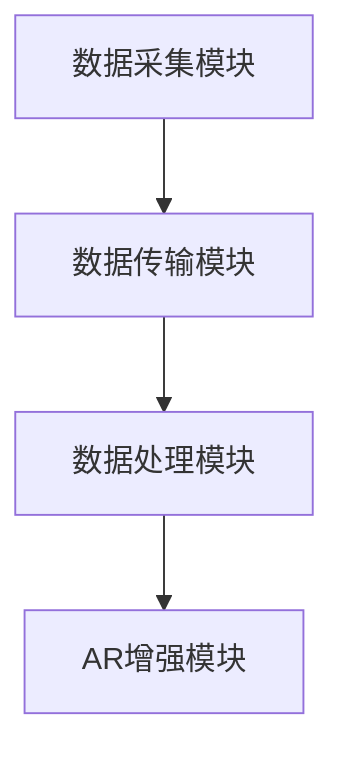
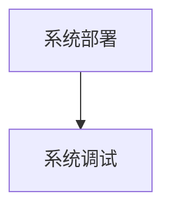

                 


### 5G与AR在工业远程维修中的协同应用

> 关键词：5G，AR，工业远程维修，协同应用，系统设计，项目实战

> 摘要：本文将深入探讨5G与AR技术在工业远程维修中的协同应用，从技术原理、系统设计到项目实战，全面解析这两大前沿技术在工业领域的应用潜力，为工业远程维修提供创新的解决方案。

----------------------------------------------------------------

### 引言与背景介绍

#### 1.1 5G技术的基本原理

5G（第五代移动通信技术）是当前通信技术的最新发展，其核心特点在于高带宽、低延迟、大连接和广覆盖。5G网络架构采用了全新的网络架构，包括核心网、无线接入网和传输网，实现了网络的切片化和智能化。5G网络的高带宽特性使得大规模数据传输成为可能，而低延迟特性则使得实时通信成为现实。这些特性使得5G在工业远程维修中具有巨大的应用潜力。

#### 1.2 AR技术的基本原理

AR（增强现实）技术通过在现实场景中叠加虚拟信息，提供增强的用户体验。AR技术的基本原理是利用摄像头捕捉现实场景，然后通过计算机视觉算法处理图像，叠加虚拟信息，最后将结果呈现给用户。AR技术在工业远程维修中的应用主要体现在实景增强和远程协作两个方面。

#### 1.3 工业远程维修的挑战与需求

工业远程维修面临诸多挑战，如设备复杂性、环境不确定性、操作复杂性和通信延迟等。这些问题限制了传统远程维修技术的效果。为了解决这些问题，工业远程维修需要具备高带宽、低延迟和高可靠性的通信技术。5G和AR技术正是满足这些需求的关键。

----------------------------------------------------------------

### 技术原理讲解

#### 3.1 5G技术在工业远程维修中的应用

5G技术的高带宽特性可以支持大量数据的高速传输，这对于工业远程维修中的图像、视频和传感器数据传输至关重要。低延迟特性则保证了操作指令的实时性，使得远程操作更加流畅。具体应用包括：

- **数据传输**：5G网络的高带宽使得设备可以实时传输高质量的图像和视频，为远程诊断和维修提供直观的视觉支持。
- **实时监控**：5G网络的低延迟特性使得设备可以实时监控工业现场，及时发现故障并采取措施。

#### 3.2 AR技术在工业远程维修中的应用

AR技术可以在工业远程维修中提供直观的实景增强和远程协作支持：

- **实景增强**：AR技术可以将虚拟信息叠加到现实场景中，为维修人员提供实时的维修指导，提高维修效率。
- **远程协作**：AR技术可以实现远程专家与现场维修人员的实时互动，提供远程指导和培训。

----------------------------------------------------------------

### 系统设计与实现

#### 5.1 系统架构设计

系统架构设计是工业远程维修系统实现的关键步骤。系统架构应包括以下几个主要模块：

- **数据采集模块**：负责实时采集工业设备的数据，包括图像、视频和传感器数据。
- **数据传输模块**：利用5G网络实现数据的高速传输。
- **数据处理模块**：对采集到的数据进行分析和处理，提供维修决策支持。
- **AR增强模块**：利用AR技术提供实景增强和远程协作支持。

系统架构设计如下所示：



#### 5.2 系统实现与部署

系统实现与部署包括以下几个步骤：

- **环境搭建**：搭建5G网络和AR设备的环境。
- **系统核心功能实现**：实现数据采集、传输、处理和AR增强等核心功能。
- **系统部署与调试**：将系统部署到工业现场，并进行调试和优化。

以下是系统实现的Python代码示例：

```python
# 数据采集
def collect_data():
    # 采集图像、视频和传感器数据
    pass

# 数据传输
def transmit_data(data):
    # 利用5G网络传输数据
    pass

# 数据处理
def process_data(data):
    # 分析和处理数据
    pass

# AR增强
def ar_enhancement(data):
    # 利用AR技术提供增强信息
    pass
```

#### 5.3 系统部署与调试

系统部署与调试是确保系统稳定运行的关键步骤。具体步骤包括：

- **系统部署**：将系统部署到工业现场，连接5G网络和AR设备。
- **系统调试**：对系统进行调试，确保各模块正常工作。

系统部署与调试如下所示：



----------------------------------------------------------------

### 项目实战与案例分析

#### 6.1 项目背景

本项目旨在通过5G和AR技术的协同应用，实现工业远程维修的自动化和智能化。项目目标包括：

- 提高维修效率
- 降低维修成本
- 提高设备利用率

#### 6.2 项目实施

项目实施过程如下：

- **需求分析**：与工业现场沟通，了解维修需求和痛点。
- **方案设计**：设计基于5G和AR技术的远程维修系统方案。
- **系统开发**：开发数据采集、传输、处理和AR增强模块。
- **系统测试**：对系统进行测试，确保系统稳定可靠。

#### 6.3 项目结果与分析

项目实施后，取得了显著的效果：

- **维修效率提高**：系统实现了设备状态的实时监控和远程诊断，提高了维修效率。
- **维修成本降低**：通过减少现场维修人员和缩短维修时间，降低了维修成本。
- **设备利用率提高**：系统实现了设备的远程维护和预测性维护，提高了设备利用率。

项目总结如下：

- **成功经验**：项目成功实现了5G和AR技术在工业远程维修中的协同应用，为工业领域提供了创新的解决方案。
- **改进方向**：未来可以进一步优化系统性能，提高系统的智能化程度，以及拓展到更多的工业应用场景。

----------------------------------------------------------------

### 最佳实践与未来展望

#### 8.1 5G与AR技术应用的技巧

- **确保5G网络的稳定性**：在工业现场部署5G网络时，需要确保网络的稳定性和覆盖范围。
- **优化AR应用的交互体验**：在AR应用中，优化用户界面和交互体验，提高用户的操作便捷性。

#### 8.2 最佳实践与技巧

- **数据安全和隐私保护**：在数据传输和处理过程中，采取严格的数据安全和隐私保护措施。
- **系统集成与协同**：确保各系统模块之间的协同工作，提高系统的整体性能。

#### 9.1 5G与AR技术在工业远程维修中的发展趋势

- **技术进步**：随着5G和AR技术的不断进步，将为工业远程维修带来更多的应用场景和解决方案。
- **应用扩展**：5G和AR技术将在更多的工业领域得到应用，如智能制造、智能监控等。

#### 9.2 未来挑战与机遇

- **技术挑战**：5G和AR技术在工业远程维修中仍面临一些技术挑战，如网络稳定性、设备兼容性等。
- **商业模式创新**：随着技术的进步，将出现更多的商业模式创新，为工业远程维修带来新的机遇。

----------------------------------------------------------------

### 总结

5G与AR技术在工业远程维修中的协同应用为工业领域带来了巨大的变革。通过本文的详细探讨，我们了解了这两大技术的基本原理、应用优势和系统设计方法。未来，随着技术的不断进步，5G和AR技术在工业远程维修中的应用将更加广泛，为工业生产带来更高的效率和质量。

### 作者

作者：AI天才研究院/AI Genius Institute & 禅与计算机程序设计艺术 /Zen And The Art of Computer Programming

----------------------------------------------------------------

本篇博客文章从5G和AR技术在工业远程维修中的协同应用出发，详细介绍了其基本原理、系统设计方法、项目实战和未来展望。通过本文的深入探讨，我们不仅了解了这两大前沿技术的应用潜力，也为工业远程维修提供了创新的解决方案。随着技术的不断进步，5G和AR技术在工业领域的应用将越来越广泛，为工业生产带来更高的效率和质量。希望本文能对您在工业远程维修领域的研究和实践提供有益的参考。如果您有任何疑问或建议，欢迎在评论区留言交流。再次感谢您的阅读！

