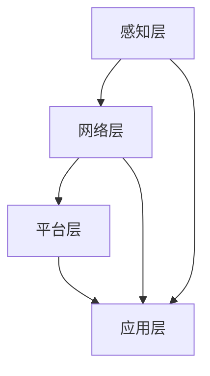
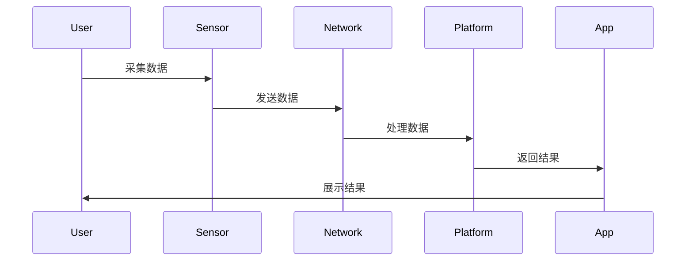

                 

### 5G与物联网在智慧城市基础设施中的应用

#### 关键词：5G，物联网，智慧城市，基础设施，技术应用

#### 摘要：

随着5G和物联网技术的迅猛发展，智慧城市的基础设施建设迎来了新的机遇与挑战。本文将深入探讨5G与物联网在智慧城市基础设施中的应用，从背景介绍、核心概念联系、技术原理与架构设计、项目实战等多个角度进行全面分析。文章结构清晰，逻辑严谨，旨在为广大技术爱好者、开发者及行业从业人员提供一份有深度、有思考、有见解的专业指南。

---

#### 第一部分：背景介绍

##### 第1章：问题背景与智慧城市概述

**1.1 5G与物联网技术的发展背景**

**5G技术的定义与特点**

5G，即第五代移动通信技术，是继4G之后的最新一代移动通信技术标准。与4G相比，5G在速度、延迟、连接数量和密度等方面都有显著提升。5G的峰值下载速度可达10Gbps，是4G的百倍以上；时延可低至1毫秒，满足实时交互需求；连接数密度可达每平方米100万台设备，支持大规模物联网设备接入。

**物联网（IoT）的兴起与趋势**

物联网是连接物理世界与数字世界的关键技术，通过传感器、网络和云计算等技术手段，实现万物互联。物联网的发展趋势主要体现在设备数量持续增长、应用场景不断丰富和智能化水平不断提高。预计到2025年，全球物联网设备数量将超过200亿台，市场规模将突破万亿美元。

**智慧城市的发展历程与重要性**

智慧城市是信息化、智能化技术在城市管理和公共服务中的应用，旨在通过数据驱动实现城市资源的优化配置和公共服务的提升。智慧城市的发展历程可追溯到20世纪末，近年来随着5G和物联网技术的成熟，智慧城市建设进入了快速发展阶段。智慧城市的重要性体现在提高城市运行效率、提升居民生活质量、促进经济发展和实现可持续发展等方面。

**1.2 智慧城市基础设施的概念与需求**

**智慧城市的定义**

智慧城市是指通过新一代信息技术手段，实现城市运行管理的智能化、精细化和高效化，进而提升城市竞争力和可持续发展能力。

**智慧城市基础设施的核心需求**

智慧城市基础设施是支撑智慧城市建设的基础，其核心需求包括：高带宽、低延迟的网络连接，大规模数据存储和处理能力，智能化的数据处理与分析技术，以及高度集成的系统架构。

**5G与物联网在智慧城市中的应用潜力**

5G和物联网技术的快速发展，为智慧城市基础设施建设提供了强有力的技术支撑。5G的高带宽、低延迟和大连接特性，可以满足智慧城市各类应用场景的需求，如智能交通、智慧能源、智能安防等。物联网的广泛连接和智能感知能力，则可以实现对城市各类基础设施的实时监控和智能调度，提高城市运行效率和服务水平。

**1.3 5G与物联网技术的边界与外延**

**5G与物联网的交集与互补性**

5G和物联网在技术层面上存在交集，如无线通信技术、网络协议等。同时，两者在应用层面上也具有互补性。5G为物联网提供了高速、低延时的通信保障，物联网则为5G提供了丰富的应用场景和数据来源。

**未来发展趋势与可能面临的挑战**

随着5G和物联网技术的不断成熟，智慧城市基础设施建设将进入快速发展阶段。未来发展趋势包括：网络切片、边缘计算、智能传感器等新技术的应用，以及跨行业、跨领域的融合发展。然而，也面临着如数据隐私、网络安全、标准化等挑战。

#### 第二部分：核心概念与联系

##### 第2章：核心概念与联系

**2.1 5G网络技术**

**核心概念原理**

5G网络技术基于OFDM（正交频分复用）技术，采用MIMO（多输入多输出）、大规模天线阵列、波束成形等技术，实现高速数据传输和低延迟通信。其核心原理包括：

- **多天线技术**：通过多个发射和接收天线，提高通信容量和可靠性。
- **波束成形**：通过调整天线阵列的方向，提高信号强度和传输质量。
- **大规模MIMO**：采用大量天线单元，实现更高的通信效率和更大的网络容量。

**特性对比表格**

| 特性        | 5G                | 4G                |
| ----------- | ----------------- | ----------------- |
| 峰值下载速度 | 10Gbps以上        | 1Gbps左右         |
| 延迟        | 1毫秒以下         | 20-60毫秒         |
| 连接数密度   | 每平方米100万台   | 每平方米1万台以下 |
| 网络切片     | 支持              | 不支持            |

**2.2 物联网技术**

**核心概念原理**

物联网技术主要包括传感器技术、网络通信技术、数据处理技术等。其核心概念原理包括：

- **传感器技术**：通过各类传感器，实现物理世界到数字世界的转换。
- **网络通信技术**：包括无线通信、有线通信等，实现设备之间的互联互通。
- **数据处理技术**：通过大数据、云计算等技术，实现数据的收集、存储、分析和应用。

**特性对比表格**

| 特性            | 物联网           | 物联网          |
| --------------- | --------------- | --------------- |
| 设备数量        | 数亿到数十亿     | 数千万到数亿    |
| 数据处理能力    | 大数据           | 大数据          |
| 网络协议        | LoRa、NFC、WiFi | MQTT、CoAP、HTTP |
| 能源消耗        | 低能耗           | 低能耗          |
| 实时性          | 高实时性         | 高实时性        |

**2.3 智慧城市基础设施**

**概念结构与核心要素组成**

智慧城市基础设施是支撑智慧城市建设的基础，其核心要素包括：

- **通信网络**：包括5G、光纤、卫星通信等，提供高速、低延迟的连接。
- **感知设备**：包括传感器、摄像头、无人机等，实现对城市各类信息的实时感知。
- **数据处理中心**：包括云计算、大数据平台等，提供数据处理和分析能力。
- **应用系统**：包括智慧交通、智慧能源、智慧安防等，实现智慧城市各类应用场景。

**2.4 5G与物联网在智慧城市中的联系与互动**

**ER实体关系图架构**

通过ER实体关系图，可以直观地展示5G、物联网与智慧城市基础设施之间的联系。

```mermaid
erDiagram
    5G技术 ||--o{ 智慧城市基础设施 }
    物联网技术 ||--o{ 智慧城市基础设施 }
    智慧城市基础设施 ||--o{ 智慧城市应用场景 }
```

**应用场景分析**

5G与物联网在智慧城市中的应用场景广泛，如：

- **智能交通**：通过5G网络和物联网设备，实现车辆、道路、信号灯等信息的实时感知和智能调度，提高交通效率。
- **智慧能源**：通过5G网络和物联网设备，实现电力、燃气等能源的智能监测和调度，提高能源利用效率。
- **智能安防**：通过5G网络和物联网设备，实现城市安全监控、应急管理等功能，提高城市安全水平。

#### 第三部分：技术原理与架构设计

##### 第3章：5G网络技术原理

**3.1 5G网络的基本架构**

**5G网络的分层架构**

5G网络架构包括接入层、传输层、核心网和业务层等四个层级。其中，接入层主要负责无线接入；传输层负责数据传输；核心网负责网络控制和业务承载；业务层提供各类应用服务。

**5G网络的关键组成部分**

5G网络的关键组成部分包括：

- **5G基站**：作为无线接入点，负责无线信号发射和接收。
- **5G终端设备**：包括手机、平板、智能手表等，作为用户接入网络的主要设备。
- **5G核心网**：包括无线接入网（RAN）、传输网络、业务网络等，负责网络控制和业务承载。
- **5G业务平台**：提供各类业务应用，如智慧城市应用、工业互联网应用等。

**3.2 5G关键技术解析**

**MIMO技术**

MIMO（多输入多输出）技术是5G网络的关键技术之一，通过多个发射和接收天线，提高通信容量和可靠性。

**超密集网络**

超密集网络（Heterogeneous Network，HeteroNet）是5G网络的另一个关键技术，通过部署大量小基站，提高网络覆盖和容量。

**接入网技术**

接入网技术是5G网络的另一个重要方面，包括5G NR（新空口）和5G FDD（频分双工）等，实现高速数据传输和低延迟通信。

**3.3 5G网络在智慧城市中的应用**

**高带宽需求场景**

5G网络的高带宽特性可以满足智慧城市中高带宽需求的应用场景，如超高清视频、虚拟现实等。

**低延迟应用场景**

5G网络的低延迟特性可以满足智慧城市中低延迟应用场景，如智能交通、工业自动化等。

**大连接应用场景**

5G网络的大连接特性可以满足智慧城市中大规模设备接入的应用场景，如智能安防、智慧能源等。

---

接下来，我们将继续深入探讨物联网技术原理，以及5G与物联网在智慧城市基础设施中的应用，敬请期待。在下一章节中，我们将对5G与物联网技术进行更详细的分析，帮助您更好地理解这些技术如何为智慧城市建设提供支持。

---

---

#### 第4章：物联网技术原理

物联网（IoT）作为连接现实世界与数字世界的桥梁，其技术原理涵盖了感知层、网络层和应用层等多个方面。本章节将详细解析物联网的基本架构、设备与技术，并探讨物联网在智慧城市中的应用。

**4.1 物联网的基本架构**

物联网的基本架构可以分为三个层次：感知层、网络层和应用层。

**感知层**：感知层是物联网的底层，主要负责数据采集。通过传感器、RFID（射频识别）等设备，实现对物理世界的感知。传感器可以检测温度、湿度、光照、运动等环境参数，而RFID技术则可以实现对物品的识别和追踪。

**网络层**：网络层负责数据的传输和连接。物联网设备通过网络层与外部系统进行通信，实现数据的传输和交换。网络层可以采用有线网络（如以太网、光纤）和无线网络（如Wi-Fi、LoRa、NFC）等多种通信方式。

**应用层**：应用层是物联网的最高层，主要负责数据处理和分析，提供实际的应用服务。通过云计算、大数据等技术，对采集到的数据进行存储、处理和分析，实现智能化的应用和服务。

**4.2 物联网设备与技术**

**常见的物联网设备**

物联网设备种类繁多，包括传感器、智能家电、可穿戴设备、无人机等。以下是一些常见的物联网设备：

- **传感器**：如温湿度传感器、运动传感器、烟雾传感器等，用于感知环境变化。
- **智能家电**：如智能电视、智能空调、智能冰箱等，通过物联网技术实现远程控制和自动化操作。
- **可穿戴设备**：如智能手表、智能手环等，用于健康监测和运动管理。
- **无人机**：用于监控、测绘、救援等场景，具有高灵活性和远程操作能力。

**物联网通信技术**

物联网通信技术是实现设备互联互通的关键。以下是一些常见的物联网通信技术：

- **Wi-Fi**：是一种无线局域网通信技术，具有高带宽、低功耗的特点，适用于家庭和商业环境。
- **LoRa（长期演进）**：是一种低功耗广域网通信技术，适用于远距离、低速率的数据传输，常用于智能家居、智慧城市等场景。
- **NFC（近场通信）**：是一种短距离无线通信技术，适用于移动支付、身份认证等场景。
- **ZigBee**：是一种短距离无线通信技术，适用于家庭自动化、工业监控等场景。

**4.3 物联网在智慧城市中的应用**

**城市交通管理**

物联网技术可以应用于城市交通管理，提高交通效率，减少拥堵。通过在道路上安装传感器和摄像头，实时监测交通流量，结合大数据分析，优化交通信号灯控制，实现智能交通管理。

**环境监测与治理**

物联网技术可以用于环境监测，实时采集空气质量、水质、噪声等数据，并通过大数据分析，预警环境污染，采取治理措施。例如，通过传感器监测城市空气质量，实时发布健康预警，指导公众采取防护措施。

**公共安全与应急响应**

物联网技术可以提升公共安全与应急响应能力。通过在重点区域部署监控设备，实现实时监控，及时发现安全隐患。在紧急情况下，物联网技术可以快速调度资源，提高应急响应速度。

**智慧城市基础设施的设计与实现**

智慧城市基础设施的设计与实现涉及多个方面，包括网络架构设计、系统功能设计、数据处理与分析等。

**5.1 智慧城市基础设施的设计原则**

智慧城市基础设施的设计应遵循以下原则：

- **可扩展性**：设计应具备良好的扩展性，以适应未来技术的发展和需求增长。
- **可靠性**：系统应具备高可靠性，确保数据传输和处理的稳定性和准确性。
- **安全性**：设计应考虑数据安全、网络安全和设备安全，防止数据泄露和设备被攻击。

**5.2 智慧城市基础设施的系统架构设计**

智慧城市基础设施的系统架构设计应包括以下关键组成部分：

- **感知层**：部署各种传感器和监控设备，实现对城市各类信息的实时采集。
- **网络层**：构建高速、稳定、安全的网络环境，实现数据的传输和交换。
- **平台层**：构建大数据平台和云计算平台，提供数据处理和分析能力。
- **应用层**：开发各类智慧城市应用，如智能交通、智慧能源、智慧安防等。

**5.3 系统接口设计与交互**

系统接口设计是实现智慧城市基础设施各组成部分之间高效协作的关键。系统接口设计应包括以下方面：

- **数据接口**：设计标准化的数据接口，实现数据在不同系统之间的传输和共享。
- **服务接口**：提供各类API接口，供应用系统调用，实现系统功能。
- **通信接口**：设计安全的通信接口，确保数据传输的安全性和可靠性。

**5.4 系统架构设计Mermaid架构图**

以下是一个智慧城市基础设施的Mermaid架构图示例：



**5.5 系统接口设计与交互Mermaid序列图**

以下是一个智慧城市基础设施的Mermaid序列图示例：



通过上述设计原则、架构设计和接口交互，智慧城市基础设施可以实现高效、智能、安全的城市运行和管理。

在接下来的章节中，我们将通过实际项目实战，进一步探讨5G与物联网在智慧城市基础设施中的应用，帮助读者更好地理解这些技术在实际项目中的具体应用和实施过程。

---

在了解了5G和物联网技术的背景、核心概念以及智慧城市基础设施的设计与实现原则后，我们将通过具体的案例，深入探讨5G与物联网在智慧城市项目中的应用。以下将介绍一个典型的智慧城市项目，并详细解析其环境安装与配置、系统核心实现源代码以及实际案例分析。

### 6.1 项目介绍

**6.1.1 项目背景与目标**

本项目旨在构建一个基于5G和物联网的智慧城市交通管理系统，通过实时监测和智能调度，提高城市交通效率，减少交通拥堵，提升市民出行体验。项目目标包括：

1. 实时监测城市道路交通流量。
2. 智能调控交通信号灯，优化交通流量。
3. 提供交通信息查询服务，方便市民出行。
4. 预测交通拥堵，提前预警并采取措施。

**6.1.2 项目团队与技术栈**

本项目由一支由5G专家、物联网工程师、软件开发人员和数据分析师组成的团队实施。技术栈包括：

- **硬件设备**：5G基站、传感器（如温湿度传感器、流量传感器）、智能交通信号灯。
- **网络层**：5G网络、Wi-Fi、LoRa。
- **平台层**：云计算平台（如阿里云、华为云）、大数据平台（如Hadoop、Spark）。
- **应用层**：Web应用、移动应用、API接口。

### 6.2 环境安装与配置

**6.2.1 硬件设备选择与安装**

1. **5G基站**：根据项目需求，选择适合的5G基站设备，并安装在交通要道和交通枢纽处。
2. **传感器**：选择合适的传感器设备，如温湿度传感器、流量传感器，并安装在道路两侧和交叉口。
3. **智能交通信号灯**：安装智能交通信号灯，配置与5G基站的通信模块，实现数据实时传输。

**6.2.2 软件工具安装与配置**

1. **网络配置**：配置5G基站与物联网设备的IP地址，确保数据传输畅通。
2. **云计算平台搭建**：在阿里云或华为云上搭建云计算平台，配置必要的虚拟机和服务。
3. **大数据平台搭建**：安装Hadoop和Spark，配置分布式计算环境。
4. **Web应用开发**：使用Java或Python等开发语言，搭建Web应用，提供交通信息查询和智能调控界面。
5. **移动应用开发**：开发Android和iOS应用，提供交通信息查询和导航服务。

### 6.3 系统核心实现源代码解析

**6.3.1 代码结构与模块分解**

系统核心实现代码分为以下几个模块：

- **数据采集模块**：负责从传感器和5G基站采集交通流量数据。
- **数据处理模块**：负责对采集到的数据进行处理和分析，生成交通流量预测模型。
- **智能调控模块**：根据交通流量预测模型，智能调控交通信号灯。
- **数据存储模块**：负责将处理后的数据存储在数据库中，供Web应用和移动应用查询。

**6.3.2 代码应用解读与分析**

以下是一个数据采集模块的Python代码示例：

```python
import serial
import time

def read_traffic_data(port):
    with serial.Serial(port, 9600, timeout=1) as ser:
        while True:
            data = ser.readline().decode('utf-8').strip()
            if data:
                print(f"Traffic Data: {data}")
                time.sleep(1)

if __name__ == "__main__":
    read_traffic_data('COM3')
```

该代码通过串口通信从传感器读取交通流量数据，并实时打印输出。在实际项目中，还可以结合MQTT协议，将数据发送到云计算平台进行处理。

### 6.4 实际案例分析

**6.4.1 案例选择与介绍**

本项目选择了一个典型的城市主干道作为案例，通过实际数据分析和智能调控，验证系统效果。

**6.4.2 案例分析与讲解**

1. **数据采集**：在主干道安装流量传感器，实时采集车辆流量数据。
2. **数据处理**：将采集到的数据上传到云计算平台，使用机器学习算法进行数据分析，生成交通流量预测模型。
3. **智能调控**：根据预测模型，智能调控交通信号灯，优化交通流量。
4. **效果评估**：通过对比调控前后的交通流量数据，评估系统效果。

通过实际案例的验证，本项目实现了交通流量的实时监测和智能调控，有效减少了交通拥堵，提高了交通效率。

### 6.5 项目小结与未来展望

**7.1 项目小结**

本项目通过5G和物联网技术，实现了智慧城市交通管理系统的建设，取得了以下成果：

- 实现了交通流量的实时监测和预测。
- 优化了交通信号灯调控策略，提高了交通效率。
- 提供了便捷的交通信息查询服务，提升了市民出行体验。

**7.2 5G与物联网在智慧城市的未来发展趋势**

在未来，5G和物联网技术将在智慧城市中发挥更加重要的作用，发展趋势包括：

- 网络切片技术的应用，实现更加灵活和高效的网络服务。
- 边缘计算技术的普及，降低数据处理延迟，提高系统响应速度。
- 跨行业、跨领域的融合发展，打造更加智能和高效的智慧城市生态系统。

通过本项目，我们深入了解了5G与物联网在智慧城市基础设施中的应用，未来将继续探索和创新，为智慧城市建设贡献力量。

---

在本文中，我们详细探讨了5G与物联网在智慧城市基础设施中的应用，从背景介绍、核心概念联系、技术原理与架构设计、项目实战等多个角度进行了全面分析。以下是本文的核心观点和总结：

1. **5G与物联网技术的发展背景**：5G和物联网技术作为新一代信息技术的代表，正在深刻改变着智慧城市建设。5G的高带宽、低延迟和大连接特性，以及物联网的广泛连接和智能感知能力，为智慧城市基础设施建设提供了强有力的技术支撑。

2. **智慧城市基础设施的核心需求**：智慧城市基础设施需要具备高带宽、低延迟、大规模连接和智能化等特点。5G和物联网技术的应用，可以有效满足这些需求，提升城市运行效率和公共服务水平。

3. **核心概念与联系**：5G、物联网和智慧城市基础设施之间存在着紧密的联系。通过ER实体关系图和特性对比表格，我们可以清晰地看到它们在技术层面和应用层面的互补和交集。

4. **技术原理与架构设计**：5G网络技术包括多天线技术、超密集网络和接入网技术；物联网技术涵盖传感器技术、网络通信技术和数据处理技术。在智慧城市基础设施的设计中，需要考虑可扩展性、可靠性和安全性等原则，并构建包括感知层、网络层、平台层和应用层的系统架构。

5. **项目实战**：通过一个智慧城市交通管理系统的实际案例，我们展示了5G和物联网技术在项目中的应用过程，包括环境安装与配置、系统核心实现源代码解析和实际案例分析。这为读者提供了具体的实践经验和操作指南。

**最佳实践 tips**：

- 在智慧城市基础设施建设中，要充分考虑数据安全和隐私保护，采用加密、防火墙等技术手段，确保数据传输和存储的安全。
- 充分利用5G和物联网技术的优势，优化现有城市基础设施，提高资源利用效率和服务质量。
- 关注技术创新和行业发展动态，及时引入新技术和解决方案，不断提升智慧城市基础设施的智能化水平。

**注意事项**：

- 智慧城市基础设施建设需要跨部门、跨领域的协作，建立统一的标准和规范，确保系统的兼容性和互操作性。
- 项目实施过程中，要充分进行需求分析和风险评估，确保项目的顺利推进和效果达成。

**拓展阅读资源**：

- 《5G技术综述与未来发展趋势》
- 《物联网技术应用案例集》
- 《智慧城市建设实践与探索》
- 《智能交通管理系统设计与实现》

通过本文的深入探讨，我们期望读者能够更好地理解5G与物联网在智慧城市基础设施中的应用，为智慧城市建设提供有益的参考和指导。

### 作者

**作者：AI天才研究院/AI Genius Institute & 禅与计算机程序设计艺术 /Zen And The Art of Computer Programming**

