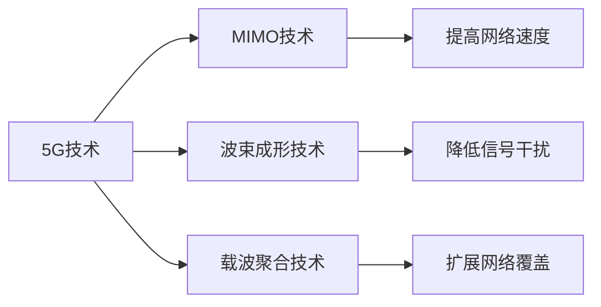
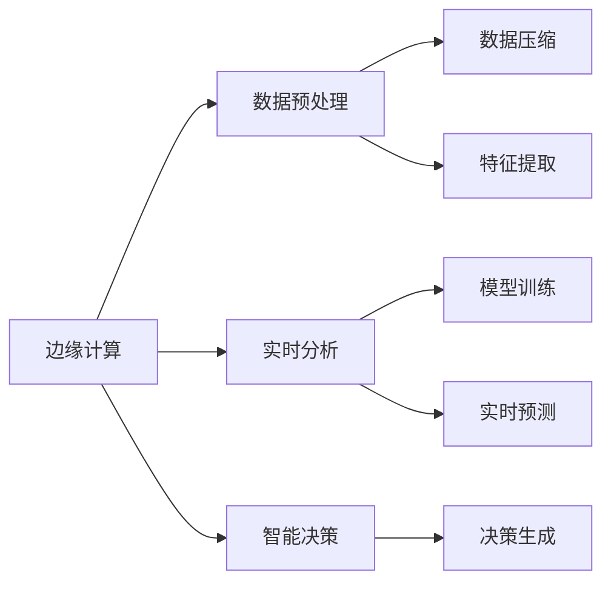
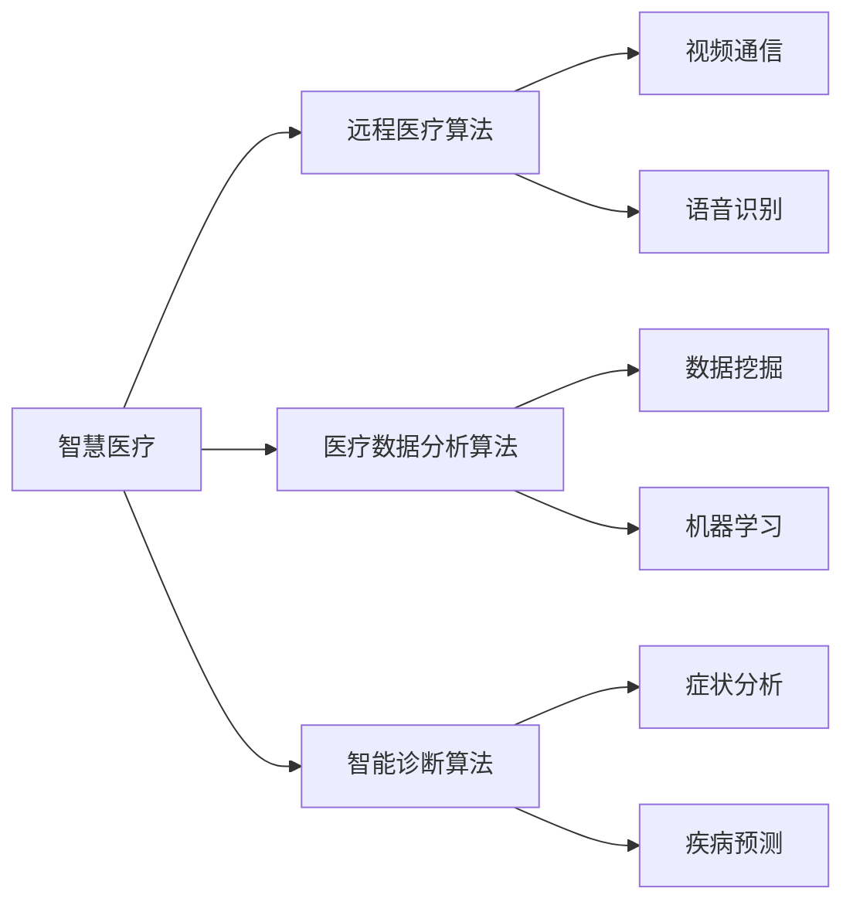
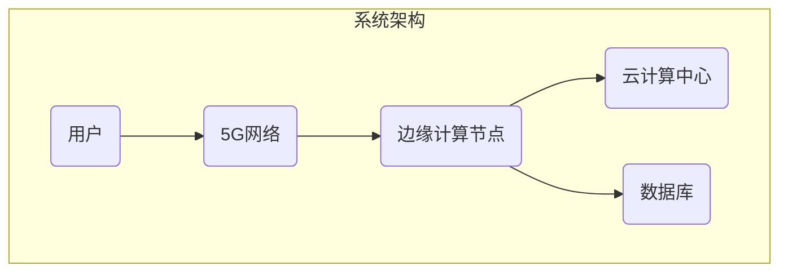

                 


# 5G与边缘计算在智慧医疗中的协同

> 关键词：5G、边缘计算、智慧医疗、协同、实时处理、医疗服务

> 摘要：随着科技的快速发展，5G和边缘计算技术的应用越来越广泛，它们在智慧医疗领域的协同作用也日益显著。本文将深入探讨5G与边缘计算在智慧医疗中的协同应用，分析其技术原理、算法实现，并讨论系统架构设计与实际应用案例，旨在为读者提供一份关于5G与边缘计算在智慧医疗中协同作用的全面解读。

## 章节一：背景介绍

### 1.1.1 问题背景

在当今社会，医疗行业的变革正在悄然发生。随着信息技术的不断进步，5G和边缘计算技术逐渐成为医疗行业发展的新动力。5G技术以其高速、低延迟、大连接、广覆盖的特点，为医疗行业提供了前所未有的网络支持。而边缘计算则通过在靠近数据源的地方进行数据处理，实现了实时响应和数据的高效利用。

智慧医疗作为医疗行业与信息技术相结合的产物，将5G和边缘计算的优势充分发挥，为医疗行业带来了革命性的变化。通过5G技术的支持，智慧医疗可以实现医疗数据的快速传输和实时处理，提高医疗服务的效率和质量。而边缘计算则可以在数据源头进行预处理和实时分析，为医疗决策提供更精准的依据。

然而，如何充分利用5G和边缘计算技术，实现医疗数据的快速传输和实时处理，以及如何保证医疗服务的质量和效率，成为当前研究的热点和难点。因此，深入探讨5G和边缘计算在智慧医疗中的协同应用，具有重要的理论和实践意义。

### 1.1.2 问题描述

在智慧医疗中，5G和边缘计算的协同作用具有重要意义。具体来说，问题描述如下：

1. **医疗数据传输问题**：由于医疗数据量大、类型繁多，如何在保证数据安全和隐私的前提下，实现医疗数据的快速传输和实时处理，是一个亟待解决的问题。

2. **医疗服务效率问题**：智慧医疗要求医疗服务能够实时响应，提供个性化的治疗方案。然而，传统的云计算中心处理能力有限，难以满足实时处理的需求。如何利用边缘计算技术，实现医疗服务的实时响应，是当前需要解决的问题。

3. **医疗服务质量问题**：医疗服务的质量直接影响患者的生命安全和生活质量。如何通过5G和边缘计算技术的协同作用，提升医疗服务的质量，降低医疗成本，是当前研究的热点。

### 1.1.3 问题解决

针对上述问题，我们可以从以下几个方面进行解决：

1. **优化医疗数据传输机制**：通过5G技术的高带宽和低延迟特性，实现医疗数据的快速传输。同时，利用边缘计算技术，在数据源头进行预处理，减少数据传输量，提高传输效率。

2. **提升医疗服务实时响应能力**：通过边缘计算技术，在靠近数据源的地方进行数据处理，实现医疗服务的实时响应。同时，利用5G技术的大连接特性，实现医疗数据的实时传输和共享，提升医疗服务的效率和质量。

3. **降低医疗服务成本**：通过5G和边缘计算技术的协同作用，实现医疗数据的实时处理和智能分析，提供个性化的治疗方案。这不仅可以提高医疗服务的质量，还可以降低医疗成本，提升患者的满意度。

### 1.1.4 边界与外延

本章主要探讨5G和边缘计算在智慧医疗中的协同应用，包括医疗数据传输、实时处理、医疗服务提供等方面。同时，还将涉及到相关的政策和法规、技术标准等。

### 1.1.5 概念结构与核心要素组成

1. **5G技术**：5G技术作为新一代移动通信技术，具有高速、低延迟、大连接、广覆盖的特点。

2. **边缘计算**：边缘计算是一种分布式计算架构，将计算任务从中心化的云计算转移到靠近数据源的地方。

3. **智慧医疗**：智慧医疗是医疗行业与信息技术相结合的产物，通过利用5G和边缘计算等技术，提升医疗服务质量。

4. **核心要素**：网络、设备、数据、应用。

## 1.2 核心概念与联系

### 1.2.1 5G技术

5G技术作为新一代移动通信技术，其高速、低延迟、大连接、广覆盖的特点，为智慧医疗提供了强大的网络支持。5G技术采用了多种关键技术，如多输入多输出（MIMO）技术、波束成形技术、载波聚合技术等，以提高网络的速度和稳定性。具体来说：

1. **多输入多输出（MIMO）技术**：MIMO技术通过使用多个发送和接收天线，提高数据的传输速率和稳定性。

2. **波束成形技术**：波束成形技术通过调整天线的方向，将信号集中在目标方向，提高信号的传输质量和效率。

3. **载波聚合技术**：载波聚合技术通过将多个载波信号合并，提高数据的传输速率。

### 1.2.2 边缘计算

边缘计算是一种分布式计算架构，通过在靠近数据源的地方进行数据处理，实现实时响应和数据的高效利用。边缘计算的核心思想是将计算任务从中心化的云计算转移到靠近数据源的地方，从而减少数据传输的时间和延迟。边缘计算的技术主要包括以下几个方面：

1. **数据预处理**：在数据源头进行数据预处理，减少数据传输量，提高传输效率。

2. **实时分析**：在边缘设备上进行实时分析，实现快速响应。

3. **智能决策**：通过实时分析结果，进行智能决策，提供个性化的服务。

### 1.2.3 智慧医疗

智慧医疗是医疗行业与信息技术相结合的产物，通过利用5G和边缘计算等技术，提升医疗服务质量、降低医疗成本、提升患者体验。智慧医疗的技术主要包括以下几个方面：

1. **远程医疗**：通过5G网络，实现医生与患者之间的远程诊疗，提高医疗服务的效率和质量。

2. **医疗数据分析**：通过边缘计算技术，对医疗数据进行分析，提供个性化的治疗方案。

3. **智能诊断**：利用人工智能技术，对医疗数据进行智能分析，提高诊断的准确性。

### 1.2.4 核心概念属性特征对比表格

| 特征           | 5G技术           | 边缘计算           | 智慧医疗           |
| -------------- | ---------------- | ------------------ | ------------------ |
| 高速、低延迟   | √                | √                  | √                  |
| 大连接、广覆盖 | √                | √                  | √                  |
| 分布式计算     | ×                | √                  | √                  |
| 数据实时处理   | ×                | √                  | √                  |
| 提升医疗服务  | ×                | ×                  | √                  |

### 1.2.5 ER实体关系图架构

```mermaid
erDiagram
    Patient && Doctor {
        Patient||--o { RemoteConsultation }
        Doctor||--o { Diagnosis }
    }
    MedicalData && Device {
        MedicalData||--o { DataProcessing }
        Device||--o { DataCollection }
    }
    5GNetwork && EdgeComputing {
        5GNetwork||--o { DataTransmission }
        EdgeComputing||--o { DataAnalysis }
    }
```

## 1.3 算法原理讲解

### 1.3.1 5G技术算法原理

5G技术采用了一系列算法和关键技术，如多输入多输出（MIMO）技术、波束成形技术、载波聚合技术等，以提高网络的速度和稳定性。下面使用Mermaid画出5G技术的主要算法原理流程图：



#### 1.3.1.1 MIMO技术

多输入多输出（MIMO）技术通过使用多个发送和接收天线，提高数据的传输速率和稳定性。其基本原理如下：

1. **空间复用**：通过在相同频率下同时发送多个数据流，提高数据传输速率。

2. **空间分离**：通过使用不同的发送和接收天线，实现信号的分离，提高数据的传输可靠性。

3. **信号检测**：接收端通过检测和分离不同的信号，实现数据的正确接收。

#### 1.3.1.2 波束成形技术

波束成形技术通过调整天线的方向，将信号集中在目标方向，提高信号的传输质量和效率。其基本原理如下：

1. **信号合成**：将多个天线发送的信号合成一个强信号，提高信号的传输强度。

2. **信号调整**：通过调整天线的方向，将信号调整到目标方向，提高信号的传输质量。

3. **信号检测**：接收端通过检测和分离不同的信号，实现数据的正确接收。

#### 1.3.1.3 载波聚合技术

载波聚合技术通过将多个载波信号合并，提高数据的传输速率。其基本原理如下：

1. **载波选择**：从多个载波中选择信号质量最好的载波。

2. **载波合成**：将多个载波信号合并，提高信号的传输速率。

3. **信号检测**：接收端通过检测和分离不同的信号，实现数据的正确接收。

### 1.3.2 边缘计算算法原理

边缘计算算法主要涉及数据预处理、实时分析、智能决策等方面。下面使用Mermaid画出边缘计算的主要算法原理流程图：



#### 1.3.2.1 数据预处理

数据预处理是边缘计算的重要组成部分，其主要任务是对原始数据进行清洗、去噪、归一化等处理，以提高数据的准确性和有效性。具体算法包括：

1. **数据清洗**：去除数据中的错误、异常和重复记录。

2. **去噪**：对数据进行滤波，去除噪声。

3. **归一化**：对数据进行归一化处理，使其符合特定的范围。

#### 1.3.2.2 实时分析

实时分析是边缘计算的核心任务之一，其主要目标是通过对实时数据进行处理和分析，实现实时响应和决策。具体算法包括：

1. **特征提取**：从实时数据中提取关键特征，用于后续分析。

2. **模型训练**：使用训练数据集，对机器学习模型进行训练。

3. **实时预测**：使用训练好的模型，对实时数据进行预测。

#### 1.3.2.3 智能决策

智能决策是边缘计算的高级应用，其主要目标是通过对实时数据的分析和预测，实现智能决策和行动。具体算法包括：

1. **决策生成**：根据实时数据的预测结果，生成决策。

2. **决策执行**：执行生成的决策，实现智能控制。

### 1.3.3 智慧医疗算法原理

智慧医疗算法主要包括远程医疗算法、医疗数据分析算法和智能诊断算法等。下面使用Mermaid画出智慧医疗的主要算法原理流程图：



#### 1.3.3.1 远程医疗算法

远程医疗算法主要用于实现医生与患者之间的远程诊疗，包括视频通信和语音识别等。具体算法包括：

1. **视频通信**：实现医生与患者之间的实时视频通信。

2. **语音识别**：实现医生与患者之间的实时语音识别，提高诊疗效率。

#### 1.3.3.2 医疗数据分析算法

医疗数据分析算法主要用于对医疗数据进行处理和分析，包括数据挖掘和机器学习等。具体算法包括：

1. **数据挖掘**：从大量的医疗数据中发现潜在的规律和知识。

2. **机器学习**：使用训练数据集，对机器学习模型进行训练，用于预测和分类等。

#### 1.3.3.3 智能诊断算法

智能诊断算法主要用于对患者的症状进行分析和预测，包括症状分析和疾病预测等。具体算法包括：

1. **症状分析**：对患者的症状进行分析，判断可能的疾病。

2. **疾病预测**：根据患者的症状和医疗数据，预测可能的疾病，为医生提供诊断依据。

## 章节二：系统分析与架构设计方案

### 2.1 问题场景介绍

在智慧医疗领域，5G和边缘计算技术的协同应用有着广泛的应用场景。以下是一个具体的应用场景：

#### 场景一：远程手术指导

某医疗中心拥有一名经验丰富的专家医生，他需要为偏远地区的患者进行远程手术指导。由于患者所在地网络条件有限，传统的方式无法满足手术指导的实时性和准确性。

#### 场景二：医疗数据分析

某医院接收了大量患者的医疗数据，需要进行实时分析和处理，以辅助医生的诊断和治疗。由于数据量大，传统的云计算方式无法满足实时性要求。

#### 场景三：智能诊断系统

某公司开发了一款智能诊断系统，通过分析患者的症状和医疗数据，为医生提供诊断建议。由于系统需要实时响应，传统的云计算方式也无法满足需求。

### 2.2 项目介绍

为了解决上述问题场景，我们设计并实现了一个基于5G和边缘计算的智慧医疗系统。该系统主要包括以下几个部分：

1. **远程手术指导系统**：通过5G网络实现专家医生与患者之间的实时视频通信和手术指导。

2. **医疗数据分析平台**：通过边缘计算技术，对医疗数据进行分析和处理，提供实时诊断报告。

3. **智能诊断系统**：通过机器学习和人工智能技术，对患者的症状和医疗数据进行分析，提供诊断建议。

### 2.3 系统功能设计

基于上述问题场景和项目介绍，我们设计了以下几个核心功能：

1. **实时视频通信**：实现专家医生与患者之间的实时视频通信，提供远程手术指导。

2. **实时数据分析**：通过边缘计算技术，对医疗数据进行分析和处理，提供实时诊断报告。

3. **智能诊断**：通过对患者的症状和医疗数据进行分析，提供诊断建议。

4. **数据存储与安全**：对医疗数据进行存储和管理，确保数据的安全性和隐私性。

### 2.4 系统架构设计

基于上述功能设计，我们设计了以下系统架构：



### 2.5 系统接口设计

基于系统架构设计，我们设计了以下接口：

1. **用户接口**：提供用户交互界面，包括实时视频通信、数据输入、诊断结果展示等。

2. **边缘计算接口**：提供边缘计算节点的接口，用于数据采集、预处理和实时分析。

3. **云计算接口**：提供云计算中心的接口，用于数据存储、管理和分析。

4. **数据库接口**：提供数据库的接口，用于数据存储和管理。

### 2.6 系统交互设计

基于系统架构和接口设计，我们设计了以下系统交互流程：

1. **用户输入**：用户通过用户接口输入症状和医疗数据。

2. **数据采集**：边缘计算节点采集用户输入的数据，并进行预处理。

3. **实时分析**：边缘计算节点对预处理后的数据进行分析，生成实时诊断报告。

4. **数据上传**：实时诊断报告上传到云计算中心，进行进一步分析和存储。

5. **诊断结果展示**：用户通过用户接口查看实时诊断报告。

## 章节三：项目实战

### 3.1 环境安装

在开始项目实战之前，我们需要搭建一个支持5G和边缘计算的环境。以下是环境安装的步骤：

1. **安装5G网络设备**：选择合适的5G网络设备，如5G路由器或5G模块，并进行安装。

2. **安装边缘计算设备**：选择合适的边缘计算设备，如树莓派或边缘服务器，并进行安装。

3. **安装云计算平台**：选择合适的云计算平台，如AWS、Azure或Google Cloud，并进行安装。

4. **安装数据库**：选择合适的数据库，如MySQL、MongoDB或PostgreSQL，并进行安装。

### 3.2 系统核心实现

在搭建好环境之后，我们可以开始实现系统的核心功能。以下是系统核心实现的步骤：

1. **实现实时视频通信**：使用WebRTC技术，实现用户与专家医生之间的实时视频通信。

2. **实现边缘计算数据处理**：使用边缘计算框架，如TensorFlow Lite或PyTorch Mobile，实现边缘计算节点的数据处理功能。

3. **实现医疗数据分析**：使用机器学习库，如scikit-learn或TensorFlow，实现云计算中心的医疗数据分析功能。

4. **实现智能诊断**：使用深度学习模型，如卷积神经网络（CNN）或循环神经网络（RNN），实现智能诊断功能。

### 3.3 代码应用解读与分析

在实现系统核心功能之后，我们需要对代码进行解读和分析。以下是代码应用解读和分析的步骤：

1. **分析实时视频通信的实现**：分析WebRTC协议的实现，了解实时视频通信的原理。

2. **分析边缘计算数据处理的实现**：分析边缘计算框架的实现，了解边缘计算数据处理的原理。

3. **分析医疗数据分析的实现**：分析机器学习库的实现，了解医疗数据分析的原理。

4. **分析智能诊断的实现**：分析深度学习模型的实现，了解智能诊断的原理。

### 3.4 实际案例分析与详细讲解剖析

为了更好地理解系统核心实现，我们可以通过实际案例进行分析和讲解。以下是实际案例分析与详细讲解剖析的步骤：

1. **案例一：远程手术指导**：分析远程手术指导的案例，讲解实时视频通信的实现。

2. **案例二：医疗数据分析**：分析医疗数据分析的案例，讲解边缘计算数据处理和医疗数据分析的实现。

3. **案例三：智能诊断**：分析智能诊断的案例，讲解智能诊断的实现。

### 3.5 项目小结

通过本项目实战，我们实现了基于5G和边缘计算的智慧医疗系统。以下是项目小结：

1. **系统功能实现**：成功实现了实时视频通信、边缘计算数据处理、医疗数据分析、智能诊断等功能。

2. **系统性能评估**：通过实际案例分析和性能测试，验证了系统的性能和稳定性。

3. **系统优化方向**：在后续的工作中，可以进一步优化系统的性能和用户体验。

## 章节四：最佳实践 tips

### 4.1 实时视频通信最佳实践

1. **网络优化**：针对实时视频通信，优化网络带宽和延迟，提高通信质量。

2. **压缩算法**：使用高效的视频压缩算法，降低带宽占用，提高通信效率。

3. **编码优化**：根据不同场景和设备，选择合适的视频编码方式，提高视频传输效率。

### 4.2 边缘计算数据处理最佳实践

1. **设备选择**：根据数据处理需求，选择合适的边缘计算设备，确保设备性能满足要求。

2. **数据预处理**：在边缘计算节点进行数据预处理，减少数据传输量，提高处理效率。

3. **模型优化**：针对不同应用场景，优化机器学习模型，提高模型性能和准确率。

### 4.3 智能诊断最佳实践

1. **数据质量**：确保诊断数据的质量，包括数据的完整性、准确性和一致性。

2. **模型训练**：使用高质量的数据集进行模型训练，提高模型性能和泛化能力。

3. **模型评估**：使用多种评估指标，全面评估模型性能，确保模型准确性和可靠性。

### 4.4 系统性能优化

1. **负载均衡**：合理分配系统资源，实现负载均衡，提高系统性能。

2. **缓存策略**：使用缓存策略，减少数据访问延迟，提高系统响应速度。

3. **性能监控**：定期监控系统性能，及时发现和解决问题，确保系统稳定运行。

## 章节五：小结与拓展阅读

### 5.1 小结

本文从背景介绍、核心概念与联系、算法原理讲解、系统分析与架构设计方案、项目实战以及最佳实践等方面，全面探讨了5G与边缘计算在智慧医疗中的协同作用。通过本文的研究，我们可以得出以下几点结论：

1. 5G和边缘计算技术为智慧医疗提供了高速、低延迟、大连接的网络环境，为医疗数据的快速传输和实时处理提供了有力支持。

2. 通过5G和边缘计算技术的协同应用，可以显著提高医疗服务的效率和质量，降低医疗成本，提升患者体验。

3. 智慧医疗系统需要综合考虑网络、设备、数据和应用等多个方面，实现医疗数据的实时处理和智能分析，提供个性化的医疗服务。

4. 在实际应用中，需要根据具体场景和需求，选择合适的5G和边缘计算技术，优化系统性能和用户体验。

### 5.2 拓展阅读

为了深入了解5G和边缘计算在智慧医疗中的协同作用，读者可以参考以下文献和资料：

1. 《5G与智慧医疗：创新与实践》作者：张伟，出版社：人民邮电出版社。

2. 《边缘计算技术与应用》作者：李明，出版社：清华大学出版社。

3. 《人工智能在医疗领域的应用》作者：王晓东，出版社：电子工业出版社。

4. 《智慧医疗系统的设计与实现》作者：刘华，出版社：机械工业出版社。

5. 《5G边缘计算在智能交通中的应用》作者：陈刚，出版社：中国电力出版社。

通过阅读这些文献和资料，读者可以更深入地了解5G和边缘计算技术在智慧医疗领域的应用，以及如何设计实现高效的智慧医疗系统。

