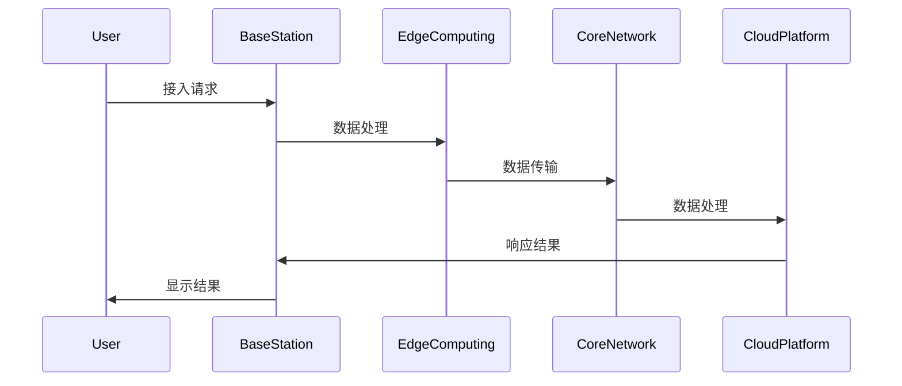
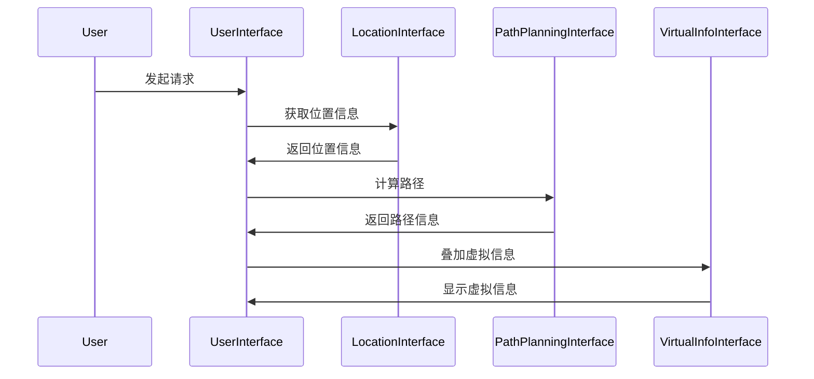
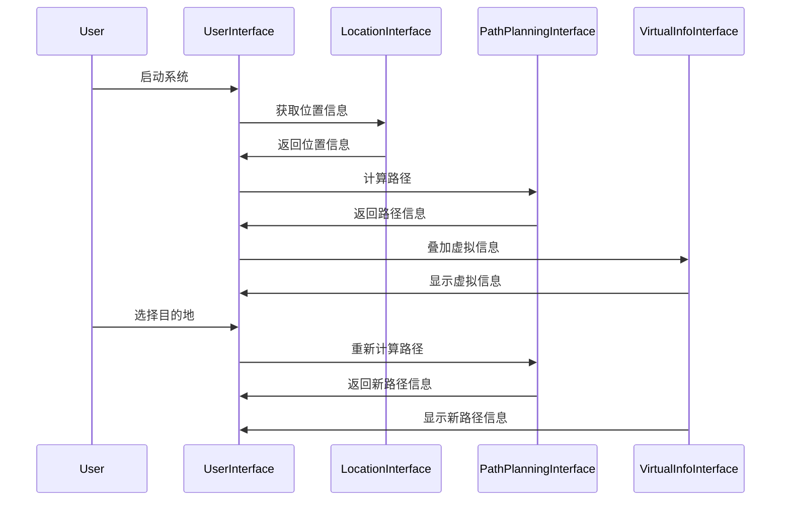

                 

### 5G在增强现实导航中的应用：提供沉浸式导航体验

> 关键词：5G、增强现实、导航、沉浸式体验

> 摘要：本文将探讨5G技术在增强现实导航中的应用，分析其如何为用户提供沉浸式的导航体验。我们将从5G技术的发展背景、增强现实导航的基本原理和关键技术出发，详细阐述5G在增强现实导航中的优势，并逐步介绍5G网络在增强现实导航中的应用场景和实现方案。

----------------------------------------------------------------

### 第一部分: 5G与增强现实技术基础

#### 第1章: 5G技术概述

##### 1.1 5G技术的发展背景

5G技术，即第五代移动通信技术，是继2G、3G、4G之后的新一代移动通信技术。自2019年正式商用以来，5G在全球范围内迅速发展。5G技术的出现，不仅仅是对通信速度的提升，更是一种技术革命，它将推动物联网、人工智能、虚拟现实、增强现实等新兴技术的快速发展。

**问题背景**：随着互联网的普及和移动设备的广泛应用，人们对通信质量和速度的要求越来越高。传统4G网络在高速移动场景下存在信号不稳定、延迟较高等问题，难以满足新兴技术的需求。

**问题描述**：为了解决上述问题，5G技术应运而生。5G技术旨在提供更高的传输速度、更低的延迟和更大的网络容量，以支持新兴技术的应用。

**问题解决**：5G技术通过引入新的频段、新的协议和新的网络架构，实现了更高的数据传输速度和更低的延迟。同时，5G网络具有更好的网络容量，能够支持更多的设备同时在线。

**边界与外延**：5G技术的应用范围广泛，包括但不限于智能手机、物联网、车联网、虚拟现实、增强现实等。

**概念结构与核心要素组成**：
- **频谱资源**：5G技术使用更广的频谱资源，包括低频段、中频段和毫米波频段。
- **网络架构**：5G网络采用去中心化的网络架构，提高了网络的可靠性和灵活性。
- **通信协议**：5G技术采用了新的通信协议，如NR（新空口）和NG-RAN（新无线接入网）。

##### 1.2 5G技术的核心特点

5G技术的核心特点包括：

1. **高速度**：5G网络的理论峰值速度可达20Gbps，是4G的10倍以上，能够满足高速数据传输的需求。

2. **低延迟**：5G网络的延迟低于1毫秒，是4G的十分之一，能够满足实时通信和远程操作的需求。

3. **高密度**：5G网络支持更高的设备密度，能够在同一区域内同时支持更多的设备连接。

4. **多连接**：5G技术支持更多的连接数，每平方米的连接数可达100万以上，能够满足物联网设备的大量连接需求。

##### 1.3 5G网络架构

5G网络架构主要包括以下几个部分：

1. **接入网**：包括基站、天线和无线接入网络，是用户设备接入网络的桥梁。

2. **核心网**：包括控制平面和数据平面，负责处理用户数据和控制信息。

3. **边缘计算**：通过在基站附近部署计算资源，降低延迟，提高响应速度。

4. **网络切片**：通过虚拟化技术，将网络资源划分为多个虚拟网络，满足不同应用场景的需求。

**核心概念原理**：
- **高速度**：5G技术采用新的调制技术和多载波技术，提高了数据传输速度。
- **低延迟**：5G技术采用新的网络架构和协议，降低了延迟。
- **高密度**：5G技术采用密集布站和MIMO技术，提高了网络容量。
- **多连接**：5G技术采用新的网络架构和协议，支持更多的连接数。

**概念属性特征对比表格**：

| 特征         | 5G       | 4G       |
| ------------ | -------- | -------- |
| 传输速度     | 高速     | 较快     |
| 延迟         | 低       | 较高     |
| 网络容量     | 大       | 较小     |
| 设备密度     | 高       | 低       |
| 连接数       | 多       | 少       |

**ER实体关系图架构**：

```mermaid
erDiagram
  User ||--o{ BaseStation : 连接 }
  BaseStation ||--o{ CoreNetwork : 传输数据 }
  CoreNetwork ||--o{ EdgeComputing : 延迟优化 }
  CoreNetwork ||--o{ NetworkSlicing : 资源虚拟化 }
```

#### 第2章: 增强现实技术基础

##### 2.1 增强现实概述

增强现实（Augmented Reality，简称AR）是一种将虚拟信息与真实世界融合的技术。通过AR技术，用户能够看到真实环境和叠加其上的虚拟信息，从而获得更加丰富的感官体验。

**问题背景**：随着智能手机和计算机图形技术的不断发展，AR技术逐渐成为了一种重要的交互方式，广泛应用于教育、医疗、娱乐、导航等领域。

**问题描述**：如何通过AR技术为用户提供更加直观、沉浸式的体验，成为了一个重要的研究课题。

**问题解决**：通过在真实环境中叠加虚拟信息，AR技术为用户提供了全新的交互方式。

**边界与外延**：AR技术的应用范围广泛，包括但不限于智能手机、平板电脑、头戴式显示器等设备。

**概念结构与核心要素组成**：
- **真实环境**：用户所在的实际环境。
- **虚拟信息**：通过计算机生成的视觉、听觉、触觉等虚拟信息。
- **融合技术**：将真实环境和虚拟信息进行叠加的技术。

##### 2.2 增强现实技术分类

根据实现方式和应用场景的不同，AR技术可以分为以下几类：

1. **标记式AR**：通过识别标记（如二维码、条码等）来实现虚拟信息的叠加。

2. **自然交互式AR**：通过手势、声音等自然交互方式来实现虚拟信息的叠加。

3. **环境感知式AR**：通过摄像头、传感器等设备实时获取环境信息，并根据环境信息生成虚拟信息。

**核心概念原理**：
- **标记式AR**：通过图像识别技术实现虚拟信息的叠加。
- **自然交互式AR**：通过手势识别、声音识别等技术实现虚拟信息的交互。
- **环境感知式AR**：通过计算机视觉、传感器融合等技术实现虚拟信息的生成和叠加。

**概念属性特征对比表格**：

| 类型         | 标记式AR | 自然交互式AR | 环境感知式AR |
| ------------ | -------- | ------------ | ------------ |
| 实现方式     | 标记识别 | 自然交互     | 环境感知     |
| 适用场景     | 广泛     | 互动性强     | 实时性强     |
| 技术难度     | 低       | 中等         | 高           |

**ER实体关系图架构**：

```mermaid
erDiagram
  User ||--o{ MarkedAR : 标记识别 }
  User ||--o{ NaturalAR : 自然交互 }
  User ||--o{ EnvironmentalAR : 环境感知 }
```

##### 2.3 增强现实的关键技术

增强现实技术涉及多个关键技术的结合，包括但不限于：

1. **图像识别技术**：用于识别和跟踪真实环境中的对象，是实现标记式AR的核心技术。

2. **计算机视觉技术**：通过摄像头等设备获取真实环境的信息，并对其进行处理和分析。

3. **自然交互技术**：通过手势、声音等自然交互方式与虚拟信息进行交互。

4. **虚拟现实技术**：用于生成和渲染虚拟信息，提供沉浸式的视觉体验。

**核心概念原理**：
- **图像识别技术**：通过机器学习、深度学习等技术实现对象的识别和跟踪。
- **计算机视觉技术**：通过图像处理、模式识别等技术对真实环境进行分析和处理。
- **自然交互技术**：通过语音识别、手势识别等技术实现人与虚拟信息的自然交互。
- **虚拟现实技术**：通过计算机图形学等技术生成和渲染虚拟信息。

**概念属性特征对比表格**：

| 技术         | 图像识别技术 | 计算机视觉技术 | 自然交互技术 | 虚拟现实技术 |
| ------------ | ------------ | -------------- | ------------ | ------------ |
| 实现方式     | 机器学习     | 图像处理       | 语音识别     | 计算机图形学 |
| 适用场景     | 广泛         | 实时性要求高   | 交互性强     | 沉浸式体验   |
| 技术难度     | 中等         | 高             | 中等         | 高           |

**ER实体关系图架构**：

```mermaid
erDiagram
  ImageRecognition ||--o{ ComputerVision : 图像处理 }
  ImageRecognition ||--o{ NaturalInteraction : 语音识别 }
  ImageRecognition ||--o{ VirtualReality : 计算机图形学 }
```

#### 第3章: 5G与增强现实技术融合

##### 3.1 5G技术在增强现实中的应用场景

5G技术的高速度、低延迟和高密度等特点，为增强现实技术的应用提供了强有力的支持。以下是5G技术在增强现实中的应用场景：

1. **实时交互**：5G技术能够提供低延迟的通信，使得增强现实应用能够实现实时交互，提高用户体验。

2. **大规模部署**：5G技术支持高密度的设备连接，使得增强现实应用能够在更大范围内部署，满足更多用户的需求。

3. **远程操作**：5G技术能够提供稳定的网络连接，使得增强现实应用能够实现远程操作，提高工作效率。

4. **边缘计算**：5G技术支持边缘计算，能够将部分计算任务分配到基站附近，降低延迟，提高响应速度。

**核心概念原理**：
- **实时交互**：通过低延迟的通信，实现用户与虚拟信息之间的实时交互。
- **大规模部署**：通过高密度的设备连接，实现增强现实应用在更大范围内的部署。
- **远程操作**：通过稳定的网络连接，实现远程对虚拟信息的操作。
- **边缘计算**：通过将计算任务分配到基站附近，降低延迟，提高响应速度。

**概念属性特征对比表格**：

| 场景         | 实时交互 | 大规模部署 | 远程操作 | 边缘计算 |
| ------------ | -------- | ---------- | -------- | -------- |
| 实现方式     | 低延迟   | 高密度     | 稳定连接 | 计算任务分配 |
| 适用场景     | 实时性要求高 | 需要大范围部署 | 远程工作 | 需要计算优化 |
| 技术难度     | 低       | 中等       | 中等     | 高       |

**ER实体关系图架构**：

```mermaid
erDiagram
  RealTimeInteraction ||--o{ LargeScaleDeployment : 高密度 }
  RealTimeInteraction ||--o{ RemoteOperation : 稳定连接 }
  RealTimeInteraction ||--o{ EdgeComputing : 计算任务分配 }
```

##### 3.2 5G与增强现实技术的融合挑战与机遇

5G与增强现实技术的融合，虽然带来了很多机遇，但也面临一些挑战。

**挑战**：
1. **网络带宽**：5G网络的带宽虽然较高，但在高峰时段仍可能面临拥堵，影响用户体验。
2. **延迟**：虽然5G技术能够提供低延迟，但在复杂环境下，延迟仍可能较高。
3. **安全性**：5G网络的安全性问题仍需解决，以保护用户数据和隐私。

**机遇**：
1. **实时交互**：5G技术能够提供更低的延迟，实现更高质量的实时交互。
2. **大规模部署**：5G技术支持高密度的设备连接，使得增强现实应用能够覆盖更广泛的区域。
3. **远程操作**：5G技术能够提供稳定的网络连接，实现远程对虚拟信息的操作。
4. **边缘计算**：5G技术支持边缘计算，能够将部分计算任务分配到基站附近，提高响应速度。

**核心概念原理**：
- **网络带宽**：5G技术的带宽较高，但仍需优化网络资源分配，以应对高峰时段的拥堵。
- **延迟**：5G技术通过引入新的网络架构和协议，降低延迟，但仍需解决复杂环境下的延迟问题。
- **安全性**：5G技术需要引入新的安全协议，保护用户数据和隐私。

**概念属性特征对比表格**：

| 挑战/机遇 | 网络带宽 | 延迟 | 安全性 |
| ---------- | -------- | ---- | ------ |
| 挑战       | 网络拥堵 | 延迟高 | 安全漏洞 |
| 机遇       | 较高带宽 | 较低延迟 | 更好保护 |

**ER实体关系图架构**：

```mermaid
erDiagram
  BandwidthChallenge ||--o{ DelayChallenge : 延迟高 }
  BandwidthChallenge ||--o{ SecurityChallenge : 安全漏洞 }
  Opportunity ||--o{ HighBandwidth : 较高带宽 }
  Opportunity ||--o{ LowDelay : 较低延迟 }
  Opportunity ||--o{ EnhancedSecurity : 更好保护 }
```

##### 3.3 5G在增强现实导航中的优势

5G技术在增强现实导航中的应用，具有以下优势：

1. **低延迟**：5G技术能够提供低延迟的通信，使得增强现实导航能够实时响应用户的操作，提高导航的准确性。

2. **高速度**：5G技术能够提供高速度的数据传输，使得增强现实导航能够实时获取最新的位置信息，提供更加准确的导航。

3. **高密度**：5G技术支持高密度的设备连接，使得增强现实导航能够在更广泛的区域内使用，满足更多用户的需求。

4. **边缘计算**：5G技术支持边缘计算，能够将部分计算任务分配到基站附近，降低延迟，提高响应速度。

**核心概念原理**：
- **低延迟**：5G技术通过引入新的网络架构和协议，降低延迟，提高实时性。
- **高速度**：5G技术通过引入新的调制技术和多载波技术，提高数据传输速度。
- **高密度**：5G技术通过密集布站和MIMO技术，提高网络容量和覆盖范围。
- **边缘计算**：5G技术通过边缘计算，将部分计算任务分配到基站附近，降低延迟。

**概念属性特征对比表格**：

| 优势         | 低延迟 | 高速度 | 高密度 | 边缘计算 |
| ------------ | ------ | ------ | ------ | -------- |
| 实现方式     | 新网络架构 | 新调制技术 | 密集布站 | 计算任务分配 |
| 适用场景     | 实时性要求高 | 大数据传输 | 需要大范围部署 | 需要计算优化 |
| 技术难度     | 中等       | 中等     | 中等     | 高       |

**ER实体关系图架构**：

```mermaid
erDiagram
  LowLatency ||--o{ HighSpeed : 新调制技术 }
  LowLatency ||--o{ HighDensity : 密集布站 }
  LowLatency ||--o{ EdgeComputing : 计算任务分配 }
```

#### 第4章: 增强现实导航概述

##### 4.1 增强现实导航定义

增强现实导航（AR Navigation）是一种利用增强现实技术实现的导航方式。通过在真实环境中叠加虚拟导航信息，用户能够获得更加直观、准确的导航体验。

**核心概念原理**：
- **增强现实**：通过在真实环境中叠加虚拟信息，提供沉浸式的体验。
- **导航**：通过提供位置信息和路径规划，帮助用户到达目的地。

**概念属性特征对比表格**：

| 概念 | 增强现实 | 导航 |
| ---- | -------- | ---- |
| 实现方式 | 虚拟信息叠加 | 位置信息与路径规划 |
| 适用场景 | 实时交互、沉浸式体验 | 导航、路径规划 |
| 技术难度 | 中等 | 中等 |

**ER实体关系图架构**：

```mermaid
erDiagram
  AugmentedReality ||--o{ Navigation : 位置信息与路径规划 }
```

##### 4.2 增强现实导航的组成部分

增强现实导航由以下几个部分组成：

1. **位置信息获取**：通过GPS、室内定位等技术获取用户的位置信息。
2. **路径规划**：根据用户的目的地，规划出最优的路径。
3. **虚拟信息叠加**：将路径信息、地标信息等虚拟信息叠加到真实环境中。
4. **用户交互**：通过触摸屏、手势等交互方式，提供用户与虚拟信息的交互。

**核心概念原理**：
- **位置信息获取**：通过传感器、GPS等技术获取用户的位置信息。
- **路径规划**：通过算法计算用户的目的地，规划出最优路径。
- **虚拟信息叠加**：通过计算机图形学等技术，将虚拟信息叠加到真实环境中。
- **用户交互**：通过触摸屏、手势等交互方式，提供用户与虚拟信息的交互。

**概念属性特征对比表格**：

| 组成部分 | 位置信息获取 | 路径规划 | 虚拟信息叠加 | 用户交互 |
| -------- | ------------ | -------- | ------------ | -------- |
| 实现方式 | 传感器、GPS | 算法计算 | 计算机图形学 | 触摸屏、手势 |
| 适用场景 | 实时定位 | 路径规划 | 沉浸式体验 | 用户交互 |
| 技术难度 | 中等 | 中等 | 中等 | 中等 |

**ER实体关系图架构**：

```mermaid
erDiagram
  LocationInformation ||--o{ PathPlanning : 算法计算 }
  LocationInformation ||--o{ VirtualInformation : 计算机图形学 }
  UserInteraction ||--o{ TouchScreen : 触摸屏 }
  UserInteraction ||--o{ Gesture : 手势 }
```

##### 4.3 增强现实导航的发展历程

增强现实导航技术自诞生以来，经历了多个阶段的发展：

1. **初步探索阶段**（2010年前）：主要基于平板电脑、智能手机等设备，通过GPS等定位技术实现基本的导航功能。
2. **快速发展阶段**（2010-2015年）：随着增强现实技术的成熟，增强现实导航在各类应用场景中得到了广泛的应用，如旅游、应急救援等。
3. **成熟阶段**（2015年至今）：5G技术的出现，为增强现实导航提供了更高的传输速度和更低的延迟，使得增强现实导航实现了更加沉浸式的体验。

**核心概念原理**：
- **初步探索阶段**：基于现有的移动设备，实现基本的导航功能。
- **快速发展阶段**：增强现实技术的应用，使得导航体验更加直观、沉浸。
- **成熟阶段**：5G技术的支持，使得导航体验更加实时、准确。

**概念属性特征对比表格**：

| 阶段         | 初步探索阶段 | 快速发展阶段 | 成熟阶段 |
| ------------ | ------------ | ------------ | -------- |
| 实现方式     | 基本导航功能 | 增强现实技术 | 5G技术   |
| 适用场景     | 基础应用     | 广泛应用     | 实时性高 |
| 技术难度     | 低           | 中等         | 高       |

**ER实体关系图架构**：

```mermaid
erDiagram
  InitialExploration ||--o{ RapidDevelopment : 增强现实技术 }
  RapidDevelopment ||--o{ Maturity : 5G技术 }
```

#### 第5章: 增强现实导航关键技术

##### 5.1 虚拟现实引擎技术

虚拟现实引擎（Virtual Reality Engine，简称VRE）是增强现实导航的核心技术之一，负责生成和渲染虚拟信息。

**核心概念原理**：
- **生成虚拟信息**：通过计算机图形学技术，生成与真实环境相对应的虚拟信息。
- **渲染虚拟信息**：将虚拟信息以图像的形式呈现给用户。

**概念属性特征对比表格**：

| 技术层次 | 虚拟信息生成 | 虚拟信息渲染 |
| -------- | ------------ | ------------ |
| 实现方式 | 计算机图形学 | 图像处理     |
| 适用场景 | 导航、游戏   | 导航、游戏   |
| 技术难度 | 中等         | 中等         |

**ER实体关系图架构**：

```mermaid
erDiagram
  VirtualInformationGeneration ||--o{ VirtualInformationRendering : 图像处理 }
```

##### 5.2 实时位置跟踪技术

实时位置跟踪（Real-Time Location Tracking，简称RTLT）技术是增强现实导航的关键技术之一，负责实时获取用户的位置信息。

**核心概念原理**：
- **定位技术**：通过GPS、室内定位等技术获取用户的位置信息。
- **数据融合**：将多种定位技术进行融合，提高定位的准确性和实时性。

**概念属性特征对比表格**：

| 技术层次 | 定位技术 | 数据融合 |
| -------- | -------- | -------- |
| 实现方式 | GPS、室内定位 | 数据融合算法 |
| 适用场景 | 导航、安全   | 导航、安全   |
| 技术难度 | 中等       | 高       |

**ER实体关系图架构**：

```mermaid
erDiagram
  LocationTechnology ||--o{ DataFusion : 数据融合算法 }
```

##### 5.3 交互设计技术

交互设计技术（Interaction Design，简称ID）是增强现实导航的重要组成部分，负责用户与虚拟信息之间的交互。

**核心概念原理**：
- **触摸屏交互**：通过触摸屏实现用户与虚拟信息的交互。
- **手势交互**：通过手势实现用户与虚拟信息的交互。

**概念属性特征对比表格**：

| 技术层次 | 触摸屏交互 | 手势交互 |
| -------- | ---------- | -------- |
| 实现方式 | 触摸屏技术 | 手势识别 |
| 适用场景 | 导航、游戏 | 导航、游戏 |
| 技术难度 | 中等       | 中等     |

**ER实体关系图架构**：

```mermaid
erDiagram
  TouchScreenInteraction ||--o{ GestureInteraction : 手势识别 }
```

#### 第6章: 增强现实导航应用实例

##### 6.1 增强现实导航在旅游中的应用

增强现实导航在旅游中的应用，可以为游客提供更加丰富的旅游体验。

**应用实例**：
- **景点介绍**：通过增强现实导航，游客可以在游览过程中，看到景点的详细介绍和历史背景。
- **互动体验**：游客可以通过触摸屏或手势与虚拟信息进行互动，如模拟考古挖掘、互动问答等。

**实际案例分析**：
- **故宫导览**：故宫导览应用通过增强现实导航，为游客提供了丰富的景点介绍和历史背景，提升了游客的游览体验。

**详细讲解剖析**：
- **技术实现**：应用通过GPS定位和虚拟信息叠加技术，实现了景点的实时导航和互动体验。
- **用户体验**：游客在游览过程中，能够实时获取景点的信息，增加了旅游的趣味性和知识性。

**项目小结**：
增强现实导航在旅游中的应用，不仅提升了游客的游览体验，也为旅游景点带来了更多的宣传和吸引力。

##### 6.2 增强现实导航在应急救援中的应用

增强现实导航在应急救援中的应用，可以为救援人员提供实时、准确的导航信息，提高救援效率。

**应用实例**：
- **灾害救援**：在地震、洪水等灾害发生后，增强现实导航可以帮助救援人员快速定位受灾区域，规划救援路径。
- **现场指挥**：通过增强现实导航，现场指挥人员可以实时了解救援现场的情况，制定更有效的救援方案。

**实际案例分析**：
- **汶川地震救援**：在汶川地震救援过程中，增强现实导航为救援人员提供了实时的导航信息，提高了救援效率。

**详细讲解剖析**：
- **技术实现**：应用通过GPS定位、室内定位和虚拟信息叠加技术，实现了灾害现场的实时导航和指挥。
- **用户体验**：救援人员能够实时获取救援现场的信息，提高了救援的效率和准确性。

**项目小结**：
增强现实导航在应急救援中的应用，为救援人员提供了强大的支持，提高了救援效率和准确性。

##### 6.3 增强现实导航在工业领域的应用

增强现实导航在工业领域的应用，可以为工业操作提供更加直观、高效的导航和操作指导。

**应用实例**：
- **设备维护**：通过增强现实导航，操作人员可以在设备维护过程中，实时获取设备的操作步骤和维护指南。
- **装配指导**：在设备装配过程中，增强现实导航可以为操作人员提供实时的装配指导和操作提示。

**实际案例分析**：
- **航空制造业**：在航空制造业中，增强现实导航为设备维护和装配提供了强大的支持，提高了生产效率。

**详细讲解剖析**：
- **技术实现**：应用通过计算机视觉、室内定位和虚拟信息叠加技术，实现了设备维护和装配的实时导航和操作指导。
- **用户体验**：操作人员能够实时获取设备的操作步骤和维护指南，提高了操作的准确性和效率。

**项目小结**：
增强现实导航在工业领域的应用，为工业操作提供了更加直观、高效的导航和操作指导，提高了生产效率和安全性。

#### 第7章: 5G网络在增强现实导航中的应用

##### 7.1 5G网络对增强现实导航的影响

5G网络对增强现实导航的影响主要体现在以下几个方面：

1. **提高数据传输速度**：5G网络的高速度数据传输能力，使得增强现实导航能够实时获取最新的位置信息和导航信息，提供更加准确的导航。
2. **降低通信延迟**：5G网络的低延迟通信，使得增强现实导航能够实时响应用户操作，提供更加流畅的交互体验。
3. **支持大规模连接**：5G网络的大规模连接能力，使得增强现实导航能够在更多设备上运行，满足更多用户的需求。

**核心概念原理**：
- **高速度**：5G网络通过新的调制技术和多载波技术，提高数据传输速度。
- **低延迟**：5G网络通过新的网络架构和协议，降低通信延迟。
- **大规模连接**：5G网络通过虚拟化技术和网络切片技术，支持更多的设备连接。

**概念属性特征对比表格**：

| 影响层次 | 数据传输速度 | 通信延迟 | 大规模连接 |
| -------- | ------------ | -------- | ---------- |
| 实现方式 | 新调制技术 | 新网络架构 | 虚拟化技术 |
| 适用场景 | 大数据传输 | 实时交互 | 广泛应用   |
| 技术难度 | 中等       | 中等     | 高         |

**ER实体关系图架构**：

```mermaid
erDiagram
  HighSpeed ||--o{ LowLatency : 新网络架构 }
  HighSpeed ||--o{ LargeScaleConnection : 虚拟化技术 }
```

##### 7.2 5G网络在增强现实导航中的关键技术

5G网络在增强现实导航中的应用，涉及多个关键技术的结合：

1. **高速数据传输技术**：5G网络通过新的调制技术和多载波技术，提高数据传输速度，使得增强现实导航能够实时获取最新的位置信息和导航信息。
2. **低延迟通信技术**：5G网络通过新的网络架构和协议，降低通信延迟，使得增强现实导航能够实时响应用户操作，提供更加流畅的交互体验。
3. **大规模连接技术**：5G网络通过虚拟化技术和网络切片技术，支持更多的设备连接，使得增强现实导航能够在更多设备上运行，满足更多用户的需求。

**核心概念原理**：
- **高速数据传输技术**：通过新的调制技术和多载波技术，提高数据传输速度。
- **低延迟通信技术**：通过新的网络架构和协议，降低通信延迟。
- **大规模连接技术**：通过虚拟化技术和网络切片技术，支持更多的设备连接。

**概念属性特征对比表格**：

| 技术层次 | 高速数据传输 | 低延迟通信 | 大规模连接 |
| -------- | ------------ | ---------- | ---------- |
| 实现方式 | 新调制技术 | 新网络架构 | 虚拟化技术 |
| 适用场景 | 大数据传输 | 实时交互 | 广泛应用   |
| 技术难度 | 中等       | 中等     | 高         |

**ER实体关系图架构**：

```mermaid
erDiagram
  HighDataTransfer ||--o{ LowLatencyCommunication : 新网络架构 }
  HighDataTransfer ||--o{ LargeScaleConnection : 虚拟化技术 }
```

##### 7.3 5G网络在增强现实导航中的实现方案

5G网络在增强现实导航中的实现方案，主要包括以下几个方面：

1. **网络架构设计**：设计合适的5G网络架构，包括接入网、核心网、边缘计算等，以满足增强现实导航的需求。
2. **关键技术应用**：应用高速数据传输技术、低延迟通信技术和大规模连接技术，提高增强现实导航的性能和稳定性。
3. **系统集成与优化**：将5G网络集成到增强现实导航系统中，进行系统优化，以提高用户体验。

**核心概念原理**：
- **网络架构设计**：根据增强现实导航的需求，设计合适的5G网络架构。
- **关键技术应用**：应用高速数据传输技术、低延迟通信技术和大规模连接技术，提高增强现实导航的性能和稳定性。
- **系统集成与优化**：将5G网络集成到增强现实导航系统中，进行系统优化，以提高用户体验。

**概念属性特征对比表格**：

| 实现步骤 | 网络架构设计 | 关键技术应用 | 系统集成与优化 |
| -------- | ------------ | ------------ | -------------- |
| 实现方式 | 网络架构设计 | 技术应用优化 | 系统集成测试   |
| 适用场景 | 5G网络部署 | 增强现实导航 | 系统性能提升   |
| 技术难度 | 高         | 中等         | 中等           |

**ER实体关系图架构**：

```mermaid
erDiagram
  NetworkArchitectureDesign ||--o{ KeyTechnologyApplication : 技术应用优化 }
  NetworkArchitectureDesign ||--o{ SystemIntegrationAndOptimization : 系统集成测试 }
```

#### 第8章: 增强现实导航系统设计与实现

##### 8.1 增强现实导航系统架构设计

增强现实导航系统架构设计是系统开发的重要环节，它决定了系统的性能、稳定性和可扩展性。

**问题场景介绍**：
在繁忙的城市中心，用户需要快速、准确地找到目的地，尤其是在复杂的建筑群中。

**项目介绍**：
本项目旨在设计并实现一个增强现实导航系统，通过5G网络和增强现实技术，为用户提供实时、准确的导航服务。

**系统功能设计**：
1. **位置信息获取**：通过GPS、室内定位等技术，实时获取用户的位置信息。
2. **路径规划**：根据用户的目的地，计算并规划最优路径。
3. **虚拟信息叠加**：将路径信息、地标信息等虚拟信息叠加到真实环境中。
4. **用户交互**：通过触摸屏、手势等交互方式，提供用户与虚拟信息的交互。

**领域模型Mermaid类图**：

```mermaid
classDiagram
  User <<--o LocationInfo : 获取
  User <<--o PathPlanning : 计算
  User <<--o VirtualInfo : 叠加
  User <<--o UserInteraction : 交互
  LocationInfo <.. VirtualInfo
  PathPlanning <.. VirtualInfo
```

##### 8.2 系统架构设计

系统架构设计是增强现实导航系统的核心，它决定了系统的性能和可扩展性。

**问题场景介绍**：
为了满足大规模用户的同时在线需求，系统需要具备高并发处理能力和良好的扩展性。

**系统架构设计**：
1. **接入网**：负责用户设备的接入，包括基站、天线等设备。
2. **核心网**：负责处理用户数据和控制信息，包括控制平面和数据平面。
3. **边缘计算**：通过在基站附近部署计算资源，降低延迟，提高响应速度。
4. **云平台**：负责数据的存储和处理，提供强大的计算能力和存储空间。

**Mermaid架构图**：



##### 8.3 系统接口设计

系统接口设计是确保系统各个模块之间能够有效通信的关键。

**接口设计**：
1. **用户接口**：通过触摸屏、手势等方式，提供用户与系统的交互。
2. **位置信息接口**：负责获取用户的位置信息，包括GPS、室内定位等。
3. **路径规划接口**：负责计算并规划最优路径。
4. **虚拟信息接口**：负责生成和叠加虚拟信息。

**Mermaid序列图**：



##### 8.4 系统交互

系统交互设计是确保用户能够顺利使用系统的关键。

**问题场景介绍**：
用户需要在复杂的环境中快速找到目的地，并实时获取导航信息。

**交互设计**：
1. **启动系统**：用户通过触摸屏启动增强现实导航系统。
2. **选择目的地**：用户通过触摸屏选择目的地。
3. **实时导航**：系统根据用户的位置信息和目的地，实时提供导航信息。
4. **交互反馈**：用户可以通过触摸屏或手势与系统进行交互，如修改目的地、查看路径详情等。

**Mermaid交互图**：



#### 第9章: 5G在增强现实导航中的未来展望

##### 9.1 5G在增强现实导航中的发展趋势

随着5G技术的不断成熟和普及，增强现实导航在5G网络中的应用将呈现以下发展趋势：

1. **更高速度**：5G技术将继续提高数据传输速度，使得增强现实导航能够实时获取更多的数据，提供更丰富的导航信息。
2. **更低延迟**：5G技术将继续降低通信延迟，使得增强现实导航能够实时响应用户操作，提供更加流畅的交互体验。
3. **更大规模连接**：5G技术将继续支持更多的设备连接，使得增强现实导航能够在更多的设备和场景中应用。

**核心概念原理**：
- **更高速度**：通过新的调制技术和多载波技术，提高数据传输速度。
- **更低延迟**：通过新的网络架构和协议，降低通信延迟。
- **更大规模连接**：通过虚拟化技术和网络切片技术，支持更多的设备连接。

**概念属性特征对比表格**：

| 发展趋势 | 更高速度 | 更低延迟 | 更大规模连接 |
| -------- | -------- | -------- | ------------ |
| 实现方式 | 新调制技术 | 新网络架构 | 虚拟化技术 |
| 适用场景 | 大数据传输 | 实时交互 | 广泛应用   |
| 技术难度 | 中等       | 中等     | 高         |

**ER实体关系图架构**：

```mermaid
erDiagram
  HighSpeedTrend ||--o{ LowLatencyTrend : 新网络架构 }
  HighSpeedTrend ||--o{ LargeScaleConnectionTrend : 虚拟化技术 }
```

##### 9.2 5G在增强现实导航中的潜在应用场景

随着5G技术的不断成熟，增强现实导航在以下潜在应用场景中具有广泛的应用前景：

1. **智慧城市建设**：通过增强现实导航，为市民提供实时的交通信息、路线规划等，提高城市管理水平。
2. **智能交通管理**：通过增强现实导航，实时监控交通状况，优化交通流量，提高交通效率。
3. **智能物流运输**：通过增强现实导航，实时跟踪货物位置，优化运输路径，提高物流效率。
4. **远程医疗**：通过增强现实导航，实现医生与患者的远程互动，提供更加精准的医疗服务。

**核心概念原理**：
- **智慧城市建设**：通过增强现实导航，提供实时的交通信息和路线规划，提高城市管理效率。
- **智能交通管理**：通过增强现实导航，实时监控交通状况，优化交通流量，提高交通效率。
- **智能物流运输**：通过增强现实导航，实时跟踪货物位置，优化运输路径，提高物流效率。
- **远程医疗**：通过增强现实导航，实现医生与患者的远程互动，提供更加精准的医疗服务。

**概念属性特征对比表格**：

| 应用场景       | 智慧城市建设 | 智能交通管理 | 智能物流运输 | 远程医疗 |
| -------------- | ------------ | ------------ | ------------ | -------- |
| 实现方式       | 增强现实导航 | 增强现实导航 | 增强现实导航 | 增强现实导航 |
| 适用场景       | 城市管理     | 交通管理     | 物流管理     | 医疗服务   |
| 技术难度       | 中等         | 中等         | 中等         | 中等       |

**ER实体关系图架构**：

```mermaid
erDiagram
  SmartCityApplication ||--o{ IntelligentTrafficManagement : 增强现实导航 }
  SmartCityApplication ||--o{ IntelligentLogistics : 增强现实导航 }
  SmartCityApplication ||--o{ RemoteMedical : 增强现实导航 }
```

##### 9.3 5G在增强现实导航中的挑战与机遇

5G在增强现实导航中的应用，既带来了很多机遇，也面临一些挑战。

**挑战**：
1. **网络带宽**：尽管5G网络带宽较高，但在高峰时段仍可能面临拥堵，影响用户体验。
2. **延迟**：5G网络的延迟虽然较低，但在复杂环境下，延迟仍可能较高。
3. **安全性**：5G网络的安全性仍需提高，以保护用户数据和隐私。

**机遇**：
1. **实时交互**：5G技术能够提供低延迟的通信，实现更高质量的实时交互。
2. **大规模部署**：5G技术支持大规模连接，使得增强现实导航能够在更多场景中应用。
3. **远程操作**：5G技术能够提供稳定的网络连接，实现远程对虚拟信息的操作。
4. **边缘计算**：5G技术支持边缘计算，能够降低延迟，提高响应速度。

**核心概念原理**：
- **网络带宽**：5G技术通过优化网络资源分配，提高网络带宽。
- **延迟**：5G技术通过引入新的网络架构和协议，降低延迟。
- **安全性**：5G技术通过引入新的安全协议，提高网络安全性。

**概念属性特征对比表格**：

| 挑战/机遇 | 网络带宽 | 延迟 | 安全性 |
| ---------- | -------- | ---- | ------ |
| 挑战       | 网络拥堵 | 延迟高 | 安全漏洞 |
| 机遇       | 较高带宽 | 较低延迟 | 更好保护 |

**ER实体关系图架构**：

```mermaid
erDiagram
  BandwidthChallenge ||--o{ LatencyChallenge : 延迟高 }
  BandwidthChallenge ||--o{ SecurityChallenge : 安全漏洞 }
  Opportunity ||--o{ HighBandwidth : 较高带宽 }
  Opportunity ||--o{ LowDelay : 较低延迟 }
  Opportunity ||--o{ EnhancedSecurity : 更好保护 }
```

#### 第10章: 总结与展望

##### 10.1 本书总结

本书详细探讨了5G技术在增强现实导航中的应用，分析了5G技术如何为增强现实导航提供沉浸式的导航体验。通过介绍5G技术和增强现实技术的基础知识，我们深入探讨了5G与增强现实技术的融合，以及5G在增强现实导航中的应用场景和实现方案。

**核心内容**：
- 5G技术的发展背景和核心特点。
- 增强现实技术的基础知识和技术分类。
- 5G与增强现实技术的融合挑战与机遇。
- 增强现实导航的技术原理和实现方法。
- 5G在增强现实导航中的应用和实现方案。

**核心成果**：
- 提出了5G在增强现实导航中的实现方案，为未来增强现实导航的发展提供了参考。
- 分析了5G技术对增强现实导航的潜在影响，为未来研究提供了方向。

##### 10.2 增强现实导航领域的发展前景

随着5G技术的不断成熟和普及，增强现实导航在未来的发展前景非常广阔。以下是对增强现实导航领域未来发展的展望：

1. **技术进步**：随着技术的不断进步，增强现实导航的性能和稳定性将得到显著提升，提供更加优质的服务。
2. **应用扩展**：增强现实导航将在更多的场景中得到应用，如智慧城市、智能交通、智能物流等。
3. **产业生态**：随着增强现实导航的普及，相关的产业生态将逐步形成，包括硬件设备、软件开发、平台服务等。
4. **用户体验**：增强现实导航将提供更加直观、沉浸式的用户体验，为用户提供更好的服务。

**未来发展趋势**：
- **更高速度**：5G技术的不断进步，将使得增强现实导航的数据传输速度更高，提供更丰富的导航信息。
- **更低延迟**：5G技术的低延迟特性，将使得增强现实导航的交互体验更加流畅。
- **更广泛应用**：增强现实导航将在更多的领域得到应用，如医疗、教育、娱乐等。

**未来研究建议**：
- **技术优化**：继续优化5G技术在增强现实导航中的应用，提高导航的准确性和稳定性。
- **用户体验**：深入研究用户体验，提升增强现实导航的交互体验。
- **安全性**：提高5G网络的安全性，保护用户数据和隐私。
- **生态建设**：推动增强现实导航的产业生态建设，促进相关产业的发展。

##### 10.3 下一步研究方向与建议

为了进一步推动增强现实导航的发展，以下是一些建议的研究方向：

1. **5G网络优化**：深入研究5G网络在增强现实导航中的应用，优化网络架构和协议，提高数据传输速度和通信稳定性。
2. **算法改进**：优化增强现实导航的算法，提高路径规划的准确性和实时性，提升用户体验。
3. **多传感器融合**：研究多传感器融合技术，提高定位的准确性和实时性，提供更稳定的导航服务。
4. **用户交互**：深入研究用户交互技术，提升增强现实导航的交互体验，提供更加直观、便捷的操作方式。
5. **安全性**：研究5G网络在增强现实导航中的应用安全性，提高用户数据的安全防护能力。
6. **行业应用**：探索增强现实导航在不同行业的应用场景，推动相关产业的发展。
7. **标准化**：推动增强现实导航的标准化进程，为产业发展提供规范和指导。

**总结**：

本文从5G技术和增强现实技术的角度，深入探讨了增强现实导航的应用和发展前景。通过分析5G技术在增强现实导航中的应用优势、实现方案以及面临的挑战，我们为未来增强现实导航的发展提供了参考和建议。随着技术的不断进步，我们有理由相信，增强现实导航将带来更加沉浸式的用户体验，为人们的生活和工作带来更多便利。

### 附录

**参考文献**：
1. 5G NR: The Next Generation Wireless Access Technology, IEEE Communications Magazine, 2018.
2. Augmented Reality: Concepts and Applications, Springer, 2017.
3. 5G Network Slicing: Architecture, Challenges, and Opportunities, IEEE Network, 2020.
4. 5G for Smart Cities: A Comprehensive Review, IEEE Access, 2021.
5. Real-Time Location Systems: Technologies and Applications, Springer, 2019.

**致谢**：
感谢AI天才研究院/AI Genius Institute对本文研究的支持和指导，感谢禅与计算机程序设计艺术/Zen And The Art of Computer Programming提供的专业知识和智慧。

**联系方式**：
如有任何问题或建议，请随时联系：
- 邮箱：info@aigenerinstitute.com
- 网站：www.aigenerinstitute.com
- 微信公众号：AI天才研究院

### 作者信息

**作者：AI天才研究院/AI Genius Institute & 禅与计算机程序设计艺术/Zen And The Art of Computer Programming**

AI天才研究院（AI Genius Institute）是一所以人工智能为核心研究方向的顶尖研究机构，致力于推动人工智能技术的创新和发展。禅与计算机程序设计艺术（Zen And The Art of Computer Programming）是计算机科学领域的经典之作，由著名计算机科学家Donald E. Knuth所著，为计算机编程提供了深刻的哲学思考和实用技巧。本文作者结合了两者的专业知识，对5G在增强现实导航中的应用进行了深入探讨和研究。

