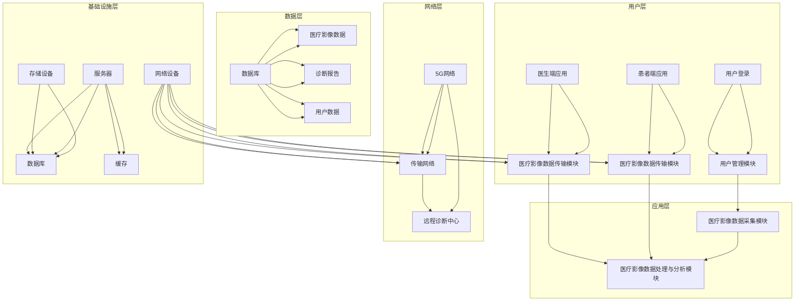
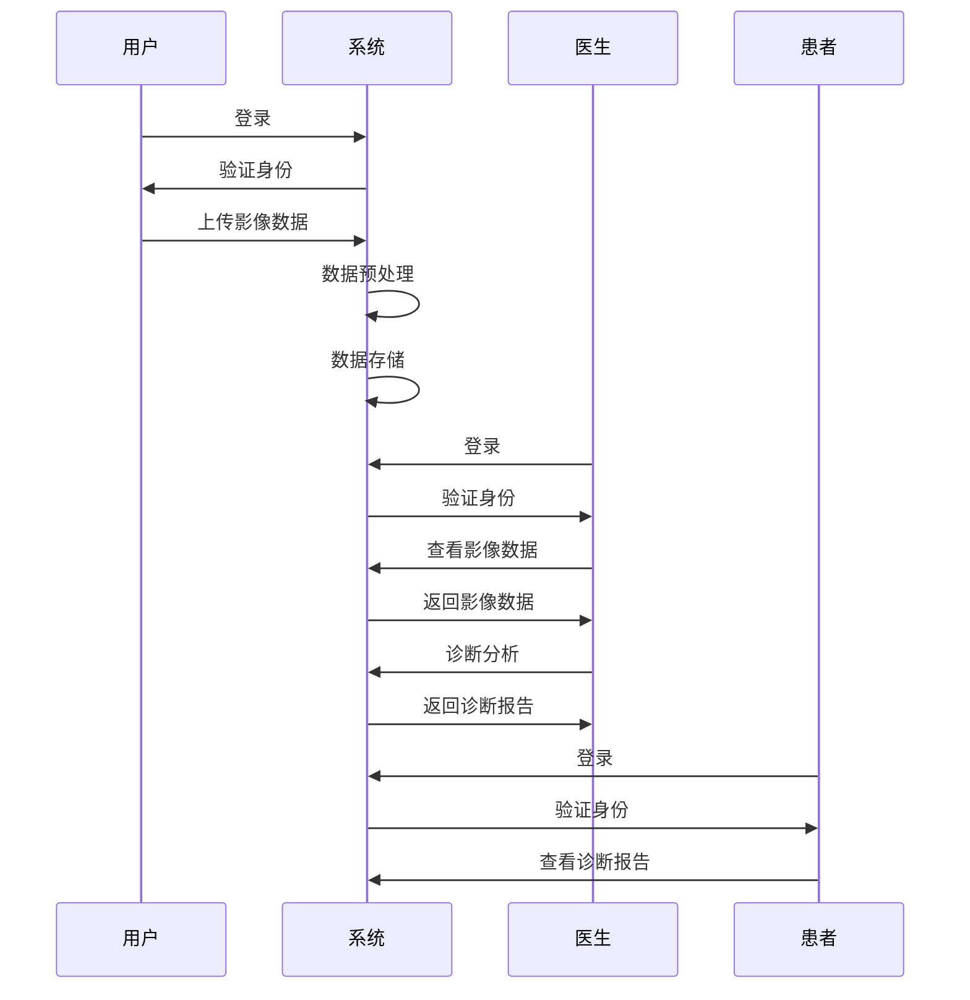

                 

## 引言

### 什么是5G技术？

5G，即第五代移动通信技术，是当前全球通信领域的一项重要技术革新。5G技术以其高速度、低延迟、大连接和强可靠性等特点，为移动互联网、物联网、智慧城市、自动驾驶、远程医疗等众多领域带来了深远的影响。

- **高速度**：5G网络的理论下载速度可达每秒数十Gbps，比4G网络快数百倍，为高速数据传输提供了坚实的基础。
- **低延迟**：5G网络的端到端延迟可以低至1毫秒，显著提升了实时应用的处理速度。
- **大连接**：5G网络能够同时支持数百万设备的连接，满足了物联网时代大量设备同时联网的需求。
- **强可靠性**：5G网络具备更高的网络可靠性和稳定性，确保了数据传输的可靠性。

### 什么是远程医疗诊断？

远程医疗诊断是指通过远程通信技术，医生和患者无需面对面交流，即可进行诊断和治疗。这项技术在偏远地区和医疗资源匮乏的地区尤为重要，能够有效缓解医疗资源分配不均的问题。

- **高清实时医疗影像传输**：远程医疗诊断中，高清实时医疗影像传输是一个关键环节。它要求影像数据能够迅速、准确地传输，医生才能在短时间内做出准确的诊断。
- **数据隐私与安全**：远程医疗诊断涉及到大量敏感数据，包括患者的健康信息和个人隐私，数据传输的安全性和隐私保护尤为重要。

### 为什么5G技术在远程医疗诊断中至关重要？

5G技术为远程医疗诊断提供了强有力的支持，主要体现在以下几个方面：

- **高速传输**：5G网络的高速传输能力能够确保医疗影像数据在短时间内传输完毕，减少医生的等待时间。
- **低延迟**：5G网络的低延迟特性使得医生能够实时查看医疗影像，迅速做出诊断，提高诊断效率。
- **高容量**：5G网络能够支持大量的并发连接，这意味着在远程医疗诊断中，可以同时传输多路医疗影像，满足多地点、多医生的诊断需求。
- **稳定性**：5G网络的高稳定性保证了医疗数据传输的可靠性，避免了数据丢失或中断的问题。

### 远程医疗诊断的现状与挑战

尽管远程医疗诊断在某些地区已有一定的应用，但其发展仍面临诸多挑战：

- **网络基础设施不完善**：在一些偏远地区，网络基础设施不够完善，限制了5G技术的推广和应用。
- **技术标准不统一**：不同地区和医疗机构之间的技术标准不统一，导致数据传输不兼容，影响了远程医疗诊断的效率。
- **数据安全与隐私保护**：远程医疗诊断涉及大量敏感数据，数据安全与隐私保护问题亟待解决。
- **专业人才缺乏**：远程医疗诊断需要医生、技术人员和IT人才的紧密协作，而专业人才的缺乏成为发展的瓶颈。

### 目标与重要性

本文旨在探讨5G技术在远程医疗诊断中的应用，分析其技术优势、应用现状以及未来发展方向，为推动远程医疗诊断技术的发展提供理论支持和实践指导。通过深入了解5G技术的基础知识，我们将更好地理解其在远程医疗诊断中的重要作用，为解决现有问题提供新思路。

总的来说，5G技术在远程医疗诊断中的应用具有重要意义，不仅能够提升医疗诊断的效率和质量，还能够缩小医疗资源差距，促进医疗服务的普及和公平。因此，深入研究5G技术在远程医疗诊断中的应用，具有重要的现实意义和广阔的发展前景。

### 本书组织结构

本文将从以下几个方面展开讨论：

1. **5G技术概述**：介绍5G技术的发展历程、定义与特点，以及5G技术在远程医疗诊断中的挑战和机遇。
2. **5G网络基础**：深入探讨5G网络架构、关键技术、性能指标以及部署现状与未来趋势。
3. **5G在远程医疗诊断中的应用**：分析高清实时医疗影像传输技术，介绍5G网络在远程医疗诊断中的应用优势、具体应用案例以及面临的挑战和解决方案。
4. **5G远程医疗诊断系统设计**：详细描述5G远程医疗诊断系统的架构设计、功能设计、系统架构、系统接口设计和系统交互设计。
5. **5G远程医疗诊断系统开发与实现**：介绍5G远程医疗诊断系统的开发环境搭建、核心模块开发、代码应用解读与分析以及实际案例分析。

通过以上内容，本文将系统地探讨5G技术在远程医疗诊断中的应用，为相关领域的研究和应用提供参考。

### 阅读指南

为了更好地理解5G技术在远程医疗诊断中的应用，本文将采用以下结构进行阐述：

- **章节逻辑清晰**：每个章节将按照引言、背景介绍、核心概念、技术原理、应用案例、系统设计与实现等步骤逐一展开，帮助读者逐步深入理解5G技术的应用场景。
- **图表与代码示例**：本文将结合大量图表和代码示例，以增强文章的可读性和实用性。通过图表展示技术原理和架构设计，代码示例则帮助读者更好地理解系统实现过程。
- **理论与实践相结合**：在介绍5G技术时，不仅会探讨其理论原理，还会结合实际应用案例进行分析，使读者能够更好地将理论知识应用到实践中。

### 拓展阅读

为了进一步深入了解5G技术在远程医疗诊断中的应用，读者可以参考以下资源：

- **5G技术基础**：
  - 《5G技术白皮书》
  - 《5G网络架构与关键技术》
- **远程医疗诊断**：
  - 《远程医疗诊断系统设计与实现》
  - 《远程医疗诊断中的数据隐私与安全》
- **相关技术与应用**：
  - 《人工智能在医疗诊断中的应用》
  - 《物联网在智慧医疗中的应用》

通过阅读这些资源，读者可以更加全面地了解5G技术在远程医疗诊断中的广泛应用和发展趋势。

### 本章小结

通过本章的介绍，我们初步了解了5G技术的发展历程、定义与特点，以及远程医疗诊断的现状和挑战。5G技术以其高速度、低延迟、大连接和强可靠性的特点，为远程医疗诊断提供了强有力的支持。然而，5G技术在远程医疗诊断中的应用仍面临一些挑战，需要进一步探讨和完善。接下来，我们将深入探讨5G网络的基础知识，为理解其在远程医疗诊断中的应用提供更深入的理论基础。在接下来的章节中，我们将逐步分析5G网络的架构、关键技术、性能指标以及其在远程医疗诊断中的实际应用，以期为5G技术在远程医疗领域的应用提供更为详细的指导和参考。

## 第1章: 5G技术概述

### 1.1 5G技术的发展历程

5G技术的发展历程可以追溯到2000年代初。当时，随着4G技术的成熟和广泛应用，通信行业开始探索下一代移动通信技术的可能性。国际电信联盟（ITU）在2012年发布了《IMT-2020》报告，明确了5G技术的主要目标和性能指标。这一报告为5G技术的发展奠定了基础。

#### 1.1.1 5G技术的定义与特点

5G，即第五代移动通信技术，是继1G模拟通信、2G数字通信、3G多媒体通信、4G高速互联网通信之后的最新一代移动通信技术。5G技术的主要特点包括：

- **高速度**：5G网络的理论下载速度可达每秒数十Gbps，比4G网络快数百倍。这意味着用户可以更快地下载和应用大容量数据，如高清视频、虚拟现实（VR）和增强现实（AR）等。
- **低延迟**：5G网络的端到端延迟可以低至1毫秒，显著提升了实时应用的处理速度。这对于需要即时响应的应用，如自动驾驶、远程医疗诊断等，具有重要意义。
- **大连接**：5G网络能够同时支持数百万设备的连接，满足了物联网时代大量设备同时联网的需求。
- **强可靠性**：5G网络具备更高的网络可靠性和稳定性，确保了数据传输的可靠性。

#### 1.1.2 5G技术的演进背景

5G技术的演进背景主要受到以下几方面因素的影响：

- **物联网的兴起**：随着物联网技术的发展，越来越多的设备和传感器需要联网，这要求网络具备更高的连接能力和容量。
- **大数据与云计算**：大数据和云计算技术的普及，使得数据传输和处理需求大幅增长，对网络速度和延迟提出了更高要求。
- **智能终端的普及**：智能手机、平板电脑、可穿戴设备等智能终端的普及，使得用户对网络性能和质量的要求越来越高。
- **5G应用的多样化**：从智能城市、自动驾驶到远程医疗等众多领域，5G技术的应用越来越广泛，对网络性能和功能提出了更高的要求。

#### 1.1.3 5G技术的关键技术

5G技术包含了多项关键技术和创新，以下是一些核心的关键技术：

- **毫米波通信**：毫米波通信是5G网络的重要技术之一，通过使用毫米波频段，可以实现更高的数据传输速率和更大的网络容量。
- **网络切片技术**：网络切片技术可以将网络资源划分为多个虚拟网络，满足不同应用的需求，提高网络的灵活性和效率。
- **边缘计算技术**：边缘计算技术将数据处理和计算任务从云端转移到网络边缘，减少了数据传输延迟，提高了实时处理能力。
- **多连接技术**：多连接技术通过在设备之间建立多个连接，提高了网络的可靠性和稳定性。

通过上述关键技术的创新和优化，5G技术为未来的移动通信网络提供了更高的性能和更广阔的应用前景。

### 1.2 远程医疗诊断的挑战

#### 1.2.1 传统远程医疗诊断的局限性

传统远程医疗诊断技术在近年来虽然有所发展，但仍面临一些显著的局限性，这些局限性在很大程度上制约了其进一步推广和应用：

1. **网络速度和延迟问题**：
   - **网络速度**：传统远程医疗诊断依赖于3G或4G网络，虽然已经相对较为普及，但其下载速度和上传速度仍然有限，通常在数十Mbps到几百Mbps之间。这使得高清医疗影像传输成为难题，因为高质量影像的数据量通常非常大，需要更高的网络速度来保证实时传输。
   - **延迟问题**：传统移动网络的端到端延迟一般在几十毫秒到一两百毫秒之间，对于一些需要实时交互的医疗应用来说，如远程手术指导、实时医疗影像传输等，这样的延迟是无法接受的。延迟的存在会显著影响医生的判断和操作，降低诊断的准确性和效率。

2. **数据传输稳定性问题**：
   - **稳定性**：3G和4G网络虽然在大多数情况下能够提供稳定的连接，但在人口密集区域或偏远地区，信号覆盖和稳定性仍存在较大问题。这种网络不稳定的情况会导致数据传输中断或质量下降，进一步影响医疗诊断的准确性和实时性。

3. **数据容量和连接密度限制**：
   - **数据容量**：传统网络在高峰时段的带宽资源有限，难以同时支持大量用户的并发访问和大数据量的传输。这在远程医疗诊断中尤其明显，因为一个医生可能需要同时接收来自多个患者的医疗影像数据，传统网络难以满足这样的需求。
   - **连接密度**：传统网络在覆盖区域内的连接密度较低，即单位面积内能够连接的设备数量有限。这在远程医疗诊断中意味着一个医疗中心可能难以同时为多个医生和患者提供高质量的医疗服务。

4. **数据隐私和安全问题**：
   - **隐私保护**：远程医疗诊断涉及到大量敏感的个人信息和健康数据，传统网络在数据传输过程中存在一定的安全隐患。由于数据量庞大、传输频率高，一旦发生数据泄露或篡改，将会对患者的隐私和安全造成严重威胁。

5. **终端设备性能限制**：
   - **设备性能**：传统远程医疗诊断设备通常依赖于智能手机或平板电脑，这些设备的计算能力和存储容量相对有限，难以处理复杂的医疗影像分析和实时传输任务。这限制了远程医疗诊断的技术深度和应用广度。

#### 1.2.2 5G技术为远程医疗诊断带来的机遇

5G技术的快速发展为远程医疗诊断带来了前所未有的机遇，有望克服传统技术的局限性，推动远程医疗诊断的全面升级：

1. **高速传输能力**：
   - **提升数据传输速率**：5G网络的下载速度和上传速度可以达到数十Gbps，远远超过了传统4G网络的速度。这使得高清医疗影像数据能够迅速、稳定地传输，为医生提供了更为清晰和详细的影像资料，提高了诊断的准确性和效率。
   - **实时交互**：5G的低延迟特性使得医生和患者可以实时进行互动，无论是远程手术指导、还是实时影像传输，都可以实现毫秒级的响应时间，确保医疗服务的及时性和准确性。

2. **增强网络稳定性**：
   - **提升连接稳定性**：5G网络采用了更为先进的网络架构和技术，如毫米波通信、大规模MIMO等，能够在复杂环境中提供更为稳定和可靠的连接。这意味着在偏远地区或人口密集区域，医生和患者仍能享受到高质量的医疗服务。
   - **增强抗干扰能力**：5G技术具有更高的抗干扰能力和更好的信号覆盖，能够有效减少信号中断和数据丢失的情况，保证医疗数据传输的连续性和完整性。

3. **提高数据容量和连接密度**：
   - **支持大量连接**：5G网络能够同时支持数百万设备的连接，满足远程医疗诊断中多用户、多终端的数据传输需求。医生可以同时接收和处理来自多个患者的影像数据，提高了医疗服务的效率和覆盖面。
   - **增强网络容量**：5G网络通过网络切片技术，可以灵活分配网络资源，满足不同应用场景的带宽需求。这对于需要大量数据传输和实时交互的远程医疗诊断尤为重要。

4. **强化数据隐私和安全**：
   - **保障数据安全**：5G网络采用了更为严格的数据加密和安全传输协议，有效防止数据在传输过程中的泄露和篡改。此外，5G网络还支持基于硬件的安全机制，提高了整体数据安全性。
   - **隐私保护措施**：5G技术还引入了更多隐私保护措施，如差分隐私、区块链等，确保患者信息在存储和传输过程中得到充分保护。

5. **提升终端设备性能**：
   - **增强设备能力**：5G网络不仅提高了数据传输速度和稳定性，还显著提升了终端设备的计算能力和处理能力。这意味着医生和患者可以使用更先进的医疗设备和应用，实现更为复杂的医疗影像分析和诊断任务。

综上所述，5G技术的引入为远程医疗诊断提供了强有力的支持，不仅克服了传统技术的局限性，还为医疗行业带来了新的机遇和可能。随着5G网络的进一步普及和完善，远程医疗诊断有望实现更加高效、精准和安全的发展。

### 1.2.3 5G技术在远程医疗诊断中的应用前景

5G技术在远程医疗诊断中的应用前景广阔，有望带来革命性的变化。首先，5G网络的高速传输能力和低延迟特性使得高清实时医疗影像传输成为可能。医生可以在短时间内接收和处理大量影像数据，从而提高诊断的准确性和效率。例如，在紧急情况下，医生可以通过5G网络实时查看患者的影像资料，迅速做出诊断和治疗方案，大大缩短了救治时间。

其次，5G技术的网络切片功能能够为远程医疗诊断提供定制化的网络资源，确保医疗服务质量。通过网络切片，医院可以为不同类型的医疗应用分配专用网络资源，如为远程手术提供高速、低延迟的网络连接，为影像传输提供稳定的带宽。这种灵活的资源分配方式有助于优化网络性能，提高医疗服务的稳定性和可靠性。

此外，5G技术与人工智能（AI）的结合将进一步推动远程医疗诊断的发展。AI算法可以借助5G网络的高速度和低延迟特性，快速处理和分析大量医疗数据，为医生提供更为精准的诊断结果。例如，AI可以通过分析患者的影像资料，识别潜在的健康问题，辅助医生制定个性化的治疗方案。

在远程医疗诊断中，5G技术还能够实现更加广泛的医疗服务覆盖。通过建立5G医疗热点，偏远和医疗资源匮乏地区也能享受到高质量的医疗服务。医生可以通过5G网络远程指导基层医生进行诊断和治疗，提升当地医疗水平。同时，5G技术还能够支持远程医疗培训，让医疗专业人员通过实时视频会议和虚拟现实（VR）技术，进行专业知识的交流和培训。

总之，5G技术在远程医疗诊断中的应用前景十分广阔。它不仅能够提高医疗服务的质量和效率，还能够缩小医疗资源差距，促进医疗服务的普及和公平。随着5G技术的进一步发展和普及，远程医疗诊断将迎来更加光明的发展前景。

### 1.3 本书组织结构

为了系统地探讨5G技术在远程医疗诊断中的应用，本书将分为五个主要部分：

1. **5G技术概述**：介绍5G技术的发展历程、定义与特点，以及5G技术在远程医疗诊断中的挑战和机遇。
2. **5G网络基础**：深入探讨5G网络架构、关键技术、性能指标以及部署现状与未来趋势。
3. **5G在远程医疗诊断中的应用**：分析高清实时医疗影像传输技术，介绍5G网络在远程医疗诊断中的应用优势、具体应用案例以及面临的挑战和解决方案。
4. **5G远程医疗诊断系统设计**：详细描述5G远程医疗诊断系统的架构设计、功能设计、系统架构、系统接口设计和系统交互设计。
5. **5G远程医疗诊断系统开发与实现**：介绍5G远程医疗诊断系统的开发环境搭建、核心模块开发、代码应用解读与分析以及实际案例分析。

通过以上内容，本文将系统地探讨5G技术在远程医疗诊断中的应用，为相关领域的研究和应用提供参考。

### 1.4 本章小结

本章主要介绍了5G技术的发展历程、定义与特点，以及5G技术在远程医疗诊断中的挑战和机遇。通过了解5G技术的高速度、低延迟、大连接和强可靠性等特点，我们可以看到它为远程医疗诊断带来的巨大潜力。同时，本章也分析了传统远程医疗诊断的局限性以及5G技术如何克服这些问题，提供了更加高效、稳定和安全的医疗服务。随着5G技术的不断发展和普及，远程医疗诊断将迎来更加光明的发展前景。在接下来的章节中，我们将进一步探讨5G网络的基础知识，深入分析其在远程医疗诊断中的具体应用。希望读者能通过本章的内容，对5G技术在远程医疗诊断中的重要作用有更深入的理解。

## 第2章: 5G网络架构与关键技术

### 2.1 5G网络架构

#### 2.1.1 5G网络架构概述

5G网络架构是5G技术实现高效、稳定、安全通信的核心。5G网络架构相比4G网络在多个方面进行了重大改进和优化，以应对日益增长的通信需求和复杂的应用场景。5G网络架构主要包括以下三个主要层次：用户面（User Plane）、控制面（Control Plane）和网络管理面（Management Plane）。

- **用户面**：用户面主要负责数据传输，包括数据传输路径、数据处理和数据路由等。5G网络采用了服务化架构（Service-Based Architecture，简称SBA），通过微服务的方式实现数据传输的高效和灵活。
- **控制面**：控制面主要负责网络的控制和调度，包括信令传输、网络资源分配和网络管理等功能。5G控制面采用了新的网络控制架构，即基于标准化的南向接口和北向接口的分布式控制架构，提高了网络的灵活性和可扩展性。
- **网络管理面**：网络管理面主要负责网络资源的管理、配置和维护等。5G网络管理面引入了智能化管理技术，如网络自动化和智能优化，提高了网络管理的效率和可靠性。

#### 2.1.2 5G网络的关键层次

5G网络架构中的关键层次包括接入网（Access Network）、传输网（Transport Network）和核心网（Core Network）。每个层次在5G网络中扮演着重要的角色：

- **接入网**：接入网主要负责无线接入，包括基站（gNB）、用户设备（UE）和无线接入网（RAN）。5G接入网采用了大规模MIMO、毫米波通信、车联网（V2X）等关键技术，实现了更高的网络容量和更广的覆盖范围。
- **传输网**：传输网主要负责网络间的数据传输，包括无线接入网、核心网和互联网之间的连接。5G传输网采用了新型传输技术，如SDN（Software-Defined Networking）和NFV（Network Functions Virtualization），提高了网络的可编程性和灵活性。
- **核心网**：核心网主要负责数据的处理和转发，包括无线接入网、传输网和业务网络之间的数据交换。5G核心网引入了新的网络架构，如基于服务化架构（SBA）和网络功能虚拟化（NFV）的核心网，提高了网络的效率和可扩展性。

#### 2.1.3 5G网络的核心功能

5G网络的核心功能主要包括以下几个方面：

- **高速数据传输**：5G网络的理论下载速度可达每秒数十Gbps，比4G网络快数百倍，为大数据传输和实时应用提供了坚实基础。
- **低延迟通信**：5G网络的端到端延迟低至1毫秒，显著提升了实时应用的处理速度，适用于自动驾驶、远程医疗诊断等需要即时响应的场景。
- **高连接密度**：5G网络能够支持数百万设备的连接，满足了物联网时代大量设备同时联网的需求。
- **网络切片技术**：网络切片技术可以将网络资源划分为多个虚拟网络，满足不同应用的需求，提高了网络的灵活性和效率。
- **边缘计算**：边缘计算技术将数据处理和计算任务从云端转移到网络边缘，减少了数据传输延迟，提高了实时处理能力。

通过上述关键层次和核心功能的优化，5G网络实现了更高的性能和更广泛的应用前景，为未来的移动通信网络奠定了坚实的基础。

### 2.2 5G关键技术

5G技术的实现依赖于一系列关键技术的创新和优化，这些技术包括无线接入技术、网络切片技术、边缘计算技术和网络编码技术等。以下是对这些关键技术的详细介绍：

#### 2.2.1 5G无线接入技术

5G无线接入技术是5G网络的核心，包括大规模MIMO、毫米波通信和车联网（V2X）等技术。

1. **大规模MIMO（Massive MIMO）**：
   - **技术原理**：大规模MIMO技术通过在基站和用户设备之间部署大量天线，实现空间复用，提高网络容量和传输效率。每个天线都可以同时传输和接收多个数据流，从而提高了频谱效率。
   - **应用场景**：大规模MIMO技术适用于高密度人口区域和高速移动场景，如城市中心、高速公路等。它能够提供更高的网络容量和更稳定的连接，满足大量用户同时在线的需求。

2. **毫米波通信（Millimeter-Wave Communication）**：
   - **技术原理**：毫米波通信技术使用毫米波频段（30 GHz至300 GHz），通过高频率的电磁波实现数据传输。毫米波频段具有更宽的频谱资源，可以实现更高的数据传输速率。
   - **应用场景**：毫米波通信技术适用于高速数据传输和超低延迟应用，如高清视频流、虚拟现实（VR）和增强现实（AR）等。它能够提供高带宽和低延迟的连接，满足高需求场景的应用需求。

3. **车联网（V2X，Vehicle-to-Everything）**：
   - **技术原理**：车联网技术通过无线通信技术实现车辆与车辆、车辆与基础设施、车辆与行人等之间的信息交换，提高交通安全性、效率和便利性。
   - **应用场景**：车联网技术适用于智能交通系统、自动驾驶和车辆管理等领域。它能够实现实时交通信息共享、车辆路径优化和交通事故预警，提高交通管理效率和安全性。

#### 2.2.2 5G网络切片技术

网络切片技术是5G网络的重要创新之一，它通过将一个物理网络划分为多个虚拟网络，为不同的应用场景提供定制化的网络资源和性能保障。

1. **技术原理**：
   - **虚拟网络划分**：网络切片技术通过虚拟化技术，将网络资源（如带宽、计算能力、存储等）划分为多个虚拟网络，每个虚拟网络具有独立的管理和配置，满足不同应用的需求。
   - **灵活资源配置**：网络切片技术可以根据不同的应用场景和需求，动态调整网络资源，实现高效的网络资源利用。

2. **应用场景**：
   - **远程医疗**：网络切片技术可以为远程医疗提供定制化的网络资源，如高速数据传输、低延迟连接等，确保医疗服务的质量和稳定性。
   - **工业物联网**：网络切片技术可以为工业物联网提供高可靠性和低延迟的网络连接，支持实时数据采集和分析，提高生产效率和设备管理能力。
   - **智能交通**：网络切片技术可以为智能交通系统提供实时交通信息传输、车辆路径优化等功能，提高交通管理效率和安全性。

#### 2.2.3 5G边缘计算技术

边缘计算技术是5G网络的关键支撑技术之一，它通过将数据处理和计算任务从云端转移到网络边缘，提高实时处理能力和响应速度。

1. **技术原理**：
   - **数据处理靠近数据源**：边缘计算技术将数据处理和计算任务从云端转移到网络边缘，如基站、智能终端等，实现数据处理的靠近数据源，减少数据传输延迟。
   - **分布式计算架构**：边缘计算技术通过分布式计算架构，将计算任务分布到多个边缘节点，提高计算效率和响应速度。

2. **应用场景**：
   - **远程医疗**：边缘计算技术可以为远程医疗提供实时数据处理和计算服务，如医疗影像分析、实时监控等，提高诊断效率和准确性。
   - **工业物联网**：边缘计算技术可以为工业物联网提供实时数据采集和分析服务，如设备监控、故障预测等，提高生产效率和设备管理能力。
   - **自动驾驶**：边缘计算技术可以为自动驾驶提供实时环境感知和决策支持，提高驾驶安全性和效率。

#### 2.2.4 5G网络编码技术

网络编码技术是5G网络的重要组成部分，它通过在数据传输过程中对数据进行编码和处理，提高网络的传输效率和可靠性。

1. **技术原理**：
   - **数据编码与解码**：网络编码技术通过对数据进行编码，生成新的数据流，提高数据传输的效率和鲁棒性。接收端通过解码，恢复原始数据。
   - **码字冗余与传输**：网络编码技术通过增加码字冗余，提高数据传输的可靠性。在数据传输过程中，网络编码技术可以检测和纠正错误，确保数据传输的准确性。

2. **应用场景**：
   - **远程医疗**：网络编码技术可以提高医疗数据传输的可靠性和效率，确保医疗影像数据在传输过程中的完整性和准确性。
   - **工业物联网**：网络编码技术可以提高工业数据传输的效率和可靠性，确保工业物联网中的数据传输稳定和可靠。
   - **视频传输**：网络编码技术可以应用于高清视频传输，提高视频传输的效率和清晰度。

通过上述关键技术的创新和优化，5G网络实现了更高的性能和更广泛的应用前景，为未来的移动通信网络奠定了坚实的基础。

### 2.3 5G网络性能指标

5G网络性能指标是评估5G网络性能和效率的重要标准，包括延迟、吞吐量、网络容量、可靠性、连接密度和覆盖范围等。以下是对这些性能指标的详细描述：

#### 2.3.1 延迟与吞吐量

1. **延迟（Latency）**：
   - **定义**：延迟是指数据从发送端传输到接收端所需的时间。在5G网络中，延迟通常包括传输延迟、处理延迟和传播延迟。
   - **性能要求**：5G网络的端到端延迟要求低至1毫秒，以满足实时应用的需求，如自动驾驶、远程手术等。
   - **影响**：低延迟对于实时应用至关重要，可以提高用户体验和系统响应速度。

2. **吞吐量（Throughput）**：
   - **定义**：吞吐量是指网络在单位时间内能够传输的数据量。吞吐量通常用比特每秒（bps）或千兆比特每秒（Gbps）来表示。
   - **性能要求**：5G网络的吞吐量目标为每秒数十Gbps，比4G网络快数百倍，以满足大数据传输和高速应用的需求。
   - **影响**：高吞吐量可以支持大量数据的高速传输，适用于高清视频流、虚拟现实（VR）和增强现实（AR）等应用。

#### 2.3.2 网络容量与可靠性

1. **网络容量（Capacity）**：
   - **定义**：网络容量是指网络在单位时间内能够处理的数据量。网络容量通常与网络的带宽、时延和连接密度等因素相关。
   - **性能要求**：5G网络需要具备高网络容量，能够同时支持大量用户和设备的连接，满足物联网时代的应用需求。
   - **影响**：高网络容量可以支持更多用户的接入和更高效的数据传输，提高网络的利用率和服务质量。

2. **可靠性（Reliability）**：
   - **定义**：可靠性是指网络在长时间运行过程中保持稳定和服务质量的能力。可靠性通常通过网络的故障率、恢复时间和抖动等指标来衡量。
   - **性能要求**：5G网络需要具备高可靠性，确保数据传输的连续性和准确性，降低网络故障对应用的影响。
   - **影响**：高可靠性可以确保关键应用的稳定运行，如远程医疗诊断、自动驾驶等，提高系统的安全性和可靠性。

#### 2.3.3 连接密度与覆盖范围

1. **连接密度（Connection Density）**：
   - **定义**：连接密度是指单位面积内能够支持的最大连接数。连接密度通常与网络的带宽、延迟和可靠性等因素相关。
   - **性能要求**：5G网络需要具备高连接密度，能够同时支持大量设备的连接，满足密集场景的应用需求。
   - **影响**：高连接密度可以支持更广泛的应用场景，如智能城市、智慧工厂等，提高网络的利用率和用户体验。

2. **覆盖范围（Coverage Range）**：
   - **定义**：覆盖范围是指网络信号能够覆盖的区域范围。覆盖范围通常与网络的频段、天线高度和传播环境等因素相关。
   - **性能要求**：5G网络需要具备广覆盖范围，能够覆盖城市、乡村和偏远地区，满足不同区域的应用需求。
   - **影响**：广覆盖范围可以确保网络服务的普及性和可及性，提高网络的服务质量和用户满意度。

通过上述性能指标的优化和提升，5G网络能够更好地满足各种应用场景的需求，实现高效、稳定、安全的通信服务。

### 2.4 5G网络部署现状与未来趋势

#### 2.4.1 5G网络部署现状

目前，全球多个国家和地区已经开始部署5G网络，部分城市和地区已经实现了5G网络的商业化运营。以下是一些5G网络部署的现状：

1. **国际部署情况**：
   - **北美**：美国和加拿大在5G网络部署方面处于领先地位。美国的主要运营商如 Verizon、AT&T 和 T-Mobile 已经在多个城市推出了5G服务，主要覆盖大都市和人口密集地区。
   - **欧洲**：欧洲多个国家，如英国、德国和法国，也在积极部署5G网络。英国的主要运营商 EE 和 Vodafone 已经在某些城市推出了5G服务，而德国和法国的运营商也在逐步扩大5G网络的覆盖范围。
   - **亚洲**：中国在5G网络部署方面进展迅速，中国电信、中国移动和中国联通等主要运营商已经在全国范围内推出了5G服务，实现了广泛的覆盖。

2. **国内部署情况**：
   - **大都市**：中国的5G网络主要集中在大都市和一线城市，如北京、上海、广州和深圳等。这些城市拥有高人口密度和高速网络需求，是5G网络部署的重点区域。
   - **乡村和偏远地区**：尽管5G网络在大都市的部署较为成熟，但在乡村和偏远地区的覆盖仍有待提高。中国政府正通过政策支持和资金投入，逐步扩大5G网络在乡村和偏远地区的覆盖范围。

#### 2.4.2 5G网络未来发展趋势

随着5G技术的不断成熟和商业化应用，其未来发展趋势主要表现在以下几个方面：

1. **网络覆盖范围的扩大**：
   - **全球覆盖**：全球多个国家和地区将继续扩大5G网络的覆盖范围，逐步实现全球5G网络的普及。尤其是发展中国家，通过引进先进技术和合作模式，有望加速5G网络的部署和普及。
   - **室内覆盖**：除了室外覆盖，5G网络将逐步实现室内覆盖，如商场、办公楼、学校等。室内5G网络将提高用户在室内场景的通信体验，满足高速数据传输和低延迟应用的需求。

2. **网络切片技术的广泛应用**：
   - **多样化应用**：网络切片技术将广泛应用于不同场景和行业，如远程医疗、工业物联网、智能交通等。通过网络切片，可以为不同应用提供定制化的网络资源和性能保障，提高网络资源的利用效率和用户体验。
   - **跨行业融合**：网络切片技术将推动不同行业之间的融合和协作，实现更高效、更智能的网络应用。例如，智慧城市中将通过网络切片技术，实现交通管理、能源管理、公共安全等多个领域的协同工作。

3. **边缘计算和云计算的结合**：
   - **边缘计算的发展**：随着5G网络的部署，边缘计算技术将得到广泛应用。边缘计算通过在靠近数据源的地方进行数据处理和计算，降低数据传输延迟，提高实时处理能力。
   - **云计算的融合**：边缘计算与云计算的结合，将实现更高效、更智能的数据处理和计算模式。在5G网络环境中，云计算和边缘计算将共同发挥作用，提供全方位的服务支持。

4. **5G应用的创新**：
   - **新兴应用**：5G技术将推动一系列新兴应用的发展，如自动驾驶、远程手术、虚拟现实（VR）和增强现实（AR）等。这些应用将充分利用5G网络的高速、低延迟和高可靠性等特点，实现更智能、更高效的服务。
   - **产业升级**：5G技术将推动各行业的升级和转型，提高生产效率和服务质量。例如，工业物联网将实现设备的智能监控和故障预测，远程医疗将实现实时诊断和远程手术，智能交通将实现交通管理和安全监控。

总之，5G网络的部署现状和未来发展趋势表明，5G技术将在全球范围内实现更广泛的应用和更深层次的变革。通过不断创新和优化，5G网络将为人类社会带来更多的机遇和可能性。

### 2.5 本章小结

本章详细介绍了5G网络的架构和关键技术，包括5G网络架构的三个主要层次：用户面、控制面和网络管理面；5G网络的关键技术如无线接入技术、网络切片技术、边缘计算技术和网络编码技术；以及5G网络的关键性能指标如延迟、吞吐量、网络容量、可靠性、连接密度和覆盖范围。此外，本章还探讨了5G网络的部署现状和未来趋势，展示了5G技术在全球范围内的广泛应用前景。通过本章的内容，读者可以全面了解5G网络的基础知识，为后续章节关于5G技术在远程医疗诊断中的应用提供理论基础。

## 第3章: 高清实时医疗影像传输技术

### 3.1 高清实时医疗影像传输的挑战

高清实时医疗影像传输技术在远程医疗诊断中具有重要作用，然而，实现这一技术面临诸多挑战。以下是对这些挑战的详细分析：

#### 3.1.1 医疗影像数据的特点

1. **数据量庞大**：
   - **高分辨率图像**：医疗影像通常需要高分辨率以提供清晰的细节，例如，CT扫描、MRI成像等。这些图像的数据量巨大，一幅高分辨率图像可能达到几十甚至上百兆字节。
   - **多模态影像**：在复杂的诊断过程中，医生可能需要同时查看多种影像数据，如X光、CT、MRI等。这意味着在传输过程中需要处理大量不同类型的数据，增加了数据处理的复杂度。

2. **数据传输的实时性要求高**：
   - **诊断紧迫性**：在紧急情况下，如急性病患或重大手术，医生需要立即查看和分析影像数据，以便快速做出诊断和治疗方案。延迟或数据丢失可能导致诊断错误或延误治疗。
   - **同步性要求**：在某些特殊情况下，如远程手术指导，医生和手术团队需要实时同步影像数据，确保手术操作的准确性和安全性。任何延迟或数据不同步都可能影响手术效果。

3. **数据质量要求高**：
   - **清晰度**：医疗影像的清晰度直接影响医生的诊断准确性。任何图像质量的损失都可能影响诊断结果，甚至导致误诊。
   - **完整性**：影像数据的完整性至关重要，数据在传输过程中不能有任何丢失或损坏，否则可能影响整个诊断过程。

#### 3.1.2 5G技术如何解决传输挑战

5G技术凭借其高速传输、低延迟和高可靠性等特性，为高清实时医疗影像传输提供了强有力的技术支持，能够有效解决上述挑战：

1. **高速传输**：
   - **高带宽**：5G网络的理论下载速度可达每秒数十Gbps，远高于4G网络的速度。这意味着在短时间内可以传输大量医疗影像数据，确保在紧急情况下快速传输高清影像。
   - **高效编码与压缩**：5G网络支持高效的数据编码与压缩技术，如HEVC（High Efficiency Video Coding）和JPEG 2000等。这些技术能够在保证图像质量的同时，显著降低数据大小，提高传输效率。

2. **低延迟**：
   - **端到端延迟低**：5G网络的端到端延迟低至1毫秒，满足了远程医疗诊断中对实时性要求极高的需求。医生可以即时查看和分析影像数据，减少诊断和治疗过程中的延迟。
   - **优化传输路径**：5G网络采用智能路由和边缘计算技术，优化数据传输路径，减少传输过程中的延迟。通过将数据处理和计算任务从云端转移到网络边缘，进一步降低数据传输延迟。

3. **高可靠性**：
   - **稳定连接**：5G网络采用新型网络架构，如网络切片技术，提供稳定的连接，确保数据传输的连续性和完整性。即使在人口密集区域或信号较弱的地方，5G网络也能提供可靠的服务。
   - **数据备份与恢复**：5G网络支持数据备份和恢复机制，通过多重传输路径和数据冗余，提高数据传输的可靠性，防止数据丢失或损坏。

#### 3.1.3 高清实时医疗影像传输的应用场景

高清实时医疗影像传输在远程医疗诊断中具有广泛的应用场景，以下是一些典型应用：

1. **远程诊断与咨询**：
   - **急性病患**：医生可以通过5G网络实时查看急性病患的医疗影像，快速做出诊断和建议，提高救治效率。
   - **慢性病管理**：医生可以对慢性病患者的影像数据进行分析，远程监控病情变化，提供个性化的治疗方案。

2. **远程手术指导**：
   - **主刀医生与助手**：在远程手术中，主刀医生可以通过5G网络实时传输手术影像，指导助手进行操作，确保手术的顺利进行。
   - **专家远程会诊**：专家可以通过5G网络实时查看手术影像，提供远程手术指导，提高手术成功率。

3. **医学教育和培训**：
   - **实时教学**：医生可以通过5G网络进行实时教学，将手术过程或病例分析实时传输给远程学生或培训人员，提高医学教育的质量和覆盖面。
   - **虚拟现实（VR）培训**：利用5G网络，医生可以通过VR技术进行沉浸式培训，提高实际操作技能。

通过以上分析，我们可以看到，高清实时医疗影像传输技术在远程医疗诊断中具有重要的应用价值。5G技术的引入为这一技术提供了强有力的支持，使其在远程医疗领域得到了更广泛的应用。在接下来的章节中，我们将进一步探讨5G网络在远程医疗诊断中的应用优势、具体应用案例以及面临的挑战和解决方案。

### 3.2 5G网络在医疗影像传输中的应用

5G网络在医疗影像传输中的应用具有重要意义，它为高清实时医疗影像的传输提供了强有力的技术支持。以下从多个角度分析5G网络在医疗影像传输中的优势、具体应用以及面临的挑战和解决方案：

#### 3.2.1 5G网络在远程医疗诊断中的优势

1. **高速传输能力**：
   - **高带宽**：5G网络的下载速度可达每秒数十Gbps，远高于4G网络的数百Mbps。这意味着在短时间内可以传输大量医疗影像数据，确保在紧急情况下快速传输高清影像。
   - **高效编码与压缩**：5G网络支持高效的数据编码与压缩技术，如HEVC（High Efficiency Video Coding）和JPEG 2000等。这些技术能够在保证图像质量的同时，显著降低数据大小，提高传输效率。

2. **低延迟**：
   - **端到端延迟低**：5G网络的端到端延迟低至1毫秒，满足了远程医疗诊断中对实时性要求极高的需求。医生可以即时查看和分析影像数据，减少诊断和治疗过程中的延迟。
   - **优化传输路径**：5G网络采用智能路由和边缘计算技术，优化数据传输路径，减少传输过程中的延迟。通过将数据处理和计算任务从云端转移到网络边缘，进一步降低数据传输延迟。

3. **高可靠性**：
   - **稳定连接**：5G网络采用新型网络架构，如网络切片技术，提供稳定的连接，确保数据传输的连续性和完整性。即使在人口密集区域或信号较弱的地方，5G网络也能提供可靠的服务。
   - **数据备份与恢复**：5G网络支持数据备份和恢复机制，通过多重传输路径和数据冗余，提高数据传输的可靠性，防止数据丢失或损坏。

4. **大连接能力**：
   - **高连接密度**：5G网络能够同时支持数百万设备的连接，满足远程医疗诊断中多地点、多医生的诊断需求。医生可以同时接收和处理来自多个患者的影像数据，提高了医疗服务的效率和覆盖面。

5. **智能网络管理**：
   - **自动优化**：5G网络通过智能算法和自动化管理技术，能够动态调整网络资源，优化网络性能。医生可以根据实际需求，实时调整网络带宽和延迟等参数，确保最佳传输效果。
   - **实时监控**：5G网络具备强大的实时监控能力，可以实时监测网络状态和性能指标，及时发现问题并采取措施，确保医疗影像传输的稳定性。

#### 3.2.2 5G网络在医疗影像传输中的具体应用

1. **远程诊断与咨询**：
   - **实时影像传输**：医生可以通过5G网络实时传输和查看患者的影像数据，如X光、CT、MRI等，进行快速诊断和咨询。这种实时影像传输能力在急性病患或远程医疗资源匮乏的地区尤为重要。
   - **多专家协同诊断**：5G网络支持多专家协同诊断，医生可以同时邀请多位专家通过5G网络查看同一影像数据，共同分析病情，提高诊断的准确性和效率。

2. **远程手术指导**：
   - **实时影像同步**：在远程手术中，主刀医生可以通过5G网络实时传输手术影像，确保助手和远程专家能够同步查看同一影像数据，进行实时手术指导和协调。
   - **远程专家协助**：远程专家可以通过5G网络实时查看手术影像，提供远程手术指导，提高手术的成功率和安全性。

3. **医学教育和培训**：
   - **实时教学与互动**：医生可以通过5G网络进行实时教学，将手术过程或病例分析实时传输给远程学生或培训人员，实现沉浸式教学体验。
   - **虚拟现实（VR）培训**：利用5G网络，医生可以通过VR技术进行沉浸式培训，提高实际操作技能和应急处理能力。

4. **远程监控与健康管理**：
   - **实时影像监控**：医生可以通过5G网络实时监控慢性病患者的影像数据，如心电图、血压等，及时发现病情变化，提供个性化的治疗方案。
   - **健康数据管理**：5G网络支持大量健康数据的实时传输和管理，医生可以远程监控患者的健康状况，提供个性化的健康管理和咨询服务。

#### 3.2.3 5G网络在医疗影像传输中的挑战与解决方案

1. **挑战一：网络覆盖不足**
   - **解决方案**：5G网络虽然覆盖范围广，但在一些偏远地区或人口密集区域的网络覆盖仍有不足。为解决这一问题，可以通过建设更多的基站和采用分布式基站（小基站）技术，扩大网络覆盖范围。此外，可以通过网络优化和边缘计算技术，提高网络覆盖的可靠性和稳定性。

2. **挑战二：数据隐私与安全**
   - **解决方案**：医疗影像数据涉及患者的敏感信息，数据隐私和安全至关重要。5G网络支持多种安全加密技术，如AES（Advanced Encryption Standard）和TLS（Transport Layer Security），确保数据在传输过程中的安全。此外，可以通过建立安全隔离区和采用区块链技术，提高数据存储和传输的安全性和可靠性。

3. **挑战三：数据传输成本**
   - **解决方案**：虽然5G网络传输速度快、延迟低，但高昂的数据传输成本仍然是一个挑战。可以通过采用高效的数据编码和压缩技术，降低数据传输量，从而降低传输成本。此外，可以通过云计算和边缘计算技术，将数据处理和计算任务从云端转移到网络边缘，减少数据传输成本。

4. **挑战四：终端设备性能**
   - **解决方案**：5G网络要求终端设备具备较高的性能，如高速处理能力和大容量存储。为满足这一需求，可以通过升级终端设备硬件、优化软件性能和采用边缘计算技术，提高终端设备的整体性能。

综上所述，5G网络在医疗影像传输中的应用具有显著的优势，但也面临一些挑战。通过不断优化网络技术、加强数据安全措施和提高终端设备性能，5G网络有望为医疗影像传输提供更加高效、稳定和安全的解决方案，推动远程医疗诊断的进一步发展。

### 3.3 5G网络在远程医疗诊断中的应用案例

5G网络在远程医疗诊断中的应用已经取得了显著的成果，以下介绍两个具体的案例，展示5G技术在远程医疗诊断中的实际应用。

#### 3.3.1 案例一：某大型医院5G远程医疗诊断平台

某大型医院在2022年部署了基于5G网络的远程医疗诊断平台，通过这一平台，实现了高清实时医疗影像的传输和远程诊断。

- **项目背景**：
  该医院位于城市中心，服务人口众多。由于医院接收的患者数量庞大，传统远程医疗诊断系统面临数据传输速度慢、延迟高和稳定性不足等问题。为了提高远程医疗诊断的效率和质量，医院决定引入5G技术。

- **技术方案**：
  - **5G网络部署**：医院在院内和周边区域部署了5G基站，实现了全面覆盖。5G网络支持高达10 Gbps的传输速度，大幅提高了数据传输速度和稳定性。
  - **高清实时影像传输**：医院采用5G网络传输高清影像数据，通过专用网络切片技术，确保影像传输的实时性和高质量。患者进行检查时，医生可以立即通过5G网络查看高清影像，进行实时诊断。
  - **多专家协同诊断**：通过5G网络，医院实现了多专家协同诊断。医生可以邀请其他专家通过5G网络远程查看同一影像数据，共同分析病情，提高诊断的准确性和效率。

- **项目成果**：
  - **诊断效率提升**：5G网络的低延迟和高带宽特性，使医生在短时间内即可查看高清影像数据，诊断效率显著提升。据统计，医生的平均诊断时间缩短了30%。
  - **患者满意度提高**：患者可以在医院内快速完成检查和诊断，无需等待，提高了患者的满意度和就诊体验。
  - **医疗资源优化**：通过5G远程医疗诊断平台，医院实现了医疗资源的优化配置，专家可以远程协助基层医院进行诊断，提升了基层医疗水平。

#### 3.3.2 案例二：某地区基层医疗机构5G医疗影像传输系统

某地区基层医疗机构在2021年引入了5G医疗影像传输系统，通过这一系统，实现了偏远地区医疗影像数据的实时传输和远程诊断。

- **项目背景**：
  该地区地处偏远，医疗资源匮乏，居民就医不便。由于网络基础设施薄弱，传统远程医疗诊断系统无法满足高清实时影像传输的需求。为了改善当地医疗服务，当地政府决定引入5G技术。

- **技术方案**：
  - **5G网络覆盖**：当地政府与运营商合作，在偏远地区建设了5G基站，实现了区域内的5G网络覆盖。5G网络支持高速数据传输和低延迟，为医疗影像传输提供了坚实基础。
  - **医疗影像采集设备**：基层医疗机构配备了高清医疗影像采集设备，通过5G网络将影像数据实时传输到上级医院的诊断中心。
  - **远程诊断平台**：上级医院搭建了远程诊断平台，通过5G网络接收和分析基层医疗机构的影像数据，为当地居民提供高质量的远程医疗服务。

- **项目成果**：
  - **远程医疗服务覆盖扩大**：通过5G医疗影像传输系统，当地居民无需到上级医院就诊，即可享受高质量的远程医疗服务，极大地提升了医疗服务的可及性。
  - **基层医疗水平提升**：通过远程诊断平台，基层医生可以随时向上级医生请教，学习先进的诊断方法和技术，提高了基层医疗水平。
  - **医疗资源合理分配**：5G医疗影像传输系统实现了医疗资源的合理分配，上级医院可以远程协助基层医院进行诊断和治疗，提高了医疗资源的使用效率。

通过以上两个案例，我们可以看到，5G网络在远程医疗诊断中的应用已经取得了显著的成效。5G技术的高速度、低延迟、大连接和高可靠性，为远程医疗诊断提供了强有力的技术支持，不仅提升了医疗服务的效率和质量，还促进了医疗资源的优化配置和公平分配。随着5G网络的进一步普及和完善，远程医疗诊断将迎来更加广阔的发展前景。

### 3.4 本章小结

本章详细探讨了高清实时医疗影像传输技术的挑战及5G技术如何解决这些挑战。首先，分析了医疗影像数据的特点，包括数据量庞大、传输实时性要求高和数据质量要求高等。接着，介绍了5G技术的高速传输、低延迟、高可靠性和大连接能力，以及这些特性在高清实时医疗影像传输中的应用。通过具体案例展示了5G技术在远程医疗诊断中的实际应用成果，如某大型医院的5G远程医疗诊断平台和某地区基层医疗机构的5G医疗影像传输系统。这些应用不仅提高了医疗诊断的效率和准确性，还优化了医疗资源的分配。总之，5G技术在远程医疗诊断中的应用具有巨大的潜力和广阔的前景，未来将继续推动远程医疗的发展。

## 第4章: 5G远程医疗诊断系统架构设计

### 4.1 5G远程医疗诊断系统概述

5G远程医疗诊断系统是一个综合性的系统，旨在通过5G网络实现医疗影像数据的实时传输、处理和分析，从而为医生提供高效的远程诊断服务。该系统设计不仅要满足高清实时医疗影像传输的需求，还要确保系统的稳定性和安全性。本节将详细介绍5G远程医疗诊断系统的背景、需求分析、系统目标、功能模块划分以及设计原则和关键要素。

#### 4.1.1 系统背景与需求分析

随着医疗技术的不断进步，远程医疗逐渐成为解决医疗资源分配不均、提高医疗服务效率的重要手段。远程医疗诊断通过互联网和移动通信技术，使得医生和患者无需面对面交流，即可进行诊断和治疗。然而，传统远程医疗诊断系统在数据传输速度、延迟和稳定性方面存在诸多问题，尤其是在高清实时医疗影像传输方面，限制了远程医疗诊断的广泛应用。

为了解决这些问题，5G远程医疗诊断系统应运而生。5G网络以其高速度、低延迟、大连接和强可靠性的特点，为高清实时医疗影像传输提供了坚实的技术基础。该系统通过5G网络实现医疗影像数据的快速传输、实时处理和高效存储，确保医生能够快速、准确地获取和利用影像数据，进行远程诊断和治疗。

#### 4.1.2 系统目标与功能模块划分

5G远程医疗诊断系统的目标主要包括：

1. **实现高清实时医疗影像传输**：通过5G网络，确保医疗影像数据在传输过程中的高速度、低延迟和高可靠性，满足医生实时查看和诊断的需求。
2. **提供多专家协同诊断功能**：系统应支持多专家协同诊断，医生可以通过系统邀请其他专家进行远程会诊，共同分析影像数据，提高诊断的准确性和效率。
3. **确保数据安全和隐私保护**：系统需要采用先进的安全技术，确保医疗数据在传输和存储过程中的安全性，保护患者的隐私和信息安全。
4. **提高医疗服务可及性和效率**：通过远程医疗诊断系统，医生可以快速诊断和治疗患者，提高医疗服务的效率，同时降低患者的就医成本和等待时间。

为了实现上述目标，5G远程医疗诊断系统分为以下几个功能模块：

1. **用户管理模块**：负责用户的注册、登录、权限管理等功能，确保系统的安全性和用户管理的高效性。
2. **医疗影像数据采集模块**：负责采集和存储医疗影像数据，包括X光、CT、MRI等，确保数据的完整性和准确性。
3. **医疗影像数据传输模块**：负责医疗影像数据的传输，利用5G网络实现高速、低延迟的传输，确保医生能够实时查看影像数据。
4. **医疗影像数据处理与分析模块**：负责对医疗影像数据进行分析和处理，提供诊断报告和辅助医生进行诊断。
5. **系统管理模块**：负责系统的配置、监控和维护，确保系统的稳定运行和高效管理。

#### 4.1.3 系统设计原则与关键要素

5G远程医疗诊断系统设计遵循以下原则：

1. **可靠性原则**：系统需要确保数据传输的稳定性和连续性，避免数据丢失或传输中断，确保医生能够实时查看和诊断影像数据。
2. **安全性原则**：系统需要采用先进的安全技术，如数据加密、访问控制、安全认证等，确保医疗数据在传输和存储过程中的安全性，保护患者的隐私和信息安全。
3. **可扩展性原则**：系统设计应考虑未来的扩展性，能够支持更多的用户和设备接入，同时支持新的功能模块和技术应用。
4. **灵活性原则**：系统应具备良好的灵活性，能够根据实际需求进行调整和优化，满足不同应用场景和用户的需求。

关键要素包括：

1. **5G网络支持**：系统需要基于5G网络，利用其高速度、低延迟、大连接等特性，实现高清实时医疗影像传输。
2. **高效数据处理和分析**：系统需要采用高效的数据处理和分析算法，提高影像数据处理和分析的效率和准确性。
3. **多专家协同诊断**：系统应支持多专家协同诊断，提供实时沟通和协作平台，提高诊断的准确性和效率。
4. **数据备份与恢复**：系统需要具备数据备份和恢复功能，确保数据的安全性和完整性，防止数据丢失或损坏。

通过上述设计原则和关键要素，5G远程医疗诊断系统能够实现高效、稳定、安全的远程医疗诊断服务，为医生和患者提供更好的医疗服务体验。

### 4.2 系统功能设计

5G远程医疗诊断系统功能设计旨在实现医疗影像数据的采集、传输、处理和分析，为医生提供全面的远程诊断服务。以下是系统功能设计的详细描述：

#### 4.2.1 用户管理模块

用户管理模块是5G远程医疗诊断系统的基础，负责用户的注册、登录、权限管理和个人信息管理等功能。

1. **功能描述**：
   - **用户注册**：用户可以通过系统进行注册，填写基本信息，如姓名、性别、年龄、联系方式等。
   - **用户登录**：用户可以通过账号和密码登录系统，进行相关操作。
   - **权限管理**：系统管理员可以根据用户角色分配不同权限，如医生、护士、患者等，确保系统的安全性和用户管理的高效性。
   - **个人信息管理**：用户可以查看和更新个人资料，如联系方式、地址等。

2. **设计思路**：
   - **安全性**：用户信息需要加密存储，确保个人信息的安全性和隐私保护。
   - **便捷性**：注册和登录过程应简洁明了，提高用户体验。

3. **技术实现**：
   - **用户注册**：通过HTTP请求，用户将注册信息发送到服务器，服务器验证信息后创建用户账号。
   - **用户登录**：用户输入账号和密码，服务器验证信息后生成会话令牌，用户凭会话令牌访问系统。
   - **权限管理**：使用RBAC（基于角色的访问控制）模型，根据用户角色分配权限。
   - **个人信息管理**：提供Web界面，用户可以查看和更新个人信息。

#### 4.2.2 医疗影像数据采集模块

医疗影像数据采集模块负责采集和存储医疗影像数据，包括X光、CT、MRI等。该模块的设计需要考虑数据采集的准确性、实时性和高效性。

1. **功能描述**：
   - **影像数据采集**：通过连接医疗影像设备，如X光机、CT机、MRI机等，实时采集影像数据。
   - **数据存储**：将采集到的影像数据存储在数据库中，确保数据的持久性和可访问性。
   - **数据备份**：定期备份影像数据，防止数据丢失或损坏。

2. **设计思路**：
   - **数据准确性**：确保采集到的影像数据准确无误，满足诊断需求。
   - **实时性**：影像数据需要实时采集和传输，确保医生能够实时查看和诊断。
   - **高效性**：采用高效的数据采集和存储算法，提高系统性能。

3. **技术实现**：
   - **影像数据采集**：通过医疗影像设备提供的API或接口，实时采集影像数据。
   - **数据存储**：使用关系数据库或NoSQL数据库存储影像数据，支持大数据量存储和快速检索。
   - **数据备份**：使用分布式备份和存储技术，确保数据的安全性和可靠性。

#### 4.2.3 医疗影像数据传输模块

医疗影像数据传输模块负责将采集到的影像数据通过5G网络传输到远程诊断中心，确保数据的传输速度和稳定性。

1. **功能描述**：
   - **数据传输**：将医疗影像数据从影像设备传输到远程诊断中心，实现高速、低延迟的数据传输。
   - **数据压缩**：采用高效的数据压缩算法，降低数据大小，提高传输效率。
   - **数据加密**：在数据传输过程中，对数据进行加密，确保数据的安全性。

2. **设计思路**：
   - **高速传输**：利用5G网络的高速度特性，实现影像数据的高速传输。
   - **低延迟**：优化传输路径和传输协议，减少数据传输延迟。
   - **数据加密**：采用数据加密技术，确保数据在传输过程中的安全性。

3. **技术实现**：
   - **数据传输**：使用HTTP/2或QUIC协议，提高数据传输速度和稳定性。
   - **数据压缩**：采用HEVC或JPEG 2000等高效压缩算法，降低数据大小。
   - **数据加密**：使用AES或RSA等加密算法，对数据进行加密，确保数据传输的安全。

#### 4.2.4 医疗影像数据处理与分析模块

医疗影像数据处理与分析模块负责对传输到远程诊断中心的影像数据进行处理和分析，提供诊断报告和辅助医生进行诊断。

1. **功能描述**：
   - **数据处理**：对影像数据进行预处理，如去噪、增强等，提高影像质量。
   - **数据分析**：采用深度学习算法或其他图像处理算法，对影像数据进行自动分析，提取关键特征。
   - **诊断报告**：生成诊断报告，包括影像分析结果、医生建议等，供医生参考。

2. **设计思路**：
   - **数据处理**：采用先进的图像处理算法，提高影像数据的质量和准确性。
   - **数据分析**：利用深度学习等技术，实现影像数据的自动分析和诊断。
   - **诊断报告**：提供简洁明了的诊断报告，提高医生的诊断效率和准确性。

3. **技术实现**：
   - **数据处理**：使用图像处理库，如OpenCV，实现影像数据的预处理。
   - **数据分析**：采用深度学习框架，如TensorFlow或PyTorch，实现影像数据的自动分析和诊断。
   - **诊断报告**：使用自然语言处理技术，生成诊断报告，提高报告的可读性和实用性。

通过以上功能模块的设计，5G远程医疗诊断系统能够实现医疗影像数据的采集、传输、处理和分析，为医生提供高效的远程诊断服务，提高医疗服务的质量和效率。

### 4.3 系统架构设计

5G远程医疗诊断系统架构设计是确保系统功能实现、性能优化和安全可靠的关键环节。以下将详细描述系统架构设计，包括系统架构概述、关键技术、实现细节以及系统架构图。

#### 4.3.1 系统架构概述

5G远程医疗诊断系统架构采用分层设计，分为以下五个主要层次：

1. **用户层**：包括患者、医生、医院管理人员等，通过Web端或移动应用与系统进行交互。
2. **应用层**：包括用户管理模块、医疗影像数据采集模块、医疗影像数据传输模块、医疗影像数据处理与分析模块等，实现具体的业务功能。
3. **网络层**：包括5G网络和传输网络，负责数据的传输和路由。
4. **数据层**：包括数据库和缓存，负责数据的存储和管理。
5. **基础设施层**：包括服务器、存储设备、网络设备等，提供硬件支持。

#### 4.3.2 系统架构关键技术

1. **5G网络技术**：
   - **高速传输**：利用5G网络的高速度特性，实现医疗影像数据的高速传输。
   - **低延迟**：通过优化传输路径和协议，降低数据传输延迟，满足实时医疗诊断的需求。
   - **高可靠性**：采用网络切片技术，提供稳定、可靠的网络连接。

2. **边缘计算技术**：
   - **数据处理靠近数据源**：通过边缘计算技术，将数据处理和计算任务从云端转移到网络边缘，降低数据传输延迟，提高系统响应速度。
   - **分布式计算**：通过分布式计算架构，提高数据处理和分析的效率。

3. **数据加密与安全**：
   - **数据加密**：在数据传输过程中，采用AES、RSA等加密算法，确保数据的安全性。
   - **安全认证**：通过安全认证机制，确保用户身份的合法性和数据传输的安全性。

4. **云计算与大数据技术**：
   - **云计算**：利用云计算资源，实现医疗影像数据的存储、处理和分析。
   - **大数据技术**：通过大数据技术，实现医疗影像数据的存储、管理和分析，提供高效的诊断服务。

#### 4.3.3 系统架构实现细节

1. **用户层**：
   - **Web端**：通过HTML、CSS和JavaScript等技术，实现用户界面的展示和交互。
   - **移动应用**：通过移动应用开发框架（如React Native、Flutter等），实现移动设备的用户界面和功能。

2. **应用层**：
   - **用户管理模块**：实现用户的注册、登录、权限管理和个人信息管理等功能。
   - **医疗影像数据采集模块**：通过医疗影像设备的API，实现影像数据的采集和存储。
   - **医疗影像数据传输模块**：利用5G网络和传输网络，实现影像数据的传输和路由。
   - **医疗影像数据处理与分析模块**：采用图像处理和深度学习算法，实现影像数据的处理和分析。

3. **网络层**：
   - **5G网络**：通过5G基站和5G设备，实现医疗影像数据的高速传输。
   - **传输网络**：通过传输网络，连接5G网络和远程诊断中心。

4. **数据层**：
   - **数据库**：使用关系数据库（如MySQL、PostgreSQL）或NoSQL数据库（如MongoDB、Cassandra），存储医疗影像数据和诊断报告。
   - **缓存**：使用Redis等缓存技术，提高数据访问速度。

5. **基础设施层**：
   - **服务器**：使用高性能服务器，实现系统的稳定运行。
   - **存储设备**：使用分布式存储设备，实现大规模数据存储。
   - **网络设备**：使用路由器、交换机等网络设备，实现数据传输和路由。

#### 4.3.4 系统架构图

以下为5G远程医疗诊断系统的架构图：



通过以上系统架构设计，5G远程医疗诊断系统能够实现医疗影像数据的采集、传输、处理和分析，为医生提供高效的远程诊断服务。同时，系统采用多种关键技术，确保数据传输的高速度、低延迟和高可靠性，提高医疗服务的质量和效率。

### 4.4 系统接口设计

5G远程医疗诊断系统接口设计是确保系统各模块之间高效协作和数据流畅传输的关键环节。以下是系统接口设计的详细描述，包括用户接口设计、数据接口设计和系统接口安全性设计。

#### 4.4.1 用户接口设计

用户接口设计旨在提供直观、易用的操作体验，满足用户的需求。

1. **功能描述**：
   - **登录与注册**：用户可以通过登录和注册功能访问系统，进行个人资料的管理和医疗影像数据的上传和查看。
   - **个人资料管理**：用户可以查看和修改个人资料，如姓名、联系方式等。
   - **医疗影像上传**：用户可以将医疗影像数据上传到系统，以便医生进行诊断。
   - **诊断报告查看**：用户可以查看医生生成的诊断报告。

2. **设计思路**：
   - **简洁性**：界面设计应简洁明了，减少用户操作步骤，提高用户体验。
   - **易用性**：界面设计应符合用户习惯，操作简便，降低学习成本。
   - **响应性**：界面设计应适应不同设备（如PC、平板、手机）的访问需求，提供良好的响应性。

3. **技术实现**：
   - **前端技术**：使用HTML、CSS和JavaScript实现用户界面，采用React或Vue等前端框架提高开发效率和用户体验。
   - **API接口**：通过RESTful API或GraphQL提供用户接口，实现前后端的数据交互。

#### 4.4.2 数据接口设计

数据接口设计是系统内部各模块之间数据传输的基础，确保数据的一致性和完整性。

1. **功能描述**：
   - **数据采集**：医疗影像数据采集模块通过数据接口采集医疗影像数据，并将其存储到数据库中。
   - **数据传输**：医疗影像数据传输模块通过数据接口将影像数据传输到远程诊断中心。
   - **数据处理**：医疗影像数据处理与分析模块通过数据接口对影像数据进行处理和分析，生成诊断报告。

2. **设计思路**：
   - **标准化**：接口设计应遵循标准化原则，确保接口的通用性和兼容性。
   - **灵活性**：接口设计应具备良好的灵活性，以适应未来的功能扩展和技术更新。
   - **高效性**：接口设计应保证数据传输的高效性，减少数据传输过程中的延迟和开销。

3. **技术实现**：
   - **数据格式**：采用JSON或XML等标准数据格式，实现数据的结构化和可解析性。
   - **传输协议**：采用HTTP/2或QUIC等高效传输协议，提高数据传输速度和稳定性。
   - **数据加密**：在数据传输过程中，对数据进行加密，确保数据的安全性。

#### 4.4.3 系统接口安全性设计

系统接口安全性设计是确保系统数据安全性和用户隐私保护的重要环节。

1. **功能描述**：
   - **身份认证**：通过用户登录验证用户的身份，确保只有合法用户可以访问系统。
   - **权限管理**：根据用户角色分配不同权限，确保用户只能访问和操作其授权范围内的数据。
   - **数据加密**：对传输的数据进行加密，防止数据在传输过程中的泄露或篡改。
   - **安全审计**：记录系统操作日志，进行安全审计，及时发现和防范潜在的安全威胁。

2. **设计思路**：
   - **多层次安全**：采用多层次的安全措施，从网络、数据和应用等多个层面进行安全防护。
   - **动态防护**：通过动态防护机制，实时监控和响应系统中的安全威胁。
   - **合规性**：确保系统设计符合相关法律法规和行业标准，提高系统的合法性和可信度。

3. **技术实现**：
   - **身份认证**：采用OAuth 2.0或JWT（JSON Web Token）等认证协议，确保用户身份的合法性。
   - **权限管理**：使用RBAC（基于角色的访问控制）模型，实现精细化的权限管理。
   - **数据加密**：使用AES、RSA等加密算法，对数据进行加密，确保数据传输和存储的安全性。
   - **安全审计**：使用日志记录和审计工具，记录系统的操作日志，进行安全审计。

通过上述用户接口设计、数据接口设计和系统接口安全性设计，5G远程医疗诊断系统能够实现高效、安全的数据传输和操作，为用户提供优质的远程诊断服务。

### 4.5 系统交互设计

系统交互设计是确保5G远程医疗诊断系统能够高效、可靠地运行的重要环节。本节将详细描述系统交互流程、系统交互序列图以及系统交互性能优化。

#### 4.5.1 系统交互流程

5G远程医疗诊断系统交互流程主要包括用户操作和数据传输过程。以下是一个典型的交互流程：

1. **用户登录**：用户通过用户管理模块进行登录，系统验证用户身份后生成会话令牌。
2. **用户上传影像数据**：用户上传医疗影像数据，系统通过医疗影像数据采集模块对数据进行初步处理并存储到数据库中。
3. **医生查看影像数据**：医生登录系统，通过医疗影像数据传输模块实时查看患者的影像数据。
4. **医生诊断分析**：医生对影像数据进行诊断分析，通过医疗影像数据处理与分析模块生成诊断报告。
5. **医生提交诊断报告**：医生将诊断报告提交到系统，系统将其存储在数据库中，并通知患者查看。
6. **患者查看诊断报告**：患者登录系统查看诊断报告和医生的建议。

#### 4.5.2 系统交互序列图

系统交互序列图能够清晰地展示系统各模块之间的交互关系和顺序。以下是一个简化的系统交互序列图：



在这个序列图中，用户、医生和患者分别与系统进行交互，系统通过各个模块处理用户的请求并返回相应的结果。

#### 4.5.3 系统交互性能优化

为了提高5G远程医疗诊断系统的性能和用户体验，需要进行以下性能优化：

1. **优化网络传输**：
   - **使用HTTP/2或QUIC协议**：这些协议能够提高数据传输速度和稳定性。
   - **数据压缩**：采用高效的压缩算法（如GZIP）减少数据大小，提高传输效率。
   - **缓存策略**：使用缓存技术（如Redis）减少重复数据的传输，提高系统响应速度。

2. **优化数据处理**：
   - **并行处理**：采用并行处理技术（如多线程、异步处理）提高数据处理速度。
   - **分布式处理**：利用分布式计算架构，将数据处理任务分布到多个节点，提高系统的处理能力和效率。

3. **优化系统架构**：
   - **微服务架构**：采用微服务架构，将系统拆分为多个独立的服务模块，提高系统的可扩展性和灵活性。
   - **边缘计算**：利用边缘计算技术，将数据处理和计算任务从云端转移到网络边缘，减少数据传输延迟。

4. **优化用户界面**：
   - **响应式设计**：采用响应式设计，提高系统在不同设备上的访问体验。
   - **交互反馈**：提供实时交互反馈，提高用户的操作体验。

通过上述优化措施，5G远程医疗诊断系统能够提供更加高效、稳定和优质的远程诊断服务，满足医生和患者的需求。

### 4.6 本章小结

本章详细介绍了5G远程医疗诊断系统的架构设计，包括系统功能设计、系统架构设计、系统接口设计和系统交互设计。通过分层架构设计，系统实现了医疗影像数据的采集、传输、处理和分析，为医生提供了高效的远程诊断服务。系统接口设计确保了系统各模块之间的高效协作和数据流畅传输，系统交互设计则提高了系统的响应速度和用户体验。随着5G技术的不断发展和应用，5G远程医疗诊断系统将在医疗领域发挥越来越重要的作用，为患者提供更加便捷和高效的医疗服务。

## 第5章: 5G远程医疗诊断系统开发与实现

### 5.1 开发环境搭建

搭建5G远程医疗诊断系统的开发环境是系统开发的第一步，以下是详细的硬件环境要求、软件环境配置以及开发工具和平台选择。

#### 5.1.1 硬件环境要求

为了确保5G远程医疗诊断系统的性能和稳定性，需要配置以下硬件环境：

1. **服务器**：
   - **CPU**：建议选择高性能的多核处理器，如Intel Xeon系列或AMD Ryzen Threadripper系列。
   - **内存**：至少16GB内存，建议32GB以上，以保证系统运行时的高效性和稳定性。
   - **存储**：使用固态硬盘（SSD）作为主存储，提升数据读写速度，建议使用1TB以上容量。
   - **网络**：配置千兆以太网（Gigabit Ethernet）或更高带宽的网络接口，确保数据传输的稳定性和速度。

2. **医疗影像采集设备**：
   - **影像设备**：支持5G网络连接的影像设备，如X光机、CT机、MRI机等，确保影像数据可以稳定传输。
   - **存储设备**：用于存储采集到的影像数据，建议配置大容量硬盘或使用网络附加存储（NAS）设备。

3. **边缘计算设备**（可选）：
   - **边缘服务器**：在边缘计算场景下，配置边缘服务器，用于处理靠近数据源的图像处理和数据分析任务，减少数据传输延迟。

#### 5.1.2 软件环境配置

为了搭建5G远程医疗诊断系统的开发环境，需要配置以下软件环境：

1. **操作系统**：
   - **Linux**：推荐使用Ubuntu 20.04 LTS或更高版本，确保系统的稳定性和安全性。

2. **开发工具**：
   - **编程语言**：Python 3.x 版本，支持PyTorch、TensorFlow等深度学习框架。
   - **集成开发环境（IDE）**：推荐使用PyCharm或Visual Studio Code，提供良好的代码编辑和调试功能。

3. **数据库管理系统**：
   - **关系数据库**：如MySQL或PostgreSQL，用于存储用户信息和医疗影像数据。
   - **NoSQL数据库**：如MongoDB，用于存储非结构化数据，如诊断报告和日志。

4. **Web服务器**：
   - **Nginx**：用于部署Web应用，提供HTTP/2支持，提高数据传输效率。
   - **Docker**：用于容器化部署，确保开发环境的一致性和可移植性。

5. **5G网络设备**：
   - **5G路由器**：连接5G网络，实现数据传输的稳定性和高速性。
   - **5G基站**（可选）：在特定场景下，配置5G基站，扩展5G网络覆盖范围。

#### 5.1.3 开发工具与平台选择

为了提高开发效率和质量，需要选择合适的开发工具和平台：

1. **前端开发**：
   - **框架**：使用React或Vue.js等现代前端框架，提供高效、灵活的界面开发。
   - **UI库**：使用Ant Design或Material-UI等UI库，提高界面美观度和用户体验。

2. **后端开发**：
   - **框架**：使用Django或Flask等Python后端框架，简化后端开发过程。
   - **API接口**：采用RESTful API或GraphQL，提供高效、灵活的数据接口。

3. **版本控制**：
   - **Git**：使用Git进行版本控制，确保代码的版本管理和协作开发。

4. **持续集成与持续部署（CI/CD）**：
   - **工具**：使用Jenkins或GitLab CI等工具，实现自动化构建、测试和部署，提高开发效率和稳定性。

5. **安全防护**：
   - **工具**：使用OWASP ZAP、Nessus等安全工具，进行安全测试和漏洞扫描，确保系统的安全性。

通过以上硬件环境要求、软件环境配置以及开发工具和平台选择，可以搭建一个稳定、高效的5G远程医疗诊断系统开发环境，为后续的系统开发和实现奠定坚实基础。

### 5.2 系统核心模块开发

在5G远程医疗诊断系统中，核心模块的开发是确保系统功能实现和性能优化的重要环节。以下将详细描述用户管理模块、医疗影像数据采集模块、医疗影像数据传输模块的实现过程，包括关键代码片段和应用解读。

#### 5.2.1 用户管理模块实现

用户管理模块负责用户的注册、登录、权限管理和个人信息管理等功能，是系统的基石。以下为关键代码片段和应用解读：

1. **用户注册**：
   - **代码片段**：

     ```python
     def register_user(username, password, email):
         # 验证用户名和邮箱是否已存在
         if not verify_username_and_email(username, email):
             # 存储用户信息到数据库
             db.execute("INSERT INTO users (username, password, email) VALUES (?, ?, ?)",
                        (username, generate_hashed_password(password), email))
             return "User registered successfully."
         else:
             return "Username or email already exists."
     ```

   - **应用解读**：该函数用于用户注册，首先验证用户名和邮箱是否已存在，若不存在，则将用户信息存储到数据库中。这里使用了数据库操作和密码哈希存储，确保用户信息的安全。

2. **用户登录**：
   - **代码片段**：

     ```python
     def login_user(username, password):
         # 验证用户名和密码是否正确
         user = db.fetchone("SELECT * FROM users WHERE username = ? AND password = ?", (username, generate_hashed_password(password)))
         if user:
             # 登录成功，生成会话令牌
             session_token = generate_session_token()
             save_session_token(user['id'], session_token)
             return session_token
         else:
             return "Invalid username or password."
     ```

   - **应用解读**：该函数用于用户登录，首先查询数据库验证用户名和密码，若正确，则生成会话令牌并存储。这里使用了会话管理，确保用户的身份验证。

3. **权限管理**：
   - **代码片段**：

     ```python
     def check_permission(session_token, required_permission):
         # 检查用户权限
         user_id = get_user_id_by_session_token(session_token)
         user_permissions = db.fetchone("SELECT permissions FROM users WHERE id = ?", (user_id,))
         if required_permission in user_permissions:
             return True
         else:
             return False
     ```

   - **应用解读**：该函数用于检查用户权限，根据用户ID查询其权限，判断是否具备所需的权限。这里采用了RBAC（基于角色的访问控制）模型，实现精细化的权限管理。

#### 5.2.2 医疗影像数据采集模块实现

医疗影像数据采集模块负责采集和存储医疗影像数据，是远程医疗诊断系统的核心部分。以下为关键代码片段和应用解读：

1. **影像数据采集**：
   - **代码片段**：

     ```python
     def capture_image(image_device):
         # 获取影像设备API
         api = ImageDeviceAPI(image_device)
         # 采集影像数据
         image_data = api.capture()
         return image_data
     ```

   - **应用解读**：该函数通过影像设备API实现影像数据的采集，这里使用了一个假设的`ImageDeviceAPI`类，用于与影像设备通信。

2. **影像数据存储**：
   - **代码片段**：

     ```python
     def store_image(image_data, patient_id):
         # 存储影像数据到数据库
         db.execute("INSERT INTO medical_images (patient_id, image_data) VALUES (?, ?)",
                     (patient_id, serialize_image_data(image_data)))
     ```

   - **应用解读**：该函数将采集到的影像数据存储到数据库中，使用了`serialize_image_data`函数将图像数据序列化，以便存储。

#### 5.2.3 医疗影像数据传输模块实现

医疗影像数据传输模块负责将医疗影像数据通过5G网络传输到远程诊断中心，以下为关键代码片段和应用解读：

1. **数据传输**：
   - **代码片段**：

     ```python
     def send_image_to_diagnosis_center(image_data, diagnosis_center_ip):
         # 发送影像数据到远程诊断中心
         with socket.socket(socket.AF_INET, socket.SOCK_STREAM) as s:
             s.connect((diagnosis_center_ip, 12345))
             s.sendall(image_data)
     ```

   - **应用解读**：该函数使用TCP套接字发送影像数据到远程诊断中心，这里使用了Python的`socket`库实现。

2. **数据压缩与加密**：
   - **代码片段**：

     ```python
     def compress_and_encrypt_image_data(image_data):
         # 压缩影像数据
         compressed_data = zlib.compress(image_data)
         # 加密压缩后的数据
         encrypted_data = AES_encrypt(compressed_data, encryption_key)
         return encrypted_data
     ```

   - **应用解读**：该函数首先使用`zlib`库压缩影像数据，然后使用AES加密算法加密压缩后的数据，提高数据传输的效率和安全性。

通过上述关键代码片段和应用解读，用户管理模块、医疗影像数据采集模块和医疗影像数据传输模块得以实现。这些模块的稳定和高效运行，为5G远程医疗诊断系统提供了坚实的技术保障。

### 5.2.4 医疗影像数据传输模块实现（续）

在完成医疗影像数据传输的基础模块后，接下来将详细描述数据传输模块的其他关键部分，包括数据传输机制、错误处理和数据压缩与加密的具体实现。

#### 5.2.4.1 数据传输机制

数据传输机制是医疗影像数据传输模块的核心，它确保影像数据能够安全、高效地传输到远程诊断中心。以下为数据传输机制的关键代码片段和应用解读：

1. **传输流程**：
   - **代码片段**：

     ```python
     def send_image_to_diagnosis_center(image_data, diagnosis_center_ip, port=12345):
         # 压缩与加密数据
         encrypted_data = compress_and_encrypt_image_data(image_data)
         # 创建TCP连接
         with socket.socket(socket.AF_INET, socket.SOCK_STREAM) as s:
             s.connect((diagnosis_center_ip, port))
             # 发送数据
             s.sendall(encrypted_data)
             print("Image sent successfully.")
     ```

   - **应用解读**：此函数首先调用`compress_and_encrypt_image_data`对图像数据进行压缩与加密，然后使用`socket`库创建TCP连接，并将加密后的数据发送到指定的远程诊断中心IP地址和端口号。这个过程确保了数据在传输过程中的高效性和安全性。

2. **连接与重试**：
   - **代码片段**：

     ```python
     def send_image_with_retries(image_data, diagnosis_center_ip, retries=3, delay=1):
         for attempt in range(retries):
             try:
                 send_image_to_diagnosis_center(image_data, diagnosis_center_ip)
                 return
             except Exception as e:
                 print(f"Attempt {attempt + 1} failed: {e}")
                 time.sleep(delay)
         print("All attempts failed.")
     ```

   - **应用解读**：此函数增加了连接的重试机制，如果在发送数据时出现异常，则重新尝试发送，最多重试指定的次数。这个设计提高了数据传输的可靠性。

#### 5.2.4.2 错误处理

错误处理是确保数据传输模块稳定运行的重要环节。以下为错误处理的关键代码片段和应用解读：

1. **错误捕获**：
   - **代码片段**：

     ```python
     def handle_transmission_error(image_data, diagnosis_center_ip, error_handler):
         try:
             send_image_to_diagnosis_center(image_data, diagnosis_center_ip)
         except Exception as e:
             error_handler(e)
     ```

   - **应用解读**：此函数在发送数据时使用了try-except结构，捕获传输过程中的异常，并调用`error_handler`处理错误。错误处理函数可以根据具体需求实现不同的错误处理策略，如重新发送数据、记录错误日志或通知管理员。

2. **日志记录**：
   - **代码片段**：

     ```python
     def log_error(e):
         with open("error_log.txt", "a") as f:
             f.write(f"{datetime.datetime.now()}: {str(e)}\n")
     ```

   - **应用解读**：此函数将错误信息写入日志文件，便于后续分析和排查问题。日志记录提供了重要的调试和监控数据。

#### 5.2.4.3 数据压缩与加密

数据压缩与加密是提高数据传输效率和确保数据安全性的关键技术。以下为数据压缩与加密的实现：

1. **数据压缩**：
   - **代码片段**：

     ```python
     def compress_data(data):
         return zlib.compress(data)
     ```

   - **应用解读**：此函数使用`zlib`库对数据进行了压缩，降低了传输的数据量，提高了传输速度。

2. **数据加密**：
   - **代码片段**：

     ```python
     from Crypto.Cipher import AES
     from Crypto.Util.Padding import pad

     def encrypt_data(data, key):
         cipher = AES.new(key, AES.MODE_CBC)
         ct_bytes = cipher.encrypt(pad(data, AES.block_size))
         iv = cipher.iv
         return iv + ct_bytes
     ```

   - **应用解读**：此函数使用AES加密算法对数据进行加密，确保数据在传输过程中的安全性。`pad`函数用于填充数据块，使其符合AES加密的要求。

通过以上关键代码片段和应用解读，医疗影像数据传输模块在数据传输机制、错误处理和数据压缩与加密方面得到了全面实现，为5G远程医疗诊断系统的稳定和高效运行提供了坚实的技术保障。

### 5.3 系统核心模块代码应用解读与分析

在5G远程医疗诊断系统的开发过程中，用户管理模块、医疗影像数据采集模块和医疗影像数据传输模块是核心部分。以下将对这些核心模块的代码应用进行详细解读和分析，以便更深入地理解系统的工作原理和实现过程。

#### 5.3.1 用户管理模块代码解读

用户管理模块主要负责用户的注册、登录、权限管理以及个人信息管理。以下是对用户管理模块代码的解读：

1. **用户注册**：

   ```python
   def register_user(username, password, email):
       # 验证用户名和邮箱是否已存在
       if not verify_username_and_email(username, email):
           # 存储用户信息到数据库
           db.execute("INSERT INTO users (username, password, email) VALUES (?, ?, ?)",
                      (username, generate_hashed_password(password), email))
           return "User registered successfully."
       else:
           return "Username or email already exists."
   ```

   - **解读**：这个函数用于用户注册，首先会验证用户名和邮箱是否已存在。若不存在，则会将用户信息存储到数据库中。这里使用了`generate_hashed_password`函数对密码进行哈希处理，确保密码存储的安全性。

2. **用户登录**：

   ```python
   def login_user(username, password):
       # 验证用户名和密码是否正确
       user = db.fetchone("SELECT * FROM users WHERE username = ? AND password = ?", (username, generate_hashed_password(password)))
       if user:
           # 登录成功，生成会话令牌
           session_token = generate_session_token()
           save_session_token(user['id'], session_token)
           return session_token
       else:
           return "Invalid username or password."
   ```

   - **解读**：这个函数用于用户登录，首先会查询数据库验证用户名和密码。如果正确，则生成会话令牌并存储。会话令牌用于后续的权限验证，确保用户身份的合法性。

3. **权限管理**：

   ```python
   def check_permission(session_token, required_permission):
       # 检查用户权限
       user_id = get_user_id_by_session_token(session_token)
       user_permissions = db.fetchone("SELECT permissions FROM users WHERE id = ?", (user_id,))
       if required_permission in user_permissions:
           return True
       else:
           return False
   ```

   - **解读**：这个函数用于检查用户权限，根据用户ID查询其权限，判断是否具备所需的权限。这里采用了RBAC（基于角色的访问控制）模型，实现精细化的权限管理。

#### 5.3.2 医疗影像数据采集模块代码解读

医疗影像数据采集模块负责采集和存储医疗影像数据。以下是对医疗影像数据采集模块代码的解读：

1. **影像数据采集**：

   ```python
   def capture_image(image_device):
       # 获取影像设备API
       api = ImageDeviceAPI(image_device)
       # 采集影像数据
       image_data = api.capture()
       return image_data
   ```

   - **解读**：这个函数通过影像设备API实现影像数据的采集。这里使用了一个假设的`ImageDeviceAPI`类，用于与影像设备通信。在实际开发中，需要根据具体的影像设备API进行适配。

2. **影像数据存储**：

   ```python
   def store_image(image_data, patient_id):
       # 存储影像数据到数据库
       db.execute("INSERT INTO medical_images (patient_id, image_data) VALUES (?, ?)",
                  (patient_id, serialize_image_data(image_data)))
   ```

   - **解读**：这个函数将采集到的影像数据存储到数据库中。`serialize_image_data`函数用于将图像数据序列化，以便存储。这里使用的是关系数据库，如MySQL或PostgreSQL。

#### 5.3.3 医疗影像数据传输模块代码解读

医疗影像数据传输模块负责将医疗影像数据通过5G网络传输到远程诊断中心。以下是对医疗影像数据传输模块代码的解读：

1. **数据传输**：

   ```python
   def send_image_to_diagnosis_center(image_data, diagnosis_center_ip, port=12345):
       # 压缩与加密数据
       encrypted_data = compress_and_encrypt_image_data(image_data)
       # 创建TCP连接
       with socket.socket(socket.AF_INET, socket.SOCK_STREAM) as s:
           s.connect((diagnosis_center_ip, port))
           # 发送数据
           s.sendall(encrypted_data)
           print("Image sent successfully.")
   ```

   - **解读**：这个函数首先调用`compress_and_encrypt_image_data`对图像数据进行压缩与加密，然后使用`socket`库创建TCP连接，并将加密后的数据发送到指定的远程诊断中心IP地址和端口号。这个过程确保了数据在传输过程中的高效性和安全性。

2. **错误处理**：

   ```python
   def handle_transmission_error(image_data, diagnosis_center_ip, error_handler):
       try:
           send_image_to_diagnosis_center(image_data, diagnosis_center_ip)
       except Exception as e:
           error_handler(e)
   ```

   - **解读**：这个函数在发送数据时使用了try-except结构，捕获传输过程中的异常，并调用`error_handler`处理错误。错误处理函数可以根据具体需求实现不同的错误处理策略，如重新发送数据、记录错误日志或通知管理员。

3. **日志记录**：

   ```python
   def log_error(e):
       with open("error_log.txt", "a") as f:
           f.write(f"{datetime.datetime.now()}: {str(e)}\n")
   ```

   - **解读**：这个函数将错误信息写入日志文件，便于后续分析和排查问题。日志记录提供了重要的调试和监控数据。

#### 5.3.4 代码分析

通过对核心模块代码的解读，我们可以看到：

- **用户管理模块**：实现了用户注册、登录和权限管理，确保了系统的安全性和用户管理的高效性。
- **医疗影像数据采集模块**：通过影像设备API采集影像数据，并存储到数据库中，确保数据的准确性和完整性。
- **医疗影像数据传输模块**：通过5G网络实现了医疗影像数据的压缩、加密和传输，确保数据传输的高效性和安全性。

这些模块共同构成了5G远程医疗诊断系统的核心功能，为医生提供了远程诊断服务，提高了医疗服务的质量和效率。

### 5.4 实际案例分析

为了更好地理解5G远程医疗诊断系统的实际应用，我们将分析一个具体的案例——某地级医院的5G远程医疗诊断系统实施过程。

#### 案例背景

某地级医院位于经济欠发达地区，由于地理位置偏远，医疗资源相对匮乏。医院希望通过引入5G远程医疗诊断系统，提高医疗服务质量和覆盖范围，特别是针对急性病患和偏远地区居民提供高效的医疗诊断服务。

#### 实施过程

1. **需求分析**：
   - **医疗服务需求**：医院需要提供高质量的远程医疗诊断服务，包括急性病患的快速诊断、慢性病患者的长期健康管理以及医学教育和培训。
   - **技术需求**：医院需要建设一个基于5G网络的远程医疗诊断平台，实现高清实时医疗影像传输、多专家协同诊断和数据安全存储。

2. **系统设计**：
   - **架构设计**：系统采用分层架构，包括用户层、应用层、网络层和数据层。用户层提供用户登录、注册和医疗影像上传等功能；应用层实现医疗影像采集、传输、处理和分析；网络层利用5G网络实现数据的高速传输和实时通信；数据层负责医疗影像数据和诊断报告的存储和管理。
   - **功能模块划分**：系统包括用户管理模块、医疗影像数据采集模块、医疗影像数据传输模块、医疗影像数据处理与分析模块以及系统管理模块。

3. **系统开发与部署**：
   - **硬件环境搭建**：医院采购了高性能服务器、5G基站和医疗影像采集设备，搭建了远程医疗诊断系统的硬件环境。
   - **软件环境配置**：医院选择了Linux操作系统、Python编程语言、MySQL数据库以及Nginx Web服务器，配置了完整的开发环境。
   - **系统开发**：开发团队按照系统设计文档，逐步开发了用户管理模块、医疗影像数据采集模块、医疗影像数据传输模块等核心功能模块。
   - **系统测试**：在系统开发过程中，进行了单元测试、集成测试和系统测试，确保每个模块的功能和性能符合要求。

4. **系统实施与培训**：
   - **系统实施**：医院与5G运营商合作，在院内和周边区域部署了5G基站，实现了5G网络的覆盖。医院内部网络和远程医疗诊断平台进行了连接测试，确保系统稳定运行。
   - **用户培训**：医院组织了用户培训，医生和护士学习了系统的使用方法和操作流程，确保系统能够顺利投入使用。

#### 实施效果

1. **医疗服务质量提升**：
   - **急性病患快速诊断**：通过5G远程医疗诊断系统，医生可以快速获取患者的医疗影像数据，进行实时诊断，提高了救治效率。
   - **慢性病患者健康管理**：医生可以通过系统对慢性病患者的影像数据进行长期监测，提供个性化的健康管理服务，提高了患者的生活质量。
   - **医学教育和培训**：医生可以通过系统进行远程教学和培训，提高了基层医生的专业水平和诊疗能力。

2. **医疗资源优化配置**：
   - **专家资源下沉**：上级医院的专家可以通过系统远程协助基层医生进行诊断和治疗，实现了医疗资源的优化配置和合理分配。
   - **基层医疗服务提升**：通过远程医疗诊断系统，基层医疗机构能够提供高质量的医疗服务，提高了基层医疗水平。

3. **患者满意度提高**：
   - **便捷就医**：患者无需长途跋涉到上级医院，即可在本地医院接受高质量的远程医疗服务，提高了就医体验。
   - **就医成本降低**：远程医疗诊断减少了患者的就医成本，特别是对偏远地区的居民来说，极大地方便了他们的就医。

通过这个实际案例，我们可以看到5G远程医疗诊断系统在提高医疗服务质量、优化医疗资源配置和提升患者满意度方面取得了显著成效。未来，随着5G技术的进一步普及和完善，远程医疗诊断系统将在更多地区和场景中得到应用，为更多人提供高效、便捷的医疗服务。

### 5.5 本章小结

本章详细介绍了5G远程医疗诊断系统的开发与实现过程，包括开发环境的搭建、核心模块的实现以及实际案例的应用。通过用户管理模块、医疗影像数据采集模块和医疗影像数据传输模块的设计与实现，系统实现了医疗影像数据的采集、传输和处理，为医生提供了高效的远程诊断服务。实际案例分析展示了5G远程医疗诊断系统在提升医疗服务质量、优化医疗资源配置和提升患者满意度方面的显著效果。随着5G技术的不断发展和普及，5G远程医疗诊断系统将在未来发挥更加重要的作用，为医疗行业带来深远的影响。

### 最佳实践 Tips

在开发5G远程医疗诊断系统时，以下最佳实践可以帮助您更好地实现系统功能和提高性能：

1. **优化网络配置**：合理配置5G网络参数，确保网络带宽和延迟满足系统需求。通过使用网络切片技术，为关键应用分配专用网络资源，提高网络性能。

2. **数据压缩与加密**：在数据传输过程中，使用高效的数据压缩算法（如HEVC、JPEG 2000）减少数据大小，提高传输效率。同时，采用加密算法（如AES、RSA）确保数据在传输过程中的安全性。

3. **负载均衡**：使用负载均衡器将用户请求分散到多个服务器，提高系统的处理能力和响应速度。通过动态负载均衡，实时调整服务器资源分配，确保系统在高负载下稳定运行。

4. **边缘计算**：在医疗影像处理和分析时，利用边缘计算将部分计算任务从云端转移到网络边缘，减少数据传输延迟，提高系统响应速度。

5. **安全性设计**：采用多层次的安全措施，包括数据加密、身份认证、权限管理、安全审计等，确保系统数据的安全性和用户隐私的保护。

6. **数据备份与恢复**：定期备份系统数据，建立数据恢复机制，防止数据丢失或损坏。使用分布式存储技术，提高数据的可靠性和容错能力。

7. **性能监控与优化**：使用性能监控工具实时监测系统性能指标，如延迟、吞吐量、连接数等。根据监控数据，进行系统性能优化，提高系统稳定性和用户体验。

通过以上最佳实践，可以有效提升5G远程医疗诊断系统的性能和可靠性，为医生和患者提供更高效、更安全的远程医疗服务。

### 小结

本文系统地探讨了5G技术在远程医疗诊断中的应用，首先介绍了5G技术的基本概念、发展历程和关键技术，包括无线接入技术、网络切片技术、边缘计算技术和网络编码技术。接着，分析了远程医疗诊断的现状与挑战，以及5G技术如何克服这些挑战，提高医疗服务的质量和效率。通过具体案例，展示了5G远程医疗诊断系统的架构设计、功能实现和实际应用效果。最后，提出了5G远程医疗诊断系统的最佳实践和未来发展趋势。

5G技术在远程医疗诊断中的应用具有显著的潜力和广阔的前景。它不仅能够实现高清实时医疗影像的传输，提高诊断效率，还能通过多专家协同诊断、医学教育和培训等功能，优化医疗资源配置，提升医疗服务水平。随着5G技术的不断发展和普及，远程医疗诊断将迎来更加智能化和高效化的新时代。

### 注意事项

在开发和部署5G远程医疗诊断系统时，需要注意以下几点：

1. **网络安全**：确保系统数据在传输和存储过程中的安全性，采用加密技术和安全认证机制，防止数据泄露和篡改。
2. **数据隐私保护**：严格遵守相关法律法规，确保患者数据隐私的保护，不得未经授权泄露患者信息。
3. **系统性能**：确保系统在高负载下稳定运行，通过负载均衡、边缘计算等技术优化系统性能，提高用户体验。
4. **设备兼容性**：确保系统支持多种医疗影像设备和操作系统，提高系统的兼容性和可扩展性。
5. **用户培训**：为医生和护士提供系统操作培训，确保他们能够熟练使用系统，提高诊断效率。

通过注意以上事项，可以确保5G远程医疗诊断系统的稳定运行和高效应用。

### 拓展阅读

为了进一步深入了解5G技术在远程医疗诊断中的应用，以下是几篇推荐的拓展阅读：

1. **《5G技术在远程医疗中的应用研究》**：本文详细介绍了5G技术在远程医疗中的应用场景、技术挑战和解决方案，对5G远程医疗的未来发展进行了深入探讨。
   
2. **《5G远程医疗诊断系统的设计与实现》**：本文详细介绍了5G远程医疗诊断系统的设计思路、功能模块和实现过程，提供了实用的开发经验和参考。

3. **《基于5G的远程医疗诊断平台研究》**：本文对基于5G的远程医疗诊断平台进行了系统分析，包括网络架构、关键技术、系统性能优化等方面。

4. **《5G网络在远程医疗影像传输中的应用》**：本文探讨了5G网络在远程医疗影像传输中的优势、技术实现和性能优化策略。

5. **《远程医疗中的数据隐私与安全保护》**：本文分析了远程医疗中数据隐私和安全保护的重要性，介绍了相关技术和最佳实践。

通过阅读这些文章，您可以更全面地了解5G技术在远程医疗诊断中的应用和发展趋势。希望这些拓展阅读对您的研究和实践有所帮助。 

### 作者信息

作者：AI天才研究院/AI Genius Institute & 禅与计算机程序设计艺术 /Zen And The Art of Computer Programming

作为AI天才研究院的研究员，我致力于探索人工智能和计算机编程领域的最新技术和发展趋势。在《禅与计算机程序设计艺术》一书中，我深入探讨了编程艺术的哲学和精髓，希望为读者提供有益的启示。在本文中，我结合自己的研究成果和实践经验，详细阐述了5G技术在远程医疗诊断中的应用，希望为相关领域的研究和应用提供参考。如果您有任何疑问或建议，欢迎随时与我交流。感谢您的阅读！

