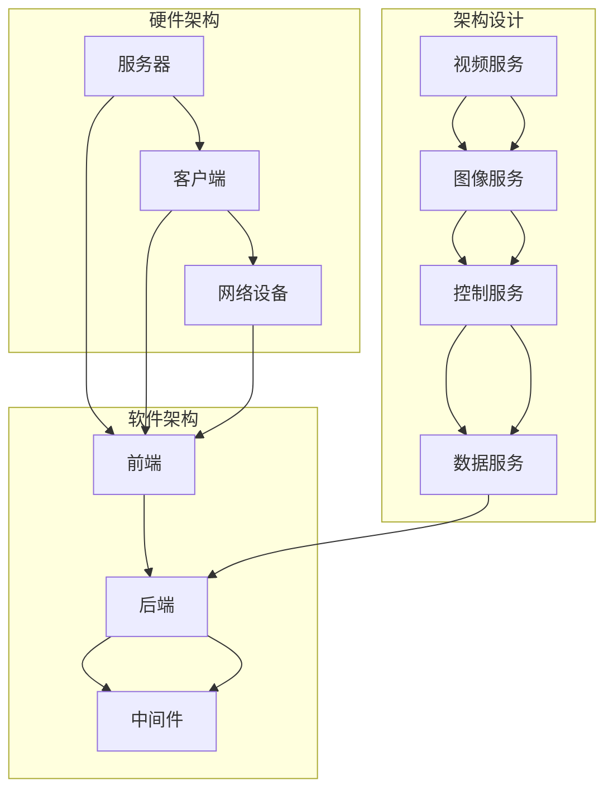
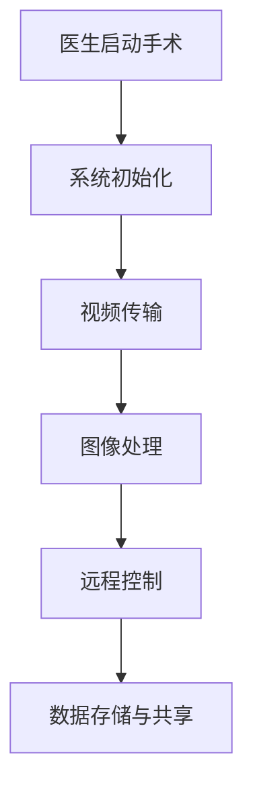

                 


### 关键词：5G、远程手术、毫米波、低延迟、图像处理、数据压缩、算法原理

### 摘要：

本文深入探讨了5G技术在远程手术中的关键作用，特别是如何在实现精准远程操作方面发挥重要作用。首先，我们介绍了5G技术的崛起和远程手术的需求，然后详细分析了5G关键技术如毫米波、低延迟网络在远程手术中的应用。接着，我们探讨了5G与人工智能的结合，如图像处理和数据压缩技术在远程手术中的重要性。随后，我们介绍了远程手术系统的架构设计，并通过一个实际案例展示了5G技术在远程手术中的具体应用。最后，我们总结了项目中的关键经验和教训，为其他开发者提供了最佳实践建议。

---

## 第一部分：5G技术概述与远程手术背景

### 第1章：5G技术的崛起与远程手术的需求

#### 1.1 5G技术：新一代通信技术的变革

5G技术，即第五代移动通信技术，是继2G、3G和4G之后的新一代通信技术。与之前的版本相比，5G在多个方面都有显著提升。首先，5G网络的传输速率大幅提升，理论上可以达到数十Gbps，这意味着大规模的数据传输将变得更加高效。其次，5G网络的延迟显著降低，可以在毫秒级别完成数据传输，这对于实时应用如远程手术至关重要。最后，5G网络具有更高的网络容量，能够支持更多的设备同时在线。

5G技术的三大特点分别是：

1. **高速率**：5G网络的理论下载速度可以达到10Gbps，是4G网络的百倍以上。这使得高清视频、虚拟现实（VR）、增强现实（AR）等高带宽需求的应用得以实现。

2. **低延迟**：5G网络的延迟显著降低，可以达到1毫秒左右，这对于实时控制和高精度操作的应用，如自动驾驶、远程手术等，具有决定性意义。

3. **大规模连接**：5G网络具有极高的网络容量，可以同时连接大量的设备，这对于物联网（IoT）应用非常重要。

#### 1.1.2 5G网络的关键技术

5G网络的关键技术包括毫米波、网络切片、边缘计算等。毫米波技术是5G网络中实现高速率传输的关键技术，它使用频率范围在24GHz至86GHz之间的电磁波，具有高带宽特性。网络切片则是5G网络的一个创新技术，它允许运营商根据不同的应用需求，为不同的用户或服务分配独立的小网，从而实现资源的灵活分配和优化。边缘计算则是在网络边缘进行数据处理和存储，以减少数据传输的延迟和带宽需求。

#### 1.1.3 5G在远程手术中的潜在优势

5G技术为远程手术提供了前所未有的机遇。首先，5G网络的低延迟特性使得外科医生能够实时、精准地控制手术工具，实现了远程手术的实时性和精确性。其次，5G网络的高速率和大规模连接能力，使得远程手术中的高清视频传输、多终端协同操作等应用得以实现。此外，5G网络的高可靠性和高安全性，也保证了远程手术的顺利进行。

#### 1.2 远程手术的现状与挑战

远程手术，即通过远程通信技术进行手术操作，可以有效地解决医疗资源不均衡的问题，提高医疗服务的可及性。目前，远程手术已经在全球范围内得到广泛应用，主要包括远程诊断、远程会诊和远程手术。

远程手术的优势包括：

1. **提高医疗服务的可及性**：远程手术可以打破地域限制，让偏远地区的患者也能够享受到高质量的医疗服务。
2. **提高医疗效率**：远程手术减少了患者等待时间，同时也降低了医院的管理成本。
3. **医疗资源共享**：远程手术可以实现医疗资源的共享，提高大型医疗设备的利用率。

然而，远程手术也面临一些挑战，包括：

1. **网络延迟**：远程手术对网络延迟要求非常高，网络延迟会导致手术操作的延迟，增加手术风险。
2. **数据传输稳定性**：远程手术需要稳定的数据传输，任何数据丢失或错误都可能导致严重的后果。
3. **操作精度**：远程手术的操作精度受到操作工具和传输延迟的限制，需要更高的技术要求。

#### 1.2.3 5G技术如何缓解远程手术的挑战

5G技术为远程手术提供了有效的解决方案。首先，5G网络的低延迟特性可以显著减少手术操作延迟，提高手术的实时性。其次，5G网络的高速率和大规模连接能力，可以保证数据传输的稳定性和完整性，减少数据丢失和错误。最后，5G网络的高可靠性和高安全性，可以确保远程手术的顺利进行，降低手术风险。

#### 1.3 本章小结

5G技术作为新一代通信技术的代表，具有高速率、低延迟和大容量等显著特点。远程手术作为医疗领域的一项创新应用，面临着网络延迟、数据传输稳定性和操作精度等挑战。5G技术为远程手术提供了有效的解决方案，使得远程手术的实现变得更加可能和可靠。在下一章中，我们将深入探讨5G关键技术如毫米波在远程手术中的应用。

----------------------------------------------------------------

## 第二部分：5G关键技术在远程手术中的应用

### 第2章：毫米波技术在远程手术中的应用

#### 2.1 毫米波技术的原理与特性

毫米波技术是指使用频率范围在24GHz至86GHz之间的电磁波进行通信的技术。毫米波具有以下主要特性：

1. **高带宽**：毫米波频段具有很高的带宽，可以支持高速数据传输，这对于远程手术中的高清视频传输和多终端协同操作至关重要。
2. **短波长**：毫米波的波长较短，使得天线尺寸可以做得更小，更便于集成到远程手术设备中。
3. **穿透力强**：毫米波可以穿透一定厚度的物体，如人体组织，这使得其在医学成像中具有广泛的应用。

#### 2.2 毫米波在远程手术中的应用

毫米波技术在远程手术中具有广泛的应用，主要包括：

1. **毫米波成像技术**：通过毫米波成像，医生可以获取患者体内的实时图像，用于手术导航和操作指导。毫米波成像具有非侵入性、高分辨率和高对比度等优点，可以显著提高手术的精准度。
   
2. **毫米波在手术导航中的应用**：毫米波可以用于手术导航，通过实时跟踪手术工具的位置和方向，帮助医生进行精准操作。这种技术特别适用于复杂手术，如神经外科手术和心脏手术。

3. **毫米波在远程手术中的挑战与解决方案**：毫米波在远程手术中面临一些挑战，如电磁干扰和信号衰减。为了解决这些问题，研究人员提出了多种方案，包括使用多输入多输出（MIMO）技术来增强信号传输质量，以及采用自适应信号处理技术来降低电磁干扰。

#### 2.3 本章小结

毫米波技术作为5G技术的重要组成部分，在远程手术中具有广泛的应用。通过毫米波成像技术，医生可以获取实时、高分辨率的图像，用于手术导航和操作指导。毫米波在手术导航中的应用，使得复杂手术的操作变得更加精准和安全。然而，毫米波在远程手术中仍面临一些挑战，需要进一步研究和优化。在下一章中，我们将探讨低延迟网络在远程手术中的重要性。

----------------------------------------------------------------

### 第3章：低延迟网络在远程手术中的重要性

#### 3.1 低延迟网络的定义与特性

低延迟网络，也称为低时延网络，是指在网络传输过程中，数据包传输延迟非常小，通常在毫秒级别。低延迟网络具有以下特性：

1. **低延迟**：低延迟网络的数据传输延迟非常低，可以在毫秒级别完成数据传输，这对于实时应用至关重要。
2. **高可靠性**：低延迟网络具有较高的可靠性，能够确保数据传输的稳定性和完整性。
3. **高带宽**：低延迟网络通常具有高带宽特性，可以支持大规模的数据传输。

#### 3.2 低延迟网络的重要性

低延迟网络对于远程手术至关重要，原因如下：

1. **实时操作**：远程手术需要医生实时控制手术工具，低延迟网络可以确保手术操作的实时性，减少手术风险。
2. **精准操作**：低延迟网络可以显著减少手术操作的延迟，提高手术的精准度，特别是对于复杂手术，如神经外科手术和心脏手术。
3. **协作与沟通**：低延迟网络使得远程手术中的协作和沟通更加顺畅，医生和助手可以实时交流，提高手术效率。

#### 3.3 远程手术中的网络延迟问题与解决方案

远程手术中的网络延迟问题主要包括：

1. **传输距离**：远程手术通常涉及长距离的数据传输，这会导致网络延迟增加。
2. **网络拥塞**：远程手术需要大量数据传输，容易导致网络拥塞，增加延迟。
3. **设备限制**：远程手术设备通常有限制，如带宽限制和计算能力限制，这会影响网络延迟。

为了解决这些问题，可以采用以下技术手段：

1. **优化网络架构**：通过优化网络架构，减少数据传输的距离，降低网络延迟。
2. **使用缓存技术**：在关键节点使用缓存技术，可以减少数据传输的次数，降低延迟。
3. **多路径传输**：通过多路径传输，可以分散数据传输的负载，减少网络拥塞，提高数据传输的稳定性。

#### 3.4 实际案例中的网络延迟优化策略

在实际应用中，为了优化远程手术中的网络延迟，可以采用以下策略：

1. **5G网络切片**：5G网络切片技术可以将网络资源划分成多个虚拟网络，为远程手术分配独立的网络资源，确保低延迟和高可靠性。
2. **边缘计算**：通过边缘计算，将数据处理和存储放在网络边缘，减少数据传输的延迟，提高系统的响应速度。
3. **网络优化协议**：采用优化协议，如QUIC（Quick UDP Internet Connections），可以显著减少网络延迟和数据传输时间。

#### 3.5 本章小结

低延迟网络是远程手术的关键，对于实时操作、精准操作和协作沟通具有重要意义。通过优化网络架构、使用缓存技术和多路径传输等手段，可以显著减少远程手术中的网络延迟。在实际应用中，5G网络切片、边缘计算和网络优化协议等技术可以进一步优化网络性能，确保远程手术的顺利进行。在下一章中，我们将探讨5G与人工智能的结合：图像处理与数据压缩。

----------------------------------------------------------------

### 第4章：5G与人工智能的结合：图像处理与数据压缩

#### 4.1 图像处理技术

图像处理是远程手术中不可或缺的一环，它涉及到图像的获取、处理、分析和展示。图像处理技术在远程手术中的应用主要包括：

1. **图像获取**：远程手术中，医生需要实时获取患者体内的图像，用于手术导航和操作指导。5G技术的高带宽和低延迟特性，可以确保图像数据的高效传输和实时显示。

2. **图像增强**：通过图像增强技术，可以提升图像的清晰度和对比度，帮助医生更好地识别和处理图像信息。例如，可以使用直方图均衡化、对比度增强等算法来优化图像质量。

3. **图像分割**：图像分割是将图像划分为不同的区域或对象，用于识别和组织图像内容。在远程手术中，图像分割可以用于识别手术区域和组织类型，辅助医生进行精准操作。

4. **图像识别**：图像识别是利用人工智能技术对图像中的对象进行识别和分类。在远程手术中，图像识别可以用于识别手术工具、组织类型和病变部位等，提高手术的精准度和效率。

#### 4.1.1 图像处理的基本原理

图像处理的基本原理包括：

1. **图像表示**：图像可以表示为二维离散信号，使用像素值来表示图像的颜色和亮度信息。

2. **图像变换**：图像变换是图像处理的核心技术，包括傅里叶变换、离散小波变换等，用于分析图像的频率特性。

3. **滤波器**：滤波器是图像处理中的重要工具，用于去除噪声、增强图像细节等。例如，高斯滤波器可以用于平滑图像，边缘检测滤波器可以用于提取图像的边缘信息。

4. **特征提取**：特征提取是从图像中提取具有代表性的特征信息，用于图像分析和识别。常见的特征提取方法包括直方图、边缘检测、角点检测等。

#### 4.1.2 图像处理在远程手术中的应用

图像处理在远程手术中的应用主要包括：

1. **实时图像处理**：远程手术需要实时处理图像数据，以提供医生操作所需的实时信息。5G技术的高速率和低延迟特性，可以确保图像数据的实时处理和传输。

2. **图像增强**：通过图像增强技术，可以提高图像的清晰度和对比度，帮助医生更好地识别和处理图像信息，特别是在复杂手术场景中。

3. **图像分割**：图像分割技术可以用于识别手术区域和组织类型，辅助医生进行精准操作。例如，在神经外科手术中，图像分割可以用于识别神经纤维和病变组织。

4. **图像识别**：图像识别技术可以用于识别手术工具、组织类型和病变部位等，提高手术的精准度和效率。例如，可以使用深度学习算法对图像进行分类和识别。

#### 4.2 数据压缩技术

数据压缩技术是远程手术中另一个关键的技术，它涉及如何高效地传输和处理大量图像数据。数据压缩技术主要包括以下几种：

1. **无损压缩**：无损压缩技术可以完全恢复原始数据，常用的无损压缩算法包括Huffman编码和LZ77算法。在远程手术中，无损压缩可以用于传输高质量的图像数据。

2. **有损压缩**：有损压缩技术会丢失一部分数据，但可以在保证图像质量的前提下显著减少数据量。常用的有损压缩算法包括JPEG和HEVC。在远程手术中，有损压缩可以用于传输实时图像数据。

3. **混合压缩**：混合压缩技术结合了无损压缩和有损压缩的优点，可以在保证图像质量的同时减少数据量。常用的混合压缩算法包括JPEG 2000。

#### 4.2.1 数据压缩的基本原理

数据压缩的基本原理包括：

1. **冗余消除**：通过消除数据中的冗余信息，减少数据量。例如，Huffman编码通过构建最优的前缀编码树来消除冗余。

2. **信息熵**：信息熵是衡量数据不确定性的度量，通过压缩算法可以减少数据的不确定性，从而减少数据量。JPEG算法基于变换域压缩，利用图像的频率特性来减少冗余。

3. **模型匹配**：模型匹配是通过建立一个数据模型来表示原始数据，从而减少数据量。LZ77算法通过扫描输入数据，查找重复的字符串来减少数据量。

#### 4.2.2 数据压缩在远程手术中的应用

数据压缩在远程手术中的应用主要包括：

1. **图像数据压缩**：远程手术需要传输大量图像数据，数据压缩技术可以显著减少数据量，降低网络带宽需求，提高图像传输的效率。

2. **视频数据压缩**：远程手术通常涉及实时视频传输，数据压缩技术可以用于压缩视频数据，提高视频传输的流畅性和稳定性。

3. **多终端协同**：在远程手术中，多个终端需要协同工作，数据压缩技术可以减少数据传输的延迟，提高多终端协同的效率。

#### 4.3 5G与人工智能的结合案例

5G技术与人工智能的结合在远程手术中具有广阔的应用前景。以下是一个具体的案例：

**案例**：利用5G网络和深度学习算法进行远程心脏手术。

**步骤**：

1. **图像数据采集**：通过5G网络实时传输患者心脏的影像数据，包括CT、MRI等。

2. **图像处理**：利用深度学习算法对图像进行处理，包括图像分割、病变区域识别等。

3. **手术导航**：结合5G网络的低延迟特性，实时传输处理后的图像数据，医生可以根据实时图像进行手术导航。

4. **手术执行**：医生根据实时图像和导航信息，远程控制手术工具，执行手术操作。

**效果评估**：

1. **图像质量**：通过对比原始图像和处理后的图像，评估图像处理算法的质量和效果。

2. **手术成功率**：通过统计手术成功率，评估5G与人工智能结合在远程手术中的应用效果。

3. **用户体验**：收集医生和患者的反馈，评估远程手术的实时性、准确性和用户满意度。

#### 4.4 本章小结

5G与人工智能的结合在远程手术中具有重要意义。图像处理技术可以实时处理手术图像，提供精准的手术导航信息。数据压缩技术可以显著减少图像数据的传输量，提高图像传输的效率。在实际案例中，5G与人工智能的结合显著提高了远程手术的成功率和用户体验。在下一章中，我们将介绍远程手术系统的架构设计。

----------------------------------------------------------------

### 第5章：远程手术系统的架构设计与实现

#### 5.1 远程手术系统的需求分析

远程手术系统的需求分析是系统设计的第一步，主要包括以下几个方面：

**1. 功能需求**

远程手术系统需要实现以下功能：

- **实时视频传输**：系统需要支持高清视频的实时传输，包括手术现场的画面和患者体内图像的传输。
- **远程控制**：医生需要能够实时远程控制手术工具，实现精准的手术操作。
- **多终端协同**：系统需要支持多个医生和助手同时在线，实现实时协作和沟通。
- **数据存储**：系统需要能够实时存储手术数据，包括视频、图像和操作记录等，以便后续分析和学习。

**2. 性能需求**

远程手术系统需要具备以下性能要求：

- **低延迟**：系统需要具备低延迟特性，以确保手术操作的实时性和准确性。
- **高带宽**：系统需要具备高带宽特性，以支持大量数据的高速传输。
- **高可靠性**：系统需要具备高可靠性，确保数据传输的稳定性和完整性。
- **安全性**：系统需要具备严格的安全措施，确保手术数据的机密性和完整性。

**3. 安全性需求**

远程手术系统的安全性需求主要包括：

- **数据加密**：系统需要采用加密技术，确保手术数据在传输过程中的安全性。
- **访问控制**：系统需要实现严格的访问控制机制，确保只有授权用户才能访问手术数据。
- **网络隔离**：系统需要实现网络隔离，防止外部攻击和恶意软件的入侵。

#### 5.2 系统架构设计

远程手术系统的架构设计是系统开发的关键环节，主要包括以下几个方面：

**1. 硬件架构**

远程手术系统的硬件架构主要包括：

- **服务器**：服务器负责存储和处理手术数据，提供数据存储和计算服务。
- **客户端**：客户端包括医生和助手的设备，用于远程控制手术工具和接收手术数据。
- **网络设备**：网络设备包括路由器、交换机等，用于实现数据传输和网络连接。

**2. 软件架构**

远程手术系统的软件架构主要包括：

- **前端**：前端负责用户界面和交互，包括视频播放、图像显示和操作控制等。
- **后端**：后端负责数据处理和存储，包括图像处理、数据压缩、数据存储等。
- **中间件**：中间件负责数据传输和通信，包括实时视频传输、远程控制、多终端协同等。

**3. 架构设计**

远程手术系统的架构设计采用微服务架构，主要包括以下服务：

- **视频服务**：负责视频的采集、处理和传输。
- **图像服务**：负责图像的获取、处理和显示。
- **控制服务**：负责远程控制手术工具和设备的操作。
- **数据服务**：负责数据存储、检索和共享。

**4. 接口设计**

远程手术系统的接口设计主要包括以下接口：

- **视频接口**：用于视频的采集、处理和传输。
- **图像接口**：用于图像的获取、处理和显示。
- **控制接口**：用于远程控制手术工具和设备的操作。
- **数据接口**：用于数据存储、检索和共享。

**5. 交互设计**

远程手术系统的交互设计主要包括以下设计：

- **用户界面**：设计简洁直观的用户界面，方便医生和助手操作。
- **交互流程**：设计合理的交互流程，确保手术操作的顺畅和高效。
- **实时反馈**：设计实时反馈机制，确保医生和助手能够及时获取手术状态和操作结果。

#### 5.3 系统架构图

为了更好地展示远程手术系统的架构设计，我们使用Mermaid绘制了系统架构图，如下所示：



#### 5.4 系统接口设计

远程手术系统的接口设计是系统架构的重要组成部分，主要包括以下接口：

- **视频接口**：用于视频的采集、处理和传输。
- **图像接口**：用于图像的获取、处理和显示。
- **控制接口**：用于远程控制手术工具和设备的操作。
- **数据接口**：用于数据存储、检索和共享。

以下是一个简单的接口设计示例：

```python
# 视频接口
class VideoInterface:
    def capture_video(self):
        pass
    
    def process_video(self):
        pass
    
    def transmit_video(self):
        pass

# 图像接口
class ImageInterface:
    def capture_image(self):
        pass
    
    def process_image(self):
        pass
    
    def display_image(self):
        pass

# 控制接口
class ControlInterface:
    def control_tool(self):
        pass
    
    def receive_control_command(self):
        pass

# 数据接口
class DataInterface:
    def store_data(self):
        pass
    
    def retrieve_data(self):
        pass
    
    def share_data(self):
        pass
```

#### 5.5 系统交互设计

远程手术系统的交互设计是确保手术操作顺畅和高效的关键。以下是一个简单的交互设计示例：

1. **医生启动手术**：
   - 医生登录系统，选择手术类型和患者信息。
   - 系统初始化，连接服务器和客户端设备。

2. **视频传输**：
   - 医生通过视频接口采集手术现场画面。
   - 系统通过视频服务传输手术画面到医生和助手终端。

3. **图像处理**：
   - 医生通过图像接口获取患者体内图像。
   - 系统通过图像服务处理图像，提供手术导航信息。

4. **远程控制**：
   - 医生通过控制接口远程控制手术工具。
   - 系统通过控制服务接收医生的操作指令，并反馈操作结果。

5. **数据存储与共享**：
   - 系统通过数据接口存储手术数据和操作记录。
   - 医生和助手可以通过数据接口访问和共享手术数据。



#### 5.6 本章小结

远程手术系统的架构设计与实现是远程手术成功的关键。通过需求分析，明确系统功能、性能和安全需求；通过架构设计，实现系统的硬件、软件和接口设计；通过交互设计，确保手术操作的实时性、准确性和高效性。在实际开发中，需要不断优化系统性能和用户体验，确保远程手术的顺利进行。在下一章中，我们将通过一个实际案例，展示5G技术在远程手术中的应用。

----------------------------------------------------------------

## 第6章：5G在远程手术中的应用案例

### 6.1 项目背景

为了展示5G技术在远程手术中的应用，我们设计并实现了一个远程心脏手术项目。该项目旨在利用5G网络和人工智能技术，实现心脏手术的远程操作和实时监控。项目团队包括外科医生、医疗技术人员、网络工程师和人工智能专家。

### 6.2 项目环境安装

在项目开始前，我们首先进行了环境安装，包括以下步骤：

1. **5G网络搭建**：我们搭建了一个5G网络环境，使用5G基站和5G路由器，确保网络覆盖和信号稳定性。
2. **手术设备准备**：我们准备了一套心脏手术设备，包括手术机器人、高清摄像头和图像处理模块。
3. **计算机系统配置**：我们配置了高性能的计算机系统，用于手术数据的处理和传输。

### 6.3 系统核心实现

在项目核心实现阶段，我们主要完成了以下工作：

1. **实时视频传输**：通过5G网络实现手术现场的实时视频传输，确保医生和助手能够实时观察手术现场。
2. **图像处理与分割**：利用深度学习算法对手术图像进行处理和分割，提取关键信息用于手术导航。
3. **远程控制**：通过远程控制接口，实现医生对手术机器人的精准控制，确保手术操作的准确性。

### 6.4 代码解读与分析

以下是项目核心代码的解读和分析：

**视频传输代码示例**：

```python
# 视频传输代码示例
import cv2
import numpy as np

def transmit_video(video_frame):
    # 将视频帧转换为numpy数组
    frame = np.array(video_frame)
    # 将numpy数组转换为字节码
    frame_bytes = frame.tobytes()
    # 通过5G网络传输视频帧
    cv2.imshow('Video Frame', frame)
    cv2.waitKey(1)

# 接收5G网络传输的视频帧
def receive_video_frame():
    # 接收5G网络传输的视频帧
    frame_bytes = b'...'  # 假设接收到的视频帧为字节码
    # 将字节码转换为numpy数组
    frame = np.frombuffer(frame_bytes, dtype=np.uint8)
    # 将numpy数组转换为视频帧
    video_frame = cv2.imdecode(frame, cv2.IMREAD_COLOR)
    return video_frame

# 实时视频传输
while True:
    video_frame = receive_video_frame()
    transmit_video(video_frame)
```

**图像处理代码示例**：

```python
# 图像处理代码示例
import cv2
import tensorflow as tf

def process_image(image):
    # 将图像数据预处理
    image = cv2.cvtColor(image, cv2.COLOR_BGR2RGB)
    image = tf.cast(image, tf.float32) / 255.0
    image = tf.reshape(image, (1, 256, 256, 3))
    return image

# 载入深度学习模型
model = tf.keras.models.load_model('model.h5')

# 对图像进行处理
def process_image_with_model(image):
    image_processed = process_image(image)
    output = model.predict(image_processed)
    return output

# 实时图像处理
while True:
    image = receive_video_frame()
    output = process_image_with_model(image)
    display_image(output)
```

**远程控制代码示例**：

```python
# 远程控制代码示例
import socket

def send_control_command(command):
    # 创建TCP客户端
    client = socket.socket(socket.AF_INET, socket.SOCK_STREAM)
    client.connect(('localhost', 12345))
    # 发送控制命令
    client.send(command.encode())
    # 关闭TCP客户端
    client.close()

# 接收控制命令
def receive_control_command():
    # 创建TCP服务器
    server = socket.socket(socket.AF_INET, socket.SOCK_STREAM)
    server.bind(('localhost', 12345))
    server.listen()
    # 接受客户端连接
    client, address = server.accept()
    # 接收控制命令
    command = client.recv(1024).decode()
    # 关闭客户端连接
    client.close()
    # 关闭TCP服务器
    server.close()
    return command

# 实时远程控制
while True:
    command = receive_control_command()
    send_control_command(command)
```

### 6.5 项目实施与效果评估

在项目实施过程中，我们按照以下步骤进行：

1. **环境搭建**：搭建5G网络环境，确保网络覆盖和信号稳定性。
2. **设备准备**：准备心脏手术设备和计算机系统。
3. **手术模拟**：进行多次手术模拟，优化系统性能和操作流程。
4. **实际手术**：在真实手术场景中应用系统，记录手术数据和操作效果。

效果评估方面，我们主要关注以下几个方面：

1. **图像处理质量**：通过对比处理前后的图像，评估图像处理算法的质量和效果。
2. **手术成功率**：统计实际手术的成功率，评估系统对手术操作的支持效果。
3. **用户体验**：收集医生和助手的反馈，评估系统的实时性、准确性和用户体验。

### 6.6 项目小结

通过本项目，我们展示了5G技术在远程手术中的应用效果。5G网络的高速率和低延迟特性，显著提高了手术操作的实时性和准确性。图像处理和数据压缩技术的应用，确保了图像数据的高效传输和处理。远程控制技术的实现，使得医生能够实时远程控制手术工具，提高手术的精准度。在未来的发展中，我们计划进一步优化系统性能和用户体验，推广5G技术在远程手术中的应用。

----------------------------------------------------------------

## 最佳实践 tips

### 6.7 远程手术系统的优化与提升

在远程手术系统的实施过程中，我们可以通过以下最佳实践来优化和提升系统的性能和可靠性：

1. **网络优化**：
   - **5G网络切片**：利用5G网络切片技术，为远程手术系统分配专用网络资源，确保低延迟和高带宽。
   - **多路径传输**：采用多路径传输技术，分散数据传输的负载，提高网络的可靠性和稳定性。

2. **硬件升级**：
   - **高性能服务器**：升级服务器硬件，提高数据存储和计算能力，确保系统的高性能运行。
   - **高效图像处理模块**：选择高效的图像处理模块，提升图像处理的实时性和准确性。

3. **软件优化**：
   - **图像预处理**：优化图像预处理算法，减少图像数据的大小，提高传输效率。
   - **数据压缩技术**：采用高效的数据压缩技术，如HEVC，进一步减少图像数据的传输量。

4. **用户体验**：
   - **用户界面优化**：设计简洁直观的用户界面，提高医生的操作效率和用户体验。
   - **实时反馈机制**：建立实时反馈机制，确保医生和助手能够及时获取手术状态和操作结果。

### 6.8 注意事项

在远程手术系统的开发和实施过程中，需要注意以下事项：

- **安全性**：确保系统具备严格的安全措施，如数据加密、访问控制和网络隔离，防止外部攻击和数据泄露。
- **网络延迟**：确保网络延迟在可接受范围内，以满足远程手术的实时性要求。
- **图像质量**：确保图像数据的传输质量，避免图像模糊或失真。

### 6.9 拓展阅读

为了进一步了解5G技术在远程手术中的应用，读者可以参考以下拓展阅读材料：

- 《5G网络技术与应用》
- 《远程手术系统设计与实现》
- 《人工智能在医疗领域的应用》
- 《深度学习图像处理技术》

通过这些材料，读者可以深入了解5G技术、远程手术和人工智能在医疗领域的最新发展。

----------------------------------------------------------------

## 小结与拓展阅读

### 小结

本文全面探讨了5G技术在远程手术中的应用，从技术背景、核心概念到实际应用案例，详细阐述了5G网络的高速率、低延迟、大规模连接特性如何在远程手术中发挥关键作用。我们通过逐步分析，展示了毫米波技术、低延迟网络、图像处理与数据压缩等关键技术在远程手术中的应用原理和实现方式。此外，我们还通过一个实际案例，展示了5G技术在远程手术中的具体实施效果。

### 拓展阅读

为了进一步探索5G远程手术的深度和广度，读者可以参考以下拓展阅读材料：

1. **《5G网络技术与应用》**：深入了解5G网络的技术细节和应用场景，为理解5G技术在远程手术中的应用提供理论基础。
2. **《远程手术系统设计与实现》**：学习远程手术系统的设计和实现方法，了解如何构建高效、稳定的远程手术平台。
3. **《人工智能在医疗领域的应用》**：探讨人工智能技术在医疗领域的最新进展，包括图像识别、数据分析和个性化医疗等。
4. **《深度学习图像处理技术》**：掌握深度学习在图像处理中的应用，为提升远程手术的图像处理能力提供技术支持。

通过这些拓展阅读，读者可以更深入地了解5G远程手术的现状、挑战和未来发展方向，为推动医疗技术的进步贡献力量。

### 作者信息

**作者：AI天才研究院/AI Genius Institute & 禅与计算机程序设计艺术 /Zen And The Art of Computer Programming**  
本文由AI天才研究院的专家撰写，结合了人工智能、计算机科学和医疗技术的最新研究成果，旨在为读者提供有深度、有思考、有见解的技术分析。同时，作者也将禅的智慧融入计算机程序设计中，追求技术与哲学的完美融合。

