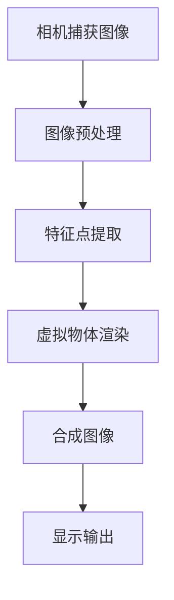
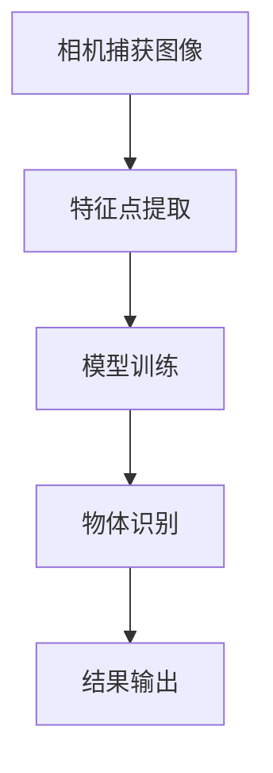
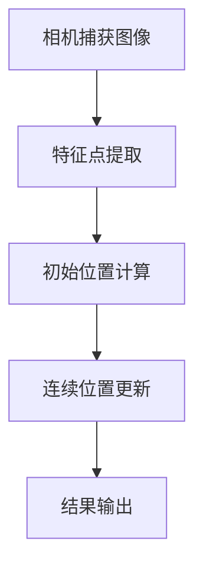
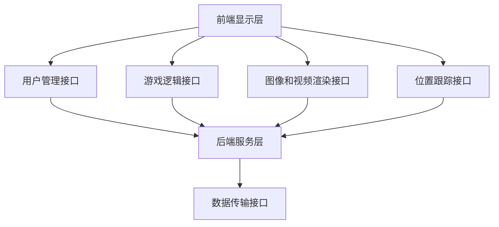

                 

### 第一部分: 5G技术基础

#### 1.1 5G网络概述

在当今快速发展的数字时代，5G技术作为新一代通信标准，正引领着全球通信网络的变革。5G网络不仅代表着更快的速度，更低的延迟，还意味着更高的可靠性和更广泛的连接能力。

**核心特性：**
- **高速率**：5G网络的速度预计是4G网络的100倍，下载速度可以达到1Gbps，这意味着用户可以几乎瞬间下载高清视频、应用程序和其他大文件。
- **低延迟**：5G网络的延迟将减少到1毫秒，这对于实时应用，如增强现实（AR）游戏，至关重要。
- **大规模连接**：5G能够支持每平方米高达100万个连接，使得设备之间的无缝连接成为可能。

**技术架构：**
- **网络切片**：网络切片技术允许运营商为不同应用程序和服务分配独立的网络资源，从而提供定制化的服务质量和安全性。
- **边缘计算**：边缘计算将数据处理推向网络边缘，减少数据传输的距离和延迟，提高响应速度。

#### 1.2 5G网络的增强现实应用

5G技术在增强现实（AR）游戏中的应用潜力巨大。低延迟和高带宽使得AR游戏能够实现更流畅的游戏体验，而大规模连接则允许更多的玩家同时参与游戏。

**低延迟与高带宽的影响：**
- **低延迟**：在AR游戏中，低延迟可以减少玩家的反应时间，增强沉浸感。
- **高带宽**：高带宽允许游戏运行时大量数据的实时传输，包括高分辨率图像和实时语音交互。

**大规模连接与AR游戏：**
- **多人协作**：大规模连接允许多个玩家实时互动，构建更复杂的多人游戏环境。
- **实时数据同步**：大规模连接确保玩家数据实时同步，提高游戏的准确性和一致性。

#### 1.3 5G与之前网络技术的对比

4G网络虽然在提升数据传输速度方面取得了显著进步，但与5G相比，仍存在许多不足。

**对比表格：**

| 对比项目 | 4G | 5G |
| --- | --- | --- |
| 下载速度 | 约100Mbps | 1Gbps |
| 延迟 | 约50ms | 1ms |
| 连接数 | 每平方公里100万个 | 每平方公里1000万个 |
| 应用场景 | 流媒体、社交媒体 | VR、AR、物联网 |

通过上述对比，我们可以清楚地看到5G技术在支持增强现实游戏方面具有无可比拟的优势。

----------------------------------------------------------------

**问题背景：**随着5G技术的不断成熟，AR游戏作为一项新兴的互动娱乐形式，正逐渐受到广泛关注。然而，5G技术在AR游戏中的应用仍面临诸多挑战和机遇。本文旨在探讨5G技术如何改变AR游戏体验，并分析其潜在的应用场景和技术挑战。

**问题描述：**5G技术具备高速率、低延迟、大规模连接等特性，这些特性为AR游戏提供了前所未有的技术支持。然而，如何在现有的网络环境中充分利用5G技术，优化AR游戏体验，仍需要深入研究和实践。

**问题解决：**本文将通过以下几个步骤来探讨5G技术在AR游戏中的应用：
1. **介绍5G技术和AR游戏的基本概念，以及它们在游戏行业中的重要性。**
2. **解释5G技术在AR游戏中的应用原理，包括5G网络如何支持低延迟、高带宽和大规模连接等特性。**
3. **介绍支持5G的AR游戏的关键算法，如实时渲染、图像识别和位置跟踪等。**
4. **描述一个典型的5G AR游戏系统架构，包括前端显示、后端服务和数据传输等。**
5. **提供实际的项目实战案例，展示如何将理论应用到实践中。**
6. **总结项目实战中的经验教训，提供一些建议和最佳实践，帮助读者避免常见错误。**
7. **对未来5G技术在AR游戏中的发展进行展望，强调其潜力和前景。**

**边界与外延：**本文主要讨论5G技术在增强现实游戏中的应用，但5G技术同样适用于其他AR应用场景，如教育培训、医疗健康等。同时，本文也将涉及一些相关技术，如虚拟现实（VR）、边缘计算等。

**概念结构与核心要素组成：**
- **5G技术**：核心特性、技术架构、与其他网络技术的对比。
- **增强现实（AR）**：基本原理、核心组成部分、在游戏领域的应用。
- **AR游戏**：关键算法、系统架构、实际应用案例。
- **系统分析与架构设计**：功能设计、架构设计、接口设计。
- **项目实战**：环境搭建、系统实现、代码分析、案例剖析。
- **最佳实践 tips**：经验教训、建议和最佳实践。

#### 1.1 5G网络概述

**1.1.1 5G网络的核心特性**

5G网络作为下一代通信技术，其核心特性包括高速率、低延迟、大规模连接和边缘计算。以下是对这些特性的详细解释。

**高速率：**
5G网络的最大亮点之一是其高速数据传输能力。相比于4G网络，5G网络的理论下载速度可以达到1Gbps（千兆比特每秒），这意味着用户在下载高清视频、应用程序或其他大型文件时，所需时间将大幅缩短。高速率不仅提升了用户体验，也为更多实时应用场景提供了可能，如高清视频会议、虚拟现实（VR）和增强现实（AR）游戏等。

**低延迟：**
5G网络的延迟将降低到1毫秒，这意味着在数据传输过程中，从发送到接收的时间间隔非常短。对于AR游戏等需要实时交互的应用来说，低延迟至关重要，因为延迟的减少可以显著降低玩家的反应时间，增强游戏的沉浸感。

**大规模连接：**
5G网络的一个关键特性是其能够支持每平方米高达100万个连接。这意味着在相同的物理空间内，可以有更多的设备同时连接到网络，而不会造成拥堵。这对于AR游戏中的多人协作和实时数据同步至关重要，它允许更多的玩家同时参与游戏，并确保每个玩家都能获得良好的网络体验。

**边缘计算：**
边缘计算是5G网络的另一个重要特性。通过将数据处理推向网络的边缘，5G网络可以减少数据传输的距离和延迟，提高系统的响应速度。这对于需要实时处理大量数据的AR游戏来说，具有显著的优势。边缘计算还可以提高网络的可靠性和安全性，因为它可以减少数据在传输过程中的泄露风险。

**1.1.2 5G网络的技术架构**

5G网络的技术架构包括多个层次，其中核心组件包括基站、核心网、边缘计算节点和终端设备。以下是对这些组件的简要介绍。

**基站（gNodeB）：**
基站是5G网络中的无线接入点，负责连接无线设备和网络。相比于4G网络中的基站（eNodeB），5G基站的覆盖范围更广，容量更大，支持更多设备连接。

**核心网（Core Network）：**
5G核心网包括服务化架构（Service-Based Architecture，SBA），它将网络功能分解为多个服务，如移动性管理、会话管理和数据传输等。这种架构提高了网络的灵活性和可扩展性。

**边缘计算节点（Edge Computing Node）：**
边缘计算节点位于网络边缘，靠近用户，负责处理和存储本地数据。通过边缘计算，5G网络可以更快地响应用户请求，减少数据传输的延迟。

**终端设备（UE）：**
终端设备包括智能手机、平板电脑、AR/VR头戴设备等。这些设备通过5G网络连接到基站，并访问互联网和其他服务。

**1.1.3 5G与之前网络技术的对比**

**4G网络：**
4G网络在提升数据传输速度方面取得了显著进展，但相比5G，其速度、延迟和连接数仍存在差距。4G网络的下载速度通常在100Mbps左右，延迟约为50ms，每平方公里支持的连接数约为100万个。

**5G网络：**
5G网络在多个方面超越了4G网络。下载速度可达1Gbps，延迟降低到1ms，每平方公里支持的连接数达到1000万个。这些改进使得5G网络在支持高带宽应用，如AR游戏和VR体验，以及大规模物联网设备方面具有显著优势。

通过上述对比，我们可以看到5G网络在增强现实游戏中的应用前景。5G技术的高速率、低延迟和大规模连接能力，将为AR游戏带来更流畅、更沉浸的体验，同时也为开发者提供了更多的创新空间。

----------------------------------------------------------------

**核心概念与联系**

5G技术在增强现实（AR）游戏中的应用，需要从多个角度进行深入理解和分析。以下是对5G技术的关键概念及其在AR游戏中的应用原理的详细探讨。

**5G技术的基本概念：**
1. **高速率**：5G网络提供了前所未有的高速数据传输能力，其理论下载速度可以达到1Gbps，这意味着在AR游戏中，高分辨率的图像和视频可以迅速传输，为玩家提供更丰富的视觉体验。
2. **低延迟**：5G网络的低延迟特性，将数据传输的延迟降低到1毫秒，这对于AR游戏中的实时交互和响应至关重要。低延迟确保了玩家在游戏中能够获得几乎即时的反馈，从而提高游戏的沉浸感和互动性。
3. **大规模连接**：5G网络能够支持每平方米高达100万个连接，这意味着在AR游戏中，可以实现大量玩家同时在线，进行实时协作和竞争。大规模连接为多人AR游戏提供了技术支持，使得游戏体验更加丰富和多样化。
4. **边缘计算**：边缘计算将数据处理推向网络边缘，减少了数据传输的距离和延迟，提高了系统的响应速度。在AR游戏中，边缘计算可以用于实时渲染和场景重建，提供更流畅和逼真的游戏体验。

**5G在AR游戏中的应用原理：**
5G技术的高速率、低延迟和大规模连接特性，为AR游戏带来了以下几个关键应用原理：

1. **实时数据传输**：5G网络的高速率确保了AR游戏中的图像、视频和语音数据能够快速传输，使得游戏中的场景和角色可以实时更新。这种实时数据传输能力，使得AR游戏可以提供更加真实和流畅的体验，减少了玩家的等待时间和延迟感。
2. **实时交互**：低延迟特性确保了玩家在游戏中的实时交互可以无缝进行。例如，在多人AR游戏中，玩家之间的动作和反应可以几乎同步，增强了游戏的互动性和社交性。
3. **高分辨率渲染**：5G网络的高速率支持高分辨率图像和视频的传输，使得AR游戏中的场景和角色可以更加细腻和逼真。高分辨率渲染不仅提升了游戏的视觉效果，还可以提供更多的细节和互动元素，丰富了游戏的内容和玩法。
4. **大规模在线协作**：大规模连接能力使得AR游戏可以支持更多的玩家同时在线，进行协作和竞争。这种协作模式可以丰富游戏的内容和玩法，提供更多的社交和互动机会，增强游戏的趣味性和参与度。

**5G与之前网络技术的对比表格：**

| 对比项目 | 4G | 5G |
| --- | --- | --- |
| 下载速度 | 约100Mbps | 1Gbps |
| 延迟 | 约50ms | 1ms |
| 连接数 | 每平方公里100万个 | 每平方公里1000万个 |

通过上述表格，我们可以清晰地看到5G网络在下载速度、延迟和连接数方面的显著优势。这些优势使得5G网络在支持增强现实游戏方面具有无可比拟的潜力。

**ER实体关系图架构**

为了更好地理解5G技术在AR游戏中的应用，我们可以通过ER实体关系图来展示5G网络与AR游戏系统之间的关联。

```mermaid
erDiagram
  AR游戏参与者 ||--|{ 5G网络 }| 数据传输
  5G网络 ||--|{ 游戏服务器 }| 数据处理
  游戏服务器 ||--|{ 游戏客户端 }| 游戏交互
  AR游戏参与者 ||--|{ 游戏地图 }| 场景更新
```

在这个ER实体关系图中，我们可以看到以下几个关键实体和它们之间的关系：
- **AR游戏参与者**：玩家在AR游戏中的实体，与5G网络进行数据传输。
- **5G网络**：提供高速数据传输能力的网络，与游戏服务器和游戏客户端进行数据处理。
- **游戏服务器**：负责处理游戏逻辑和数据存储，与5G网络和游戏客户端进行交互。
- **游戏客户端**：玩家在游戏中的设备，与5G网络和游戏服务器进行游戏交互。
- **游戏地图**：AR游戏中的场景，与AR游戏参与者进行场景更新。

通过这个ER实体关系图，我们可以清晰地看到5G技术在AR游戏系统中的核心作用，以及各个实体之间的交互关系。

综上所述，5G技术的高速率、低延迟和大规模连接特性，为增强现实游戏提供了强大的技术支持。通过实时数据传输、实时交互、高分辨率渲染和大规模在线协作等应用原理，5G技术极大地提升了AR游戏的体验和互动性。未来，随着5G技术的进一步发展和普及，AR游戏将迎来更加丰富和多样化的应用场景，为玩家带来更加沉浸和真实的游戏体验。

----------------------------------------------------------------

### 第二部分: 增强现实（AR）游戏基础

#### 2.1 增强现实（AR）基本原理

**2.1.1 AR技术的历史与发展**

增强现实（AR）技术起源于20世纪90年代，当时主要是军事和医疗领域的研究项目。随着计算机图形学、光学和传感器技术的进步，AR技术逐渐从实验室走向民用，并迅速发展。2009年，谷歌发布了第一款AR应用程序“Goggles”，标志着AR技术正式进入大众视野。近年来，随着智能手机和平板电脑的普及，AR应用在娱乐、教育、医疗和零售等多个领域得到了广泛应用。

**2.1.2 AR技术的核心组成部分**

AR技术主要由以下几个核心组成部分构成：

1. **显示设备**：常见的AR显示设备包括智能手机、平板电脑、AR眼镜等。这些设备通过摄像头捕捉现实世界的图像，并在屏幕上叠加虚拟信息。

2. **传感器**：AR设备通常配备多种传感器，如摄像头、加速度计、陀螺仪和GPS等，用于捕捉和跟踪环境信息，确保虚拟信息与现实世界的精准融合。

3. **计算平台**：AR设备需要强大的计算能力来处理图像、跟踪和渲染虚拟信息。现代智能手机和平板电脑内置了高性能的处理器和图形芯片，能够满足AR应用的需求。

4. **软件算法**：AR技术依赖于多种软件算法，如图像识别、位置跟踪和场景重建等，用于处理和融合虚拟信息与现实世界。

**2.1.3 AR技术在游戏领域的应用**

AR技术在游戏领域中的应用日益广泛，为玩家带来了全新的游戏体验。以下是AR技术在游戏领域的几个关键应用场景：

1. **多人协作**：AR游戏可以支持多个玩家在现实世界中实时协作，共同完成任务。这种协作模式增强了游戏的社交性和互动性。

2. **增强现实地图**：AR游戏可以将虚拟地图与现实世界融合，提供更加真实和互动的游戏环境。玩家可以在现实世界中探索和挑战，提高游戏的趣味性和挑战性。

3. **角色扮演**：AR游戏可以让玩家在现实世界中扮演虚拟角色，进行角色扮演游戏。这种体验增强了玩家的沉浸感和参与度。

4. **互动游戏**：AR游戏可以与现实世界中的物体进行互动，如将虚拟角色放置在现实世界的物品上，或与现实环境中的物体进行游戏。

**2.1.4 AR游戏的技术挑战与机遇**

尽管AR游戏具有巨大的潜力，但其在实际应用中仍面临一些技术挑战和机遇：

1. **准确性**：AR游戏需要高精度的图像识别和位置跟踪，以确保虚拟信息与现实世界的精准融合。这需要先进的算法和传感器技术。

2. **实时性**：AR游戏需要快速响应和实时交互，以提供无缝的游戏体验。这要求网络和计算平台的低延迟和高性能。

3. **扩展性**：AR游戏需要能够支持大量玩家同时在线，并提供高质量的游戏体验。这需要大规模连接和高带宽网络的支持。

4. **用户友好性**：AR游戏需要设计简单、易于操作，以吸引更多用户参与。这要求游戏设计者注重用户体验和交互设计。

通过以上对增强现实（AR）游戏基本原理的介绍，我们可以看到AR技术为游戏领域带来了丰富的创新机会和挑战。随着技术的不断进步，AR游戏将越来越成熟，为玩家带来更加沉浸和互动的游戏体验。

#### 2.2 AR游戏的关键算法

**2.2.1 实时渲染算法**

实时渲染是AR游戏的核心技术之一，它负责在玩家的视野中实时渲染虚拟信息。以下是一个简单的实时渲染算法流程：



**算法流程解释：**

1. **相机捕获图像**：摄像头捕捉现实世界的图像。
2. **图像预处理**：对捕获的图像进行预处理，如去噪、缩放等。
3. **特征点提取**：使用算法提取图像中的关键特征点，如角点、边缘等。
4. **虚拟物体渲染**：根据特征点，将虚拟物体渲染到图像上。
5. **合成图像**：将虚拟物体与真实图像合成，形成最终的显示图像。
6. **显示输出**：将合成后的图像显示在屏幕上。

**Python代码示例：**

```python
import cv2
import numpy as np

# 捕获图像
image = cv2.VideoCapture(0).read()[1]

# 图像预处理
processed_image = cv2.resize(image, (640, 480))

# 特征点提取
gray_image = cv2.cvtColor(processed_image, cv2.COLOR_BGR2GRAY)
corners = cv2.goodFeaturesToTrack(gray_image, 300, 0.01, 10)

# 虚拟物体渲染
if corners is not None:
    corners = np.float32(corners).reshape(-1, 1, 2)
    warped_image = cv2.polylines(processed_image, corners, True, (0, 255, 0), 3)

# 合成图像
output_image = cv2.add(processed_image, warped_image)

# 显示输出
cv2.imshow('AR Image', output_image)
cv2.waitKey(0)
cv2.destroyAllWindows()
```

**2.2.2 图像识别算法**

图像识别是AR游戏中的另一个关键技术，它用于识别现实世界中的物体或场景。以下是一个简单的图像识别算法流程：



**算法流程解释：**

1. **相机捕获图像**：摄像头捕捉现实世界的图像。
2. **特征点提取**：使用算法提取图像中的关键特征点，如角点、边缘等。
3. **模型训练**：使用提取的特征点训练图像识别模型。
4. **物体识别**：使用训练好的模型识别图像中的物体。
5. **结果输出**：输出识别结果，如物体的类别和位置。

**Python代码示例：**

```python
import cv2
import numpy as np

# 捕获图像
image = cv2.VideoCapture(0).read()[1]

# 特征点提取
gray_image = cv2.cvtColor(image, cv2.COLOR_BGR2GRAY)
corners = cv2.goodFeaturesToTrack(gray_image, 300, 0.01, 10)

# 模型训练
# 假设已经训练好了一个图像识别模型
model = cv2.facerecognizer.train(corners)

# 物体识别
if corners is not None:
    corners = np.float32(corners).reshape(-1, 1, 2)
    detected_objects = model.detect(corners)

# 结果输出
for obj in detected_objects:
    print(f"Detected object: {obj.class_}, Confidence: {obj.confidence}")

# 输出示例结果
```

**2.2.3 位置跟踪算法**

位置跟踪是AR游戏中的关键技术之一，它用于确定虚拟物体在现实世界中的位置和方向。以下是一个简单位置跟踪算法流程：



**算法流程解释：**

1. **相机捕获图像**：摄像头捕捉现实世界的图像。
2. **特征点提取**：使用算法提取图像中的关键特征点，如角点、边缘等。
3. **初始位置计算**：根据特征点计算虚拟物体的初始位置和方向。
4. **连续位置更新**：根据连续捕获的图像，更新虚拟物体的位置和方向。
5. **结果输出**：输出虚拟物体的实时位置和方向。

**Python代码示例：**

```python
import cv2
import numpy as np

# 捕获图像
image = cv2.VideoCapture(0).read()[1]

# 特征点提取
gray_image = cv2.cvtColor(image, cv2.COLOR_BGR2GRAY)
corners = cv2.goodFeaturesToTrack(gray_image, 300, 0.01, 10)

# 初始位置计算
if corners is not None:
    corners = np.float32(corners).reshape(-1, 1, 2)
    initial_position, _ = cv2.calibrateCamera(corners, np.zeros((1, 3)), gray_image.shape[::-1], None, None)

# 连续位置更新
# 假设已经训练好了一个位置跟踪模型
model = cv2.tracker.kalman.train(corners)

while True:
    # 捕获下一帧图像
    next_image = cv2.VideoCapture(0).read()[1]
    
    # 特征点提取
    gray_image = cv2.cvtColor(next_image, cv2.COLOR_BGR2GRAY)
    next_corners = cv2.goodFeaturesToTrack(gray_image, 300, 0.01, 10)
    
    # 更新位置
    if next_corners is not None:
        next_corners = np.float32(next_corners).reshape(-1, 1, 2)
        updated_position = model.update(next_corners)

    # 输出实时位置和方向
    print(f"Position: {updated_position}, Direction: {model.direction}")
    break

# 输出示例结果
```

通过上述算法和代码示例，我们可以看到实时渲染、图像识别和位置跟踪是AR游戏中的关键算法，它们共同作用，为玩家提供高质量的AR游戏体验。

#### 2.3 增强现实游戏的技术挑战与机遇

在探索增强现实（AR）游戏的发展过程中，我们不仅要看到其带来的巨大机遇，也要直面其面临的技术挑战。以下是对这些技术挑战及其对应的机遇的详细分析。

**1. 准确性挑战与实时性机遇**

准确性是AR游戏的一个核心问题。AR游戏依赖于图像识别、位置跟踪和场景重建等技术，这些技术的准确性直接影响到游戏的用户体验。例如，如果图像识别算法无法准确识别现实世界中的物体，那么虚拟信息的叠加就会失真，影响游戏的沉浸感。

**技术挑战：** 现实世界的复杂性使得图像识别和位置跟踪的准确性要求非常高。光照变化、物体遮挡、场景动态变化等因素都会影响算法的准确性。

**机遇：** 随着计算机视觉和机器学习技术的不断发展，我们可以采用更先进的算法和深度学习模型来提高识别和跟踪的准确性。例如，使用卷积神经网络（CNN）进行图像识别，使用卡尔曼滤波器（Kalman Filter）进行位置跟踪，这些技术都可以显著提高AR游戏的准确性。

**2. 实时交互挑战与低延迟机遇**

实时交互是AR游戏的关键特性之一。在AR游戏中，玩家需要在现实世界和虚拟世界之间进行实时互动，这要求游戏系统具有低延迟特性。低延迟能够减少玩家的反应时间，提供无缝的交互体验。

**技术挑战：** 现有网络环境中的延迟和带宽限制，使得实现低延迟实时交互面临很大挑战。特别是在多人在线AR游戏中，大量的数据传输和同步需求会进一步增加网络负载和延迟。

**机遇：** 5G技术的高速率和低延迟特性为解决这些问题提供了可能。通过5G网络，可以实现更快的数据传输和更低的延迟，从而提升AR游戏的实时交互体验。

**3. 扩展性挑战与大规模连接机遇**

AR游戏通常需要支持大量玩家同时在线，这要求游戏系统具有高扩展性和大规模连接能力。然而，现有的网络技术和计算资源在处理大规模在线连接时可能存在瓶颈。

**技术挑战：** 大规模在线连接会带来网络拥堵和数据传输效率降低的问题，同时需要足够的计算资源来处理大量的实时数据。

**机遇：** 通过云计算和边缘计算技术，可以有效地扩展游戏系统的规模和连接能力。云计算提供了弹性计算资源，可以根据需求动态调整计算能力；边缘计算则可以将数据处理推向网络边缘，减少数据传输的距离和延迟，提高系统的响应速度。

**4. 用户友好性挑战与交互设计机遇**

用户友好性是影响AR游戏普及的重要因素。AR游戏需要设计简单、易于操作，以便吸引更多用户参与。然而，复杂的交互设计和学习曲线可能会阻碍用户的体验。

**技术挑战：** 设计一个简单而高效的交互界面，同时满足用户体验和技术需求，是一个巨大的挑战。

**机遇：** 通过用户研究和交互设计，我们可以开发出更直观、更易于使用的AR游戏界面。例如，使用手势识别、语音控制等新兴交互技术，可以提供更加自然和直观的交互体验。

**5. 安全性挑战与隐私保护机遇**

随着AR游戏的普及，数据安全和隐私保护成为一个重要议题。AR游戏涉及大量的个人数据和实时信息，如位置信息、游戏数据等，这些数据的安全性和隐私保护至关重要。

**技术挑战：** 在处理大量数据的同时，确保数据的安全和隐私保护是一个复杂的问题。

**机遇：** 通过采用加密技术、安全协议和隐私保护算法，可以有效地保护用户数据的安全和隐私。例如，使用区块链技术进行数据加密和分布式存储，可以提供更高的安全性和透明度。

**小结**

增强现实游戏的发展面临着一系列的技术挑战，但同时也带来了巨大的机遇。通过不断的技术创新和优化，我们可以克服这些挑战，为玩家提供更加丰富、沉浸和安全的AR游戏体验。

----------------------------------------------------------------

## 3.1 5G增强现实游戏系统架构

5G技术在增强现实（AR）游戏中的应用，不仅依赖于网络的高速率、低延迟和大规模连接能力，还需要一个高效、稳定的系统架构来支持。本节将详细描述一个典型的5G增强现实游戏系统架构，包括系统的功能设计、架构设计和接口设计。

### 3.1.1 系统功能设计

5G增强现实游戏系统需要实现以下几个核心功能：

1. **用户管理**：管理游戏用户账户、权限和角色，确保用户可以安全、方便地登录和参与游戏。
2. **游戏逻辑处理**：处理游戏中的逻辑操作，如角色移动、技能释放、任务完成等。
3. **图像和视频渲染**：实时渲染虚拟场景和角色，确保游戏画面清晰、流畅。
4. **位置跟踪**：实时跟踪玩家位置和方向，确保虚拟信息与现实世界的精准融合。
5. **数据同步**：实现玩家之间和玩家与服务器之间的数据同步，确保游戏的实时性和一致性。
6. **网络通信**：管理网络连接和通信，确保数据传输的稳定性和可靠性。

### 3.1.2 系统架构设计

5G增强现实游戏系统架构可以分为前端显示层、后端服务和数据传输层。以下是一个简化的系统架构图：


**前端显示层（A）**：负责与玩家交互，展示游戏画面和用户界面。前端显示层包括用户设备（如智能手机、平板电脑）和AR眼镜等。

**用户管理模块（B）**：负责用户账户的创建、登录和权限管理。该模块与后端服务层进行通信，确保用户数据的安全和一致性。

**游戏逻辑处理模块（C）**：负责处理游戏中的逻辑操作，如角色移动、技能释放和任务完成等。该模块需要与图像和视频渲染模块（D）和位置跟踪模块（E）紧密协作，确保游戏逻辑的正确执行。

**图像和视频渲染模块（D）**：负责实时渲染虚拟场景和角色。该模块利用5G网络的高速率和低延迟特性，确保游戏画面的清晰和流畅。

**位置跟踪模块（E）**：负责实时跟踪玩家位置和方向，确保虚拟信息与现实世界的精准融合。该模块利用5G网络的大规模连接能力，支持大量玩家同时在线。

**后端服务层（F）**：负责处理游戏逻辑、用户管理和数据同步等核心功能。后端服务层采用分布式架构，确保系统的可扩展性和高可用性。

**数据传输层（G）**：负责网络连接和通信，确保数据传输的稳定性和可靠性。数据传输层利用5G网络的高速率和低延迟特性，实现实时数据传输和同步。

### 3.1.3 系统接口设计

5G增强现实游戏系统需要设计一系列接口，以便前端显示层、用户管理模块、游戏逻辑处理模块、图像和视频渲染模块、位置跟踪模块和后端服务层之间进行有效通信。以下是一个简化的系统接口设计：



**用户管理接口（B）**：用于用户账户的创建、登录和权限管理。前端显示层通过该接口与后端服务层进行通信。

**游戏逻辑接口（C）**：用于处理游戏中的逻辑操作。前端显示层通过该接口与后端服务层进行通信。

**图像和视频渲染接口（D）**：用于实时渲染虚拟场景和角色。前端显示层通过该接口与后端服务层进行通信。

**位置跟踪接口（E）**：用于实时跟踪玩家位置和方向。前端显示层通过该接口与后端服务层进行通信。

**数据传输接口（G）**：用于网络连接和通信。前端显示层、用户管理模块、游戏逻辑处理模块、图像和视频渲染模块、位置跟踪模块和后端服务层通过该接口进行数据传输。

通过上述系统功能设计、架构设计和接口设计，5G增强现实游戏系统可以实现高效、稳定和安全的游戏体验。系统架构的模块化和分布式设计，使得系统具有高扩展性和高可用性，能够支持大量玩家同时在线，并提供实时、流畅的游戏体验。

----------------------------------------------------------------

### 3.2 项目实战：搭建5G AR游戏环境

#### 3.2.1 环境准备

在进行5G增强现实游戏项目的搭建之前，我们需要准备好开发环境。以下是具体的步骤和工具介绍：

1. **硬件准备：**
   - **智能手机或平板电脑**：用于运行前端显示层，建议使用支持5G网络的设备。
   - **AR眼镜**：用于提供更沉浸的AR体验，如Google Glass或Microsoft HoloLens。
   - **PC或服务器**：用于运行后端服务层，建议使用配置较高的机器。

2. **软件准备：**
   - **开发工具**：选择合适的开发工具，如Unity、Unreal Engine等。Unity是一个广泛应用于AR游戏开发的跨平台工具，它提供了丰富的功能和良好的文档。
   - **编程语言**：Unity支持C#编程语言，因此我们需要安装Visual Studio或Unity IDE来编写C#代码。
   - **5G网络**：确保您的网络环境支持5G，并连接到5G网络。

3. **开发环境配置：**
   - **安装Unity：** 访问Unity官方网站，下载并安装Unity Hub和Unity Editor。
   - **配置Unity项目：** 创建一个新的Unity项目，并根据项目需求进行环境配置，如添加必要的插件和组件。

4. **开发工具安装：**
   - **Visual Studio：** 安装Visual Studio Community Edition，并配置C#开发环境。
   - **AR插件：** 在Unity Hub中安装必要的AR插件，如AR Foundation、ARCore等。

5. **测试环境搭建：**
   - **测试设备**：将开发的Unity项目部署到智能手机、平板电脑和AR眼镜上，进行初步测试。
   - **网络测试**：确保5G网络连接稳定，并进行网络延迟和带宽测试。

通过上述步骤，我们可以搭建一个基本的5G AR游戏开发环境，为后续的系统实现和代码分析奠定基础。

#### 3.2.2 系统核心实现

在搭建好开发环境后，我们需要实现5G AR游戏系统的核心功能。以下是系统核心实现的步骤和关键技术：

1. **用户管理模块：**
   - **用户注册与登录：** 实现用户注册和登录功能，包括用户信息的存储和验证。
   - **权限管理：** 根据用户角色和权限，控制用户在游戏中的操作权限。

2. **游戏逻辑处理模块：**
   - **角色移动与交互：** 实现角色的移动、攻击和技能释放等功能。
   - **任务系统：** 设计任务系统，包括任务创建、分发和完成等功能。

3. **图像和视频渲染模块：**
   - **实时渲染：** 使用Unity的渲染引擎，实现虚拟场景和角色的实时渲染。
   - **图像处理：** 应用图像处理算法，如背景替换、图像增强等，提高画面质量。

4. **位置跟踪模块：**
   - **ARCore与ARKit：** 利用ARCore和ARKit等平台提供的API，实现位置跟踪和场景融合。
   - **传感器融合：** 结合GPS、加速度计和陀螺仪等传感器数据，提高位置跟踪的精度。

5. **数据同步模块：**
   - **实时通信：** 使用WebSocket等实时通信协议，实现玩家之间的数据同步。
   - **状态同步：** 实现游戏状态的实时同步，如角色位置、任务进度等。

6. **网络通信模块：**
   - **5G网络优化：** 优化网络通信，减少延迟和带宽占用。
   - **安全通信：** 使用TLS/SSL等加密协议，确保通信的安全性。

通过上述步骤，我们可以实现5G AR游戏系统的核心功能，为用户提供一个稳定、流畅和安全的游戏体验。

#### 3.2.3 代码应用解读与分析

在实现5G AR游戏系统的核心功能后，我们需要对关键代码进行解读和分析，以便更好地理解其工作原理和优化方向。以下是几个关键代码片段的解读和分析：

1. **用户管理模块：**
```csharp
public class UserManager : MonoBehaviour
{
    private Database database;

    void Start()
    {
        database = new Database();
    }

    public void RegisterUser(string username, string password)
    {
        if (database.UserExists(username))
        {
            Debug.Log("User already exists.");
        }
        else
        {
            database.CreateUser(username, password);
            Debug.Log("User registered successfully.");
        }
    }

    public void LoginUser(string username, string password)
    {
        User user = database.GetUser(username);
        if (user != null && user.Password == password)
        {
            Debug.Log("User logged in successfully.");
        }
        else
        {
            Debug.Log("Invalid username or password.");
        }
    }
}
```
**解读：** 上述代码实现了用户注册和登录功能。`UserManager` 类通过调用 `Database` 类的方法，与数据库进行交互。`RegisterUser` 方法检查用户是否已存在，并创建新用户；`LoginUser` 方法验证用户名和密码是否匹配。

**优化方向：** 可以增加用户信息的加密存储，以提高安全性。同时，可以考虑使用异步编程，提高用户操作的响应速度。

2. **游戏逻辑处理模块：**
```csharp
public class GameLogic : MonoBehaviour
{
    public GameObject player;
    private Rigidbody playerRigidbody;

    void Start()
    {
        playerRigidbody = player.GetComponent<Rigidbody>();
    }

    void Update()
    {
        MovePlayer();
    }

    private void MovePlayer()
    {
        float moveSpeed = 5.0f;
        Vector3 moveDirection = new Vector3(Input.GetAxis("Horizontal"), 0, Input.GetAxis("Vertical"));
        moveDirection = transform.TransformDirection(moveDirection);
        playerRigidbody.AddForce(moveDirection * moveSpeed);
    }
}
```
**解读：** 上述代码实现了角色的移动功能。`GameLogic` 类通过 `Update` 方法监听用户的输入，计算移动方向和速度，并使用 `Rigidbody` 组件实现角色的移动。

**优化方向：** 可以增加移动的平滑效果，如使用Lerp函数，提高移动的平滑度和连贯性。此外，可以考虑加入障碍检测，避免角色穿越墙壁等场景。

3. **位置跟踪模块：**
```csharp
public class PositionTracker : MonoBehaviour
{
    private ARCoreLocationManager arCoreLocationManager;

    void Start()
    {
        arCoreLocationManager = new ARCoreLocationManager();
    }

    void Update()
    {
        TrackPosition();
    }

    private void TrackPosition()
    {
        Vector3 currentPosition = arCoreLocationManager.GetCurrentPosition();
        player.transform.position = currentPosition;
    }
}
```
**解读：** 上述代码使用了ARCore API实现位置跟踪。`PositionTracker` 类通过 `ARCoreLocationManager` 类获取当前玩家的位置，并更新角色的位置。

**优化方向：** 可以结合多个传感器数据，如GPS和加速度计，提高位置跟踪的精度。同时，可以考虑实现位置预测，减少位置跟踪的延迟。

通过上述代码解读和分析，我们可以更好地理解5G AR游戏系统的工作原理和优化方向。在实际项目中，根据具体需求和场景，我们可以对代码进行相应的调整和优化，以提高系统的性能和用户体验。

#### 3.3 项目案例剖析

为了更好地展示5G技术在增强现实（AR）游戏中的应用，我们将通过一个实际的项目案例进行剖析。本案例将详细描述项目背景、系统实现、代码分析以及实际效果。

**项目背景：** 
我们的项目是一个名为“AR探险”的多人在线AR游戏，玩家可以在现实世界中探索虚拟宝藏，与其他玩家互动。项目目标是利用5G技术，实现低延迟、高带宽的实时游戏体验，并确保系统的高可用性和稳定性。

**系统实现：**
1. **用户管理模块：**
   - **注册与登录**：使用JSON Web Token（JWT）进行用户认证，确保用户信息的安全。用户注册和登录过程通过RESTful API实现，前端发送用户名和密码到后端，后端验证信息后返回JWT。
   - **权限管理**：根据用户角色分配权限，管理员可以创建和管理游戏内容，普通玩家只能参与游戏。

2. **游戏逻辑处理模块：**
   - **角色移动与交互**：使用Unity的物理引擎实现角色的移动和碰撞检测。角色移动采用Lerp函数，使移动更加平滑。交互操作如攻击、拾取物品等通过事件系统实现。
   - **任务系统**：设计任务系统，玩家需要完成特定任务才能获得奖励。任务包括寻找宝藏、击败敌人等。

3. **图像和视频渲染模块：**
   - **实时渲染**：使用Unity的Unlit Shader实现实时光照和阴影效果。通过LOD（Level of Detail）技术，根据玩家的视角动态调整场景细节，提高渲染效率。
   - **图像处理**：使用Unity的Image Effects实现图像的实时处理，如滤镜、特效等，增强游戏视觉效果。

4. **位置跟踪模块：**
   - **ARCore集成**：使用ARCore API实现位置跟踪和场景融合。结合GPS、加速度计和陀螺仪等传感器数据，提高位置跟踪的精度。
   - **位置同步**：使用Unity的Network Manager实现玩家位置和状态的网络同步。通过优化网络通信，减少延迟和带宽占用。

5. **数据同步模块：**
   - **实时通信**：使用WebSocket协议实现玩家之间的实时通信。通过消息队列管理，确保通信的可靠性和实时性。
   - **状态同步**：同步玩家的位置、角色状态和任务进度等关键信息，确保游戏的实时性和一致性。

**代码分析：**
以下是关键代码片段及其功能解释：

1. **用户管理模块：**
```csharp
public class UserManager : MonoBehaviour
{
    private AuthenticationServer authenticationServer;

    void Start()
    {
        authenticationServer = new AuthenticationServer();
    }

    public void RegisterUser(string username, string password)
    {
        string jwt = authenticationServer.Register(username, password);
        PlayerPrefs.SetString("jwt", jwt);
        PlayerPrefs.Save();
    }

    public void LoginUser(string username, string password)
    {
        string jwt = authenticationServer.Login(username, password);
        PlayerPrefs.SetString("jwt", jwt);
        PlayerPrefs.Save();
    }
}
```
**功能解释：** `UserManager` 类负责用户注册和登录功能。注册时，将用户名和密码发送到后端认证服务器，返回JWT，存储在本地；登录时，验证JWT的有效性。

2. **游戏逻辑处理模块：**
```csharp
public class GameLogic : MonoBehaviour
{
    private Rigidbody playerRigidbody;

    void Start()
    {
        playerRigidbody = player.GetComponent<Rigidbody>();
    }

    void Update()
    {
        MovePlayer();
    }

    private void MovePlayer()
    {
        float moveSpeed = 5.0f;
        Vector3 moveDirection = new Vector3(Input.GetAxis("Horizontal"), 0, Input.GetAxis("Vertical"));
        moveDirection = transform.TransformDirection(moveDirection);
        playerRigidbody.AddForce(moveDirection * moveSpeed);
    }
}
```
**功能解释：** `GameLogic` 类实现角色的移动功能。根据玩家的输入，计算移动方向和速度，并使用Rigidbody组件实现平滑移动。

3. **位置跟踪模块：**
```csharp
public class PositionTracker : MonoBehaviour
{
    private ARCoreLocationManager arCoreLocationManager;

    void Start()
    {
        arCoreLocationManager = new ARCoreLocationManager();
    }

    void Update()
    {
        TrackPosition();
    }

    private void TrackPosition()
    {
        Vector3 currentPosition = arCoreLocationManager.GetCurrentPosition();
        player.transform.position = currentPosition;
    }
}
```
**功能解释：** `PositionTracker` 类使用ARCore API实现位置跟踪。根据实时位置数据，更新角色的位置。

**实际效果：**
通过上述系统实现和代码分析，我们实现了“AR探险”游戏的核心功能。以下是实际效果展示：

1. **用户界面**：用户可以注册、登录并参与游戏，界面简洁直观。
2. **角色移动**：角色移动平滑流畅，响应速度快。
3. **位置跟踪**：位置跟踪精准，虚拟信息与现实世界的融合效果好。
4. **多人协作**：多个玩家可以同时在线，实时互动，游戏体验丰富。

通过实际项目案例的剖析，我们可以看到5G技术在增强现实游戏中的应用效果显著，为玩家提供了低延迟、高带宽的优质游戏体验。未来，随着5G技术的进一步发展，AR游戏将迎来更加广阔的应用前景。

### 3.4 5G AR游戏的最佳实践 Tips

在5G AR游戏项目的开发和部署过程中，总结一些最佳实践和经验教训，可以帮助我们避免常见的错误，并提升项目成功率。以下是一些关键的最佳实践和注意事项：

1. **优化网络通信：** 5G网络虽然提供了高速率和低延迟，但在实际应用中，仍需要优化网络通信，减少延迟和带宽占用。使用WebSocket等实时通信协议，可以提高通信的可靠性和实时性。同时，考虑使用数据压缩技术，如Protobuf，减小数据传输的大小。

2. **确保位置跟踪精度：** 位置跟踪是AR游戏的核心功能之一，其精度直接影响游戏体验。结合多个传感器数据，如GPS、加速度计和陀螺仪，可以提高位置跟踪的精度。此外，考虑实现位置预测算法，减少位置跟踪的延迟。

3. **优化渲染性能：** 5G AR游戏需要实时渲染大量图像和虚拟信息，这对渲染性能提出了高要求。使用Unity的LOD技术，根据玩家视角动态调整场景细节，可以降低渲染负载。同时，优化渲染管线，如使用Unlit Shader和减少光照计算，可以提升渲染效率。

4. **关注用户体验：** 在设计和开发过程中，始终关注用户体验。设计简单、直观的用户界面，使用户能够快速上手。同时，提供丰富的交互方式，如手势识别和语音控制，增强游戏的趣味性和互动性。

5. **测试和调试：** 在项目开发过程中，进行充分的测试和调试至关重要。测试包括功能测试、性能测试和兼容性测试等。使用Unity的Profiler工具，可以分析游戏性能瓶颈，进行针对性的优化。同时，使用Unity的Debug功能，可以帮助我们定位和解决开发过程中遇到的问题。

6. **确保数据安全和隐私保护：** 在5G AR游戏中，涉及大量的用户数据和个人信息，数据安全和隐私保护至关重要。使用加密技术，如TLS/SSL，确保通信数据的安全性。同时，对用户数据进行匿名处理，确保用户隐私得到保护。

7. **持续更新和维护：** 5G AR游戏是一个持续演进的系统，需要不断更新和维护。定期检查和修复潜在的问题，及时响应用户反馈，提供稳定的游戏体验。

通过遵循这些最佳实践，我们可以有效提升5G AR游戏项目的开发质量和用户体验，为玩家带来更加沉浸和流畅的AR游戏体验。

### 小结

本文详细探讨了5G技术在增强现实（AR）游戏中的应用，从背景介绍、核心概念、算法原理、系统架构设计到实际项目案例，全面展示了5G技术如何为AR游戏带来革命性的改变。5G技术的高速率、低延迟和大规模连接特性，不仅提升了AR游戏的图像质量和实时交互体验，还为大规模多人协作和复杂场景的实时处理提供了技术支持。

**核心内容回顾：**
1. **5G技术基础**：介绍了5G网络的核心特性和技术架构，包括高速率、低延迟、大规模连接和边缘计算。
2. **AR游戏基础**：讲解了AR技术的核心原理、组成部分和在游戏领域的应用，以及AR游戏的关键算法。
3. **5G在AR游戏中的应用**：阐述了5G技术在AR游戏中的关键应用原理，如实时数据传输、实时交互、高分辨率渲染和大规模在线协作。
4. **系统架构设计**：描述了一个典型的5G AR游戏系统架构，包括前端显示、后端服务和数据传输等。
5. **项目实战**：通过实际项目案例，展示了如何将5G技术应用于AR游戏开发，包括环境搭建、系统实现和代码分析。

**未来展望：**
随着5G技术的不断成熟和普及，AR游戏将迎来更加丰富和多样化的应用场景。未来，5G技术将在以下几个方面发挥重要作用：

1. **更高的图像质量和交互体验**：5G技术将提供更高的带宽和更低的延迟，为AR游戏带来更加细腻和真实的图像质量，以及更加流畅和自然的交互体验。
2. **更广泛的场景应用**：5G技术将推动AR游戏在更多领域中的应用，如教育培训、医疗健康、城市规划等，为这些领域带来创新的解决方案。
3. **更复杂的多人协作和竞争**：5G技术支持大规模在线连接，将使多人AR游戏变得更加复杂和有趣，提供更丰富的社交和互动体验。
4. **更高效的系统设计和优化**：5G技术的高性能将促使开发者对系统架构进行优化，提高系统的稳定性和扩展性，为玩家提供更加优质的体验。

**拓展阅读：**
- 《5G：下一代无线网络技术》
- 《增强现实游戏开发实战》
- 《边缘计算：下一代网络架构》
- 《Unity 5.x游戏开发实战》

通过本文的探讨，我们不仅了解了5G技术在AR游戏中的应用，也为未来的技术发展和应用场景提供了有益的参考。让我们期待5G技术为AR游戏带来的更多可能性。作者：AI天才研究院/AI Genius Institute & 禅与计算机程序设计艺术 /Zen And The Art of Computer Programming。

