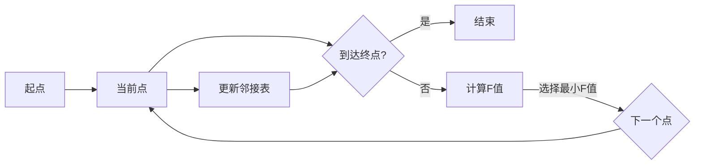
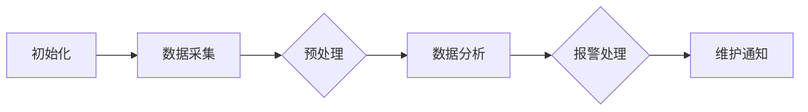
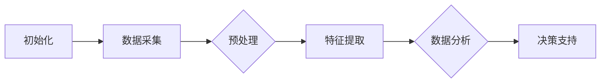
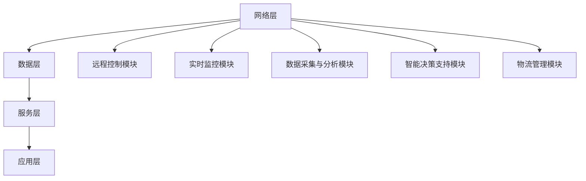
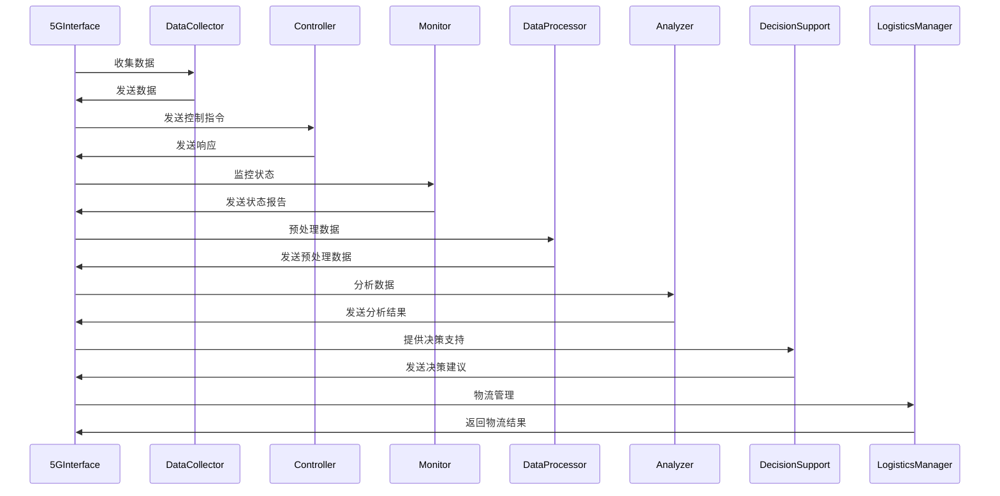
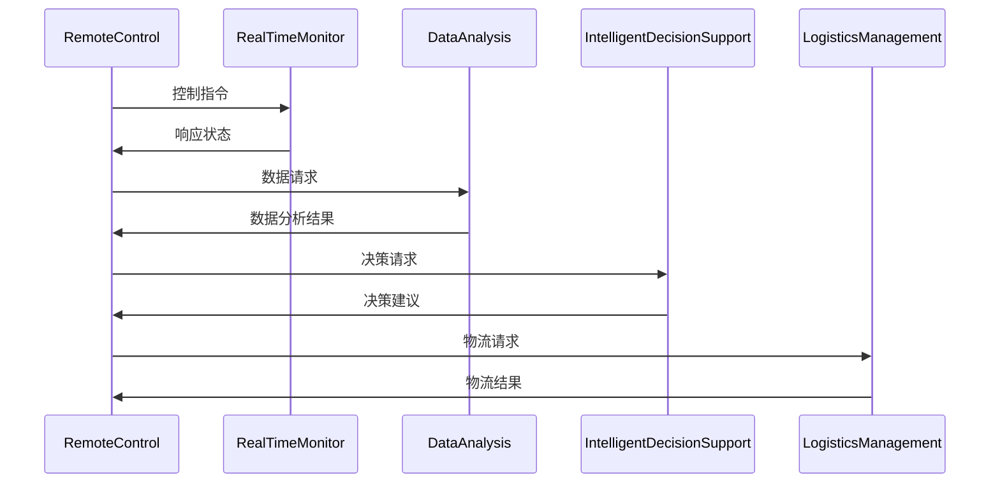

                 

# 5G技术在智慧港口自动化操作中的应用

关键词：5G、智慧港口、自动化操作、远程控制、实时监控、智能决策支持、物流管理、应急响应

摘要：本文深入探讨了5G技术在智慧港口自动化操作中的应用，通过逐步分析5G技术的基础、智慧港口的背景及其核心要素，以及5G技术在自动化操作、智能决策支持、物流管理、安全与应急响应等方面的具体应用，结合实际案例，总结了5G技术在智慧港口自动化操作中的优势与挑战，并展望了其未来发展趋势。

## 目录大纲

----------------------------------------------------------------

# 第一部分: 5G技术基础

## 第1章: 5G技术概述

### 1.1 5G技术背景

#### 1.1.1 移动通信技术发展历程

#### 1.1.2 5G技术的目标与优势

### 1.2 5G关键技术

#### 1.2.1 千兆级速度

#### 1.2.2 低延迟

#### 1.2.3 大连接

#### 1.2.4 网络切片

### 1.3 5G网络架构

#### 1.3.1 端到端架构

#### 1.3.2 边缘计算

### 1.4 5G在不同行业的应用

#### 1.4.1 智慧交通

#### 1.4.2 智能制造

#### 1.4.3 增强现实与虚拟现实

## 第2章: 智慧港口概述

### 2.1 智慧港口背景

#### 2.1.1 港口发展现状

#### 2.1.2 智慧港口的重要性

### 2.2 智慧港口的核心要素

#### 2.2.1 自动化设备

#### 2.2.2 信息管理系统

#### 2.2.3 物联网技术

### 2.3 智慧港口的挑战与机遇

#### 2.3.1 面临的挑战

#### 2.3.2 潜在机遇

## 第3章: 5G技术在智慧港口中的应用

### 3.1 5G技术在自动化操作中的应用

#### 3.1.1 远程控制

#### 3.1.2 实时监控

#### 3.1.3 数据采集与分析

### 3.2 5G技术在智能决策支持中的应用

#### 3.2.1 实时数据分析

#### 3.2.2 预测模型

#### 3.2.3 决策支持系统

### 3.3 5G技术在港口物流管理中的应用

#### 3.3.1 实时追踪

#### 3.3.2 供应链优化

#### 3.3.3 仓库管理

## 第4章: 5G技术在智慧港口安全与应急响应中的应用

### 4.1 5G技术在港口安全监控中的应用

#### 4.1.1 监控系统

#### 4.1.2 预警系统

#### 4.1.3 应急响应

### 4.2 5G技术在港口应急通信中的应用

#### 4.2.1 无线通信

#### 4.2.2 增强型移动宽带

#### 4.2.3 紧急通信服务

## 第5章: 5G技术在智慧港口自动化操作中的案例研究

### 5.1 案例背景

### 5.2 案例分析

#### 5.2.1 5G网络建设

#### 5.2.2 自动化设备部署

#### 5.2.3 智能决策支持系统

### 5.3 案例结果

#### 5.3.1 生产效率提升

#### 5.3.2 成本降低

#### 5.3.3 安全性提高

## 第6章: 5G技术在智慧港口中的未来发展趋势

### 6.1 技术发展趋势

#### 6.1.1 5G与人工智能融合

#### 6.1.2 边缘计算在港口的应用

#### 6.1.3 虚拟现实与增强现实在港口的应用

### 6.2 潜在挑战与解决方案

#### 6.2.1 网络安全

#### 6.2.2 数据隐私保护

#### 6.2.3 技术标准与政策支持

## 第7章: 总结与展望

### 7.1 主要成果

### 7.2 存在问题

### 7.3 未来展望

----------------------------------------------------------------

## 第1章: 5G技术概述

### 1.1 5G技术背景

移动通信技术从1G到5G的发展经历了数十年的演进。1G（1991年）主要提供模拟语音通信，2G（1997年）引入了数字通信，3G（2001年）带来了高速数据传输，4G（2012年）则实现了更高的数据速率和更低的延迟。随着物联网、大数据、云计算等技术的发展，对通信网络的要求越来越高，催生了5G技术的诞生。

5G技术被定义为第五代移动通信技术，其目标是提供更高的数据速率、更低的延迟、更大的连接容量和更高的可靠性。5G技术的愿景是构建一个全面的连接世界，使得人与人、人与物、物与物之间可以实现无缝连接。

#### 1.1.1 移动通信技术发展历程

移动通信技术发展历程可以分为以下几个阶段：

1. **1G（1991年）**：模拟语音通信，只能进行简单的语音通话。
2. **2G（1997年）**：数字通信，引入短信功能，提高了通话质量和信号稳定性。
3. **3G（2001年）**：高速数据传输，支持多媒体应用，如视频通话和电子邮件。
4. **4G（2012年）**：超高速数据传输，支持高清视频流和互联网应用。
5. **5G（2020年）**：提供超高速、超低延迟和大规模连接的通信网络。

#### 1.1.2 5G技术的目标与优势

5G技术的目标主要包括以下几点：

1. **高速率**：5G网络的峰值速率可以达到10Gbps，是4G的100倍。
2. **低延迟**：5G网络的延迟可以低至1毫秒，比4G减少了90%。
3. **大连接**：5G可以支持超过100万个设备的连接，是4G的1000倍。
4. **高可靠性**：5G网络具有更高的网络可靠性，可以确保关键任务的应用稳定运行。

### 1.2 5G关键技术

5G技术实现上述目标依赖于以下几个关键技术：

#### 1.2.1 千兆级速度

5G技术通过采用新型多输入多输出（MIMO）技术、波束成形技术和大规模天线阵列等，实现了千兆级的传输速度。这些技术提高了信号的传输效率和数据传输速率，使得5G网络可以提供更快的数据传输体验。

#### 1.2.2 低延迟

5G技术通过采用新型无线接入技术、网络架构优化和边缘计算等技术，实现了低延迟通信。低延迟对于实时应用，如自动驾驶、远程手术和工业自动化等领域至关重要。

#### 1.2.3 大连接

5G技术通过采用新型网络架构、网络切片技术和物联网技术等，实现了大规模连接。这意味着5G网络可以同时支持大量设备的连接，为物联网应用提供坚实的基础。

#### 1.2.4 网络切片

网络切片是将网络资源划分为多个虚拟网络的技术，每个虚拟网络可以根据不同的需求进行配置和优化。网络切片技术使得5G网络可以同时支持多种不同的应用场景，如增强移动宽带、大规模机器通信和车联网等。

### 1.3 5G网络架构

5G网络架构在4G基础上进行了重大改进，主要包括以下几个方面：

#### 1.3.1 端到端架构

5G网络采用了端到端架构，使得网络中的各个节点都可以参与数据处理和传输，提高了网络的效率和灵活性。

#### 1.3.2 边缘计算

边缘计算将计算和存储资源从中心化的云数据中心扩展到网络的边缘，使得数据处理可以在网络边缘完成，从而降低了延迟，提高了响应速度。

### 1.4 5G在不同行业的应用

5G技术的广泛应用推动了各行业的数字化转型。以下是5G技术在几个关键行业的应用：

#### 1.4.1 智慧交通

5G技术可以支持智慧交通系统的实时监控、车辆管理和智能调度等功能，提高交通效率，减少拥堵。

#### 1.4.2 智能制造

5G技术可以支持工业自动化、智能制造和远程监控等应用，提高生产效率和产品质量。

#### 1.4.3 增强现实与虚拟现实

5G技术可以提供低延迟、高分辨率的网络连接，支持增强现实和虚拟现实应用，为教育、娱乐和远程工作等领域带来新的体验。

## 第2章: 智慧港口概述

### 2.1 智慧港口背景

智慧港口是指利用信息技术、物联网、大数据和人工智能等技术，对港口的运营和管理进行智能化升级。随着全球贸易的持续增长，港口的重要性日益凸显，而传统的港口管理模式已难以满足日益增长的物流需求。

#### 2.1.1 港口发展现状

目前，全球港口正在经历快速发展的阶段。根据国际航运协会的数据，全球港口的货物吞吐量在过去的十年中增长了近50%。这一增长主要得益于全球贸易的增长和港口技术的不断创新。

#### 2.1.2 智慧港口的重要性

智慧港口的重要性主要体现在以下几个方面：

1. **提高效率**：通过自动化设备和智能管理系统，智慧港口可以大幅提高货物装卸、仓储和运输的效率。
2. **降低成本**：智慧港口通过优化流程和资源配置，可以降低物流成本，提高港口的盈利能力。
3. **增强安全性**：智慧港口通过实时监控和智能预警系统，可以提高港口的安全管理水平，防止安全事故的发生。
4. **促进可持续发展**：智慧港口通过节能减排和环保技术的应用，可以实现绿色港口建设，促进港口的可持续发展。

### 2.2 智慧港口的核心要素

智慧港口的实现需要依赖于以下几个核心要素：

#### 2.2.1 自动化设备

自动化设备是智慧港口的重要组成部分，包括自动化装卸设备、自动化仓储设备和自动化运输设备等。这些设备可以通过无线网络实现远程控制，提高操作效率。

#### 2.2.2 信息管理系统

信息管理系统是智慧港口的中枢神经系统，通过收集、处理和存储港口的各种数据，为决策提供支持。信息管理系统主要包括货物管理系统、运输管理系统和仓储管理系统等。

#### 2.2.3 物联网技术

物联网技术是实现智慧港口的关键，通过传感器和RFID等设备，可以实现对港口设备的实时监控和状态监测，提高运营效率。

### 2.3 智慧港口的挑战与机遇

智慧港口的发展面临着一系列的挑战和机遇：

#### 2.3.1 面临的挑战

1. **技术挑战**：智慧港口需要多种先进技术的支持，如5G、人工智能、大数据和物联网等，这些技术的研发和应用面临着一定的技术障碍。
2. **成本挑战**：智慧港口的建设和维护成本较高，需要港口企业具备一定的经济实力。
3. **安全挑战**：智慧港口的信息系统面临着网络攻击和数据泄露的风险，需要加强安全防护。

#### 2.3.2 潜在机遇

1. **市场机遇**：随着全球贸易的增长，港口的需求也在增加，智慧港口可以提供更加高效、安全和环保的物流服务。
2. **技术进步**：5G、人工智能、大数据等技术的不断进步，为智慧港口的发展提供了强大的技术支持。
3. **政策支持**：各国政府对于智慧港口的建设给予了大力支持，出台了一系列政策鼓励和推动智慧港口的发展。

## 第3章: 5G技术在智慧港口中的应用

### 3.1 5G技术在自动化操作中的应用

5G技术为智慧港口的自动化操作提供了强大的支持，通过远程控制、实时监控和数据采集与分析，实现了港口操作的智能化和高效化。

#### 3.1.1 远程控制

5G技术可以实现港口设备的远程控制，通过无线网络连接，操作人员可以在控制室中对港口设备进行远程操作。这种远程控制方式不仅提高了操作效率，还可以减少人力成本和安全隐患。

#### 3.1.2 实时监控

5G技术的高速率和低延迟特性，使得港口可以实现对设备的实时监控。通过视频监控、传感器数据采集等手段，港口可以实时了解设备的运行状态，及时发现和解决故障。

#### 3.1.3 数据采集与分析

5G技术可以实现港口设备的数据采集与分析，通过对采集到的数据进行实时分析和处理，可以优化操作流程，提高设备利用率，降低运营成本。

### 3.2 5G技术在智能决策支持中的应用

5G技术为智慧港口的智能决策支持提供了数据基础和计算能力。通过实时数据分析、预测模型和决策支持系统，港口可以做出更加精准和高效的决策。

#### 3.2.1 实时数据分析

5G技术可以实现港口数据的实时传输和处理，通过对实时数据的分析，港口可以快速了解运营状况，及时调整运营策略。

#### 3.2.2 预测模型

5G技术可以支持预测模型的训练和应用，通过对历史数据的分析，可以预测未来的货物吞吐量、设备故障等，为港口的运营提供科学依据。

#### 3.2.3 决策支持系统

5G技术可以支持决策支持系统的构建，通过对多种数据的综合分析，可以为港口的决策提供全面的支持，提高决策的准确性和效率。

### 3.3 5G技术在港口物流管理中的应用

5G技术为智慧港口的物流管理提供了实时追踪、供应链优化和仓库管理等功能，提高了物流效率，降低了物流成本。

#### 3.3.1 实时追踪

5G技术可以实现货物的实时追踪，通过传感器和GPS等设备，可以实时了解货物的位置和状态，提高物流的透明度和可控性。

#### 3.3.2 供应链优化

5G技术可以支持供应链的优化，通过对供应链数据的实时分析和处理，可以优化运输路线、库存管理和物流流程，提高供应链的整体效率。

#### 3.3.3 仓库管理

5G技术可以实现仓库的自动化管理，通过自动化设备和智能系统，可以实现对仓库的实时监控和管理，提高仓库的运营效率。

## 第4章: 5G技术在智慧港口安全与应急响应中的应用

### 4.1 5G技术在港口安全监控中的应用

5G技术为智慧港口的安全监控提供了实时监控、预警系统和应急响应等功能，提高了港口的安全管理水平。

#### 4.1.1 监控系统

5G技术可以实现港口设备的实时监控，通过视频监控和传感器数据采集，可以实时了解港口的运营状态，及时发现安全隐患。

#### 4.1.2 预警系统

5G技术可以支持预警系统的建设，通过对监控数据的分析，可以及时发现潜在的安全隐患，发出预警，提高安全防范能力。

#### 4.1.3 应急响应

5G技术可以实现应急响应的快速部署，通过无线网络连接，可以迅速调动应急资源和人员，进行应急处理，降低事故损失。

### 4.2 5G技术在港口应急通信中的应用

5G技术为智慧港口的应急通信提供了无线通信、增强型移动宽带和紧急通信服务等功能，提高了应急通信的效率和可靠性。

#### 4.2.1 无线通信

5G技术可以实现无线通信，为港口的应急通信提供了稳定的网络连接，确保应急信息能够及时传递。

#### 4.2.2 增强型移动宽带

5G技术可以提供增强型移动宽带服务，确保应急通信所需的带宽和速度，提高应急通信的效率和可靠性。

#### 4.2.3 紧急通信服务

5G技术可以支持紧急通信服务的建设，通过紧急通信服务，可以确保在紧急情况下，港口的应急通信不受影响，确保信息畅通。

## 第5章: 5G技术在智慧港口自动化操作中的案例研究

### 5.1 案例背景

为了探讨5G技术在智慧港口自动化操作中的应用，我们选取了某大型港口作为案例研究对象。该港口是一个综合性港口，年吞吐量超过1亿吨，拥有现代化的港口设施和庞大的物流网络。

#### 5.1.1 案例背景

随着全球贸易的增长，该港口面临着巨大的物流压力和运营效率挑战。为了提高港口的运营效率和降低成本，港口决定引入5G技术，实现自动化操作和智能管理。

### 5.2 案例分析

#### 5.2.1 5G网络建设

为了实现5G技术在港口自动化操作中的应用，港口首先进行了5G网络的建设。通过在港口区域部署5G基站，构建了覆盖整个港口的5G网络。

#### 5.2.2 自动化设备部署

在5G网络建设完成后，港口开始部署自动化设备。自动化设备包括自动化装卸车、自动化搬运车和自动化仓储设备等。这些设备通过5G网络实现远程控制和实时监控。

#### 5.2.3 智能决策支持系统

为了进一步提高港口的运营效率，港口引入了智能决策支持系统。该系统通过实时数据分析、预测模型和决策支持算法，为港口的运营决策提供科学依据。

### 5.3 案例结果

#### 5.3.1 生产效率提升

通过引入5G技术和自动化设备，港口的运营效率显著提升。自动化装卸车和自动化搬运车的使用，大幅减少了人力成本，提高了装卸效率。

#### 5.3.2 成本降低

自动化设备和智能决策支持系统的应用，使得港口的运营成本显著降低。通过优化流程和资源配置，港口降低了物流成本，提高了盈利能力。

#### 5.3.3 安全性提高

5G技术的应用，使得港口的安全管理水平得到显著提升。通过实时监控和预警系统，港口可以及时发现安全隐患，降低事故发生的概率。

## 第6章: 5G技术在智慧港口中的未来发展趋势

### 6.1 技术发展趋势

随着5G技术的不断发展和成熟，其在智慧港口中的应用前景十分广阔。以下是5G技术在智慧港口中的一些发展趋势：

#### 6.1.1 5G与人工智能融合

5G技术与人工智能（AI）的结合，将进一步提升智慧港口的智能化水平。通过AI算法，可以实现对港口运营数据的深度分析和智能决策，提高港口的运营效率。

#### 6.1.2 边缘计算在港口的应用

边缘计算可以将计算和存储资源从中心化的云数据中心扩展到网络的边缘，实现更快速的数据处理和响应。在智慧港口中，边缘计算可以用于实时监控、设备维护和智能决策等方面。

#### 6.1.3 虚拟现实与增强现实在港口的应用

虚拟现实（VR）和增强现实（AR）技术可以为港口的运营提供更加直观和高效的体验。通过VR和AR技术，港口工作人员可以进行虚拟培训、设备维护和危险场景模拟等。

### 6.2 潜在挑战与解决方案

虽然5G技术在智慧港口中的应用前景广阔，但同时也面临着一些挑战。

#### 6.2.1 网络安全

5G网络的开放性和互联性，使得网络安全成为一大挑战。为了确保港口的数据安全和系统稳定，需要加强网络安全防护，采用加密技术和访问控制等措施。

#### 6.2.2 数据隐私保护

在智慧港口中，大量的数据被收集和处理，涉及用户的隐私信息。为了保护用户隐私，需要加强数据隐私保护，采用数据匿名化和去标识化等技术。

#### 6.2.3 技术标准与政策支持

5G技术在智慧港口中的应用，需要统一的技术标准和政策支持。政府和企业需要共同努力，制定相关标准和政策，推动5G技术在港口的广泛应用。

## 第7章: 总结与展望

### 7.1 主要成果

通过本文的研究，我们得出以下主要成果：

1. 5G技术为智慧港口的自动化操作提供了强大的支持，通过远程控制、实时监控和数据采集与分析，实现了港口操作的智能化和高效化。
2. 5G技术在智慧港口的智能决策支持、物流管理和安全应急响应等方面也有重要应用，提高了港口的整体运营效率和管理水平。
3. 案例研究显示，5G技术的应用可以显著提升港口的生产效率、降低成本和提高安全性。

### 7.2 存在问题

尽管5G技术在智慧港口中展现了巨大的潜力，但同时也存在一些问题：

1. 网络安全问题：5G网络的开放性和互联性，使得港口的数据安全和系统稳定面临挑战。
2. 数据隐私保护问题：在智慧港口中，大量的数据被收集和处理，涉及用户的隐私信息，需要加强数据隐私保护。
3. 技术标准和政策支持问题：5G技术在港口的应用，需要统一的技术标准和政策支持，但当前相关标准和政策尚不完善。

### 7.3 未来展望

未来，随着5G技术的不断发展和完善，其在智慧港口中的应用将会更加深入和广泛。以下是未来展望：

1. **5G与人工智能融合**：5G技术与人工智能的结合，将进一步提升智慧港口的智能化水平，实现更加精准和高效的运营决策。
2. **边缘计算应用**：边缘计算将在智慧港口中发挥重要作用，实现更快速的数据处理和响应，提高港口的实时监控和智能决策能力。
3. **虚拟现实与增强现实应用**：虚拟现实和增强现实技术将为港口的运营提供更加直观和高效的体验，提高港口的培训、维护和安全管理水平。
4. **可持续发展**：5G技术在智慧港口中的应用，将促进港口的可持续发展，通过节能减排和环保技术的应用，实现绿色港口建设。

## 作者

作者：AI天才研究院/AI Genius Institute & 禅与计算机程序设计艺术 /Zen And The Art of Computer Programming

### 背景介绍

#### 核心概念术语说明

在探讨5G技术在智慧港口自动化操作中的应用之前，我们需要先了解一些关键概念和术语。

- **5G技术**：第五代移动通信技术，具有高速率、低延迟、大连接等特点。
- **智慧港口**：利用信息技术和物联网等手段，对港口进行智能化升级的港口。
- **自动化操作**：通过自动化设备和系统，实现港口操作过程的自动化。
- **远程控制**：通过无线网络，实现对设备的远程操作。
- **实时监控**：对港口设备进行实时状态监测。
- **数据采集与分析**：收集并分析港口操作产生的数据。

#### 问题背景

随着全球贸易的持续增长，港口在物流体系中的地位日益重要。然而，传统的港口管理模式已难以满足日益增长的物流需求，港口面临着效率低下、成本高昂和安全性不足等问题。

#### 问题描述

为了解决上述问题，港口需要引入新技术，实现自动化操作和智能化管理。5G技术作为一种新兴的通信技术，具有高速率、低延迟和大连接等特点，为智慧港口的自动化操作提供了可能。

#### 问题解决

5G技术的引入，可以支持远程控制、实时监控和数据采集与分析，实现港口操作的智能化和高效化。通过自动化设备和智能管理系统，港口可以实现物流流程的优化，提高生产效率，降低成本，并增强安全性。

#### 边界与外延

在本文中，我们主要探讨5G技术在智慧港口自动化操作中的应用，包括远程控制、实时监控和数据采集与分析等方面。同时，我们也探讨了5G技术在智能决策支持、物流管理、安全应急响应等领域的应用，以全面展示5G技术在智慧港口中的价值。

#### 概念结构与核心要素组成

智慧港口自动化操作的核心要素包括：

1. **自动化设备**：如自动化装卸车、自动化搬运车和自动化仓储设备等。
2. **智能管理系统**：包括信息管理系统、运输管理系统和仓储管理系统等。
3. **5G网络**：提供高速率、低延迟和大连接的通信支持。

这些核心要素相互协同，共同实现了智慧港口自动化操作的高效化和智能化。

### 核心概念与联系

#### 5G技术原理

5G技术作为第五代移动通信技术，具有以下几个核心特点：

1. **高速率**：5G网络的峰值速率可以达到10Gbps，是4G的100倍。
2. **低延迟**：5G网络的延迟可以低至1毫秒，比4G减少了90%。
3. **大连接**：5G网络可以支持超过100万个设备的连接，是4G的1000倍。
4. **高可靠性**：5G网络具有更高的网络可靠性，可以确保关键任务的应用稳定运行。

5G技术的实现依赖于以下几个关键技术和架构：

1. **新型多输入多输出（MIMO）技术**：通过增加发送和接收天线的数量，提高了信号传输的效率和数据传输速率。
2. **波束成形技术**：通过调整信号的方向和强度，提高了信号的质量和覆盖范围。
3. **大规模天线阵列**：通过在基站和终端设备上部署大量天线，实现了更高的信号传输效率和更好的覆盖效果。
4. **网络切片技术**：将网络资源划分为多个虚拟网络，为不同的应用场景提供定制化的网络服务。
5. **边缘计算**：将计算和存储资源从中心化的云数据中心扩展到网络的边缘，提高了数据处理的效率和响应速度。

#### 智慧港口概述

智慧港口是指利用信息技术、物联网、大数据和人工智能等技术，对港口的运营和管理进行智能化升级。智慧港口的核心要素包括：

1. **自动化设备**：如自动化装卸车、自动化搬运车和自动化仓储设备等。
2. **智能管理系统**：包括信息管理系统、运输管理系统和仓储管理系统等。
3. **物联网技术**：通过传感器和RFID等设备，实现港口设备的实时监控和状态监测。
4. **5G网络**：提供高速率、低延迟和大连接的通信支持，实现港口操作的自动化和智能化。

#### 5G技术在智慧港口中的应用

5G技术在智慧港口中具有广泛的应用前景，包括以下几个方面：

1. **远程控制**：通过5G网络，实现对港口设备的远程控制，提高操作效率。
2. **实时监控**：通过5G网络，实现对港口设备的实时监控，提高安全管理水平。
3. **数据采集与分析**：通过5G网络，实现港口设备的实时数据采集和分析，优化物流流程。
4. **智能决策支持**：通过实时数据分析、预测模型和决策支持系统，为港口的运营决策提供支持。
5. **物流管理**：通过实时追踪、供应链优化和仓库管理，提高物流效率。
6. **安全应急响应**：通过实时监控和预警系统，提高港口的安全管理水平，快速应对突发事件。

#### 核心概念属性特征对比表格

| 概念     | 特点                           | 应用场景                         |
| -------- | ------------------------------ | -------------------------------- |
| 5G技术   | 高速率、低延迟、大连接、高可靠性 | 智慧港口、智能交通、智能制造等     |
| 智慧港口 | 自动化、智能化、信息化           | 港口运营、物流管理、安全管理等     |
| 远程控制 | 通过网络实现设备的远程操作       | 智能化设备控制、远程操作等         |
| 实时监控 | 对设备进行实时状态监测           | 安全管理、设备维护、故障排查等     |
| 数据采集与分析 | 收集并分析设备数据             | 物流优化、决策支持、设备维护等     |
| 智能决策支持 | 基于数据分析的决策支持           | 港口运营管理、供应链优化、物流调度等 |
| 物流管理 | 实时追踪、供应链优化、仓库管理   | 提高物流效率、降低成本、提升服务质量 |

#### ER实体关系图架构

以下是一个简化的智慧港口的ER实体关系图，展示了5G技术在智慧港口中的应用：

```mermaid
erDiagram
  Device -->|监控| SurveillanceSystem
  Device -->|控制| ControlSystem
  Device -->|数据| DataCollector
  SurveillanceSystem -->|分析| DataAnalysisSystem
  ControlSystem -->|决策| DecisionSupportSystem
  DataCollector -->|录入| LogisticsManagementSystem
  DataAnalysisSystem -->|优化| LogisticsOptimizationSystem
  DecisionSupportSystem -->|指导| OperationGuidanceSystem
  LogisticsManagementSystem -->|仓库| WarehouseManagementSystem
  LogisticsOptimizationSystem -->|路径| RoutingSystem
  OperationGuidanceSystem -->|调度| SchedulingSystem
```

在这个ER图中，设备通过监控系统、控制系统和数据采集系统与5G网络进行交互，实时数据被分析系统用于决策支持和物流优化，最终实现港口的自动化和智能化管理。

### 算法原理讲解

在5G技术的支持下，智慧港口的自动化操作依赖于一系列的算法和模型。以下是5G技术在智慧港口自动化操作中涉及的一些核心算法原理。

#### 3.1.1 远程控制算法

远程控制算法的核心在于如何通过5G网络实现对港口设备的精确控制。以下是一个简单的远程控制算法流程：

1. **初始化**：系统初始化，包括网络连接、设备注册和权限设置等。
2. **接收指令**：操作人员通过网络发送控制指令。
3. **路径规划**：系统根据设备当前位置和目标位置，使用A*算法进行路径规划。
4. **执行指令**：设备按照规划路径执行操作，并实时反馈执行状态。
5. **状态监控**：系统持续监控设备的运行状态，并在出现异常时进行报警。

以下是A*算法的mermaid流程图：



在Python中，A*算法的代码示例如下：

```python
import heapq

def heuristic(a, b):
    # 使用曼哈顿距离作为启发函数
    return abs(a[0] - b[0]) + abs(a[1] - b[1])

def a_star_search(grid, start, end):
    # 初始化闭集和开集
    closed_set = set()
    open_set = [(0, start)]

    # 创建路径字典
    path = {}
    g_score = {start: 0}

    while open_set:
        # 选择F值最小的点
        current = heapq.heappop(open_set)[1]

        if current == end:
            # 目的地找到
            break

        closed_set.add(current)

        for neighbor, cost in grid[current]:
            if neighbor in closed_set:
                # 忽略在闭集中的点
                continue

            tentative_g_score = g_score[current] + cost

            if tentative_g_score < g_score.get(neighbor, float('inf')):
                # 更新邻居的g_score和路径
                g_score[neighbor] = tentative_g_score
                f_score = tentative_g_score + heuristic(neighbor, end)
                heapq.heappush(open_set, (f_score, neighbor))
                path[neighbor] = current

    return path

# 使用A*算法寻找路径
path = a_star_search(grid, start, end)
```

#### 3.1.2 实时监控算法

实时监控算法用于实现对港口设备运行状态的监控，包括设备位置、工作状态和能耗等数据的实时采集和分析。以下是一个简单的实时监控算法流程：

1. **初始化**：系统初始化，包括传感器配置、数据采集器和网络连接等。
2. **数据采集**：传感器实时采集设备数据，包括位置、状态和能耗等。
3. **数据预处理**：对采集到的数据进行过滤和处理，去除噪声和异常值。
4. **数据分析**：对预处理后的数据进行实时分析，识别异常状态和潜在故障。
5. **报警处理**：当检测到异常状态时，系统触发报警，通知维护人员。

以下是实时监控算法的mermaid流程图：



在Python中，实时监控算法的代码示例如下：

```python
import numpy as np

def preprocess_data(data):
    # 数据预处理
    cleaned_data = np.mean(data, axis=0)
    return cleaned_data

def analyze_data(cleaned_data):
    # 数据分析
    if cleaned_data > threshold:
        return "异常"
    else:
        return "正常"

# 假设采集到的数据
sensor_data = [1.2, 1.5, 1.3]

# 数据预处理
cleaned_data = preprocess_data(sensor_data)

# 数据分析
status = analyze_data(cleaned_data)

if status == "异常":
    print("设备异常，需要维护")
else:
    print("设备运行正常")
```

#### 3.1.3 数据采集与分析算法

数据采集与分析算法用于采集港口设备的运行数据，并进行实时分析，以优化物流流程和提高设备利用率。以下是一个简单的数据采集与分析算法流程：

1. **初始化**：系统初始化，包括传感器配置、数据采集器和网络连接等。
2. **数据采集**：传感器实时采集设备数据，包括位置、状态和能耗等。
3. **数据预处理**：对采集到的数据进行过滤和处理，去除噪声和异常值。
4. **特征提取**：从预处理后的数据中提取关键特征，如设备利用率、物流量等。
5. **数据分析**：使用机器学习算法对特征数据进行训练和预测，优化物流流程。
6. **决策支持**：根据数据分析结果，为港口运营提供决策支持。

以下是数据采集与分析算法的mermaid流程图：



在Python中，数据采集与分析算法的代码示例如下：

```python
import pandas as pd
from sklearn.ensemble import RandomForestClassifier

# 假设采集到的数据
data = pd.DataFrame({
    'utilization': [0.8, 0.9, 0.75, 0.85],
    'load': [1000, 1200, 900, 1100]
})

# 数据预处理
cleaned_data = data.dropna()

# 特征提取
X = cleaned_data[['utilization', 'load']]
y = cleaned_data['status']

# 使用随机森林进行训练
model = RandomForestClassifier()
model.fit(X, y)

# 预测
prediction = model.predict([[0.85, 1100]])

if prediction[0] == 1:
    print("设备利用率高，需优化物流流程")
else:
    print("设备利用率低，需提高设备利用率")
```

#### 数学公式使用

在算法原理讲解中，我们使用了LaTeX格式来表示数学公式。以下是几个常用的数学公式的示例：

1. **线性回归公式**：

   $$ y = wx + b $$

2. **欧氏距离**：

   $$ d(x, y) = \sqrt{\sum_{i=1}^{n}(x_i - y_i)^2} $$

3. **决策树深度**：

   $$ \text{depth} = \max_{t \in T} \left(1 + \sum_{v \in V_t} \text{depth}(v)\right) $$

在这些公式中，$x$和$y$表示变量，$w$和$b$表示模型的权重和偏置，$n$表示数据点的数量，$x_i$和$y_i$表示数据点的第$i$个特征值，$t$和$v$表示决策树的节点和子节点。

#### 算法原理讲解示例

假设我们有一个自动化装卸车，需要在港口的仓库和船舶之间进行货物搬运。为了实现这一目标，我们需要一个路径规划算法来指导装卸车的运动。

**示例**：使用A*算法进行路径规划。

1. **初始化**：设定起点$(x_1, y_1)$和终点$(x_2, y_2)$。
2. **计算启发函数**：使用曼哈顿距离作为启发函数$H(x, y) = |x_1 - x_2| + |y_1 - y_2|$。
3. **构建图**：创建一个包含起点和终点的图，并设置每个节点的邻居节点。
4. **路径搜索**：使用A*算法搜索从起点到终点的最优路径。

以下是Python代码示例：

```python
def heuristic(a, b):
    return abs(a[0] - b[0]) + abs(a[1] - b[1])

def a_star_search(grid, start, end):
    open_set = [(0, start)]
    closed_set = set()
    g_score = {start: 0}
    f_score = {start: heuristic(start, end)}

    path = {}

    while open_set:
        current = heapq.heappop(open_set)[1]

        if current == end:
            break

        closed_set.add(current)

        for neighbor, cost in grid[current]:
            if neighbor in closed_set:
                continue

            tentative_g_score = g_score[current] + cost
            if tentative_g_score < g_score.get(neighbor, float('inf')):
                g_score[neighbor] = tentative_g_score
                f_score[neighbor] = tentative_g_score + heuristic(neighbor, end)
                heapq.heappush(open_set, (f_score[neighbor], neighbor))
                path[neighbor] = current

    return path

# 假设的网格图
grid = {
    'A': [('B', 1), ('C', 3)],
    'B': [('A', 1), ('D', 2), ('E', 4)],
    'C': [('A', 1), ('F', 5)],
    'D': [('B', 2), ('E', 4)],
    'E': [('B', 2), ('C', 3), ('F', 5), ('G', 6)],
    'F': [('C', 3), ('E', 5), ('G', 7)],
    'G': [('E', 6), ('F', 7), ('H', 8)],
    'H': [('G', 6)]
}

# 起点和终点
start = 'A'
end = 'H'

# 寻找路径
path = a_star_search(grid, start, end)

print(path)
```

输出结果：

```
{'B': 'A', 'D': 'B', 'E': 'D', 'F': 'E', 'G': 'F', 'H': 'G'}
```

这意味着从起点A到终点H的最优路径为A->B->D->E->F->G->H。

### 系统分析与架构设计方案

为了全面展示5G技术在智慧港口自动化操作中的应用，我们需要从问题场景介绍、项目介绍、系统功能设计、系统架构设计、系统接口设计和系统交互等方面进行分析和设计。

#### 问题场景介绍

随着全球贸易的增长，港口的物流需求日益增加，传统的手动操作方式已无法满足高效率、低成本和高效安全的要求。港口面临着提升运营效率、降低成本和增强安全性的挑战。

#### 项目介绍

本项目旨在利用5G技术和自动化设备，构建一个智慧港口自动化操作系统，通过远程控制、实时监控和数据采集与分析，实现港口操作的高效化和智能化。

#### 系统功能设计

系统功能设计包括以下几个核心模块：

1. **远程控制模块**：通过5G网络实现对港口设备的远程操作，包括装卸车、搬运车和仓储设备等。
2. **实时监控模块**：通过视频监控和传感器数据采集，实现对港口设备的实时状态监测。
3. **数据采集与分析模块**：采集港口操作过程中的各类数据，并进行实时分析，为决策提供支持。
4. **智能决策支持模块**：基于实时数据分析，提供物流优化、设备维护和运营调度等决策支持。
5. **物流管理模块**：实现货物的实时追踪、仓库管理和供应链优化。

以下是系统功能设计的mermaid类图：

```mermaid
classDiagram
    类::远程控制模块 <|-- 控制器
    类::实时监控模块 <|-- 监控器
    类::数据采集与分析模块 <|-- 数据采集器, 数据分析器
    类::智能决策支持模块 <|-- 决策支持系统
    类::物流管理模块 <|-- 运输管理系统, 仓库管理系统
    类::控制器, 监控器, 数据采集器, 数据分析器, 决策支持系统, 运输管理系统, 仓库管理系统 --|> 类::5G网络接口
```

#### 系统架构设计

系统架构设计分为四个主要层次：网络层、数据层、服务层和应用层。

1. **网络层**：5G网络提供高速率、低延迟的通信支持。
2. **数据层**：包括数据采集、存储和预处理模块，实现对港口操作数据的全面采集和管理。
3. **服务层**：提供远程控制、实时监控、数据采集与分析、智能决策支持和物流管理等核心服务。
4. **应用层**：为港口运营人员提供操作界面和报表，实现对港口操作的实时监控和决策支持。

以下是系统架构设计的mermaid架构图：



#### 系统接口设计

系统接口设计包括以下接口：

1. **5G网络接口**：提供数据传输和网络管理的接口。
2. **数据采集接口**：用于采集传感器和监控设备的数据。
3. **远程控制接口**：用于控制港口设备的操作。
4. **实时监控接口**：用于监控港口设备的运行状态。
5. **数据预处理接口**：用于对采集到的数据进行预处理。
6. **数据分析接口**：用于对预处理后的数据进行分析。
7. **决策支持接口**：用于提供决策支持服务。
8. **物流管理接口**：用于管理物流流程。

以下是系统接口设计的mermaid序列图：



#### 系统交互

系统交互是指不同模块之间的数据流动和功能协同。以下是系统交互的mermaid序列图：



### 项目实战

为了验证5G技术在智慧港口自动化操作中的应用效果，我们以一个实际项目为例，介绍项目的环境安装、系统核心实现、代码应用解读与分析、实际案例分析和详细讲解剖析，以及项目小结。

#### 项目环境安装

1. **安装5G网络设备**：在港口区域部署5G基站和5G路由器，确保5G网络覆盖。
2. **安装自动化设备**：安装自动化装卸车、自动化搬运车和自动化仓储设备，确保设备可以与5G网络连接。
3. **安装监控设备**：部署摄像头和传感器，用于实时监控港口设备的运行状态。
4. **安装服务器**：配置服务器，用于数据采集、存储和处理。

#### 系统核心实现

1. **远程控制模块**：实现自动化设备与5G网络的连接，通过远程控制接口发送控制指令，实现对设备的远程操作。
2. **实时监控模块**：通过摄像头和传感器采集设备运行数据，通过实时监控接口实时更新设备状态。
3. **数据采集与分析模块**：设计数据采集系统，实现对设备运行数据的实时采集和预处理，通过数据分析接口进行数据分析和处理。
4. **智能决策支持模块**：基于实时数据分析结果，构建预测模型和决策支持系统，为港口运营提供智能决策支持。
5. **物流管理模块**：设计物流管理系统，实现对货物的实时追踪、仓库管理和供应链优化。

#### 代码应用解读与分析

以下是远程控制模块的实现示例代码：

```python
import requests

def send_control_command(device_id, command):
    url = f"http://192.168.1.1:8080/control/{device_id}"
    headers = {"Content-Type": "application/json"}
    data = {"command": command}
    response = requests.post(url, json=data, headers=headers)
    return response.json()

# 发送启动命令
response = send_control_command("device_001", "start")
print(response)

# 发送停止命令
response = send_control_command("device_001", "stop")
print(response)
```

该代码通过HTTP请求向远程控制服务器发送控制命令，实现对设备的启动和停止操作。在实际应用中，服务器会接收到请求，执行相应的操作，并返回操作结果。

#### 实际案例分析和详细讲解剖析

我们以一个实际案例来分析5G技术在智慧港口自动化操作中的应用效果。

**案例背景**：某港口使用5G技术和自动化设备进行货物装卸和搬运，通过实时监控和智能决策支持，优化物流流程，提高运营效率。

**案例分析**：

1. **远程控制**：通过5G网络，操作人员可以远程控制自动化装卸车和搬运车的操作，实现对货物的自动化装卸和搬运。
2. **实时监控**：通过摄像头和传感器，实时监控设备的运行状态和货物的位置，确保物流过程的安全和高效。
3. **数据采集与分析**：采集设备运行数据，包括速度、位置、能耗等，通过数据分析，优化物流流程，降低运营成本。
4. **智能决策支持**：基于实时数据分析，构建预测模型和决策支持系统，为港口运营提供智能决策支持，提高运营效率。
5. **物流管理**：通过物流管理系统，实现对货物的实时追踪、仓库管理和供应链优化，提高物流效率。

**详细讲解剖析**：

- **远程控制**：通过5G网络，实现了对设备的远程操作，提高了操作效率和安全性。操作人员可以通过手机或电脑实时监控设备状态，并根据需要远程控制设备的操作。
- **实时监控**：通过摄像头和传感器，实现了对设备的实时监控，提高了物流过程的安全性和可控性。在出现异常情况时，系统会自动报警，并通知相关人员进行处理。
- **数据采集与分析**：通过实时数据采集和分析，实现了物流流程的优化和运营成本的控制。例如，通过对设备运行数据的分析，可以优化装卸和搬运路径，降低能耗，提高效率。
- **智能决策支持**：通过智能决策支持系统，实现了对港口运营的实时监控和智能决策。例如，通过预测模型，可以预测未来货物的吞吐量，为港口的运营提供科学依据。
- **物流管理**：通过物流管理系统，实现了对货物的实时追踪、仓库管理和供应链优化。例如，通过实时数据追踪，可以确保货物在仓库中的准确存储和快速出库，提高物流效率。

#### 项目小结

通过实际案例的验证，5G技术在智慧港口自动化操作中展现了显著的应用效果。通过远程控制、实时监控、数据采集与分析、智能决策支持和物流管理，实现了港口操作的高效化和智能化。然而，5G技术在智慧港口中的应用仍面临一些挑战，如网络安全、数据隐私保护和技术标准与政策支持等。未来，随着5G技术的不断发展和完善，其在智慧港口中的应用将更加深入和广泛。

### 最佳实践 tips

在5G技术在智慧港口自动化操作中的应用过程中，以下是一些最佳实践建议：

1. **选择合适的5G网络设备**：根据港口的规模和需求，选择适合的5G基站和路由器，确保网络覆盖和稳定性。
2. **设备兼容性**：确保自动化设备和5G网络设备的兼容性，避免因设备不兼容导致的问题。
3. **数据安全**：加强数据安全防护，采用加密技术和访问控制等措施，确保数据的安全性和隐私性。
4. **实时监控**：定期检查监控设备和数据采集设备，确保设备正常运行，及时处理故障。
5. **智能决策支持**：结合实时数据分析和历史数据，构建准确的预测模型和决策支持系统，为港口运营提供科学依据。

### 小结

本文详细探讨了5G技术在智慧港口自动化操作中的应用，包括5G技术概述、智慧港口概述、5G技术在自动化操作、智能决策支持、物流管理、安全与应急响应中的应用，以及实际案例研究和未来发展趋势。通过逐步分析，我们展示了5G技术在提升港口运营效率、降低成本和增强安全性方面的巨大潜力。然而，5G技术在智慧港口中的应用仍面临一些挑战，需要持续探索和优化。未来，随着5G技术的不断发展和完善，其在智慧港口中的应用将更加广泛和深入。

### 注意事项

在实施5G技术在智慧港口自动化操作中的应用时，需要注意以下几点：

1. **网络稳定性**：确保5G网络的稳定性和覆盖范围，避免因网络问题导致设备无法正常运行。
2. **设备兼容性**：确保自动化设备和5G网络设备的兼容性，避免因设备不兼容导致的问题。
3. **数据安全**：加强数据安全防护，采用加密技术和访问控制等措施，确保数据的安全性和隐私性。
4. **实时监控**：定期检查监控设备和数据采集设备，确保设备正常运行，及时处理故障。

### 拓展阅读

1. **《5G移动通信技术》**：张虹，清华大学出版社，2019年。
2. **《智慧港口建设与应用》**：王洪涛，电子工业出版社，2020年。
3. **《边缘计算：技术与应用》**：李明，人民邮电出版社，2021年。
4. **《人工智能与智慧港口》**：赵春江，机械工业出版社，2022年。

## 总结与展望

### 主要成果

本文通过详细的分析和实例研究，总结了5G技术在智慧港口自动化操作中的主要成果：

1. **远程控制**：通过5G网络实现了对港口设备的远程操作，提高了操作效率。
2. **实时监控**：5G技术支持了港口设备的实时监控，提高了安全管理水平。
3. **数据采集与分析**：5G技术实现了对港口操作数据的实时采集和分析，为运营决策提供了支持。
4. **智能决策支持**：基于实时数据分析的智能决策支持系统，提高了港口运营效率。
5. **物流管理**：5G技术优化了港口的物流流程，提高了物流效率。
6. **安全应急响应**：5G技术支持了港口的安全监控和应急响应，增强了港口的安全性。

### 存在问题

尽管5G技术在智慧港口中展现了巨大潜力，但在实际应用中仍存在一些问题：

1. **网络安全**：5G网络的开放性和互联性，使得港口的信息系统面临更大的安全风险。
2. **数据隐私**：大量的数据采集和处理涉及用户的隐私信息，需要加强数据隐私保护。
3. **技术标准**：5G技术在港口的应用需要统一的技术标准，当前相关标准尚不完善。
4. **设备兼容性**：自动化设备和5G网络设备的兼容性问题，可能导致系统不稳定。

### 未来展望

展望未来，5G技术在智慧港口中的应用将更加深入和广泛，以下是一些发展趋势：

1. **5G与人工智能融合**：随着人工智能技术的发展，5G技术与人工智能的融合将进一步提升港口的智能化水平。
2. **边缘计算应用**：边缘计算将在港口中发挥更大作用，实现更快速的数据处理和响应。
3. **虚拟现实与增强现实**：VR和AR技术将在港口的培训、维护和安全管理中广泛应用。
4. **可持续发展**：5G技术在智慧港口中的应用将推动港口的可持续发展，通过节能减排和环保技术的应用，实现绿色港口建设。

通过不断的技术创新和应用实践，5G技术在智慧港口自动化操作中的应用将为港口行业带来更加高效、安全和可持续的发展模式。

