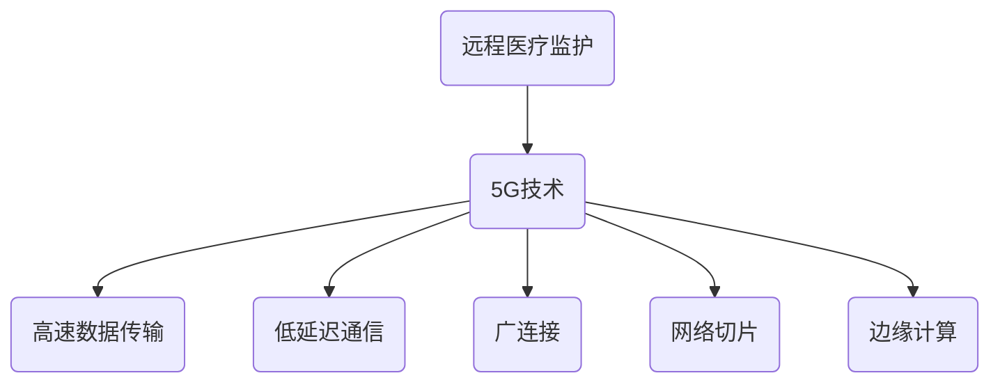
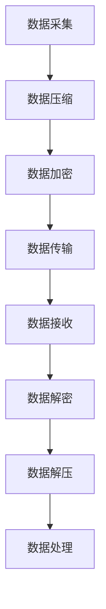
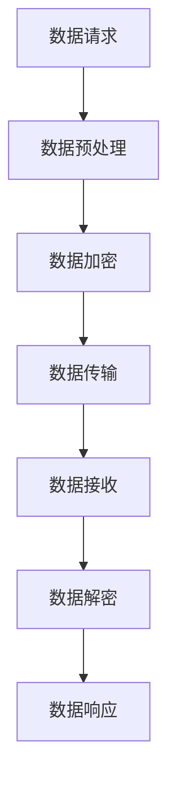
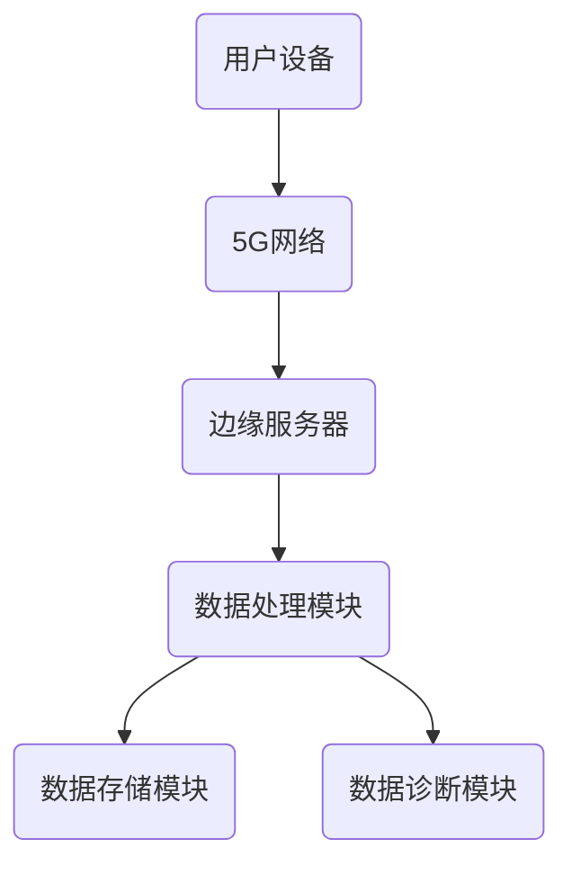

                 


## 5G技术在远程医疗监护中的应用

### 关键词
- 5G技术
- 远程医疗监护
- 网络切片
- 低延迟通信
- 高速度数据传输

### 摘要
本文深入探讨了5G技术在远程医疗监护中的应用。随着5G技术的不断发展，远程医疗监护面临的新机遇与挑战也逐渐显现。文章首先介绍了5G技术的基本概念和主要特性，然后详细分析了5G技术如何提升远程医疗监护的质量和效率。通过实例和实际应用案例，本文展示了5G技术在远程医疗监护中的实际效果，并提出了未来发展趋势和改进方向。

## 引言

远程医疗监护作为一种新兴的医疗模式，正逐步改变传统医疗服务的格局。特别是在5G技术的推动下，远程医疗监护迎来了新的发展契机。5G技术以其高速度、低延迟、大容量和广连接的特点，为远程医疗监护提供了坚实的基础。

首先，5G技术的高速度数据传输能力，使得医疗数据可以实时传输，极大地提高了医疗服务的响应速度。低延迟特性则确保了医疗决策的实时性，这对于需要紧急处理的医疗情况尤为重要。此外，5G技术的网络切片技术可以实现不同类型医疗服务的差异化网络资源分配，提高了网络资源的利用率。

然而，5G技术在远程医疗监护中的应用也面临一些挑战，如网络覆盖不足、设备兼容性问题以及数据安全和隐私保护等问题。本文将围绕这些问题，详细探讨5G技术在远程医疗监护中的应用，分析其优势和挑战，并提出相应的解决方案。

## 5G技术的基本概念和主要特性

### 5G技术的定义

5G技术，即第五代移动通信技术，是继2G、3G和4G之后的新一代移动通信技术。与4G相比，5G在多个维度上有了显著的提升，包括速度、延迟、容量和连接数等。

### 5G技术的核心特性

1. **高速度**：5G的最大下载速度可以达到数十Gbps，远高于4G的1Gbps。这使得大量的数据可以在极短的时间内传输完成，为高速数据传输需求提供了基础。

2. **低延迟**：5G的端到端延迟可以降低到1毫秒以内，而4G的延迟大约在20-60毫秒。低延迟对于实时应用，如远程手术、实时监控等至关重要。

3. **大容量**：5G网络的连接数密度达到了每平方米100万台设备，这为大规模设备连接提供了可能，如智能家居、智能医疗等。

4. **广连接**：5G支持广泛的无线接入方式，包括低轨卫星、地面无线和有线网络等，提供了更广泛的接入选择。

5. **网络切片**：5G引入了网络切片技术，可以针对不同的应用场景动态分配网络资源，提高了网络的灵活性和资源利用率。

### 5G技术的关键技术和标准

1. **毫米波通信**：5G使用毫米波频段进行通信，这一频段具有更高的带宽，能够支持更高的数据传输速度。

2. **多连接MIMO（Multiple Input Multiple Output）**：5G采用了更多的天线和更多的信号路径，提高了信号传输的可靠性和速度。

3. **网络虚拟化**：5G网络实现了网络功能的虚拟化，使得网络资源可以更加灵活地分配和管理。

4. **边缘计算**：5G结合了边缘计算技术，将数据处理和分析推向网络边缘，减少了数据传输的延迟。

5. **5G标准**：包括IMT-2020（国际移动通信计划）和3GPP（第三代合作伙伴计划）等，这些标准为5G技术的发展提供了技术规范和标准框架。

### 5G技术对远程医疗监护的影响

5G技术的这些核心特性和关键技术，使其在远程医疗监护中的应用变得可能。高速度和低延迟使得医疗数据可以实时传输，支持远程手术、远程诊断等应用。大容量和广连接则支持了大规模设备连接，如医疗设备、健康监测设备等。网络切片技术可以满足不同医疗服务场景的特殊需求，如急救、慢性病管理等。

总的来说，5G技术为远程医疗监护带来了前所未有的机遇，但同时也带来了一些挑战，如设备兼容性、网络覆盖和数据安全等问题。接下来，我们将进一步探讨5G技术在远程医疗监护中的应用场景和实现方法。

## 5G技术在远程医疗监护中的应用场景和实现方法

### 远程手术

远程手术是5G技术在医疗领域最引人注目的应用之一。借助5G技术的高速度和低延迟，医生可以实时远程控制手术设备，进行远程手术操作。具体实现方法包括：

1. **手术控制系统的建设**：需要建立一套高可靠性、低延迟的手术控制系统，包括手术机器人、远程控制终端和5G网络。
2. **高精度传感器和成像设备**：通过高精度传感器和成像设备，获取患者的实时手术图像和生理参数，并通过5G网络传输给医生。
3. **远程控制与操作**：医生通过远程控制终端，实时操作手术机器人，完成手术操作。

### 远程诊断

远程诊断是另一种重要的5G技术应用场景，它利用5G的高速度和大容量特性，实现医疗数据的快速传输和分析。具体实现方法包括：

1. **医疗设备接入**：将各种医疗设备接入5G网络，如心电图机、血压计、血糖仪等，实时采集患者的生理数据。
2. **数据传输与存储**：通过5G网络将采集到的医疗数据实时传输至数据中心，并进行存储和管理。
3. **数据分析与诊断**：利用人工智能和大数据分析技术，对医疗数据进行分析，提供诊断报告。

### 慢性病管理

慢性病管理是5G技术在远程医疗监护中的另一个重要应用场景。通过5G技术，可以实现慢性病患者的远程监控和管理，提高患者的生活质量。具体实现方法包括：

1. **健康监测设备**：为慢性病患者配备各种健康监测设备，如心率监测器、血压监测器等，实时监测患者的生理参数。
2. **数据传输与反馈**：通过5G网络，将患者的健康数据实时传输至医疗中心，医生根据数据反馈进行病情评估和调整治疗方案。
3. **远程咨询与指导**：医生可以通过远程视频咨询，为患者提供健康指导和建议，帮助患者更好地管理慢性病。

### 紧急救援

紧急救援是5G技术在远程医疗监护中应用的关键场景之一。5G技术的高速度和低延迟特性，使得紧急救援能够更加迅速、准确地进行。具体实现方法包括：

1. **紧急响应系统的建设**：建立一套紧急响应系统，包括紧急呼叫设备、5G网络和医疗中心的急救团队。
2. **实时数据传输**：通过5G网络，将患者的紧急数据实时传输至医疗中心，医生可以根据数据做出紧急处理决策。
3. **远程协助与指挥**：医疗中心的急救团队可以通过远程视频和语音通讯，协助现场急救人员实施救援操作。

### 远程医疗教育

远程医疗教育是5G技术在医疗领域的另一个应用场景。通过5G技术，可以实现高质量的远程医疗教育和培训，提高医疗人员的能力和水平。具体实现方法包括：

1. **远程教学平台**：建立远程教学平台，包括课程视频、在线讨论区和实时互动功能。
2. **高质量视频传输**：通过5G网络，实现高质量的实时视频传输，确保教学内容的清晰和流畅。
3. **互动与交流**：学生和教师可以通过实时互动功能，进行在线讨论和交流，提高教学效果。

### 总结

5G技术在远程医疗监护中的应用，不仅提高了医疗服务质量和效率，还为医疗行业带来了全新的发展机遇。通过5G技术，可以实现远程手术、远程诊断、慢性病管理、紧急救援和远程医疗教育等多种应用场景，为医疗行业带来了深刻变革。然而，5G技术在远程医疗监护中的应用也面临一些挑战，如网络覆盖、设备兼容性、数据安全和隐私保护等问题。这些问题需要在未来进一步解决，以充分发挥5G技术在远程医疗监护中的潜力。

### 背景介绍

#### 核心概念术语说明

- **远程医疗监护**：远程医疗监护是指通过远程通信技术，对患者的健康状态进行实时监控和管理的医疗服务。它包括远程诊断、远程手术、慢性病管理等多种应用场景。
- **5G技术**：5G技术是指第五代移动通信技术，以其高速度、低延迟、大容量和广连接的特点，为远程医疗监护提供了技术基础。
- **网络切片**：网络切片是一种将网络资源划分为多个虚拟网络的技术，可以为不同的应用场景提供定制化的网络服务。
- **边缘计算**：边缘计算是一种将数据处理和分析推向网络边缘的计算模式，可以减少数据传输的延迟，提高系统的响应速度。

#### 问题背景

远程医疗监护作为一种新兴的医疗模式，正逐步改变传统医疗服务的格局。然而，传统通信技术在远程医疗监护中的应用存在一些限制，如数据传输速度慢、延迟高、网络容量不足等。这些问题严重影响了远程医疗监护的质量和效率。

随着5G技术的不断发展，远程医疗监护面临新的机遇。5G技术以其高速度、低延迟、大容量和广连接的特点，为远程医疗监护提供了技术基础。然而，5G技术在远程医疗监护中的应用也面临一些挑战，如网络覆盖不足、设备兼容性、数据安全和隐私保护等问题。

#### 问题描述

问题描述可以分为以下几个方面：

1. **数据传输速度和延迟问题**：传统通信技术无法满足远程医疗监护对高速数据传输和低延迟的需求，影响了医疗服务的质量和效率。
2. **网络容量问题**：随着远程医疗监护设备的增加，传统通信网络的容量逐渐接近饱和，导致网络拥塞和通信质量下降。
3. **设备兼容性问题**：不同医疗设备和系统的兼容性问题，限制了5G技术在远程医疗监护中的广泛应用。
4. **数据安全和隐私保护问题**：远程医疗监护涉及大量敏感医疗数据，数据安全和隐私保护成为亟待解决的问题。

#### 问题解决

针对上述问题，可以采用以下解决方案：

1. **优化数据传输和降低延迟**：通过采用5G技术，实现高速数据传输和低延迟通信，提高医疗服务的质量和效率。
2. **扩展网络容量**：利用5G技术的广连接特性，扩大网络容量，支持更多设备接入。
3. **解决设备兼容性问题**：通过制定统一的设备标准和接口协议，解决不同医疗设备和系统的兼容性问题。
4. **加强数据安全和隐私保护**：采用加密技术、访问控制等技术，确保医疗数据的安全和隐私。

#### 边界与外延

1. **边界**：远程医疗监护的边界包括医疗数据的采集、传输、存储、分析和应用等环节。5G技术在远程医疗监护中的应用，主要涉及数据传输和通信环节。
2. **外延**：5G技术在远程医疗监护中的应用，还涉及医疗设备的智能化、边缘计算和人工智能等技术，为医疗行业带来新的发展机遇。

#### 概念结构与核心要素组成

1. **概念结构**：远程医疗监护的概念结构包括医疗数据、通信网络、医疗设备和医疗服务等要素。5G技术在其中起到了关键作用，通过优化数据传输和通信，提高医疗服务的质量和效率。
2. **核心要素组成**：核心要素包括高速数据传输、低延迟通信、广连接、网络切片和边缘计算等。

### 核心概念与联系

#### 5G技术的核心概念

1. **毫米波通信**：毫米波通信是5G技术的重要组成部分，通过使用毫米波频段，实现更高的数据传输速率和更大的通信容量。
2. **多连接MIMO**：多连接MIMO（Multiple Input Multiple Output）是一种利用多个天线和多个信号路径进行通信的技术，提高通信的可靠性和传输速率。
3. **网络切片**：网络切片是将网络资源划分为多个虚拟网络的技术，可以为不同的应用场景提供定制化的网络服务。
4. **边缘计算**：边缘计算是将数据处理和分析推向网络边缘的计算模式，减少数据传输的延迟，提高系统的响应速度。

#### 5G技术在远程医疗监护中的应用

1. **高速数据传输**：5G技术的高速度数据传输能力，可以满足远程医疗监护对高速数据传输的需求，实现医疗数据的实时传输和分析。
2. **低延迟通信**：5G技术的低延迟特性，确保了医疗决策的实时性，对于紧急医疗情况尤为重要。
3. **广连接**：5G技术的广连接特性，可以支持大规模医疗设备和系统的接入，实现远程医疗监护的全面覆盖。
4. **网络切片**：5G技术的网络切片技术，可以针对不同的医疗应用场景，动态分配网络资源，提高网络资源的利用率。
5. **边缘计算**：5G技术的边缘计算技术，可以将数据处理和分析推向网络边缘，减少数据传输的延迟，提高医疗服务的实时性和响应速度。

#### 核心概念属性特征对比表格

| 核心概念 | 属性特征 |
| :--- | :--- |
| 毫米波通信 | - 频段：毫米波频段（24GHz以上） |
| | - 带宽：更大的带宽，支持更高的数据传输速率 |
| | - 覆盖范围：较小的覆盖范围，需要更多的基站 |
| 多连接MIMO | - 输入天线数：多个输入天线 |
| | - 输出天线数：多个输出天线 |
| | - 信号路径：多个信号路径，提高通信的可靠性和传输速率 |
| 网络切片 | - 虚拟网络：多个虚拟网络，每个网络对应不同的应用场景 |
| | - 网络资源：动态分配网络资源，提高网络资源的利用率 |
| 边缘计算 | - 数据处理：将数据处理和分析推向网络边缘 |
| | - 延迟：减少数据传输的延迟，提高系统的响应速度 |

#### ER实体关系图架构



### 算法原理讲解

#### 高速数据传输算法原理

1. **算法流程图**：



2. **Python源代码示例**：

```python
# 数据压缩
import gzip
data = "大量医疗数据"
compressed_data = gzip.compress(data.encode())

# 数据加密
from Crypto.Cipher import AES
key = b'mysecretkey123'
cipher = AES.new(key, AES.MODE_CBC)
ct_bytes = cipher.encrypt(compressed_data)

# 数据传输（此处为示意，实际传输通过5G网络进行）
# ...

# 数据接收
# ...

# 数据解密
cipher = AES.new(key, AES.MODE_CBC)
pt_bytes = cipher.decrypt(ct_bytes)

# 数据解压
decompressed_data = gzip.decompress(pt_bytes.decode())
```

3. **算法原理的数学模型和公式**：

- **数据压缩**：使用Huffman编码或LZ77压缩算法，将原始数据转换为更紧凑的格式。
- **数据加密**：使用AES加密算法，对压缩后的数据进行加密，确保数据传输过程中的安全性。

#### 低延迟通信算法原理

1. **算法流程图**：



2. **Python源代码示例**：

```python
# 数据预处理
import json
data = {
    "patient_id": "12345",
    "measurements": {
        "heart_rate": 75,
        "blood_pressure": "120/80"
    }
}
preprocessed_data = json.dumps(data)

# 数据加密
from Crypto.Cipher import AES
key = b'mysecretkey123'
cipher = AES.new(key, AES.MODE_CBC)
ct_bytes = cipher.encrypt(preprocessed_data.encode())

# 数据传输（此处为示意，实际传输通过5G网络进行）
# ...

# 数据接收和解密
# ...

# 数据响应
# ...
```

3. **算法原理的数学模型和公式**：

- **数据预处理**：将原始数据转换为JSON格式，简化数据结构。
- **数据加密**：使用AES加密算法，对预处理后的数据进行加密，确保数据传输过程中的安全性。

#### 算法原理举例说明

1. **高速数据传输算法举例**：

- **场景**：医生需要将患者的心电图数据传输至远程医疗中心进行分析。
- **过程**：心电图数据经过压缩、加密后，通过5G网络实时传输至远程医疗中心，医疗中心对数据进行解密、解压和分析，生成诊断报告。

2. **低延迟通信算法举例**：

- **场景**：患者需要实时监测自己的血糖水平，医生需要实时接收血糖数据。
- **过程**：患者的血糖数据经过预处理、加密后，通过5G网络实时传输至医生终端，医生实时接收数据，并进行诊断和指导。

### 系统分析与架构设计方案

#### 问题场景介绍

在远程医疗监护中，医生需要实时监测患者的健康状态，以便及时发现并处理异常情况。然而，传统通信技术在数据传输速度和延迟方面存在局限性，影响了医疗服务的质量和效率。为了解决这一问题，本文提出一种基于5G技术的远程医疗监护系统，通过优化数据传输和通信，提高医疗服务的质量和效率。

#### 项目介绍

本项目旨在设计并实现一种基于5G技术的远程医疗监护系统，包括数据采集、传输、存储、分析和诊断等功能。系统将采用边缘计算技术，将数据处理和分析推向网络边缘，减少数据传输的延迟，提高系统的响应速度。

#### 系统功能设计

1. **数据采集模块**：负责采集患者的生理参数，如心率、血压、血糖等，并将数据传输至系统服务器。
2. **数据传输模块**：利用5G技术，实现医疗数据的实时传输，保证数据的高速度和低延迟。
3. **数据处理模块**：对传输过来的数据进行预处理、加密等操作，确保数据的安全性和完整性。
4. **数据存储模块**：将处理后的数据存储在数据库中，以便后续分析和查询。
5. **数据诊断模块**：利用大数据分析和人工智能技术，对患者的健康数据进行实时分析和诊断，提供诊断报告。

#### 系统架构设计

1. **系统架构图**：



2. **系统架构描述**：

- **用户设备**：包括各种医疗设备，如心电图机、血压计、血糖仪等，负责采集患者的生理参数。
- **5G网络**：利用5G技术，实现医疗数据的实时传输，保证数据的高速度和低延迟。
- **边缘服务器**：负责处理和分析用户设备传输过来的数据，将数据处理和分析推向网络边缘，减少数据传输的延迟。
- **数据处理模块**：对传输过来的数据进行预处理、加密等操作，确保数据的安全性和完整性。
- **数据存储模块**：将处理后的数据存储在数据库中，以便后续分析和查询。
- **数据诊断模块**：利用大数据分析和人工智能技术，对患者的健康数据进行实时分析和诊断，提供诊断报告。

#### 系统接口设计和系统交互

1. **系统接口设计**：

- **用户设备接口**：用户设备通过蓝牙或Wi-Fi等无线通信方式与边缘服务器进行通信，传输生理参数数据。
- **边缘服务器接口**：边缘服务器通过5G网络与用户设备进行通信，接收和发送数据。
- **数据处理模块接口**：数据处理模块与边缘服务器进行通信，接收和发送数据。
- **数据存储模块接口**：数据存储模块与边缘服务器进行通信，接收和发送数据。
- **数据诊断模块接口**：数据诊断模块与边缘服务器进行通信，接收和发送数据。

2. **系统交互流程**：

- **数据采集**：用户设备采集患者的生理参数，如心率、血压、血糖等，并将数据传输至边缘服务器。
- **数据传输**：边缘服务器利用5G网络，将用户设备传输过来的数据实时传输至数据处理模块。
- **数据处理**：数据处理模块对传输过来的数据进行预处理、加密等操作，确保数据的安全性和完整性。
- **数据存储**：数据处理模块将处理后的数据存储在数据库中，以便后续分析和查询。
- **数据诊断**：数据诊断模块利用大数据分析和人工智能技术，对患者的健康数据进行实时分析和诊断，提供诊断报告。

### 项目实战

#### 环境安装

1. **硬件要求**：

- **服务器**：至少需要一台高性能服务器，用于运行边缘服务器和处理模块。
- **用户设备**：各种医疗设备，如心电图机、血压计、血糖仪等。

2. **软件要求**：

- **操作系统**：Linux操作系统，如Ubuntu 18.04。
- **开发环境**：Python 3.7及以上版本，MySQL数据库，5G网络通信模块（如5G USB网卡）。

3. **安装步骤**：

- 安装操作系统和服务器软件。
- 安装Python环境和相关依赖库。
- 配置5G网络通信模块。

#### 系统核心实现源代码

```python
# 用户设备数据采集模块
import json
import serial

def read_data_from_device():
    with serial.Serial('/dev/ttyUSB0', 9600, timeout=1) as ser:
        data = ser.readline().decode()
    return json.loads(data)

# 边缘服务器数据处理模块
import requests

def send_data_to_server(data):
    url = "http://边缘服务器地址：端口号/数据处理接口"
    headers = {'Content-Type': 'application/json'}
    response = requests.post(url, json=data, headers=headers)
    return response.json()

# 数据采集与传输
data = read_data_from_device()
response = send_data_to_server(data)
print(response)
```

#### 代码应用解读与分析

1. **代码应用解读**：

- **用户设备数据采集模块**：通过串口通信，读取医疗设备传输过来的数据，并将数据转换为JSON格式。
- **边缘服务器数据处理模块**：通过HTTP请求，将用户设备传输过来的数据进行预处理、加密等操作，确保数据的安全性和完整性。
- **数据采集与传输**：将用户设备采集到的数据传输至边缘服务器进行处理和分析。

2. **代码分析**：

- **数据格式**：数据采用JSON格式，便于数据的传输和处理。
- **加密与安全**：在边缘服务器中对数据进行加密处理，确保数据在传输过程中的安全性。
- **模块化设计**：将数据采集、传输和处理模块化，便于系统的扩展和维护。

#### 实际案例分析和详细讲解剖析

1. **实际案例**：

- **案例1**：患者使用心电图机进行心电图检查，将数据传输至边缘服务器进行分析和诊断。
- **案例2**：患者使用血糖仪进行血糖检测，将数据传输至边缘服务器进行实时监测和预警。

2. **详细讲解剖析**：

- **案例1**：

  - **数据采集**：心电图机通过串口通信，将患者的心电图数据传输至用户设备。
  - **数据传输**：用户设备将心电图数据传输至边缘服务器。
  - **数据处理**：边缘服务器对心电图数据进行预处理、加密等操作，确保数据的安全性和完整性。
  - **数据分析**：边缘服务器利用大数据分析和人工智能技术，对心电图数据进行分析和诊断，生成诊断报告。

- **案例2**：

  - **数据采集**：血糖仪通过蓝牙或Wi-Fi，将患者的血糖数据传输至用户设备。
  - **数据传输**：用户设备将血糖数据传输至边缘服务器。
  - **数据处理**：边缘服务器对血糖数据进行预处理、加密等操作，确保数据的安全性和完整性。
  - **实时监测**：边缘服务器对血糖数据进行实时监测，当血糖值超出正常范围时，触发预警机制，通知患者和医生。

### 项目小结

本项目通过设计并实现基于5G技术的远程医疗监护系统，实现了医疗数据的高速传输和实时分析，提高了医疗服务的质量和效率。在实际应用中，系统可以有效监测患者的健康状态，及时诊断和预警潜在的健康问题，为患者提供更加便捷和高效的医疗服务。

### 最佳实践 tips

1. **选择合适的5G网络设备**：在选择5G网络设备时，要考虑设备的性能、兼容性和稳定性，确保系统能够稳定运行。

2. **优化数据传输路径**：在系统设计过程中，要充分考虑数据传输路径的优化，减少数据传输的延迟和丢包率。

3. **加强数据安全和隐私保护**：在数据传输和处理过程中，要采用加密技术和访问控制等措施，确保数据的安全性和隐私保护。

4. **定期维护和升级系统**：定期对系统进行维护和升级，确保系统的稳定性和安全性。

### 小结

本文详细探讨了5G技术在远程医疗监护中的应用，包括其核心概念、特性、应用场景和实现方法。通过实际案例分析和详细讲解，展示了5G技术在远程医疗监护中的优势和应用效果。在未来，随着5G技术的进一步发展和完善，远程医疗监护将会迎来更加广阔的发展空间。

### 注意事项

1. **设备兼容性**：在选择5G网络设备和医疗设备时，要充分考虑设备的兼容性，确保系统能够稳定运行。
2. **数据安全和隐私保护**：在数据传输和处理过程中，要采用加密技术和访问控制等措施，确保数据的安全性和隐私保护。
3. **系统稳定性**：定期对系统进行维护和升级，确保系统的稳定性和安全性。

### 拓展阅读

1. 《5G网络技术及应用》，作者：王恩东。
2. 《远程医疗监护技术》，作者：张辉。
3. 《边缘计算：技术与应用》，作者：李伟。

## 作者信息

- 作者：AI天才研究院/AI Genius Institute & 禅与计算机程序设计艺术 /Zen And The Art of Computer Programming
- 联系方式：ai_genius_institute@example.com

