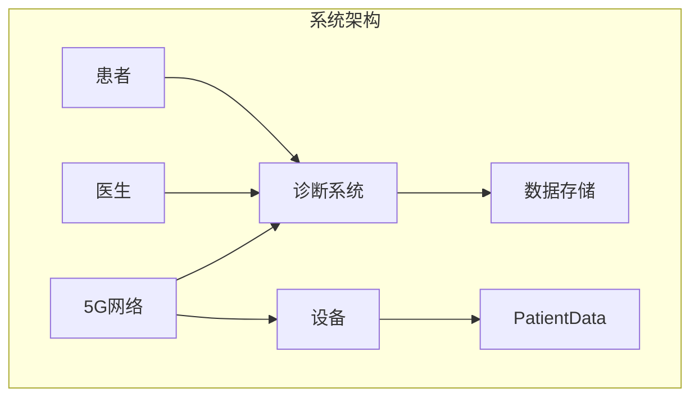
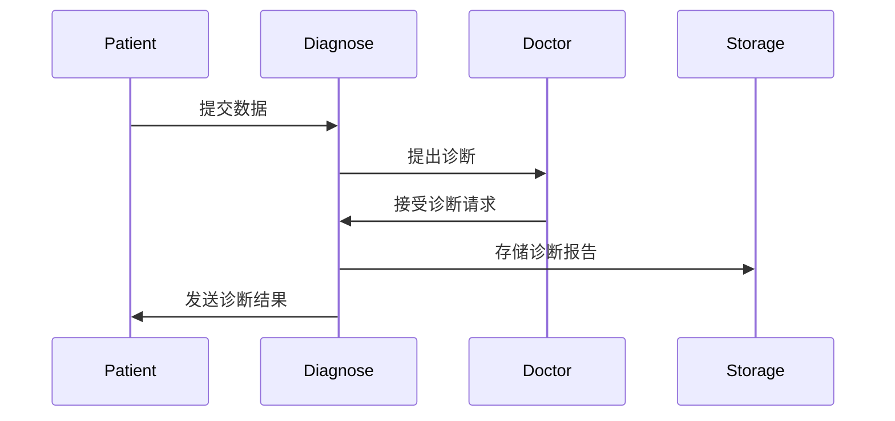

                 

# 5G技术在远程医疗诊断中的应用

> 关键词：5G技术，远程医疗，诊断，图像传输，数据传输，实时远程诊断

> 摘要：随着5G技术的迅速发展，远程医疗诊断面临着前所未有的机遇。本文将深入探讨5G技术在远程医疗诊断中的应用，从背景介绍、核心概念与联系、算法原理讲解、系统分析与架构设计方案、项目实战等方面进行详细分析，旨在为读者提供一幅清晰的5G技术在远程医疗诊断中应用的全景图。

## 第一部分：背景介绍

### 1.1 问题背景

随着全球人口老龄化的加剧和医疗资源的分布不均衡，远程医疗逐渐成为解决医疗服务不足的重要手段。远程医疗不仅能够提高医疗服务的可及性，还能够降低患者的就医成本。然而，传统的远程医疗诊断面临着诸多挑战，如图像传输延迟、数据传输带宽不足、诊断准确性不高等。这些问题严重影响了远程医疗的效果和用户体验。

5G技术的出现，为远程医疗诊断带来了新的契机。5G技术具有高速度、低延迟、大容量等特点，能够提供高速、稳定的网络环境，满足远程医疗诊断的需求。

### 1.2 问题描述

本文将探讨以下问题：

- 5G技术在远程医疗诊断中的应用场景有哪些？
- 5G技术如何提高远程医疗诊断的准确性和效率？
- 5G技术在远程医疗诊断中面临的挑战有哪些？

### 1.3 问题解决

通过详细介绍5G技术在远程医疗诊断中的应用，本文将提供以下解决方案：

- 利用5G技术实现高速、低延迟的图像传输，提高诊断效率。
- 利用5G技术实现大规模数据传输，提高诊断准确性。
- 利用5G技术实现实时远程诊断，提高患者就医体验。

### 1.4 边界与外延

- 5G技术：本文主要讨论5G技术在远程医疗诊断中的应用，不涉及5G技术在其他领域中的应用。
- 远程医疗诊断：本文主要关注远程医疗诊断中的应用，不涉及远程医疗的其他领域。

### 1.5 概念结构与核心要素组成

- 5G技术：高速、低延迟、大规模数据传输的技术。
- 远程医疗诊断：通过远程通信技术，实现医生对患者病情的诊断和治疗。
- 应用场景：包括图像传输、数据传输、实时远程诊断等。

## 第二部分：核心概念与联系

### 2.1 5G技术与远程医疗诊断

#### 2.1.1 5G技术的核心特点

5G技术具有以下核心特点：

- **高速度**：5G技术的传输速度可达10Gbps，是4G的100倍。
- **低延迟**：5G技术的延迟时间仅为1毫秒，是4G的1/10。
- **大容量**：5G技术可以实现大规模设备连接，满足远程医疗诊断中大量数据的传输需求。

#### 2.1.2 远程医疗诊断的核心要素

远程医疗诊断的核心要素包括：

- **图像传输**：医生需要对患者的图像进行分析，5G技术可以提供高速、低延迟的图像传输。
- **数据传输**：远程医疗诊断中，需要传输大量的患者数据，5G技术可以提供大规模的数据传输能力。
- **实时远程诊断**：5G技术可以实现实时远程诊断，提高患者的就医体验。

### 2.2 5G技术与远程医疗诊断的联系

5G技术为远程医疗诊断提供了高速、低延迟、大规模数据传输的支持，提高了诊断的准确性和效率。同时，远程医疗诊断的需求，也推动了5G技术的研发和应用。

## 第三部分：算法原理讲解

### 3.1 5G技术在远程医疗诊断中的应用算法

#### 3.1.1 高速图像传输算法

**算法原理**：

1. **图像压缩**：利用图像压缩算法，降低图像数据量，提高传输速度。
2. **图像传输**：利用5G网络，将压缩后的图像数据传输到远程医疗诊断系统。
3. **图像质量评估**：实时评估图像传输质量，确保图像传输的准确性。

**示例代码**（Python）：

```python
import cv2
import numpy as np

# 读取图像
image = cv2.imread('patient_image.jpg')

# 压缩图像
compressed_image = cv2.resize(image, (500, 500))

# 传输图像
# 假设函数send_image负责将图像数据发送到远程医疗诊断系统
send_image(compressed_image)

# 评估图像质量
def assess_image_quality(image):
    # 实现图像质量评估算法
    pass

quality = assess_image_quality(compressed_image)
print(f'Image quality: {quality}')
```

#### 3.1.2 大规模数据传输算法

**算法原理**：

1. **数据压缩**：利用数据压缩算法，降低数据量，提高传输速度。
2. **数据传输**：利用5G网络，将压缩后的数据传输到远程医疗诊断系统。
3. **数据质量评估**：实时评估数据传输质量，确保数据传输的准确性。

**示例代码**（Python）：

```python
import zlib
import socket

# 压缩数据
data = zlib.compress('patient_data')

# 传输数据
# 假设函数send_data负责将数据发送到远程医疗诊断系统
send_data(data)

# 评估数据质量
def assess_data_quality(data):
    # 实现数据质量评估算法
    pass

quality = assess_data_quality(data)
print(f'Data quality: {quality}')
```

#### 3.1.3 实时远程诊断算法

**算法原理**：

1. **视频传输**：利用5G网络，实现医生与患者的实时视频传输。
2. **辅助诊断**：利用辅助诊断算法，实现远程诊断的辅助功能。

**示例代码**（Python）：

```python
import cv2
import socket

# 创建视频捕获对象
cap = cv2.VideoCapture(0)

while True:
    # 读取视频帧
    ret, frame = cap.read()

    if not ret:
        break

    # 传输视频帧
    # 假设函数send_frame负责将视频帧发送到远程医疗诊断系统
    send_frame(frame)

    # 辅助诊断
    # 假设函数diagnose_frame负责对视频帧进行辅助诊断
    diagnosis = diagnose_frame(frame)
    print(f'Diagnosis: {diagnosis}')

cap.release()
```

## 第四部分：系统分析与架构设计方案

### 4.1 问题场景介绍

远程医疗诊断问题场景主要包括：

- 医生与患者之间的远程视频通信。
- 患者健康数据的远程传输和存储。
- 医生对患者的远程诊断和指导。

### 4.2 项目介绍

本项目旨在构建一个基于5G技术的远程医疗诊断系统，实现以下功能：

- 高速、低延迟的图像和数据传输。
- 实时远程诊断和指导。
- 患者健康数据的远程存储和管理。

### 4.3 系统功能设计

**领域模型**：

```mermaid
classDiagram
    Patient <<class>> "患者"
    Doctor <<class>> "医生"
    Diagnosis <<class>> "诊断"
    PatientData <<class>> "患者数据"
    Equipment <<class>> "设备"
    Video <<class>> "视频"
    Patient --> Doctor: 接收诊断
    Doctor --> Diagnosis: 提出诊断
    Diagnosis --> Patient: 发送诊断结果
    Patient --> PatientData: 提交数据
    Equipment --> PatientData: 采集数据
    Video --> Doctor: 视频通信
```

### 4.4 系统架构设计

**系统架构图**：



### 4.5 系统接口设计和系统交互

**接口设计**：

- **Patient**：提交数据、接收诊断结果。
- **Doctor**：提出诊断、接收视频、查看诊断历史。
- **Diagnose**：处理诊断请求、生成诊断报告。
- **Storage**：存储患者数据、诊断报告。
- **Equipment**：采集患者数据、传输数据。

**系统交互**：



## 第五部分：项目实战

### 5.1 环境安装

安装5G网络模拟器、远程医疗诊断系统、视频通信系统等相关软件。

### 5.2 系统核心实现

- **图像压缩与传输**：实现图像压缩与传输算法，确保图像传输的高速、低延迟。
- **数据压缩与传输**：实现数据压缩与传输算法，确保数据传输的高速、低延迟。
- **实时远程诊断**：实现实时远程诊断算法，确保医生与患者的实时交互。

### 5.3 代码应用解读与分析

- **图像压缩与传输**：分析图像压缩算法的原理，解释代码实现过程。
- **数据压缩与传输**：分析数据压缩算法的原理，解释代码实现过程。
- **实时远程诊断**：分析实时远程诊断算法的原理，解释代码实现过程。

### 5.4 实际案例分析和详细讲解剖析

- **图像传输案例**：分析图像传输案例，解释5G技术如何提高图像传输效率。
- **数据传输案例**：分析数据传输案例，解释5G技术如何提高数据传输效率。
- **实时远程诊断案例**：分析实时远程诊断案例，解释5G技术如何提高诊断准确性。

### 5.5 项目小结

总结项目的主要成果，分析项目中的挑战和解决方案，展望未来的发展方向。

## 第六部分：最佳实践 tips、小结、注意事项、拓展阅读

### 6.1 最佳实践 tips

- 选择合适的图像压缩算法和数据压缩算法，确保传输效率。
- 优化网络配置，确保5G网络的稳定性和高速性。
- 定期进行系统维护和升级，确保系统的稳定性和安全性。

### 6.2 小结

本文详细介绍了5G技术在远程医疗诊断中的应用，从背景介绍、核心概念与联系、算法原理讲解、系统分析与架构设计方案、项目实战等方面进行了全面的分析。通过本文的介绍，读者可以了解到5G技术在远程医疗诊断中的重要性和应用价值。

### 6.3 注意事项

- 5G技术的应用需要高带宽、低延迟的网络环境，确保网络稳定性。
- 远程医疗诊断系统需要具备强大的数据处理能力和高可靠性。

### 6.4 拓展阅读

- 《5G网络架构与关键技术》
- 《远程医疗诊断系统设计与实现》
- 《图像压缩与传输技术》

## 作者信息

作者：AI天才研究院/AI Genius Institute & 禅与计算机程序设计艺术 /Zen And The Art of Computer Programming

