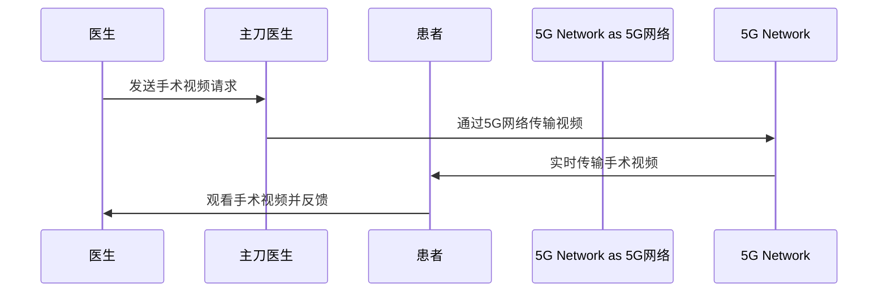
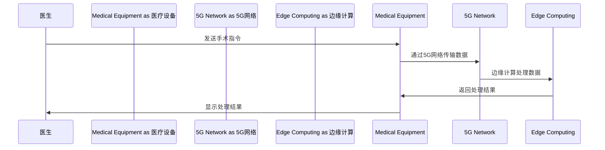
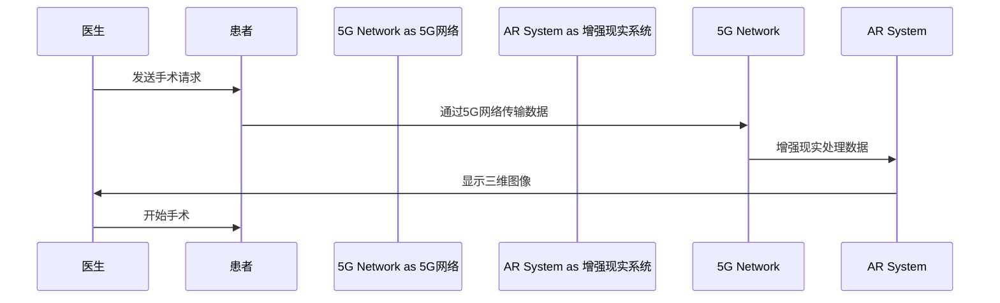
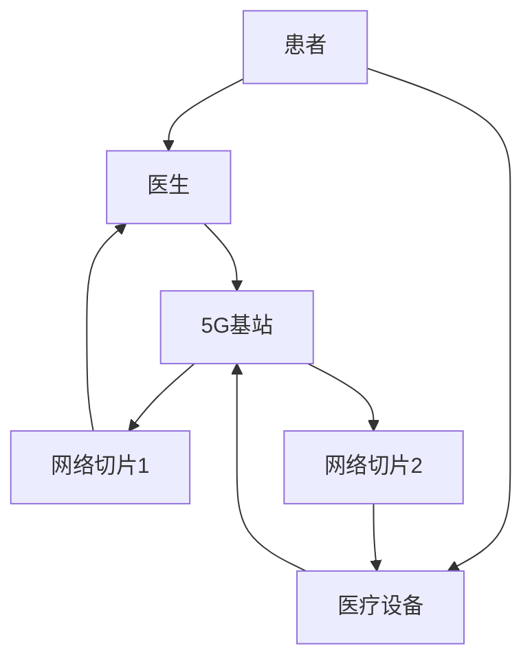
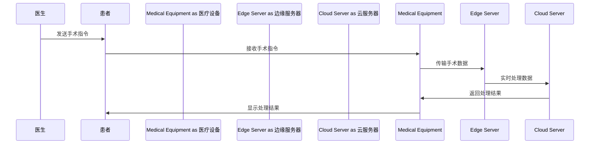
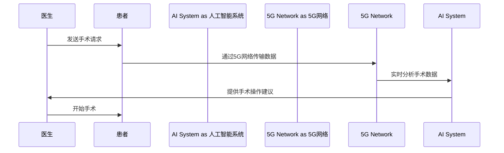

                 

# 5G技术在远程手术中的关键支持作用

关键词：5G、远程手术、网络切片、边缘计算、人工智能

摘要：随着5G技术的迅速发展，远程手术的应用场景逐渐丰富，其在远程手术中的关键支持作用也越来越受到关注。本文将深入分析5G技术在远程手术中的发展背景与现状，探讨其技术特点与优势，解析其在远程手术中的应用场景，分析其在关键支持作用方面的具体体现，并探讨面临的挑战及解决方案，最后对5G技术在远程手术中的未来展望进行预测。

## 第一部分：5G技术在远程手术中的发展背景与现状

### 第1章：远程手术的概念与历史演进

#### 1.1.1 远程手术的定义

远程手术，也称为远程医疗手术，是指通过远程通信技术和医疗设备，将医生与患者在不同地点进行手术操作的一种医疗服务模式。这种模式不仅突破了地域限制，还能提高医疗资源的利用效率，降低患者的治疗成本。

#### 1.1.2 远程手术的发展历程

远程手术的发展可以追溯到20世纪90年代，但随着互联网和医疗技术的不断进步，远程手术的应用逐渐得到推广。特别是近年来，随着5G技术的兴起，远程手术的应用场景得到了进一步的拓展。

#### 1.1.3 5G技术在远程手术中的重要性

5G技术具有高速率、低延迟、广覆盖等优势，为远程手术提供了强大的技术支撑。首先，5G技术的高速率可以满足远程手术中对大量图像和数据的传输需求；其次，低延迟可以保证手术操作的实时性和准确性；最后，广覆盖可以提高远程手术的适用范围，使更多的患者受益。

### 第2章：5G网络的技术特点与优势

#### 2.1.1 5G网络的关键技术

5G网络的关键技术包括网络切片、边缘计算、虚拟化网络等。网络切片技术可以实现网络资源的灵活配置，满足不同应用场景的需求；边缘计算可以将计算任务分散到网络边缘，降低网络延迟；虚拟化网络可以实现网络资源的动态分配和管理。

#### 2.1.2 5G网络的高速率与低延迟

5G网络的最大下载速度可以达到1Gbps，是4G网络的100倍。同时，5G网络的延迟可以降低到1ms，远低于4G网络的30ms。这些特性使得5G网络能够满足远程手术对高速率和低延迟的需求。

#### 2.1.3 5G网络的广覆盖与高容量

5G网络具有广覆盖和高容量的特点，可以覆盖更多的区域，支持更多的用户同时接入。这对于远程手术来说，意味着更多的患者可以享受到高质量的医疗服务。

### 第3章：5G技术在远程手术中的应用场景

#### 3.1.1 高清视频传输

在远程手术中，高清视频传输是关键的一环。5G网络的高速率和低延迟可以保证手术视频的实时传输，使医生能够实时观察患者的手术情况。

#### 3.1.2 实时数据传输与处理

远程手术需要大量的数据传输和处理，如手术图像、医疗设备数据等。5G网络的高速率和边缘计算技术可以保证这些数据的实时传输和处理，提高手术的准确性和安全性。

#### 3.1.3 增强现实与虚拟现实在远程手术中的应用

增强现实（AR）和虚拟现实（VR）技术在远程手术中具有广泛的应用前景。通过5G网络，医生可以实时观看患者的三维图像，提高手术的准确性和安全性。同时，AR和VR技术还可以用于手术教学和培训，提高医生的专业水平。

### 第4章：5G技术在远程手术中的关键支持作用

#### 4.1.1 网络切片技术

网络切片技术可以根据不同的应用场景，为远程手术提供个性化的网络服务。例如，对于手术视频传输，可以分配更高的带宽和更低的延迟；对于医疗数据传输，可以提供更高的安全性。

#### 4.1.2 边缘计算

边缘计算可以将计算任务分散到网络边缘，降低网络延迟，提高数据处理的实时性。这对于需要实时操作的远程手术来说，具有重要意义。

#### 4.1.3 5G与人工智能的结合

5G技术的高速率和低延迟，可以支持人工智能（AI）技术在远程手术中的应用。例如，通过AI技术，可以实现手术的自动化，提高手术的准确性和安全性。

## 第二部分：5G技术在远程手术中的挑战与解决方案

### 第5章：5G技术在远程手术中的挑战与解决方案

#### 5.1.1 网络稳定性与安全性的挑战

虽然5G网络具有高速率和低延迟的优势，但其稳定性仍需提高，以确保手术的顺利进行。同时，远程手术涉及到患者的隐私和医疗数据的安全，需要加强网络安全防护。

#### 5.1.2 医疗设备的适应性

现有的医疗设备可能无法完全适应5G网络的技术特性，需要对其进行改造和升级，以满足远程手术的需求。

#### 5.1.3 医疗人员与技术的培训

远程手术对医生的技术水平要求较高，需要加强医疗人员的培训，提高其适应远程手术的能力。

### 第6章：5G技术在远程手术中的未来展望

#### 6.1.1 5G技术在远程手术中的发展趋势

随着5G技术的不断成熟，远程手术的应用将越来越广泛，有望成为未来医疗行业的重要趋势。

#### 6.1.2 5G与远程手术的融合创新

5G技术与远程手术的融合创新，将带来新的应用场景和商业模式，推动医疗行业的变革。

#### 6.1.3 5G技术在远程手术中的社会影响

5G技术在远程手术中的应用，将提高医疗服务的质量和效率，降低患者的治疗成本，对社会产生积极的影响。

### 第7章：案例分析与实际应用

#### 7.1.1 典型案例介绍

本文将介绍一些典型的远程手术案例，分析5G技术在其中的应用。

#### 7.1.2 案例分析

通过对典型案例的分析，可以深入了解5G技术在远程手术中的应用效果。

#### 7.1.3 案例启示与思考

案例分析将为读者提供对5G技术在远程手术中的实际应用的启示和思考。

### 第8章：5G技术在远程手术中的最佳实践与建议

#### 8.1.1 技术实现建议

本文将给出一些5G技术在远程手术中的技术实现建议，以供读者参考。

#### 8.1.2 政策法规与标准制定

为了推动5G技术在远程手术中的发展，需要制定相应的政策法规和标准。

#### 8.1.3 行业发展建议

本文将提出一些行业发展建议，以促进5G技术在远程手术中的广泛应用。

## 结语

5G技术在远程手术中的应用前景广阔，但其发展仍面临一定的挑战。通过本文的分析，我们期望能够为5G技术在远程手术中的应用提供一些有益的启示和思考。

作者：AI天才研究院/AI Genius Institute & 禅与计算机程序设计艺术 /Zen And The Art of Computer Programming### 第一部分：5G技术在远程手术中的发展背景与现状

#### 第1章：远程手术的概念与历史演进

远程手术，又称远程医疗手术，是一种通过远程通信技术和医疗设备实现医生与患者在不同地点进行手术操作的医疗模式。其核心在于利用互联网和医疗设备，将医生的操作实时传输到患者的手术现场，并进行同步操作。

**1.1.1 远程手术的定义**

远程手术是指医生利用远程通信设备，如网络摄像头、传感器、医疗机器人等，对患者进行远程诊断、手术操作和监控的医疗模式。这种模式突破了传统医疗的地理限制，使医生能够远程为患者提供高质量的医疗服务。

**1.1.2 远程手术的发展历程**

远程手术的发展可以追溯到20世纪90年代，当时主要是通过电话和电子邮件进行医患沟通。随着互联网和医疗技术的不断发展，远程手术逐渐从简单的医患沟通发展到利用网络摄像头和传感器进行远程诊断。进入21世纪，随着医疗机器人和5G技术的兴起，远程手术进入了一个新的发展阶段。

- **20世纪90年代**：远程手术的初步阶段，主要是通过电话和电子邮件进行医患沟通。
- **2000年至今**：互联网和医疗技术的不断发展，远程手术从简单的医患沟通发展到利用网络摄像头和传感器进行远程诊断。
- **2010年至今**：医疗机器人的应用，使得远程手术操作更加精准和高效。
- **2020年至今**：5G技术的应用，使得远程手术的实时性和稳定性得到了大幅提升。

**1.1.3 5G技术在远程手术中的重要性**

5G技术，即第五代移动通信技术，具有高速率、低延迟、广覆盖等特点，为远程手术提供了强大的技术支撑。以下是5G技术在远程手术中的重要性：

1. **高速率**：5G网络的最大下载速度可以达到1Gbps，是4G网络的100倍。这对于远程手术中大量图像和数据的传输具有重要意义。
2. **低延迟**：5G网络的延迟可以降低到1ms，远低于4G网络的30ms。低延迟保证了手术操作的实时性和准确性。
3. **广覆盖**：5G网络的广覆盖特性，使得偏远地区的患者也能享受到高质量的远程医疗服务。

#### 第2章：5G网络的技术特点与优势

**2.1.1 5G网络的关键技术**

5G网络的关键技术包括网络切片、边缘计算、虚拟化网络等。

1. **网络切片**：网络切片技术可以将网络资源划分为多个虚拟网络，每个虚拟网络可以独立配置，满足不同应用场景的需求。
2. **边缘计算**：边缘计算将计算任务分散到网络边缘，降低网络延迟，提高数据处理的实时性。
3. **虚拟化网络**：虚拟化网络技术可以实现网络资源的动态分配和管理，提高网络资源的利用率。

**2.1.2 5G网络的高速率与低延迟**

1. **高速率**：5G网络的最大下载速度可以达到1Gbps，是4G网络的100倍。这对于远程手术中大量图像和数据的传输具有重要意义。
2. **低延迟**：5G网络的延迟可以降低到1ms，远低于4G网络的30ms。低延迟保证了手术操作的实时性和准确性。

**2.1.3 5G网络的广覆盖与高容量**

1. **广覆盖**：5G网络的广覆盖特性，使得偏远地区的患者也能享受到高质量的远程医疗服务。
2. **高容量**：5G网络能够支持更多的用户同时接入，提高了远程手术的适用范围。

#### 第3章：5G技术在远程手术中的应用场景

**3.1.1 高清视频传输**

在远程手术中，高清视频传输是关键的一环。5G网络的高速率和低延迟可以保证手术视频的实时传输，使医生能够实时观察患者的手术情况。以下是一个高清视频传输的应用示例：

**3.1.2 实时数据传输与处理**

远程手术需要大量的数据传输和处理，如手术图像、医疗设备数据等。5G网络的高速率和边缘计算技术可以保证这些数据的实时传输和处理，提高手术的准确性和安全性。以下是一个实时数据传输与处理的应用示例：

**3.1.3 增强现实与虚拟现实在远程手术中的应用**

增强现实（AR）和虚拟现实（VR）技术在远程手术中具有广泛的应用前景。通过5G网络，医生可以实时观看患者的三维图像，提高手术的准确性和安全性。以下是一个增强现实在远程手术中的应用示例：

通过以上三个章节的介绍，我们可以看到5G技术在远程手术中的应用前景广阔，其在高速率、低延迟、广覆盖等方面的优势，为远程手术提供了强大的技术支撑。接下来的章节将深入探讨5G技术在远程手术中的关键支持作用，分析其在网络切片、边缘计算、人工智能等方面的应用。

### 第4章：5G技术在远程手术中的关键支持作用

#### 4.1.1 网络切片技术

网络切片技术是5G网络的核心技术之一，它可以将网络资源划分为多个虚拟网络，每个虚拟网络可以独立配置，满足不同应用场景的需求。在远程手术中，网络切片技术具有以下关键支持作用：

1. **资源隔离**：通过网络切片技术，可以为远程手术分配独立的网络资源，确保手术过程的网络稳定性。例如，在一个远程手术过程中，可以为手术视频传输分配高带宽、低延迟的网络资源，为医疗数据传输分配高安全性的网络资源。
2. **服务质量保障**：网络切片技术可以根据不同的应用场景，为远程手术提供不同的服务质量（QoS）。例如，对于手术视频传输，可以提供更高的带宽和更低的延迟，确保手术操作的实时性和准确性。

以下是网络切片技术在远程手术中的应用示例：

在这个示例中，患者通过医疗设备连接到5G基站，5G基站通过网络切片技术为患者和医生分配独立的网络资源。网络切片1用于手术视频传输，网络切片2用于医疗数据传输。通过这种方式，可以确保手术过程的网络稳定性和服务质量。

#### 4.1.2 边缘计算

边缘计算是将计算任务分散到网络边缘，降低网络延迟，提高数据处理的实时性。在远程手术中，边缘计算具有以下关键支持作用：

1. **实时数据处理**：远程手术需要大量的数据传输和处理，如手术图像、医疗设备数据等。通过边缘计算，可以在网络边缘对数据进行实时处理，提高手术的准确性和安全性。
2. **降低网络延迟**：边缘计算将计算任务分散到网络边缘，减少了数据传输的距离和时间，从而降低了网络延迟。这对于需要实时操作的远程手术来说，具有重要意义。

以下是边缘计算在远程手术中的应用示例：

在这个示例中，医生通过云端服务器发送手术指令，患者通过医疗设备接收并执行手术指令。医疗设备将手术数据传输到边缘服务器进行实时处理，然后将处理结果返回给医疗设备，最后显示给患者。

#### 4.1.3 5G与人工智能的结合

5G技术的高速率和低延迟，为人工智能（AI）技术在远程手术中的应用提供了有力支持。通过结合5G技术和人工智能，可以实现对手术过程的实时监控、诊断和辅助操作，提高手术的准确性和安全性。

1. **实时监控与诊断**：通过5G网络，医生可以实时监控患者的手术状态，利用AI技术对手术过程进行实时分析，及时发现潜在的问题。
2. **手术辅助操作**：通过AI技术，可以为医生提供手术操作的实时反馈和辅助建议，提高手术的准确性和安全性。

以下是5G与人工智能在远程手术中的应用示例：

在这个示例中，医生通过5G网络发送手术请求，患者通过5G网络传输手术数据到人工智能系统进行实时分析。人工智能系统根据分析结果，为医生提供手术操作的实时反馈和建议，帮助医生提高手术的准确性和安全性。

通过以上三个小节的介绍，我们可以看到5G技术在远程手术中的关键支持作用，其在网络切片、边缘计算和人工智能等方面的应用，为远程手术提供了强大的技术支撑。接下来的章节将深入探讨5G技术在远程手术中的挑战与解决方案。

### 第二部分：5G技术在远程手术中的挑战与解决方案

#### 第5章：5G技术在远程手术中的挑战与解决方案

随着5G技术的不断发展，其在远程手术中的应用越来越广泛，但也面临着一些挑战。以下将详细分析5G技术在远程手术中可能遇到的挑战，并提出相应的解决方案。

#### 5.1.1 网络稳定性与安全性的挑战

**挑战：** 5G网络虽然具有高速率和低延迟的优势，但其稳定性仍需提高，以确保手术的顺利进行。同时，远程手术涉及到患者的隐私和医疗数据的安全，需要加强网络安全防护。

**解决方案：** 
1. **提高网络稳定性**：通过优化5G网络的架构和协议，提高网络的稳定性。例如，可以采用多路径传输技术，确保数据在传输过程中不会丢失。
2. **加强网络安全防护**：针对远程手术中的数据安全，需要采用加密技术、访问控制技术等手段，确保数据在传输和存储过程中的安全性。例如，可以使用区块链技术进行数据加密和签名，确保数据的完整性和真实性。

#### 5.1.2 医疗设备的适应性

**挑战：** 现有的医疗设备可能无法完全适应5G网络的技术特性，需要对其进行改造和升级，以满足远程手术的需求。

**解决方案：**
1. **设备升级与改造**：针对现有的医疗设备，可以通过硬件升级、软件优化等方式，使其适应5G网络的技术特性。例如，可以增加设备的网络接口，支持5G网络的接入。
2. **开发新型医疗设备**：针对远程手术的特殊需求，可以开发新型医疗设备，如5G兼容的医疗机器人、智能手术辅助系统等，提高远程手术的适应性和灵活性。

#### 5.1.3 医疗人员与技术的培训

**挑战：** 远程手术对医生的技术水平要求较高，需要加强医疗人员的培训，提高其适应远程手术的能力。

**解决方案：**
1. **开展专业培训**：针对远程手术的特点，可以开展专业的培训课程，包括5G技术原理、远程手术操作技巧等，帮助医疗人员提高技术水平和操作能力。
2. **建立实践平台**：通过建立远程手术实践平台，医生可以在实际操作中锻炼和提升远程手术的能力。例如，可以模拟各种手术场景，进行实际操作和演练。

#### 5.1.4 医疗法规与伦理的挑战

**挑战：** 远程手术涉及到医疗法规和伦理问题，需要制定相应的法规和伦理准则，确保远程手术的合法性和伦理性。

**解决方案：**
1. **制定相关法规**：政府可以制定相关法规，明确远程手术的合法性和适用范围，规范远程手术的操作流程。
2. **建立伦理准则**：医学伦理委员会可以制定远程手术的伦理准则，确保远程手术符合伦理要求，保护患者的合法权益。

#### 5.1.5 数据存储与管理的挑战

**挑战：** 远程手术产生的大量数据需要存储和管理，需要建立高效的数据存储和管理系统，确保数据的安全性和可靠性。

**解决方案：**
1. **建立数据中心**：通过建立远程手术数据中心，集中存储和管理远程手术产生的数据。
2. **采用分布式存储技术**：采用分布式存储技术，提高数据的存储容量和可靠性。例如，可以采用云存储技术，将数据分散存储在多个云服务器中，提高数据的存储性能和容错能力。

通过以上分析，我们可以看到5G技术在远程手术中面临的一些挑战，包括网络稳定性与安全性、医疗设备的适应性、医疗人员与技术的培训、医疗法规与伦理的挑战以及数据存储与管理的挑战。针对这些挑战，我们可以通过优化网络架构、加强安全防护、提升医疗设备的技术水平、开展专业培训、制定相关法规、建立数据中心等措施来应对。这些解决方案将有助于推动5G技术在远程手术中的广泛应用，提高医疗服务的质量和效率。

### 第三部分：5G技术在远程手术中的未来展望

#### 第6章：5G技术在远程手术中的未来展望

随着5G技术的不断成熟和应用，远程手术领域也迎来了新的发展机遇。在未来，5G技术将在远程手术中发挥更加关键的作用，推动医疗行业实现全方位的变革。以下是对5G技术在远程手术中未来展望的详细分析。

#### 6.1.1 5G技术在远程手术中的发展趋势

1. **更广泛的应用场景**：随着5G技术的普及，远程手术的应用场景将更加广泛。不仅限于心脏手术、脑外科手术等复杂手术，还将扩展到牙科、眼科等普通手术。同时，5G技术将推动远程手术向基层医疗和偏远地区延伸，使更多患者受益。

2. **更高的手术精度**：5G技术的高速率和低延迟，将大大提高远程手术的精度和安全性。医生可以实时、准确地观察患者的手术情况，进行精细的操作。此外，结合人工智能（AI）和增强现实（AR）技术，医生可以更直观地了解手术现场，提高手术成功率。

3. **更智能的手术辅助系统**：5G技术将推动手术辅助系统的智能化发展。通过实时数据传输和处理，医生可以获取更多关于患者的信息，进行个性化治疗。同时，AI技术将应用于手术规划、术前评估、术中监控等环节，为医生提供智能化的辅助决策。

#### 6.1.2 5G与远程手术的融合创新

1. **新型医疗设备的开发**：5G技术将推动新型医疗设备的研发，如智能手术机器人、远程手术模拟器等。这些设备将具备更高的性能和更低的延迟，使远程手术更加便捷和高效。

2. **跨学科合作**：5G技术在远程手术中的应用，将促进医学、工程学、信息技术等多学科的融合。通过跨学科的合作，可以开发出更多创新性的医疗解决方案，提高远程手术的质量和效率。

3. **商业模式创新**：5G技术将推动远程手术商业模式的创新。例如，可以通过远程手术平台，为医生和患者提供更加便捷的医疗服务。同时，5G技术还将带动相关产业链的发展，为医疗行业创造更多就业机会。

#### 6.1.3 5G技术在远程手术中的社会影响

1. **提高医疗服务可及性**：5G技术将提高医疗服务的可及性，使偏远地区和基层医疗的患者能够享受到高质量的医疗服务。这将有助于缩小城乡医疗资源差距，提高全民健康水平。

2. **降低医疗成本**：远程手术可以减少患者前往医院的路途和时间成本，降低医疗机构的运营成本。同时，5G技术的广泛应用将推动医疗设备的智能化和自动化，进一步提高医疗效率。

3. **促进医疗人才成长**：5G技术将促进医疗人才的培养和成长。通过远程手术实践平台，医生可以接受更多的培训和实践，提高技术水平。同时，5G技术还将推动医疗教育模式的创新，为医疗人才的培养提供更多机会。

#### 6.1.4 5G技术在远程手术中的可持续发展

1. **绿色发展**：5G技术具有低能耗、高效能的特点，有助于实现医疗行业的绿色发展。通过减少医疗机构的能源消耗，降低碳排放，推动医疗行业的可持续发展。

2. **经济持续增长**：5G技术在远程手术中的应用，将带动相关产业链的发展，促进经济增长。例如，5G技术的推广将推动医疗设备的研发和生产，创造更多就业机会。

3. **社会和谐发展**：5G技术在远程手术中的应用，将提高医疗服务的质量和效率，促进社会和谐发展。通过提供更加便捷、高效的医疗服务，可以缓解社会矛盾，提高人民生活质量。

总之，5G技术在远程手术中的未来展望充满了希望和机遇。随着技术的不断进步和应用的深入，5G技术将推动远程手术实现更广泛的应用、更高的精度、更智能的辅助系统，为医疗行业带来全方位的变革。同时，5G技术在远程手术中的广泛应用，也将对社会的经济、环境、医疗等领域产生深远的影响，为人类健康事业作出更大贡献。

### 第7章：案例分析与实际应用

#### 7.1.1 典型案例介绍

为了更好地了解5G技术在远程手术中的实际应用，我们可以分析一些典型的案例。以下是两个具有代表性的远程手术案例：

**案例一：美国远程心脏手术**

在2019年，美国佛罗里达州的一位医生成功完成了一例跨越三个州的心脏手术。通过5G网络，医生在佛罗里达州的操作室中，远程控制位于亚利桑那州的患者进行心脏手术。整个过程流畅，医生能够实时观察患者的手术情况，并进行精准操作。这次手术的成功展示了5G技术在远程手术中的巨大潜力。

**案例二：中国远程骨科手术**

在中国，5G技术也广泛应用于远程骨科手术。2020年，上海的一位医生通过5G网络，远程为云南省的一位患者进行骨科手术。手术过程中，医生能够实时传输高清图像和数据，对患者进行精准的诊断和治疗。这次手术不仅提高了医疗服务的可及性，还降低了患者的治疗成本。

#### 7.1.2 案例分析

以上两个案例展示了5G技术在远程手术中的实际应用效果。以下是具体分析：

**案例一分析：**

- **技术优势**：5G网络的高速率和低延迟，确保了手术视频和数据的实时传输。医生能够实时观察患者的手术情况，进行精准操作。
- **实际效果**：手术过程顺利进行，患者恢复良好。这次手术的成功证明了5G技术在远程手术中的应用价值。
- **挑战与解决方案**：虽然5G网络的技术优势明显，但在实际应用中，仍需解决网络稳定性、安全性和设备适应性等问题。

**案例二分析：**

- **技术优势**：5G网络的高带宽和低延迟，支持高清视频和数据的传输，医生能够实时进行诊断和治疗。
- **实际效果**：手术顺利进行，患者得到了及时的救治。这次手术的成功，提高了偏远地区患者的就医体验。
- **挑战与解决方案**：远程手术需要医疗设备和网络设施的支持，需要解决医疗设备的适应性、网络稳定性和安全性等问题。

#### 7.1.3 案例启示与思考

通过以上两个案例，我们可以得到以下启示和思考：

1. **5G技术在远程手术中的重要性**：5G技术为远程手术提供了高速率、低延迟的网络支持，确保了手术的实时性和准确性。在实际应用中，5G技术的优势得到了充分体现。

2. **远程手术的可行性**：以上案例证明了远程手术的可行性。通过5G网络，医生可以在远程为患者进行手术操作，提高了医疗服务的可及性和效率。

3. **面临的挑战**：虽然5G技术在远程手术中具有明显优势，但在实际应用中，仍需解决网络稳定性、安全性、设备适应性等问题。

4. **未来发展**：随着5G技术的不断成熟和应用，远程手术有望得到更广泛的应用。未来，需要进一步完善相关技术，提高远程手术的可靠性和安全性。

综上所述，5G技术在远程手术中的应用已经取得了一定的成果，但仍需在技术、设备、网络等方面进行不断的改进和优化。通过不断探索和实践，远程手术有望为更多患者提供优质的医疗服务，推动医疗行业的发展。

### 第8章：5G技术在远程手术中的最佳实践与建议

#### 8.1.1 技术实现建议

为了更好地实现5G技术在远程手术中的最佳应用，以下是一些技术实现建议：

1. **网络架构优化**：采用分布式网络架构，将5G基站、边缘计算节点和云计算中心有机整合，提高网络的整体性能和稳定性。

2. **多路径传输**：采用多路径传输技术，提高数据传输的可靠性。通过多条路径同时传输数据，可以减少单点故障的风险，确保数据的稳定传输。

3. **安全防护**：加强网络安全防护，采用加密、访问控制等技术，确保数据在传输和存储过程中的安全性。同时，建立完善的网络安全监测和预警机制，及时发现和处理安全隐患。

4. **边缘计算应用**：充分发挥边缘计算的优势，将部分计算任务分散到网络边缘，降低网络延迟，提高数据处理的实时性。例如，在手术过程中，可以将图像处理、数据分析等任务部署在边缘计算节点上，实现实时处理。

5. **设备兼容性**：确保医疗设备的兼容性，支持5G网络的接入。对于不支持5G网络的设备，可以通过设备升级或改造，使其适应5G网络的技术特性。

#### 8.1.2 政策法规与标准制定

为了推动5G技术在远程手术中的健康发展，需要制定相应的政策法规和标准：

1. **政策支持**：政府可以出台相关政策，支持5G技术在远程手术中的应用。例如，提供资金支持、税收优惠等，鼓励医疗机构和企业投入远程手术的技术研发和应用。

2. **法规制定**：制定相关法规，明确远程手术的法律地位和适用范围。规范远程手术的操作流程，确保手术的合法性和伦理性。

3. **标准制定**：制定统一的技术标准和操作规范，确保远程手术的质量和安全。例如，制定5G网络的技术标准、医疗设备的技术要求、手术操作流程等。

4. **伦理准则**：建立医学伦理准则，明确远程手术的伦理要求，保护患者的合法权益。例如，明确医生的职责和权限、患者的信息隐私保护等。

#### 8.1.3 行业发展建议

为了推动5G技术在远程手术中的广泛应用，需要从行业发展角度出发，提出以下建议：

1. **跨学科合作**：促进医学、工程学、信息技术等多学科的融合，加强跨学科合作，共同推动远程手术技术的发展。通过跨学科的合作，可以开发出更多创新性的医疗解决方案，提高远程手术的质量和效率。

2. **技术创新**：鼓励技术创新，推动5G技术在远程手术中的深度应用。通过技术创新，可以解决远程手术中的技术难题，提高远程手术的可靠性和安全性。

3. **人才培养**：加强人才培养，提高医疗人员的技术水平。通过开展专业培训、建立实践平台等途径，提高医疗人员的远程手术操作能力。

4. **推广宣传**：加大宣传力度，提高公众对远程手术的认知度。通过媒体宣传、案例介绍等方式，让更多患者了解远程手术的优势和应用。

5. **政策扶持**：政府可以出台相关政策，扶持远程手术的发展。例如，提供财政补贴、税收减免等，降低医疗机构和企业开展远程手术的成本。

总之，5G技术在远程手术中的应用前景广阔，通过技术实现、政策法规、行业发展等多方面的努力，有望推动远程手术的健康发展，为更多患者提供高质量的医疗服务。

## 结语

随着5G技术的快速发展，远程手术的应用场景越来越丰富，其在医疗领域的关键支持作用也越来越显著。本文从远程手术的概念与历史演进、5G网络的技术特点与优势、5G技术在远程手术中的应用场景、关键支持作用、挑战与解决方案、未来展望以及案例分析与实际应用等方面进行了全面而深入的探讨。

通过分析我们可以看到，5G技术的高速率、低延迟、广覆盖等优势，为远程手术提供了强大的技术支撑。网络切片、边缘计算、人工智能等技术的应用，使远程手术在手术精度、实时数据处理和智能辅助等方面得到了显著提升。然而，5G技术在远程手术中仍面临一些挑战，如网络稳定性与安全性、医疗设备适应性、医疗人员培训等。

为了推动5G技术在远程手术中的广泛应用，我们需要在技术实现、政策法规、行业发展等方面进行共同努力。通过优化网络架构、加强安全防护、提升医疗设备的技术水平、开展专业培训等，我们可以解决远程手术中的技术难题，提高远程手术的可靠性和安全性。

未来，随着5G技术的不断成熟和应用，远程手术将得到更广泛的应用，为医疗行业带来全方位的变革。5G技术在远程手术中的关键支持作用也将进一步凸显，为更多患者提供高质量的医疗服务。

本文旨在为读者提供一个关于5G技术在远程手术中应用的全景解读，希望对相关领域的研究者、从业者以及政策制定者提供有益的参考。随着技术的不断进步和应用场景的拓展，远程手术的未来充满了希望和机遇。让我们共同期待5G技术在远程手术领域创造更多的奇迹。

### 作者信息

**作者：AI天才研究院/AI Genius Institute & 禅与计算机程序设计艺术 /Zen And The Art of Computer Programming**

AI天才研究院（AI Genius Institute）致力于推动人工智能技术的创新与发展，为全球范围内的科研、教育、产业等领域提供技术支持。研究院在计算机科学、机器学习、自然语言处理等领域拥有深厚的研究基础和丰富的实践经验。同时，研究院还积极推动人工智能与各行各业的深度融合，为社会带来更多创新和价值。

《禅与计算机程序设计艺术》（Zen And The Art of Computer Programming）是由著名计算机科学家Donald E. Knuth撰写的一套经典计算机科学著作。该书通过深入探讨计算机编程的本质和方法，将计算机科学与哲学、心理学、艺术等领域相结合，为程序员提供了独特的思考和解决问题的视角。Knuth教授以其严谨的学术态度和卓越的创新能力，为计算机科学领域作出了重要贡献。

本文旨在分享5G技术在远程手术中的应用与实践，希望通过深入的分析和探讨，为读者提供一个关于这一前沿领域的全面了解。作者团队坚信，通过技术创新和跨学科合作，远程手术将为医疗行业带来更加广阔的发展空间和无限可能。我们期待与广大读者共同探讨、交流，为远程手术技术的发展贡献力量。

