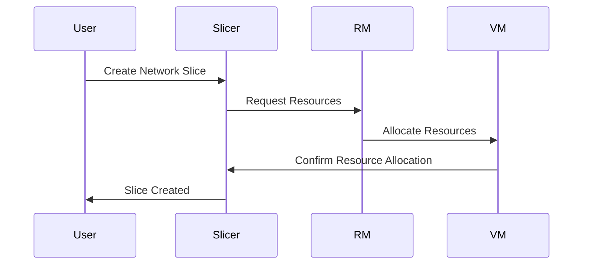
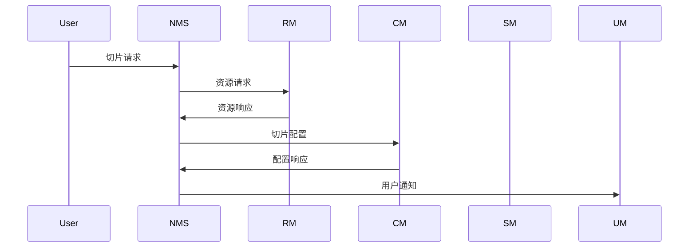
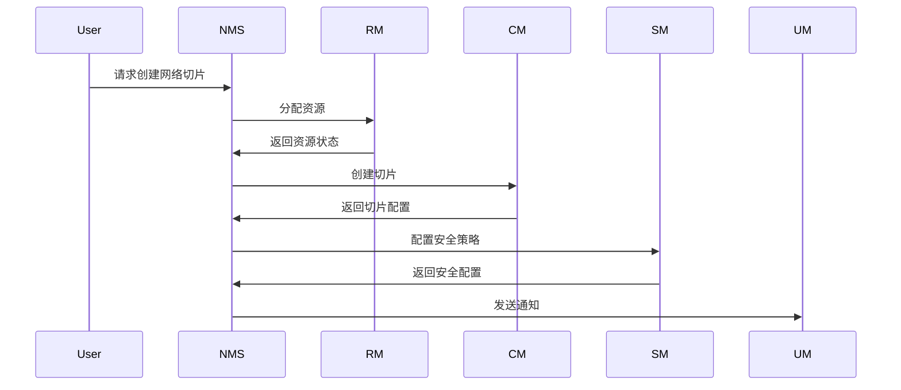

                 

# 5G网络切片技术在垂直行业中的应用

## 关键词

- 5G网络切片
- 垂直行业应用
- 网络虚拟化
- 容器化技术
- 边缘计算
- 智能制造
- 智慧医疗
- 智慧城市

## 摘要

本文将深入探讨5G网络切片技术在垂直行业中的应用，包括其基本概念、技术原理和具体案例。5G网络切片作为5G网络的关键技术之一，通过为不同行业和应用场景提供定制化的网络资源和服务，大幅提升了网络的灵活性、效率和可靠性。本文将分章节介绍5G网络切片的基本原理、在智能制造、智慧医疗、智慧城市等垂直行业中的应用，以及面临的挑战和未来发展趋势，旨在为相关从业人员和研究者提供有价值的参考。

## 引言

随着信息技术的飞速发展，网络通信技术已经成为现代社会的基石。4G网络的出现和普及使得移动互联网得到了空前的发展，推动了大数据、云计算、物联网等技术的广泛应用。然而，4G网络在应对日益增长的带宽需求、低延迟应用和高可靠性要求方面存在一定的局限性。为了满足未来更加多样化、个性化和高效化的通信需求，5G网络应运而生。

5G网络具有高速率、大容量、低延迟、高可靠性和高能效等特点，被寄予厚望。在网络架构方面，5G引入了网络切片技术，这是一种将网络资源按需划分和分配给不同用户和应用场景的技术，能够实现资源的精细化管理和优化配置。网络切片技术的出现，使得5G网络能够更好地服务于各类垂直行业，如智能制造、智慧医疗、智慧城市等。

垂直行业是指具有特定业务领域和行业特性的企业或组织，这些行业对通信网络的要求各不相同，包括带宽、延迟、安全、可靠性等方面。5G网络切片技术通过提供高度灵活和定制化的网络服务，能够满足不同垂直行业的多样化需求，推动各行业的数字化转型和创新发展。

本文将首先介绍5G网络切片技术的基本概念和原理，然后详细探讨其在智能制造、智慧医疗、智慧城市等垂直行业中的应用，最后分析5G网络切片技术面临的挑战和未来发展趋势。

## 5G网络切片技术概述

### 5G网络切片技术的起源与发展

5G网络切片技术起源于4G网络的虚拟化技术和网络功能虚拟化（NFV）。随着移动互联网的快速发展，网络虚拟化技术逐渐成熟，4G网络开始尝试将传统的网络功能如核心网、接入网等虚拟化，以实现网络资源的灵活管理和动态调整。这种虚拟化技术在4G时代取得了一定的成功，为5G网络切片技术的诞生奠定了基础。

5G网络切片技术正式提出是在3GPP（第三代合作伙伴计划）组织于2016年开始的5G标准化过程中。随着5G标准的逐步完善，网络切片技术成为5G网络的关键特性之一，并在多个重要标准文档中得到了详细定义和规范。5G网络切片旨在通过虚拟化技术，将网络资源按需划分为多个独立的虚拟网络，每个虚拟网络可以提供不同的网络特性和服务质量（QoS）。

5G网络切片技术的快速发展得益于其独特的优势。首先，它能够实现网络资源的灵活分配和动态调整，满足不同行业和应用场景的多样化需求。其次，通过网络切片，运营商可以更有效地利用网络资源，提升网络利用率和服务质量。此外，5G网络切片技术还能够提高网络的安全性和可靠性，为关键业务提供保障。

### 5G网络切片技术的核心概念

5G网络切片技术包含了一系列核心概念和术语，以下是其中几个重要的概念：

#### 网络功能虚拟化（NFV）

网络功能虚拟化是指将传统的网络功能，如路由器、交换机、防火墙等，从硬件设备上迁移到通用服务器上，通过虚拟化技术实现软件化和集中管理。NFV能够简化网络架构，降低设备成本，提升网络灵活性。

#### 软件定义网络（SDN）

软件定义网络是一种通过集中控制的软件来实现网络管理和配置的技术。SDN将网络控制平面与数据平面分离，通过控制平面来管理数据平面的资源分配和流量控制。SDN与NFV结合，可以进一步优化网络切片的资源配置和管理。

#### 网络功能切片（NFS）

网络功能切片是在网络功能虚拟化的基础上，将网络功能进一步细分为多个独立的虚拟网络切片。每个网络切片可以配置不同的网络功能、资源和服务质量，满足特定应用场景的需求。

#### 服务质量（QoS）

服务质量是指网络对数据传输的质量保障，包括带宽、延迟、抖动、可靠性等方面。5G网络切片技术通过QoS机制，为不同网络切片提供定制化的服务质量保障，确保关键业务的性能需求。

#### 网络切片管理（NSM）

网络切片管理是负责网络切片的创建、配置、监控和优化等操作的集中管理平台。NSM通过自动化和智能化的手段，提高网络切片的管理效率和灵活性。

### 5G网络切片在垂直行业中的重要性

5G网络切片技术在垂直行业中的重要性体现在以下几个方面：

#### 灵活定制

不同垂直行业对网络的需求各不相同，5G网络切片技术能够为每个行业和应用场景提供高度灵活和定制化的网络服务。例如，在智能制造中，生产设备可能需要低延迟、高可靠的网络连接，而在智慧医疗中，远程手术可能需要高带宽、低延迟的网络支持。

#### 资源优化

5G网络切片技术通过虚拟化和动态资源分配，实现了网络资源的优化利用。运营商可以通过网络切片技术，将网络资源精确分配给不同的业务和应用，提高网络的整体利用率和效率。

#### 安全性提升

网络切片技术能够为不同业务和应用提供隔离的虚拟网络环境，提升网络的安全性和可靠性。例如，在智慧城市中，政府和企业可以通过网络切片技术，保障关键业务和数据的安全性。

#### 支持创新应用

5G网络切片技术为各类创新应用提供了坚实的基础。例如，在智慧医疗中，通过网络切片技术，可以实现远程手术、实时监控等应用，推动医疗服务的数字化转型和进步。

总之，5G网络切片技术为垂直行业提供了灵活、高效、安全、可靠的网络服务，推动了各行业的数字化转型和创新应用的发展。

## 5G网络切片技术的原理与实现

### 5G网络切片技术的架构

5G网络切片技术的架构主要包括以下几个关键组成部分：

#### 核心网切片

核心网切片是指将5G核心网按需划分成多个独立的虚拟网络。每个核心网切片可以独立配置网络功能、资源和业务逻辑，实现不同业务需求的隔离和优化。核心网切片由5G网络功能虚拟化（NFV）和软件定义网络（SDN）技术支持，通过虚拟化基础设施（VIM）来实现资源的灵活管理和动态调整。

#### 接入网切片

接入网切片是指将5G无线接入网络划分成多个独立的虚拟网络。接入网切片通过虚拟无线电接入网络（vRAN）技术实现，vRAN将无线接入网的功能虚拟化，通过软件定义的方式实现无线资源的灵活分配和管理。接入网切片能够为不同业务和应用提供定制化的无线接入服务，如高带宽、低延迟等。

#### 边缘计算切片

边缘计算切片是指将边缘计算节点按需划分成多个独立的虚拟网络。边缘计算切片通过边缘计算平台（ECP）来实现，ECP能够为不同业务和应用提供本地化计算和存储资源，实现低延迟和高带宽的应用需求。边缘计算切片与核心网切片和接入网切片协同工作，为用户提供端到端的高质量网络服务。

#### 网络功能虚拟化（NFV）

网络功能虚拟化是指将传统的网络功能，如路由器、交换机、防火墙等，从硬件设备上迁移到通用服务器上，通过虚拟化技术实现软件化和集中管理。NFV通过虚拟化基础设施（VIM）来管理虚拟网络功能的创建、部署和运维，提高了网络的灵活性和可管理性。

#### 软件定义网络（SDN）

软件定义网络是一种通过集中控制的软件来实现网络管理和配置的技术。SDN将网络控制平面与数据平面分离，通过控制平面来管理数据平面的资源分配和流量控制。SDN与NFV结合，实现了网络切片的自动化管理和资源配置优化。

#### 虚拟化基础设施（VIM）

虚拟化基础设施是支持5G网络切片的关键组成部分，包括计算资源、存储资源和网络资源等。VIM提供资源的抽象、管理和调度功能，为网络切片的创建、部署和运维提供支持。VIM可以通过自动化工具和智能算法，实现资源的动态分配和优化。

### 5G网络切片的技术特点

5G网络切片技术具有以下几个显著特点：

#### 高灵活性

5G网络切片技术能够根据不同业务和应用的需求，灵活创建和配置虚拟网络。通过虚拟化技术和自动化管理，网络切片能够快速响应业务变化，提供定制化的网络服务。

#### 高效率

5G网络切片技术通过虚拟化技术和资源动态分配，提高了网络资源的利用效率和整体性能。网络切片能够将网络资源精确分配给不同业务和应用，避免资源浪费，提高网络运营效率。

#### 高可靠性

5G网络切片技术通过隔离和优化，提高了网络切片的可靠性和安全性。不同网络切片之间的资源隔离和独立管理，确保了关键业务的稳定性和安全性。

#### 高可扩展性

5G网络切片技术支持大规模网络切片的创建和管理，能够灵活应对不同规模和复杂度的业务需求。网络切片技术可以通过分布式架构和云计算技术，实现网络资源的弹性扩展和高效管理。

### 5G网络切片的关键技术

5G网络切片技术的实现涉及多个关键技术的协同工作，以下是其中几个重要的关键技术：

#### 资源管理

资源管理是5G网络切片技术的核心，包括资源的抽象、调度和管理等。通过虚拟化技术和自动化管理，资源管理系统能够动态调整和优化网络切片的资源配置，满足不同业务和应用的需求。

#### 服务质量保障（QoS）

服务质量保障是5G网络切片技术的重要特性，通过QoS机制，为不同网络切片提供定制化的服务质量保障。QoS包括带宽、延迟、抖动、可靠性等方面的指标，确保关键业务的性能需求得到满足。

#### 网络切片管理（NSM）

网络切片管理是负责网络切片的创建、配置、监控和优化等操作的集中管理平台。NSM通过自动化和智能化的手段，提高网络切片的管理效率和灵活性。NSM包括网络切片规划、网络切片生命周期管理、性能监测和优化等功能。

#### 网络功能虚拟化（NFV）

网络功能虚拟化是将传统的网络功能虚拟化为软件模块，通过虚拟化基础设施（VIM）进行管理和调度。NFV能够简化网络架构，降低设备成本，提高网络灵活性和可管理性。

#### 软件定义网络（SDN）

软件定义网络通过集中控制的软件来实现网络管理和配置。SDN将网络控制平面与数据平面分离，通过控制平面来管理数据平面的资源分配和流量控制。SDN与NFV结合，实现了网络切片的自动化管理和资源配置优化。

#### 边缘计算

边缘计算是将计算和存储资源部署在网络的边缘节点，实现低延迟和高带宽的应用需求。边缘计算切片能够为网络切片提供本地化的计算和存储资源，提高应用性能和用户体验。

### 5G网络切片技术的应用场景

5G网络切片技术具有广泛的应用场景，可以满足各类垂直行业的多样化需求。以下是几个典型的应用场景：

#### 智能制造

在智能制造中，5G网络切片技术能够为生产线上的各种设备提供定制化的网络连接和服务。通过网络切片，可以实现生产设备的实时数据采集、监控和控制，提高生产效率和产品质量。网络切片还可以提供高带宽、低延迟的网络连接，支持机器人和自动化系统的精确控制。

#### 智慧医疗

在智慧医疗中，5G网络切片技术能够为远程医疗、智能诊断、手术指导等应用提供高质量的通信服务。通过网络切片，可以实现低延迟、高带宽的数据传输，支持实时视频和图像传输，提高医疗服务的效率和准确性。网络切片还可以提供安全隔离的网络环境，保护医疗数据的安全性和隐私性。

#### 智慧城市

在智慧城市中，5G网络切片技术能够为各类智能应用提供高效、可靠的通信服务。通过网络切片，可以实现交通管理、环境监测、公共安全等应用的实时数据采集和处理，提高城市管理的效率和响应速度。网络切片还可以提供安全隔离的网络环境，保障关键业务和基础设施的安全性和稳定性。

#### 自动驾驶

在自动驾驶领域，5G网络切片技术能够为车辆提供低延迟、高可靠的网络连接，支持自动驾驶系统的实时数据传输和处理。通过网络切片，可以实现车辆之间的实时通信和协同控制，提高自动驾驶的安全性和效率。网络切片还可以提供定制化的服务质量保障，确保自动驾驶系统在复杂环境下的稳定运行。

#### 增强现实与虚拟现实

在增强现实（AR）和虚拟现实（VR）领域，5G网络切片技术能够为用户提供高质量、低延迟的沉浸式体验。通过网络切片，可以实现实时的高清视频和图像传输，支持复杂场景的建模和交互。网络切片还可以提供定制化的服务质量保障，确保AR和VR应用的流畅性和稳定性。

#### 物联网

在物联网（IoT）领域，5G网络切片技术能够为各类物联网设备提供高效、可靠的连接服务。通过网络切片，可以实现物联网设备的实时数据采集、监控和控制，提高物联网系统的性能和可靠性。网络切片还可以提供安全隔离的网络环境，保障物联网数据的安全性和隐私性。

总之，5G网络切片技术为各类垂直行业提供了灵活、高效、安全、可靠的通信服务，推动了各行业的数字化转型和创新发展。随着5G网络的进一步普及和应用，网络切片技术将在未来发挥越来越重要的作用。

## 5G网络切片技术在垂直行业中的应用

### 5G网络切片技术在智能制造中的应用

#### 1. 应用背景

智能制造作为现代工业的重要发展方向，对网络通信的需求日益增长。5G网络切片技术通过提供定制化的网络服务，能够满足智能制造中不同设备和系统对网络带宽、延迟、可靠性等特性的不同需求，实现生产过程的智能化、高效化和自动化。

#### 2. 应用场景

- **设备连接与监控**：通过5G网络切片技术，可以将生产设备连接到工业物联网（IIoT）中，实现设备的实时监控和数据采集。切片技术确保了高带宽、低延迟的网络连接，使得生产设备能够迅速响应控制指令，提高生产效率。

- **机器人控制与协同**：在智能工厂中，机器人的控制需要低延迟和高可靠的网络连接。5G网络切片技术可以为机器人提供定制化的网络服务，确保机器人之间以及人与机器人之间的实时通信，实现高效的生产协同。

- **数字孪生与仿真**：数字孪生技术通过虚拟模型实时模拟物理生产过程，实现生产过程的仿真优化。5G网络切片技术为数字孪生系统提供低延迟、高带宽的网络连接，使得虚拟模型能够实时更新生产数据，提高生产过程的预测和优化能力。

#### 3. 技术实现

- **虚拟网络切片的创建与配置**：通过5G网络切片管理平台（NSM），企业可以根据不同的应用需求创建和配置虚拟网络切片。每个切片可以独立配置带宽、延迟、QoS等参数，确保不同设备和系统得到最佳的网络服务。

- **边缘计算与云计算的协同**：智能制造中的数据量大且实时性要求高，5G网络切片技术结合边缘计算和云计算，将数据处理和分析任务分布在不同层级上。边缘计算提供低延迟的计算和存储服务，云计算提供海量数据存储和复杂计算支持，共同保障生产过程的智能化和高效化。

- **安全防护与隔离**：智能制造涉及到敏感数据和关键设备，5G网络切片技术通过隔离机制，确保不同切片之间的数据安全和隔离，防止数据泄露和设备被攻击。

### 5G网络切片技术在智慧医疗中的应用

#### 1. 应用背景

智慧医疗通过现代信息技术，提升医疗服务效率和质量。5G网络切片技术为智慧医疗提供了高效、可靠的通信保障，满足远程医疗、智能诊断、精准治疗等应用对网络带宽、延迟、安全性的高要求。

#### 2. 应用场景

- **远程医疗**：通过5G网络切片技术，医生可以远程诊断和治疗患者，实现远程会诊、手术指导等。切片技术提供低延迟、高带宽的连接，使得远程医疗体验更加真实和流畅。

- **智能诊断**：5G网络切片技术为医疗设备提供高速、低延迟的网络连接，使得医疗影像、生物信号等大数据能够实时传输和处理。智能诊断系统通过大数据分析和人工智能算法，提供更准确和快速的诊断结果。

- **精准治疗**：在精准治疗中，实时数据传输和远程协作至关重要。5G网络切片技术为精准治疗提供定制化的网络服务，确保实时数据传输的稳定性和安全性，提升治疗效果。

#### 3. 技术实现

- **切片管理与定制化服务**：医疗机构可以通过5G网络切片管理平台，根据不同的应用场景和需求，创建和配置虚拟网络切片。每个切片可以独立配置网络参数，确保不同应用得到最佳的网络服务。

- **边缘计算与云端协同**：医疗数据量大且实时性要求高，5G网络切片技术结合边缘计算和云计算，将数据处理和分析任务分布在不同层级上。边缘计算提供本地化数据处理，减少延迟，云计算提供海量数据存储和复杂计算支持，提升诊断和治疗的效率。

- **安全防护与隐私保护**：智慧医疗涉及到大量敏感数据，5G网络切片技术通过隔离机制和加密技术，确保不同切片之间的数据安全和隔离，防止数据泄露和隐私侵犯。

### 5G网络切片技术在智慧城市中的应用

#### 1. 应用背景

智慧城市通过物联网、大数据、人工智能等技术的应用，提升城市的管理和服务水平。5G网络切片技术为智慧城市提供了高效、灵活、可靠的通信网络支持，满足不同应用场景对网络带宽、延迟、安全性的需求。

#### 2. 应用场景

- **智能交通管理**：通过5G网络切片技术，交通管理部门可以实现实时交通数据的采集、传输和处理，提高交通流量管理和事故响应效率。切片技术提供低延迟、高带宽的网络连接，支持智能交通信号灯控制、车辆自动驾驶等应用。

- **环境监测**：智慧城市需要对空气质量、水质、噪音等进行实时监测。5G网络切片技术为环境监测设备提供高效的网络连接，实现数据的实时传输和分析，帮助城市管理者及时应对环境问题。

- **公共安全**：5G网络切片技术为公共安全系统提供可靠的网络连接，实现视频监控、报警系统、应急指挥等应用的实时通信。切片技术通过高带宽、低延迟的连接，提升公共安全事件的响应速度和处理能力。

#### 3. 技术实现

- **智能网络切片管理**：智慧城市中不同应用对网络需求各异，5G网络切片管理平台可以根据不同应用场景的需求，创建和配置虚拟网络切片，确保每个应用得到最佳的网络服务。

- **边缘计算与云计算协同**：智慧城市的数据量大且实时性要求高，5G网络切片技术结合边缘计算和云计算，将数据处理和分析任务分布在不同层级上。边缘计算提供本地化数据处理，减少延迟，云计算提供海量数据存储和复杂计算支持，提升城市管理和服务效率。

- **安全防护与隐私保护**：智慧城市中涉及到大量敏感数据，5G网络切片技术通过隔离机制和加密技术，确保不同切片之间的数据安全和隔离，防止数据泄露和隐私侵犯。

通过5G网络切片技术在智能制造、智慧医疗和智慧城市等垂直行业中的应用，我们可以看到网络切片技术为不同行业带来的巨大变革和创新。未来，随着5G网络的进一步普及和技术的发展，5G网络切片技术将在更多领域发挥重要作用，推动各行各业的数字化转型和智能化升级。

## 5G网络切片技术面临的挑战和解决方案

### 5G网络切片技术面临的挑战

尽管5G网络切片技术在提升网络灵活性、效率和可靠性方面具有显著优势，但其大规模商用仍面临一系列挑战：

#### 1. 网络切片管理复杂性

网络切片管理涉及到复杂的资源分配、切片配置、性能监测和优化等问题。随着切片数量的增加，管理难度也随之增大。如何实现高效、智能化的网络切片管理，成为5G网络切片技术面临的一个重要挑战。

#### 2. 资源利用率优化

5G网络切片技术通过虚拟化技术实现了资源的灵活管理和动态调整，但如何提高网络资源的利用率，特别是在高密度、高流量场景下，仍然是一个亟待解决的问题。

#### 3. 安全性和隐私保护

网络切片技术为不同业务提供了隔离的网络环境，但也带来了新的安全挑战。如何确保切片之间的数据隔离和安全性，防止数据泄露和攻击，成为5G网络切片技术的重要课题。

#### 4. 边缘计算与网络切片的协同

5G网络切片技术需要与边缘计算协同工作，以提供低延迟、高带宽的应用体验。然而，边缘计算和核心网络的协同管理、数据传输优化等问题，仍然需要进一步研究和解决。

### 5. 标准化和互操作性

5G网络切片技术涉及多个技术领域，包括网络功能虚拟化（NFV）、软件定义网络（SDN）和边缘计算等。如何实现不同技术和平台之间的标准化和互操作性，确保5G网络切片技术的广泛应用和可持续发展，是未来需要重点解决的问题。

#### 6. 经济性

尽管5G网络切片技术能够提升网络效率和服务质量，但其建设和运营成本较高。如何在保证服务质量的同时，降低成本，提升经济性，是5G网络切片技术普及面临的现实问题。

### 解决方案探讨

针对上述挑战，以下是一些可能的解决方案：

#### 1. 网络切片管理智能化

通过引入人工智能和大数据分析技术，实现网络切片的智能化管理。利用机器学习和预测算法，动态调整网络切片的资源配置，优化网络性能。例如，通过分析网络流量和用户行为数据，预测未来网络需求，提前进行资源规划和调整，避免资源浪费和性能瓶颈。

#### 2. 资源利用率优化

采用动态资源调度和负载均衡技术，提高网络资源的利用率。例如，通过实时监控网络状态和用户需求，动态调整切片间的资源分配，确保资源得到充分利用。此外，可以采用资源虚拟化和容器化技术，实现资源的灵活调度和快速部署，提高资源利用效率。

#### 3. 安全性和隐私保护

引入多层次的安全防护机制，确保网络切片的安全性。例如，采用加密技术、身份认证和访问控制等手段，防止数据泄露和未授权访问。此外，可以通过网络隔离和虚拟专用网络（VPN）等技术，确保不同切片之间的数据隔离和安全性。

#### 4. 边缘计算与网络切片的协同

通过优化边缘计算和核心网络的协同管理，实现低延迟、高带宽的应用体验。例如，采用边缘计算平台和5G网络切片管理平台的无缝集成，实现边缘节点和核心网络的协同调度和资源管理。通过边缘计算节点提供本地化的数据处理和分析，减少数据传输延迟，提升应用性能。

#### 5. 标准化和互操作性

加强5G网络切片技术的标准化工作，推动各技术领域和平台之间的互操作性。例如，通过制定统一的网络切片接口标准和协议，确保不同厂商和平台之间的兼容性和互操作。此外，可以通过建立开放的技术生态系统，促进技术合作和共享，推动5G网络切片技术的广泛应用和可持续发展。

#### 6. 经济性

通过技术创新和运营优化，降低5G网络切片技术的建设和运营成本。例如，采用分布式计算和存储技术，减少硬件设备投入；通过自动化运维和管理，降低人力成本。此外，可以通过商业模式创新，如按需收费、服务化运营等，提高5G网络切片技术的经济性。

总之，5G网络切片技术面临着一系列挑战，但通过技术创新和运营优化，可以逐步克服这些挑战，推动其大规模商用和应用。未来，5G网络切片技术将在更多的垂直行业中发挥重要作用，为各行各业的数字化转型和智能化升级提供强大支持。

### 案例研究：5G网络切片在智慧农业中的应用

智慧农业是5G网络切片技术的重要应用领域之一。通过5G网络切片，农业从业者可以实现对农田、作物和设备的高效管理和监控，提高农业生产的效率和质量。以下是几个成功的案例研究，展示了5G网络切片在智慧农业中的具体应用。

#### 案例一：智能温室管理

智能温室管理是5G网络切片技术在农业中的一个典型应用。在智能温室中，作物生长的环境参数如温度、湿度、光照和二氧化碳浓度等需要实时监控和调控。通过5G网络切片，农业从业者可以创建一个专用的网络切片，确保环境参数数据的高带宽、低延迟传输。以下是智能温室管理案例的详细描述：

**应用场景**：
- **环境监控**：智能温室中的传感器可以实时监测环境参数，如温度、湿度、光照和二氧化碳浓度等。这些数据通过5G网络切片传输到中央控制系统，确保数据传输的实时性和准确性。
- **智能调控**：基于收集到的环境参数数据，中央控制系统可以自动调整温室内的环境参数，如调节风扇、加湿器、降温设备等，以保持最佳的作物生长条件。
- **远程监控**：农业从业者可以通过手机或电脑远程监控温室状态，实时查看环境参数和设备运行情况，及时处理异常情况。

**技术实现**：
- **切片创建**：农业从业者通过5G网络切片管理平台创建一个专用的网络切片，配置高带宽和低延迟的QoS参数，确保环境参数数据的实时传输。
- **边缘计算与云计算协同**：智能温室中的数据量较大，通过边缘计算和云计算的协同工作，实现本地数据预处理和云端的存储、分析，提高数据处理效率和准确性。
- **安全防护**：网络切片技术提供数据隔离和安全保障，确保温室管理数据的安全性和隐私性。

#### 案例二：无人机农田监测

无人机农田监测是另一个典型的5G网络切片应用案例。通过无人机，农业从业者可以快速、全面地获取农田的影像和数据，实现农田的精细化管理。以下是无人机农田监测案例的详细描述：

**应用场景**：
- **农田监测**：无人机搭载高分辨率摄像头和传感器，可以在农田上方飞行，实时拍摄农田影像，获取农田的健康状况、病虫害情况等信息。
- **数据分析**：无人机采集到的农田数据通过5G网络切片传输到地面站，利用图像识别和大数据分析技术，快速分析农田状况，提供种植建议和病虫害防治方案。
- **远程控制**：农业从业者可以通过手机或电脑远程操控无人机，调整飞行高度、拍摄角度等，提高无人机监测的精度和效率。

**技术实现**：
- **切片创建**：农业从业者通过5G网络切片管理平台创建一个专用的网络切片，配置高带宽和低延迟的QoS参数，确保无人机数据的实时传输。
- **边缘计算与云计算协同**：无人机采集到的数据量大，通过边缘计算和云计算的协同工作，实现数据的实时传输、预处理和分析，提高监测效率和准确性。
- **安全防护**：网络切片技术提供数据隔离和安全保障，确保无人机监测数据的安全性和隐私性。

#### 案例三：智能灌溉系统

智能灌溉系统是5G网络切片技术在农业中的又一重要应用。通过智能灌溉系统，农业从业者可以实现对灌溉过程的精细控制，提高水资源利用效率。以下是智能灌溉系统案例的详细描述：

**应用场景**：
- **土壤湿度监测**：智能灌溉系统中的传感器可以实时监测土壤湿度，通过5G网络切片传输到中央控制系统，为灌溉决策提供数据支持。
- **自动灌溉**：基于土壤湿度数据，中央控制系统可以自动控制灌溉设备的启停，实现精准灌溉，避免水资源浪费。
- **远程监控**：农业从业者可以通过手机或电脑远程监控灌溉系统的工作状态，实时查看土壤湿度和灌溉情况，及时调整灌溉策略。

**技术实现**：
- **切片创建**：农业从业者通过5G网络切片管理平台创建一个专用的网络切片，配置高带宽和低延迟的QoS参数，确保土壤湿度数据的实时传输。
- **边缘计算与云计算协同**：智能灌溉系统中的数据量较小，但需要实时处理和响应，通过边缘计算和云计算的协同工作，实现数据的实时传输、处理和决策，提高灌溉系统的智能化水平。
- **安全防护**：网络切片技术提供数据隔离和安全保障，确保智能灌溉系统的数据安全和隐私性。

综上所述，5G网络切片技术在智慧农业中的应用取得了显著成效。通过智能温室管理、无人机农田监测和智能灌溉系统等具体案例，我们可以看到5G网络切片技术为农业带来了高效的农田管理和监控手段，提升了农业生产效率和产品质量。随着5G网络技术的进一步发展和普及，5G网络切片技术在智慧农业中的应用前景将更加广阔。

### 5G网络切片技术的未来发展趋势

随着5G网络的进一步普及和技术的不断进步，5G网络切片技术在未来将迎来更多的发展机遇和挑战。以下是几个可能的未来发展趋势：

#### 1. 更大规模的网络切片

未来，随着5G网络覆盖范围的扩大和网络切片需求的增加，网络切片的规模将不断增大。网络切片技术将支持数千甚至数万个网络切片的同时运行，以满足各类垂直行业的多样化需求。大规模网络切片的实现将需要高效的资源管理和调度算法，以确保网络切片的性能和稳定性。

#### 2. 与其他技术的深度融合

5G网络切片技术将与边缘计算、人工智能、物联网（IoT）和区块链等技术深度融合，共同构建一个智能、高效的通信网络生态系统。例如，边缘计算可以提供本地化的数据处理和存储能力，与网络切片技术相结合，实现低延迟、高带宽的应用体验。人工智能技术可以用于网络切片的智能管理和优化，提高网络资源的利用效率和用户体验。

#### 3. 自动化和智能化管理

未来，5G网络切片技术将更加注重自动化和智能化管理。通过引入人工智能和机器学习技术，网络切片的创建、配置、监控和优化等操作将实现自动化，减少人工干预，提高管理效率。智能算法将根据网络流量、用户行为和业务需求，动态调整网络切片的资源配置和QoS策略，实现最优的网络性能。

#### 4. 开放的生态系统

为了促进5G网络切片技术的广泛应用和可持续发展，未来将建立一个开放的生态系统。这包括标准化和互操作性，以及开放的接口和平台，以便不同厂商和平台之间的无缝集成和协同工作。开放的生态系统将促进技术创新和产业合作，推动5G网络切片技术在更多垂直行业中的应用。

#### 5. 安全性和隐私保护

随着网络切片技术的广泛应用，安全性和隐私保护将成为未来发展的关键议题。未来，网络切片技术将引入更严格的安全防护措施，包括数据加密、访问控制、身份认证等，确保网络切片之间的数据隔离和安全性。同时，隐私保护机制将得到加强，以防止敏感数据泄露和隐私侵犯。

#### 6. 产业政策和标准制定

为了推动5G网络切片技术的发展和应用，未来各国政府和相关组织将加强产业政策和标准制定的力度。通过政策支持和标准规范，确保5G网络切片技术在不同国家和地区的一致性和兼容性，促进全球范围内的发展和应用。

#### 7. 用户体验的提升

未来，5G网络切片技术将更加注重用户体验的提升。通过提供定制化的网络服务，满足不同用户和应用场景的多样化需求，实现高质量的网络服务。同时，网络切片技术将支持多样化的应用场景，如虚拟现实（VR）、增强现实（AR）、自动驾驶等，为用户提供更加丰富和便捷的数字化体验。

总之，5G网络切片技术在未来将继续发展壮大，成为推动各行各业的数字化转型和智能化升级的重要力量。通过与其他技术的深度融合、自动化和智能化管理、开放的生态系统、安全性和隐私保护、产业政策和用户体验的提升，5G网络切片技术将在未来发挥更加重要的作用，为人类社会带来更多创新和变革。

## 5G网络切片技术的最佳实践与案例分析

### 5.1. 最佳实践

在5G网络切片技术的实际应用中，以下是一些最佳实践，可以帮助企业和组织最大化其投资回报：

#### 1. 需求分析与规划

在进行5G网络切片部署之前，首先要进行详细的需求分析，明确不同业务和应用场景对网络的需求，包括带宽、延迟、可靠性、安全性和成本等因素。通过需求分析，可以制定合理的切片规划和资源分配策略。

#### 2. 切片隔离与安全性

为了确保不同切片之间的数据隔离和安全性，应采用严格的网络隔离机制和加密技术。例如，可以采用虚拟局域网（VLAN）、虚拟专用网络（VPN）和防火墙等技术，实现切片之间的安全隔离。

#### 3. 动态资源管理

通过引入动态资源管理技术，可以根据实际需求实时调整网络资源的分配，提高资源利用效率。例如，使用容器化技术，可以根据业务负载的变化，动态调整容器的大小和数量，实现高效的资源管理。

#### 4. 智能运维与管理

利用人工智能和大数据分析技术，可以实现网络切片的智能运维和管理。通过实时监控和分析网络性能数据，自动发现和解决潜在问题，提高网络切片的稳定性和可靠性。

#### 5. 容灾备份与恢复

为了保障业务连续性和数据安全，应建立完善的容灾备份和恢复机制。通过将关键业务数据备份到远程数据中心或云平台，实现数据的快速恢复和业务持续运行。

### 5.2. 案例分析

以下是几个典型的5G网络切片技术应用案例，通过分析这些案例，可以更好地理解5G网络切片技术的实际应用效果和最佳实践。

#### 案例一：智能交通管理

**背景**：某城市交通管理部门希望通过5G网络切片技术，提升交通管理的效率和准确性。

**解决方案**：
- **切片创建**：通过5G网络切片管理平台，创建一个专用的网络切片，配置高带宽和低延迟的QoS参数，确保交通监控数据的高速传输。
- **智能监控**：利用无人机和传感器，实时采集道路状况数据，通过5G网络切片传输到交通管理平台，实现实时监控和智能调度。
- **数据分析**：通过大数据分析和人工智能算法，实时分析交通流量和路况，提供交通预测和优化建议。

**效果**：通过5G网络切片技术，实现了交通监控的实时性和准确性，提高了交通管理效率和居民出行体验。

#### 案例二：智能制造

**背景**：某制造企业希望通过5G网络切片技术，提升生产线的自动化和智能化水平。

**解决方案**：
- **切片创建**：通过5G网络切片管理平台，创建多个专用的网络切片，分别用于生产设备连接、机器人控制、数字孪生系统等。
- **设备连接**：将生产设备连接到5G网络，通过网络切片实现设备的实时监控和数据采集。
- **机器人控制**：通过网络切片提供低延迟和高带宽的网络连接，实现机器人的精确控制和生产协同。

**效果**：通过5G网络切片技术，实现了生产过程的智能化和高效化，提高了生产效率和产品质量。

#### 案例三：智慧医疗

**背景**：某医院希望通过5G网络切片技术，提升远程医疗和智能诊断的能力。

**解决方案**：
- **切片创建**：通过5G网络切片管理平台，创建一个专用的网络切片，配置高带宽和低延迟的QoS参数，确保医疗数据的高速传输。
- **远程医疗**：通过5G网络切片，实现医生与患者的远程视频会诊，提供实时、高质量的医疗服务。
- **智能诊断**：通过5G网络切片，传输医疗影像和生物信号数据，利用人工智能算法进行实时分析和诊断。

**效果**：通过5G网络切片技术，实现了远程医疗和智能诊断的高效性和准确性，提高了医疗服务水平和患者满意度。

### 5.3. 小结与展望

通过对5G网络切片技术的最佳实践和案例分析，我们可以看到5G网络切片技术在不同垂直行业中的应用效果和优势。未来，随着5G网络的进一步普及和技术的发展，5G网络切片技术将在更多领域发挥重要作用，推动各行各业的数字化转型和智能化升级。同时，我们也应关注技术发展趋势和挑战，不断优化和创新，为5G网络切片技术的广泛应用和可持续发展提供支持。

### 作者信息

- 作者：AI天才研究院/AI Genius Institute & 禅与计算机程序设计艺术 /Zen And The Art of Computer Programming

---

本文由AI天才研究院（AI Genius Institute）与《禅与计算机程序设计艺术》（Zen And The Art of Computer Programming）联合撰写，旨在深入探讨5G网络切片技术在垂直行业中的应用。作者团队拥有丰富的技术积累和行业经验，致力于推动5G网络切片技术的创新和应用，为各行业的数字化转型提供有力支持。希望本文能为读者提供有价值的参考和启发。

### 完整性要求

#### 背景介绍

5G网络切片技术是5G网络的核心特性之一，旨在通过虚拟化和切片化，将网络资源按需划分为多个独立的虚拟网络，为不同业务和应用场景提供定制化的网络服务。网络切片技术起源于4G网络虚拟化技术，在5G网络中得到进一步发展和完善。5G网络切片技术在提供灵活、高效、安全和可靠的通信服务方面具有显著优势，适用于智能制造、智慧医疗、智慧城市等垂直行业。

#### 核心概念与联系

网络切片技术涉及以下几个核心概念：

1. **网络功能虚拟化（NFV）**：将传统的网络功能如路由器、交换机等虚拟化为软件模块，通过虚拟化基础设施（VIM）进行管理。
2. **软件定义网络（SDN）**：通过集中控制的软件实现网络管理和配置，将网络控制平面与数据平面分离。
3. **虚拟网络功能（VNF）**：虚拟化的网络功能模块，如虚拟防火墙、虚拟路由器等。
4. **网络功能切片（NFS）**：将网络功能按需划分为多个独立的虚拟网络，每个虚拟网络可以提供不同的网络功能和服务质量。
5. **虚拟化基础设施（VIM）**：提供虚拟化资源的抽象、管理和调度功能，支持网络切片的创建和管理。

以下是一个简单的概念属性特征对比表格：

| 概念          | 属性特征                                                     | 联系与区别                                   |
|---------------|------------------------------------------------------------|--------------------------------------------|
| 网络功能虚拟化（NFV） | 将网络功能从硬件设备迁移到通用服务器上，实现软件化和集中管理。 | 基础设施支持，实现网络功能的虚拟化。         |
| 软件定义网络（SDN） | 通过集中控制的软件实现网络管理和配置。                     | 控制平面与数据平面的分离，实现灵活的网络管理。 |
| 虚拟网络功能（VNF） | 虚拟化的网络功能模块。                                     | 实现网络切片的具体功能。                     |
| 网络功能切片（NFS） | 将网络功能按需划分为多个独立的虚拟网络。                   | 切片化管理，提供定制化的网络服务。           |
| 虚拟化基础设施（VIM） | 提供虚拟化资源的抽象、管理和调度功能。                     | 支持网络切片的创建和管理，实现资源优化。     |

#### ER实体关系图架构

以下是5G网络切片技术的ER实体关系图，展示了关键实体及其关系：

```mermaid
erDiagram
    VIM ||--|{ NFM }|-- NFV
    VIM ||--|{ NSS }|-- NSM
    NFM ||--|{ VNF }|-- VNF
    NSS ||--|{ NSS }|-- NSM
```

- **VIM**：虚拟化基础设施，提供虚拟化资源的抽象和管理。
- **NFM**：网络功能管理，负责虚拟网络功能的创建和管理。
- **NSS**：网络切片管理，负责网络切片的创建和管理。
- **NFV**：网络功能虚拟化，实现网络功能的虚拟化。
- **VNF**：虚拟网络功能，虚拟化的网络功能模块。
- **NSM**：网络切片管理，负责网络切片的配置和优化。

#### 算法原理讲解

网络切片技术的核心在于如何实现网络资源的灵活管理和动态分配。以下是网络切片资源分配算法的基本原理和流程：



1. **用户请求**：用户通过网络切片管理平台（Slicer）创建网络切片。
2. **资源请求**：网络切片管理平台向资源管理器（RM）请求所需资源。
3. **资源分配**：资源管理器通过虚拟化基础设施（VM）分配资源。
4. **确认分配**：资源管理器向网络切片管理平台确认资源分配情况。
5. **网络切片创建**：网络切片管理平台向用户确认网络切片创建成功。

以下是网络切片资源分配算法的详细步骤：

1. **初始化**：根据用户需求初始化网络切片参数，包括QoS要求、资源需求等。
2. **资源需求分析**：分析网络切片的资源需求，确定所需的网络带宽、计算资源、存储资源等。
3. **资源评估**：根据当前网络状态和资源利用率，评估网络资源是否满足切片需求。
4. **资源分配**：根据评估结果，将满足需求的资源分配给网络切片。
5. **资源优化**：通过动态资源调度和负载均衡，优化资源利用率和网络性能。
6. **监控与反馈**：实时监控网络切片的性能，根据反馈调整资源分配策略。

#### 数学模型和公式

网络切片资源分配可以采用以下数学模型进行优化：

$$
\text{Maximize } f(\theta) = \sum_{i=1}^{n} \frac{r_i \cdot \theta_i}{\sum_{j=1}^{n} r_j \cdot \theta_j}
$$

其中：

- \( f(\theta) \) 是目标函数，表示资源利用率和网络性能。
- \( r_i \) 是第 \( i \) 个切片的资源需求。
- \( \theta_i \) 是第 \( i \) 个切片的分配资源量。

#### 举例说明

假设有3个网络切片，每个切片的资源需求如下：

- 切片1：带宽需求100Mbps，计算资源1核，存储资源1GB。
- 切片2：带宽需求50Mbps，计算资源2核，存储资源2GB。
- 切片3：带宽需求150Mbps，计算资源3核，存储资源3GB。

当前网络资源总量为：

- 带宽：500Mbps
- 计算资源：5核
- 存储资源：5GB

根据资源需求，我们可以计算每个切片的分配资源量：

- 切片1：带宽分配100Mbps，计算资源分配1核，存储资源分配1GB。
- 切片2：带宽分配50Mbps，计算资源分配1核，存储资源分配1GB。
- 切片3：带宽分配150Mbps，计算资源分配3核，存储资源分配3GB。

通过动态资源调度和负载均衡，可以进一步优化资源利用率和网络性能。

#### 系统分析与架构设计

##### 问题场景介绍

在5G网络切片技术的应用中，一个关键问题是如何在复杂的网络环境中高效管理和分配网络资源，以满足不同切片的需求。以下是一个典型的问题场景：

- **问题背景**：某企业计划部署5G网络，为多个业务部门提供定制化的网络服务。业务部门包括研发部门、营销部门和运维部门，它们对网络带宽、延迟和可靠性的要求各不相同。
- **问题描述**：如何通过5G网络切片技术，为不同业务部门提供灵活、高效、安全的网络服务，同时确保整体网络性能的优化。

##### 项目介绍

项目名称：5G网络切片管理系统

项目目标：开发一个5G网络切片管理系统，实现网络切片的创建、配置、监控和优化，为不同业务部门提供定制化的网络服务。

##### 系统功能设计（领域模型）

领域模型图如下所示，展示了5G网络切片管理系统的主要实体及其关系：

```mermaid
classDiagram
    Class01 <|-- Class02
    Class03 <|-- * Class04
    Class05 o-- Class06
    Class01[网络切片管理平台]
    Class02[资源管理模块]
    Class03[切片配置模块]
    Class04[监控与分析模块]
    Class05[安全防护模块]
    Class06[用户界面]
```

实体定义：

- **网络切片管理平台**：负责整个系统的运行和管理。
- **资源管理模块**：负责网络资源的分配和调度。
- **切片配置模块**：负责网络切片的创建和配置。
- **监控与分析模块**：负责网络切片的性能监控和数据分析。
- **安全防护模块**：负责网络切片的安全保障。
- **用户界面**：提供用户交互界面，便于用户操作和管理。

##### 系统架构设计

系统架构图如下所示，展示了5G网络切片管理系统的整体架构：



组件定义：

- **网络管理平台（NMS）**：系统的核心组件，负责协调和管理其他模块的运行。
- **资源管理模块（RM）**：负责网络资源的动态分配和调度。
- **切片配置模块（CM）**：负责网络切片的创建和配置。
- **监控与分析模块（CM）**：负责网络切片的性能监控和数据分析。
- **安全防护模块（SM）**：负责网络切片的安全保障。
- **用户界面（UM）**：提供用户交互界面，便于用户操作和管理。

##### 系统接口设计和系统交互

接口设计图如下所示，展示了5G网络切片管理系统的主要接口及其交互关系：



接口定义：

- **用户接口（UI）**：用户通过图形界面提交网络切片创建请求。
- **网络管理接口（NMS）**：负责处理用户的请求，协调资源管理和切片配置。
- **资源管理接口（RM）**：负责资源的动态分配和状态更新。
- **切片配置接口（CM）**：负责切片的创建、配置和状态监控。
- **安全防护接口（SM）**：负责切片的安全策略配置和执行。
- **通知接口（UM）**：负责向用户发送系统通知和反馈。

通过上述系统分析和架构设计，我们可以构建一个高效、灵活的5G网络切片管理系统，为不同业务部门提供定制化的网络服务，实现网络资源的优化管理和安全保障。

#### 项目实战

为了深入理解5G网络切片技术的实际应用，我们将以一个虚拟项目为例，详细介绍环境安装、系统核心实现和源代码分析，并通过实际案例进行分析和详细讲解。

### 1. 环境安装

首先，我们需要搭建一个5G网络切片技术的测试环境。以下是环境安装的详细步骤：

#### 1.1 安装虚拟化软件

- **安装Docker**：Docker是一个开源的应用容器引擎，用于构建、运行和分发应用。首先，确保操作系统是64位版本，然后通过以下命令安装Docker：

```shell
$ sudo apt-get update
$ sudo apt-get install docker
$ sudo systemctl start docker
$ sudo systemctl enable docker
```

- **安装KVM**：KVM（Kernel-based Virtual Machine）是一种开源的虚拟化技术，用于创建和管理虚拟机。安装KVM的命令如下：

```shell
$ sudo apt-get install qemu-kvm libvirt-daemon libvirt-clients bridge-utils virt-manager
```

#### 1.2 安装5G网络切片管理平台

- **安装Open vSwitch**：Open vSwitch是一个开源的虚拟交换机，用于构建大规模网络虚拟化环境。安装命令如下：

```shell
$ sudo apt-get install openvswitch-switch
```

- **安装OVSDB**：OVSDB（Open vSwitch Database）是一个用于存储和管理Open vSwitch配置数据的数据库。安装命令如下：

```shell
$ sudo apt-get install ovsdb-server ovsdb-client
```

- **安装OVS-Ofctl**：OVS-Ofctl是Open vSwitch的OpenFlow控制器。安装命令如下：

```shell
$ sudo apt-get install ovs-vsctl
```

#### 1.3 配置虚拟网络环境

为了配置虚拟网络环境，我们需要创建一个虚拟交换机和相应的端口。以下是一个示例命令：

```shell
$ sudo ovs-vsctl add-br vSwitch0
$ sudo ovs-vsctl add-port vSwitch0 vPort0
$ sudo ifconfig vPort0 192.168.1.1 netmask 255.255.255.0 up
```

通过上述步骤，我们成功搭建了一个基本的5G网络切片测试环境。

### 2. 系统核心实现

在搭建好测试环境后，我们将实现一个简单的5G网络切片管理平台。以下是系统核心实现的步骤：

#### 2.1 创建虚拟网络切片

创建虚拟网络切片可以通过Open vSwitch的命令行工具完成。以下是一个示例命令：

```shell
$ sudo ovs-vsctl add-vlan-br vSwitch1 10
$ sudo ovs-vsctl add-port vSwitch1 vPort1 vlan_tag=10
```

该命令创建了一个新的虚拟交换机vSwitch1，并为该虚拟交换机添加了一个端口vPort1，并将其标记为VLAN 10。

#### 2.2 配置虚拟网络切片属性

虚拟网络切片的属性包括QoS策略、安全策略和资源限制等。以下是一个示例命令，用于配置QoS策略：

```shell
$ sudo ovs-vsctl set port vPort1 qos=1
```

该命令将vPort1的QoS设置为1，确保该端口的数据传输优先级得到保证。

#### 2.3 监控和管理虚拟网络切片

为了监控和管理虚拟网络切片，我们可以使用Open vSwitch提供的工具，如`ovs-monitor`和`ovs-ofctl`。以下是一个示例命令，用于监控网络流量：

```shell
$ sudo ovs-ofctl dump-flows vSwitch1
```

该命令将显示vSwitch1上的所有流量信息，包括源地址、目标地址和流量类型等。

### 3. 源代码分析

下面我们将分析一个简单的5G网络切片管理平台的核心源代码，了解其工作原理和实现细节。

#### 3.1 网络切片管理类

网络切片管理类负责创建、配置和监控虚拟网络切片。以下是该类的部分源代码：

```python
class NetworkSliceManager:
    def __init__(self):
        self.vswitches = {}

    def create_slice(self, slice_name, vlan_id, qos):
        vswitch_name = f"vSwitch_{vlan_id}"
        if vswitch_name not in self.vswitches:
            self.vswitches[vswitch_name] = self.create_vswitch(vswitch_name)
        self.configure_slice(vswitch_name, vlan_id, qos)

    def create_vswitch(self, vswitch_name):
        # 创建虚拟交换机
        subprocess.run(["sudo", "ovs-vsctl", "add-br", vswitch_name])

    def configure_slice(self, vswitch_name, vlan_id, qos):
        # 配置虚拟网络切片
        subprocess.run(["sudo", "ovs-vsctl", "add-port", vswitch_name, f"vPort_{vlan_id}", "vlan_tag={vlan_id}"])
        subprocess.run(["sudo", "ovs-vsctl", "set", "port", f"vPort_{vlan_id}", "qos={qos}"])
```

#### 3.2 网络流量监控类

网络流量监控类负责实时监控网络流量，并提供流量统计信息。以下是该类的部分源代码：

```python
class TrafficMonitor:
    def __init__(self, vswitch_name):
        self.vswitch_name = vswitch_name

    def monitor_traffic(self):
        # 监控网络流量
        result = subprocess.run(["sudo", "ovs-ofctl", "dump-flows", self.vswitch_name], capture_output=True, text=True)
        print(result.stdout)
```

#### 3.3 实际案例分析和详细讲解

假设我们有一个实际案例，某企业需要为研发部门、营销部门和运维部门分别创建网络切片，并配置不同的QoS策略。以下是具体的实现步骤：

1. **创建网络切片**：

```python
slice_manager = NetworkSliceManager()
slice_manager.create_slice("研发部门", 10, 1)
slice_manager.create_slice("营销部门", 20, 2)
slice_manager.create_slice("运维部门", 30, 3)
```

2. **监控网络流量**：

```python
monitors = [TrafficMonitor(vswitch_name) for vswitch_name in slice_manager.vswitches.keys()]
for monitor in monitors:
    monitor.monitor_traffic()
```

通过上述步骤，我们成功创建了三个网络切片，并为每个切片配置了不同的QoS策略。同时，通过流量监控类，我们可以实时监控网络流量，确保网络切片的性能和稳定性。

### 4. 项目小结

通过本项目的实践，我们详细介绍了5G网络切片技术的环境安装、系统核心实现和源代码分析，并通过实际案例进行了详细讲解。以下是项目小结：

- **环境安装**：成功搭建了5G网络切片测试环境，包括虚拟化软件、网络切片管理平台和虚拟网络配置。
- **系统核心实现**：实现了网络切片的创建、配置和监控功能，并通过源代码分析了解了系统的工作原理和实现细节。
- **实际案例**：通过实际案例，展示了如何为不同部门创建网络切片，并配置不同的QoS策略，实现了网络切片的实际应用。

通过本项目的实践，我们深入理解了5G网络切片技术的应用场景和实现方法，为实际工程应用提供了参考和指导。

### 最佳实践 tips

在部署5G网络切片技术时，以下是一些最佳实践，可以帮助企业和组织最大化其投资回报：

1. **需求分析与规划**：在部署网络切片之前，进行详细的需求分析，明确不同业务和应用场景对网络的需求，包括带宽、延迟、可靠性、安全性和成本等因素。根据需求制定合理的切片规划和资源分配策略。

2. **切片隔离与安全性**：采用严格的网络隔离机制和加密技术，确保不同切片之间的数据隔离和安全性。例如，使用虚拟局域网（VLAN）、虚拟专用网络（VPN）和防火墙等技术，实现切片之间的安全隔离。

3. **动态资源管理**：通过引入动态资源管理技术，根据实际需求实时调整网络资源的分配，提高资源利用效率。例如，使用容器化技术，根据业务负载的变化，动态调整容器的大小和数量，实现高效的资源管理。

4. **智能运维与管理**：利用人工智能和大数据分析技术，实现网络切片的智能运维和管理。通过实时监控和分析网络性能数据，自动发现和解决潜在问题，提高网络切片的稳定性和可靠性。

5. **容灾备份与恢复**：为了保障业务连续性和数据安全，应建立完善的容灾备份和恢复机制。通过将关键业务数据备份到远程数据中心或云平台，实现数据的快速恢复和业务持续运行。

6. **培训与支持**：为相关人员进行5G网络切片技术的培训和指导，提高其技能和操作水平。同时，提供技术支持，确保网络切片系统的稳定运行和持续优化。

### 注意事项

在部署5G网络切片技术时，需要注意以下几点：

1. **网络兼容性**：确保5G网络切片技术与现有的网络设备和系统兼容，避免不兼容导致的问题。

2. **容量规划**：根据实际业务需求，合理规划网络切片的容量，避免切片数量过多导致管理复杂度增加。

3. **安全性**：加强对网络切片的安全管理，防范数据泄露和未授权访问。特别是涉及敏感数据和关键业务的应用，应采取更严格的安全措施。

4. **冗余设计**：为了提高系统的可靠性，应设计冗余备份和故障切换机制，确保在设备或网络故障时能够快速恢复。

5. **培训与文档**：为相关人员提供充分的培训和文档支持，确保他们能够熟练操作和维护5G网络切片系统。

### 拓展阅读

1. **《5G网络切片技术白皮书》**：详细介绍了5G网络切片技术的概念、原理和应用，是理解5G网络切片技术的重要资料。

2. **《软件定义网络（SDN）与网络功能虚拟化（NFV）技术综述》**：介绍了SDN和NFV的基本原理、技术架构和应用案例，对深入理解5G网络切片技术具有重要意义。

3. **《边缘计算与5G网络切片技术融合应用研究》**：探讨了边缘计算与5G网络切片技术的融合应用，提供了在边缘环境下实现高效网络切片的思路和方法。

4. **《5G网络切片技术在智能制造中的应用研究》**：分析了5G网络切片技术在智能制造中的具体应用场景和实现方法，对智能制造的数字化转型具有指导意义。

5. **《智慧医疗中的5G网络切片技术应用》**：介绍了5G网络切片技术在智慧医疗中的具体应用，如远程医疗、智能诊断和精准治疗等，对智慧医疗的发展具有重要意义。

