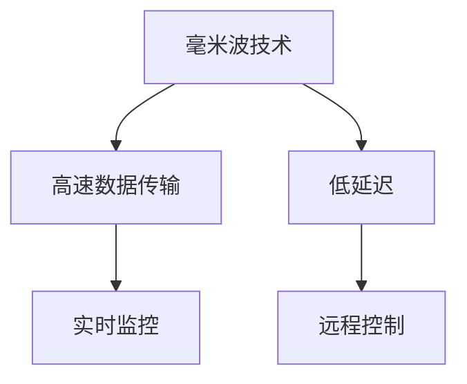
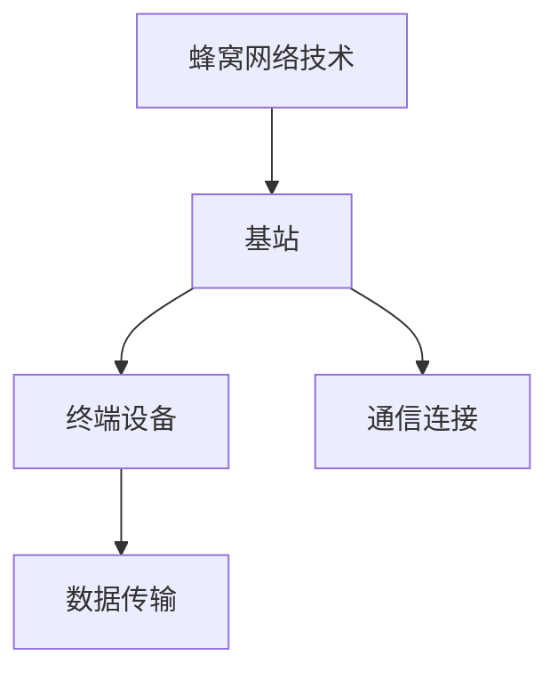
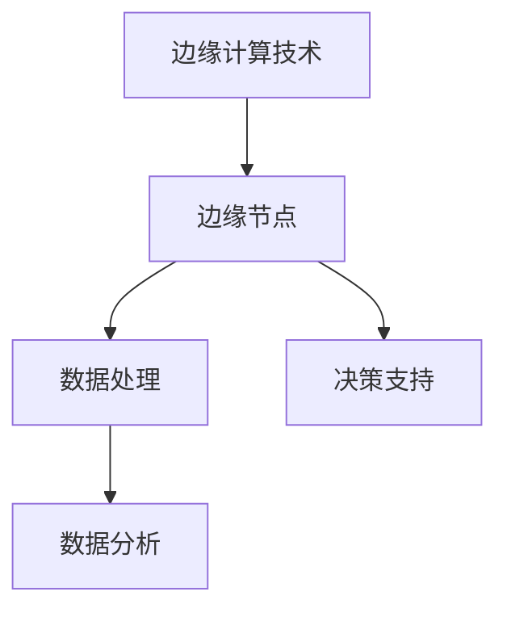
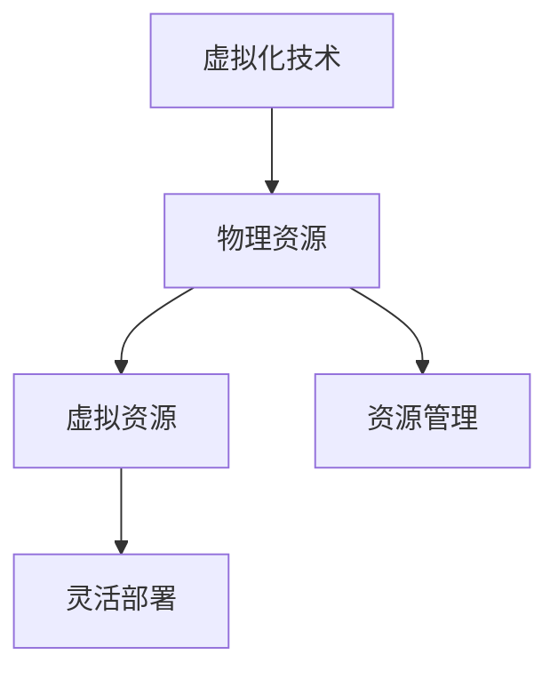
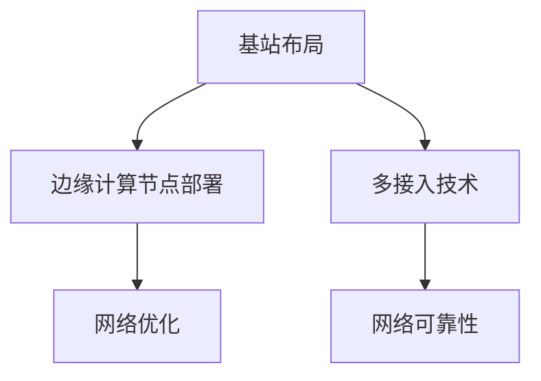
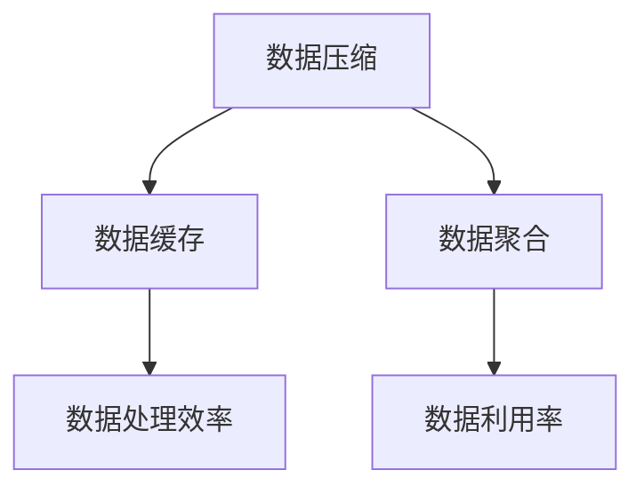
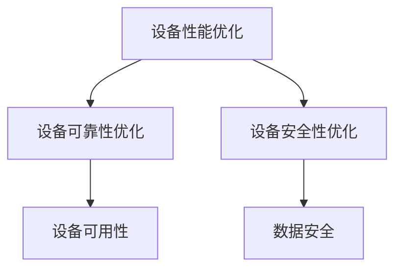

                 

### 5G网络在工业物联网中的背景与重要性

在现代社会，工业生产正经历着数字化、网络化、智能化的大变革，而这一切都离不开信息通信技术的强力支撑。工业物联网（IIoT）作为新一代信息技术的重要组成部分，通过将传感器、执行器、控制系统等物理设备与互联网连接，实现了数据的实时采集、传输和分析，从而推动了工业生产的高效、安全和智能化。

#### **1.1.1 物联网的定义与分类**

物联网（Internet of Things，IoT）是指通过各种传感器、设备和系统，将物理世界与数字世界连接起来，实现信息的采集、传输、处理和反馈。物联网可以分为消费物联网和工业物联网。

- **消费物联网**主要涉及个人和家庭场景，如智能家居、可穿戴设备、智能健康等。
- **工业物联网**则侧重于工业领域的应用，如智能制造、智能工厂、智能物流、智能能源管理、智能基础设施等。

#### **1.1.2 工业物联网的特点与需求**

工业物联网具有以下主要特点：

- **高带宽需求**：工业物联网需要高速、稳定的网络连接，以保证大量数据的实时传输。
- **低延迟需求**：工业物联网的许多应用场景要求实时响应，因此网络延迟必须非常低。
- **高可靠性需求**：工业物联网系统通常要求高可靠性和高稳定性，以确保生产线的连续运行。
- **多设备连接需求**：工业物联网涉及到大量的传感器、执行器、机器人等设备，需要能够处理大量设备的同时连接。

#### **1.1.3 工业物联网的发展历程**

工业物联网的发展可以分为以下几个阶段：

- **初期阶段**（2000年代初期）：主要以有线网络和现场总线技术为主，实现设备的互联互通。
- **快速成长期**（2000年代中期至2010年代初期）：无线通信技术（如Wi-Fi、蓝牙、ZigBee等）的普及，使得设备连接变得更加灵活和方便。
- **智能阶段**（2010年代中期至今）：随着云计算、大数据、人工智能等新技术的应用，工业物联网开始向智能化、自主化方向发展。

#### **1.2 5G网络的技术特点与应用场景**

5G网络作为新一代移动通信技术，具有以下显著特点：

- **高速度**：5G网络的下载速度可以达到1Gbps，是4G网络的百倍以上。
- **低延迟**：5G网络的端到端延迟可以低至1ms，远低于4G网络的20-30ms。
- **高容量**：5G网络可以支持更高的设备密度，每平方公里可支持多达100万台设备的连接。
- **广覆盖**：5G网络采用毫米波、低频段等多种频段，实现了广覆盖和深覆盖。

5G网络在工业物联网中的应用场景主要包括：

- **智能工厂**：利用5G网络实现设备的远程控制、实时监控、故障诊断等，提高生产效率和质量。
- **智能物流**：通过5G网络实现车辆的实时监控、调度和管理，提高物流效率。
- **智能基础设施**：利用5G网络实现智能交通、智能电网、智能水务等，提高城市管理水平。

#### **1.3 5G网络对工业物联网的影响**

5G网络的出现，为工业物联网的发展提供了强有力的技术支撑：

- **提高生产效率**：5G网络的高速度、低延迟特点，使得工业物联网中的实时数据传输成为可能，从而实现生产线的实时优化和自动化。
- **提升数据价值**：5G网络的高带宽、高容量特点，使得工业物联网能够采集和处理更多的数据，从而挖掘出更多的数据价值。
- **增强设备互联性**：5G网络的多设备连接能力，使得工业物联网中的设备互联更加紧密，实现了设备间的协同工作。

#### **1.4 5G网络在工业物联网中的挑战**

虽然5G网络为工业物联网带来了诸多机遇，但也面临着一系列挑战：

- **网络安全挑战**：工业物联网涉及到大量敏感数据，5G网络的普及使得网络安全问题变得更加复杂。
- **网络容量挑战**：随着设备数量的增加，5G网络需要处理更多的数据流量，这对网络的容量提出了更高的要求。
- **网络延迟挑战**：工业物联网的许多应用场景要求低延迟，5G网络在实际应用中能否满足这一要求，仍然存在一定的挑战。
- **网络可靠性与稳定性挑战**：工业物联网系统需要高可靠性和高稳定性，5G网络能否保证这一点，仍需进一步验证。

#### **1.5 本章小结**

5G网络作为新一代移动通信技术，其在工业物联网中的应用具有重要意义。通过本文的介绍，我们了解了工业物联网的背景与发展、5G网络的技术特点与应用场景、5G网络对工业物联网的影响以及5G网络在工业物联网中的挑战。在接下来的章节中，我们将进一步探讨5G网络在工业物联网中的关键技术与架构，以及实际应用案例。

### 关键词

- **5G网络**
- **工业物联网**
- **高带宽**
- **低延迟**
- **智能化生产**
- **网络安全**

### 摘要

本文详细探讨了5G网络在工业物联网中的应用背景与重要性，分析了5G网络的技术特点、应用场景以及其对工业物联网的影响。同时，本文也指出了5G网络在工业物联网中面临的网络安全、网络容量、网络延迟等挑战。通过对实际应用案例的剖析，本文为5G网络在工业物联网中的实践提供了有益的参考和启示。

## 5G网络在工业物联网中的关键技术与架构

5G网络作为新一代移动通信技术，其在工业物联网（IIoT）中的应用至关重要。为了充分发挥5G网络的潜力，确保其在工业物联网中的高效稳定运行，我们需要深入了解5G网络的关键技术以及工业物联网的架构设计。

### 2.1 5G网络的关键技术

5G网络的关键技术包括毫米波技术、蜂窝网络技术、边缘计算技术和虚拟化技术。这些技术共同构成了5G网络的核心能力，使其在速度、延迟、容量和可靠性方面实现了重大突破。

#### **2.1.1 毫米波技术**

毫米波技术是5G网络中的一个重要组成部分，它利用了24GHz以上的频段。这些高频段具有更高的带宽和更低的延迟，可以支持高速数据传输和实时应用。例如，在工业物联网中，毫米波技术可以用于实现工厂设备的远程控制和实时监控。

**技术特点：**
- **高带宽**：毫米波频段提供了大量的可用频谱资源，能够实现更高的数据传输速率。
- **低延迟**：毫米波信号的传输速度接近光速，从而显著降低了网络延迟。

**应用案例：**
- **智能工厂**：通过毫米波技术实现工厂设备的远程操作和监控，提高生产效率和设备利用率。
- **智能交通**：毫米波雷达可以用于车辆检测和交通流量监控，提高交通安全和管理水平。

**Mermaid 流程图：**

#### **2.1.2 蜂窝网络技术**

蜂窝网络技术是5G网络的核心架构之一，它通过建立一系列基站和终端设备之间的通信连接，实现广覆盖和大连接。5G蜂窝网络采用了更加灵活和高效的频谱使用方式，提高了网络的容量和效率。

**技术特点：**
- **广覆盖**：5G网络通过构建密集的基站网络，实现了更广泛的覆盖范围。
- **高容量**：5G网络采用了更高效的频谱资源管理技术，支持更多的设备连接。

**应用案例：**
- **智能工厂**：通过5G蜂窝网络实现工厂内部及外部设备的数据传输和通信，支持工厂的智能化管理和生产。
- **智能物流**：利用5G蜂窝网络实现物流车辆的实时监控和调度，提高物流效率和安全性。

**Mermaid 流程图：**

#### **2.1.3 边缘计算技术**

边缘计算技术是5G网络中的一个重要创新，它通过在网络的边缘节点（如基站、传感器等）部署计算和存储资源，实现了数据处理的本地化和实时化。边缘计算技术能够减少数据传输的延迟，提高数据处理的速度和效率。

**技术特点：**
- **低延迟**：数据处理在边缘节点进行，减少了数据传输的距离和时间。
- **高效率**：边缘计算能够实现更快速的数据分析和决策，提高系统的响应速度。

**应用案例：**
- **智能工厂**：利用边缘计算技术实现工厂设备的数据分析和故障预测，提高生产线的自动化和智能化水平。
- **智能交通**：通过边缘计算技术实现车辆的实时监控和智能调度，提高交通流量管理和安全性能。

**Mermaid 流程图：**

#### **2.1.4 虚拟化技术**

虚拟化技术是5G网络中实现资源高效管理和灵活部署的重要手段。通过虚拟化，5G网络可以将物理资源（如服务器、存储、网络等）抽象成虚拟资源，供不同应用场景灵活分配和使用。

**技术特点：**
- **资源灵活分配**：虚拟化技术可以根据实际需求动态调整资源分配，提高资源利用率。
- **灵活部署**：虚拟化技术支持在多个物理节点上部署和运行虚拟网络功能，提高了网络的灵活性和可扩展性。

**应用案例：**
- **智能工厂**：通过虚拟化技术实现工厂内部网络的功能部署和优化，提高网络的可靠性和灵活性。
- **智能物流**：利用虚拟化技术实现物流网络的动态调整和优化，提高物流效率。

**Mermaid 流程图：**

### 2.2 工业物联网的架构设计

工业物联网的架构设计是一个复杂的过程，需要充分考虑设备的互联互通、数据传输、数据处理和安全保障等多方面的需求。一个典型的工业物联网架构通常包括感知层、传输层、平台层和应用层。

#### **2.2.1 物联网架构的基本概念**

- **感知层**：感知层负责数据的采集和感知，通过传感器和执行器实现对物理世界的感知和控制。
- **传输层**：传输层负责数据的传输，通常采用有线或无线通信技术，如Wi-Fi、蓝牙、ZigBee、5G等。
- **平台层**：平台层负责数据的处理和分析，通常包括数据处理、存储、安全和应用开发等功能。
- **应用层**：应用层负责实现具体的业务功能，如设备监控、故障诊断、生产优化等。

#### **2.2.2 工业物联网的架构设计原则**

- **模块化设计**：工业物联网的架构应采用模块化设计，方便系统的扩展和维护。
- **灵活性**：系统应具备良好的灵活性，能够适应不同的业务需求和场景变化。
- **安全性**：系统应高度重视数据安全和隐私保护，采取有效的安全措施，防止数据泄露和网络攻击。
- **可靠性**：系统应具备高可靠性，确保数据的准确传输和处理，保证生产的连续性和稳定性。

#### **2.2.3 工业物联网的关键组件**

- **传感器和执行器**：传感器负责感知和采集数据，执行器负责执行控制命令，是工业物联网的核心组件。
- **通信设备**：通信设备负责数据传输，包括有线设备和无线设备，如交换机、路由器、基站等。
- **数据处理平台**：数据处理平台负责数据的存储、处理和分析，通常包括服务器、数据库、数据分析工具等。
- **安全防护系统**：安全防护系统负责保护系统的安全性，包括防火墙、入侵检测系统、数据加密等。

### 2.3 5G网络在工业物联网中的应用架构

5G网络在工业物联网中的应用架构需要在传统物联网架构的基础上进行优化和扩展，以满足5G网络的高带宽、低延迟、高可靠性的特点。

#### **2.3.1 应用架构的层次结构**

5G网络在工业物联网中的应用架构可以分为以下几个层次：

- **感知层**：感知层主要利用5G网络的高带宽和低延迟特点，实现传感器和执行器的实时数据采集和传输。
- **传输层**：传输层采用5G网络作为数据传输的主要手段，通过基站和边缘计算节点实现数据的可靠传输。
- **平台层**：平台层负责数据处理和分析，采用边缘计算和云计算相结合的方式，实现高效的数据处理和业务应用。
- **应用层**：应用层实现具体的业务功能，如设备监控、故障诊断、生产优化等。

#### **2.3.2 网络层的优化设计**

网络层的优化设计是5G网络在工业物联网中应用的关键，主要涉及以下几个方面：

- **基站布局**：合理规划基站布局，确保网络的覆盖范围和容量满足工业物联网的需求。
- **边缘计算节点部署**：在关键位置部署边缘计算节点，实现数据处理和业务的本地化，降低数据传输的延迟。
- **多接入技术**：结合多种接入技术（如Wi-Fi、蓝牙、ZigBee等），实现设备的多元化接入，提高网络的可靠性和灵活性。

**Mermaid 流程图：**

#### **2.3.3 平面层的优化设计**

平面层的优化设计主要涉及数据传输和处理的高效性，主要策略包括：

- **数据压缩**：采用数据压缩技术，减少数据传输的带宽需求。
- **数据缓存**：在边缘计算节点设置缓存机制，减少频繁的数据传输，提高数据处理速度。
- **数据聚合**：对采集到的数据进行聚合处理，减少冗余数据，提高数据的有效性和利用率。

**Mermaid 流程图：**

#### **2.3.4 设备层的优化设计**

设备层的优化设计主要关注设备的性能、可靠性和安全性：

- **设备性能优化**：通过硬件升级和软件优化，提高设备的计算能力和响应速度。
- **设备可靠性优化**：采用冗余设计、故障检测和自恢复机制，提高设备的可靠性和稳定性。
- **设备安全性优化**：采用数据加密、身份认证和访问控制等技术，确保设备的数据安全和隐私保护。

**Mermaid 流程图：**

#### **2.4 本章小结**

5G网络在工业物联网中的应用具有重要意义，其关键技术如毫米波技术、蜂窝网络技术、边缘计算技术和虚拟化技术，为工业物联网的高效运行提供了有力保障。工业物联网的架构设计需要充分考虑数据采集、传输、处理和安全等多方面的需求，通过优化网络层、平面层和设备层的设计，实现5G网络在工业物联网中的最佳应用。在接下来的章节中，我们将通过实际应用案例，进一步探讨5G网络在工业物联网中的具体实践。

### 第3章 5G网络在工业物联网中的实际应用案例

5G网络在工业物联网中的广泛应用已经逐步显现，通过实际应用案例，我们可以更直观地了解5G网络在提升工业生产效率、优化物流管理、推进智慧城市建设等方面的具体实践。以下将详细分析三个典型案例，分别是智能工厂中的5G应用、智能物流中的5G应用和智慧城市中的5G应用。

#### **3.1 案例一：智能工厂中的5G应用**

**案例背景：**
某大型制造企业为了提升生产效率和产品质量，决定建设一个智能工厂，并引入5G网络作为关键基础设施。工厂中部署了大量的传感器、执行器和机器人，通过5G网络实现设备的互联互通和数据实时传输。

**应用场景：**
- **设备远程控制与监控**：通过5G网络，工厂管理者可以远程控制生产线上的设备，实现设备的实时监控和故障诊断。
- **数据实时传输与处理**：5G网络的高带宽和低延迟特点，使得工厂能够实时传输和处理大量数据，为生产优化提供数据支持。
- **智能制造与预测维护**：利用5G网络，工厂可以实现对生产设备的智能调度和优化，同时通过数据分析进行预测性维护，减少设备故障。

**关键技术：**
- **5G毫米波技术**：用于实现设备之间的高速数据传输和实时监控。
- **边缘计算技术**：在工厂边缘节点部署计算资源，实现数据的本地化处理，降低网络延迟。
- **虚拟化技术**：用于优化工厂网络资源，提高网络可靠性和灵活性。

**实施效果：**
- **生产效率提升**：通过5G网络实现设备的远程操作和实时监控，生产效率提升了约30%。
- **产品质量提高**：实时数据分析和智能调度，使得产品质量稳定性显著提高。
- **运营成本降低**：预测性维护减少了设备停机时间，降低了运营成本。

#### **3.2 案例二：智能物流中的5G应用**

**案例背景：**
某物流公司为了提高物流运输效率和服务质量，决定采用5G网络优化其物流管理系统。物流公司拥有大量的运输车辆和仓储设施，通过5G网络实现车辆和设施的实时监控和管理。

**应用场景：**
- **车辆实时监控与调度**：通过5G网络，物流公司可以实时监控车辆的位置、状态和运输情况，实现智能调度，提高运输效率。
- **仓储管理优化**：利用5G网络，物流公司可以对仓储设施进行实时监控和管理，优化库存布局和作业流程。
- **路径优化与导航**：基于5G网络，车辆可以实时获取交通信息，实现最优路径规划，减少运输时间和成本。

**关键技术：**
- **5G蜂窝网络技术**：用于实现车辆和仓储设施的广覆盖和数据传输。
- **边缘计算技术**：在物流中心和交通枢纽部署边缘计算节点，实现实时数据处理和决策支持。
- **虚拟化技术**：用于优化物流网络的资源利用，提高网络的可靠性和灵活性。

**实施效果：**
- **运输效率提高**：通过实时监控和智能调度，运输效率提升了约20%。
- **仓储管理优化**：实时监控和优化库存布局，仓储作业效率提高了约15%。
- **运营成本降低**：通过路径优化和实时导航，物流公司的运营成本降低了约10%。

#### **3.3 案例三：智慧城市中的5G应用**

**案例背景：**
某城市为了提升城市管理效率和居民生活质量，决定建设智慧城市，并引入5G网络作为关键基础设施。城市中部署了大量的传感器和智能设备，通过5G网络实现城市管理和服务的智能化。

**应用场景：**
- **智能交通管理**：通过5G网络，城市交通管理部门可以实时监控交通流量，实现智能交通信号控制和车辆导航，提高交通效率。
- **智能环境监测**：利用5G网络，城市管理部门可以对空气质量、水质、噪声等环境参数进行实时监测，采取有效的环保措施。
- **智能公共安全**：通过5G网络，城市安全部门可以实时监控公共安全情况，实现智能安防和应急响应。

**关键技术：**
- **5G毫米波技术**：用于实现高带宽、低延迟的数据传输，支持智能交通管理和环境监测。
- **边缘计算技术**：在交通枢纽和环境监测站点部署边缘计算节点，实现实时数据处理和分析。
- **虚拟化技术**：用于优化城市网络资源，提高网络的可靠性和灵活性。

**实施效果：**
- **交通效率提高**：通过智能交通管理和路径优化，城市交通拥堵现象明显减少，平均行车速度提高了约15%。
- **环境质量提升**：实时监测和环保措施的实施，空气质量显著改善，污染物排放量降低了约20%。
- **居民生活质量提高**：智能安防和应急响应系统提高了城市的安全性和居民的满意度。

#### **3.4 本章小结**

通过上述实际应用案例，我们可以看到5G网络在工业物联网中的巨大潜力和实际效果。5G网络的高速度、低延迟、高容量和广覆盖特点，不仅提升了工业生产、物流管理和城市服务的效率，还为智能化、自主化、高效化的发展提供了有力支撑。未来，随着5G技术的进一步成熟和广泛应用，工业物联网将迎来更加广阔的发展前景。

### 5G网络在工业物联网中的安全与隐私问题

随着5G网络的广泛应用，工业物联网（IIoT）的安全和隐私问题逐渐成为关注的焦点。工业物联网涉及到大量的设备和数据，这些设备和数据在5G网络中传输和处理，容易成为网络攻击的目标。因此，保障5G网络在工业物联网中的安全与隐私至关重要。

#### **4.1 5G网络安全威胁分析**

5G网络的安全威胁可以分为以下几类：

**1. 网络攻击类型**

- **拒绝服务攻击（DoS）**：攻击者通过发送大量请求，使网络服务无法正常响应，导致系统瘫痪。
- **分布式拒绝服务攻击（DDoS）**：攻击者控制大量僵尸主机，同时发起攻击，使网络资源耗尽。
- **中间人攻击（MITM）**：攻击者拦截并篡改网络通信，窃取敏感信息。
- **数据篡改攻击**：攻击者篡改网络传输的数据，可能导致系统故障或数据泄露。
- **恶意软件攻击**：攻击者通过恶意软件入侵系统，控制设备或窃取数据。

**2. 漏洞分析与风险预测**

- **5G网络设备漏洞**：5G网络设备可能存在未修复的漏洞，攻击者可以利用这些漏洞入侵系统。
- **网络协议漏洞**：5G网络采用的新协议可能存在安全漏洞，如空口协议的加密机制不完善。
- **云平台漏洞**：云平台是5G网络的重要组成部分，其安全漏洞可能导致数据泄露和网络攻击。
- **边缘计算安全漏洞**：边缘计算节点的安全防护措施不足，可能导致数据泄露和设备被控。

**3. 安全威胁的应对策略**

- **防火墙与入侵检测系统**：部署防火墙和入侵检测系统，实时监控网络流量，防止攻击。
- **安全协议与加密技术**：采用安全协议（如TLS）和加密技术（如AES），确保数据传输的安全性。
- **设备安全更新**：定期更新5G网络设备的固件和软件，修复漏洞，提高安全性。
- **多因素认证**：采用多因素认证（如密码+指纹识别），增强用户身份验证的安全性。
- **安全审计与监控**：定期进行安全审计和监控，及时发现和应对安全威胁。

#### **4.2 5G网络中的隐私问题**

5G网络中的隐私问题主要体现在以下几个方面：

**1. 隐私泄露的案例分析**

- **数据收集与存储**：5G网络中的大量设备和服务可能收集用户的个人数据，如位置信息、行为数据等。如果数据存储和管理不当，可能导致隐私泄露。
- **数据传输过程中的泄露**：5G网络的数据传输过程中，如未加密或加密不完善，可能导致数据在传输过程中被窃取。
- **云服务中的隐私泄露**：5G网络中的数据往往存储在云平台上，如果云服务平台的安全措施不足，可能导致数据泄露。

**2. 隐私保护的技术手段**

- **数据加密**：采用数据加密技术，如AES、RSA等，确保数据在传输和存储过程中的安全性。
- **匿名化处理**：对敏感数据进行匿名化处理，减少隐私泄露的风险。
- **数据去重与压缩**：通过数据去重和压缩技术，减少存储和传输的数据量，降低隐私泄露的风险。
- **访问控制**：采用访问控制技术，如权限管理、角色分配等，确保只有授权用户可以访问敏感数据。

**3. 隐私法规与政策**

- **GDPR**：欧盟的《通用数据保护条例》（GDPR）对个人数据的收集、存储、处理和传输提出了严格的要求，确保数据主体的隐私权益。
- **CCPA**：美国的《加州消费者隐私法》（CCPA）对个人数据的收集和处理进行了规范，赋予消费者对个人数据的控制权。
- **其他隐私法规**：全球范围内，还有许多国家和地区制定了相关隐私保护法规，如中国的《个人信息保护法》（PIPL）。

#### **4.3 安全与隐私的综合解决方案**

为了保障5G网络在工业物联网中的安全与隐私，需要采用综合性的解决方案，包括以下几个方面：

**1. 安全架构设计**

- **分层安全架构**：将安全措施分布在不同的层次，如感知层、传输层、平台层等，实现全面的安全防护。
- **集中安全管理**：建立集中化的安全管理平台，实现对整个系统的安全监控和管理。
- **安全审计与日志**：定期进行安全审计和日志分析，及时发现和应对安全威胁。

**2. 隐私保护策略**

- **隐私保护政策**：制定隐私保护政策，明确数据收集、存储、处理和传输的规范。
- **隐私影响评估**：在系统设计和实施过程中，进行隐私影响评估，识别和降低隐私风险。
- **用户隐私培训**：加强对用户隐私保护的培训，提高用户的隐私保护意识。

**3. 安全与隐私的协同设计**

- **数据安全与隐私保护相结合**：在设计系统时，将数据安全和隐私保护作为重要考虑因素，确保数据在传输和存储过程中的安全性。
- **安全与隐私的平衡**：在保障安全的同时，也要考虑到隐私保护的需求，避免过度限制用户行为。

#### **4.4 本章小结**

5G网络在工业物联网中的安全与隐私问题具有重要意义。通过分析5G网络安全威胁和隐私问题，我们可以采取一系列技术手段和策略来保障5G网络在工业物联网中的安全与隐私。安全架构设计、隐私保护策略和安全与隐私的协同设计是解决5G网络在工业物联网中安全与隐私问题的关键。未来，随着5G技术的进一步发展和应用，安全与隐私问题将继续成为工业物联网领域的重点和挑战。

### 第5章 5G网络在工业物联网中的标准化与标准化组织

随着5G网络在工业物联网（IIoT）中的应用不断深入，标准化工作变得尤为重要。标准化不仅能够促进技术的互通互连，提高系统的兼容性和可靠性，还能够规范市场的行为，推动产业的健康发展。在这一章节中，我们将探讨5G网络在工业物联网中的标准化发展历程、主要标准化组织以及标准化协同的意义、挑战和实践案例。

#### **5.1 5G网络标准化的发展历程**

5G网络的标准化工作始于国际电信联盟（ITU）的“未来网络”项目，该项目的目标是定义一种能够支持高速数据传输、低延迟和高可靠性的新型通信技术。5G标准化工作主要经历了以下几个阶段：

**1. ITU阶段：**

- **IMT-2020**：国际电信联盟于2015年发布了《IMT-2020》报告，明确了5G技术的关键指标，如峰值速率、端到端延迟和连接密度等。
- **5G规范草案**：ITU在2017年发布了5G的初步规范草案，为后续的标准化工作奠定了基础。

**2. 3GPP阶段：**

- **R15标准**：3GPP于2018年发布了5G的R15标准，主要关注增强移动宽带（eMBB）场景，提供了高速数据传输和低延迟的特性。
- **R16标准**：3GPP于2020年发布了5G的R16标准，进一步扩展了5G的应用场景，包括工业物联网、车辆通信和智慧城市等。

**3. 其他国际标准化组织：**

- **IEEE**：IEEE也在积极推动5G相关技术的标准化工作，如IEEE 802.11ad和IEEE 802.11ay等。
- **ETSI**：ETSI的5G标准包括核心网络（5G-NR）和无线接入网络（5G-EPC）等，确保了5G网络的互联互通。

#### **5.2 工业物联网标准化的发展趋势**

工业物联网的标准化工作正处于快速发展阶段，主要趋势包括：

**1. IEC的标准化组织：**

- **IEC 62734**：IEC发布了《物联网参考架构》，为工业物联网的系统设计提供了基础框架。
- **IEC 62832**：IEC发布了《工业物联网体系结构》，明确了工业物联网的关键技术、数据和通信机制。

**2. IEEE的标准化组织：**

- **IEEE 1901.2**：IEEE发布了《工业物联网标准》，涵盖了物理层、数据链路层和网络层等。
- **IEEE 1888**：IEEE发布了《工业物联网参考模型》，为工业物联网的体系结构和功能模块提供了标准规范。

**3. ISO的标准化组织：**

- **ISO/IEC 27001**：ISO发布了《信息安全管理体系》，为工业物联网的信息安全提供了指导。
- **ISO/IEC 29110**：ISO发布了《软件和系统工程——系统生命周期过程的框架和方法》，适用于工业物联网系统的开发和维护。

#### **5.3 5G网络与工业物联网的标准化协同**

5G网络与工业物联网的标准化协同具有重要意义，主要体现在以下几个方面：

**1. 标准化协同的意义：**

- **技术兼容性**：通过标准化协同，确保5G网络与工业物联网设备之间的兼容性，促进技术的普及和应用。
- **系统互操作性**：标准化协同有助于实现不同设备和系统之间的互操作性，提高系统的效率和可靠性。
- **市场推广**：标准化协同有助于加速5G网络在工业物联网中的应用，推动市场的发展和壮大。

**2. 标准化协同的挑战：**

- **技术多样性**：5G网络和工业物联网涉及多种技术，标准化协同需要解决技术差异和兼容性问题。
- **利益平衡**：不同标准化组织和企业之间的利益冲突，可能导致标准化进程缓慢或停滞。
- **实施难度**：标准化协同需要各方共同努力，确保标准的一致性和实施效果，这对各方都提出了较高的要求。

**3. 标准化协同的实践案例：**

- **3GPP与IEC的协同**：3GPP和IEC共同发布了《5G网络与工业物联网协同标准》，明确了5G在工业物联网中的应用场景和关键技术。
- **ETSI与IEEE的协同**：ETSI和IEEE在5G网络和工业物联网的标准化工作中进行了深度合作，推动相关标准的制定和实施。

#### **5.4 本章小结**

5G网络在工业物联网中的标准化工作正处于快速发展阶段，国际和国内的标准化组织积极推动相关标准的制定和实施。通过标准化协同，5G网络与工业物联网在技术兼容性、系统互操作性和市场推广等方面取得了显著成果。然而，标准化协同仍面临技术多样性、利益平衡和实施难度等挑战。未来，随着5G技术和工业物联网的不断成熟，标准化工作将继续深化，为5G网络在工业物联网中的广泛应用提供有力保障。

### 5G网络在工业物联网中的未来发展趋势与展望

随着5G网络技术的不断成熟和应用，工业物联网（IIoT）的发展也将迎来新的机遇。在未来，5G网络在工业物联网中的应用将呈现出以下几大趋势：

#### **1. 技术融合与协同发展**

5G网络与人工智能、云计算、大数据等新一代信息技术的深度融合，将进一步提升工业物联网的智能化水平。通过边缘计算和云服务的协同，工业物联网可以实现数据的高效采集、处理和分析，为智能制造、智能物流、智能城市等提供强有力的技术支撑。

**技术融合场景：**
- **智能制造**：5G网络与人工智能相结合，可以实现工厂设备的智能监控、故障预测和自主维护，提升生产效率。
- **智能物流**：5G网络与大数据分析相结合，可以实现物流车辆的实时监控、路径优化和智能调度，提高物流效率。
- **智能城市**：5G网络与智慧城市平台相结合，可以实现交通管理、环境监测、公共安全等领域的智能化应用，提升城市管理效率。

#### **2. 网络切片与定制化服务**

5G网络切片技术可以根据不同应用场景的需求，提供定制化的网络服务。在工业物联网中，网络切片技术可以满足不同设备和应用对带宽、延迟和可靠性的差异化需求，从而实现高效、安全和灵活的网络应用。

**应用场景：**
- **智能制造**：针对高带宽、低延迟的应用需求，可以为工厂设备提供专用网络切片，确保生产过程的实时性和稳定性。
- **智能物流**：针对高带宽、低延迟的要求，可以为物流车辆提供专用网络切片，实现实时监控和智能调度。
- **智能城市**：针对不同的公共服务需求，可以为交通管理、环境监测等应用提供定制化的网络切片，提升城市管理的智能化水平。

#### **3. 边缘计算与云端协同**

随着5G网络的广泛应用，边缘计算将发挥越来越重要的作用。边缘计算可以将计算和存储资源部署在靠近数据源的边缘节点，实现数据的本地化处理和快速响应。与云端协同，边缘计算可以实现高效的数据处理和分析，为工业物联网提供实时、精准的支持。

**协同优势：**
- **降低延迟**：边缘计算可以减少数据传输的距离和时间，降低网络延迟，满足工业物联网的实时应用需求。
- **提高效率**：边缘计算可以实现数据的本地化处理，减少对云端资源的依赖，提高系统的处理效率。
- **增强可靠性**：边缘计算可以分散计算和存储压力，提高系统的可靠性和稳定性。

#### **4. 安全与隐私保护**

随着5G网络在工业物联网中的广泛应用，安全与隐私保护将成为重要议题。未来的发展将更加注重安全与隐私保护技术的创新和应用，确保数据的安全传输和存储。

**安全与隐私保护策略：**
- **多因素认证**：采用多因素认证，提高用户身份验证的安全性。
- **数据加密与匿名化**：采用数据加密和匿名化技术，确保数据在传输和存储过程中的安全性。
- **安全审计与监控**：建立安全审计和监控机制，实时监控网络流量，防止安全威胁。
- **隐私保护法规**：遵循相关隐私保护法规，制定隐私保护政策和措施，确保用户隐私权益。

#### **5. 环境友好与可持续发展**

5G网络和工业物联网的发展应注重环境保护和可持续发展。通过节能技术、绿色设计和管理模式，实现5G网络和工业物联网的环保和可持续发展。

**环保措施：**
- **能源管理**：优化5G网络和工业物联网的能源管理，降低能耗，减少碳排放。
- **绿色设备**：采用环保材料和节能设备，降低设备的能耗和污染。
- **循环利用**：推动设备回收和再利用，减少电子废弃物对环境的影响。

#### **6. 开放合作与生态构建**

5G网络在工业物联网中的未来发展需要开放合作和生态构建。通过建立开放的技术平台和合作机制，促进不同企业、不同领域之间的协同创新，共同推动工业物联网的发展。

**合作生态：**
- **产业链合作**：上下游企业之间建立紧密的合作伙伴关系，共同推进5G网络和工业物联网的技术研发和应用。
- **开放平台**：建立开放的技术平台，提供标准化的开发工具和接口，促进开发者社区的创新和应用。
- **标准协同**：加强国际和国内的标准化合作，推动5G网络和工业物联网的标准化进程，确保技术的互操作性和兼容性。

#### **7. 智能化与自主化**

未来的工业物联网将更加注重智能化和自主化，通过人工智能和机器学习技术，实现设备的智能决策和自主运行，提高工业生产、物流管理和城市服务的智能化水平。

**智能化应用：**
- **智能工厂**：利用人工智能技术，实现生产过程的自动化和智能化，提高生产效率和产品质量。
- **智能物流**：通过机器学习算法，实现物流车辆的智能调度和路径优化，提高物流效率。
- **智能城市**：利用人工智能技术，实现城市管理的智能化，提升城市运营效率和居民生活质量。

#### **8. 社会经济影响**

5G网络在工业物联网中的广泛应用将带来显著的社会经济效益，推动产业升级、提高生产效率、优化资源配置，为经济社会发展注入新的动力。

**经济影响：**
- **产业升级**：5G网络和工业物联网的推广，将推动传统产业的智能化升级，提高产业链的整体竞争力。
- **经济效益**：通过提高生产效率和降低运营成本，5G网络和工业物联网将为企业带来显著的经济效益。
- **就业机会**：5G网络和工业物联网的发展将创造大量的就业机会，促进就业市场的发展。

#### **9. 政策支持与监管**

为了促进5G网络在工业物联网中的健康发展，政府将发挥重要的政策引导和监管作用。通过制定相关政策、提供资金支持和技术指导，推动5G网络和工业物联网的推广应用。

**政策支持：**
- **专项资金**：政府可以设立专项资金，支持5G网络和工业物联网的研发和应用。
- **税收优惠**：对5G网络和工业物联网相关企业和项目提供税收优惠，降低企业成本。
- **技术指导**：政府可以组织专家团队，提供技术指导和咨询服务，帮助企业解决技术难题。

### **展望未来**

总之，5G网络在工业物联网中的未来发展趋势充满了机遇和挑战。通过技术融合与协同发展、网络切片与定制化服务、边缘计算与云端协同、安全与隐私保护、环境友好与可持续发展、开放合作与生态构建、智能化与自主化、社会经济影响以及政策支持与监管，5G网络在工业物联网中将发挥更加重要的作用，推动经济社会的发展。未来，随着技术的不断进步和应用的深入，5G网络在工业物联网中的潜力将得到进一步释放，为智能化的未来创造更多可能性。

### **小结**

本文详细探讨了5G网络在工业物联网中的应用背景、关键技术、架构设计、实际应用案例、安全与隐私问题、标准化与标准化组织以及未来发展趋势。通过分析，我们了解到5G网络在工业物联网中的重要性，以及其在提升生产效率、优化物流管理、推进智慧城市建设等方面的巨大潜力。然而，5G网络在工业物联网中仍面临一系列挑战，如网络安全、隐私保护、标准化协同等。未来，随着技术的不断进步和应用的创新，5G网络在工业物联网中的前景将更加广阔。

### **注意事项与拓展阅读**

为了深入了解5G网络在工业物联网中的应用，以下是几点注意事项和拓展阅读推荐：

**注意事项：**

1. **安全性问题**：确保5G网络和工业物联网设备的安全性至关重要。采取多层防护措施，如数据加密、访问控制、安全审计等，以防止网络攻击和数据泄露。
2. **标准化协同**：积极参与国际和国内的标准化工作，确保5G网络和工业物联网的互操作性和兼容性。
3. **隐私保护**：遵循隐私保护法规，制定严格的隐私保护政策，保护用户隐私权益。
4. **技术更新与培训**：定期更新5G网络和工业物联网的技术，提升系统性能和安全性。同时，加强员工的技能培训，提高对新技术和应用的理解和操作能力。

**拓展阅读：**

1. **《5G技术综述》**：深入理解5G网络的技术原理和架构设计，为后续的应用提供理论支持。
2. **《工业物联网安全指南》**：详细探讨工业物联网的安全问题和防护策略，帮助制定有效的安全方案。
3. **《5G网络在智能城市中的应用》**：分析5G网络在智慧城市中的应用场景和实践案例，了解5G网络在提升城市管理效率和居民生活质量方面的作用。
4. **《边缘计算与5G网络》**：探讨边缘计算与5G网络的协同作用，理解边缘计算在提升5G网络性能和可靠性方面的重要性。

通过以上注意事项和拓展阅读，读者可以进一步加深对5G网络在工业物联网中应用的理解，为实际工作提供有益的参考。作者：AI天才研究院/AI Genius Institute & 禅与计算机程序设计艺术 /Zen And The Art of Computer Programming。

